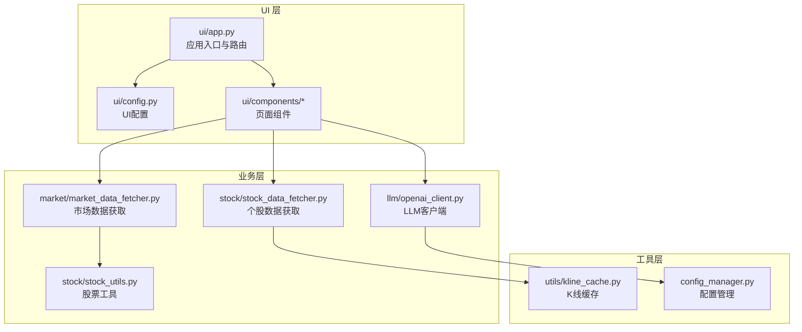
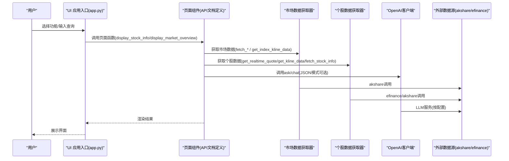
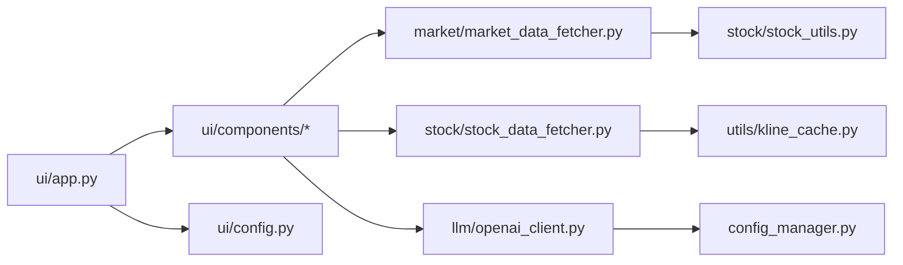

# API参考

<cite>
**本文引用的文件**
- [API 文档](file://ui/components/API_DOCUMENTATION.md)
- [OpenAI 客户端](file://llm/openai_client.py)
- [市场数据获取器](file://market/market_data_fetcher.py)
- [个股数据获取器](file://stock/stock_data_fetcher.py)
- [UI 应用入口](file://ui/app.py)
- [UI 配置](file://ui/config.py)
- [配置管理器](file://config_manager.py)
- [股票工具库](file://stock/stock_utils.py)
- [K线缓存管理器](file://utils/kline_cache.py)
</cite>

## 目录
1. [简介](#简介)
2. [项目结构](#项目结构)
3. [核心组件](#核心组件)
4. [架构总览](#架构总览)
5. [详细组件分析](#详细组件分析)
6. [依赖关系分析](#依赖关系分析)
7. [性能与使用限制](#性能与使用限制)
8. [故障排查指南](#故障排查指南)
9. [结论](#结论)

## 简介
本文件面向使用者与开发者，系统化梳理本项目的交互式API与内部服务API，涵盖：
- UI组件接口（基于Streamlit的交互式页面）
- 内部服务API：OpenAI客户端、市场数据获取器、个股数据获取器
- 数据来源与外部API交互方式
- 返回数据结构与典型使用场景
- 使用限制、最佳实践与常见问题排查

## 项目结构
项目采用模块化组织，UI层负责交互，业务层负责数据获取与处理，工具层提供缓存与通用算法。

**图表来源**
- [UI 应用入口](file://ui/app.py#L1-L229)
- [UI 配置](file://ui/config.py#L1-L82)
- [OpenAI 客户端](file://llm/openai_client.py#L1-L297)
- [市场数据获取器](file://market/market_data_fetcher.py#L1-L607)
- [个股数据获取器](file://stock/stock_data_fetcher.py#L1-L546)
- [股票工具库](file://stock/stock_utils.py#L1-L311)
- [K线缓存管理器](file://utils/kline_cache.py#L1-L477)
- [配置管理器](file://config_manager.py#L1-L144)

**章节来源**
- [UI 应用入口](file://ui/app.py#L1-L229)
- [UI 配置](file://ui/config.py#L1-L82)

## 核心组件
- UI组件接口：提供个股分析、大盘分析、缓存管理、Token统计、系统设置等页面组件的函数签名、参数、返回值与使用示例。
- OpenAI客户端：封装LLM调用、参数选择、JSON模式、使用统计与日志记录。
- 市场数据获取器：统一获取市场情绪、涨跌停、估值、资金流、指数实时、融资融券等数据，并具备多源备份与统一缓存。
- 个股数据获取器：封装efinance数据源，提供实时行情、K线、财务与分红信息，并内置K线缓存策略。
- 股票工具库：提供技术指标计算、筹码分析、新闻抓取等辅助能力。
- K线缓存管理器：基于CSV的智能缓存，支持历史数据永久保存、近期数据按粒度过期。

**章节来源**
- [API 文档](file://ui/components/API_DOCUMENTATION.md#L1-L738)
- [OpenAI 客户端](file://llm/openai_client.py#L1-L297)
- [市场数据获取器](file://market/market_data_fetcher.py#L1-L607)
- [个股数据获取器](file://stock/stock_data_fetcher.py#L1-L546)
- [股票工具库](file://stock/stock_utils.py#L1-L311)
- [K线缓存管理器](file://utils/kline_cache.py#L1-L477)

## 架构总览
UI通过路由选择进入不同页面，页面组件调用业务层API获取数据，业务层对接外部数据源（akshare、efinance等），并在必要时使用缓存与日志记录。

**图表来源**
- [UI 应用入口](file://ui/app.py#L1-L229)
- [API 文档](file://ui/components/API_DOCUMENTATION.md#L1-L738)
- [市场数据获取器](file://market/market_data_fetcher.py#L1-L607)
- [个股数据获取器](file://stock/stock_data_fetcher.py#L1-L546)
- [OpenAI 客户端](file://llm/openai_client.py#L1-L297)

## 详细组件分析

### UI 组件接口（Streamlit 页面）
- 通用组件：技术指标展示、技术分析标签页、风险分析展示、K线图渲染。
- 个股分析组件：主显示函数、基本信息、基本面/技术面/新闻/筹码/公司/综合AI分析。
- 大盘分析组件：主界面、估值分析、资金流向、融资融券、市场情绪、技术分析。
- 系统设置组件：配置保存函数、配置项结构（OpenAI API、缓存、分析、用户画像）。
- 报告导出组件：核心导出函数、快速导出、批量导出、支持格式（PDF/DOCX/Markdown/HTML）。
- 缓存管理组件：个股/大盘/通用缓存清理选项与确认机制。
- Token统计组件：使用概览、模型分布、详细记录、时间范围选择。

典型使用场景
- 个股分析：输入股票代码，选择是否启用AI分析与缓存，页面组件组合调用数据获取器与LLM。
- 大盘分析：选择指数，页面组件调用市场数据获取器，渲染估值、资金流、情绪与技术分析。
- 报告导出：传入实体ID、报告类型与生成函数，页面组件生成并导出报告。

最佳实践
- 合理使用缓存避免重复请求
- 大数据集分页加载
- 图表数据适当采样
- 错误处理与友好提示
- 输入校验与XSS防护

**章节来源**
- [API 文档](file://ui/components/API_DOCUMENTATION.md#L1-L738)
- [UI 应用入口](file://ui/app.py#L1-L229)
- [UI 配置](file://ui/config.py#L1-L82)

### OpenAI 客户端（LLM 客户端）
- 初始化：从配置读取API密钥、基础URL、超时、最大重试、默认模型、推理模型与默认温度。
- ask(prompt, model, model_type, temperature, max_tokens, system_message, messages, json_mode, debug)：发送聊天请求，支持消息列表覆盖、JSON模式、使用统计与日志记录。
- chat(messages, model, model_type, temperature, max_tokens, json_mode, debug)：多轮对话，内部委托ask。
- get_usage_stats(days)：获取使用统计。
- export_usage_report(output_file)：导出使用报告。

参数与返回
- 参数：prompt、model、model_type、temperature、max_tokens、system_message、messages、json_mode、debug。
- 返回：字符串（AI回复内容）；错误时抛出异常并记录使用日志。

错误处理
- 捕获异常并记录使用日志（成功/失败、错误信息、响应时间、Token用量等）。

使用示例（路径）
- [示例与测试](file://llm/openai_client.py#L257-L297)

最佳实践
- 使用json_mode时确保系统消息包含JSON约束
- 控制temperature与max_tokens以平衡质量与成本
- 启用使用日志以便追踪成本与性能

**章节来源**
- [OpenAI 客户端](file://llm/openai_client.py#L1-L297)
- [配置管理器](file://config_manager.py#L1-L144)

### 市场数据获取器（akshare 外部API）
- fetch_market_sentiment()：获取市场活跃度（乐咕乐股），失败时回退至概念板块汇总与资金流向推断。
- fetch_limit_stocks_data()：获取涨跌停股票数量与原因分布。
- fetch_valuation_data(debug)：获取多指数估值（PE、股息率）。
- fetch_money_flow_data(debug)：获取M2货币供应量等宏观资金数据。
- fetch_current_indices()：获取沪深重要指数实时行情。
- fetch_margin_data_unified(include_historical)：统一获取两市融资融券余额与买卖额，支持周变化统计。
- fetch_comprehensive_market_sentiment()：综合情绪评分（基于涨跌家数、涨跌停、资金流）。
- fetch_index_technical_indicators(index_name, period)：获取指数K线与技术指标，使用K线缓存管理器。

返回值
- 多数函数返回元组(ret, data)，ret为布尔表示是否成功，data为字典结构。
- 指数技术指标返回指标字典，可能包含风险指标。

错误处理
- 多源回退策略，失败时记录错误并返回部分数据或错误信息。

使用示例（路径）
- [市场数据获取器](file://market/market_data_fetcher.py#L1-L607)

最佳实践
- 合理设置period与use_cache，避免频繁请求导致限流
- 对资金流与情绪指标进行可信度评估

**章节来源**
- [市场数据获取器](file://market/market_data_fetcher.py#L1-L607)
- [股票工具库](file://stock/stock_utils.py#L1-L311)
- [K线缓存管理器](file://utils/kline_cache.py#L1-L477)

### 个股数据获取器（efinance/akshare 外部API）
- 类 StockDataFetcher
  - initialize()：初始化efinance模块
  - get_realtime_quote(symbol, max_retry)：获取实时行情
  - get_kline_data(symbol, kline_type, count)：获取K线数据，内置缓存策略
  - fetch_stock_info(symbol, detail, include_dividend)：获取股票基本信息与财务指标
  - get_more_stock_info(symbol, key_list)：获取更多财务指标
  - get_dividend_info(symbol, recent_years)：获取分红信息
  - get_cache_stats()/clear_cache(symbol)/get_status()

数据结构
- RealTimeQuote：实时行情数据结构
- KLineData：K线数据结构（包含合理性校验）
- KLineType：K线类型枚举（分钟/日/周/月/指数日线）

错误处理
- DataFetcherError/DataFetcherNotAvailableError/InvalidSymbolError 异常类型
- 重试机制与缓存兜底

使用示例（路径）
- [个股数据获取器](file://stock/stock_data_fetcher.py#L1-L546)
- [K线缓存管理器](file://utils/kline_cache.py#L1-L477)

最佳实践
- 对日K线在16:30后才缓存当日数据，避免盘中数据波动
- 分钟线数据去当日数据，避免缓存盘中不稳定数据
- 使用缓存统计监控缓存命中率

**章节来源**
- [个股数据获取器](file://stock/stock_data_fetcher.py#L1-L546)
- [K线缓存管理器](file://utils/kline_cache.py#L1-L477)

### 股票工具库
- get_chip_analysis_data(stock_code)：筹码分析（含缓存）
- get_indicators(df)：技术指标计算（MA、EMA、MACD、KDJ、RSI、布林带、WR、CCI等）
- fetch_stock_basic_info(stock_code)：整合实时与基本信息
- fetch_stock_technical_indicators(stock_code, period)：技术指标与风险指标
- fetch_stock_news_data(stock_code, day)：新闻抓取
- fetch_stock_chip_data(stock_code)：筹码数据

使用示例（路径）
- [股票工具库](file://stock/stock_utils.py#L1-L311)

**章节来源**
- [股票工具库](file://stock/stock_utils.py#L1-L311)

## 依赖关系分析
- UI层依赖页面组件与配置，页面组件依赖业务层API。
- 业务层依赖外部数据源（akshare/efinance），并使用缓存与日志。
- 配置管理器提供统一配置读取与默认值。

**图表来源**
- [UI 应用入口](file://ui/app.py#L1-L229)
- [API 文档](file://ui/components/API_DOCUMENTATION.md#L1-L738)
- [市场数据获取器](file://market/market_data_fetcher.py#L1-L607)
- [个股数据获取器](file://stock/stock_data_fetcher.py#L1-L546)
- [OpenAI 客户端](file://llm/openai_client.py#L1-L297)
- [K线缓存管理器](file://utils/kline_cache.py#L1-L477)
- [股票工具库](file://stock/stock_utils.py#L1-L311)
- [UI 配置](file://ui/config.py#L1-L82)
- [配置管理器](file://config_manager.py#L1-L144)

**章节来源**
- [UI 应用入口](file://ui/app.py#L1-L229)
- [UI 配置](file://ui/config.py#L1-L82)
- [配置管理器](file://config_manager.py#L1-L144)

## 性能与使用限制
- 缓存策略
  - K线缓存：历史数据永久保存，近期数据按粒度过期（日线4小时、分钟线按对应周期过期、周/月1天等）。
  - 市场数据：多源回退，避免单点失败导致整体失败。
- 速率限制与重试
  - OpenAI客户端：支持超时与最大重试次数配置。
  - 个股数据：实时行情获取具备重试机制。
- 结果缓存
  - UI组件支持Session State缓存与页面级缓存开关。
- 最佳实践
  - 合理设置period与use_cache
  - 控制temperature与max_tokens
  - 使用批量导出与分页加载
  - 监控Token使用与成本

[本节为通用指导，无需特定文件引用]

## 故障排查指南
- OpenAI调用失败
  - 检查API密钥与基础URL配置
  - 查看使用日志与错误信息
  - 调整超时与重试参数
  - 参考：[OpenAI 客户端](file://llm/openai_client.py#L1-L297)、[配置管理器](file://config_manager.py#L1-L144)
- 数据获取失败
  - efinance未初始化：先调用initialize()
  - akshare网络异常：检查网络与代理，查看回退逻辑
  - 参考：[个股数据获取器](file://stock/stock_data_fetcher.py#L1-L546)、[市场数据获取器](file://market/market_data_fetcher.py#L1-L607)
- 缓存问题
  - 清理指定股票或类型缓存，或执行过期缓存清理
  - 参考：[K线缓存管理器](file://utils/kline_cache.py#L1-L477)
- UI交互异常
  - 检查Session State键值与页面状态
  - 参考：[API 文档](file://ui/components/API_DOCUMENTATION.md#L1-L738)、[UI 应用入口](file://ui/app.py#L1-L229)

**章节来源**
- [OpenAI 客户端](file://llm/openai_client.py#L1-L297)
- [配置管理器](file://config_manager.py#L1-L144)
- [个股数据获取器](file://stock/stock_data_fetcher.py#L1-L546)
- [市场数据获取器](file://market/market_data_fetcher.py#L1-L607)
- [K线缓存管理器](file://utils/kline_cache.py#L1-L477)
- [API 文档](file://ui/components/API_DOCUMENTATION.md#L1-L738)
- [UI 应用入口](file://ui/app.py#L1-L229)

## 结论
本项目通过清晰的UI组件接口与稳健的内部服务API，实现了从数据获取、缓存管理到LLM分析的完整链路。建议在生产环境中：
- 明确配置项与默认值，确保API密钥与超时合理
- 合理使用缓存与回退策略，提升稳定性
- 监控Token使用与成本，优化temperature与max_tokens
- 对外暴露的UI组件遵循输入校验与错误提示的最佳实践