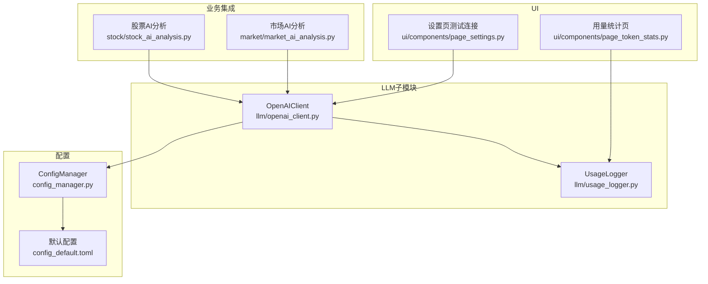
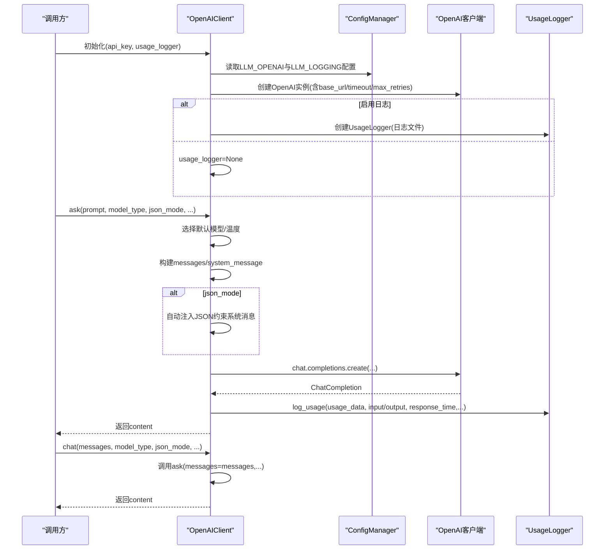
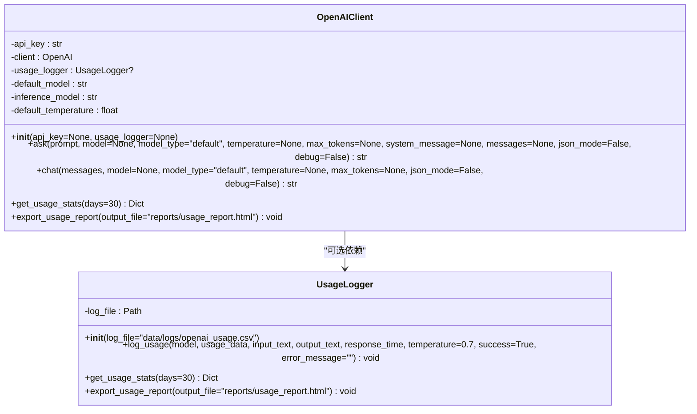
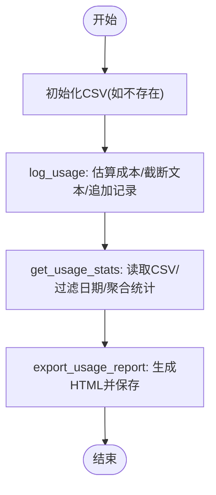
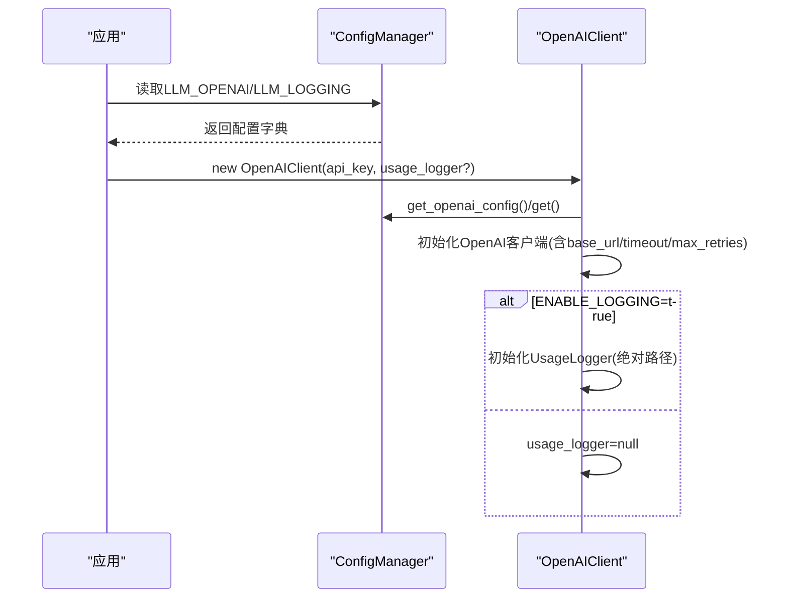
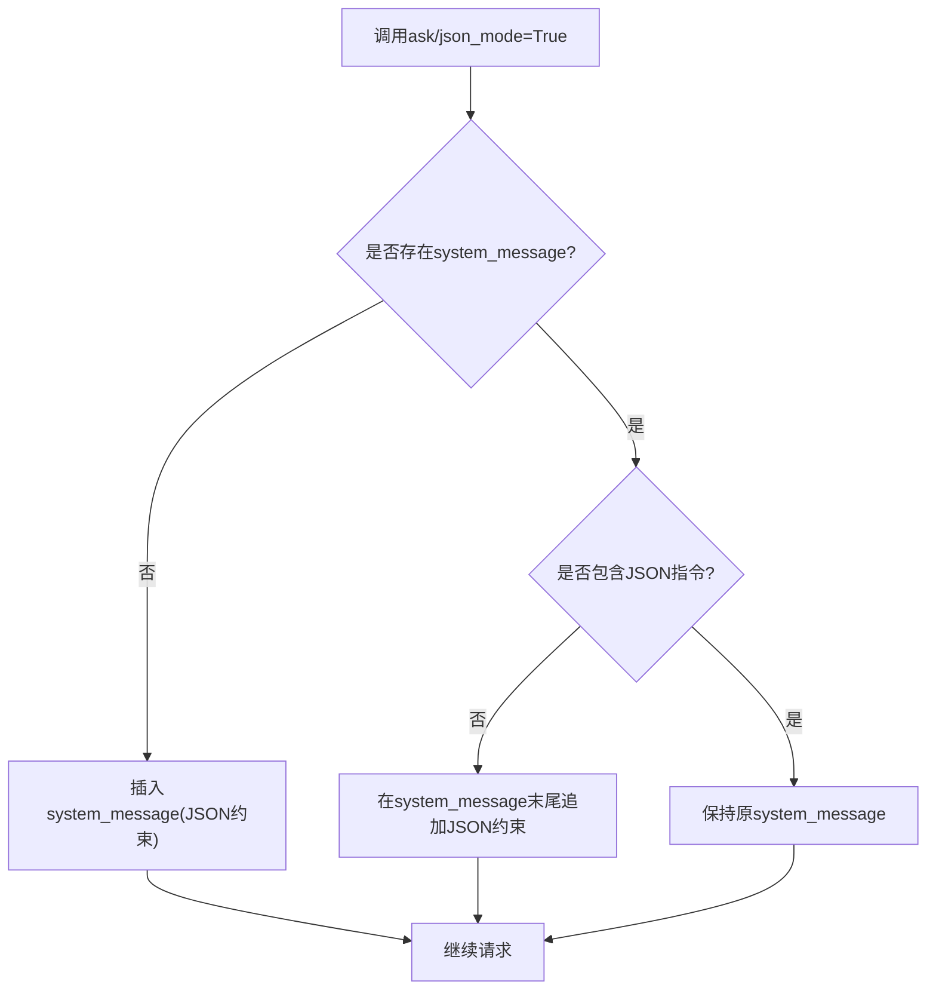
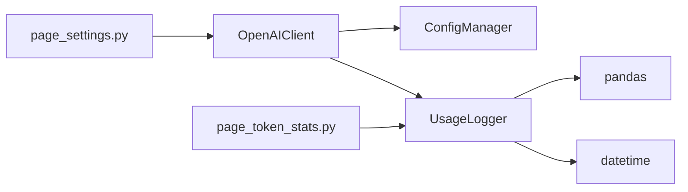

# LLM客户端API

<cite>
**本文引用的文件**
- [openai_client.py](file://llm/openai_client.py)
- [usage_logger.py](file://llm/usage_logger.py)
- [config_manager.py](file://config_manager.py)
- [config_default.toml](file://config_default.toml)
- [stock_ai_analysis.py](file://stock/stock_ai_analysis.py)
- [market_ai_analysis.py](file://market/market_ai_analysis.py)
- [page_settings.py](file://ui/components/page_settings.py)
- [page_token_stats.py](file://ui/components/page_token_stats.py)
</cite>

## 目录
1. [简介](#简介)
2. [项目结构](#项目结构)
3. [核心组件](#核心组件)
4. [架构总览](#架构总览)
5. [详细组件分析](#详细组件分析)
6. [依赖关系分析](#依赖关系分析)
7. [性能与成本考虑](#性能与成本考虑)
8. [故障排查指南](#故障排查指南)
9. [结论](#结论)
10. [附录](#附录)

## 简介
本文件为“LLM客户端API”的权威参考，面向使用者与开发者，系统化说明 llm/openai_client.py 中 OpenAIClient 类的公共接口与行为，包括：
- 方法：ask、chat、get_usage_stats、export_usage_report
- 参数与返回值：prompt、model、model_type、temperature、max_tokens、system_message、messages、json_mode、debug
- 错误处理机制与日志记录
- 配置管理（从 config_manager 读取 API 密钥与模型参数）
- JSON 模式与系统消息自动注入
- 单次问答与多轮对话的实际调用示例与最佳实践

## 项目结构
本项目围绕 LLM 能力构建，OpenAIClient 位于 llm 子模块，配合 UsageLogger 实现使用统计与报告导出；配置由 config_manager 与 config_default.toml 提供；UI 层通过 page_settings 与 page_token_stats 与之交互。

图示来源
- [openai_client.py](file://llm/openai_client.py#L26-L71)
- [usage_logger.py](file://llm/usage_logger.py#L1-L44)
- [config_manager.py](file://config_manager.py#L13-L63)
- [config_default.toml](file://config_default.toml#L1-L23)
- [stock_ai_analysis.py](file://stock/stock_ai_analysis.py#L303-L346)
- [market_ai_analysis.py](file://market/market_ai_analysis.py#L1-L22)
- [page_settings.py](file://ui/components/page_settings.py#L122-L139)
- [page_token_stats.py](file://ui/components/page_token_stats.py#L1-L20)

章节来源
- [openai_client.py](file://llm/openai_client.py#L26-L71)
- [config_manager.py](file://config_manager.py#L13-L63)
- [config_default.toml](file://config_default.toml#L1-L23)

## 核心组件
- OpenAIClient：封装 OpenAI 客户端，负责初始化、请求、错误处理、使用记录与统计导出。
- UsageLogger：负责 CSV 记录、成本估算、统计聚合与 HTML 报告导出。
- ConfigManager：集中读取与管理配置，支持默认值与热加载。
- UI 集成：设置页用于测试连接，用量统计页用于查看与导出。

章节来源
- [openai_client.py](file://llm/openai_client.py#L26-L71)
- [usage_logger.py](file://llm/usage_logger.py#L1-L44)
- [config_manager.py](file://config_manager.py#L13-L63)

## 架构总览
OpenAIClient 的初始化流程从配置中心读取 API 密钥、超时、重试、默认模型等参数，按需创建 UsageLogger 并写入 CSV；ask/chat 将消息组织为 OpenAI 所需格式，调用 chat.completions.create 并记录使用情况；get_usage_stats/export_usage_report 由 UsageLogger 提供。

图示来源
- [openai_client.py](file://llm/openai_client.py#L29-L71)
- [openai_client.py](file://llm/openai_client.py#L72-L175)
- [openai_client.py](file://llm/openai_client.py#L198-L230)
- [usage_logger.py](file://llm/usage_logger.py#L45-L91)

## 详细组件分析

### OpenAIClient 类
- 初始化
  - 从配置读取 API_KEY；若缺失抛出异常
  - 读取 BASE_URL、TIMEOUT、MAX_RETRIES、DEFAULT_MODEL、INFERENCE_MODEL、DEFAULT_TEMPERATURE
  - 创建 OpenAI 客户端；根据 ENABLE_LOGGING 初始化 UsageLogger（绝对路径处理）
  - 记录初始化完成日志
- ask(prompt, model=None, model_type="default", temperature=None, max_tokens=None, system_message=None, messages=None, json_mode=False, debug=False) -> str
  - model_type 优先级：显式 model > model_type（default/inference）> 默认模型
  - 若未显式传入 messages，则根据 system_message 与 prompt 构建消息数组
  - json_mode 时自动注入 JSON 约束（必要时在系统消息中追加 JSON 指令）
  - 调用 chat.completions.create，记录 usage、响应时间、温度等
  - debug 开启时打印模型、输入、输出、Token 使用与响应时间
  - 异常捕获后同样记录 usage（success=false），并重新抛出
- chat(messages, model=None, model_type="default", temperature=None, max_tokens=None, json_mode=False, debug=False) -> str
  - 直接委托 ask，使用传入 messages，其余参数同 ask
- get_usage_stats(days=30) -> Dict[str, Any]
  - 委托 UsageLogger.get_usage_stats
- export_usage_report(output_file="reports/usage_report.html")
  - 委托 UsageLogger.export_usage_report

图示来源
- [openai_client.py](file://llm/openai_client.py#L29-L71)
- [openai_client.py](file://llm/openai_client.py#L72-L175)
- [openai_client.py](file://llm/openai_client.py#L198-L230)
- [openai_client.py](file://llm/openai_client.py#L232-L255)
- [usage_logger.py](file://llm/usage_logger.py#L13-L44)
- [usage_logger.py](file://llm/usage_logger.py#L45-L91)
- [usage_logger.py](file://llm/usage_logger.py#L125-L163)
- [usage_logger.py](file://llm/usage_logger.py#L164-L204)

章节来源
- [openai_client.py](file://llm/openai_client.py#L29-L71)
- [openai_client.py](file://llm/openai_client.py#L72-L175)
- [openai_client.py](file://llm/openai_client.py#L198-L230)
- [openai_client.py](file://llm/openai_client.py#L232-L255)

### UsageLogger 类
- 初始化：确保日志目录存在，首次运行创建 CSV 表头
- log_usage：估算成本（基于内置定价表）、截断长文本、追加记录
- get_usage_stats：按天过滤、聚合统计（总请求数、总Token、总成本、平均响应时间、成功率、模型分布、每日用量）
- export_usage_report：读取 CSV，生成 HTML 报告并保存

图示来源
- [usage_logger.py](file://llm/usage_logger.py#L27-L44)
- [usage_logger.py](file://llm/usage_logger.py#L45-L91)
- [usage_logger.py](file://llm/usage_logger.py#L125-L163)
- [usage_logger.py](file://llm/usage_logger.py#L164-L204)

章节来源
- [usage_logger.py](file://llm/usage_logger.py#L27-L44)
- [usage_logger.py](file://llm/usage_logger.py#L45-L91)
- [usage_logger.py](file://llm/usage_logger.py#L125-L163)
- [usage_logger.py](file://llm/usage_logger.py#L164-L204)

### 配置管理与初始化流程
- ConfigManager 从 config.toml 加载配置，若不存在则回退默认值；提供 get_openai_config/get_logging_config 等便捷访问
- OpenAIClient 从配置读取 API_KEY、BASE_URL、TIMEOUT、MAX_RETRIES、DEFAULT_MODEL、INFERENCE_MODEL、DEFAULT_TEMPERATURE
- 日志开关 ENABLE_LOGGING 控制是否启用 UsageLogger；日志文件路径若为相对路径则转为绝对路径

图示来源
- [config_manager.py](file://config_manager.py#L13-L63)
- [config_manager.py](file://config_manager.py#L116-L127)
- [openai_client.py](file://llm/openai_client.py#L37-L71)
- [config_default.toml](file://config_default.toml#L1-L23)

章节来源
- [config_manager.py](file://config_manager.py#L13-L63)
- [config_manager.py](file://config_manager.py#L116-L127)
- [openai_client.py](file://llm/openai_client.py#L37-L71)
- [config_default.toml](file://config_default.toml#L1-L23)

### JSON 模式与系统消息自动注入
- 当 json_mode=True 时，OpenAIClient 会在请求参数中设置 response_format 为 JSON 对象
- 若未提供系统消息，自动插入 JSON 约束；若已有系统消息但不含 JSON 指令，则追加 JSON 约束
- 该机制确保模型输出符合 JSON 格式，便于后续解析

图示来源
- [openai_client.py](file://llm/openai_client.py#L128-L140)

章节来源
- [openai_client.py](file://llm/openai_client.py#L128-L140)

### 单次问答与多轮对话示例
- 单次问答（默认分析模型）
  - 调用：OpenAIClient.ask(prompt, debug=True)
  - 示例路径：[openai_client.py](file://llm/openai_client.py#L262-L266)
- 单次问答（推理模型）
  - 调用：OpenAIClient.ask(prompt, model_type="inference", debug=True)
  - 示例路径：[openai_client.py](file://llm/openai_client.py#L267-L271)
- 多轮对话（默认分析模型）
  - 调用：OpenAIClient.chat(messages, debug=True)
  - 示例路径：[openai_client.py](file://llm/openai_client.py#L272-L281)
- UI 测试连接
  - 调用：OpenAIClient(api_key=...).ask("测试", model_type="inference")
  - 示例路径：[page_settings.py](file://ui/components/page_settings.py#L122-L139)

章节来源
- [openai_client.py](file://llm/openai_client.py#L262-L281)
- [page_settings.py](file://ui/components/page_settings.py#L122-L139)

### 在业务模块中的使用
- 股票AI分析：BaseAnalysisGenerator 通过 OpenAIClient.chat 生成各类分析报告，并根据配置选择 temperature 与 model_type
  - 示例路径：[stock_ai_analysis.py](file://stock/stock_ai_analysis.py#L303-L346)
- 市场AI分析：market_ai_analysis 通过 OpenAIClient.chat 生成市场分析报告，temperature 与 model_type 可按需设置
  - 示例路径：[market_ai_analysis.py](file://market/market_ai_analysis.py#L102-L118)

章节来源
- [stock_ai_analysis.py](file://stock/stock_ai_analysis.py#L303-L346)
- [market_ai_analysis.py](file://market/market_ai_analysis.py#L102-L118)

## 依赖关系分析
- OpenAIClient 依赖 ConfigManager 读取配置，依赖 UsageLogger 记录使用情况
- UsageLogger 依赖 pandas 与 datetime，负责 CSV 文件与 HTML 报告
- UI 页面 page_settings 与 page_token_stats 分别调用 OpenAIClient 与 UsageLogger

图示来源
- [openai_client.py](file://llm/openai_client.py#L29-L71)
- [usage_logger.py](file://llm/usage_logger.py#L1-L20)
- [page_settings.py](file://ui/components/page_settings.py#L122-L139)
- [page_token_stats.py](file://ui/components/page_token_stats.py#L1-L20)

章节来源
- [openai_client.py](file://llm/openai_client.py#L29-L71)
- [usage_logger.py](file://llm/usage_logger.py#L1-L20)
- [page_settings.py](file://ui/components/page_settings.py#L122-L139)
- [page_token_stats.py](file://ui/components/page_token_stats.py#L1-L20)

## 性能与成本考虑
- 超时与重试：初始化时传入 timeout 与 max_retries，有助于在网络不稳定时提升稳定性
- 成本估算：UsageLogger 基于内置定价表估算成本，便于预算控制
- 日志与存储：CSV 记录包含 input/output 文本截断，避免过大字段占用存储
- 模型选择：通过 DEFAULT_MODEL 与 INFERENCE_MODEL 区分分析与推理场景，合理选择可平衡质量与成本

章节来源
- [openai_client.py](file://llm/openai_client.py#L43-L53)
- [usage_logger.py](file://llm/usage_logger.py#L92-L118)
- [usage_logger.py](file://llm/usage_logger.py#L119-L124)

## 故障排查指南
- API 密钥未设置
  - 现象：初始化时报错
  - 处理：在配置文件中设置 LLM_OPENAI.API_KEY 或通过构造函数传入
  - 参考路径：[openai_client.py](file://llm/openai_client.py#L37-L40)
- 网络异常或超时
  - 现象：ask/chat 抛出异常
  - 处理：检查网络、BASE_URL、TIMEOUT、MAX_RETRIES；确认 ENABLE_LOGGING 已记录错误
  - 参考路径：[openai_client.py](file://llm/openai_client.py#L177-L196)
- JSON 模式输出非 JSON
  - 现象：期望 JSON 但模型未严格遵循
  - 处理：确认已启用 json_mode；检查系统消息是否包含 JSON 约束
  - 参考路径：[openai_client.py](file://llm/openai_client.py#L128-L140)
- 用量统计为空
  - 现象：get_usage_stats 返回空字典
  - 处理：确认 ENABLE_LOGGING=true 且 CSV 文件存在；检查日志文件路径
  - 参考路径：[config_manager.py](file://config_manager.py#L50-L58)
  - 参考路径：[usage_logger.py](file://llm/usage_logger.py#L135-L163)

章节来源
- [openai_client.py](file://llm/openai_client.py#L37-L40)
- [openai_client.py](file://llm/openai_client.py#L177-L196)
- [openai_client.py](file://llm/openai_client.py#L128-L140)
- [config_manager.py](file://config_manager.py#L50-L58)
- [usage_logger.py](file://llm/usage_logger.py#L135-L163)

## 结论
OpenAIClient 提供了简洁而强大的 LLM 调用接口，结合 UsageLogger 实现完善的使用统计与成本估算；通过配置中心统一管理 API 密钥与模型参数；在业务模块中被广泛复用，支持单次问答与多轮对话，并具备 JSON 模式与系统消息自动注入能力。建议在生产环境中开启日志记录与成本估算，合理设置模型与温度参数，以获得更稳定与可控的体验。

## 附录

### 方法与参数速查
- OpenAIClient.ask
  - 参数：prompt、model、model_type、temperature、max_tokens、system_message、messages、json_mode、debug
  - 返回：字符串（AI回复）
  - 错误：异常向上抛出，同时记录失败日志
  - 参考路径：[openai_client.py](file://llm/openai_client.py#L72-L175)
- OpenAIClient.chat
  - 参数：messages、model、model_type、temperature、max_tokens、json_mode、debug
  - 返回：字符串（AI回复）
  - 参考路径：[openai_client.py](file://llm/openai_client.py#L198-L230)
- OpenAIClient.get_usage_stats
  - 参数：days
  - 返回：字典（统计信息）
  - 参考路径：[openai_client.py](file://llm/openai_client.py#L232-L245)
- OpenAIClient.export_usage_report
  - 参数：output_file
  - 返回：无
  - 参考路径：[openai_client.py](file://llm/openai_client.py#L246-L255)

### 配置项参考
- LLM_OPENAI.API_KEY：API 密钥
- LLM_OPENAI.BASE_URL：OpenAI 兼容服务地址
- LLM_OPENAI.TIMEOUT：请求超时（秒）
- LLM_OPENAI.MAX_RETRIES：最大重试次数
- LLM_OPENAI.DEFAULT_MODEL：默认分析模型
- LLM_OPENAI.INFERENCE_MODEL：推理模型
- LLM_OPENAI.DEFAULT_TEMPERATURE：默认温度
- LLM_LOGGING.ENABLE_LOGGING：是否启用使用记录
- LLM_LOGGING.USAGE_LOG_FILE：使用记录 CSV 文件路径
- LLM_LOGGING.LOG_LEVEL：日志级别

章节来源
- [config_manager.py](file://config_manager.py#L41-L58)
- [config_default.toml](file://config_default.toml#L1-L23)