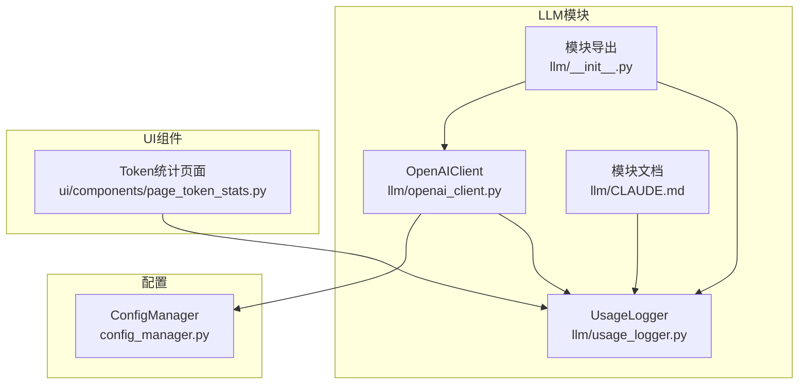
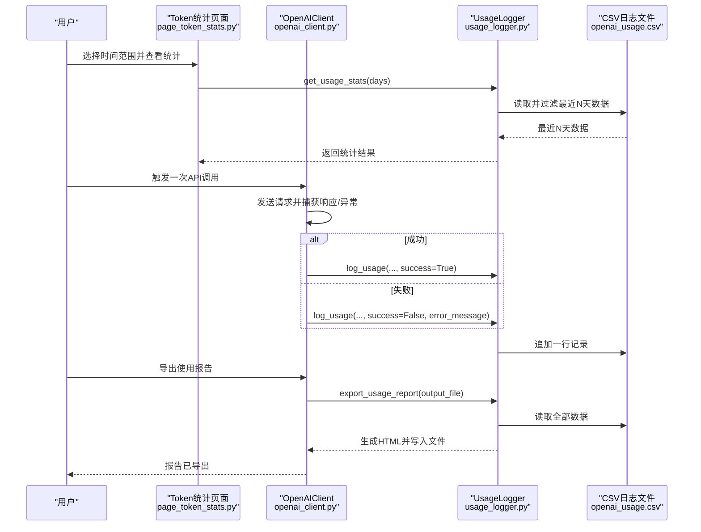
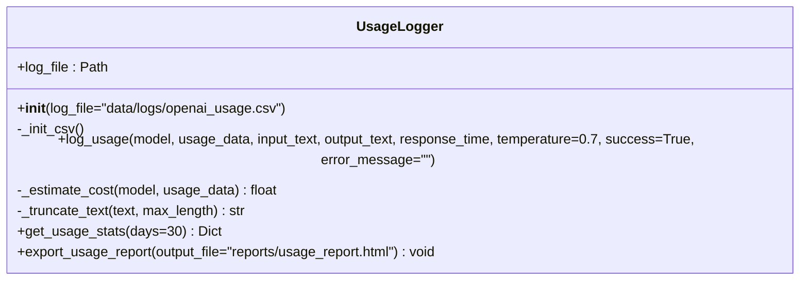
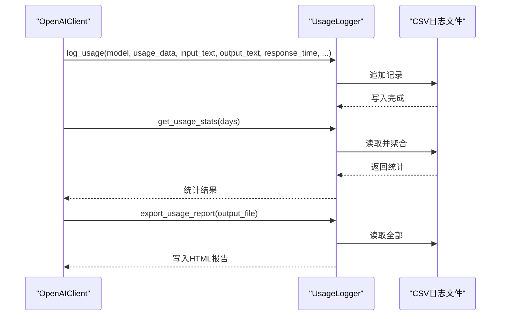
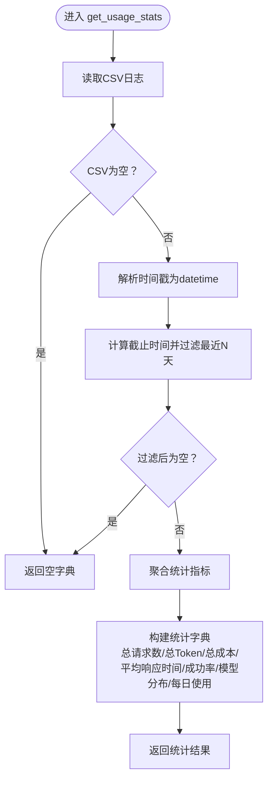
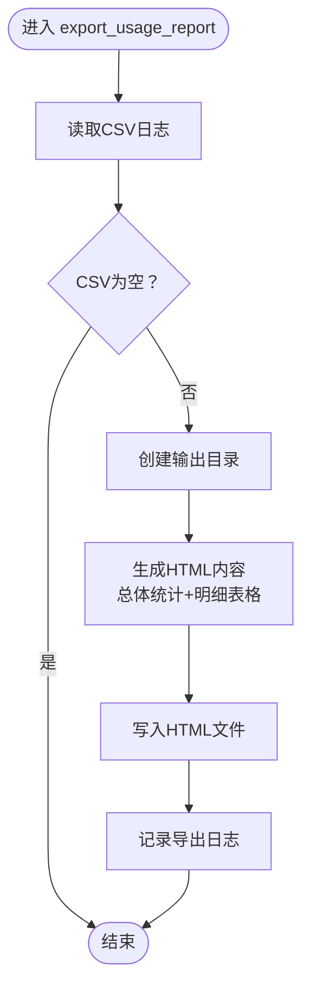
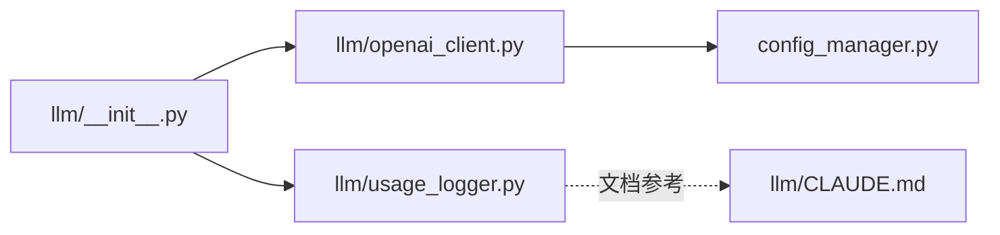

# 使用统计与报告

<cite>
**本文引用的文件**
- [llm/usage_logger.py](file://llm/usage_logger.py)
- [llm/openai_client.py](file://llm/openai_client.py)
- [ui/components/page_token_stats.py](file://ui/components/page_token_stats.py)
- [config_manager.py](file://config_manager.py)
- [llm/__init__.py](file://llm/__init__.py)
- [llm/CLAUDE.md](file://llm/CLAUDE.md)
</cite>

## 目录
1. [简介](#简介)
2. [项目结构](#项目结构)
3. [核心组件](#核心组件)
4. [架构总览](#架构总览)
5. [组件详解](#组件详解)
6. [依赖关系分析](#依赖关系分析)
7. [性能考量](#性能考量)
8. [故障排查指南](#故障排查指南)
9. [结论](#结论)
10. [附录](#附录)

## 简介
本文件系统性地文档化了项目的“使用统计与报告”能力，重点覆盖以下方面：
- get_usage_stats方法如何按指定天数过滤并聚合使用统计数据，包括总请求数、总token数、总成本、平均响应时间、成功率、模型分布与每日token使用趋势。
- export_usage_report方法如何生成HTML格式的使用报告。
- UsageLogger类的集成机制，包括CSV日志文件的结构与字段含义。
- 如何通过OpenAIClient便捷地查询30天使用统计与导出报告到自定义路径。
- 统计功能在成本监控与性能分析中的实际应用建议。
- 对usage_logger依赖文件的深入分析，帮助用户理解完整的使用追踪机制。

## 项目结构
围绕使用统计与报告的相关文件组织如下：
- llm/usage_logger.py：使用记录器，负责写入CSV日志、统计聚合与HTML报告导出。
- llm/openai_client.py：OpenAI客户端，封装API调用并在成功或失败时调用UsageLogger记录。
- ui/components/page_token_stats.py：Streamlit页面，展示使用概览、模型分布与详细日志。
- config_manager.py：配置管理，提供日志开关、日志文件路径等配置项。
- llm/__init__.py：模块导出入口。
- llm/CLAUDE.md：模块文档，包含类签名、依赖与配置说明。

图表来源
- [llm/usage_logger.py](file://llm/usage_logger.py#L1-L204)
- [llm/openai_client.py](file://llm/openai_client.py#L1-L297)
- [ui/components/page_token_stats.py](file://ui/components/page_token_stats.py#L1-L189)
- [config_manager.py](file://config_manager.py#L1-L144)
- [llm/__init__.py](file://llm/__init__.py#L1-L17)
- [llm/CLAUDE.md](file://llm/CLAUDE.md#L86-L150)

章节来源
- [llm/usage_logger.py](file://llm/usage_logger.py#L1-L204)
- [llm/openai_client.py](file://llm/openai_client.py#L1-L297)
- [ui/components/page_token_stats.py](file://ui/components/page_token_stats.py#L1-L189)
- [config_manager.py](file://config_manager.py#L1-L144)
- [llm/__init__.py](file://llm/__init__.py#L1-L17)
- [llm/CLAUDE.md](file://llm/CLAUDE.md#L86-L150)

## 核心组件
- UsageLogger：负责CSV日志的初始化、记录写入、统计聚合与HTML报告导出。
- OpenAIClient：封装OpenAI调用，在成功与失败场景下统一调用UsageLogger记录使用情况，并提供get_usage_stats与export_usage_report代理方法。
- UI页面page_token_stats：提供可视化界面，展示使用概览、模型分布与详细日志。
- 配置管理ConfigManager：提供日志开关、日志文件路径、模型与超时等配置。

章节来源
- [llm/usage_logger.py](file://llm/usage_logger.py#L1-L204)
- [llm/openai_client.py](file://llm/openai_client.py#L1-L297)
- [ui/components/page_token_stats.py](file://ui/components/page_token_stats.py#L1-L189)
- [config_manager.py](file://config_manager.py#L1-L144)

## 架构总览
下图展示了从OpenAI调用到统计与报告的整体流程，以及UI层的交互。

图表来源
- [llm/openai_client.py](file://llm/openai_client.py#L159-L194)
- [llm/openai_client.py](file://llm/openai_client.py#L232-L255)
- [llm/usage_logger.py](file://llm/usage_logger.py#L45-L124)
- [llm/usage_logger.py](file://llm/usage_logger.py#L125-L163)
- [llm/usage_logger.py](file://llm/usage_logger.py#L164-L204)
- [ui/components/page_token_stats.py](file://ui/components/page_token_stats.py#L26-L189)

## 组件详解

### UsageLogger类
- CSV日志文件结构与字段
  - 字段包括：时间戳、模型、Prompt Token、Completion Token、Total Token、预估成本、温度、输入文本、输出文本、响应时间、成功标记、错误信息。
  - 初始CSV会在首次使用时自动创建列头；后续每次调用通过追加方式写入。
- 成本估算
  - 基于内置的模型定价表进行估算，当前支持多个主流模型的输入/输出单价。
- 统计聚合
  - get_usage_stats(days)会读取CSV，转换时间戳后按天数阈值过滤，再计算总请求数、总Token、总成本、平均响应时间、成功率、模型分布、每日Token使用。
- HTML报告导出
  - export_usage_report(output_file)会读取全部数据，生成包含总体统计与明细表格的HTML报告，并写入指定路径。

图表来源
- [llm/usage_logger.py](file://llm/usage_logger.py#L1-L204)

章节来源
- [llm/usage_logger.py](file://llm/usage_logger.py#L1-L204)

### OpenAIClient与UsageLogger的集成
- OpenAIClient在初始化时根据配置决定是否启用日志记录，并构造UsageLogger实例。
- 在成功与失败两种情况下分别调用UsageLogger.log_usage，确保所有API调用都被完整记录。
- 提供get_usage_stats与export_usage_report两个代理方法，直接委托给UsageLogger。

图表来源
- [llm/openai_client.py](file://llm/openai_client.py#L56-L64)
- [llm/openai_client.py](file://llm/openai_client.py#L159-L194)
- [llm/openai_client.py](file://llm/openai_client.py#L232-L255)
- [llm/usage_logger.py](file://llm/usage_logger.py#L45-L124)
- [llm/usage_logger.py](file://llm/usage_logger.py#L125-L204)

章节来源
- [llm/openai_client.py](file://llm/openai_client.py#L1-L297)
- [llm/usage_logger.py](file://llm/usage_logger.py#L1-L204)

### UI页面page_token_stats的使用统计展示
- 展示使用概览：总请求数、总Token数、平均响应时间、成功率。
- 展示模型使用分布：柱状图显示各模型使用次数与Token消耗分布。
- 展示详细日志：按时间倒序显示记录，支持预览输入/输出文本，查看成本、响应时间、成功与否及错误信息。

章节来源
- [ui/components/page_token_stats.py](file://ui/components/page_token_stats.py#L1-L189)

### get_usage_stats方法的工作流

图表来源
- [llm/usage_logger.py](file://llm/usage_logger.py#L125-L163)

章节来源
- [llm/usage_logger.py](file://llm/usage_logger.py#L125-L163)

### export_usage_report方法的工作流

图表来源
- [llm/usage_logger.py](file://llm/usage_logger.py#L164-L204)

章节来源
- [llm/usage_logger.py](file://llm/usage_logger.py#L164-L204)

## 依赖关系分析
- 模块导出
  - llm/__init__.py导出OpenAIClient与UsageLogger，便于外部按需导入。
- 配置依赖
  - OpenAIClient通过config_manager读取日志开关与日志文件路径，确保UsageLogger实例化时使用正确的日志文件位置。
- 文档与依赖
  - llm/CLAUDE.md提供了UsageLogger类签名、依赖与配置示例，有助于快速理解模块职责与外部依赖。

图表来源
- [llm/__init__.py](file://llm/__init__.py#L1-L17)
- [llm/openai_client.py](file://llm/openai_client.py#L1-L69)
- [config_manager.py](file://config_manager.py#L1-L144)
- [llm/CLAUDE.md](file://llm/CLAUDE.md#L86-L150)

章节来源
- [llm/__init__.py](file://llm/__init__.py#L1-L17)
- [llm/openai_client.py](file://llm/openai_client.py#L1-L69)
- [config_manager.py](file://config_manager.py#L1-L144)
- [llm/CLAUDE.md](file://llm/CLAUDE.md#L86-L150)

## 性能考量
- CSV读写与聚合
  - get_usage_stats与export_usage_report均会读取CSV，当历史数据量较大时，建议：
    - 控制统计时间窗口（如仅统计最近30天），减少过滤与聚合开销。
    - 将日志文件置于本地SSD或高速磁盘，降低I/O延迟。
- 文本截断
  - UsageLogger对输入/输出文本进行截断，避免大文本导致CSV体积膨胀与内存占用过高。
- 成本估算
  - 成本估算基于固定模型定价表，若模型定价变化，需更新定价表以保证估算准确性。

[本节为通用指导，不直接分析具体文件]

## 故障排查指南
- 无法导出报告
  - 检查输出路径是否存在写权限，或确认输出目录已被正确创建。
  - 确认CSV文件是否存在且可读。
- 统计结果为空
  - 确认最近N天内是否有API调用记录；若无记录，get_usage_stats将返回空字典。
  - 检查日志文件路径配置是否正确，确保OpenAIClient与UsageLogger使用同一份日志文件。
- 成本估算为0
  - 确认使用的模型是否在定价表中；不在表内的模型将返回0成本。
- UI页面无数据
  - 确认UI页面与UsageLogger共享同一日志文件路径；若UI直接实例化UsageLogger，需确保路径一致。

章节来源
- [llm/usage_logger.py](file://llm/usage_logger.py#L125-L204)
- [llm/openai_client.py](file://llm/openai_client.py#L56-L64)
- [config_manager.py](file://config_manager.py#L40-L62)

## 结论
本功能通过UsageLogger统一记录API使用情况，并提供灵活的统计与报告能力。OpenAIClient在调用成功与失败时均进行记录，确保统计完整性；UI页面提供直观的可视化展示；配置管理使日志路径与开关可控。结合成本估算与性能指标，可在成本监控与性能分析中发挥重要作用。

[本节为总结性内容，不直接分析具体文件]

## 附录

### 代码示例：查询30天使用统计与导出报告到自定义路径
- 查询30天使用统计
  - 通过OpenAIClient调用get_usage_stats方法，返回包含总请求数、总Token、总成本、平均响应时间、成功率、模型分布与每日使用等字段的字典。
  - 示例调用路径参考：[llm/openai_client.py](file://llm/openai_client.py#L232-L244)
- 导出HTML报告到自定义路径
  - 通过OpenAIClient调用export_usage_report方法，传入自定义输出文件路径，即可生成HTML报告。
  - 示例调用路径参考：[llm/openai_client.py](file://llm/openai_client.py#L246-L255)

章节来源
- [llm/openai_client.py](file://llm/openai_client.py#L232-L255)

### CSV日志文件结构与字段说明
- 字段列表
  - 时间戳、模型、Prompt Token、Completion Token、Total Token、预估成本、温度、输入文本、输出文本、响应时间、成功标记、错误信息。
- 初始化与写入
  - 首次使用时自动创建列头；后续每次调用以追加方式写入一行记录。
- 文本截断
  - 输入/输出文本会被截断，防止过大文本影响存储与性能。

章节来源
- [llm/usage_logger.py](file://llm/usage_logger.py#L27-L44)
- [llm/usage_logger.py](file://llm/usage_logger.py#L45-L124)

### 成本监控与性能分析的实际应用
- 成本监控
  - 通过get_usage_stats返回的总成本与每日使用趋势，结合预算阈值进行预警与控制。
- 性能分析
  - 通过平均响应时间与成功率，评估模型与网络稳定性；结合模型分布，优化模型选择与调用策略。
- 报告与审计
  - 使用export_usage_report生成HTML报告，便于归档与跨团队分享。

[本节为通用指导，不直接分析具体文件]