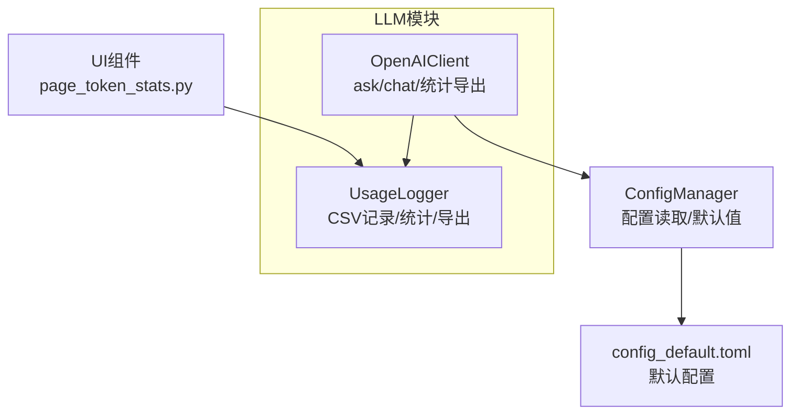
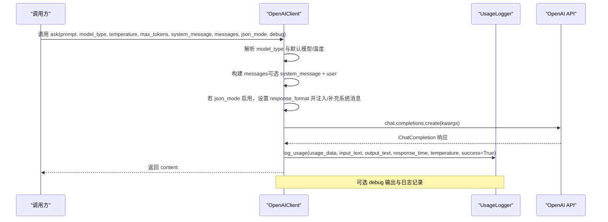
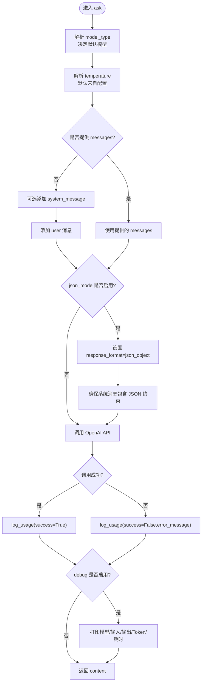
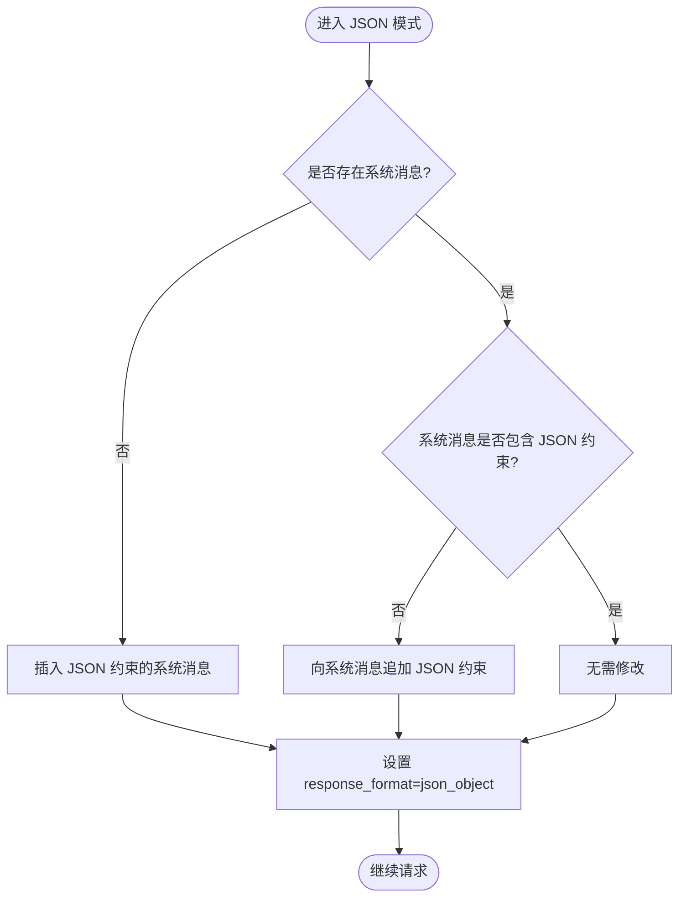
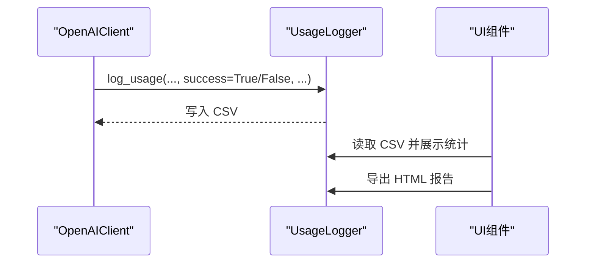
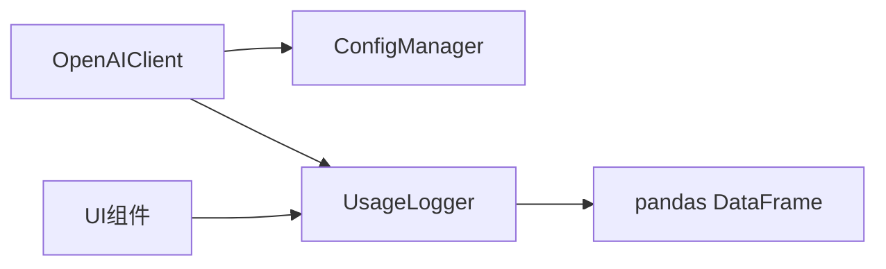

# 单次问答请求

<cite>
**本文引用的文件**
- [openai_client.py](file://llm/openai_client.py)
- [usage_logger.py](file://llm/usage_logger.py)
- [config_manager.py](file://config_manager.py)
- [config_default.toml](file://config_default.toml)
- [page_token_stats.py](file://ui/components/page_token_stats.py)
- [CLAUDE.md](file://llm/CLAUDE.md)
</cite>

## 目录
1. [简介](#简介)
2. [项目结构](#项目结构)
3. [核心组件](#核心组件)
4. [架构总览](#架构总览)
5. [详细组件分析](#详细组件分析)
6. [依赖关系分析](#依赖关系分析)
7. [性能考量](#性能考量)
8. [故障排查指南](#故障排查指南)
9. [结论](#结论)
10. [附录](#附录)

## 简介
本文件围绕项目中的 ask 方法进行深入技术文档化，目标是帮助开发者与使用者准确理解并正确使用该方法的所有参数与行为，特别是：
- 参数详解：prompt、model、model_type、temperature、max_tokens、system_message、messages、json_mode、debug
- model_type 的工作方式：在“分析模型”与“推理模型”之间的切换逻辑
- JSON 模式的机制：如何通过 response_format 与系统消息注入确保 JSON 输出
- 实际调用示例：基础问答、自定义温度、JSON 模式调用
- 错误处理流程与日志记录机制

## 项目结构
本项目采用模块化组织，LLM 相关能力集中在 llm 子模块中，其中 openai_client 提供 ask 方法，usage_logger 负责使用记录与统计，config_manager 提供配置读取，UI 层通过 page_token_stats 展示统计结果。

**图表来源**
- [openai_client.py](file://llm/openai_client.py#L26-L71)
- [usage_logger.py](file://llm/usage_logger.py#L1-L44)
- [config_manager.py](file://config_manager.py#L38-L62)
- [config_default.toml](file://config_default.toml#L1-L23)
- [page_token_stats.py](file://ui/components/page_token_stats.py#L1-L30)

**章节来源**
- [openai_client.py](file://llm/openai_client.py#L26-L71)
- [usage_logger.py](file://llm/usage_logger.py#L1-L44)
- [config_manager.py](file://config_manager.py#L38-L62)
- [config_default.toml](file://config_default.toml#L1-L23)
- [page_token_stats.py](file://ui/components/page_token_stats.py#L1-L30)

## 核心组件
- OpenAIClient：封装 OpenAI 客户端，提供 ask 与 chat 方法，并内置默认模型、温度、超时、重试等配置；支持 JSON 模式与调试输出；集成使用记录器。
- UsageLogger：负责将每次调用的输入输出、Token 使用、响应时间、成本估算等写入 CSV，并提供统计与 HTML 报告导出。
- ConfigManager：统一读取配置，提供默认值与环境变量回退；LLM_OPENAI 与 LLM_LOGGING 等关键配置项由其提供。
- UI 组件 page_token_stats：读取 UsageLogger 的 CSV 并可视化展示使用统计。

**章节来源**
- [openai_client.py](file://llm/openai_client.py#L26-L71)
- [usage_logger.py](file://llm/usage_logger.py#L45-L118)
- [config_manager.py](file://config_manager.py#L38-L62)
- [page_token_stats.py](file://ui/components/page_token_stats.py#L1-L30)

## 架构总览
下面的序列图展示了 ask 方法从参数解析到调用 OpenAI API、记录使用情况与日志的整体流程。

**图表来源**
- [openai_client.py](file://llm/openai_client.py#L72-L175)
- [usage_logger.py](file://llm/usage_logger.py#L45-L91)

**章节来源**
- [openai_client.py](file://llm/openai_client.py#L72-L175)
- [usage_logger.py](file://llm/usage_logger.py#L45-L91)

## 详细组件分析

### OpenAIClient.ask 方法详解
- 功能：单次问答请求，支持多种参数与模式切换。
- 关键行为：
  - model_type 决定默认模型：若未显式传入 model，则根据 model_type 选择 DEFAULT_MODEL 或 INFERENCE_MODEL。
  - temperature 默认值来自配置 DEFAULT_TEMPERATURE，若传入则覆盖。
  - messages 构建：若未提供 messages，可由 system_message 与 prompt 组成；若提供 messages，则直接使用。
  - JSON 模式：开启 json_mode 时，设置 response_format 为 json_object，并在系统消息中确保包含 JSON 输出约束（必要时插入或追加）。
  - 调用 OpenAI API：使用构建好的 kwargs 发起 chat.completions.create。
  - 使用记录：成功与失败均通过 UsageLogger.log_usage 记录，包含 usage_data、input_text、output_text、response_time、temperature、success、error_message。
  - 调试输出：debug=True 时打印模型、输入、输出、Token 使用与响应时间，并记录 INFO 日志。
  - 异常处理：捕获异常后记录失败日志并抛出。

**图表来源**
- [openai_client.py](file://llm/openai_client.py#L72-L175)

**章节来源**
- [openai_client.py](file://llm/openai_client.py#L72-L175)

### model_type 参数：分析模型 vs 推理模型
- 默认模型与推理模型分别由 DEFAULT_MODEL 与 INFERENCE_MODEL 决定，二者均可指向同一模型名，便于后续扩展。
- 当 model 未显式传入时：
  - model_type="default"：使用 DEFAULT_MODEL
  - model_type="inference"：使用 INFERENCE_MODEL
- 若显式传入 model，则忽略 model_type 的默认选择。
- 配置来源：
  - 优先从配置文件读取；若未设置，使用默认值。
  - 默认配置中两者均为 deepseek-chat，可在 config_default.toml 中调整。

**章节来源**
- [openai_client.py](file://llm/openai_client.py#L66-L70)
- [config_manager.py](file://config_manager.py#L38-L62)
- [config_default.toml](file://config_default.toml#L8-L11)

### JSON 模式工作机制
- 开启条件：json_mode=True
- 行为：
  - 设置 response_format 为 json_object，要求模型返回 JSON 结构。
  - 自动注入/补充系统消息，确保模型承诺返回有效 JSON；若无系统消息则插入，若有但不含 JSON 约束则追加。
- 作用：提升下游解析稳定性，避免非结构化输出导致的解析失败。

**图表来源**
- [openai_client.py](file://llm/openai_client.py#L128-L140)

**章节来源**
- [openai_client.py](file://llm/openai_client.py#L128-L140)

### 参数说明与使用建议
- prompt：用户输入文本，作为 user 消息内容。
- model：显式指定模型名称，覆盖 model_type 的默认选择。
- model_type：选择默认模型类型，“default”或“inference”，影响默认模型的选择。
- temperature：采样温度，默认来自配置；数值越低越确定，越高越发散。
- max_tokens：最大生成 token 数，用于控制输出长度。
- system_message：可选的系统提示词，用于设定角色或约束。
- messages：可选的完整消息列表，若提供则覆盖 prompt 与 system_message。
- json_mode：是否强制返回 JSON；内部通过 response_format 与系统消息约束实现。
- debug：是否打印调试信息（模型、输入、输出、Token、耗时）。

**章节来源**
- [openai_client.py](file://llm/openai_client.py#L72-L98)
- [openai_client.py](file://llm/openai_client.py#L101-L140)

### 实际调用示例（以路径引用代替代码片段）
- 基础问答（默认分析模型）
  - 参考路径：[openai_client.py](file://llm/openai_client.py#L262-L266)
- 基础问答（推理模型）
  - 参考路径：[openai_client.py](file://llm/openai_client.py#L268-L270)
- 多轮对话（使用 messages）
  - 参考路径：[openai_client.py](file://llm/openai_client.py#L274-L281)
- 自定义温度与 JSON 模式
  - 参考路径：[openai_client.py](file://llm/openai_client.py#L120-L140)

**章节来源**
- [openai_client.py](file://llm/openai_client.py#L262-L281)

### 错误处理与日志记录
- 异常捕获：ask 方法内捕获异常，记录失败日志并抛出，便于上层统一处理。
- 使用记录：
  - 成功：log_usage(success=True)，包含 usage_data、input_text、output_text、response_time、temperature。
  - 失败：log_usage(success=False, error_message)，同样记录响应时间与温度。
- 日志级别与文件：
  - 日志级别来自配置；日志文件路径来自配置，若相对路径则自动补全为项目根目录下的绝对路径。
- UI 展示：
  - page_token_stats 读取 CSV 并展示统计概览、模型分布与详细记录，支持导出 HTML 报告。

**图表来源**
- [openai_client.py](file://llm/openai_client.py#L150-L196)
- [usage_logger.py](file://llm/usage_logger.py#L45-L91)
- [page_token_stats.py](file://ui/components/page_token_stats.py#L1-L30)

**章节来源**
- [openai_client.py](file://llm/openai_client.py#L150-L196)
- [usage_logger.py](file://llm/usage_logger.py#L45-L91)
- [page_token_stats.py](file://ui/components/page_token_stats.py#L1-L30)

## 依赖关系分析
- OpenAIClient 依赖：
  - 配置管理：从 config_manager 读取 LLM_OPENAI 与 LLM_LOGGING 配置，决定 API 密钥、超时、重试、默认模型、默认温度、日志开关与日志文件路径。
  - 使用记录器：按需创建 UsageLogger 并写入 CSV。
- UsageLogger 依赖：
  - pandas：用于 CSV 文件的读写与统计。
  - 日志：记录每次使用情况。
- UI 组件：
  - 读取 UsageLogger 的 CSV 并可视化展示统计信息。

**图表来源**
- [openai_client.py](file://llm/openai_client.py#L26-L71)
- [usage_logger.py](file://llm/usage_logger.py#L1-L44)
- [page_token_stats.py](file://ui/components/page_token_stats.py#L1-L30)

**章节来源**
- [openai_client.py](file://llm/openai_client.py#L26-L71)
- [usage_logger.py](file://llm/usage_logger.py#L1-L44)
- [page_token_stats.py](file://ui/components/page_token_stats.py#L1-L30)

## 性能考量
- 超时与重试：OpenAI 客户端初始化时设置超时与最大重试次数，有助于在网络波动时提升稳定性。
- 输出长度控制：通过 max_tokens 控制生成长度，避免过长输出导致成本上升与延迟增加。
- 温度调节：较低温度更稳定，较高温度更具创造性；结合业务场景选择合适温度。
- 日志开销：启用日志会带来磁盘 IO 与 CSV 写入开销，建议在生产环境按需开启。

**章节来源**
- [openai_client.py](file://llm/openai_client.py#L37-L53)
- [openai_client.py](file://llm/openai_client.py#L120-L127)
- [config_manager.py](file://config_manager.py#L38-L49)

## 故障排查指南
- API 密钥未设置
  - 现象：初始化时报错，提示未设置 API 密钥。
  - 处理：在配置文件中设置 LLM_OPENAI.API_KEY，或通过环境变量提供。
  - 参考路径：[openai_client.py](file://llm/openai_client.py#L37-L41)
- 调用失败
  - 现象：异常被捕获并记录失败日志，同时抛出异常。
  - 处理：检查网络、API 密钥、模型可用性与配额；查看 UsageLogger 的 CSV 中的 error_message 字段定位问题。
  - 参考路径：[openai_client.py](file://llm/openai_client.py#L177-L196)
- JSON 模式返回非 JSON
  - 现象：尽管开启了 json_mode，仍出现非 JSON 输出。
  - 处理：确认系统消息中包含 JSON 约束；必要时手动补充；或在上游对输出进行二次校验与修复。
  - 参考路径：[openai_client.py](file://llm/openai_client.py#L128-L140)
- 日志文件路径问题
  - 现象：日志文件未生成或路径不正确。
  - 处理：确认 LLM_LOGGING.USAGE_LOG_FILE 是否为绝对路径；若为相对路径，初始化时会自动补全为项目根目录下的绝对路径。
  - 参考路径：[openai_client.py](file://llm/openai_client.py#L56-L63)
- UI 无法显示统计
  - 现象：UI 页面提示暂无使用数据。
  - 处理：确认 CSV 文件存在且可读；检查日志是否正常写入；确认 UI 组件读取路径正确。
  - 参考路径：[page_token_stats.py](file://ui/components/page_token_stats.py#L1-L30)

**章节来源**
- [openai_client.py](file://llm/openai_client.py#L37-L41)
- [openai_client.py](file://llm/openai_client.py#L177-L196)
- [openai_client.py](file://llm/openai_client.py#L128-L140)
- [openai_client.py](file://llm/openai_client.py#L56-L63)
- [page_token_stats.py](file://ui/components/page_token_stats.py#L1-L30)

## 结论
ask 方法提供了灵活而强大的单次问答能力，通过 model_type 实现“分析模型”与“推理模型”的切换，通过 json_mode 保障 JSON 输出的稳定性，并通过 UsageLogger 与 UI 组件形成完整的使用记录与可视化闭环。合理设置 temperature、max_tokens 与 system_message，可进一步提升问答质量与成本控制。

## 附录
- 配置参考
  - 默认配置文件位置与字段：[config_default.toml](file://config_default.toml#L1-L23)
  - 配置读取与默认值：[config_manager.py](file://config_manager.py#L38-L62)
- 文档与接口说明
  - CLAUDE.md 中对外接口与数据模型说明：[CLAUDE.md](file://llm/CLAUDE.md#L32-L231)