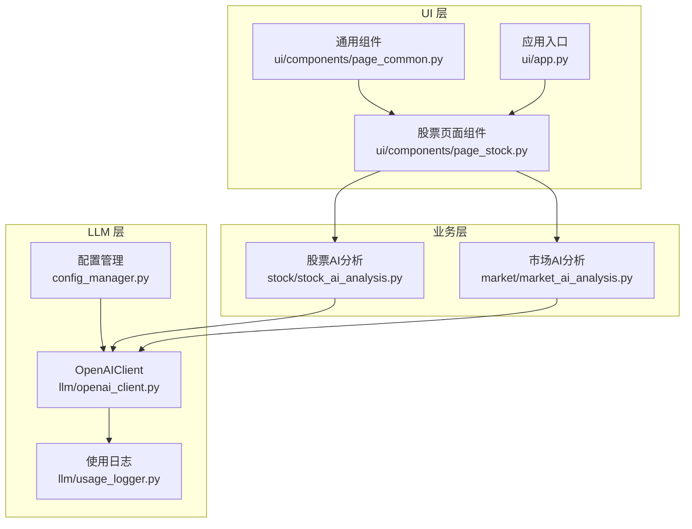
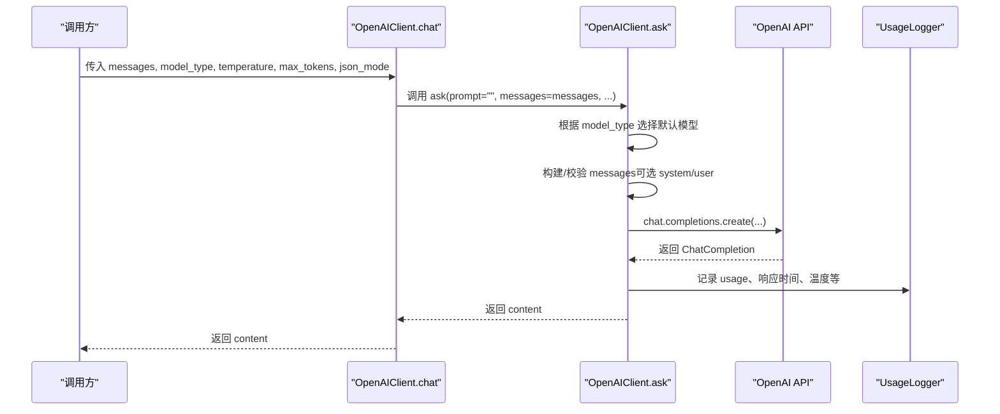
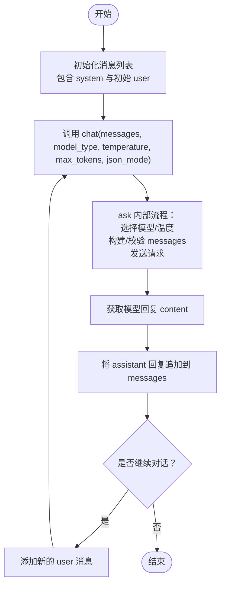
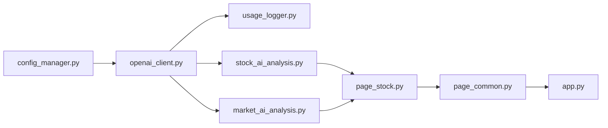

# 多轮对话

<cite>
**本文引用的文件**
- [llm/openai_client.py](file://llm/openai_client.py)
- [config_manager.py](file://config_manager.py)
- [stock/stock_ai_analysis.py](file://stock/stock_ai_analysis.py)
- [market/market_ai_analysis.py](file://market/market_ai_analysis.py)
- [ui/components/page_stock.py](file://ui/components/page_stock.py)
- [ui/components/page_common.py](file://ui/components/page_common.py)
- [ui/app.py](file://ui/app.py)
- [llm/usage_logger.py](file://llm/usage_logger.py)
</cite>

## 目录
1. [简介](#简介)
2. [项目结构](#项目结构)
3. [核心组件](#核心组件)
4. [架构总览](#架构总览)
5. [详细组件分析](#详细组件分析)
6. [依赖关系分析](#依赖关系分析)
7. [性能考量](#性能考量)
8. [故障排查指南](#故障排查指南)
9. [结论](#结论)
10. [附录](#附录)

## 简介
本文件围绕 chat 方法的完整参考文档展开，重点说明：
- messages 参数的结构要求（role 字段 system/user/assistant 与 content 字段的使用规范）
- chat 方法如何封装 ask 方法实现多轮对话
- model_type 参数在多轮对话中的作用，以及如何在分析与推理场景间切换
- temperature、max_tokens、json_mode 参数在对话场景中的应用
- 消息历史管理最佳实践，避免超出模型上下文窗口限制
- 提供从初始化消息列表到获取回复的完整多轮对话示例流程

## 项目结构
本项目采用按功能域划分的组织方式，与多轮对话直接相关的模块集中在 llm、stock、market 与 ui 子目录中：
- llm/openai_client.py：封装 OpenAI 客户端，提供 ask 与 chat 方法
- config_manager.py：提供 LLM 相关默认模型、温度等配置
- stock/stock_ai_analysis.py：在股票分析中使用 chat 生成多轮对话式报告
- market/market_ai_analysis.py：在大盘分析中使用 chat 生成多轮对话式报告
- ui/*：前端页面组件，展示多轮对话式分析结果

图表来源
- [llm/openai_client.py](file://llm/openai_client.py#L68-L231)
- [config_manager.py](file://config_manager.py#L40-L63)
- [llm/usage_logger.py](file://llm/usage_logger.py#L47-L80)
- [stock/stock_ai_analysis.py](file://stock/stock_ai_analysis.py#L303-L346)
- [market/market_ai_analysis.py](file://market/market_ai_analysis.py#L1-L123)
- [ui/components/page_stock.py](file://ui/components/page_stock.py#L431-L471)
- [ui/components/page_common.py](file://ui/components/page_common.py#L107-L164)
- [ui/app.py](file://ui/app.py#L1-L229)

章节来源
- [llm/openai_client.py](file://llm/openai_client.py#L68-L231)
- [config_manager.py](file://config_manager.py#L40-L63)
- [stock/stock_ai_analysis.py](file://stock/stock_ai_analysis.py#L303-L346)
- [market/market_ai_analysis.py](file://market/market_ai_analysis.py#L1-L123)
- [ui/components/page_stock.py](file://ui/components/page_stock.py#L431-L471)
- [ui/components/page_common.py](file://ui/components/page_common.py#L107-L164)
- [ui/app.py](file://ui/app.py#L1-L229)

## 核心组件
- OpenAIClient.chat：封装 ask，接收完整消息列表，实现多轮对话
- OpenAIClient.ask：构建消息列表（可选 system/user），支持 temperature、max_tokens、json_mode
- 配置项：默认模型、推理模型、默认温度等
- 使用日志：记录每次调用的 token、耗时、成本等

章节来源
- [llm/openai_client.py](file://llm/openai_client.py#L68-L231)
- [config_manager.py](file://config_manager.py#L40-L63)
- [llm/usage_logger.py](file://llm/usage_logger.py#L47-L80)

## 架构总览
chat 方法在内部委托 ask 完成请求发送与响应解析，二者共享相同的参数体系与错误处理逻辑。

图表来源
- [llm/openai_client.py](file://llm/openai_client.py#L68-L231)
- [llm/usage_logger.py](file://llm/usage_logger.py#L47-L80)

## 详细组件分析

### chat 方法与 ask 方法的关系
- chat 方法将 messages 透传给 ask，内部将 prompt 置空，从而完全依赖外部传入的完整消息列表
- ask 根据 model_type 选择默认模型（分析模型或推理模型），并应用默认温度
- ask 支持 max_tokens 与 json_mode；chat 亦可传递这些参数

章节来源
- [llm/openai_client.py](file://llm/openai_client.py#L198-L231)
- [llm/openai_client.py](file://llm/openai_client.py#L72-L161)

### messages 参数结构与使用规范
- 结构要求
  - 必须为列表，每个元素为字典，包含 role 与 content 字段
  - role 取值范围：system、user、assistant
  - content 为字符串，承载具体消息内容
- 使用规范
  - system：用于设定角色、约束与输出格式
  - user：用户输入或问题
  - assistant：模型先前的回复，用于延续对话
- 实践建议
  - 在多轮对话中，应将历史 user/assistant 交替加入 messages
  - 避免在单轮对话中混入多个 system 消息，必要时合并至首个 system

章节来源
- [llm/openai_client.py](file://llm/openai_client.py#L112-L118)
- [llm/openai_client.py](file://llm/openai_client.py#L198-L231)

### model_type 参数的作用与选择
- 作用
  - 控制默认模型的选择：default 使用分析模型，inference 使用推理模型
  - 若显式传入 model，则优先使用 model
- 选择建议
  - 分析类任务（如技术面、基本面、筹码面）：优先使用 default
  - 需要更稳定、简洁输出的任务（如市场综述）：可使用 inference
- 配置来源
  - 默认模型与推理模型均来自配置管理器

章节来源
- [llm/openai_client.py](file://llm/openai_client.py#L101-L107)
- [config_manager.py](file://config_manager.py#L40-L63)

### temperature、max_tokens、json_mode 参数的应用
- temperature
  - 控制输出随机性，默认值来自配置
  - 较低温度适合需要稳定、简洁输出的场景
- max_tokens
  - 限制最大生成长度，有助于控制成本与上下文占用
- json_mode
  - 强制模型以 JSON 格式输出
  - 内部会自动确保 system 消息包含 JSON 指令，或追加 JSON 指令

章节来源
- [llm/openai_client.py](file://llm/openai_client.py#L108-L140)
- [llm/openai_client.py](file://llm/openai_client.py#L120-L140)

### 多轮对话完整示例流程（从初始化消息到获取回复）
以下流程展示了典型的多轮对话调用链路，涵盖初始化消息、调用 chat、以及后续扩展对话的历史管理。

图表来源
- [llm/openai_client.py](file://llm/openai_client.py#L198-L231)
- [llm/openai_client.py](file://llm/openai_client.py#L72-L161)

章节来源
- [llm/openai_client.py](file://llm/openai_client.py#L198-L231)
- [llm/openai_client.py](file://llm/openai_client.py#L72-L161)

### 在股票与市场分析中的多轮对话实践
- 股票分析
  - BaseAnalysisGenerator.generate_analysis 通过 chat 发送多轮消息，结合历史分析与实时数据生成报告
  - AnalysisConfig 为不同分析类型提供默认 temperature 与 model_type
- 市场分析
  - generate_index_analysis_report 构建 system 与 user 消息，调用 chat 生成市场综述

章节来源
- [stock/stock_ai_analysis.py](file://stock/stock_ai_analysis.py#L303-L346)
- [stock/stock_ai_analysis.py](file://stock/stock_ai_analysis.py#L768-L800)
- [market/market_ai_analysis.py](file://market/market_ai_analysis.py#L1-L123)

### UI 层的多轮对话集成
- 股票页面组件在需要时调用 AI 分析，将生成的报告以多轮对话式内容呈现
- 通用组件提供技术分析与风险分析的可视化展示，配合多轮对话式分析结果

章节来源
- [ui/components/page_stock.py](file://ui/components/page_stock.py#L431-L471)
- [ui/components/page_common.py](file://ui/components/page_common.py#L107-L164)
- [ui/app.py](file://ui/app.py#L1-L229)

## 依赖关系分析
- OpenAIClient 依赖配置管理器获取默认模型与温度
- 使用日志记录每次调用的 usage、响应时间、温度等
- 股票与市场分析模块依赖 OpenAIClient 的 chat/ask 完成多轮对话
- UI 组件依赖分析模块生成的报告内容

图表来源
- [config_manager.py](file://config_manager.py#L40-L63)
- [llm/openai_client.py](file://llm/openai_client.py#L68-L231)
- [llm/usage_logger.py](file://llm/usage_logger.py#L47-L80)
- [stock/stock_ai_analysis.py](file://stock/stock_ai_analysis.py#L303-L346)
- [market/market_ai_analysis.py](file://market/market_ai_analysis.py#L1-L123)
- [ui/components/page_stock.py](file://ui/components/page_stock.py#L431-L471)
- [ui/components/page_common.py](file://ui/components/page_common.py#L107-L164)
- [ui/app.py](file://ui/app.py#L1-L229)

章节来源
- [config_manager.py](file://config_manager.py#L40-L63)
- [llm/openai_client.py](file://llm/openai_client.py#L68-L231)
- [llm/usage_logger.py](file://llm/usage_logger.py#L47-L80)
- [stock/stock_ai_analysis.py](file://stock/stock_ai_analysis.py#L303-L346)
- [market/market_ai_analysis.py](file://market/market_ai_analysis.py#L1-L123)
- [ui/components/page_stock.py](file://ui/components/page_stock.py#L431-L471)
- [ui/components/page_common.py](file://ui/components/page_common.py#L107-L164)
- [ui/app.py](file://ui/app.py#L1-L229)

## 性能考量
- 控制消息长度与轮次
  - 通过 max_tokens 限制单次生成长度，减少 token 消耗
  - 合理裁剪历史消息，避免超出模型上下文窗口
- 选择合适的模型类型
  - 分析类任务使用 default 模型，推理类任务使用 inference 模型，平衡准确性与稳定性
- 温度参数
  - 降低 temperature 可提升输出一致性，减少不必要的 token 消耗
- 使用日志监控
  - 通过 UsageLogger 记录 total_tokens 与响应时间，便于优化与成本控制

章节来源
- [llm/openai_client.py](file://llm/openai_client.py#L120-L140)
- [llm/usage_logger.py](file://llm/usage_logger.py#L47-L80)

## 故障排查指南
- 常见问题
  - API 调用失败：检查 API 密钥、网络连接与超时设置
  - 上下文过长：减少历史消息数量或缩短单轮消息长度
  - JSON 模式异常：确认 system 消息包含 JSON 指令，或允许内部自动注入
- 日志与统计
  - 使用 get_usage_stats 查看近 30 天的使用统计
  - 导出 HTML 报告以进一步分析

章节来源
- [llm/openai_client.py](file://llm/openai_client.py#L177-L197)
- [llm/openai_client.py](file://llm/openai_client.py#L232-L255)
- [llm/usage_logger.py](file://llm/usage_logger.py#L47-L80)

## 结论
- chat 方法通过封装 ask，实现了以完整消息列表为核心的多轮对话能力
- model_type 为分析与推理场景提供了灵活的模型选择
- temperature、max_tokens、json_mode 为对话质量与成本控制提供了可控手段
- 在实际应用中，应遵循消息结构规范与历史管理最佳实践，确保对话稳定且高效

## 附录
- 配置项参考
  - LLM_OPENAI.DEFAULT_MODEL：默认分析模型
  - LLM_OPENAI.INFERENCE_MODEL：推理模型
  - LLM_OPENAI.DEFAULT_TEMPERATURE：默认温度
- 调用示例路径
  - 多轮对话示例（测试用例）：[llm/openai_client.py](file://llm/openai_client.py#L257-L297)
  - 股票综合分析多轮对话：[stock/stock_ai_analysis.py](file://stock/stock_ai_analysis.py#L717-L740)
  - 市场分析多轮对话：[market/market_ai_analysis.py](file://market/market_ai_analysis.py#L102-L118)