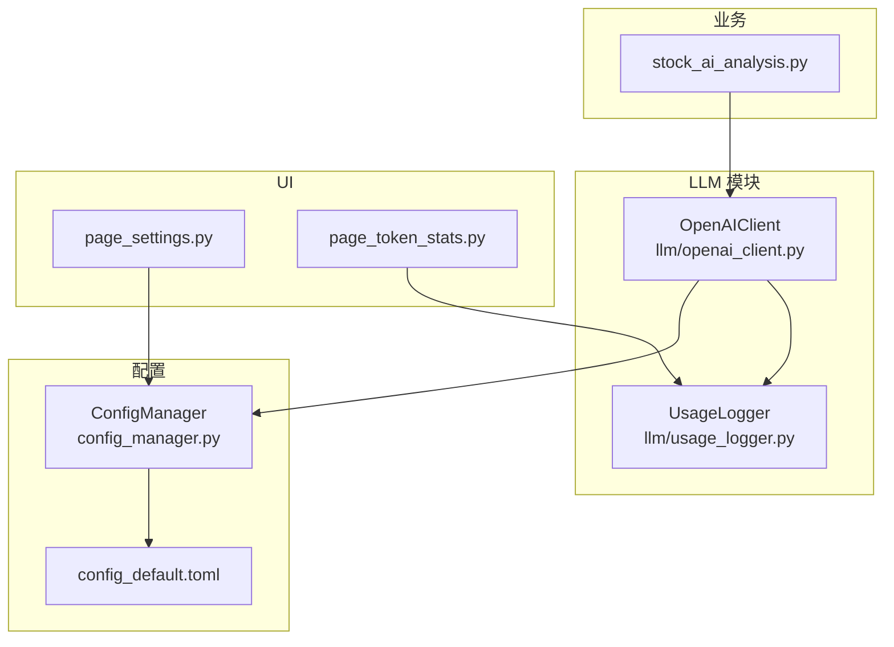
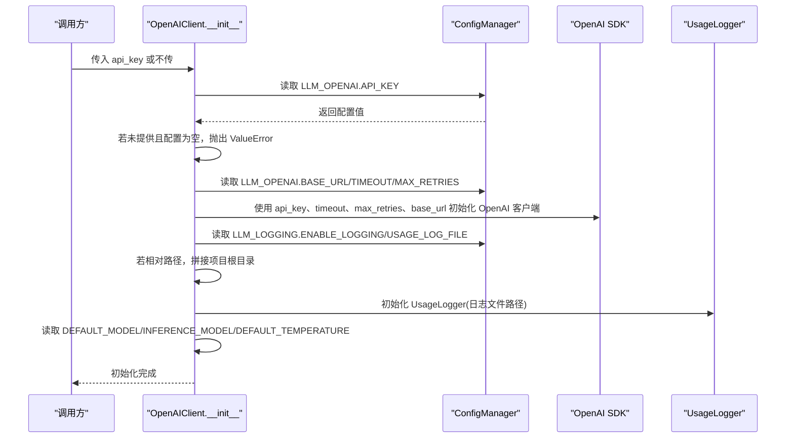
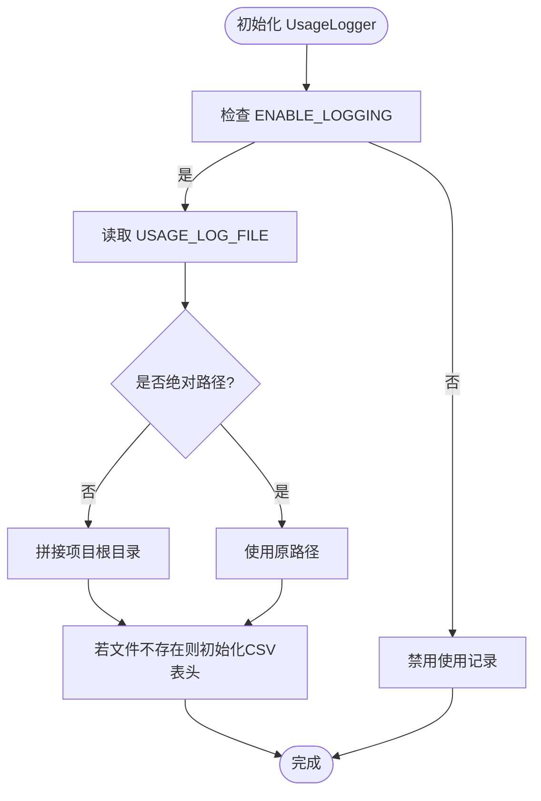
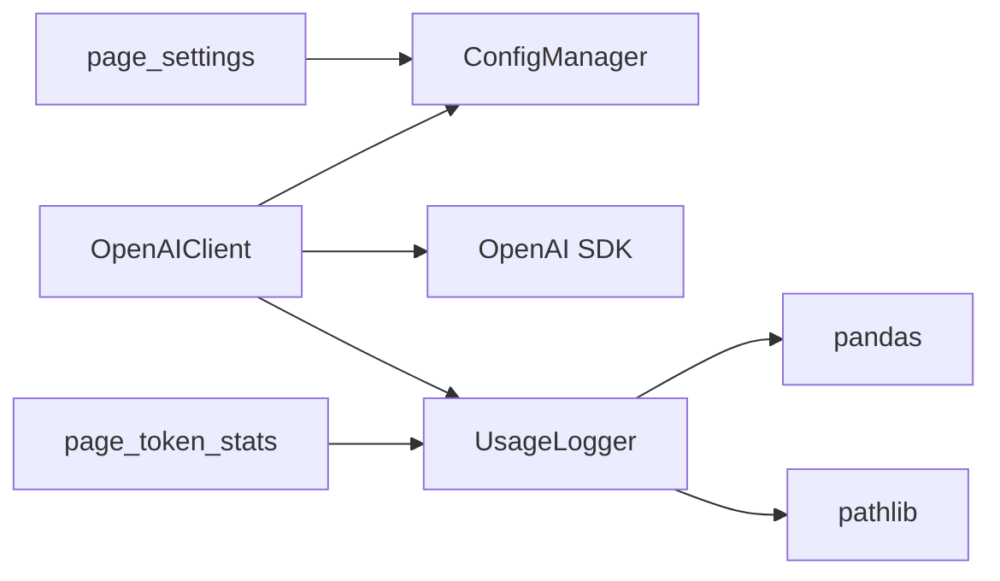

# 客户端初始化

<cite>
**本文引用的文件**
- [openai_client.py](file://llm/openai_client.py)
- [usage_logger.py](file://llm/usage_logger.py)
- [config_manager.py](file://config_manager.py)
- [config_default.toml](file://config_default.toml)
- [page_settings.py](file://ui/components/page_settings.py)
- [page_token_stats.py](file://ui/components/page_token_stats.py)
- [stock_ai_analysis.py](file://stock/stock_ai_analysis.py)
</cite>

## 目录
1. [简介](#简介)
2. [项目结构](#项目结构)
3. [核心组件](#核心组件)
4. [架构总览](#架构总览)
5. [详细组件分析](#详细组件分析)
6. [依赖关系分析](#依赖关系分析)
7. [性能考量](#性能考量)
8. [故障排查指南](#故障排查指南)
9. [结论](#结论)
10. [附录](#附录)

## 简介
本文件聚焦于 OpenAIClient 类的初始化流程，系统性地解释 __init__ 方法的参数与行为，涵盖：
- 参数 api_key 的来源与优先级（手动传入 vs 从配置读取）
- 从 config_manager 自动读取 API 密钥、超时与重试机制
- BASE_URL、DEFAULT_MODEL、INFERENCE_MODEL 等配置项的作用与差异
- UsageLogger 的初始化过程与日志文件路径处理逻辑
- 手动传入 API 密钥与自定义使用记录器的示例路径
- 默认温度、分析模型与推理模型的配置差异
- 错误处理机制，特别是当 API 密钥未设置时抛出的 ValueError 异常

## 项目结构
围绕 OpenAIClient 初始化的相关文件组织如下：
- llm/openai_client.py：OpenAI 客户端封装，包含 __init__、ask、chat、统计与导出等方法
- llm/usage_logger.py：使用记录器，负责 CSV 日志写入、统计与报告导出
- config_manager.py：配置管理器，提供 get/get_openai_config 等接口
- config_default.toml：默认配置文件，定义 LLM_OPENAI、LLM_LOGGING、LLM_CACHE 等节
- ui/components/page_settings.py：UI 设置页，支持修改 LLM_OPENAI 配置并保存
- ui/components/page_token_stats.py：UI 统计页，直接使用 UsageLogger 读取日志
- stock/stock_ai_analysis.py：业务层使用 OpenAIClient 的示例，展示默认模型与推理模型的差异

**图示来源**
- [openai_client.py](file://llm/openai_client.py#L26-L71)
- [usage_logger.py](file://llm/usage_logger.py#L13-L44)
- [config_manager.py](file://config_manager.py#L13-L62)
- [config_default.toml](file://config_default.toml#L1-L20)
- [page_settings.py](file://ui/components/page_settings.py#L12-L118)
- [page_token_stats.py](file://ui/components/page_token_stats.py#L15-L18)
- [stock_ai_analysis.py](file://stock/stock_ai_analysis.py#L303-L346)

**章节来源**
- [openai_client.py](file://llm/openai_client.py#L26-L71)
- [config_manager.py](file://config_manager.py#L13-L62)
- [config_default.toml](file://config_default.toml#L1-L20)

## 核心组件
- OpenAIClient.__init__：负责读取 API 密钥、构建 OpenAI 客户端、初始化 UsageLogger，并设置默认模型与温度
- UsageLogger.__init__：负责日志文件初始化、CSV 表头创建与绝对路径处理
- ConfigManager：提供配置读取、默认配置回退、保存与分组访问
- UI 设置页 page_settings：提供可视化界面修改 LLM_OPENAI 配置并持久化
- UI 统计页 page_token_stats：直接使用 UsageLogger 读取日志并展示统计
- 业务层 stock_ai_analysis：通过 OpenAIClient 生成不同分析类型的报告，体现默认模型与推理模型差异

**章节来源**
- [openai_client.py](file://llm/openai_client.py#L26-L71)
- [usage_logger.py](file://llm/usage_logger.py#L13-L44)
- [config_manager.py](file://config_manager.py#L64-L116)
- [page_settings.py](file://ui/components/page_settings.py#L12-L118)
- [page_token_stats.py](file://ui/components/page_token_stats.py#L15-L18)
- [stock_ai_analysis.py](file://stock/stock_ai_analysis.py#L303-L346)

## 架构总览
OpenAIClient 初始化的关键流程如下：

**图示来源**
- [openai_client.py](file://llm/openai_client.py#L29-L71)
- [config_manager.py](file://config_manager.py#L64-L116)
- [usage_logger.py](file://llm/usage_logger.py#L13-L44)

## 详细组件分析

### OpenAIClient.__init__ 参数与行为
- 参数
  - api_key: 可选；若传入则优先使用；否则从配置读取
  - usage_logger: 可选；若传入则直接使用；否则按配置自动创建
- 关键步骤
  - 读取 API 密钥：若两者均为空，抛出 ValueError
  - 读取 OpenAI 配置：BASE_URL、TIMEOUT、MAX_RETRIES
  - 初始化 OpenAI 客户端：传入 api_key、timeout、max_retries、base_url（如存在）
  - 初始化 UsageLogger：根据 ENABLE_LOGGING 决定是否启用；若启用，读取 USAGE_LOG_FILE 并处理相对路径（拼接项目根目录）
  - 设置默认参数：DEFAULT_MODEL、INFERENCE_MODEL、DEFAULT_TEMPERATURE
- 错误处理
  - 当 API 密钥未设置时，抛出 ValueError，提示在配置文件中设置 LLM_OPENAI.API_KEY

**章节来源**
- [openai_client.py](file://llm/openai_client.py#L29-L71)

### 从 config_manager 自动读取 API 密钥
- 读取顺序
  - 优先使用 __init__ 传入的 api_key
  - 否则从配置中读取 LLM_OPENAI.API_KEY
- 默认回退
  - 若配置文件不存在或读取失败，ConfigManager 将返回默认配置（包含 LLM_OPENAI.API_KEY）
- 保存与更新
  - UI 设置页支持修改并保存 LLM_OPENAI.API_KEY，重启应用后生效

**章节来源**
- [openai_client.py](file://llm/openai_client.py#L37-L41)
- [config_manager.py](file://config_manager.py#L23-L37)
- [config_manager.py](file://config_manager.py#L40-L62)
- [page_settings.py](file://ui/components/page_settings.py#L12-L118)

### 超时与重试机制
- 读取配置
  - TIMEOUT：请求超时时间（秒）
  - MAX_RETRIES：最大重试次数
- 传递给 OpenAI 客户端
  - 通过构造函数参数 timeout 与 max_retries 传入
- 影响范围
  - 影响 ask/chat 的网络请求行为，提升稳定性

**章节来源**
- [openai_client.py](file://llm/openai_client.py#L43-L53)
- [config_manager.py](file://config_manager.py#L40-L62)
- [config_default.toml](file://config_default.toml#L1-L12)

### BASE_URL 的作用
- 用途
  - 指定 OpenAI 兼容服务的基础地址（如 DeepSeek 等）
- 读取与传递
  - 从 LLM_OPENAI.BASE_URL 读取，若存在则传入 OpenAI 客户端
- UI 修改
  - UI 设置页允许修改 BASE_URL，便于切换服务提供商

**章节来源**
- [openai_client.py](file://llm/openai_client.py#L43-L53)
- [config_manager.py](file://config_manager.py#L40-L62)
- [config_default.toml](file://config_default.toml#L1-L12)
- [page_settings.py](file://ui/components/page_settings.py#L37-L41)

### DEFAULT_MODEL 与 INFERENCE_MODEL 的配置与差异
- 配置来源
  - 从 LLM_OPENAI.DEFAULT_MODEL 与 LLM_OPENAI.INFERENCE_MODEL 读取
- 使用场景
  - DEFAULT_MODEL：用于“分析”场景，强调更全面、深入的分析
  - INFERENCE_MODEL：用于“推理”场景，强调更快、更轻量的推理
- 业务体现
  - stock_ai_analysis 中通过 model_type 控制使用哪种模型，体现两种模型的差异化用途

**章节来源**
- [openai_client.py](file://llm/openai_client.py#L65-L69)
- [config_manager.py](file://config_manager.py#L40-L62)
- [config_default.toml](file://config_default.toml#L8-L12)
- [stock_ai_analysis.py](file://stock/stock_ai_analysis.py#L303-L346)

### DEFAULT_TEMPERATURE 的配置与使用
- 配置来源
  - 从 LLM_OPENAI.DEFAULT_TEMPERATURE 读取，默认 0.7
- 使用方式
  - ask/chat 中若未显式传入 temperature，则使用默认温度
- UI 调整
  - UI 设置页提供滑杆调整 DEFAULT_TEMPERATURE，保存后生效

**章节来源**
- [openai_client.py](file://llm/openai_client.py#L65-L69)
- [config_manager.py](file://config_manager.py#L40-L62)
- [config_default.toml](file://config_default.toml#L8-L12)
- [page_settings.py](file://ui/components/page_settings.py#L77-L84)

### UsageLogger 初始化与日志文件路径处理
- 初始化
  - 若 ENABLE_LOGGING 为真，读取 USAGE_LOG_FILE；否则禁用记录
- 路径处理
  - 若 USAGE_LOG_FILE 为相对路径，拼接项目根目录（__file__ 所在目录的父目录）
- CSV 初始化
  - 若日志文件不存在，创建 CSV 并写入表头字段
- 记录写入
  - log_usage 方法追加记录，包含时间戳、模型、tokens、成本估算、温度、输入/输出预览、响应时间、成功标记与错误信息

**图示来源**
- [openai_client.py](file://llm/openai_client.py#L55-L63)
- [usage_logger.py](file://llm/usage_logger.py#L13-L44)

**章节来源**
- [openai_client.py](file://llm/openai_client.py#L55-L63)
- [usage_logger.py](file://llm/usage_logger.py#L13-L44)

### 手动传入 API 密钥与自定义使用记录器
- 手动传入 API 密钥
  - 在调用 OpenAIClient(api_key="your-key") 时直接传入
  - UI 测试连接即演示了该用法
- 自定义使用记录器
  - 通过传入自定义 UsageLogger 实例，实现自定义日志文件路径或行为
  - 适用于多实例隔离记录或特殊日志策略

**章节来源**
- [openai_client.py](file://llm/openai_client.py#L29-L36)
- [page_settings.py](file://ui/components/page_settings.py#L122-L137)

### 错误处理与异常
- API 密钥缺失
  - 当 api_key 与配置均为空时，抛出 ValueError，提示在配置文件中设置 LLM_OPENAI.API_KEY
- 其他异常
  - ask/chat 中捕获异常并记录到 UsageLogger（若启用），同时重新抛出异常
  - 日志记录包含响应时间、输入文本、错误信息等

**章节来源**
- [openai_client.py](file://llm/openai_client.py#L37-L41)
- [openai_client.py](file://llm/openai_client.py#L177-L196)

## 依赖关系分析
- OpenAIClient 依赖
  - config_manager：读取 LLM_OPENAI 与 LLM_LOGGING 配置
  - openai.OpenAI：底层 HTTP 客户端
  - llm.usage_logger.UsageLogger：使用记录与统计
- UsageLogger 依赖
  - pandas：CSV 读写与统计
  - pathlib：路径解析与目录创建
- UI 与配置
  - page_settings：修改并保存配置
  - page_token_stats：读取并展示使用统计

**图示来源**
- [openai_client.py](file://llm/openai_client.py#L14-L18)
- [usage_logger.py](file://llm/usage_logger.py#L1-L12)
- [page_settings.py](file://ui/components/page_settings.py#L12-L118)
- [page_token_stats.py](file://ui/components/page_token_stats.py#L15-L18)

**章节来源**
- [openai_client.py](file://llm/openai_client.py#L14-L18)
- [usage_logger.py](file://llm/usage_logger.py#L1-L12)
- [page_settings.py](file://ui/components/page_settings.py#L12-L118)
- [page_token_stats.py](file://ui/components/page_token_stats.py#L15-L18)

## 性能考量
- 超时与重试
  - 合理设置 TIMEOUT 与 MAX_RETRIES，平衡响应速度与稳定性
- 日志写入
  - CSV 追加写入为顺序 IO，建议在高并发场景考虑异步或批量写入策略
- 模型选择
  - INFERENCE_MODEL 更适合快速推理，DEFAULT_MODEL 更适合深度分析，按场景选择可降低延迟与成本

[本节为通用建议，无需特定文件来源]

## 故障排查指南
- API 密钥未设置
  - 症状：初始化时报 ValueError
  - 处理：在配置文件中设置 LLM_OPENAI.API_KEY，或在调用时传入 api_key
- 日志文件路径无效
  - 症状：日志未生成或路径异常
  - 处理：确认 LLM_LOGGING.USAGE_LOG_FILE 为绝对路径或相对路径（相对路径将拼接项目根目录）
- UI 设置未生效
  - 症状：修改设置后仍使用旧值
  - 处理：保存设置后重启应用，确保配置文件被重新加载

**章节来源**
- [openai_client.py](file://llm/openai_client.py#L37-L41)
- [openai_client.py](file://llm/openai_client.py#L55-L63)
- [page_settings.py](file://ui/components/page_settings.py#L103-L118)

## 结论
OpenAIClient 的初始化流程清晰地体现了“配置驱动”的设计思想：API 密钥、超时、重试、模型与温度等关键参数均可通过配置文件集中管理，并在 UI 中提供可视化修改与保存。UsageLogger 的自动初始化与路径处理进一步简化了使用成本。通过区分 DEFAULT_MODEL 与 INFERENCE_MODEL，系统能够在不同场景下灵活选择模型，兼顾质量与效率。当 API 密钥缺失时，明确的异常提示有助于快速定位问题。

[本节为总结，无需特定文件来源]

## 附录

### 配置项速查
- LLM_OPENAI.API_KEY：API 密钥
- LLM_OPENAI.BASE_URL：服务基础地址
- LLM_OPENAI.TIMEOUT：请求超时（秒）
- LLM_OPENAI.MAX_RETRIES：最大重试次数
- LLM_OPENAI.DEFAULT_MODEL：默认分析模型
- LLM_OPENAI.INFERENCE_MODEL：推理模型
- LLM_OPENAI.DEFAULT_TEMPERATURE：默认温度
- LLM_LOGGING.ENABLE_LOGGING：是否启用使用记录
- LLM_LOGGING.USAGE_LOG_FILE：日志文件路径
- LLM_LOGGING.LOG_LEVEL：日志级别

**章节来源**
- [config_manager.py](file://config_manager.py#L40-L62)
- [config_default.toml](file://config_default.toml#L1-L20)