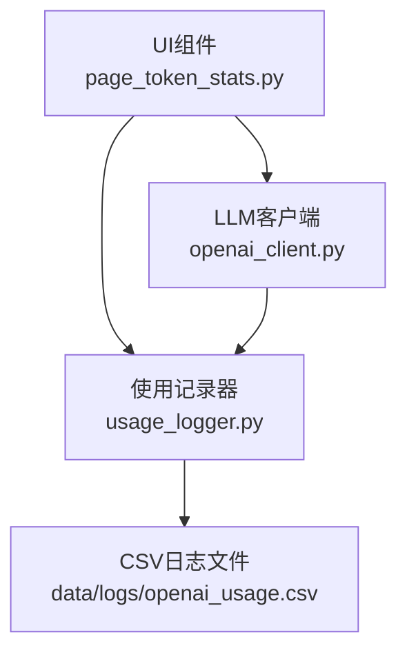
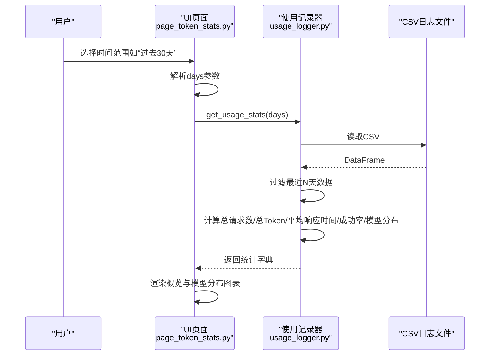
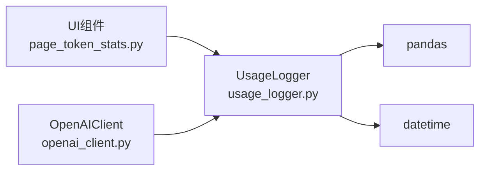

# Token统计界面

<cite>
**本文引用的文件**
- [page_token_stats.py](file://ui/components/page_token_stats.py)
- [usage_logger.py](file://llm/usage_logger.py)
- [openai_client.py](file://llm/openai_client.py)
- [API_DOCUMENTATION.md](file://ui/components/API_DOCUMENTATION.md)
</cite>

## 目录
1. [简介](#简介)
2. [项目结构](#项目结构)
3. [核心组件](#核心组件)
4. [架构总览](#架构总览)
5. [详细组件分析](#详细组件分析)
6. [依赖关系分析](#依赖关系分析)
7. [性能考量](#性能考量)
8. [故障排查指南](#故障排查指南)
9. [结论](#结论)

## 简介
本文件为“Token统计界面”的API参考文档，聚焦于UI组件中的统计功能，涵盖以下三个函数：
- show_usage_overview：统计概览，展示总请求数、总Token使用量、平均响应时间、成功率等关键指标
- show_model_distribution：模型使用分布，展示各模型使用次数与Token消耗分布的可视化
- show_detailed_logs：详细记录，分页展示历史调用记录，包含时间戳、模型、Prompt/Completion/总Token、成本、响应时间、状态等字段

文档还重点解释了days参数对统计范围的影响，以及统计指标的计算方式；并说明了详细记录的分页与字段展示机制。

## 项目结构
该功能位于UI组件层，通过Streamlit构建页面，调用LLM模块的UsageLogger进行统计数据读取与统计计算。

图表来源
- [page_token_stats.py](file://ui/components/page_token_stats.py#L1-L189)
- [usage_logger.py](file://llm/usage_logger.py#L1-L204)
- [openai_client.py](file://llm/openai_client.py#L1-L297)

章节来源
- [page_token_stats.py](file://ui/components/page_token_stats.py#L1-L189)
- [usage_logger.py](file://llm/usage_logger.py#L1-L204)
- [openai_client.py](file://llm/openai_client.py#L1-L297)

## 核心组件
- UI页面组件：负责渲染概览、模型分布与详细记录三部分，提供时间范围选择与分页展示
- 使用记录器：负责读取CSV日志、过滤时间范围、聚合统计指标、导出报告
- LLM客户端：负责在每次调用后记录使用情况（Token、响应时间、成本、是否成功等）

章节来源
- [page_token_stats.py](file://ui/components/page_token_stats.py#L1-L189)
- [usage_logger.py](file://llm/usage_logger.py#L1-L204)
- [openai_client.py](file://llm/openai_client.py#L1-L297)

## 架构总览
下面的序列图展示了从用户选择时间范围到最终渲染统计概览与模型分布的流程。

图表来源
- [page_token_stats.py](file://ui/components/page_token_stats.py#L158-L186)
- [usage_logger.py](file://llm/usage_logger.py#L125-L163)

## 详细组件分析

### 函数：show_usage_overview(days=30)
- 功能概述
  - 展示API使用概览的关键指标：总请求数、总Token数、平均响应时间、成功率
- 参数说明
  - days：统计天数，默认30天。该参数决定统计范围，内部通过时间过滤实现
- 指标计算方式
  - 总请求数：筛选最近days内的记录条数
  - 总Token数：筛选最近days内的total_tokens列求和
  - 平均响应时间：筛选最近days内的response_time列均值
  - 成功率：筛选最近days内的success列均值（True视为1，False为0）
- UI呈现
  - 使用三列指标展示总请求数、总Token数、平均响应时间
  - 成功率以进度条形式展示，文本标注百分比

章节来源
- [page_token_stats.py](file://ui/components/page_token_stats.py#L26-L53)
- [usage_logger.py](file://llm/usage_logger.py#L125-L163)

### 函数：show_model_distribution(days=30)
- 功能概述
  - 展示各模型使用次数的柱状图，并提供详细数据表格
- 参数说明
  - days：统计天数，默认30天。同样通过时间过滤限定统计范围
- 实现要点
  - 从统计字典中读取model_distribution（按model分组的计数）
  - 构造DataFrame并使用Altair绘制柱状图，x轴为模型，y轴为使用次数
  - 提供可展开的详细数据表格，便于进一步分析
- 可视化说明
  - 柱状图按使用次数降序排序，颜色区分不同模型
  - 图表高度固定，容器宽度自适应

章节来源
- [page_token_stats.py](file://ui/components/page_token_stats.py#L54-L83)
- [usage_logger.py](file://llm/usage_logger.py#L125-L163)

### 函数：show_detailed_logs()
- 功能概述
  - 分页显示详细使用记录，支持查看请求详情与错误信息
- 数据来源
  - 直接读取UsageLogger.log_file对应的CSV文件
- 字段说明
  - 时间戳：记录发生时间
  - 模型：使用的模型名称
  - Prompt Token：输入Token数
  - Completion Token：输出Token数
  - 总Token：总Token数
  - 成本：估算成本（基于OpenAI定价）
  - 响应时间：本次调用耗时（秒）
  - 成功：布尔值，标记本次调用是否成功
  - 错误信息：当失败时记录错误原因
  - 温度参数：调用时的温度设置
  - 输入文本/输出文本：分别提供预览与完整文本区域
- 分页与排序
  - 读取CSV后按时间倒序排列，时间越近的记录越靠前
  - 仅展示必要字段，其余字段可通过展开面板查看
- 交互细节
  - 提供选择框切换到具体记录，展示该条记录的完整详情
  - 失败记录会显示错误信息
  - 文本域支持查看较长的输入/输出内容

章节来源
- [page_token_stats.py](file://ui/components/page_token_stats.py#L84-L156)
- [usage_logger.py](file://llm/usage_logger.py#L1-L124)

### 时间范围参数 days 的影响
- 统计范围过滤
  - UsageLogger在get_usage_stats中读取CSV后，将timestamp转换为日期时间类型，并根据当前时间减去days得到截止时间，仅保留晚于截止时间的记录
- 对各指标的影响
  - 总请求数、总Token数、平均响应时间、成功率、模型分布均基于该过滤后的子集计算
- UI侧选择
  - 页面提供“过去7天”、“过去30天”、“过去90天”、“所有时间”等快速选择，对应不同的days值

章节来源
- [page_token_stats.py](file://ui/components/page_token_stats.py#L161-L175)
- [usage_logger.py](file://llm/usage_logger.py#L135-L163)

### 与LLM客户端的集成
- 客户端记录使用情况
  - OpenAIClient在每次调用后，若启用使用记录器，会调用UsageLogger.log_usage记录模型、Token、响应时间、成本、是否成功、错误信息等
- 统计来源
  - UI页面直接调用UsageLogger.get_usage_stats获取统计字典，无需直接访问客户端
- 配置与文件位置
  - UsageLogger默认写入data/logs/openai_usage.csv，可通过配置项调整

章节来源
- [openai_client.py](file://llm/openai_client.py#L141-L196)
- [usage_logger.py](file://llm/usage_logger.py#L1-L124)

## 依赖关系分析
- UI组件依赖UsageLogger进行数据读取与统计
- UsageLogger依赖pandas进行数据处理，依赖datetime进行时间过滤
- OpenAIClient在调用完成后写入CSV，成为UsageLogger的统计数据源

图表来源
- [page_token_stats.py](file://ui/components/page_token_stats.py#L1-L189)
- [usage_logger.py](file://llm/usage_logger.py#L1-L204)
- [openai_client.py](file://llm/openai_client.py#L1-L297)

章节来源
- [page_token_stats.py](file://ui/components/page_token_stats.py#L1-L189)
- [usage_logger.py](file://llm/usage_logger.py#L1-L204)
- [openai_client.py](file://llm/openai_client.py#L1-L297)

## 性能考量
- 数据规模
  - CSV文件随调用次数增长而增大，建议定期归档或清理旧数据
- 统计复杂度
  - get_usage_stats对CSV进行一次读取与一次时间过滤，随后进行聚合计算，整体为O(n)级别
- UI渲染
  - Altair图表渲染受数据量影响，建议在days范围内合理选择统计周期，避免一次性渲染过多数据
- I/O与磁盘
  - CSV读写频繁，建议确保磁盘空间充足并定期备份

## 故障排查指南
- 无使用数据
  - 若统计字典为空，UI会提示“暂无使用数据”。检查：
    - CSV文件是否存在且非空
    - OpenAIClient是否正确记录使用情况（确认启用日志记录器）
- 读取CSV失败
  - UI在读取详细记录时捕获异常并提示错误信息，检查：
    - CSV文件权限与路径
    - 文件是否被其他进程占用
- 成功率异常
  - 若成功率与预期不符，检查：
    - success字段是否正确写入（True/False）
    - days参数是否过大导致包含大量失败记录
- 成本估算差异
  - 成本基于内置定价表估算，若模型不在定价表中，成本为0。确认：
    - 使用的模型名称是否在定价表中
    - 是否需要更新定价表

章节来源
- [page_token_stats.py](file://ui/components/page_token_stats.py#L33-L53)
- [page_token_stats.py](file://ui/components/page_token_stats.py#L88-L156)
- [usage_logger.py](file://llm/usage_logger.py#L100-L118)

## 结论
Token统计界面通过简洁直观的UI与可靠的统计逻辑，帮助用户掌握LLM调用的整体使用情况。show_usage_overview提供关键指标概览，show_model_distribution提供模型维度的使用分布，show_detailed_logs提供可追溯的历史记录。days参数灵活控制统计范围，配合CSV日志与UsageLogger的聚合能力，形成完整的成本与用量监控闭环。