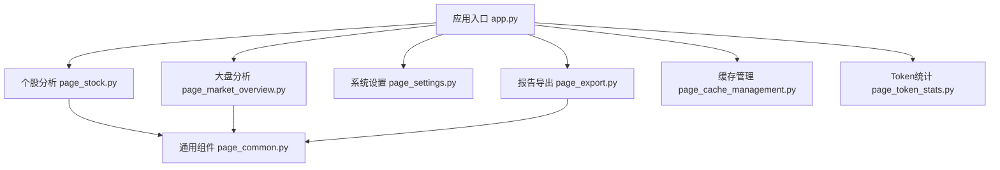
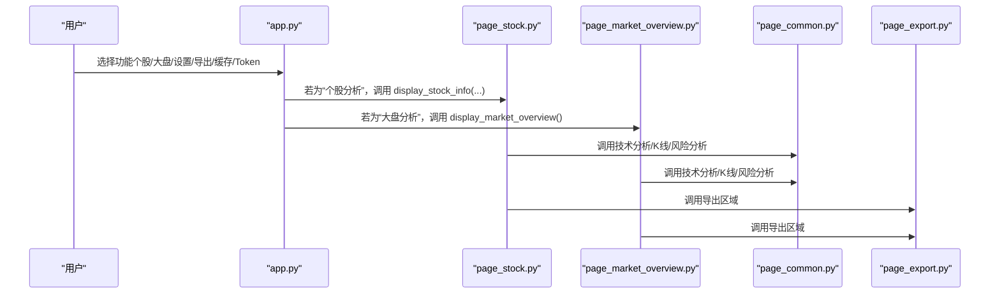
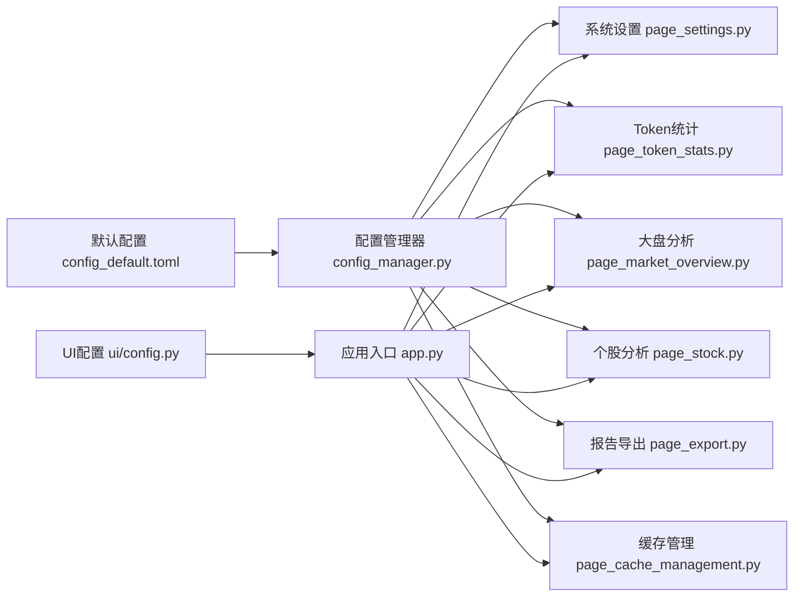

# Web界面API

<cite>
**本文引用的文件**
- [API 文档](file://ui/components/API_DOCUMENTATION.md)
- [通用组件 page_common.py](file://ui/components/page_common.py)
- [个股分析组件 page_stock.py](file://ui/components/page_stock.py)
- [大盘分析组件 page_market_overview.py](file://ui/components/page_market_overview.py)
- [系统设置组件 page_settings.py](file://ui/components/page_settings.py)
- [报告导出组件 page_export.py](file://ui/components/page_export.py)
- [缓存管理组件 page_cache_management.py](file://ui/components/page_cache_management.py)
- [Token统计组件 page_token_stats.py](file://ui/components/page_token_stats.py)
- [应用入口 app.py](file://ui/app.py)
- [启动脚本 start_ui.py](file://ui/start_ui.py)
- [UI 配置 config.py](file://ui/config.py)
- [配置管理器 config_manager.py](file://config_manager.py)
- [默认配置 config_default.toml](file://config_default.toml)
</cite>

## 目录
1. [简介](#简介)
2. [项目结构](#项目结构)
3. [核心组件](#核心组件)
4. [架构总览](#架构总览)
5. [详细组件分析](#详细组件分析)
6. [依赖关系分析](#依赖关系分析)
7. [性能与可用性考量](#性能与可用性考量)
8. [故障排查指南](#故障排查指南)
9. [结论](#结论)
10. [附录](#附录)

## 简介
本文件面向前端与后端开发者，系统化梳理基于 Streamlit 的 Web 界面 API，覆盖通用组件、个股分析、大盘分析、系统设置、报告导出、缓存管理与 Token 统计等模块。文档聚焦：
- 每个组件的公共接口函数、参数、返回值与典型使用场景
- 在系统中的集成方式与调用链路
- Session State 使用模式与错误处理机制
- 响应式布局与用户体验最佳实践

## 项目结构
UI 层采用模块化组织，核心入口为 app.py，按功能拆分为多个页面组件模块；通用组件 page_common.py 提供跨页面复用的 UI 能力；page_stock.py、page_market_overview.py、page_settings.py、page_export.py、page_cache_management.py、page_token_stats.py 分别承载个股分析、大盘分析、系统设置、报告导出、缓存管理与 Token 统计功能；UI 配置与配置管理器分别位于 ui/config.py 与 config_manager.py；默认配置位于 config_default.toml。

图表来源
- [应用入口 app.py](file://ui/app.py#L1-L229)
- [个股分析组件 page_stock.py](file://ui/components/page_stock.py#L1-L884)
- [大盘分析组件 page_market_overview.py](file://ui/components/page_market_overview.py#L1-L758)
- [系统设置组件 page_settings.py](file://ui/components/page_settings.py#L1-L216)
- [报告导出组件 page_export.py](file://ui/components/page_export.py#L1-L457)
- [缓存管理组件 page_cache_management.py](file://ui/components/page_cache_management.py#L1-L133)
- [Token统计组件 page_token_stats.py](file://ui/components/page_token_stats.py#L1-L189)
- [通用组件 page_common.py](file://ui/components/page_common.py#L1-L291)

章节来源
- [应用入口 app.py](file://ui/app.py#L1-L229)
- [UI 配置 config.py](file://ui/config.py#L1-L82)

## 核心组件
本节汇总各组件的公共接口与使用要点，便于快速查阅与集成。

- 通用组件（page_common.py）
  - 技术指标展示：display_technical_indicators(tech_data: dict) -> None
  - 技术分析标签页：display_technical_analysis_tab(stock_identity: dict=None, index_name: str=None) -> None
  - 风险分析展示：display_risk_analysis(risk_metrics: dict) -> None
  - K线图渲染：display_kline_charts(df: pd.DataFrame, chart_type: str="stock", title_prefix: str="") -> None

- 个股分析组件（page_stock.py）
  - 主显示函数：display_stock_info(stock_identity: dict) -> None
  - 基本信息展示：display_basic_info(stock_identity: dict) -> None
  - 基本面分析：display_fundamental_analysis(stock_identity: dict) -> None
  - 技术分析：display_technical_analysis(stock_identity: dict) -> None
  - 新闻分析：display_news_analysis(stock_identity: dict) -> None
  - 筹码分析：display_chips_analysis(stock_identity: dict) -> None
  - 公司分析：display_company_analysis(stock_identity: dict) -> None
  - 综合分析：display_comprehensive_analysis(stock_identity: dict) -> None

- 大盘分析组件（page_market_overview.py）
  - 主显示函数：display_market_overview() -> None
  - 估值分析：display_valuation_analysis(index_name: str='沪深300', use_cache: bool=True) -> None
  - 资金流向分析：display_money_flow_analysis(use_cache: bool=True) -> None
  - 融资融券分析：display_margin_trading_analysis(use_cache: bool=True) -> None
  - 市场情绪分析：display_market_sentiment_analysis(use_cache: bool=True) -> None
  - 技术分析：display_market_technical_analysis(index_name: str='上证指数') -> None
  - 指数信息：display_market_indices() -> None
  - 市场综合摘要：display_market_summary(index_name: str='上证指数') -> None

- 系统设置组件（page_settings.py）
  - 配置保存：save_config(section: str, key: str, value: any) -> bool
  - 设置界面：main() -> None

- 报告导出组件（page_export.py）
  - 导出区域：display_report_export_section(entity_id: str, report_type: str="report", title: str="📋 导出报告", info_text: str="💡 可以导出完整的分析报告", generate_func: callable=None, generate_args: tuple=None, filename_prefix: str="报告") -> None
  - 快速导出：display_quick_export_buttons(entity_id: str, report_type: str="report", generate_func: callable=None, generate_args: tuple=None, filename_prefix: str="报告") -> None
  - 批量导出：display_batch_export_options(entities: list, report_type: str="report", generate_func: callable=None, generate_args_func: callable=None, filename_prefix: str="报告") -> None

- 缓存管理组件（page_cache_management.py）
  - 主界面：main() -> None

- Token统计组件（page_token_stats.py）
  - 使用概览：show_usage_overview(days: int=30) -> None
  - 模型分布：show_model_distribution(days: int=30) -> None
  - 详细记录：show_detailed_logs() -> None
  - 主界面：main() -> None

章节来源
- [API 文档](file://ui/components/API_DOCUMENTATION.md#L1-L738)
- [通用组件 page_common.py](file://ui/components/page_common.py#L1-L291)
- [个股分析组件 page_stock.py](file://ui/components/page_stock.py#L1-L884)
- [大盘分析组件 page_market_overview.py](file://ui/components/page_market_overview.py#L1-L758)
- [系统设置组件 page_settings.py](file://ui/components/page_settings.py#L1-L216)
- [报告导出组件 page_export.py](file://ui/components/page_export.py#L1-L457)
- [缓存管理组件 page_cache_management.py](file://ui/components/page_cache_management.py#L1-L133)
- [Token统计组件 page_token_stats.py](file://ui/components/page_token_stats.py#L1-L189)

## 架构总览
UI 通过 app.py 的路由与侧边栏菜单，将用户引导至不同功能模块；个股与大盘分析模块进一步调用通用组件 page_common.py 提供的可视化与分析能力；系统设置与 Token 统计模块负责配置与用量监控；报告导出模块提供统一的导出接口；缓存管理模块提供清理与确认机制。

图表来源
- [应用入口 app.py](file://ui/app.py#L1-L229)
- [个股分析组件 page_stock.py](file://ui/components/page_stock.py#L1-L884)
- [大盘分析组件 page_market_overview.py](file://ui/components/page_market_overview.py#L1-L758)
- [通用组件 page_common.py](file://ui/components/page_common.py#L1-L291)
- [报告导出组件 page_export.py](file://ui/components/page_export.py#L1-L457)

## 详细组件分析

### 通用组件（page_common.py）
- 技术指标展示
  - 参数：tech_data（dict），包含 MA5/10/20/60、RSI、KDJ、MACD、布林带、威廉指标、CCI 等键
  - 返回：None
  - 使用场景：在个股/大盘技术分析中统一展示指标卡片
  - 示例路径：[示例调用位置](file://ui/components/API_DOCUMENTATION.md#L31-L60)
- 技术分析标签页
  - 参数：stock_identity（dict，含 code/name/market_name）或 index_name（str）
  - 返回：None
  - 使用场景：根据传入类型分别获取个股或指数的技术指标并展示
  - 示例路径：[示例调用位置](file://ui/components/API_DOCUMENTATION.md#L63-L89)
- 风险分析展示
  - 参数：risk_metrics（dict），可包含 summary_table 或 error
  - 返回：None
  - 使用场景：展示风险评估文本或表格
- K线图渲染
  - 参数：df（pd.DataFrame，需包含 datetime/open/high/low/close/volume）、chart_type（"stock"/"index"）、title_prefix（str）
  - 返回：None
  - 使用场景：渲染 K 线与均线、成交量图表
  - 示例路径：[示例调用位置](file://ui/components/API_DOCUMENTATION.md#L108-L145)

章节来源
- [通用组件 page_common.py](file://ui/components/page_common.py#L1-L291)
- [API 文档](file://ui/components/API_DOCUMENTATION.md#L23-L146)

### 个股分析组件（page_stock.py）
- 主显示函数 display_stock_info
  - 参数：stock_identity（dict，含 code/name/market_name）
  - 返回：None
  - 使用场景：展示个股完整分析界面（基本信息、行情走势、新闻资讯、筹码分析、综合分析）
  - 示例路径：[示例调用位置](file://ui/components/API_DOCUMENTATION.md#L156-L176)
- 基本信息展示 display_basic_info
  - 参数：stock_identity（dict）
  - 返回：None
  - 使用场景：展示实时行情、财务指标、ETF持仓、分红信息等
- 技术分析 display_technical_analysis
  - 参数：stock_identity（dict）
  - 返回：None
  - 使用场景：获取 K 线数据，调用通用组件渲染 K 线与技术指标，展示风险分析
- 新闻分析 display_news_analysis
  - 参数：stock_identity（dict）
  - 返回：None
  - 使用场景：获取新闻数据，支持 AI 新闻分析报告
- 筹码分析 display_chips_analysis
  - 参数：stock_identity（dict）
  - 返回：None
  - 使用场景：展示筹码分布、获利比例、成本中枢等，并尝试绘制趋势图
- 综合分析 display_comprehensive_analysis
  - 参数：stock_identity（dict）
  - 返回：None
  - 使用场景：展示 AI 综合分析报告与数据来源
- Session State 使用
  - 缓存控制：st.session_state.get('use_cache', True)
  - AI分析缓存：ai_fundamental_report/ai_market_report/ai_news_report/ai_chip_report/ai_company_report/ai_comprehensive_report
  - AI分析开关：st.session_state.get('include_ai_analysis', False)
  - 示例路径：[Session State 使用位置](file://ui/components/API_DOCUMENTATION.md#L226-L245)

章节来源
- [个股分析组件 page_stock.py](file://ui/components/page_stock.py#L1-L884)
- [API 文档](file://ui/components/API_DOCUMENTATION.md#L148-L246)

### 大盘分析组件（page_market_overview.py）
- 主显示函数 display_market_overview
  - 返回：None
  - 使用场景：展示指数选择器、标签页与 AI 分析开关
- 估值分析 display_valuation_analysis
  - 参数：index_name（str，默认'沪深300'）、use_cache（bool）
  - 返回：None
  - 使用场景：展示 PE、股息率与估值水平
- 资金流向分析 display_money_flow_analysis
  - 参数：use_cache（bool）
  - 返回：None
  - 使用场景：展示 M2/M1 余额与增长
- 融资融券分析 display_margin_trading_analysis
  - 参数：use_cache（bool）
  - 返回：None
  - 使用场景：展示融资融券余额与周变化率
- 市场情绪分析 display_market_sentiment_analysis
  - 参数：use_cache（bool）
  - 返回：None
  - 使用场景：展示综合市场情绪指标
- 技术分析 display_market_technical_analysis
  - 参数：index_name（str，默认'上证指数'）
  - 返回：None
  - 使用场景：渲染指数 K 线、技术指标与风险分析
- 指数信息 display_market_indices
  - 返回：None
  - 使用场景：展示主要指数的实时价格与涨跌幅
- 综合摘要 display_market_summary
  - 参数：index_name（str）
  - 返回：None
  - 使用场景：整合 AI 分析、综合评级与报告导出
- Session State 使用
  - 缓存控制：st.session_state['market_use_cache'] = True
  - 分析状态：st.session_state['show_analysis_results'] = True；st.session_state['current_analysis_index'] = selected_index
  - AI报告：st.session_state.ai_index_report
  - 用户观点：st.session_state.market_user_opinion
  - 示例路径：[Session State 使用位置](file://ui/components/API_DOCUMENTATION.md#L328-L344)

章节来源
- [大盘分析组件 page_market_overview.py](file://ui/components/page_market_overview.py#L1-L758)
- [API 文档](file://ui/components/API_DOCUMENTATION.md#L248-L345)

### 系统设置组件（page_settings.py）
- 配置保存 save_config
  - 参数：section（str，如 LLM_OPENAI/LLM_CACHE/ANALYSIS/USER_PROFILE）、key（str）、value（any）
  - 返回：bool（保存是否成功）
  - 使用场景：保存 OpenAI API 配置、缓存配置、分析偏好与用户画像
  - 示例路径：[示例调用位置](file://ui/components/API_DOCUMENTATION.md#L353-L379)
- 设置界面 main
  - 返回：None
  - 使用场景：提供 UI 以编辑配置并保存
- 配置项结构
  - OpenAI API配置：API_KEY、BASE_URL、DEFAULT_MODEL、INFERENCE_MODEL、TIMEOUT、MAX_RETRIES、DEFAULT_TEMPERATURE
  - 缓存配置：ENABLE_CACHE、CACHE_TTL
  - 分析配置：RISK_PREFERENCE（conservative/neutral/aggressive/custom）、CUSTOM_PRINCIPLES
  - 用户画像：RAW、MISTAKES
  - 示例路径：[配置项结构位置](file://ui/components/API_DOCUMENTATION.md#L381-L436)

章节来源
- [系统设置组件 page_settings.py](file://ui/components/page_settings.py#L1-L216)
- [API 文档](file://ui/components/API_DOCUMENTATION.md#L347-L436)

### 报告导出组件（page_export.py）
- 导出区域 display_report_export_section
  - 参数：entity_id（str）、report_type（str）、title（str）、info_text（str）、generate_func（callable）、generate_args（tuple）、filename_prefix（str）
  - 返回：None
  - 使用场景：统一的导出界面，支持 PDF/DOCX/Markdown/HTML（根据环境支持）
  - 示例路径：[示例调用位置](file://ui/components/API_DOCUMENTATION.md#L445-L479)
- 快速导出 display_quick_export_buttons
  - 参数：同上（无格式选择）
  - 返回：None
- 批量导出 display_batch_export_options
  - 参数：entities（list）、generate_args_func（callable）
  - 返回：None
- 支持的导出格式
  - PDF、DOCX、Markdown、HTML（根据环境支持）
  - 示例路径：[导出格式说明位置](file://ui/components/API_DOCUMENTATION.md#L512-L520)
- Session State 使用
  - 存储生成内容：{report_type}_content_{entity_id}、{report_type}_filename_{entity_id}、{report_type}_mime_{entity_id}、{report_type}_timestamp_{entity_id}
  - 示例路径：[Session State 使用位置](file://ui/components/API_DOCUMENTATION.md#L521-L529)

章节来源
- [报告导出组件 page_export.py](file://ui/components/page_export.py#L1-L457)
- [API 文档](file://ui/components/API_DOCUMENTATION.md#L439-L530)

### 缓存管理组件（page_cache_management.py）
- 主界面 main
  - 返回：None
  - 使用场景：提供清理个股/大盘/通用缓存的按钮与确认弹窗
- 缓存清理选项
  - 个股数据缓存：基本信息、技术指标、新闻、AI分析、筹码分析
  - 大盘数据缓存：市场情绪、估值指标、资金流向、融资融券
  - 通用缓存：K线数据、股票名映射
  - 示例路径：[缓存清理选项位置](file://ui/components/API_DOCUMENTATION.md#L546-L565)

章节来源
- [缓存管理组件 page_cache_management.py](file://ui/components/page_cache_management.py#L1-L133)
- [API 文档](file://ui/components/API_DOCUMENTATION.md#L532-L575)

### Token统计组件（page_token_stats.py）
- 使用概览 show_usage_overview
  - 参数：days（int，默认30）
  - 返回：None
  - 使用场景：展示总请求数、总Token数、平均响应时间、成功率
- 模型分布 show_model_distribution
  - 参数：days（int，默认30）
  - 返回：None
  - 使用场景：柱状图展示各模型使用次数
- 详细记录 show_detailed_logs
  - 返回：None
  - 使用场景：展示 CSV 日志明细与请求详情
- 主界面 main
  - 返回：None
  - 使用场景：提供时间范围选择与两个标签页

章节来源
- [Token统计组件 page_token_stats.py](file://ui/components/page_token_stats.py#L1-L189)
- [API 文档](file://ui/components/API_DOCUMENTATION.md#L577-L638)

## 依赖关系分析
- 组件耦合与内聚
  - page_stock.py 与 page_common.py：高内聚的可视化与分析能力复用
  - page_market_overview.py 与 page_common.py：技术分析与 K 线渲染复用
  - page_export.py 与各分析模块：统一导出接口，降低耦合
- 外部依赖与集成点
  - 配置管理：config_manager.py 与 config_default.toml 提供统一配置读取与默认值
  - UI 配置：ui/config.py 提供市场类型、指数映射等 UI 常量
  - 启动脚本：ui/start_ui.py 以 8811 端口启动 Streamlit 应用
- Session State 设计
  - 个股分析：use_cache、include_ai_analysis、各 AI 报告缓存字典
  - 大盘分析：market_use_cache、show_analysis_results、current_analysis_index、ai_index_report、market_user_opinion
  - 导出模块：按 report_type+entity_id 维度存储生成内容与元信息
  - 缓存管理：确认弹窗通过 st.session_state 控制显示

图表来源
- [配置管理器 config_manager.py](file://config_manager.py#L1-L144)
- [默认配置 config_default.toml](file://config_default.toml#L1-L64)
- [UI 配置 config.py](file://ui/config.py#L1-L82)
- [应用入口 app.py](file://ui/app.py#L1-L229)

章节来源
- [配置管理器 config_manager.py](file://config_manager.py#L1-L144)
- [默认配置 config_default.toml](file://config_default.toml#L1-L64)
- [UI 配置 config.py](file://ui/config.py#L1-L82)
- [应用入口 app.py](file://ui/app.py#L1-L229)

## 性能与可用性考量
- 合理使用缓存
  - 通过 use_cache 与 market_use_cache 控制数据新鲜度与性能平衡
  - 导出模块按 report_type+entity_id 存储生成内容，避免重复计算
- 响应式布局
  - 使用 st.columns 与 st.expander 实现信息分组与折叠，提升可读性
- 加载状态管理
  - 使用 st.spinner 提示用户等待，减少感知延迟
- 错误处理
  - 统一捕获异常并以 st.error 展示，必要时提供“错误详情”展开面板
- 数据验证
  - 对股票代码格式进行简单校验，避免无效请求

章节来源
- [API 文档](file://ui/components/API_DOCUMENTATION.md#L640-L702)

## 故障排查指南
- 常见问题定位
  - API 连接失败：在设置界面测试连接，检查 API Key、Base URL、超时与重试配置
  - 导出失败：检查 generate_func 是否提供、格式支持情况与 Session State 中的内容键是否存在
  - 缓存清理无效：确认清理按钮触发逻辑与缓存目录权限
- 日志与诊断
  - Token统计页面可查看详细日志与错误信息
  - 各模块均提供“错误详情”展开面板，便于定位异常
- 重启与生效
  - 配置变更后需重启应用以使配置生效

章节来源
- [系统设置组件 page_settings.py](file://ui/components/page_settings.py#L122-L137)
- [Token统计组件 page_token_stats.py](file://ui/components/page_token_stats.py#L84-L156)
- [应用入口 app.py](file://ui/app.py#L198-L203)

## 结论
本 Web 界面 API 以模块化设计实现高内聚、低耦合的组件体系，通过统一的通用组件与导出接口，有效支撑个股与大盘分析场景；配合完善的 Session State 使用模式与错误处理机制，兼顾性能与用户体验。建议在生产环境中：
- 明确各模块的缓存策略与失效机制
- 规范导出接口的参数与返回约定
- 强化配置管理与日志可观测性
- 持续优化响应式布局与交互细节

## 附录
- 启动与访问
  - 通过 ui/start_ui.py 以 8811 端口启动应用
  - 访问 http://localhost:8811 查看界面
- 版本与端口
  - 版本信息与端口在 UI 配置中定义，可通过 UI 展示

章节来源
- [启动脚本 start_ui.py](file://ui/start_ui.py#L1-L60)
- [UI 配置 config.py](file://ui/config.py#L1-L21)
- [应用入口 app.py](file://ui/app.py#L32-L82)