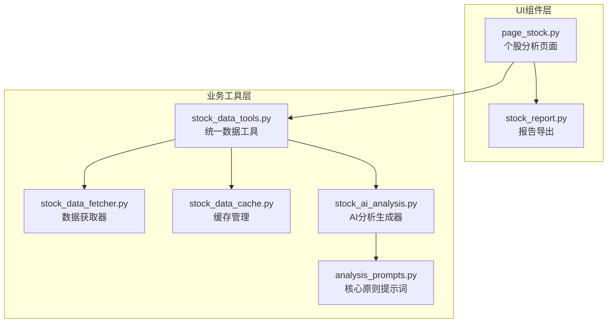
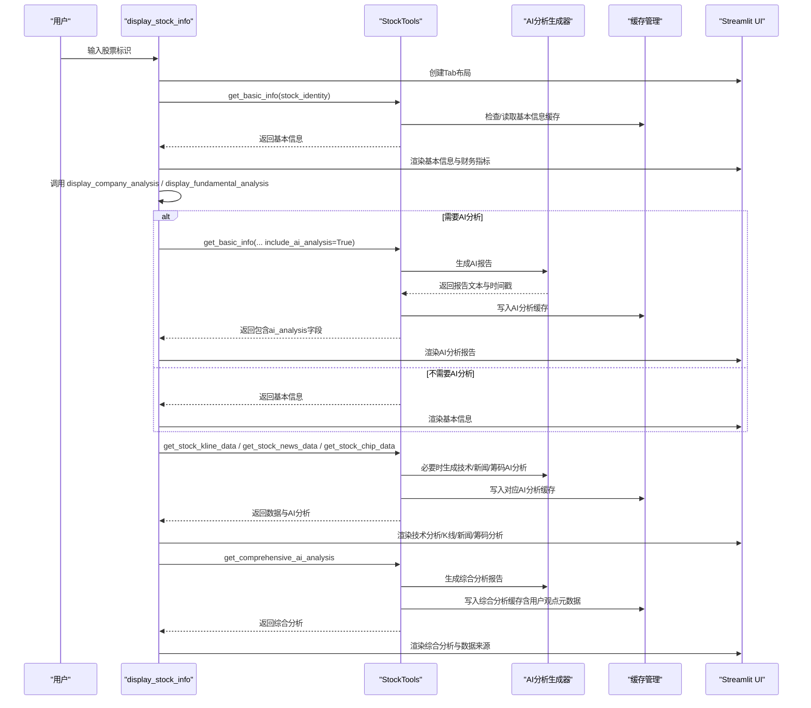
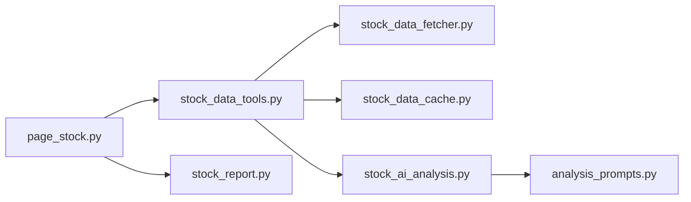

# 个股分析界面

<cite>
**本文引用的文件**
- [page_stock.py](file://ui/components/page_stock.py)
- [stock_data_tools.py](file://stock/stock_data_tools.py)
- [stock_data_fetcher.py](file://stock/stock_data_fetcher.py)
- [stock_data_cache.py](file://stock/stock_data_cache.py)
- [stock_ai_analysis.py](file://stock/stock_ai_analysis.py)
- [analysis_prompts.py](file://stock/analysis_prompts.py)
- [stock_report.py](file://stock/stock_report.py)
- [test_page_stock.py](file://tests/unit/ui/test_page_stock.py)
</cite>

## 目录
1. [简介](#简介)
2. [项目结构](#项目结构)
3. [核心组件](#核心组件)
4. [架构总览](#架构总览)
5. [详细组件分析](#详细组件分析)
6. [依赖关系分析](#依赖关系分析)
7. [性能考量](#性能考量)
8. [故障排查指南](#故障排查指南)
9. [结论](#结论)
10. [附录](#附录)

## 简介
本文件为“个股分析界面”的API参考文档，聚焦于页面组件 page_stock.py 中的公共接口函数，包括主函数 display_stock_info 以及子功能函数 display_basic_info、display_fundamental_analysis、display_technical_analysis、display_news_analysis、display_chips_analysis、display_company_analysis 和 display_comprehensive_analysis。文档系统化说明每个函数的参数、返回值、调用关系、使用场景，并解释这些组件如何通过 Streamlit 的 Tab 布局组织成完整的个股分析界面。同时，文档化组件的 Session State 管理机制，特别是 AI 分析报告的缓存策略与失效条件。

## 项目结构
个股分析界面位于 UI 组件层，围绕页面入口函数 display_stock_info 展开，内部按 Tab 划分多个分析区域，每个区域由独立函数负责渲染与数据获取。数据获取与缓存逻辑由 stock_data_tools 统一封装，AI 分析由 stock_ai_analysis 提供，导出功能由 stock_report 提供。

图表来源
- [page_stock.py](file://ui/components/page_stock.py#L1-L120)
- [stock_data_tools.py](file://stock/stock_data_tools.py#L1-L120)
- [stock_data_fetcher.py](file://stock/stock_data_fetcher.py#L1-L120)
- [stock_data_cache.py](file://stock/stock_data_cache.py#L1-L80)
- [stock_ai_analysis.py](file://stock/stock_ai_analysis.py#L1-L120)
- [analysis_prompts.py](file://stock/analysis_prompts.py#L1-L54)
- [stock_report.py](file://stock/stock_report.py#L1-L40)

章节来源
- [page_stock.py](file://ui/components/page_stock.py#L1-L120)
- [stock_data_tools.py](file://stock/stock_data_tools.py#L1-L120)

## 核心组件
本节梳理页面主函数与各分析子函数的职责边界、输入输出与调用关系。

- 主函数
  - display_stock_info(stock_identity)
    - 参数：stock_identity（字典，包含 code、name、market_name 等）
    - 返回：无（在 UI 中渲染多个 Tab）
    - 调用关系：内部依次调用 display_basic_info、display_technical_analysis、display_news_analysis、display_chips_analysis、display_comprehensive_analysis，并在末尾集成导出功能。
    - 使用场景：作为页面入口，接收用户输入的股票标识，组织分析界面。

- 子函数
  - display_basic_info(stock_identity)
    - 参数：stock_identity
    - 返回：无（渲染基本信息与财务指标、分红信息、ETF持仓等）
    - 调用关系：通过 stock_data_tools.get_basic_info 获取数据，必要时触发公司分析与基本面分析的 AI 生成。
  - display_fundamental_analysis(stock_identity)
    - 参数：stock_identity
    - 返回：无（渲染 AI 基本面分析报告）
    - 调用关系：根据 Session State 决定是否触发 AI 分析；若触发，通过 stock_data_tools.get_basic_info(include_ai_analysis=True) 获取并缓存报告。
  - display_technical_analysis(stock_identity)
    - 参数：stock_identity
    - 返回：无（渲染 K 线图、技术指标、风险分析与 AI 行情分析）
    - 调用关系：通过 stock_data_tools.get_stock_kline_data(period=160) 获取 K 线与指标，必要时触发 AI 技术分析。
  - display_news_analysis(stock_identity)
    - 参数：stock_identity
    - 返回：无（渲染新闻列表与 AI 新闻分析）
    - 调用关系：通过 stock_data_tools.get_stock_news_data 获取新闻，必要时触发 AI 新闻分析。
  - display_chips_analysis(stock_identity)
    - 参数：stock_identity
    - 返回：无（渲染筹码指标、分布与趋势图，并触发 AI 筹码分析）
    - 调用关系：通过 stock_data_tools.get_stock_chip_data 获取筹码数据，必要时触发 AI 筹码分析。
  - display_company_analysis(stock_identity)
    - 参数：stock_identity
    - 返回：无（渲染 AI 公司分析报告）
    - 调用关系：通过 stock_data_tools.get_basic_info(include_company_analysis=True) 触发 AI 公司分析。
  - display_comprehensive_analysis(stock_identity)
    - 参数：stock_identity
    - 返回：无（渲染综合分析报告与数据来源）
    - 调用关系：根据 Session State 决定是否触发 run_comprehensive_analysis，后者通过 stock_data_tools.get_comprehensive_ai_analysis 生成并缓存报告。

章节来源
- [page_stock.py](file://ui/components/page_stock.py#L47-L120)
- [page_stock.py](file://ui/components/page_stock.py#L351-L470)
- [page_stock.py](file://ui/components/page_stock.py#L472-L552)
- [page_stock.py](file://ui/components/page_stock.py#L554-L618)
- [page_stock.py](file://ui/components/page_stock.py#L620-L763)
- [page_stock.py](file://ui/components/page_stock.py#L834-L884)
- [page_stock.py](file://ui/components/page_stock.py#L810-L832)

## 架构总览
下面的序列图展示了从用户输入到页面渲染与 AI 分析缓存的完整流程。

图表来源
- [page_stock.py](file://ui/components/page_stock.py#L47-L120)
- [page_stock.py](file://ui/components/page_stock.py#L351-L470)
- [page_stock.py](file://ui/components/page_stock.py#L472-L552)
- [page_stock.py](file://ui/components/page_stock.py#L554-L618)
- [page_stock.py](file://ui/components/page_stock.py#L620-L763)
- [page_stock.py](file://ui/components/page_stock.py#L810-L832)
- [page_stock.py](file://ui/components/page_stock.py#L834-L884)
- [stock_data_tools.py](file://stock/stock_data_tools.py#L48-L112)
- [stock_data_tools.py](file://stock/stock_data_tools.py#L132-L189)
- [stock_data_tools.py](file://stock/stock_data_tools.py#L191-L231)
- [stock_data_tools.py](file://stock/stock_data_tools.py#L233-L273)
- [stock_data_tools.py](file://stock/stock_data_tools.py#L317-L355)
- [stock_data_tools.py](file://stock/stock_data_tools.py#L356-L409)
- [stock_data_tools.py](file://stock/stock_data_tools.py#L437-L476)
- [stock_data_tools.py](file://stock/stock_data_tools.py#L478-L516)
- [stock_data_tools.py](file://stock/stock_data_tools.py#L517-L621)
- [stock_ai_analysis.py](file://stock/stock_ai_analysis.py#L347-L402)
- [stock_ai_analysis.py](file://stock/stock_ai_analysis.py#L498-L550)
- [stock_ai_analysis.py](file://stock/stock_ai_analysis.py#L552-L603)
- [stock_ai_analysis.py](file://stock/stock_ai_analysis.py#L605-L715)
- [stock_ai_analysis.py](file://stock/stock_ai_analysis.py#L717-L809)

## 详细组件分析

### 主函数 display_stock_info
- 职责
  - 接收股票标识，校验有效性；加载数据并在 Tab 中渲染各分析区域。
  - 集成导出功能，将当前页面内容打包为完整报告。
- 参数
  - stock_identity：字典，至少包含 code、name、market_name。
- 返回
  - 无；通过 Streamlit 直接渲染 UI。
- 调用关系
  - 调用 display_basic_info、display_technical_analysis、display_news_analysis、display_chips_analysis、display_comprehensive_analysis。
  - 调用 display_report_export_section 包装生成函数 generate_stock_report。
- 使用场景
  - 页面入口，统一组织个股分析界面。
- 错误处理
  - 异常捕获并提示用户检查输入或稍后重试；展开“错误详情”便于调试。

章节来源
- [page_stock.py](file://ui/components/page_stock.py#L47-L120)
- [stock_report.py](file://stock/stock_report.py#L16-L40)

### 子函数 display_basic_info
- 职责
  - 渲染股票基本信息（名称、行业、市值、市盈率、市净率、ROE 等），并联动显示 ETF 持仓、更多财务指标、股息分红详情。
- 参数
  - stock_identity：字典。
- 返回
  - 无；渲染 UI。
- 调用关系
  - 通过 stock_data_tools.get_basic_info(use_cache, force_refresh) 获取数据。
  - 调用 display_etf_holdings_info、display_more_financial_indicators、display_dividend_details。
- 使用场景
  - 基础信息展示与前置分析（公司分析、基本面分析）。
- 错误处理
  - 若获取失败，提示错误并返回。

章节来源
- [page_stock.py](file://ui/components/page_stock.py#L351-L470)

### 子函数 display_fundamental_analysis
- 职责
  - 渲染 AI 基本面分析报告；若未生成或缓存过期，则触发生成并写入缓存。
- 参数
  - stock_identity：字典。
- 返回
  - 无；渲染 UI。
- 调用关系
  - 通过 Session State 控制是否 include_ai_analysis。
  - 调用 stock_data_tools.get_basic_info(include_ai_analysis=True) 获取并缓存 AI 报告。
- 使用场景
  - 需要 AI 基本面分析时使用。
- 错误处理
  - 若生成失败，提示错误并引导重试。

章节来源
- [page_stock.py](file://ui/components/page_stock.py#L431-L471)

### 子函数 display_technical_analysis
- 职责
  - 渲染 K 线图、技术指标与风险分析，并可触发 AI 行情分析。
- 参数
  - stock_identity：字典。
- 返回
  - 无；渲染 UI。
- 调用关系
  - 通过 stock_data_tools.get_stock_kline_data(period=160) 获取 K 线与指标。
  - 调用 display_ai_market_analysis 渲染 AI 行情分析。
  - 调用页面通用组件显示技术分析与风险分析。
- 使用场景
  - 技术面分析与可视化展示。
- 错误处理
  - 若获取失败，提示并返回。

章节来源
- [page_stock.py](file://ui/components/page_stock.py#L493-L552)

### 子函数 display_news_analysis
- 职责
  - 渲染相关新闻列表与 AI 新闻分析。
- 参数
  - stock_identity：字典。
- 返回
  - 无；渲染 UI。
- 调用关系
  - 通过 stock_data_tools.get_stock_news_data 获取新闻数据，必要时触发 AI 新闻分析。
- 使用场景
  - 消息面分析与舆情监控。
- 错误处理
  - 若获取失败，提示并返回。

章节来源
- [page_stock.py](file://ui/components/page_stock.py#L554-L618)

### 子函数 display_chips_analysis
- 职责
  - 渲染筹码指标（获利比例、平均成本、集中度）、分布数据与趋势图，并可触发 AI 筹码分析。
- 参数
  - stock_identity：字典。
- 返回
  - 无；渲染 UI。
- 调用关系
  - 通过 stock_data_tools.get_stock_chip_data 获取筹码数据，必要时触发 AI 筹码分析。
  - 可尝试从专用缓存获取历史筹码数据绘制趋势图。
- 使用场景
  - 筹码分布与主力行为分析。
- 错误处理
  - 若获取失败，提示并返回。

章节来源
- [page_stock.py](file://ui/components/page_stock.py#L620-L763)

### 子函数 display_company_analysis
- 职责
  - 渲染 AI 公司分析报告；对 ETF 与非 ETF 采用不同模板。
- 参数
  - stock_identity：字典。
- 返回
  - 无；渲染 UI。
- 调用关系
  - 通过 stock_data_tools.get_basic_info(include_company_analysis=True) 触发 AI 公司分析。
- 使用场景
  - 公司层面的商业模式与竞争力分析。
- 错误处理
  - 若生成失败，提示错误并引导重试。

章节来源
- [page_stock.py](file://ui/components/page_stock.py#L834-L884)

### 子函数 display_comprehensive_analysis
- 职责
  - 渲染综合分析报告与数据来源；若未生成或缓存过期，则触发生成并写入缓存。
- 参数
  - stock_identity：字典。
- 返回
  - 无；渲染 UI。
- 调用关系
  - 通过 run_comprehensive_analysis 生成综合分析；将分析信息、数据来源与时间戳写入 Session State。
  - 读取 Session State 中 ai_comprehensive_report 并渲染。
- 使用场景
  - 综合投资决策支持。
- 错误处理
  - 若生成失败，提示错误并返回。

章节来源
- [page_stock.py](file://ui/components/page_stock.py#L765-L809)
- [page_stock.py](file://ui/components/page_stock.py#L810-L832)

### 辅助函数与工具
- get_ai_analysis_status_and_reports(stock_code)
  - 职责：检查当前 stock_code 是否已在 Session State 中存在各类型 AI 分析报告。
  - 返回：布尔元组（fundamental、market、news、chip、company、comprehensive）。
  - 使用场景：在导出报告时决定是否包含对应 AI 分析内容。
- display_ai_market_analysis(kline_info, stock_code)
  - 职责：将 AI 行情分析写入 Session State 并渲染。
  - 返回：无。
- run_comprehensive_analysis(stock_identity, force_refresh)
  - 职责：生成综合分析并写入 Session State。
  - 返回：布尔（成功/失败）。

章节来源
- [page_stock.py](file://ui/components/page_stock.py#L23-L46)
- [page_stock.py](file://ui/components/page_stock.py#L472-L492)
- [page_stock.py](file://ui/components/page_stock.py#L810-L832)

## 依赖关系分析
- 页面组件与数据工具
  - page_stock.py 通过 get_stock_tools() 获取 StockTools 实例，统一调用 get_basic_info、get_stock_kline_data、get_stock_news_data、get_stock_chip_data、get_comprehensive_ai_analysis 等方法。
- 数据获取与缓存
  - StockTools 内部封装缓存逻辑：优先检查缓存有效性，再从数据源获取并写回缓存；对 AI 分析使用专用键与动态过期时间。
- AI 分析生成
  - stock_ai_analysis 提供多种分析生成器（基本面、技术、新闻、筹码、公司、综合），并使用 analysis_prompts 提供核心原则提示词。
- 导出功能
  - stock_report 通过 generate_stock_report 调用 StockTools 收集数据并生成 PDF/DOCX/Markdown/HTML 报告，支持传入是否包含各类型 AI 分析的标志位。

图表来源
- [page_stock.py](file://ui/components/page_stock.py#L1-L40)
- [stock_data_tools.py](file://stock/stock_data_tools.py#L1-L60)
- [stock_data_fetcher.py](file://stock/stock_data_fetcher.py#L1-L60)
- [stock_data_cache.py](file://stock/stock_data_cache.py#L1-L60)
- [stock_ai_analysis.py](file://stock/stock_ai_analysis.py#L1-L60)
- [analysis_prompts.py](file://stock/analysis_prompts.py#L1-L54)
- [stock_report.py](file://stock/stock_report.py#L1-L40)

章节来源
- [stock_data_tools.py](file://stock/stock_data_tools.py#L1-L120)
- [stock_data_cache.py](file://stock/stock_data_cache.py#L1-L80)
- [stock_ai_analysis.py](file://stock/stock_ai_analysis.py#L1-L120)

## 性能考量
- 缓存策略
  - 基本信息、技术指标、新闻、筹码等数据类型分别设置不同过期时间；AI 分析按类型进一步细分过期时间，避免重复调用 LLM。
  - 综合分析缓存还记录用户观点（user_opinion）与用户持仓（user_position），当用户观点变化时强制刷新。
- 数据获取
  - K 线数据实时获取，不缓存 K 线本身，但返回的技术指标与风险指标来自缓存，降低重复计算成本。
- UI 渲染
  - 使用 st.spinner 提示 AI 分析生成过程；Expander 展开/折叠减少初始渲染压力。
- 导出
  - 报告导出完全脱离 Streamlit，避免 UI 会话干扰，保证稳定性。

[本节为通用性能讨论，无需特定文件来源]

## 故障排查指南
- 常见错误
  - 数据获取失败：检查网络与数据源可用性；查看错误详情展开框。
  - AI 分析失败：确认依赖模块安装与配置；查看错误提示并重试。
  - 缓存异常：清理指定股票或类型缓存后重试。
- 调试建议
  - 使用 tests/unit/ui/test_page_stock.py 中的参数化测试思路，模拟 Session State 与数据源返回值，验证各函数行为。
  - 在本地运行 show_stock_cache_status 或 print_cache_status 查看缓存状态与剩余时间。
  - 对于筹码分析，确认市场类型为 A 股且非 ETF，否则跳过分析。

章节来源
- [test_page_stock.py](file://tests/unit/ui/test_page_stock.py#L1-L120)
- [test_page_stock.py](file://tests/unit/ui/test_page_stock.py#L480-L507)
- [stock_data_tools.py](file://stock/stock_data_tools.py#L650-L661)

## 结论
个股分析界面通过 display_stock_info 统一组织各分析 Tab，借助 StockTools 的统一数据访问与缓存策略，实现高效、稳定的个股分析体验。AI 分析报告采用细粒度缓存与动态过期机制，结合用户观点与数据来源追踪，提升报告复用性与可信度。页面导出功能独立于 UI，确保报告生成的可靠性。

[本节为总结性内容，无需特定文件来源]

## 附录

### Session State 管理与缓存策略
- AI 分析缓存键
  - 基本信息：ai_analysis_fundamental_{stock_code}
  - 技术分析：ai_analysis_technical_{stock_code}
  - 新闻分析：ai_analysis_news_{stock_code}
  - 筹码分析：ai_analysis_chip_{stock_code}
  - 公司分析：ai_analysis_company_{stock_code}
  - 综合分析：ai_analysis_comprehensive_{stock_code}
- 缓存过期时间（分钟）
  - 基本信息：5
  - 技术指标与风险指标：30
  - 新闻数据：60
  - 筹码数据：1440
  - AI 分析（细分）：技术 60、基本面 360、新闻 120、筹码 720、公司 43200、综合 180
- 综合分析缓存元数据
  - 记录 user_opinion 与 user_position，当用户观点变化时强制刷新。

章节来源
- [stock_data_cache.py](file://stock/stock_data_cache.py#L11-L40)
- [stock_data_cache.py](file://stock/stock_data_cache.py#L106-L174)
- [stock_data_cache.py](file://stock/stock_data_cache.py#L165-L178)
- [stock_data_tools.py](file://stock/stock_data_tools.py#L517-L621)

### 调用示例（代码片段路径）
- 主函数调用
  - [page_stock.py](file://ui/components/page_stock.py#L47-L120)
- 子函数调用
  - [page_stock.py](file://ui/components/page_stock.py#L351-L470)
  - [page_stock.py](file://ui/components/page_stock.py#L431-L471)
  - [page_stock.py](file://ui/components/page_stock.py#L493-L552)
  - [page_stock.py](file://ui/components/page_stock.py#L554-L618)
  - [page_stock.py](file://ui/components/page_stock.py#L620-L763)
  - [page_stock.py](file://ui/components/page_stock.py#L834-L884)
  - [page_stock.py](file://ui/components/page_stock.py#L810-L832)
- 导出报告
  - [stock_report.py](file://stock/stock_report.py#L16-L40)