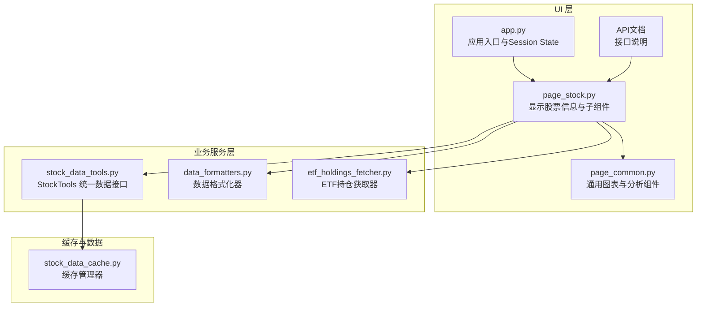
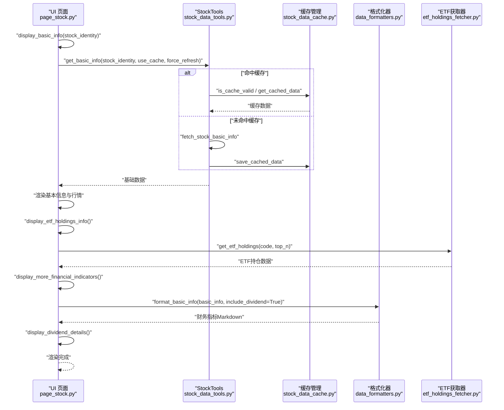
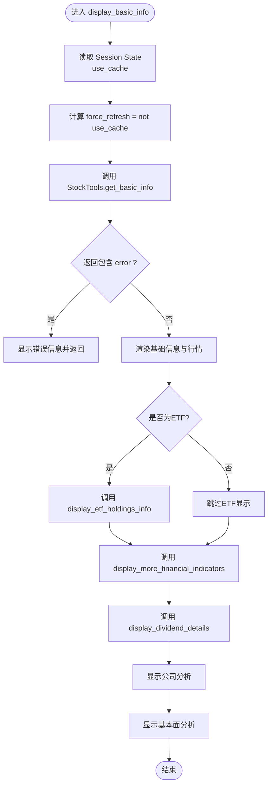
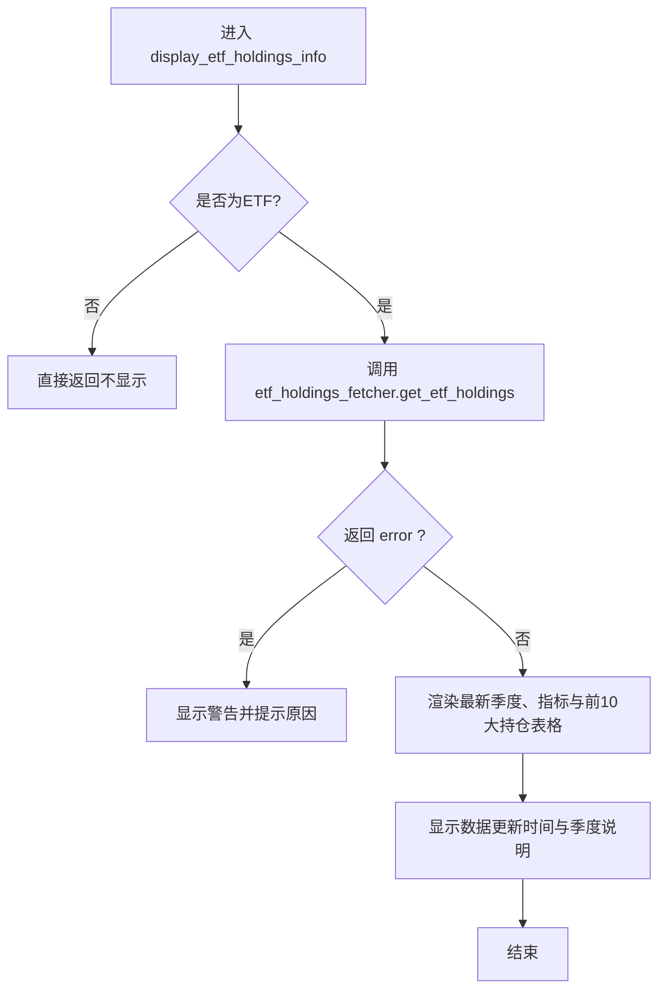
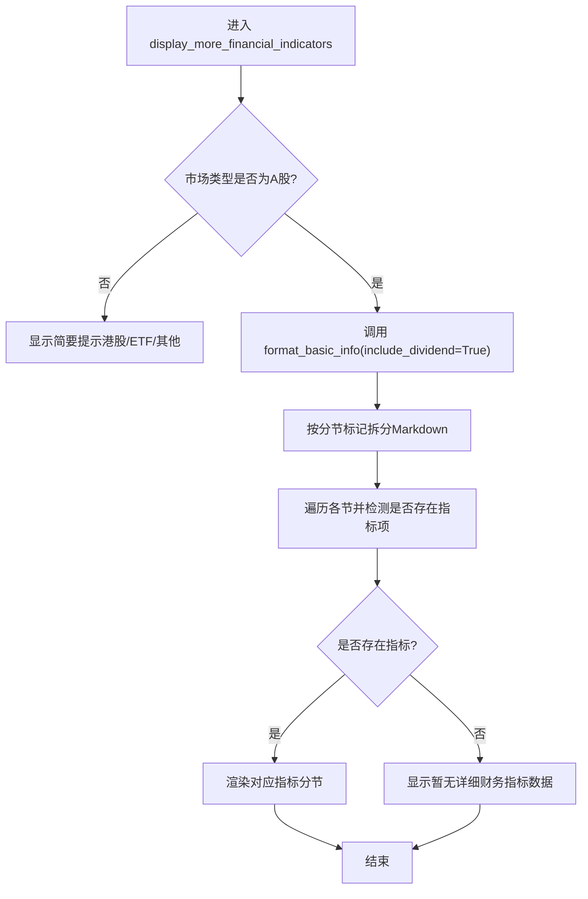
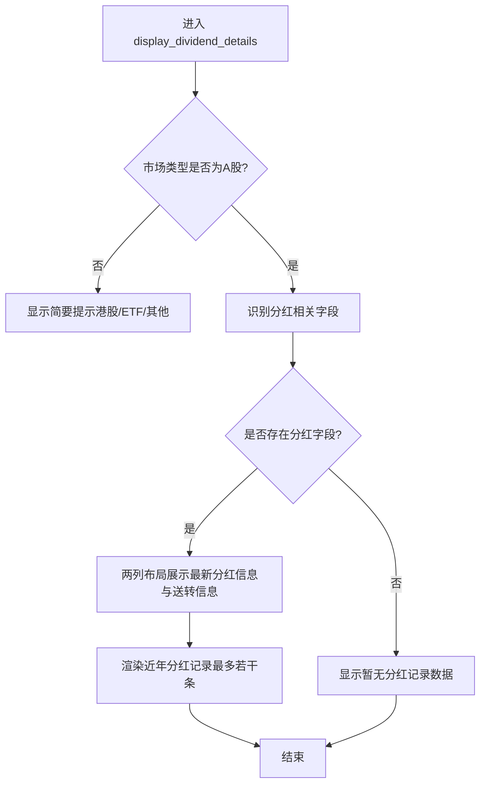
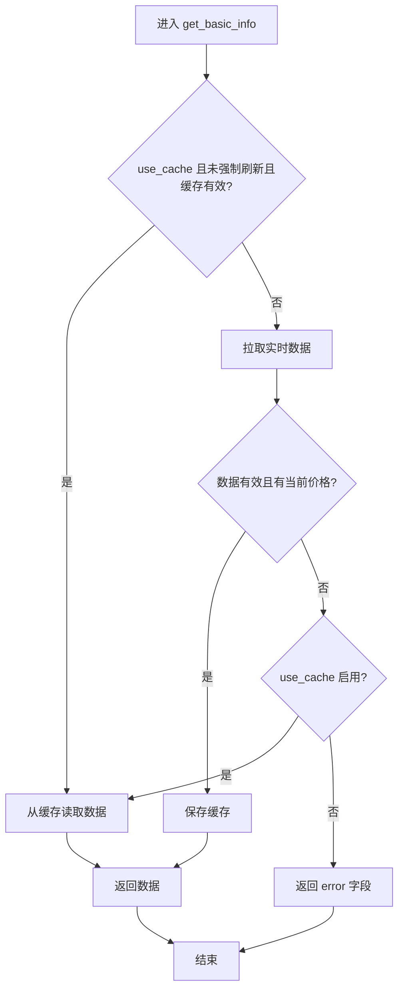
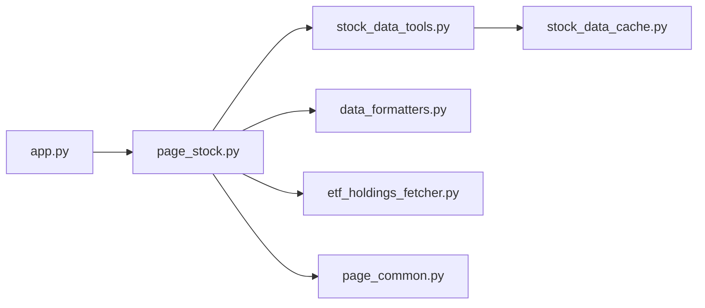

# 基本信息界面

<cite>
**本文引用的文件**
- [page_stock.py](file://ui/components/page_stock.py)
- [stock_data_tools.py](file://stock/stock_data_tools.py)
- [stock_data_cache.py](file://stock/stock_data_cache.py)
- [data_formatters.py](file://utils/data_formatters.py)
- [etf_holdings_fetcher.py](file://stock/etf_holdings_fetcher.py)
- [API文档](file://ui/components/API_DOCUMENTATION.md)
- [app.py](file://ui/app.py)
- [page_common.py](file://ui/components/page_common.py)
</cite>

## 目录
1. [简介](#简介)
2. [项目结构](#项目结构)
3. [核心组件](#核心组件)
4. [架构总览](#架构总览)
5. [详细组件分析](#详细组件分析)
6. [依赖关系分析](#依赖关系分析)
7. [性能考量](#性能考量)
8. [故障排查指南](#故障排查指南)
9. [结论](#结论)
10. [附录](#附录)

## 简介
本文档围绕个股“基本信息界面”展开，重点解析 display_basic_info 函数的实现逻辑，说明其如何通过 stock_tools.get_basic_info 获取股票基础数据，并使用 Streamlit 布局展示股票名称、行业、市值、价格等核心信息；同时阐述该界面如何集成 ETF 持仓信息、财务指标与股息分红详情的显示功能，并说明与 display_etf_holdings_info、display_more_financial_indicators、display_dividend_details 等子组件的调用关系；最后文档化该界面的缓存机制（use_cache）与错误处理流程，给出实际使用示例，并说明 Session State 在数据刷新控制中的作用。

## 项目结构
基本信息界面位于 UI 组件层，核心入口为页面组件 page_stock.py 中的 display_stock_info 与 display_basic_info。数据来源由 stock_data_tools 提供统一的 StockTools 接口，底层通过 stock_data_cache 实现缓存策略；财务指标与股息分红详情通过 data_formatters 的格式化器输出；ETF 持仓信息由 etf_holdings_fetcher 获取并渲染。

图表来源
- [page_stock.py](file://ui/components/page_stock.py#L1-L120)
- [stock_data_tools.py](file://stock/stock_data_tools.py#L41-L112)
- [stock_data_cache.py](file://stock/stock_data_cache.py#L11-L35)
- [data_formatters.py](file://utils/data_formatters.py#L494-L530)
- [etf_holdings_fetcher.py](file://stock/etf_holdings_fetcher.py#L1-L40)
- [API文档](file://ui/components/API_DOCUMENTATION.md#L160-L190)
- [app.py](file://ui/app.py#L138-L166)
- [page_common.py](file://ui/components/page_common.py#L1-L60)

章节来源
- [page_stock.py](file://ui/components/page_stock.py#L1-L120)
- [stock_data_tools.py](file://stock/stock_data_tools.py#L41-L112)
- [stock_data_cache.py](file://stock/stock_data_cache.py#L11-L35)
- [data_formatters.py](file://utils/data_formatters.py#L494-L530)
- [etf_holdings_fetcher.py](file://stock/etf_holdings_fetcher.py#L1-L40)
- [API文档](file://ui/components/API_DOCUMENTATION.md#L160-L190)
- [app.py](file://ui/app.py#L138-L166)
- [page_common.py](file://ui/components/page_common.py#L1-L60)

## 核心组件
- display_basic_info(stock_identity): 股票基本信息与实时行情展示的核心函数，负责调用 StockTools 获取基础数据并渲染。
- display_etf_holdings_info(stock_identity): 当股票为 ETF 时，展示 ETF 持仓信息（前 N 大持仓、集中度统计、更新时间等）。
- display_more_financial_indicators(basic_info_data, stock_identity): 通过格式化器输出财务指标（盈利能力、偿债能力、营运能力、成长能力、估值指标、每股指标），并按市场类型做差异化提示。
- display_dividend_details(basic_info_data, stock_identity): 展示股息分红详情（最新公告日期、派息比例、送转比例、近年分红记录等），并按市场类型做提示。
- StockTools.get_basic_info(...): 统一获取股票基础数据，内置缓存与错误回退逻辑，并可选包含 AI 分析。
- StockDataCache: 统一缓存管理，定义各类数据的过期时间与序列化策略。
- DataFormatter.format_basic_info(...): 将基础数据格式化为 Markdown 文本，包含财务指标与股息分红详情（当 include_dividend=True）。

章节来源
- [page_stock.py](file://ui/components/page_stock.py#L351-L429)
- [page_stock.py](file://ui/components/page_stock.py#L189-L271)
- [page_stock.py](file://ui/components/page_stock.py#L107-L188)
- [page_stock.py](file://ui/components/page_stock.py#L273-L349)
- [stock_data_tools.py](file://stock/stock_data_tools.py#L48-L112)
- [stock_data_cache.py](file://stock/stock_data_cache.py#L11-L35)
- [data_formatters.py](file://utils/data_formatters.py#L207-L346)

## 架构总览
下图展示了从 UI 调用到数据获取与渲染的整体流程，以及与缓存、格式化器、ETF 持仓获取器之间的交互。

图表来源
- [page_stock.py](file://ui/components/page_stock.py#L351-L429)
- [stock_data_tools.py](file://stock/stock_data_tools.py#L48-L112)
- [stock_data_cache.py](file://stock/stock_data_cache.py#L112-L164)
- [data_formatters.py](file://utils/data_formatters.py#L207-L346)
- [etf_holdings_fetcher.py](file://stock/etf_holdings_fetcher.py#L17-L45)

## 详细组件分析

### display_basic_info 函数
- 输入参数：stock_identity（包含 code、name、market_name 等）
- 关键流程：
  - 读取 st.session_state.use_cache 控制是否使用缓存；force_refresh = not use_cache
  - 调用 stock_tools.get_basic_info(stock_identity, use_cache, force_refresh) 获取基础数据
  - 若返回 error，显示错误信息并终止
  - 使用两列布局展示股票名称、行业、总市值、流通市值、市盈率、市净率、ROE 等基础信息
  - 使用 st.metric 展示当前价格、涨跌额/涨跌幅、成交量、开盘/最高/最低/昨收等
  - 调用 display_etf_holdings_info(stock_identity)（若为 ETF）
  - 调用 display_more_financial_indicators(basic_info_data, stock_identity)
  - 调用 display_dividend_details(basic_info_data, stock_identity)
  - 显示数据更新时间
  - 继续展示公司分析与基本面分析（由其他函数负责）

图表来源
- [page_stock.py](file://ui/components/page_stock.py#L351-L429)

章节来源
- [page_stock.py](file://ui/components/page_stock.py#L351-L429)

### ETF 持仓信息显示（display_etf_holdings_info）
- 判断逻辑：根据 market_name 或代码特征（如以 51/15/50 开头或名称包含 ETF/基金）判定是否为 ETF
- 获取数据：通过 etf_holdings_fetcher.get_etf_holdings(code, top_n=10) 获取最新季度持仓
- 渲染内容：
  - 显示最新季度与关键指标（持仓总数、集中度水平、前10大持仓占比）
  - 展示前10大持仓的表格（序号、代码、名称、占净值比例、持仓市值）
  - 显示数据更新时间与季度信息

图表来源
- [page_stock.py](file://ui/components/page_stock.py#L189-L271)
- [etf_holdings_fetcher.py](file://stock/etf_holdings_fetcher.py#L17-L109)

章节来源
- [page_stock.py](file://ui/components/page_stock.py#L189-L271)
- [etf_holdings_fetcher.py](file://stock/etf_holdings_fetcher.py#L17-L109)

### 更多财务指标显示（display_more_financial_indicators）
- 市场类型差异化提示：对非 A 股（如港股、ETF、其他）显示简要提示
- 格式化输出：通过 data_formatters.get_stock_formatter().format_basic_info(basic_info, stock_identity, include_dividend=True) 生成包含财务指标与分红详情的 Markdown 文本
- 解析与渲染：按“盈利能力指标”“偿债能力指标”“营运能力指标”“成长能力指标”“估值指标”“每股指标”等分段提取并逐项渲染

图表来源
- [page_stock.py](file://ui/components/page_stock.py#L107-L188)
- [data_formatters.py](file://utils/data_formatters.py#L207-L346)

章节来源
- [page_stock.py](file://ui/components/page_stock.py#L107-L188)
- [data_formatters.py](file://utils/data_formatters.py#L207-L346)

### 股息分红详情显示（display_dividend_details）
- 字段识别：从 basic_info_data 中筛选包含“分红/派息/送股/转增”关键词的字段
- 渲染布局：两列布局展示最新分红公告日期、派息比例、近年平均派息比例、分红类型、近年分红次数；右侧显示送股与转增比例
- 近年记录：最多展示最近若干条分红记录（年份、类型、派息/送股/转增比例）

图表来源
- [page_stock.py](file://ui/components/page_stock.py#L273-L349)

章节来源
- [page_stock.py](file://ui/components/page_stock.py#L273-L349)

### 缓存机制与错误处理
- 缓存控制：
  - Session State：use_cache 默认 True，force_refresh = not use_cache
  - StockTools.get_basic_info 内部根据 use_cache 与 force_refresh 判断是否命中缓存；命中则直接读取缓存，否则拉取实时数据并保存缓存
  - 缓存有效期：StockDataCache.cache_configs 定义了 basic_info、technical_indicators、news_data、chip_data 等数据类型的过期分钟数；AI分析类型按具体类型配置不同过期时间
- 错误处理：
  - 基础数据获取异常：若拉取失败且 use_cache 启用，尝试回退到缓存；否则返回 error 字段
  - UI 层：display_basic_info 对返回 error 的情况直接显示错误信息；其他子组件（ETF、财务指标、分红详情）对异常或空数据进行提示
  - Session State：app.py 初始化 use_cache 与 include_ai_analysis 等状态；清理按钮会重置相关状态并标记 just_reset

图表来源
- [stock_data_tools.py](file://stock/stock_data_tools.py#L48-L112)
- [stock_data_cache.py](file://stock/stock_data_cache.py#L112-L164)
- [app.py](file://ui/app.py#L138-L166)

章节来源
- [stock_data_tools.py](file://stock/stock_data_tools.py#L48-L112)
- [stock_data_cache.py](file://stock/stock_data_cache.py#L11-L35)
- [app.py](file://ui/app.py#L138-L166)

## 依赖关系分析
- 组件耦合与协作：
  - page_stock.py 作为 UI 入口，依赖 stock_data_tools 提供统一数据接口；依赖 data_formatters 进行格式化；依赖 etf_holdings_fetcher 展示 ETF 持仓；依赖 page_common 提供通用图表与分析组件
  - stock_data_tools 依赖 stock_data_cache 进行缓存管理；内部封装 fetch_stock_basic_info 等底层数据获取逻辑
  - data_formatters 提供统一的格式化输出，便于在多个组件中复用
- Session State 与刷新控制：
  - use_cache 控制是否使用缓存；force_refresh 由 use_cache 反推
  - include_ai_analysis 控制是否触发 AI 分析（在其他分析组件中体现）
  - app.py 初始化并维护 use_cache、include_ai_analysis、AI报告缓存等状态

图表来源
- [page_stock.py](file://ui/components/page_stock.py#L1-L120)
- [stock_data_tools.py](file://stock/stock_data_tools.py#L41-L112)
- [stock_data_cache.py](file://stock/stock_data_cache.py#L11-L35)
- [data_formatters.py](file://utils/data_formatters.py#L494-L530)
- [etf_holdings_fetcher.py](file://stock/etf_holdings_fetcher.py#L1-L40)
- [page_common.py](file://ui/components/page_common.py#L1-L60)
- [app.py](file://ui/app.py#L138-L166)

章节来源
- [page_stock.py](file://ui/components/page_stock.py#L1-L120)
- [stock_data_tools.py](file://stock/stock_data_tools.py#L41-L112)
- [stock_data_cache.py](file://stock/stock_data_cache.py#L11-L35)
- [data_formatters.py](file://utils/data_formatters.py#L494-L530)
- [etf_holdings_fetcher.py](file://stock/etf_holdings_fetcher.py#L1-L40)
- [page_common.py](file://ui/components/page_common.py#L1-L60)
- [app.py](file://ui/app.py#L138-L166)

## 性能考量
- 缓存命中率：基础数据 basic_info 的缓存有效期较短（5 分钟），适合高频访问场景；技术指标与新闻等数据有效期更长，减少重复拉取
- 异步与并发：StockTools.get_basic_info 内部通过缓存与回退机制避免重复请求，降低网络与数据库压力
- UI 渲染优化：使用 st.metric、st.columns 等组件提升信息密度与可读性；ETF 持仓表格限制 top_n，避免大数据量渲染
- AI 分析缓存：AI 分析报告按类型设置不同过期时间，避免频繁生成带来的性能损耗

[本节为通用指导，无需列出章节来源]

## 故障排查指南
- 无实时数据或显示错误：
  - 检查 use_cache 是否开启；关闭 use_cache 可强制刷新
  - 查看缓存状态：可通过缓存管理页面或工具函数查看缓存有效性与剩余时间
  - 若返回 error，确认网络连通与数据源可用性
- ETF 持仓为空：
  - 确认股票是否为 ETF（market_name 或代码特征）
  - 检查 etf_holdings_fetcher 的返回是否包含 error 字段
- 财务指标与分红详情为空：
  - 非 A 股市场（港股、ETF、其他）会显示简要提示，属于预期行为
  - 确认 basic_info 中是否包含相应字段
- Session State 异常：
  - 使用 app.py 的重置按钮清除相关状态，避免状态污染导致的异常行为

章节来源
- [page_stock.py](file://ui/components/page_stock.py#L351-L429)
- [stock_data_tools.py](file://stock/stock_data_tools.py#L48-L112)
- [stock_data_cache.py](file://stock/stock_data_cache.py#L234-L273)
- [app.py](file://ui/app.py#L138-L166)

## 结论
基本信息界面通过 display_basic_info 将股票基础数据与实时行情以清晰的布局呈现，并无缝集成 ETF 持仓、财务指标与股息分红详情三大扩展模块。借助统一的 StockTools 与缓存管理，系统在保证数据新鲜度的同时兼顾性能与稳定性；Session State 的 use_cache 与 include_ai_analysis 控制为用户提供了灵活的刷新与分析体验。整体设计层次清晰、职责明确，易于扩展与维护。

[本节为总结性内容，无需列出章节来源]

## 附录

### 实际使用示例
- 基本信息展示（示例路径）
  - 调用入口：[API 文档](file://ui/components/API_DOCUMENTATION.md#L160-L190)
  - 示例参数：stock_identity（包含 code、name、market_name）
  - 调用位置：[page_stock.py](file://ui/components/page_stock.py#L47-L72)

- 基本信息渲染（示例路径）
  - 基础信息与行情渲染：[page_stock.py](file://ui/components/page_stock.py#L351-L429)

- ETF 持仓信息（示例路径）
  - ETF 判定与渲染：[page_stock.py](file://ui/components/page_stock.py#L189-L271)
  - ETF 持仓数据获取：[etf_holdings_fetcher.py](file://stock/etf_holdings_fetcher.py#L17-L109)

- 财务指标与分红详情（示例路径）
  - 财务指标渲染：[page_stock.py](file://ui/components/page_stock.py#L107-L188)
  - 分红详情渲染：[page_stock.py](file://ui/components/page_stock.py#L273-L349)
  - 格式化输出：[data_formatters.py](file://utils/data_formatters.py#L207-L346)

- 缓存与刷新控制（示例路径）
  - use_cache 与 force_refresh：[page_stock.py](file://ui/components/page_stock.py#L351-L429)
  - 缓存配置与有效期：[stock_data_cache.py](file://stock/stock_data_cache.py#L11-L35)
  - Session State 初始化与重置：[app.py](file://ui/app.py#L138-L166)