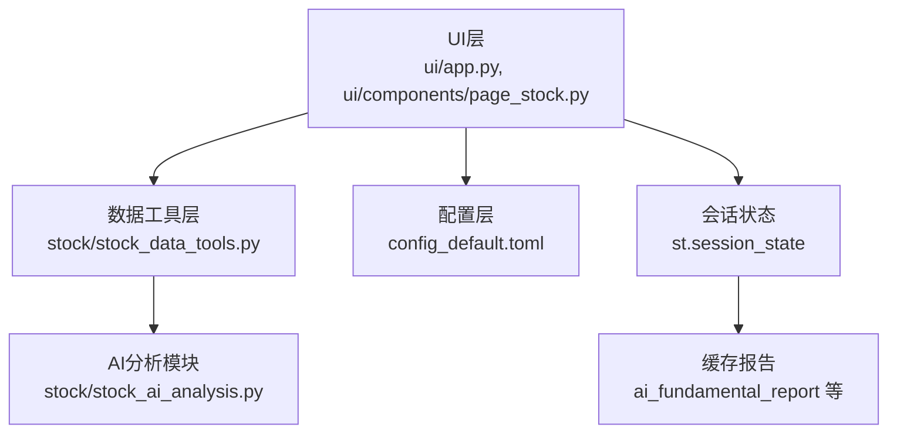
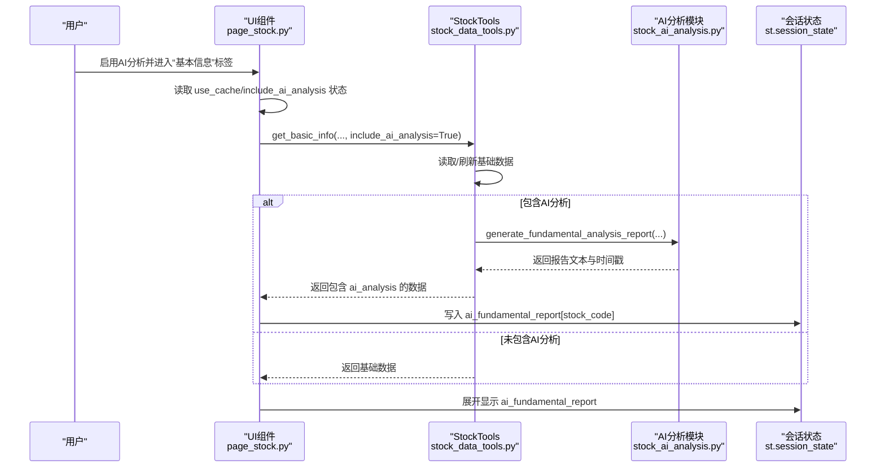
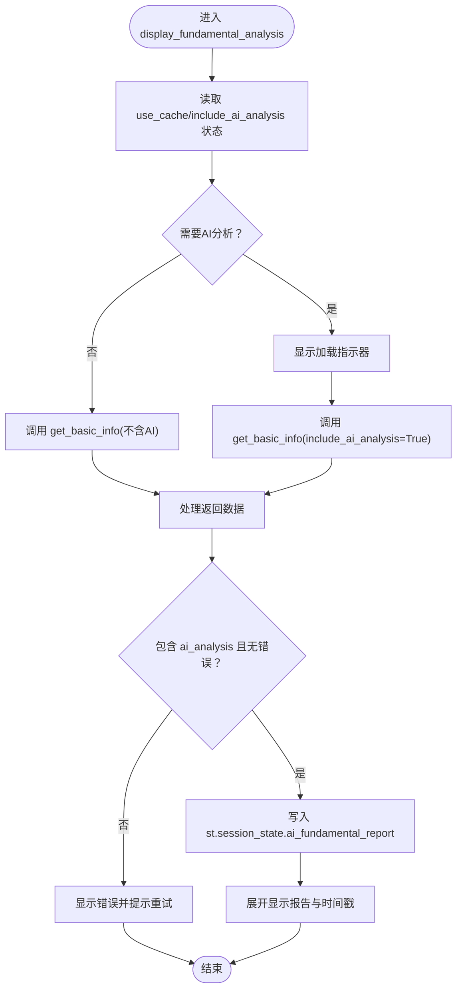
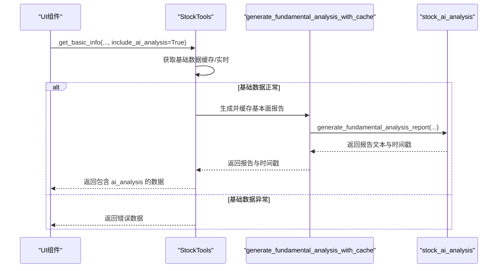
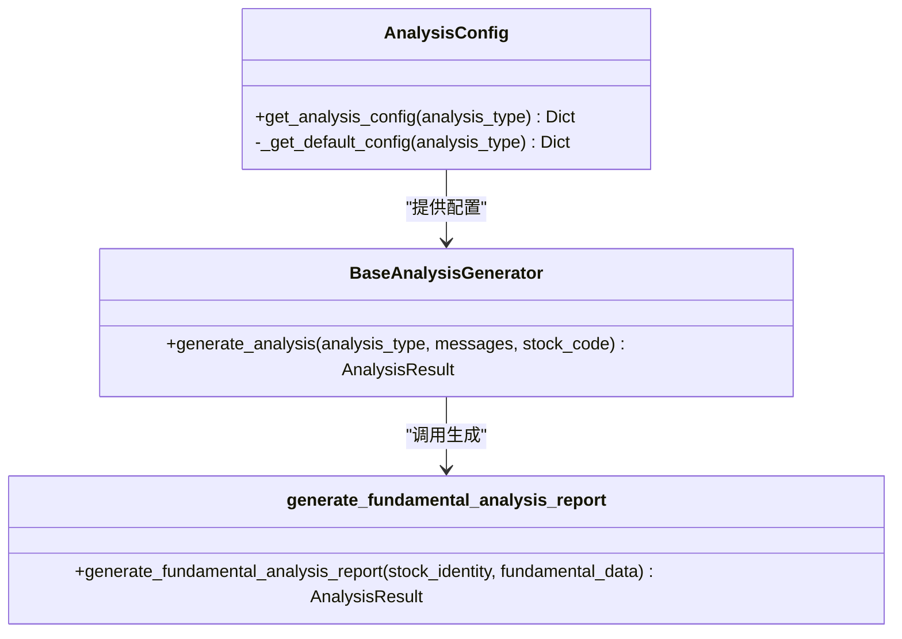
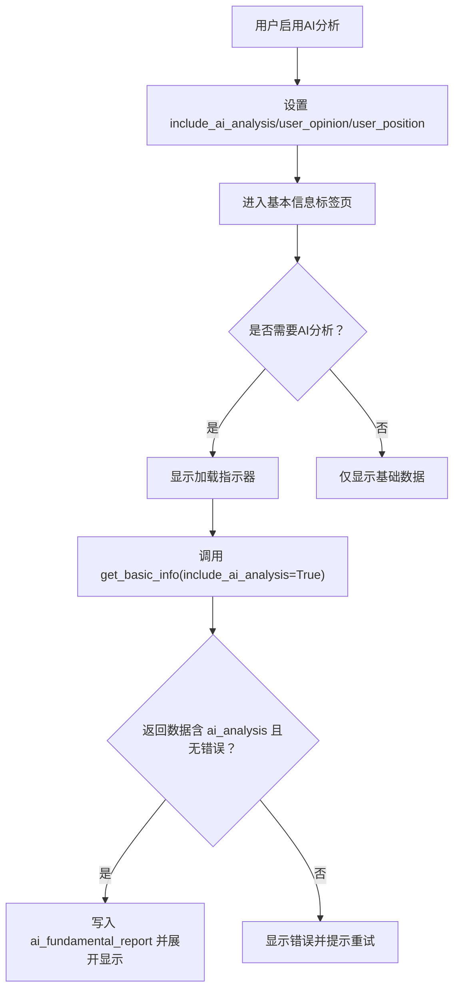
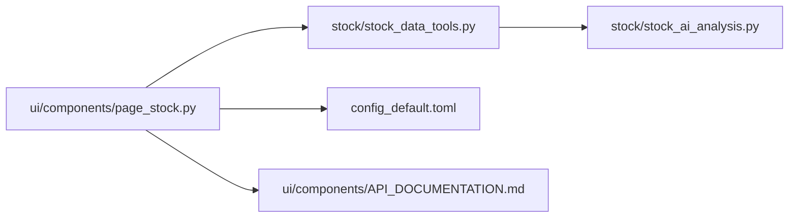

# 基本面分析界面

<cite>
**本文引用的文件**
- [ui/components/page_stock.py](file://ui/components/page_stock.py)
- [stock/stock_data_tools.py](file://stock/stock_data_tools.py)
- [stock/stock_ai_analysis.py](file://stock/stock_ai_analysis.py)
- [ui/app.py](file://ui/app.py)
- [config_default.toml](file://config_default.toml)
- [ui/components/API_DOCUMENTATION.md](file://ui/components/API_DOCUMENTATION.md)
</cite>

## 目录
1. [简介](#简介)
2. [项目结构](#项目结构)
3. [核心组件](#核心组件)
4. [架构总览](#架构总览)
5. [详细组件分析](#详细组件分析)
6. [依赖关系分析](#依赖关系分析)
7. [性能考量](#性能考量)
8. [故障排查指南](#故障排查指南)
9. [结论](#结论)
10. [附录](#附录)

## 简介
本文件面向“基本面分析界面”的使用者与维护者，系统性解析 display_fundamental_analysis 函数的工作机制，阐述其在用户启用AI分析时如何触发 stock_tools.get_basic_info 的AI分析模式，并将生成的报告缓存至 Streamlit Session State 中的 ai_fundamental_report 字段；同时覆盖用户交互流程（加载状态指示器、错误处理、报告展示）、AI分析参数配置方式、与 stock_ai_analysis.py 模块的集成关系，以及常见失败场景与解决方案。

## 项目结构
- UI层：负责用户交互、状态管理与展示，位于 ui/components/page_stock.py 与 ui/app.py。
- 数据与AI层：负责数据获取、缓存与AI分析生成，位于 stock/stock_data_tools.py 与 stock/stock_ai_analysis.py。
- 配置层：提供AI分析温度、模型类型、缓存文件名等参数，位于 config_default.toml 与 UI 设置页文档。

**图表来源**
- [ui/app.py](file://ui/app.py#L130-L229)
- [ui/components/page_stock.py](file://ui/components/page_stock.py#L431-L470)
- [stock/stock_data_tools.py](file://stock/stock_data_tools.py#L41-L112)
- [stock/stock_ai_analysis.py](file://stock/stock_ai_analysis.py#L605-L714)
- [config_default.toml](file://config_default.toml#L24-L50)

**章节来源**
- [ui/components/page_stock.py](file://ui/components/page_stock.py#L431-L470)
- [stock/stock_data_tools.py](file://stock/stock_data_tools.py#L41-L112)
- [stock/stock_ai_analysis.py](file://stock/stock_ai_analysis.py#L605-L714)
- [ui/app.py](file://ui/app.py#L130-L229)
- [config_default.toml](file://config_default.toml#L24-L50)

## 核心组件
- display_fundamental_analysis：在“基本信息”标签页下触发，根据用户设置决定是否调用AI分析，并将结果写入 st.session_state.ai_fundamental_report，随后展开显示。
- stock_tools.get_basic_info：统一入口，负责获取基础数据；当 include_ai_analysis=True 时，内部调用 generate_fundamental_analysis_with_cache 并将 ai_analysis 字段注入返回数据。
- stock_ai_analysis.generate_fundamental_analysis_report：基于系统提示词与格式化后的基本面数据生成报告。
- 配置与参数：AI_ANALYSIS.FUNDAMENTAL 下的 TEMPERATURE、MODEL_TYPE、CACHE_FILENAME 决定AI生成行为与缓存文件名。

**章节来源**
- [ui/components/page_stock.py](file://ui/components/page_stock.py#L431-L470)
- [stock/stock_data_tools.py](file://stock/stock_data_tools.py#L41-L112)
- [stock/stock_ai_analysis.py](file://stock/stock_ai_analysis.py#L605-L714)
- [config_default.toml](file://config_default.toml#L41-L45)

## 架构总览
下面的序列图展示了从用户启用AI分析到报告展示的完整流程，包括缓存命中与失败回退路径。

**图表来源**
- [ui/components/page_stock.py](file://ui/components/page_stock.py#L431-L470)
- [stock/stock_data_tools.py](file://stock/stock_data_tools.py#L41-L112)
- [stock/stock_ai_analysis.py](file://stock/stock_ai_analysis.py#L605-L714)

## 详细组件分析

### display_fundamental_analysis 工作机制
- 触发条件：当 st.session_state.include_ai_analysis 为真且当前股票尚未缓存 ai_fundamental_report 时，进入AI分析分支。
- 加载状态：使用 st.spinner 显示“AI正在进行基本面分析，请稍候…”。
- 数据获取：调用 stock_tools.get_basic_info(stock_identity, use_cache, force_refresh, include_ai_analysis=True)。
- 结果处理：
  - 若返回数据包含 ai_analysis 且不含 error，则将 report 与 timestamp 写入 st.session_state.ai_fundamental_report[stock_code]。
  - 若 ai_analysis 含 error，则弹出错误提示并建议稍后再试。
- 展示逻辑：若该股票已在 ai_fundamental_report 中，展开显示报告正文与生成时间。

**图表来源**
- [ui/components/page_stock.py](file://ui/components/page_stock.py#L431-L470)

**章节来源**
- [ui/components/page_stock.py](file://ui/components/page_stock.py#L431-L470)

### stock_tools.get_basic_info 与 AI分析集成
- 基础数据获取：优先使用缓存或实时拉取，异常时回退到缓存或错误对象。
- AI分析触发：当 include_ai_analysis=True 且基础数据无错误时，调用 generate_fundamental_analysis_with_cache。
- 结果注入：将 ai_analysis 字段（包含 report 与 timestamp 或 error）注入返回数据，供UI层展示。

**图表来源**
- [stock/stock_data_tools.py](file://stock/stock_data_tools.py#L41-L112)
- [stock/stock_ai_analysis.py](file://stock/stock_ai_analysis.py#L605-L714)

**章节来源**
- [stock/stock_data_tools.py](file://stock/stock_data_tools.py#L41-L112)
- [stock/stock_ai_analysis.py](file://stock/stock_ai_analysis.py#L605-L714)

### AI分析参数配置与集成
- 配置来源：config_default.toml 中的 [AI_ANALYSIS.FUNDAMENTAL] 提供 TEMPERATURE、MODEL_TYPE、CACHE_FILENAME。
- 参数作用：
  - TEMPERATURE：控制生成随机性，影响报告风格与稳定性。
  - MODEL_TYPE：指定使用的模型类型（如 inference/default），由底层客户端解析。
  - CACHE_FILENAME：生成请求内容缓存文件名，便于调试与复现。
- 集成方式：stock_ai_analysis.AnalysisConfig 读取配置，BaseAnalysisGenerator 将配置传入 OpenAIClient.chat，最终在 generate_fundamental_analysis_report 中构造系统提示词与用户消息。

**图表来源**
- [stock/stock_ai_analysis.py](file://stock/stock_ai_analysis.py#L34-L72)
- [stock/stock_ai_analysis.py](file://stock/stock_ai_analysis.py#L303-L346)
- [stock/stock_ai_analysis.py](file://stock/stock_ai_analysis.py#L605-L714)
- [config_default.toml](file://config_default.toml#L41-L45)

**章节来源**
- [config_default.toml](file://config_default.toml#L41-L45)
- [stock/stock_ai_analysis.py](file://stock/stock_ai_analysis.py#L34-L72)
- [stock/stock_ai_analysis.py](file://stock/stock_ai_analysis.py#L303-L346)
- [stock/stock_ai_analysis.py](file://stock/stock_ai_analysis.py#L605-L714)

### 用户交互流程与错误处理
- 交互流程：
  - 用户在首页启用“使用AI分析”，系统设置 st.session_state.include_ai_analysis 与用户观点 user_opinion、user_position，并初始化 ai_fundamental_report 等会话状态。
  - 在“基本信息”标签页，display_fundamental_analysis 根据 include_ai_analysis 与 ai_fundamental_report 是否已存在决定是否触发AI分析。
  - 使用 st.spinner 提示加载，成功后展开报告；失败时显示错误并建议稍后再试。
- 错误处理：
  - 基础数据获取失败：UI层捕获异常并提示。
  - AI分析失败：返回 ai_analysis.error，UI层弹出错误并提示重试。
  - 缓存不可用：AI分析模块不可用时返回提示信息。

**图表来源**
- [ui/app.py](file://ui/app.py#L130-L229)
- [ui/components/page_stock.py](file://ui/components/page_stock.py#L431-L470)
- [stock/stock_data_tools.py](file://stock/stock_data_tools.py#L41-L112)

**章节来源**
- [ui/app.py](file://ui/app.py#L130-L229)
- [ui/components/page_stock.py](file://ui/components/page_stock.py#L431-L470)
- [stock/stock_data_tools.py](file://stock/stock_data_tools.py#L41-L112)

## 依赖关系分析
- UI层依赖：
  - 通过 get_stock_tools 获取 StockTools 实例，统一访问数据与AI分析。
  - 依赖 st.session_state 管理 include_ai_analysis、user_opinion、user_position 与 ai_fundamental_report。
- 数据与AI层依赖：
  - StockTools 对外暴露 get_basic_info、generate_fundamental_analysis_with_cache 等方法。
  - generate_fundamental_analysis_with_cache 依赖 stock_ai_analysis.generate_fundamental_analysis_report。
- 配置依赖：
  - AnalysisConfig 读取 config_default.toml 中的 [AI_ANALYSIS.FUNDAMENTAL] 配置。
  - UI设置页文档提供配置项结构与保存函数说明。

**图表来源**
- [ui/components/page_stock.py](file://ui/components/page_stock.py#L15-L22)
- [stock/stock_data_tools.py](file://stock/stock_data_tools.py#L666-L676)
- [stock/stock_ai_analysis.py](file://stock/stock_ai_analysis.py#L605-L714)
- [config_default.toml](file://config_default.toml#L24-L50)
- [ui/components/API_DOCUMENTATION.md](file://ui/components/API_DOCUMENTATION.md#L347-L418)

**章节来源**
- [ui/components/page_stock.py](file://ui/components/page_stock.py#L15-L22)
- [stock/stock_data_tools.py](file://stock/stock_data_tools.py#L666-L676)
- [stock/stock_ai_analysis.py](file://stock/stock_ai_analysis.py#L605-L714)
- [config_default.toml](file://config_default.toml#L24-L50)
- [ui/components/API_DOCUMENTATION.md](file://ui/components/API_DOCUMENTATION.md#L347-L418)

## 性能考量
- 缓存策略：
  - get_basic_info 与 generate_fundamental_analysis_with_cache 均支持 use_cache/force_refresh 控制，优先命中缓存以降低延迟。
  - AI分析缓存键包含 analysis_type 与 stock_code，动态过期时间由缓存管理器配置。
- 并发与重复请求：
  - get_basic_info 内部对基础数据获取加锁，避免并发重复拉取。
- 展示优化：
  - 使用 st.spinner 提示加载，减少用户等待焦虑；仅在缓存命中时跳过AI生成步骤。

**章节来源**
- [stock/stock_data_tools.py](file://stock/stock_data_tools.py#L41-L112)
- [stock/stock_data_tools.py](file://stock/stock_data_tools.py#L317-L355)

## 故障排查指南
- 常见失败场景与解决建议：
  - AI分析模块不可用：检查依赖安装与配置可用性，确认 AI_ANALYSIS_AVAILABLE 为真；若不可用，返回提示信息并在UI层显示。
  - 基础数据获取失败：查看 get_basic_info 异常回退逻辑，确认是否使用缓存；必要时强制刷新。
  - AI生成异常：generate_fundamental_analysis_with_cache 捕获异常并返回错误信息；检查 LLM_OPENAI 配置（API_KEY、BASE_URL、DEFAULT_TEMPERATURE 等）。
  - 缓存失效或过期：清理特定股票缓存或调整缓存配置；确认缓存键命名与过期时间设置。
  - 用户观点变化导致缓存不生效：综合分析缓存会对比用户观点，若变化需重新生成。
- 建议排查步骤：
  - 在 UI 设置页保存并验证 LLM_OPENAI 与 ANALYSIS 配置。
  - 使用 show_stock_cache_status/clear_stock_cache 查看/清理缓存状态。
  - 在日志中定位错误堆栈，结合缓存文件名（AI_ANALYSIS.FUNDAMENTAL.CACHE_FILENAME）进行复现。

**章节来源**
- [stock/stock_data_tools.py](file://stock/stock_data_tools.py#L28-L39)
- [stock/stock_data_tools.py](file://stock/stock_data_tools.py#L333-L355)
- [stock/stock_data_tools.py](file://stock/stock_data_tools.py#L517-L571)
- [config_default.toml](file://config_default.toml#L1-L23)
- [config_default.toml](file://config_default.toml#L56-L59)
- [ui/components/API_DOCUMENTATION.md](file://ui/components/API_DOCUMENTATION.md#L347-L418)

## 结论
display_fundamental_analysis 通过简洁的状态机与缓存策略，实现了“按需触发AI分析—生成并缓存—展示”的闭环。其与 stock_data_tools 和 stock_ai_analysis 的协作清晰，参数配置直观可控。在实际使用中，建议优先利用缓存提升响应速度，并在出现失败时结合配置与缓存状态进行快速定位与修复。

## 附录
- 配置项参考（节选）：
  - [AI_ANALYSIS.FUNDAMENTAL]：TEMPERATURE、MODEL_TYPE、CACHE_FILENAME
  - [LLM_OPENAI]：API_KEY、BASE_URL、DEFAULT_MODEL、INFERENCE_MODEL、TIMEOUT、MAX_RETRIES、DEFAULT_TEMPERATURE
  - [ANALYSIS]：RISK_PREFERENCE、CUSTOM_PRINCIPLES
  - [USER_PROFILE]：RAW、MISTAKES

**章节来源**
- [config_default.toml](file://config_default.toml#L24-L64)
- [ui/components/API_DOCUMENTATION.md](file://ui/components/API_DOCUMENTATION.md#L347-L418)