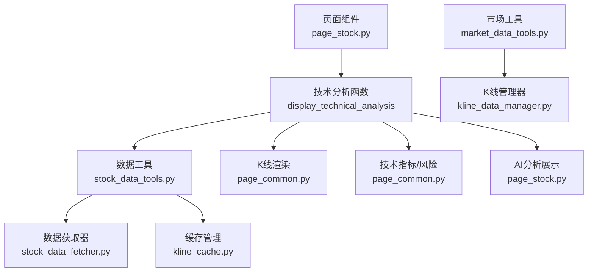
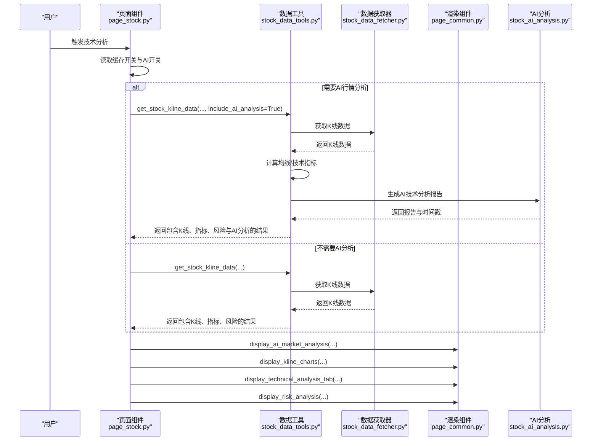
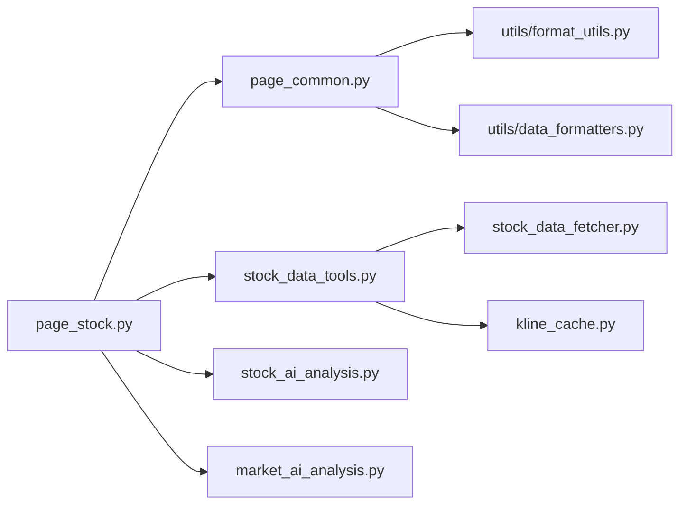
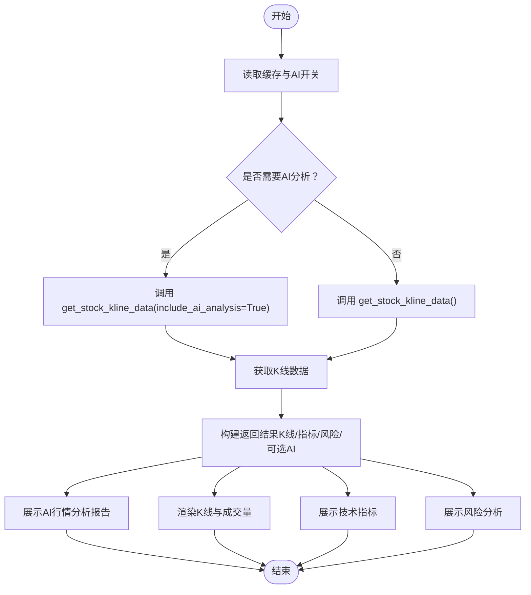

# 技术分析界面

<cite>
**本文引用的文件列表**
- [page_stock.py](file://ui/components/page_stock.py)
- [page_common.py](file://ui/components/page_common.py)
- [stock_data_tools.py](file://stock/stock_data_tools.py)
- [stock_data_fetcher.py](file://stock/stock_data_fetcher.py)
- [market_data_tools.py](file://market/market_data_tools.py)
- [market_data_cache.py](file://market/market_data_cache.py)
- [kline_data_manager.py](file://market/kline_data_manager.py)
- [API文档](file://ui/components/API_DOCUMENTATION.md)
- [test_page_common.py](file://tests/unit/ui/test_page_common.py)
- [stock_ai_analysis.py](file://stock/stock_ai_analysis.py)
- [market_ai_analysis.py](file://market/market_ai_analysis.py)
- [kline_cache.py](file://utils/kline_cache.py)
</cite>

## 目录
1. [简介](#简介)
2. [项目结构](#项目结构)
3. [核心组件](#核心组件)
4. [架构总览](#架构总览)
5. [详细组件分析](#详细组件分析)
6. [依赖关系分析](#依赖关系分析)
7. [性能考量](#性能考量)
8. [故障排查指南](#故障排查指南)
9. [结论](#结论)
10. [附录](#附录)

## 简介
本文件围绕“技术分析界面”的完整流程进行系统化技术文档化，重点聚焦于 display_technical_analysis 函数如何组织数据流、调用 stock_tools.get_stock_kline_data 获取K线数据，并集成AI行情分析功能；同时说明该界面如何通过 display_ai_market_analysis 展示AI分析报告，以及如何利用 page_common.display_kline_charts 与 display_technical_analysis_tab 渲染K线图、技术指标与风险分析。文档还涵盖数据流、错误处理机制与性能优化策略（如数据缓存），并提供自定义图表显示的配置示例。

## 项目结构
技术分析界面位于UI层的个股分析页面中，核心调用链如下：
- 页面入口：ui/components/page_stock.py 的 display_technical_analysis
- 数据获取：stock/stock_data_tools.py 的 StockTools.get_stock_kline_data
- K线渲染：ui/components/page_common.py 的 display_kline_charts
- 技术指标与风险：ui/components/page_common.py 的 display_technical_analysis_tab 与 display_risk_analysis
- AI分析：ui/components/page_stock.py 的 display_ai_market_analysis
- 缓存与数据源：stock/stock_data_fetcher.py、market/market_data_tools.py、utils/kline_cache.py

图表来源
- [page_stock.py](file://ui/components/page_stock.py#L493-L552)
- [stock_data_tools.py](file://stock/stock_data_tools.py#L132-L189)
- [stock_data_fetcher.py](file://stock/stock_data_fetcher.py#L135-L160)
- [page_common.py](file://ui/components/page_common.py#L192-L291)
- [market_data_tools.py](file://market/market_data_tools.py#L307-L347)
- [kline_data_manager.py](file://market/kline_data_manager.py#L147-L178)
- [kline_cache.py](file://utils/kline_cache.py#L163-L200)

章节来源
- [page_stock.py](file://ui/components/page_stock.py#L493-L552)
- [page_common.py](file://ui/components/page_common.py#L107-L164)
- [stock_data_tools.py](file://stock/stock_data_tools.py#L132-L189)
- [stock_data_fetcher.py](file://stock/stock_data_fetcher.py#L135-L160)
- [market_data_tools.py](file://market/market_data_tools.py#L307-L347)
- [kline_data_manager.py](file://market/kline_data_manager.py#L147-L178)
- [kline_cache.py](file://utils/kline_cache.py#L163-L200)

## 核心组件
- display_technical_analysis：个股技术分析主入口，负责控制缓存开关、触发AI分析、调用K线数据获取与渲染、展示技术指标与风险分析。
- StockTools.get_stock_kline_data：统一的K线数据获取入口，负责调用数据源、计算均线与技术指标、可选集成AI行情分析。
- display_kline_charts：通用K线与成交量图表渲染函数，支持股票与指数两类图表。
- display_technical_analysis_tab：技术指标分析Tab，支持股票与指数两种场景。
- display_ai_market_analysis：展示AI行情分析报告，维护会话态缓存。
- 缓存体系：K线缓存（utils/kline_cache.py）、技术指标缓存（stock/stock_data_tools.py）、市场数据缓存（market/market_data_cache.py）。

章节来源
- [page_stock.py](file://ui/components/page_stock.py#L493-L552)
- [stock_data_tools.py](file://stock/stock_data_tools.py#L132-L189)
- [page_common.py](file://ui/components/page_common.py#L192-L291)
- [page_common.py](file://ui/components/page_common.py#L107-L164)
- [kline_cache.py](file://utils/kline_cache.py#L163-L200)
- [market_data_cache.py](file://market/market_data_cache.py)

## 架构总览
技术分析界面的端到端流程如下：

图表来源
- [page_stock.py](file://ui/components/page_stock.py#L493-L552)
- [stock_data_tools.py](file://stock/stock_data_tools.py#L132-L189)
- [stock_data_fetcher.py](file://stock/stock_data_fetcher.py#L135-L160)
- [page_common.py](file://ui/components/page_common.py#L107-L164)
- [stock_ai_analysis.py](file://stock/stock_ai_analysis.py#L1-L200)

## 详细组件分析

### display_technical_analysis（技术分析主入口）
- 功能职责
  - 控制缓存开关与AI分析开关
  - 调用 StockTools.get_stock_kline_data 获取K线数据
  - 展示AI行情分析报告（display_ai_market_analysis）
  - 渲染K线图与成交量（display_kline_charts）
  - 展示技术指标与风险分析（display_technical_analysis_tab、display_risk_analysis）

- 关键流程
  - 读取 st.session_state.use_cache 与 include_ai_analysis
  - 若 include_ai_analysis 为真，调用 get_stock_kline_data(include_ai_analysis=True)，否则正常获取
  - 将返回的 kline_info 传给 display_ai_market_analysis 与 display_kline_charts
  - 调用 display_technical_analysis_tab 与 display_risk_analysis

- 错误处理
  - 对 kline_info 中的 error 字段进行判断并提示
  - 对异常进行捕获并输出错误信息

- 性能优化
  - 通过 use_cache 与 force_refresh 控制数据获取策略
  - AI分析结果写入 st.session_state.ai_market_report，避免重复请求

章节来源
- [page_stock.py](file://ui/components/page_stock.py#L493-L552)

### StockTools.get_stock_kline_data（K线数据获取与AI集成）
- 功能职责
  - 通过 data_manager.get_kline_data 获取K线数据
  - 计算MA5/MA10/MA20等均线
  - 调用 get_stock_technical_indicators 获取技术指标与风险指标
  - 可选集成AI技术分析报告（generate_tech_analysis_with_cache）

- 数据结构
  - 返回字典包含：kline_data（K线记录）、indicators（技术指标）、risk_metrics（风险指标）、latest_data、update_time 等

- 缓存与AI
  - 技术指标与AI分析均使用缓存管理器（cache_manager），支持动态过期时间
  - AI分析失败时返回 error 字段，便于上层处理

- 性能优化
  - 仅对技术指标与AI分析做缓存，K线数据实时获取但不缓存K线本身
  - 通过 force_refresh 参数强制刷新

章节来源
- [stock_data_tools.py](file://stock/stock_data_tools.py#L132-L189)
- [stock_data_tools.py](file://stock/stock_data_tools.py#L114-L131)
- [stock_data_tools.py](file://stock/stock_data_tools.py#L356-L391)
- [stock_data_fetcher.py](file://stock/stock_data_fetcher.py#L135-L160)

### display_kline_charts（K线与成交量渲染）
- 功能职责
  - 统一渲染K线图与成交量图
  - 支持股票与指数两类图表，自动设置标题与Y轴标签
  - 自动添加MA5/MA10/MA20/MA60均线（若存在）

- 输入约束
  - DataFrame 必须包含 datetime、open、high、low、close、volume 列
  - 空DataFrame或None会提示无数据

- 输出
  - 使用 Plotly 渲染两个图表：K线图与成交量图

- 自定义配置
  - chart_type：stock/index
  - title_prefix：股票名称或指数名称

章节来源
- [page_common.py](file://ui/components/page_common.py#L192-L291)
- [API文档](file://ui/components/API_DOCUMENTATION.md#L110-L145)
- [test_page_common.py](file://tests/unit/ui/test_page_common.py#L239-L284)

### display_technical_analysis_tab（技术指标与风险分析）
- 功能职责
  - 支持股票与指数两种场景
  - 股票：调用 StockTools.get_stock_kline_data 获取指标
  - 指数：调用 MarketTools.get_index_technical_indicators 获取指标
  - 统一调用 display_technical_indicators 展示指标卡片

- 错误处理
  - 对 error 字段与异常进行捕获与提示

章节来源
- [page_common.py](file://ui/components/page_common.py#L107-L164)

### display_ai_market_analysis（AI行情分析展示）
- 功能职责
  - 将AI分析结果写入 st.session_state.ai_market_report
  - 在页面中展开显示报告与生成时间

- 错误处理
  - 对 ai_analysis 中的 error 字段进行提示

章节来源
- [page_stock.py](file://ui/components/page_stock.py#L472-L491)

### 缓存与数据源
- K线缓存（utils/kline_cache.py）
  - 支持按 symbol 与 K线类型缓存K线数据，提供缓存统计与清理能力
- 技术指标缓存（stock/stock_data_tools.py）
  - 对技术指标与AI分析结果进行缓存，支持动态过期时间
- 市场数据缓存（market/market_data_cache.py）
  - 对指数K线、技术指标、市场情绪等进行缓存

章节来源
- [kline_cache.py](file://utils/kline_cache.py#L163-L200)
- [stock_data_tools.py](file://stock/stock_data_tools.py#L114-L131)
- [stock_data_tools.py](file://stock/stock_data_tools.py#L275-L312)
- [market_data_cache.py](file://market/market_data_cache.py)

## 依赖关系分析
- 组件耦合
  - page_stock.py 依赖 page_common.py 的渲染组件
  - page_stock.py 依赖 stock_data_tools.py 的数据工具
  - stock_data_tools.py 依赖 stock_data_fetcher.py 的数据源
  - page_common.py 依赖 utils/format_utils 与 utils/data_formatters
  - AI分析依赖 stock_ai_analysis.py 与 market_ai_analysis.py

图表来源
- [page_stock.py](file://ui/components/page_stock.py#L493-L552)
- [page_common.py](file://ui/components/page_common.py#L107-L164)
- [stock_data_tools.py](file://stock/stock_data_tools.py#L132-L189)
- [stock_data_fetcher.py](file://stock/stock_data_fetcher.py#L135-L160)
- [kline_cache.py](file://utils/kline_cache.py#L163-L200)
- [stock_ai_analysis.py](file://stock/stock_ai_analysis.py#L1-L200)
- [market_ai_analysis.py](file://market/market_ai_analysis.py)

## 性能考量
- 缓存策略
  - 技术指标与AI分析结果缓存，减少重复请求
  - K线数据实时获取，避免缓存K线本身带来的陈旧问题
- 并发与刷新
  - 通过 use_cache 与 force_refresh 控制缓存命中与强制刷新
  - AI分析结果写入 session state，避免重复生成
- 渲染优化
  - K线图与成交量图分离渲染，减少单图复杂度
  - 仅在存在均线列时绘制均线，避免无效渲染

[本节为通用指导，无需列出具体文件来源]

## 故障排查指南
- 常见问题
  - 未获取到K线数据：检查返回的 error 字段与异常堆栈
  - 未获取到技术指标：确认缓存是否有效，或强制刷新
  - AI分析失败：查看 ai_analysis.error 字段，确认依赖是否安装
  - 图表无数据：确认DataFrame是否为空或缺少必要列

- 定位手段
  - 查看页面错误提示与“错误详情”展开
  - 使用缓存状态查询函数（如 get_stock_tools().print_cache_status()）
  - 检查 st.session_state.ai_market_report 是否存在

章节来源
- [page_stock.py](file://ui/components/page_stock.py#L493-L552)
- [page_common.py](file://ui/components/page_common.py#L107-L164)
- [stock_data_tools.py](file://stock/stock_data_tools.py#L650-L661)

## 结论
技术分析界面通过 display_technical_analysis 将数据获取、AI分析、图表渲染与指标展示有机整合。StockTools.get_stock_kline_data 提供统一的数据入口与缓存策略，page_common 提供稳定的可视化组件，AI分析通过会话态缓存提升用户体验。整体设计具备良好的扩展性与可维护性。

[本节为总结性内容，无需列出具体文件来源]

## 附录

### 数据流与错误处理流程图

图表来源
- [page_stock.py](file://ui/components/page_stock.py#L493-L552)
- [stock_data_tools.py](file://stock/stock_data_tools.py#L132-L189)
- [page_common.py](file://ui/components/page_common.py#L107-L164)

### 自定义图表显示配置示例
- 使用 display_kline_charts 的参数
  - df：K线DataFrame（必须包含 datetime、open、high、low、close、volume）
  - chart_type：可选 "stock" 或 "index"
  - title_prefix：图表标题前缀（如股票名称或指数名称）

- 示例路径
  - [API文档示例](file://ui/components/API_DOCUMENTATION.md#L110-L145)

- 自定义扩展建议
  - 如需叠加其他技术指标或成交量子图，可在调用 display_kline_charts 后继续追加 Plotly 图形对象
  - 参考自定义图表示例（utils/draw.py）进行二次开发

章节来源
- [API文档](file://ui/components/API_DOCUMENTATION.md#L110-L145)
- [draw.py](file://utils/draw.py#L45-L81)