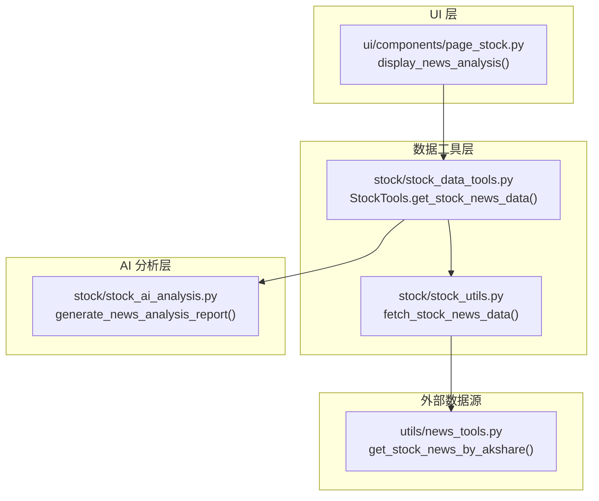
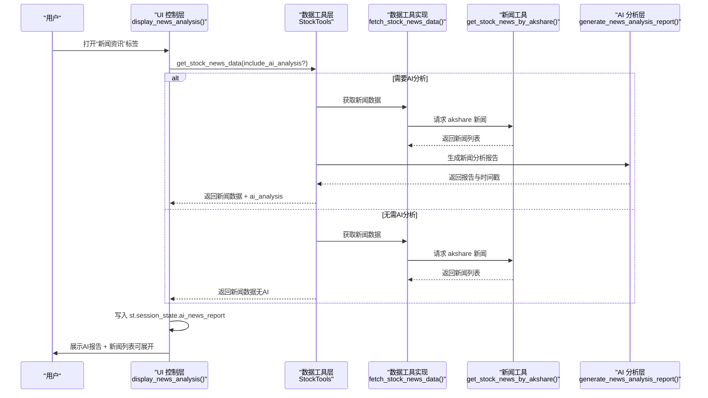
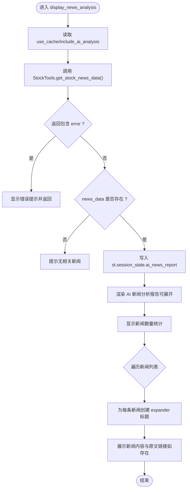
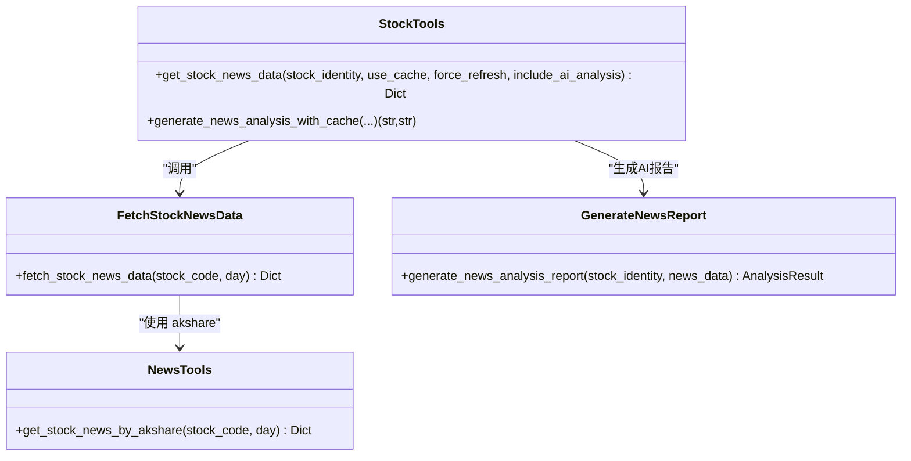
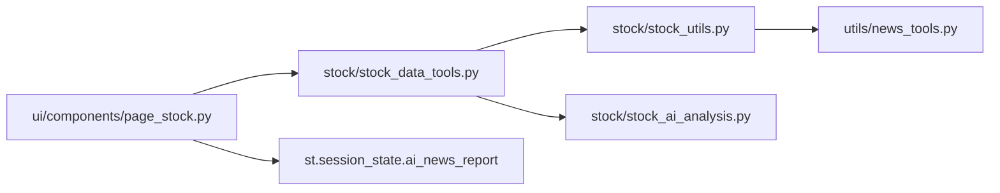

# 新闻分析界面

<cite>
**本文引用的文件**
- [ui/components/page_stock.py](file://ui/components/page_stock.py)
- [stock/stock_data_tools.py](file://stock/stock_data_tools.py)
- [stock/stock_ai_analysis.py](file://stock/stock_ai_analysis.py)
- [stock/stock_utils.py](file://stock/stock_utils.py)
- [utils/news_tools.py](file://utils/news_tools.py)
</cite>

## 目录
1. [简介](#简介)
2. [项目结构](#项目结构)
3. [核心组件](#核心组件)
4. [架构总览](#架构总览)
5. [详细组件分析](#详细组件分析)
6. [依赖关系分析](#依赖关系分析)
7. [性能考量](#性能考量)
8. [故障排查指南](#故障排查指南)
9. [结论](#结论)
10. [附录](#附录)

## 简介
本文件面向“新闻分析界面”的实现与使用，聚焦于函数 display_news_analysis 的工作流程，说明其如何获取股票相关新闻数据、在启用AI分析时生成新闻摘要与情绪分析报告、将AI分析结果存储在 Session State 的 ai_news_report 中，并通过可展开面板逐条展示新闻标题、发布时间与内容。同时文档化新闻列表的渲染逻辑、分页处理（如有）、错误恢复机制，并提供扩展指南，包括自定义新闻源与分析提示词的方法。

## 项目结构
新闻分析界面位于 UI 页面组件中，围绕 display_news_analysis 展开，数据流贯穿 UI 控制层、数据工具层、AI 分析层与外部数据源。

**图表来源**
- [ui/components/page_stock.py](file://ui/components/page_stock.py#L553-L619)
- [stock/stock_data_tools.py](file://stock/stock_data_tools.py#L191-L231)
- [stock/stock_ai_analysis.py](file://stock/stock_ai_analysis.py#L498-L549)
- [stock/stock_utils.py](file://stock/stock_utils.py#L241-L264)
- [utils/news_tools.py](file://utils/news_tools.py#L12-L57)

**章节来源**
- [ui/components/page_stock.py](file://ui/components/page_stock.py#L553-L619)
- [stock/stock_data_tools.py](file://stock/stock_data_tools.py#L191-L231)
- [stock/stock_utils.py](file://stock/stock_utils.py#L241-L264)
- [utils/news_tools.py](file://utils/news_tools.py#L12-L57)

## 核心组件
- UI 控制层：负责触发数据获取、渲染新闻列表、展示 AI 报告与错误提示。
- 数据工具层：封装新闻数据获取、缓存与 AI 分析调用，统一返回结构。
- AI 分析层：基于 LLM 生成新闻分析报告，提供统一的结果结构。
- 外部数据源：通过 akshare 获取公司新闻，清洗与格式化为统一字段。

关键职责与交互：
- display_news_analysis 调用 StockTools.get_stock_news_data，根据开关决定是否请求 AI 分析。
- 若返回包含 ai_analysis，则写入 st.session_state.ai_news_report，供后续渲染。
- 对每条新闻使用可展开面板展示标题、时间与内容；若存在原文链接则提供直达。

**章节来源**
- [ui/components/page_stock.py](file://ui/components/page_stock.py#L553-L619)
- [stock/stock_data_tools.py](file://stock/stock_data_tools.py#L191-L231)
- [stock/stock_ai_analysis.py](file://stock/stock_ai_analysis.py#L498-L549)

## 架构总览
下图展示了从 UI 触发到最终展示的端到端流程。

**图表来源**
- [ui/components/page_stock.py](file://ui/components/page_stock.py#L553-L619)
- [stock/stock_data_tools.py](file://stock/stock_data_tools.py#L191-L231)
- [stock/stock_ai_analysis.py](file://stock/stock_ai_analysis.py#L498-L549)
- [stock/stock_utils.py](file://stock/stock_utils.py#L241-L264)
- [utils/news_tools.py](file://utils/news_tools.py#L12-L57)

## 详细组件分析

### 函数：display_news_analysis
- 触发时机：当用户切换到“新闻资讯”标签页时由 UI 调用。
- 功能要点：
  - 读取会话状态 use_cache 与 include_ai_analysis，决定是否使用缓存与是否请求 AI 分析。
  - 调用 StockTools.get_stock_news_data 获取新闻数据；若开启 AI 分析则在内部生成报告并回传。
  - 将返回的 ai_analysis 写入 st.session_state.ai_news_report，键为股票代码。
  - 展示 AI 新闻分析报告（可展开），并显示新闻数量统计。
  - 遍历新闻列表，逐条使用 expander 展示标题与发布时间，正文与原文链接按字段存在性展示。
- 错误处理：
  - 若返回包含 error 字段，显示友好提示并终止渲染。
  - 若 AI 分析失败，显示错误信息并提示稍后再试。
  - 异常捕获统一显示错误信息。

**图表来源**
- [ui/components/page_stock.py](file://ui/components/page_stock.py#L553-L619)

**章节来源**
- [ui/components/page_stock.py](file://ui/components/page_stock.py#L553-L619)

### 数据获取链路：StockTools.get_stock_news_data
- 缓存策略：优先检查缓存有效性；若未强制刷新则直接返回缓存。
- 数据来源：调用 fetch_stock_news_data(stock_code)，后者内部使用 utils.news_tools.get_stock_news_by_akshare 获取 akshare 新闻数据。
- AI 分析集成：当 include_ai_analysis 为真且无错误时，调用 generate_news_analysis_report 生成报告，并将报告与时间戳合并到返回结构中。
- 返回结构：包含 news_data、news_count、latest_news、update_time，以及可选的 ai_analysis 字段。

**图表来源**
- [stock/stock_data_tools.py](file://stock/stock_data_tools.py#L191-L231)
- [stock/stock_utils.py](file://stock/stock_utils.py#L241-L264)
- [utils/news_tools.py](file://utils/news_tools.py#L12-L57)
- [stock/stock_ai_analysis.py](file://stock/stock_ai_analysis.py#L498-L549)

**章节来源**
- [stock/stock_data_tools.py](file://stock/stock_data_tools.py#L191-L231)
- [stock/stock_utils.py](file://stock/stock_utils.py#L241-L264)
- [utils/news_tools.py](file://utils/news_tools.py#L12-L57)
- [stock/stock_ai_analysis.py](file://stock/stock_ai_analysis.py#L498-L549)

### AI 分析报告生成：generate_news_analysis_report
- 输入：股票身份信息与新闻数据列表。
- 输出：AnalysisResult（success、report、timestamp、error_message、data_sources）。
- 流程：格式化股票概览与新闻文本，构造系统消息与用户消息，交由 BaseAnalysisGenerator 生成报告。
- 作用：为 UI 提供统一的 AI 新闻分析报告，便于在 Session State 中持久化与展示。

**章节来源**
- [stock/stock_ai_analysis.py](file://stock/stock_ai_analysis.py#L498-L549)

### 外部数据源：akshare 新闻
- 实现：get_stock_news_by_akshare 使用 akshare 接口抓取公司新闻，按发布时间倒序，限制天数与条数，并统一字段。
- 输出：包含 company_news、announcements、research_reports、news_summary 等字段，供上层组装。

**章节来源**
- [utils/news_tools.py](file://utils/news_tools.py#L12-L57)

## 依赖关系分析
- UI 依赖数据工具层：display_news_analysis 依赖 StockTools.get_stock_news_data 完成数据获取与 AI 分析。
- 数据工具层依赖外部数据源：fetch_stock_news_data 依赖 utils.news_tools.get_stock_news_by_akshare。
- 数据工具层依赖 AI 分析层：generate_news_analysis_report 生成报告并写入缓存与返回结构。
- Session State 依赖：AI 分析结果写入 st.session_state.ai_news_report，键为股票代码，便于跨刷新复用。

**图表来源**
- [ui/components/page_stock.py](file://ui/components/page_stock.py#L553-L619)
- [stock/stock_data_tools.py](file://stock/stock_data_tools.py#L191-L231)
- [stock/stock_utils.py](file://stock/stock_utils.py#L241-L264)
- [utils/news_tools.py](file://utils/news_tools.py#L12-L57)
- [stock/stock_ai_analysis.py](file://stock/stock_ai_analysis.py#L498-L549)

**章节来源**
- [ui/components/page_stock.py](file://ui/components/page_stock.py#L553-L619)
- [stock/stock_data_tools.py](file://stock/stock_data_tools.py#L191-L231)
- [stock/stock_utils.py](file://stock/stock_utils.py#L241-L264)
- [utils/news_tools.py](file://utils/news_tools.py#L12-L57)
- [stock/stock_ai_analysis.py](file://stock/stock_ai_analysis.py#L498-L549)

## 性能考量
- 缓存命中：get_stock_news_data 在 use_cache 且未强制刷新时直接返回缓存，减少网络与 LLM 调用。
- 并发与重试：数据获取层对 akshare 与 LLM 调用具备重试与异常捕获，降低偶发失败对用户体验的影响。
- 分页与截断：新闻列表默认限制条数与天数，避免一次性渲染过多内容导致 UI 卡顿。
- AI 分析延迟：AI 分析在后台执行，UI 侧通过 spinner 提示，避免阻塞主线程。

[本节为通用性能讨论，不直接分析具体文件]

## 故障排查指南
- 无法获取新闻数据
  - 现象：UI 显示“获取新闻数据失败”或“未能获取到相关新闻”。
  - 排查：检查网络与 akshare 可用性；确认股票代码正确；查看缓存状态。
  - 参考位置：
    - [ui/components/page_stock.py](file://ui/components/page_stock.py#L572-L574)
    - [stock/stock_utils.py](file://stock/stock_utils.py#L241-L264)
- AI 新闻分析失败
  - 现象：UI 显示“AI新闻分析失败”，并提示稍后再试。
  - 排查：检查 LLM 客户端可用性与配置；查看缓存是否可用；确认输入数据完整性。
  - 参考位置：
    - [ui/components/page_stock.py](file://ui/components/page_stock.py#L589-L590)
    - [stock/stock_data_tools.py](file://stock/stock_data_tools.py#L210-L231)
- 展示异常
  - 现象：新闻列表不显示或内容缺失。
  - 排查：确认新闻字段存在（标题、发布时间、内容、链接）；检查 UI 渲染逻辑。
  - 参考位置：
    - [ui/components/page_stock.py](file://ui/components/page_stock.py#L599-L611)

**章节来源**
- [ui/components/page_stock.py](file://ui/components/page_stock.py#L572-L611)
- [stock/stock_data_tools.py](file://stock/stock_data_tools.py#L210-L231)
- [stock/stock_utils.py](file://stock/stock_utils.py#L241-L264)

## 结论
display_news_analysis 将“新闻数据获取—AI 分析—结果持久化—UI 展示”串联为清晰的流水线。通过 Session State 的 ai_news_report，实现了跨刷新的分析结果复用；通过可展开面板与字段条件渲染，兼顾了信息密度与可读性。整体设计在性能与稳定性之间取得平衡，具备良好的扩展性。

[本节为总结性内容，不直接分析具体文件]

## 附录

### 自定义新闻源扩展指南
- 目标：替换或新增新闻数据源，保持与现有字段一致。
- 步骤：
  1) 在 utils/news_tools.py 中新增数据源函数，返回统一字段（标题、内容、发布时间、链接等）。
  2) 在 stock/stock_utils.py 的 fetch_stock_news_data 中整合新数据源，保证字段映射与排序。
  3) 在 UI 层 display_news_analysis 保持现有渲染逻辑不变，即可无缝接入新源。
- 注意事项：
  - 字段命名需与现有代码一致，避免 UI 渲染分支失效。
  - 新源需具备稳定性与速率控制，必要时增加重试与降级策略。

**章节来源**
- [utils/news_tools.py](file://utils/news_tools.py#L12-L57)
- [stock/stock_utils.py](file://stock/stock_utils.py#L241-L264)

### 自定义分析提示词扩展指南
- 目标：调整新闻分析的系统提示词与输出格式，以适配不同风格或领域。
- 步骤：
  1) 在 stock/stock_ai_analysis.py 的 generate_news_analysis_report 中修改 system_message 与 user_message 的结构与要点。
  2) 若需变更输出格式，同步调整 BaseAnalysisGenerator 的消息构建逻辑。
  3) 保持返回的 AnalysisResult 结构不变，确保 UI 与缓存兼容。
- 注意事项：
  - 保持中文输出与简洁性，避免过度冗长。
  - 明确标注“基于真实新闻数据，不得编造”，确保合规性。

**章节来源**
- [stock/stock_ai_analysis.py](file://stock/stock_ai_analysis.py#L498-L549)