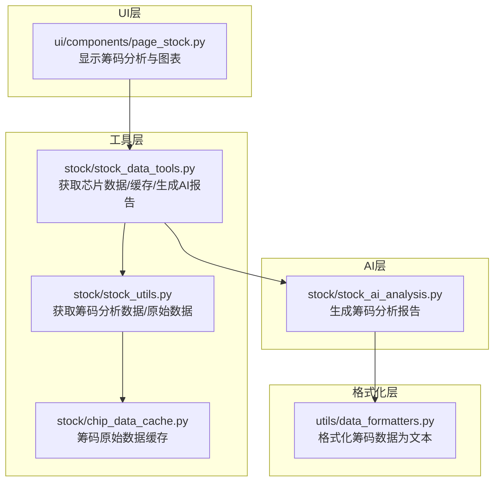
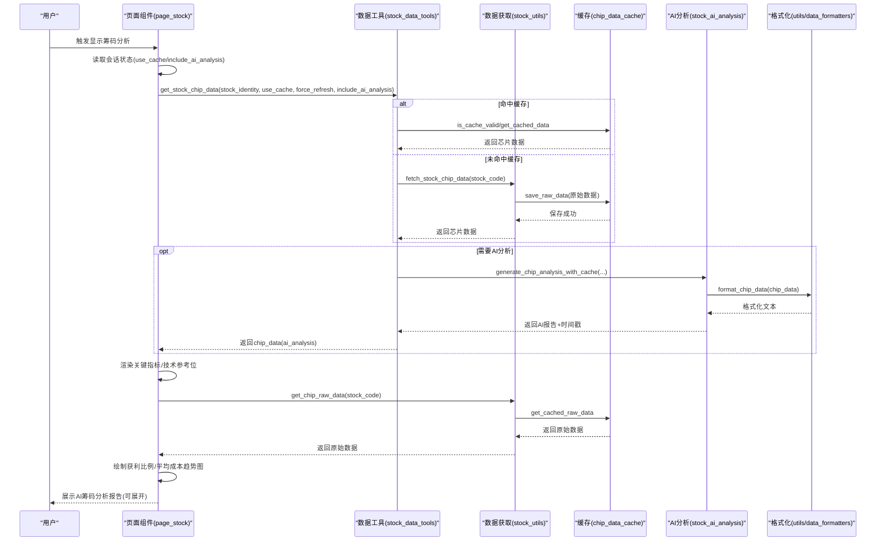
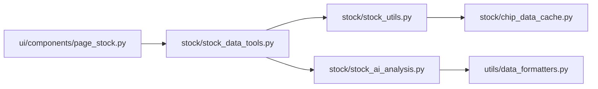

# 筹码分析界面

<cite>
**本文引用的文件**
- [ui/components/page_stock.py](file://ui/components/page_stock.py)
- [stock/stock_data_tools.py](file://stock/stock_data_tools.py)
- [stock/stock_utils.py](file://stock/stock_utils.py)
- [stock/chip_data_cache.py](file://stock/chip_data_cache.py)
- [stock/stock_ai_analysis.py](file://stock/stock_ai_analysis.py)
- [utils/data_formatters.py](file://utils/data_formatters.py)
- [tests/unit/ui/test_page_stock.py](file://tests/unit/ui/test_page_stock.py)
</cite>

## 目录
1. [简介](#简介)
2. [项目结构](#项目结构)
3. [核心组件](#核心组件)
4. [架构总览](#架构总览)
5. [组件详解](#组件详解)
6. [依赖关系分析](#依赖关系分析)
7. [性能与可用性考量](#性能与可用性考量)
8. [故障排查指南](#故障排查指南)
9. [结论](#结论)

## 简介
本文件面向“筹码分析界面”的使用者与维护者，系统化阐述如何通过前端组件调用后端数据与AI能力，完成筹码分布数据的获取、关键指标计算、可视化展示与AI生成的筹码分析报告。重点覆盖：
- 如何获取筹码分布数据（获利比例、平均成本、支撑/阻力位、成本中枢等）
- 如何使用历史筹码数据绘制获利比例与平均成本的趋势图
- 关键指标的计算逻辑与阈值策略
- 可视化图表的配置选项
- 常见数据缺失与异常场景及解决方案

## 项目结构
筹码分析界面位于UI层，通过页面组件调用工具层的数据获取与AI分析能力，最终渲染到Streamlit界面。核心路径如下：
- UI层：页面组件负责交互、状态管理与图表渲染
- 工具层：封装芯片数据获取、缓存与AI分析
- 数据层：AkShare接口抓取筹码数据，专用缓存持久化原始数据
- 格式化层：将筹码数据格式化为AI分析输入文本

**图表来源**
- [ui/components/page_stock.py](file://ui/components/page_stock.py#L620-L819)
- [stock/stock_data_tools.py](file://stock/stock_data_tools.py#L233-L432)
- [stock/stock_utils.py](file://stock/stock_utils.py#L1-L120)
- [stock/chip_data_cache.py](file://stock/chip_data_cache.py#L1-L120)
- [utils/data_formatters.py](file://utils/data_formatters.py#L411-L465)
- [stock/stock_ai_analysis.py](file://stock/stock_ai_analysis.py#L552-L603)

**章节来源**
- [ui/components/page_stock.py](file://ui/components/page_stock.py#L620-L819)
- [stock/stock_data_tools.py](file://stock/stock_data_tools.py#L233-L432)
- [stock/stock_utils.py](file://stock/stock_utils.py#L1-L120)
- [stock/chip_data_cache.py](file://stock/chip_data_cache.py#L1-L120)
- [utils/data_formatters.py](file://utils/data_formatters.py#L411-L465)
- [stock/stock_ai_analysis.py](file://stock/stock_ai_analysis.py#L552-L603)

## 核心组件
- 页面组件：负责渲染筹码分析标题、关键指标卡片、技术参考位、历史趋势图与AI分析报告折叠面板。
- 数据工具：封装芯片数据获取、缓存命中与失效处理、AI分析生成与缓存。
- 数据获取：从AkShare抓取筹码数据，或从专用缓存读取；同时计算关键指标与分析标签。
- 缓存管理：独立存储筹码原始数据，按24小时过期策略管理。
- 格式化器：将芯片数据转换为AI分析所需的Markdown文本。
- AI分析：根据系统提示词与格式化后的筹码数据生成AI分析报告。

**章节来源**
- [ui/components/page_stock.py](file://ui/components/page_stock.py#L620-L819)
- [stock/stock_data_tools.py](file://stock/stock_data_tools.py#L233-L432)
- [stock/stock_utils.py](file://stock/stock_utils.py#L1-L120)
- [stock/chip_data_cache.py](file://stock/chip_data_cache.py#L1-L120)
- [utils/data_formatters.py](file://utils/data_formatters.py#L411-L465)
- [stock/stock_ai_analysis.py](file://stock/stock_ai_analysis.py#L552-L603)

## 架构总览
下图展示了从用户触发到界面渲染的关键流程，包括数据获取、缓存、指标计算、图表绘制与AI分析报告生成。

**图表来源**
- [ui/components/page_stock.py](file://ui/components/page_stock.py#L620-L819)
- [stock/stock_data_tools.py](file://stock/stock_data_tools.py#L233-L432)
- [stock/stock_utils.py](file://stock/stock_utils.py#L1-L120)
- [stock/chip_data_cache.py](file://stock/chip_data_cache.py#L1-L120)
- [utils/data_formatters.py](file://utils/data_formatters.py#L411-L465)
- [stock/stock_ai_analysis.py](file://stock/stock_ai_analysis.py#L552-L603)

## 组件详解

### 1) 页面组件：显示筹码分析
- 功能要点
  - 读取会话状态决定是否使用缓存与是否生成AI分析
  - 调用工具层获取芯片数据，必要时生成AI分析并缓存到会话状态
  - 渲染关键指标卡片：获利比例、平均成本、成本中枢
  - 渲染技术参考位：支撑位、阻力位
  - 若存在历史原始数据，绘制获利比例与平均成本的趋势图
  - 展示AI筹码分析报告（可展开）

- 关键交互与状态
  - use_cache：控制是否使用缓存
  - include_ai_analysis：控制是否生成AI分析
  - ai_chip_report：会话状态中缓存AI报告与生成时间

- 可视化图表
  - 趋势图采用Plotly，分别绘制获利比例与平均成本随时间的变化
  - 图表布局包含坐标轴标题、固定范围、边距与滑块配置

- 异常处理
  - 对AI分析失败、数据获取失败、图表绘制失败进行提示

**章节来源**
- [ui/components/page_stock.py](file://ui/components/page_stock.py#L620-L819)

### 2) 数据工具：芯片数据获取与缓存
- 功能要点
  - 根据use_cache与force_refresh决定是否命中缓存
  - 未命中时调用fetch_stock_chip_data获取数据并写入缓存
  - 若include_ai_analysis为真，生成AI筹码分析报告并附带时间戳
  - 提供缓存状态查询与清理接口

- 关键流程
  - 缓存命中：直接返回缓存数据
  - 缓存未命中：调用fetch_stock_chip_data，保存原始数据到专用缓存，返回芯片数据
  - AI分析：调用generate_chip_analysis_with_cache，内部使用格式化器将芯片数据转为文本，再调用AI生成器生成报告

**章节来源**
- [stock/stock_data_tools.py](file://stock/stock_data_tools.py#L233-L432)

### 3) 数据获取：筹码分析与原始数据
- 功能要点
  - get_chip_analysis_data：优先从专用缓存读取原始数据，若无则从AkShare抓取并保存至缓存
  - 计算关键指标：最新日期、获利比例、平均成本、90%/70%成本区间与集中度、支撑/阻力位、成本中枢
  - 生成分析标签：获利状态、集中度状态、风险等级
  - fetch_stock_chip_data：包装get_chip_analysis_data并追加更新时间
  - get_chip_raw_data：从专用缓存读取原始数据，或从AkShare抓取并保存

- 关键指标计算逻辑
  - 获利状态：根据获利比例阈值划分高/低/中性
  - 集中度状态：根据90%集中度阈值划分高度集中/分散/适中
  - 风险等级：综合获利比例与集中度，给出高/低/中风险

**章节来源**
- [stock/stock_utils.py](file://stock/stock_utils.py#L1-L120)

### 4) 缓存管理：专用芯片原始数据缓存
- 功能要点
  - 专用缓存文件chip_raw_data.json，独立存放原始筹码数据
  - 24小时过期策略，支持按股票维度查询、清理与打印状态
  - JSON安全序列化，兼容pandas与numpy类型

**章节来源**
- [stock/chip_data_cache.py](file://stock/chip_data_cache.py#L1-L120)

### 5) 格式化器：将芯片数据转为AI输入文本
- 功能要点
  - format_chip_data：将芯片数据格式化为Markdown文本，包含最新日期、获利比例、平均成本、90%/70%区间与集中度、分析指标与技术参考位
  - 用于AI分析的消息构建，确保AI分析基于真实数据进行

**章节来源**
- [utils/data_formatters.py](file://utils/data_formatters.py#L411-L465)

### 6) AI分析：生成筹码分析报告
- 功能要点
  - generate_chip_analysis_report：构造系统提示词与用户消息，调用分析生成器生成报告
  - 系统提示词强调筹码分布形态、主力成本区间、支撑/阻力位识别、筹码迁移与异动转移率等分析重点
  - 输出格式包含筹码分布概况、主力行为画像、压力支撑分析、筹码变化信号等板块

**章节来源**
- [stock/stock_ai_analysis.py](file://stock/stock_ai_analysis.py#L552-L603)

### 7) 可视化图表：获利比例与平均成本趋势
- 功能要点
  - 从专用缓存读取原始数据，转换日期列并绘制两条趋势线
  - 图表布局设置坐标轴标题、固定范围、边距与滑块可见性
  - 若无历史数据，提示无法绘制趋势图表

**章节来源**
- [ui/components/page_stock.py](file://ui/components/page_stock.py#L703-L758)

## 依赖关系分析

**图表来源**
- [ui/components/page_stock.py](file://ui/components/page_stock.py#L620-L819)
- [stock/stock_data_tools.py](file://stock/stock_data_tools.py#L233-L432)
- [stock/stock_utils.py](file://stock/stock_utils.py#L1-L120)
- [stock/chip_data_cache.py](file://stock/chip_data_cache.py#L1-L120)
- [utils/data_formatters.py](file://utils/data_formatters.py#L411-L465)
- [stock/stock_ai_analysis.py](file://stock/stock_ai_analysis.py#L552-L603)

**章节来源**
- [ui/components/page_stock.py](file://ui/components/page_stock.py#L620-L819)
- [stock/stock_data_tools.py](file://stock/stock_data_tools.py#L233-L432)
- [stock/stock_utils.py](file://stock/stock_utils.py#L1-L120)
- [stock/chip_data_cache.py](file://stock/chip_data_cache.py#L1-L120)
- [utils/data_formatters.py](file://utils/data_formatters.py#L411-L465)
- [stock/stock_ai_analysis.py](file://stock/stock_ai_analysis.py#L552-L603)

## 性能与可用性考量
- 缓存策略
  - 专用芯片原始数据缓存：24小时过期，减少重复抓取AkShare的频率
  - 主芯片数据缓存：由工具层统一管理，避免重复计算与网络请求
- 可视化性能
  - 趋势图默认关闭rangeslider，固定y轴范围，减少渲染开销
  - 仅在存在历史数据时绘制图表，避免空图渲染
- AI分析
  - AI分析结果按类型缓存，避免重复生成
  - 生成失败时返回错误信息与时间戳，便于追踪

[本节为通用建议，无需特定文件引用]

## 故障排查指南
- 筹码数据为空或报错
  - 检查AkShare接口是否可用，确认股票代码是否支持筹码数据
  - 查看缓存状态与清理缓存后重试
  - 参考页面组件中的错误提示与警告信息
- 无法绘制趋势图
  - 确认芯片数据中存在历史原始数据
  - 检查日期列转换与数值列是否存在
- AI分析失败
  - 检查AI服务配置与依赖是否正确安装
  - 查看会话状态中的错误信息与时间戳
- 单元测试验证
  - 测试用例覆盖A股筹码分析、非A股跳过、ETF跳过等场景

**章节来源**
- [ui/components/page_stock.py](file://ui/components/page_stock.py#L620-L819)
- [tests/unit/ui/test_page_stock.py](file://tests/unit/ui/test_page_stock.py#L313-L393)

## 结论
筹码分析界面通过清晰的分层设计实现了“数据获取—缓存—指标计算—可视化—AI分析”的完整闭环。页面组件负责交互与展示，工具层负责数据与AI集成，缓存层保障性能与稳定性，格式化层确保AI输入质量。针对常见问题提供了完善的错误提示与缓存机制，便于快速定位与恢复。