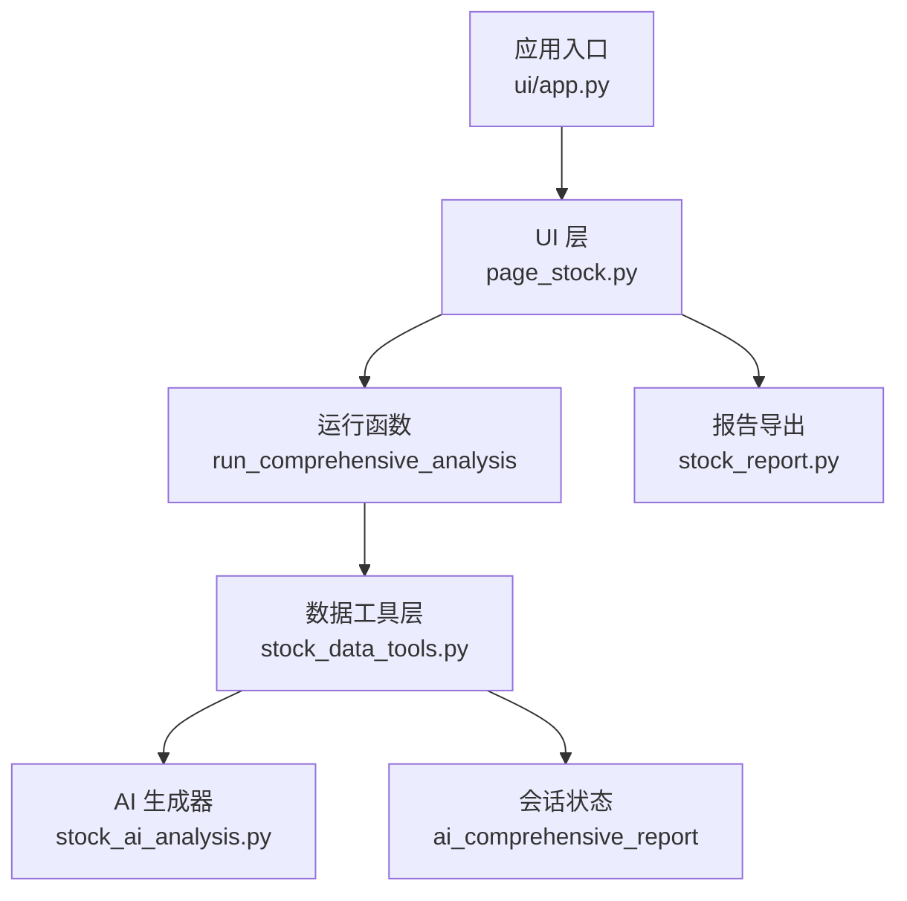
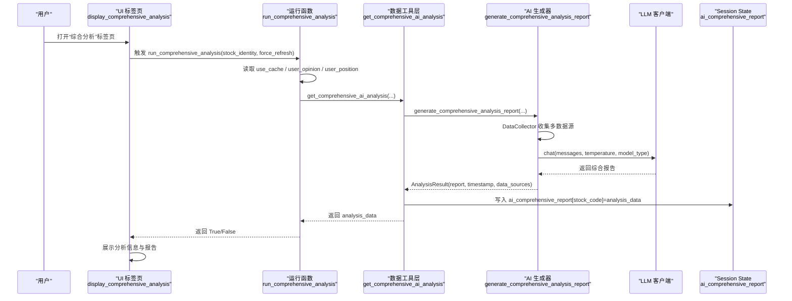
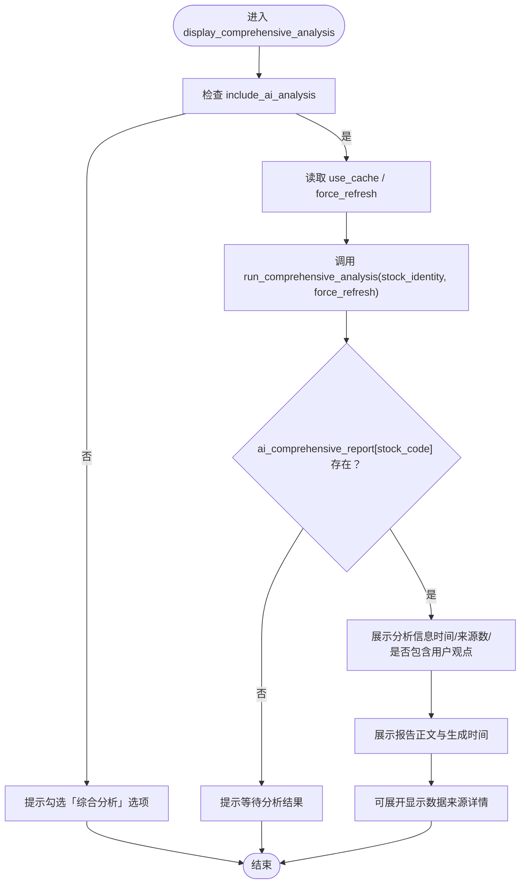
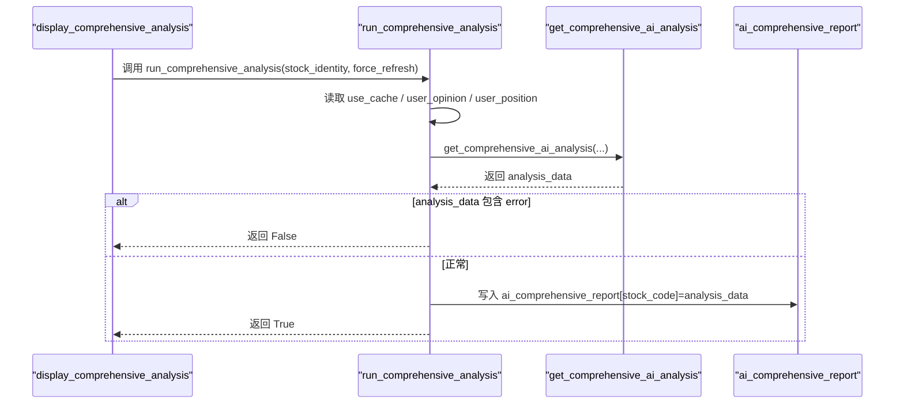
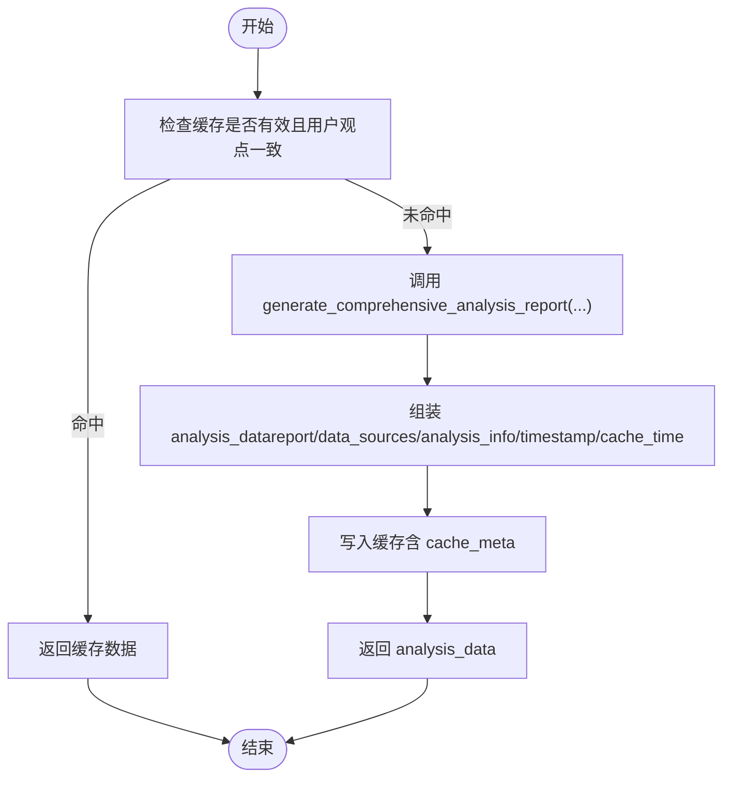
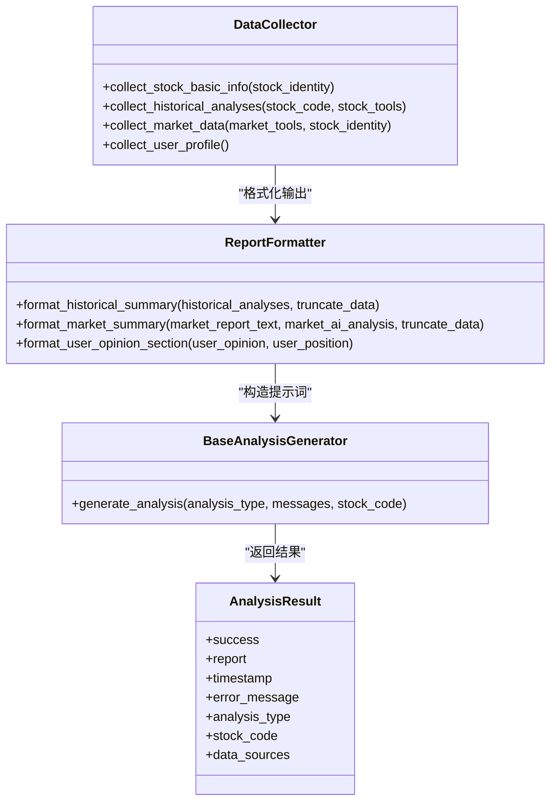
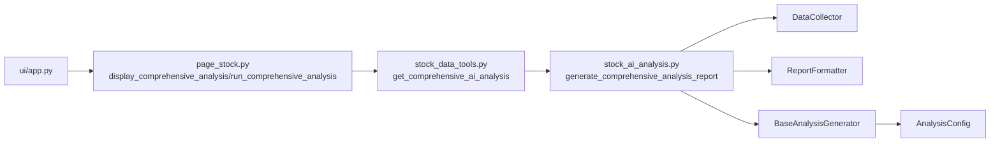

# 综合分析界面

<cite>
**本文引用的文件**
- [ui/components/page_stock.py](file://ui/components/page_stock.py)
- [stock/stock_ai_analysis.py](file://stock/stock_ai_analysis.py)
- [stock/stock_data_tools.py](file://stock/stock_data_tools.py)
- [ui/app.py](file://ui/app.py)
- [ui/components/API_DOCUMENTATION.md](file://ui/components/API_DOCUMENTATION.md)
- [stock/stock_report.py](file://stock/stock_report.py)
</cite>

## 目录
1. [简介](#简介)
2. [项目结构](#项目结构)
3. [核心组件](#核心组件)
4. [架构总览](#架构总览)
5. [详细组件分析](#详细组件分析)
6. [依赖关系分析](#依赖关系分析)
7. [性能考量](#性能考量)
8. [故障排查指南](#故障排查指南)
9. [结论](#结论)

## 简介
本文件面向“综合分析界面”的使用者与开发者，系统化阐述 display_comprehensive_analysis 函数的工作机制，说明其如何协调多数据源（基本面、技术面、新闻、筹码、市场与用户画像）进行综合评估；如何触发 run_comprehensive_analysis 执行深度分析，并将结果（包括分析时间、数据来源统计、用户观点包含情况）存储在 Session State 的 ai_comprehensive_report 中；以及综合分析报告的展示格式、元数据呈现方式与界面参数对结果的影响。

## 项目结构
综合分析界面位于 UI 层的个股分析页面中，通过标签页“综合分析”触发，内部调用运行函数生成综合报告并展示。核心路径如下：
- UI 层：ui/components/page_stock.py
- 分析层：stock/stock_ai_analysis.py
- 数据工具层：stock/stock_data_tools.py
- 应用入口与会话状态：ui/app.py
- 文档与接口说明：ui/components/API_DOCUMENTATION.md
- 报告生成与导出：stock/stock_report.py

图表来源
- [ui/components/page_stock.py](file://ui/components/page_stock.py#L765-L866)
- [stock/stock_data_tools.py](file://stock/stock_data_tools.py#L517-L709)
- [stock/stock_ai_analysis.py](file://stock/stock_ai_analysis.py#L717-L879)
- [ui/app.py](file://ui/app.py#L138-L229)
- [stock/stock_report.py](file://stock/stock_report.py#L85-L200)

章节来源
- [ui/components/page_stock.py](file://ui/components/page_stock.py#L765-L866)
- [stock/stock_data_tools.py](file://stock/stock_data_tools.py#L517-L709)
- [stock/stock_ai_analysis.py](file://stock/stock_ai_analysis.py#L717-L879)
- [ui/app.py](file://ui/app.py#L138-L229)
- [ui/components/API_DOCUMENTATION.md](file://ui/components/API_DOCUMENTATION.md#L226-L245)
- [stock/stock_report.py](file://stock/stock_report.py#L85-L200)

## 核心组件
- display_comprehensive_analysis：负责在“综合分析”标签页中展示综合分析结果，并在需要时触发 run_comprehensive_analysis。
- run_comprehensive_analysis：从 Session State 读取缓存控制、用户观点与持仓状态，调用数据工具层生成综合分析，并将结果写入 ai_comprehensive_report。
- stock_data_tools.get_comprehensive_ai_analysis：封装综合分析生成流程，聚合多数据源，处理缓存与错误，返回标准化结果。
- stock_ai_analysis.generate_comprehensive_analysis_report：核心生成器，整合历史分析、市场环境、用户画像与用户观点，构造统一提示词并调用 LLM 生成报告。
- ui/app.py：初始化与管理 Session State（如 include_ai_analysis、user_opinion、user_position、use_cache），为综合分析提供参数来源。
- API 文档：明确 Session State 中 ai_comprehensive_report 的使用方式与字段含义。

章节来源
- [ui/components/page_stock.py](file://ui/components/page_stock.py#L765-L866)
- [stock/stock_data_tools.py](file://stock/stock_data_tools.py#L517-L709)
- [stock/stock_ai_analysis.py](file://stock/stock_ai_analysis.py#L717-L879)
- [ui/app.py](file://ui/app.py#L138-L229)
- [ui/components/API_DOCUMENTATION.md](file://ui/components/API_DOCUMENTATION.md#L226-L245)

## 架构总览
综合分析的端到端流程如下：
- 用户在“综合分析”标签页触发分析（display_comprehensive_analysis）
- run_comprehensive_analysis 读取 Session State 参数，调用 stock_data_tools.get_comprehensive_ai_analysis
- get_comprehensive_ai_analysis 调用 stock_ai_analysis.generate_comprehensive_analysis_report
- 生成器 DataCollector 收集：股票基本信息、历史分析、市场综合与 AI 分析、用户画像、用户观点与持仓
- BaseAnalysisGenerator 调用 LLM 生成报告，返回 AnalysisResult
- get_comprehensive_ai_analysis 将结果写入 Session State 的 ai_comprehensive_report，并按需缓存

图表来源
- [ui/components/page_stock.py](file://ui/components/page_stock.py#L765-L866)
- [stock/stock_data_tools.py](file://stock/stock_data_tools.py#L517-L709)
- [stock/stock_ai_analysis.py](file://stock/stock_ai_analysis.py#L717-L879)

## 详细组件分析

### 组件A：display_comprehensive_analysis（综合分析展示）
- 触发条件：当 include_ai_analysis 为真时，自动尝试生成并展示综合分析。
- 关键行为：
  - 读取 use_cache 与 force_refresh，调用 run_comprehensive_analysis。
  - 若存在 ai_comprehensive_report[stock_code]，展示分析信息（分析时间、数据来源数量、是否包含用户观点）。
  - 展示 report 内容与生成时间。
  - 可展开显示数据来源详情（类型与描述）。
- 错误处理：捕获异常并提示“显示综合分析失败”，同时提供“错误详情”展开面板。

图表来源
- [ui/components/page_stock.py](file://ui/components/page_stock.py#L765-L866)

章节来源
- [ui/components/page_stock.py](file://ui/components/page_stock.py#L765-L866)

### 组件B：run_comprehensive_analysis（综合分析运行）
- 输入参数：stock_identity、force_refresh
- 关键行为：
  - 从 Session State 读取 use_cache、user_opinion、user_position。
  - 调用 stock_data_tools.get_comprehensive_ai_analysis 生成综合分析。
  - 若返回 error 字段，提示“获取综合分析失败”。
  - 初始化或更新 ai_comprehensive_report[stock_code]，并将 analysis_data 写入。
  - 返回布尔值表示是否成功。
- 异常处理：捕获异常并提示“AI综合分析失败”，同时打印堆栈。

图表来源
- [ui/components/page_stock.py](file://ui/components/page_stock.py#L810-L866)
- [stock/stock_data_tools.py](file://stock/stock_data_tools.py#L517-L709)

章节来源
- [ui/components/page_stock.py](file://ui/components/page_stock.py#L810-L866)
- [stock/stock_data_tools.py](file://stock/stock_data_tools.py#L517-L709)

### 组件C：stock_data_tools.get_comprehensive_ai_analysis（综合分析生成与缓存）
- 关键职责：
  - 检查缓存有效性与用户观点一致性，决定是否复用缓存。
  - 调用 generate_comprehensive_analysis_report 生成报告。
  - 将 report、data_sources、analysis_info（含 analysis_time、data_sources_count、user_opinion_included、user_opinion）、timestamp、cache_time 组装为 analysis_data。
  - 将 analysis_data 写入缓存（包含 cache_meta：timestamp、data_type、stock_code、analysis_type、expire_minutes、user_opinion、user_position）。
  - 返回 analysis_data 或错误信息。
- 输出结构要点：
  - report：综合分析报告正文
  - data_sources：数据来源清单（类型、描述、时间）
  - analysis_info：分析元数据（分析时间、来源数量、是否包含用户观点、用户观点文本）
  - timestamp：本次生成时间
  - cache_time：缓存时间戳

图表来源
- [stock/stock_data_tools.py](file://stock/stock_data_tools.py#L517-L709)

章节来源
- [stock/stock_data_tools.py](file://stock/stock_data_tools.py#L517-L709)

### 组件D：stock_ai_analysis.generate_comprehensive_analysis_report（综合分析生成器）
- 数据收集（DataCollector）：
  - 股票基本信息（当前价格、涨跌、成交量等）
  - 历史分析（技术面、基本面、新闻、筹码面报告与来源）
  - 市场综合报告与 AI 分析
  - 用户画像与用户常犯错误
  - 用户观点与当前持仓状态
- 报告格式化（ReportFormatter）：
  - 历史分析摘要、市场环境摘要
  - 用户观点与持仓格式化
- 提示词构造：
  - 读取配置（风险偏好、自定义原则）
  - 组装系统提示词与用户提示词，限定输出格式与长度
- LLM 调用：
  - BaseAnalysisGenerator.chat，返回 AnalysisResult（success/report/timestamp/data_sources）

图表来源
- [stock/stock_ai_analysis.py](file://stock/stock_ai_analysis.py#L742-L879)

章节来源
- [stock/stock_ai_analysis.py](file://stock/stock_ai_analysis.py#L717-L879)

### 组件E：Session State 参数与界面交互
- ui/app.py 初始化与管理：
  - include_ai_analysis：是否启用 AI 分析
  - user_opinion：用户观点
  - user_position：用户当前持仓状态
  - use_cache：是否使用缓存
  - ai_comprehensive_report：综合分析结果存储
- API 文档明确：
  - ai_comprehensive_report 的键为股票代码，值为 analysis_data（report、data_sources、analysis_info、timestamp、cache_time）

章节来源
- [ui/app.py](file://ui/app.py#L138-L229)
- [ui/components/API_DOCUMENTATION.md](file://ui/components/API_DOCUMENTATION.md#L226-L245)

### 组件F：报告展示与导出
- 展示格式：
  - 综合分析标签页展示 report 正文与生成时间
  - analysis_info 中的 analysis_time、data_sources_count、user_opinion_included 以指标卡形式展示
  - data_sources 以展开面板列出来源类型与描述
- 导出格式：
  - 通过通用导出组件，可导出包含综合分析在内的完整报告（PDF/DOCX/HTML/Markdown）

章节来源
- [ui/components/page_stock.py](file://ui/components/page_stock.py#L765-L866)
- [stock/stock_report.py](file://stock/stock_report.py#L85-L200)
- [ui/components/API_DOCUMENTATION.md](file://ui/components/API_DOCUMENTATION.md#L511-L535)

## 依赖关系分析
- display_comprehensive_analysis 依赖 run_comprehensive_analysis 与 Session State（ai_comprehensive_report）。
- run_comprehensive_analysis 依赖 stock_data_tools.get_comprehensive_ai_analysis。
- get_comprehensive_ai_analysis 依赖 stock_ai_analysis.generate_comprehensive_analysis_report。
- generate_comprehensive_analysis_report 依赖 DataCollector、ReportFormatter、BaseAnalysisGenerator。
- BaseAnalysisGenerator 依赖 LLM 客户端（OpenAIClient）与配置管理器（AnalysisConfig）。
- ui/app.py 为 Session State 提供 include_ai_analysis、user_opinion、user_position、use_cache 的来源。

图表来源
- [ui/components/page_stock.py](file://ui/components/page_stock.py#L765-L866)
- [stock/stock_data_tools.py](file://stock/stock_data_tools.py#L517-L709)
- [stock/stock_ai_analysis.py](file://stock/stock_ai_analysis.py#L717-L879)
- [ui/app.py](file://ui/app.py#L138-L229)

章节来源
- [ui/components/page_stock.py](file://ui/components/page_stock.py#L765-L866)
- [stock/stock_data_tools.py](file://stock/stock_data_tools.py#L517-L709)
- [stock/stock_ai_analysis.py](file://stock/stock_ai_analysis.py#L717-L879)
- [ui/app.py](file://ui/app.py#L138-L229)

## 性能考量
- 缓存策略：
  - 综合分析结果按 stock_code 与 analysis_type 维度缓存，缓存元数据包含 user_opinion 与 user_position，确保用户观点变化时强制重新生成。
  - 缓存有效期由 cache_configs 控制，避免重复请求 LLM。
- 会话状态：
  - ai_comprehensive_report 仅存储最新一次分析结果，避免内存膨胀。
- 数据裁剪：
  - 历史分析与市场环境摘要在格式化时可截断，降低提示词长度，提高 LLM 生成效率。
- 并发与重入：
  - run_comprehensive_analysis 使用 spinner 提示，避免重复触发；ui/app.py 在重置时清理相关 Session State，防止意外查询。

章节来源
- [stock/stock_data_tools.py](file://stock/stock_data_tools.py#L517-L709)
- [ui/components/page_stock.py](file://ui/components/page_stock.py#L810-L866)
- [ui/app.py](file://ui/app.py#L138-L229)

## 故障排查指南
- “显示综合分析失败”：
  - 检查 run_comprehensive_analysis 是否返回 error 字段
  - 查看“错误详情”展开面板，复制堆栈信息
- “获取综合分析失败”：
  - 检查 AI 分析模块可用性与依赖安装
  - 确认 LLM 配置（API Key、Base URL、模型、超时、重试）是否正确
- “未包含用户观点”：
  - 确认 ui/app.py 中已设置 user_opinion 与 user_position
  - 检查 get_comprehensive_ai_analysis 的缓存元数据是否匹配当前 user_opinion
- “报告为空或不完整”：
  - 检查历史分析缓存是否存在
  - 确认市场数据与用户画像配置是否可用

章节来源
- [ui/components/page_stock.py](file://ui/components/page_stock.py#L810-L866)
- [stock/stock_data_tools.py](file://stock/stock_data_tools.py#L517-L709)
- [ui/app.py](file://ui/app.py#L138-L229)

## 结论
综合分析界面通过 display_comprehensive_analysis 与 run_comprehensive_analysis 协同工作，将多数据源（历史分析、市场环境、用户画像、用户观点与持仓）整合为统一的综合报告，并以结构化的 Session State 存储结果。界面提供直观的元数据展示与数据来源明细，用户可通过界面参数（是否启用 AI、是否使用缓存、用户观点与持仓）显著影响最终分析结果。结合缓存与错误处理机制，系统在保证用户体验的同时兼顾性能与稳定性。