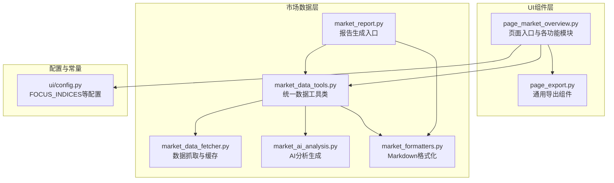
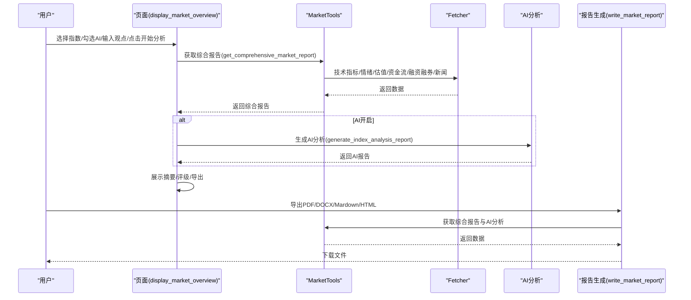
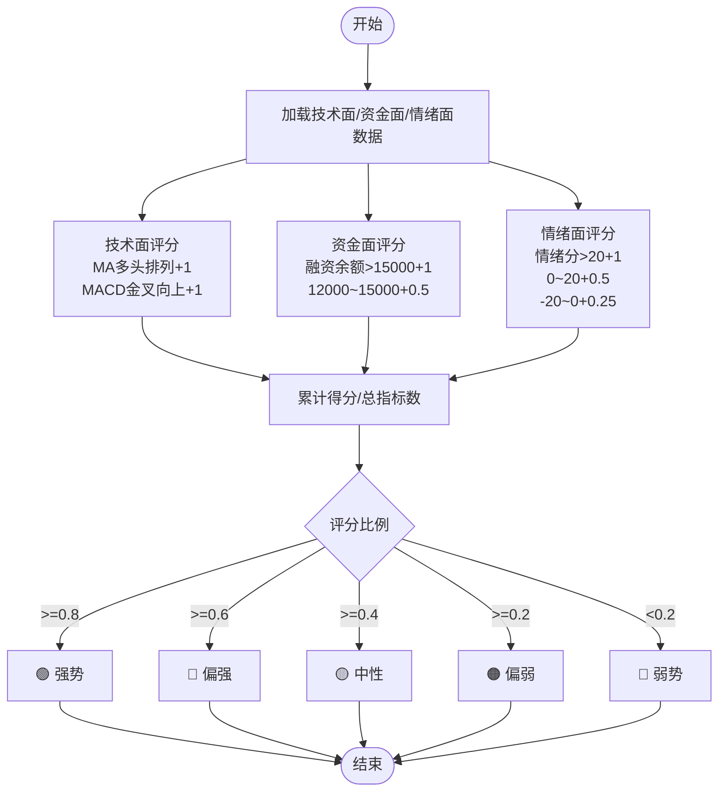
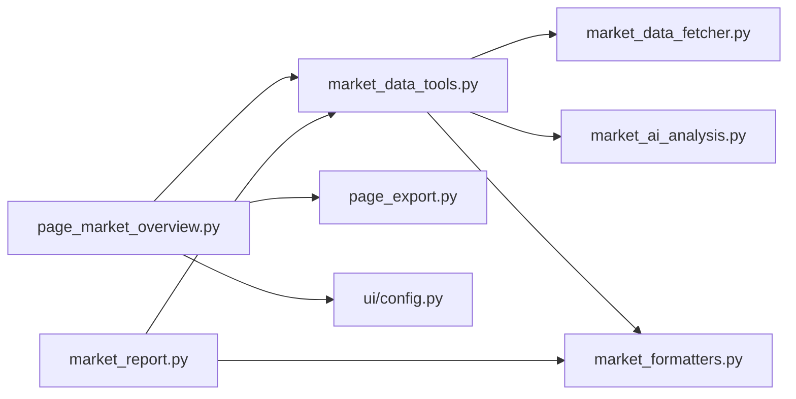

# 大盘分析界面

<cite>
**本文引用的文件**
- [page_market_overview.py](file://ui/components/page_market_overview.py)
- [market_data_tools.py](file://market/market_data_tools.py)
- [market_data_fetcher.py](file://market/market_data_fetcher.py)
- [market_ai_analysis.py](file://market/market_ai_analysis.py)
- [market_formatters.py](file://market/market_formatters.py)
- [market_report.py](file://market/market_report.py)
- [page_export.py](file://ui/components/page_export.py)
- [config.py](file://ui/config.py)
- [test_page_market_overview.py](file://tests/unit/ui/test_page_market_overview.py)
</cite>

## 目录
1. [简介](#简介)
2. [项目结构](#项目结构)
3. [核心组件](#核心组件)
4. [架构总览](#架构总览)
5. [详细组件分析](#详细组件分析)
6. [依赖关系分析](#依赖关系分析)
7. [性能考量](#性能考量)
8. [故障排查指南](#故障排查指南)
9. [结论](#结论)
10. [附录](#附录)

## 简介
本文件为“大盘分析界面”的API参考文档，面向使用者与开发者，系统梳理并说明页面入口函数与各功能模块的职责、参数、返回值与使用场景。重点覆盖以下公共接口：
- 页面入口：display_market_overview
- 指数展示：display_market_indices
- 技术分析：display_market_technical_analysis
- 基本面分析：display_market_fundamentals
- 市场情绪：display_market_sentiment
- 市场新闻：display_market_news
- 综合摘要与评级：display_market_summary、display_comprehensive_rating
- AI分析与导出：handle_ai_analysis、display_ai_analysis_section、display_market_report_export、write_market_report

同时，文档阐述AI分析的集成机制、用户观点输入处理与综合评级的计算逻辑，并提供调用流程示例与可视化图示，帮助读者快速理解与正确使用。

## 项目结构
大盘分析界面位于UI组件层，围绕Streamlit页面组织，数据来源通过统一的市场工具类封装，最终由格式化器与导出组件完成展示与落盘。

图表来源
- [page_market_overview.py](file://ui/components/page_market_overview.py#L627-L758)
- [market_data_tools.py](file://market/market_data_tools.py#L421-L455)
- [market_data_fetcher.py](file://market/market_data_fetcher.py#L286-L355)
- [market_ai_analysis.py](file://market/market_ai_analysis.py#L14-L123)
- [market_formatters.py](file://market/market_formatters.py#L561-L647)
- [market_report.py](file://market/market_report.py#L13-L87)
- [config.py](file://ui/config.py#L45-L82)

章节来源
- [page_market_overview.py](file://ui/components/page_market_overview.py#L627-L758)
- [market_data_tools.py](file://market/market_data_tools.py#L421-L455)
- [market_data_fetcher.py](file://market/market_data_fetcher.py#L286-L355)
- [market_ai_analysis.py](file://market/market_ai_analysis.py#L14-L123)
- [market_formatters.py](file://market/market_formatters.py#L561-L647)
- [market_report.py](file://market/market_report.py#L13-L87)
- [config.py](file://ui/config.py#L45-L82)

## 核心组件
- 页面入口与组织
  - display_market_overview：负责页面布局、标签页组织、缓存控制、AI分析开关与用户观点输入、刷新与分析触发。
- 指数与K线
  - display_market_indices：展示关注指数的实时行情。
  - display_market_technical_analysis：展示K线图、技术指标与风险分析。
- 基本面
  - display_market_fundamentals：整合估值、资金流、融资融券三类基本面指标。
  - display_valuation_analysis/display_money_flow_analysis/display_margin_trading_analysis：分别展示估值、资金流、融资融券。
- 情绪与新闻
  - display_market_sentiment：展示综合市场情绪分析。
  - display_market_sentiment_analysis：调用格式化器输出情绪Markdown。
  - display_market_news：按配置开关展示市场新闻。
- 综合摘要与评级
  - display_market_summary：生成综合摘要、触发AI分析、显示综合评级与导出。
  - display_comprehensive_rating：基于技术面、资金面、情绪面计算综合评级。
- AI分析与导出
  - handle_ai_analysis/display_ai_analysis_section：AI分析触发与展示。
  - display_market_report_export/write_market_report：导出报告（PDF/DOCX/Mardown/HTML）。

章节来源
- [page_market_overview.py](file://ui/components/page_market_overview.py#L221-L758)
- [market_data_tools.py](file://market/market_data_tools.py#L379-L495)
- [market_ai_analysis.py](file://market/market_ai_analysis.py#L14-L123)
- [market_report.py](file://market/market_report.py#L13-L87)
- [page_export.py](file://ui/components/page_export.py#L180-L281)

## 架构总览
下图展示从页面入口到数据获取、AI分析与导出的整体流程。

图表来源
- [page_market_overview.py](file://ui/components/page_market_overview.py#L627-L758)
- [market_data_tools.py](file://market/market_data_tools.py#L421-L455)
- [market_ai_analysis.py](file://market/market_ai_analysis.py#L14-L123)
- [market_report.py](file://market/market_report.py#L13-L87)

## 详细组件分析

### 页面入口：display_market_overview
- 职责
  - 组织页面布局与标签页；控制缓存策略；处理AI分析开关与用户观点输入；触发分析与刷新。
- 参数
  - 无显式参数；通过Streamlit控件与session_state交互。
- 返回值
  - 无返回值；通过Streamlit组件渲染页面。
- 使用场景
  - 用户进入“大盘整体分析”页面，选择分析指数、是否启用AI、是否使用缓存、输入观点，点击“开始分析”后生成各标签页内容。
- 关键流程
  - 读取FOCUS_INDICES作为指数选择项；根据配置决定是否显示“市场资讯”标签页；根据use_cache决定是否清空缓存；根据use_ai_analysis决定是否生成AI分析；分析完成后在各标签页内调用对应展示函数。
- 会话状态
  - market_use_cache、run_ai_index、market_user_opinion、current_analysis_index、show_analysis_results、ai_index_report等。

章节来源
- [page_market_overview.py](file://ui/components/page_market_overview.py#L627-L758)
- [config.py](file://ui/config.py#L45-L82)

### 指数展示：display_market_indices
- 职责
  - 获取当前主要指数的实时行情并以指标卡形式展示。
- 参数
  - 无显式参数；内部从session_state读取use_cache与force_refresh。
- 返回值
  - 无返回值；直接渲染Streamlit组件。
- 使用场景
  - 在“大盘指数”标签页中展示上证、深证、沪深300、中证500、创业板指等指数的最新价、涨跌幅与涨跌额。
- 数据来源
  - MarketTools.get_current_indices；内部调用market_data_fetcher.fetch_current_indices。

章节来源
- [page_market_overview.py](file://ui/components/page_market_overview.py#L301-L362)
- [market_data_tools.py](file://market/market_data_tools.py#L232-L249)
- [market_data_fetcher.py](file://market/market_data_fetcher.py#L286-L355)

### 技术分析：display_market_technical_analysis
- 职责
  - 展示指数K线图、技术指标与风险分析。
- 参数
  - index_name：默认“上证指数”，用于选择分析对象。
- 返回值
  - 无返回值；渲染K线图与技术分析Tab。
- 使用场景
  - 在“技术指标”标签页中展示选定指数的历史K线、均线、MACD、RSI等指标，并提供风险分析。
- 数据来源
  - MarketTools.get_index_kline_data与get_index_technical_indicators；内部调用K线管理器与技术指标计算。

章节来源
- [page_market_overview.py](file://ui/components/page_market_overview.py#L537-L597)
- [market_data_tools.py](file://market/market_data_tools.py#L307-L351)
- [market_data_fetcher.py](file://market/market_data_fetcher.py#L568-L607)

### 基本面分析：display_market_fundamentals
- 职责
  - 聚合展示估值、资金流、融资融券三类基本面指标。
- 参数
  - index_name：默认“沪深300”，用于选择估值参考指数。
- 返回值
  - 无返回值；依次调用估值、资金流、融资融券展示函数。
- 使用场景
  - 在“市场基本面”标签页中展示PE/PB、股息率、M2/M1、融资融券余额与周变化等指标。

章节来源
- [page_market_overview.py](file://ui/components/page_market_overview.py#L221-L231)
- [page_market_overview.py](file://ui/components/page_market_overview.py#L221-L231)

#### 估值分析：display_valuation_analysis
- 职责
  - 展示估值水平（PE、股息率），并提供估值等级说明。
- 参数
  - index_name：默认“沪深300”；use_cache：默认True。
- 返回值
  - 无返回值；渲染指标卡与展开框。
- 使用场景
  - 依据MarketTools.get_index_valuation_data返回的估值数据，按是否直接估值显示不同说明。

章节来源
- [page_market_overview.py](file://ui/components/page_market_overview.py#L22-L104)
- [market_data_tools.py](file://market/market_data_tools.py#L85-L194)

#### 资金流向：display_money_flow_analysis
- 职责
  - 展示M2/M1余额与同比增长，提供流动性分析。
- 参数
  - use_cache：默认True。
- 返回值
  - 无返回值；渲染指标卡与展开框。
- 使用场景
  - 依据MarketTools.get_money_flow_data返回的宏观货币供应量数据进行展示。

章节来源
- [page_market_overview.py](file://ui/components/page_market_overview.py#L106-L150)
- [market_data_tools.py](file://market/market_data_tools.py#L196-L213)
- [market_data_fetcher.py](file://market/market_data_fetcher.py#L248-L283)

#### 融资融券：display_margin_trading_analysis
- 职责
  - 展示融资融券余额、融资余额、融券余额与周变化率。
- 参数
  - use_cache：默认True。
- 返回值
  - 无返回值；渲染指标卡与统计时间。
- 使用场景
  - 依据MarketTools.get_margin_data返回的两市数据进行展示。

章节来源
- [page_market_overview.py](file://ui/components/page_market_overview.py#L180-L219)
- [market_data_tools.py](file://market/market_data_tools.py#L214-L231)
- [market_data_fetcher.py](file://market/market_data_fetcher.py#L358-L449)

### 市场情绪：display_market_sentiment
- 职责
  - 展示综合市场情绪分析，调用格式化器输出Markdown。
- 参数
  - 无显式参数；内部从session_state读取use_cache。
- 返回值
  - 无返回值；渲染Streamlit组件。
- 使用场景
  - 在“市场情绪”标签页中展示综合情绪评分、涨跌家数、涨停跌停、资金流向等指标与解读。

章节来源
- [page_market_overview.py](file://ui/components/page_market_overview.py#L233-L241)
- [page_market_overview.py](file://ui/components/page_market_overview.py#L162-L178)
- [market_formatters.py](file://market/market_formatters.py#L106-L368)

### 市场新闻：display_market_news
- 职责
  - 按配置开关展示市场新闻，最多显示前10条。
- 参数
  - 无显式参数；内部从session_state读取use_cache。
- 返回值
  - 无返回值；渲染新闻列表与时间戳。
- 使用场景
  - 在“市场资讯”标签页中展示宏观经济新闻，支持查看原文链接。

章节来源
- [page_market_overview.py](file://ui/components/page_market_overview.py#L243-L299)
- [market_data_tools.py](file://market/market_data_tools.py#L250-L271)

### 综合摘要与评级：display_market_summary / display_comprehensive_rating
- 职责
  - 生成综合摘要、触发AI分析、显示综合评级与导出。
- 参数
  - index_name：默认“上证指数”。
- 返回值
  - 无返回值；渲染摘要、评级与导出组件。
- 使用场景
  - 在“综合摘要”标签页中展示技术面、资金面、估值面、流动性与情绪面的要点摘要，计算综合评级并提供导出。

章节来源
- [page_market_overview.py](file://ui/components/page_market_overview.py#L599-L625)
- [page_market_overview.py](file://ui/components/page_market_overview.py#L416-L507)

#### 综合评级计算逻辑

图表来源
- [page_market_overview.py](file://ui/components/page_market_overview.py#L416-L507)

### AI分析与导出：handle_ai_analysis / display_ai_analysis_section / display_market_report_export / write_market_report
- 职责
  - handle_ai_analysis：根据session_state触发AI分析，缓存结果。
  - display_ai_analysis_section：展示AI报告与时间戳、是否包含用户观点。
  - display_market_report_export：调用通用导出组件，生成并下载报告。
  - write_market_report：聚合综合报告与AI分析，生成PDF/DOCX/Mardown/HTML。
- 参数
  - index_name：默认“上证指数”。
  - use_cache：默认True。
  - user_opinion：用户输入观点，默认空字符串。
- 返回值
  - 无返回值（展示函数）；write_market_report返回文件内容或错误信息。
- 使用场景
  - 用户勾选“AI大盘分析”并在文本域输入观点后，点击“开始分析”，页面触发AI分析并展示；随后可在“综合摘要”标签页导出报告。

章节来源
- [page_market_overview.py](file://ui/components/page_market_overview.py#L364-L414)
- [page_market_overview.py](file://ui/components/page_market_overview.py#L509-L535)
- [market_data_tools.py](file://market/market_data_tools.py#L379-L495)
- [market_ai_analysis.py](file://market/market_ai_analysis.py#L14-L123)
- [market_report.py](file://market/market_report.py#L13-L87)
- [page_export.py](file://ui/components/page_export.py#L180-L281)

## 依赖关系分析
- 组件耦合
  - page_market_overview依赖MarketTools进行数据获取与AI分析；MarketTools进一步依赖market_data_fetcher与market_ai_analysis；格式化与导出由market_formatters与page_export提供。
- 外部依赖
  - akshare、OpenAI客户端、报告生成工具（PDF/DOCX/HTML/Markdown）。
- 配置依赖
  - ui/config.py中的FOCUS_INDICES、INDEX_SYMBOL_MAPPING等影响指数选择与数据查询。

图表来源
- [page_market_overview.py](file://ui/components/page_market_overview.py#L627-L758)
- [market_data_tools.py](file://market/market_data_tools.py#L421-L455)
- [market_data_fetcher.py](file://market/market_data_fetcher.py#L286-L355)
- [market_ai_analysis.py](file://market/market_ai_analysis.py#L14-L123)
- [market_formatters.py](file://market/market_formatters.py#L561-L647)
- [market_report.py](file://market/market_report.py#L13-L87)
- [page_export.py](file://ui/components/page_export.py#L180-L281)
- [config.py](file://ui/config.py#L45-L82)

章节来源
- [page_market_overview.py](file://ui/components/page_market_overview.py#L627-L758)
- [market_data_tools.py](file://market/market_data_tools.py#L421-L455)
- [market_data_fetcher.py](file://market/market_data_fetcher.py#L286-L355)
- [market_ai_analysis.py](file://market/market_ai_analysis.py#L14-L123)
- [market_formatters.py](file://market/market_formatters.py#L561-L647)
- [market_report.py](file://market/market_report.py#L13-L87)
- [page_export.py](file://ui/components/page_export.py#L180-L281)
- [config.py](file://ui/config.py#L45-L82)

## 性能考量
- 缓存策略
  - MarketTools对各类数据提供缓存校验与保存，支持强制刷新；页面默认使用缓存以提升响应速度。
- 数据获取
  - 指数K线与技术指标通过统一的K线管理器获取，避免重复计算；情绪与资金流采用多源备选方案，提高稳定性。
- 导出性能
  - 导出前先生成Markdown，再转目标格式；PDF生成依赖外部库，建议在可用环境下使用。

[本节为通用指导，无需特定文件引用]

## 故障排查指南
- 常见问题
  - 指数数据为空：检查网络与akshare数据源，确认FOCUS_INDICES配置正确。
  - AI分析失败：检查OpenAI客户端配置与网络连通性；查看错误信息并重试。
  - 新闻功能禁用：若配置关闭市场新闻，页面将不显示“市场资讯”标签页。
- 调试建议
  - 使用刷新按钮清空缓存并强制获取最新数据。
  - 在“详细信息”展开框中查看分析时间、分析对象与数据源。
  - 查看错误详情面板获取异常堆栈。

章节来源
- [page_market_overview.py](file://ui/components/page_market_overview.py#L729-L740)

## 结论
大盘分析界面通过清晰的模块划分与统一的数据工具层，实现了从指数行情、技术分析、基本面、情绪与新闻到AI综合分析与报告导出的完整闭环。页面入口负责组织与调度，数据层提供稳定可靠的数据获取与缓存，格式化与导出组件保证输出质量与多样性。用户可通过简单的交互完成从数据获取到报告导出的全流程体验。

[本节为总结性内容，无需特定文件引用]

## 附录

### API定义与调用示例

- 页面入口
  - 函数：display_market_overview
  - 用途：组织页面布局与标签页，控制缓存与AI分析，触发分析与刷新。
  - 示例：用户选择“沪深300”，勾选“AI大盘分析”，输入观点，点击“开始分析”。

- 指数展示
  - 函数：display_market_indices
  - 用途：展示关注指数的实时行情。
  - 示例：在“大盘指数”标签页中查看上证、深证、沪深300等指数的最新价与涨跌幅。

- 技术分析
  - 函数：display_market_technical_analysis(index_name)
  - 用途：展示K线图与技术指标，提供风险分析。
  - 示例：分析“上证指数”的K线与MACD、RSI等指标。

- 基本面分析
  - 函数：display_market_fundamentals(index_name)
  - 用途：聚合展示估值、资金流、融资融券。
  - 示例：查看沪深300的PE、M2、融资融券余额等。

- 市场情绪
  - 函数：display_market_sentiment
  - 用途：展示综合市场情绪分析。
  - 示例：查看涨跌家数、涨停跌停、资金流向与情绪评分。

- 市场新闻
  - 函数：display_market_news
  - 用途：按配置开关展示市场新闻。
  - 示例：在“市场资讯”标签页查看宏观经济新闻。

- 综合摘要与评级
  - 函数：display_market_summary(index_name)
  - 用途：生成摘要、触发AI分析、显示综合评级与导出。
  - 示例：在“综合摘要”标签页查看技术面、资金面、估值面、流动性与情绪面摘要。

- AI分析与导出
  - 函数：handle_ai_analysis(index_name, use_cache)
  - 用途：根据session_state触发AI分析并缓存结果。
  - 函数：display_ai_analysis_section(index_name)
  - 用途：展示AI报告与时间戳、是否包含用户观点。
  - 函数：display_market_report_export(index_name)
  - 用途：调用通用导出组件生成并下载报告。
  - 函数：write_market_report(index_name, format_type, has_ai_analysis, user_opinion)
  - 用途：聚合综合报告与AI分析，生成PDF/DOCX/Mardown/HTML。

章节来源
- [page_market_overview.py](file://ui/components/page_market_overview.py#L221-L758)
- [market_data_tools.py](file://market/market_data_tools.py#L379-L495)
- [market_ai_analysis.py](file://market/market_ai_analysis.py#L14-L123)
- [market_report.py](file://market/market_report.py#L13-L87)
- [page_export.py](file://ui/components/page_export.py#L180-L281)

### 测试参考
- 单元测试覆盖了页面渲染、指数选择、缓存控制、技术分析、AI分析集成等场景，可作为行为参考与回归保障。

章节来源
- [test_page_market_overview.py](file://tests/unit/ui/test_page_market_overview.py#L1-L399)