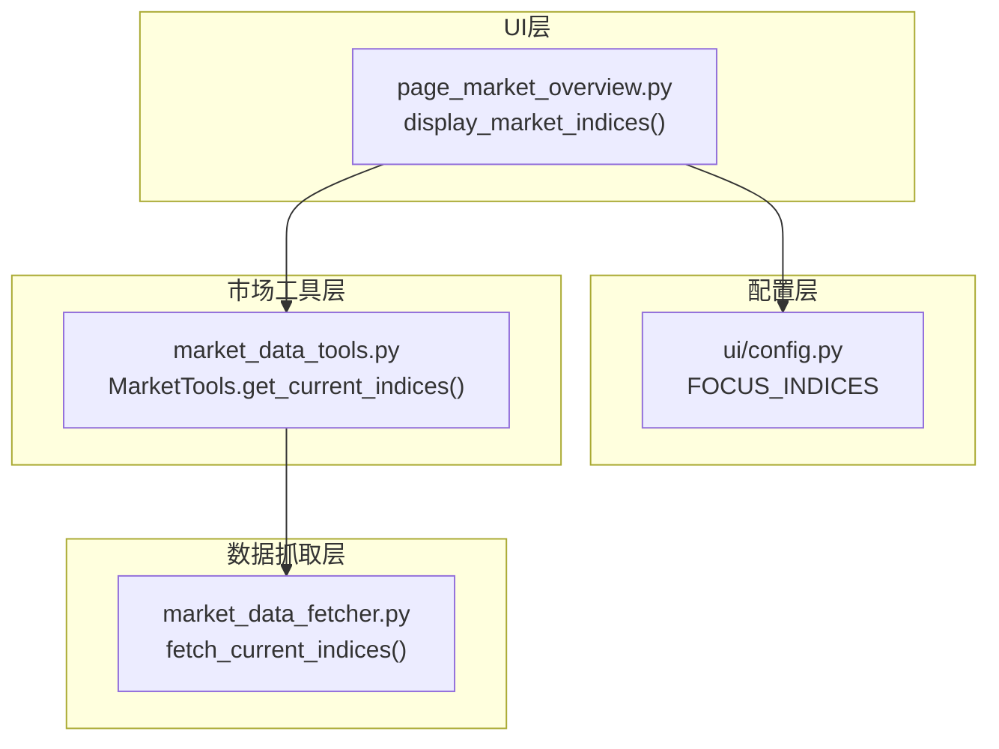
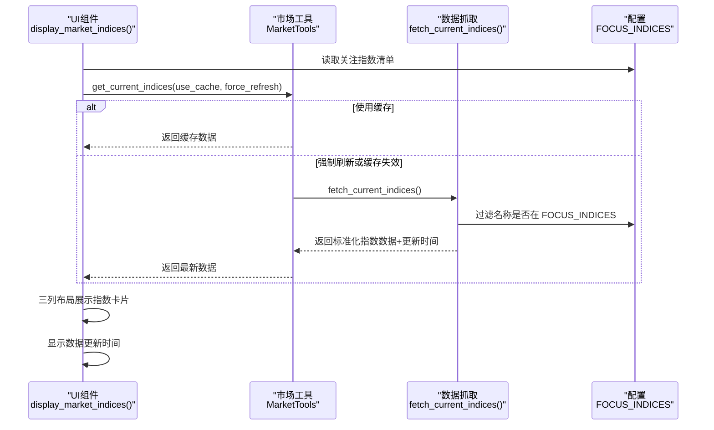
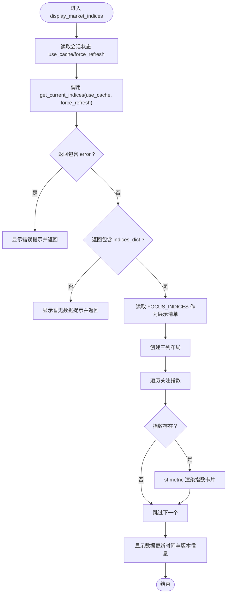
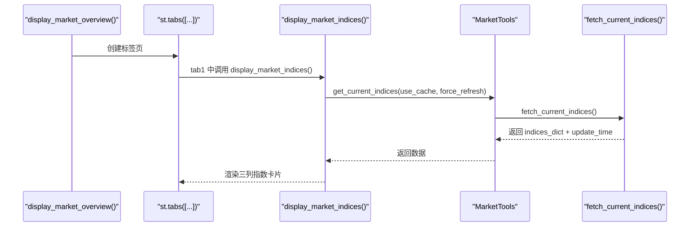
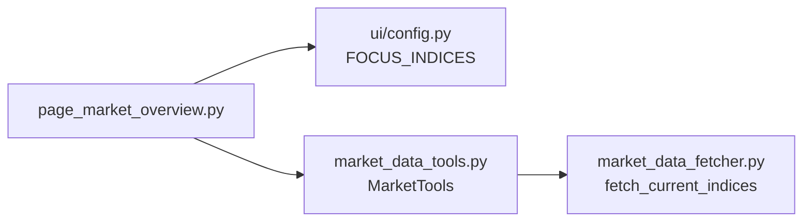

# 大盘指数显示

<cite>
**本文引用的文件**
- [ui/components/page_market_overview.py](file://ui/components/page_market_overview.py)
- [ui/config.py](file://ui/config.py)
- [market/market_data_tools.py](file://market/market_data_tools.py)
- [market/market_data_fetcher.py](file://market/market_data_fetcher.py)
</cite>

## 目录
1. [简介](#简介)
2. [项目结构](#项目结构)
3. [核心组件](#核心组件)
4. [架构总览](#架构总览)
5. [详细组件分析](#详细组件分析)
6. [依赖关系分析](#依赖关系分析)
7. [性能考量](#性能考量)
8. [故障排查指南](#故障排查指南)
9. [结论](#结论)

## 简介
本文件围绕“大盘指数显示”功能展开，重点说明 display_market_indices 函数的实现与集成方式，涵盖以下要点：
- 通过 get_current_indices 获取主要指数（上证指数、深证成指、沪深300、中证500、中证1000、中证2000、北证50、创业板指、科创50）的实时行情数据
- 使用 Streamlit 的三列布局展示指数的当前点位与涨跌幅
- 文档化 FOCUS_INDICES 配置项的作用与影响范围
- 解释数据更新时间的显示逻辑
- 提供该组件在 display_market_overview 主函数中作为标签页集成的使用示例
- 说明错误处理机制与异常捕获策略

## 项目结构
大盘指数显示功能位于 UI 层的市场概览页面组件中，数据获取链路由 UI 调用市场工具层，最终落到数据抓取层。关键文件如下：
- UI 层：ui/components/page_market_overview.py
- 配置层：ui/config.py
- 市场工具层：market/market_data_tools.py
- 数据抓取层：market/market_data_fetcher.py

图表来源
- [ui/components/page_market_overview.py](file://ui/components/page_market_overview.py#L301-L362)
- [ui/config.py](file://ui/config.py#L44-L56)
- [market/market_data_tools.py](file://market/market_data_tools.py#L232-L249)
- [market/market_data_fetcher.py](file://market/market_data_fetcher.py#L286-L355)

章节来源
- [ui/components/page_market_overview.py](file://ui/components/page_market_overview.py#L301-L362)
- [ui/config.py](file://ui/config.py#L44-L56)
- [market/market_data_tools.py](file://market/market_data_tools.py#L232-L249)
- [market/market_data_fetcher.py](file://market/market_data_fetcher.py#L286-L355)

## 核心组件
- display_market_indices：负责渲染大盘指数卡片，读取会话状态控制缓存策略，调用市场工具获取指数数据，并以三列布局展示。
- MarketTools.get_current_indices：封装缓存与网络请求，优先使用缓存；若缓存无效或强制刷新，则调用数据抓取层。
- fetch_current_indices：实际抓取实时指数数据，过滤 FOCUS_INDICES 指定的指数集合，构造标准化数据结构并附带更新时间。
- FOCUS_INDICES：定义“关注指数清单”，决定抓取与展示的指数集合。

章节来源
- [ui/components/page_market_overview.py](file://ui/components/page_market_overview.py#L301-L362)
- [market/market_data_tools.py](file://market/market_data_tools.py#L232-L249)
- [market/market_data_fetcher.py](file://market/market_data_fetcher.py#L286-L355)
- [ui/config.py](file://ui/config.py#L44-L56)

## 架构总览
下图展示了从 UI 到数据抓取的整体调用链与数据流。

图表来源
- [ui/components/page_market_overview.py](file://ui/components/page_market_overview.py#L301-L362)
- [market/market_data_tools.py](file://market/market_data_tools.py#L232-L249)
- [market/market_data_fetcher.py](file://market/market_data_fetcher.py#L286-L355)
- [ui/config.py](file://ui/config.py#L44-L56)

## 详细组件分析

### display_market_indices 函数实现
- 作用：在 UI 中展示主要指数的实时行情卡片，采用三列布局，逐个渲染关注指数。
- 关键流程：
  - 从会话状态读取 use_cache 控制缓存策略，force_refresh 与 use_cache 相反
  - 调用 get_current_indices 获取指数数据
  - 若返回 error 字段，直接提示错误并终止
  - 若 indices_dict 缺失，提示暂无数据并终止
  - 从 FOCUS_INDICES 读取关注指数清单，按顺序分配到三列
  - 对每个指数，计算涨跌差额与涨跌幅的展示文案，使用 st.metric 渲染
  - 最后显示数据更新时间与系统版本信息
- 错误处理：
  - 捕获异常并以错误消息提示
  - 数据抓取层返回 error 或 indices_dict 缺失时，分别给出相应提示

图表来源
- [ui/components/page_market_overview.py](file://ui/components/page_market_overview.py#L301-L362)

章节来源
- [ui/components/page_market_overview.py](file://ui/components/page_market_overview.py#L301-L362)

### MarketTools.get_current_indices 缓存与刷新策略
- 作用：统一管理指数数据的缓存与网络拉取
- 关键行为：
  - 若 use_cache 且未 force_refresh 且缓存有效，直接返回缓存
  - 否则调用 fetch_current_indices 抓取最新数据，成功后写入缓存
  - 发生异常时，若允许使用缓存则回退到缓存，否则返回空字典
- 与 UI 的交互：UI 通过 use_cache/force_refresh 控制该策略

章节来源
- [market/market_data_tools.py](file://market/market_data_tools.py#L232-L249)

### fetch_current_indices 数据抓取与清洗
- 作用：从数据源抓取实时指数行情，过滤 FOCUS_INDICES 指定的指数集合
- 关键行为：
  - 读取“沪深重要指数”数据
  - 遍历每条记录，仅保留名称在 FOCUS_INDICES 的指数
  - 构造标准化字段（代码、名称、当前价、涨跌幅、涨跌额、成交量、成交额、振幅、最高、最低、今开、昨收、量比）
  - 返回 indices_dict、总数、数据源与更新时间
  - 异常时返回 error 与更新时间

章节来源
- [market/market_data_fetcher.py](file://market/market_data_fetcher.py#L286-L355)

### FOCUS_INDICES 配置项
- 定义：ui/config.py 中的 FOCUS_INDICES 列表，包含上证指数、深证成指、沪深300、中证500、中证1000、中证2000、北证50、创业板指、科创50
- 作用：
  - 作为抓取层过滤条件，仅保留清单内的指数
  - 作为 UI 展示清单，决定三列布局中依次渲染的指数顺序
- 影响范围：抓取层与 UI 展示均依赖该配置

章节来源
- [ui/config.py](file://ui/config.py#L44-L56)
- [market/market_data_fetcher.py](file://market/market_data_fetcher.py#L299-L327)
- [ui/components/page_market_overview.py](file://ui/components/page_market_overview.py#L324-L351)

### 数据更新时间显示逻辑
- 抓取层：fetch_current_indices 在成功或失败时都会设置 update_time
- 工具层：get_current_indices 返回的数据中携带 update_time
- UI 展示：display_market_indices 在渲染完成后，使用两列布局显示“数据更新时间”与“系统版本”

章节来源
- [market/market_data_fetcher.py](file://market/market_data_fetcher.py#L328-L355)
- [market/market_data_tools.py](file://market/market_data_tools.py#L232-L249)
- [ui/components/page_market_overview.py](file://ui/components/page_market_overview.py#L353-L359)

### 在 display_market_overview 中作为标签页集成
- 主函数 display_market_overview 提供“大盘指数”“技术指标”“市场基本面”“市场情绪”“市场资讯”“综合摘要”等标签页
- “大盘指数”标签页直接调用 display_market_indices 渲染
- 该集成方式确保指数卡片与其它分析模块在同一页面内协同展示

图表来源
- [ui/components/page_market_overview.py](file://ui/components/page_market_overview.py#L700-L729)
- [ui/components/page_market_overview.py](file://ui/components/page_market_overview.py#L301-L362)
- [market/market_data_tools.py](file://market/market_data_tools.py#L232-L249)
- [market/market_data_fetcher.py](file://market/market_data_fetcher.py#L286-L355)

章节来源
- [ui/components/page_market_overview.py](file://ui/components/page_market_overview.py#L700-L729)
- [ui/components/page_market_overview.py](file://ui/components/page_market_overview.py#L301-L362)

## 依赖关系分析
- UI 组件依赖配置层的 FOCUS_INDICES，用于筛选与展示
- UI 组件通过 MarketTools 封装访问数据抓取层，避免直接耦合底层接口
- MarketTools 内部根据 use_cache/force_refresh 决定是否命中缓存或发起网络请求
- 数据抓取层依赖外部数据源，返回标准化数据结构并附带更新时间

图表来源
- [ui/components/page_market_overview.py](file://ui/components/page_market_overview.py#L301-L362)
- [ui/config.py](file://ui/config.py#L44-L56)
- [market/market_data_tools.py](file://market/market_data_tools.py#L232-L249)
- [market/market_data_fetcher.py](file://market/market_data_fetcher.py#L286-L355)

章节来源
- [ui/components/page_market_overview.py](file://ui/components/page_market_overview.py#L301-L362)
- [ui/config.py](file://ui/config.py#L44-L56)
- [market/market_data_tools.py](file://market/market_data_tools.py#L232-L249)
- [market/market_data_fetcher.py](file://market/market_data_fetcher.py#L286-L355)

## 性能考量
- 缓存优先：默认使用缓存提升响应速度；当用户取消使用缓存时，强制刷新以保证数据时效性
- 三列布局：按关注指数顺序分列渲染，减少 UI 重排成本
- 数据最小化：仅抓取 FOCUS_INDICES 指定的指数，降低网络与解析开销
- 异常降级：抓取失败时回退缓存，避免页面崩溃

[本节为通用指导，无需列出具体文件来源]

## 故障排查指南
- 指数数据为空或抓取失败
  - 检查数据抓取层返回的 error 字段，确认网络与数据源可用性
  - 查看缓存状态，必要时执行“刷新所有缓存”
- UI 未显示数据
  - 确认 indices_dict 是否存在
  - 检查 FOCUS_INDICES 是否包含目标指数名称
- 更新时间未显示
  - 确认返回数据中包含 update_time 字段
  - 检查 UI 展示逻辑是否被提前中断
- 异常导致页面报错
  - 捕获异常并显示错误提示，便于定位问题

章节来源
- [ui/components/page_market_overview.py](file://ui/components/page_market_overview.py#L314-L362)
- [market/market_data_fetcher.py](file://market/market_data_fetcher.py#L346-L355)
- [market/market_data_tools.py](file://market/market_data_tools.py#L232-L249)

## 结论
- display_market_indices 通过清晰的三层架构（UI-工具-抓取）实现指数数据的获取与展示
- FOCUS_INDICES 作为单一事实源，贯穿抓取与展示两端，确保数据范围可控
- 缓存与异常处理机制保障了性能与稳定性
- 在 display_market_overview 中以标签页形式集成，与其他分析模块形成统一视图