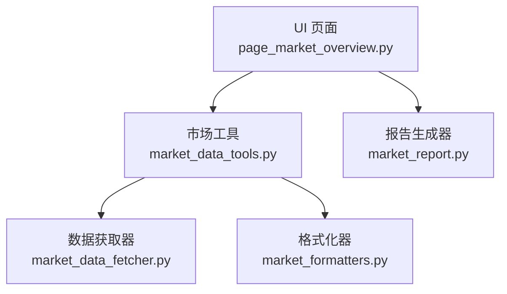
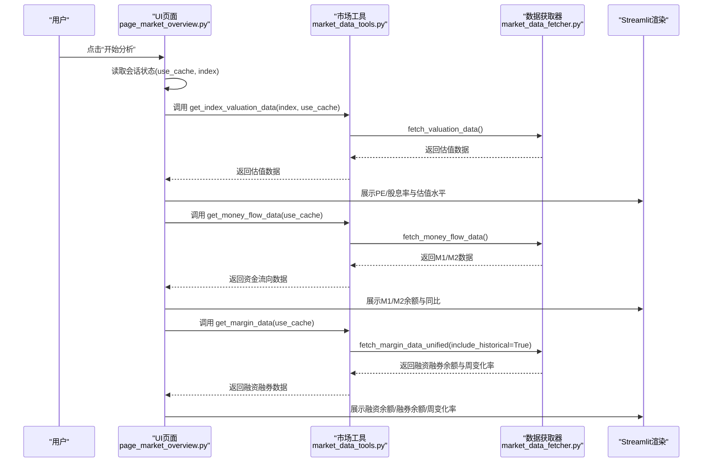
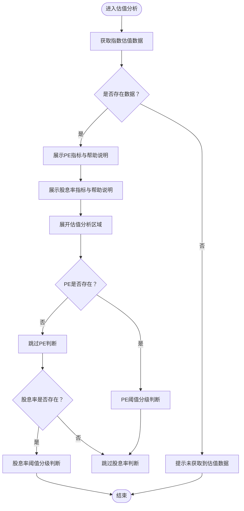
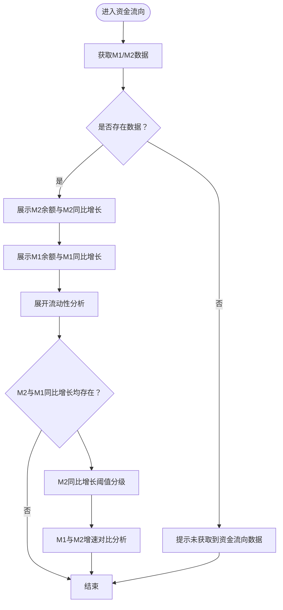
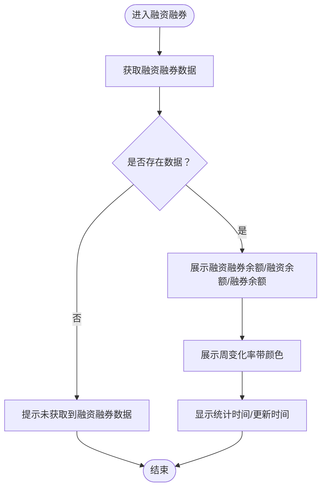
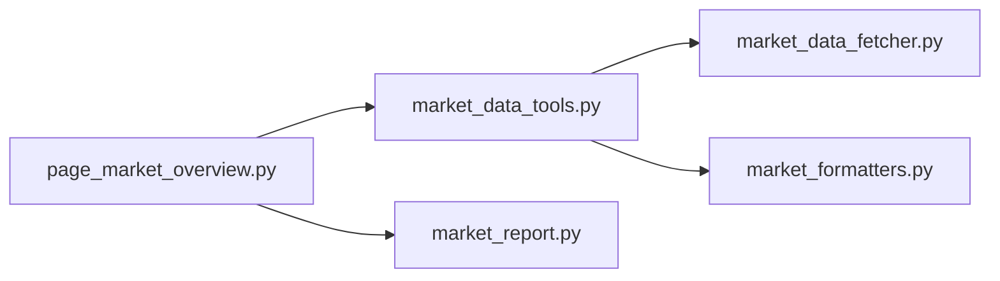

# 市场基本面分析

<cite>
**本文引用的文件**
- [ui/components/page_market_overview.py](file://ui/components/page_market_overview.py)
- [market/market_data_tools.py](file://market/market_data_tools.py)
- [market/market_data_fetcher.py](file://market/market_data_fetcher.py)
- [market/market_formatters.py](file://market/market_formatters.py)
- [market/market_report.py](file://market/market_report.py)
</cite>

## 目录
1. [简介](#简介)
2. [项目结构](#项目结构)
3. [核心组件](#核心组件)
4. [架构总览](#架构总览)
5. [详细组件分析](#详细组件分析)
6. [依赖关系分析](#依赖关系分析)
7. [性能考量](#性能考量)
8. [故障排查指南](#故障排查指南)
9. [结论](#结论)

## 简介
本文件面向“市场基本面分析”功能，聚焦于Streamlit页面中的“市场基本面分析”区域，系统化说明以下三类子模块的协同机制与展示逻辑：
- 估值分析：PE与股息率的显示与估值水平判断规则
- 资金流向：M1/M2货币供应量的展示与流动性分析
- 融资融券：融资融券余额与周变化率的呈现方式

同时阐明这些数据如何通过统一的市场工具层从数据源获取，并在Streamlit中进行格式化与可视化展示。

## 项目结构
该功能位于UI层的“大盘整体分析页面”，通过统一的市场工具类聚合数据源，再由格式化器生成报告文本，最终在Streamlit中渲染。

图表来源
- [ui/components/page_market_overview.py](file://ui/components/page_market_overview.py#L221-L231)
- [market/market_data_tools.py](file://market/market_data_tools.py#L1-L120)
- [market/market_data_fetcher.py](file://market/market_data_fetcher.py#L248-L447)
- [market/market_formatters.py](file://market/market_formatters.py#L370-L512)
- [market/market_report.py](file://market/market_report.py#L13-L74)

章节来源
- [ui/components/page_market_overview.py](file://ui/components/page_market_overview.py#L221-L231)
- [market/market_data_tools.py](file://market/market_data_tools.py#L1-L120)

## 核心组件
- UI页面函数：负责组织三大子模块的展示顺序与交互开关（缓存开关、刷新按钮等）
- 市场工具类：封装数据获取、缓存策略与综合报告生成
- 数据获取器：对接AkShare等外部数据源，抓取估值、资金流向、融资融券等指标
- 格式化器：提供Markdown格式化能力，用于报告与页面展示

章节来源
- [ui/components/page_market_overview.py](file://ui/components/page_market_overview.py#L221-L231)
- [market/market_data_tools.py](file://market/market_data_tools.py#L67-L120)
- [market/market_data_fetcher.py](file://market/market_data_fetcher.py#L248-L447)
- [market/market_formatters.py](file://market/market_formatters.py#L370-L512)

## 架构总览
下图展示了“市场基本面分析”在UI层的调用链路与数据流：

图表来源
- [ui/components/page_market_overview.py](file://ui/components/page_market_overview.py#L221-L231)
- [market/market_data_tools.py](file://market/market_data_tools.py#L67-L120)
- [market/market_data_fetcher.py](file://market/market_data_fetcher.py#L248-L447)

## 详细组件分析

### 1) display_market_fundamentals 协调机制
- 入口函数：在UI页面中定义，按顺序调用三个子模块函数，形成“估值—资金流向—融资融券”的展示序列。
- 控制开关：从会话状态读取缓存开关，影响后续数据获取是否走缓存。
- 作用：作为页面骨架，串联三大模块，确保数据获取与展示的顺序一致性。

章节来源
- [ui/components/page_market_overview.py](file://ui/components/page_market_overview.py#L221-L231)

### 2) display_valuation_analysis（估值分析）
- 数据来源：通过市场工具类获取指数估值数据；若目标指数无直接估值，会回退到参考指数（如沪深300）的估值数据。
- 显示逻辑：
  - PE：按指数名称动态命名指标标题，并在帮助提示中说明数据来源（直接估值或参考）。
  - 股息率：同样按指数名称命名，帮助提示说明数据来源。
  - 估值水平判断：
    - PE阈值：小于12为“极低估”，12~15为“低估”，15~18为“合理”，18~25为“偏高”，≥25为“高估”。
    - 股息率阈值：大于3为“高股息”，2~3为“中等股息”，≤2为“低股息”。
- 时间戳：显示估值数据的更新时间或日期字段。

图表来源
- [ui/components/page_market_overview.py](file://ui/components/page_market_overview.py#L22-L104)
- [market/market_data_tools.py](file://market/market_data_tools.py#L85-L194)

章节来源
- [ui/components/page_market_overview.py](file://ui/components/page_market_overview.py#L22-L104)
- [market/market_data_tools.py](file://market/market_data_tools.py#L85-L194)

### 3) display_money_flow_analysis（资金流向）
- 数据来源：通过市场工具类获取货币供应量数据，包含M2与M1的余额与同比增长。
- 显示逻辑：
  - M2余额与M2同比增长：分别以“万亿”单位展示。
  - M1余额与M1同比增长：分别以“万亿”单位展示。
  - 流动性分析：
    - M2同比增长阈值：>10为“流动性充裕”，>8为“流动性正常”，否则为“流动性偏紧”。
    - M1增速与M2增速对比：M1>M2表示“资金活跃度较高”，否则为“一般”。

图表来源
- [ui/components/page_market_overview.py](file://ui/components/page_market_overview.py#L106-L149)
- [market/market_data_fetcher.py](file://market/market_data_fetcher.py#L248-L283)
- [market/market_data_tools.py](file://market/market_data_tools.py#L196-L231)

章节来源
- [ui/components/page_market_overview.py](file://ui/components/page_market_overview.py#L106-L149)
- [market/market_data_fetcher.py](file://market/market_data_fetcher.py#L248-L283)
- [market/market_data_tools.py](file://market/market_data_tools.py#L196-L231)

### 4) display_margin_trading_analysis（融资融券）
- 数据来源：通过市场工具类获取融资融券数据，内部会合并上交所与深交所数据，并在开启历史时计算周变化率。
- 显示逻辑：
  - 三列布局：融资融券余额、融资余额、融券余额，使用大数格式化函数进行展示。
  - 周变化率：根据正负值设置不同颜色；若为None则显示“N/A”。
  - 时间戳：显示统计时间或更新时间。

图表来源
- [ui/components/page_market_overview.py](file://ui/components/page_market_overview.py#L180-L218)
- [market/market_data_fetcher.py](file://market/market_data_fetcher.py#L359-L449)
- [market/market_data_tools.py](file://market/market_data_tools.py#L214-L231)

章节来源
- [ui/components/page_market_overview.py](file://ui/components/page_market_overview.py#L180-L218)
- [market/market_data_fetcher.py](file://market/market_data_fetcher.py#L359-L449)
- [market/market_data_tools.py](file://market/market_data_tools.py#L214-L231)

### 5) 数据获取与缓存策略
- 统一入口：MarketTools类封装了估值、资金流向、融资融券、指数实时、技术指标等数据获取方法，并内置缓存校验与保存逻辑。
- 缓存开关：每个获取方法支持use_cache与force_refresh参数，配合UI层的会话状态实现灵活切换。
- 综合报告：get_comprehensive_market_report一次性拉取技术指标、市场情绪、估值、资金流向、融资融券、市场新闻等，供报告生成与页面展示复用。

章节来源
- [market/market_data_tools.py](file://market/market_data_tools.py#L67-L120)
- [market/market_data_tools.py](file://market/market_data_tools.py#L421-L454)

### 6) 在Streamlit中的格式化与展示
- UI层：通过st.metric、st.columns、st.expander等组件实现指标卡片、分栏布局与折叠展开。
- 时间戳：在每个模块末尾显示数据更新时间或统计时间，增强透明度。
- 报告生成：market_report模块复用MarketTools的综合数据，借助MarketTextFormatter生成Markdown报告，支持PDF/DOCX/HTML/Markdown导出。

章节来源
- [ui/components/page_market_overview.py](file://ui/components/page_market_overview.py#L22-L104)
- [ui/components/page_market_overview.py](file://ui/components/page_market_overview.py#L106-L149)
- [ui/components/page_market_overview.py](file://ui/components/page_market_overview.py#L180-L218)
- [market/market_report.py](file://market/market_report.py#L13-L74)
- [market/market_formatters.py](file://market/market_formatters.py#L370-L512)

## 依赖关系分析

图表来源
- [ui/components/page_market_overview.py](file://ui/components/page_market_overview.py#L221-L231)
- [market/market_data_tools.py](file://market/market_data_tools.py#L1-L120)
- [market/market_data_fetcher.py](file://market/market_data_fetcher.py#L248-L447)
- [market/market_formatters.py](file://market/market_formatters.py#L370-L512)
- [market/market_report.py](file://market/market_report.py#L13-L74)

章节来源
- [ui/components/page_market_overview.py](file://ui/components/page_market_overview.py#L221-L231)
- [market/market_data_tools.py](file://market/market_data_tools.py#L1-L120)
- [market/market_data_fetcher.py](file://market/market_data_fetcher.py#L248-L447)
- [market/market_formatters.py](file://market/market_formatters.py#L370-L512)
- [market/market_report.py](file://market/market_report.py#L13-L74)

## 性能考量
- 缓存优先：MarketTools在每次获取数据前先检查缓存有效性，减少网络请求与解析成本。
- 批量获取：get_comprehensive_market_report一次性拉取多类数据，避免重复请求。
- 数据转换：在获取技术指标时对numpy类型进行递归转换，保证JSON序列化稳定。
- UI渲染：使用st.metric与st.columns等轻量组件，避免重型图表渲染带来的延迟。

章节来源
- [market/market_data_tools.py](file://market/market_data_tools.py#L67-L120)
- [market/market_data_tools.py](file://market/market_data_tools.py#L283-L306)
- [market/market_data_tools.py](file://market/market_data_tools.py#L362-L378)

## 故障排查指南
- 未获取到数据：
  - 检查网络连通性与AkShare数据源可用性。
  - 切换“使用缓存数据”开关，确认缓存是否有效。
  - 使用“刷新数据”按钮清空缓存并强制获取最新数据。
- 数据为空或字段缺失：
  - 对应模块会显示“未获取到...数据”的提示；检查数据源接口返回结构与字段映射。
- 版本与依赖：
  - 确保第三方库（如AkShare）版本满足要求，避免字段名或返回结构变更导致解析异常。

章节来源
- [ui/components/page_market_overview.py](file://ui/components/page_market_overview.py#L662-L700)
- [ui/components/page_market_overview.py](file://ui/components/page_market_overview.py#L106-L149)
- [ui/components/page_market_overview.py](file://ui/components/page_market_overview.py#L180-L218)

## 结论
“市场基本面分析”通过UI层的协调与市场工具层的统一数据获取，实现了估值、资金流向与融资融券三大维度的高效整合与直观展示。其阈值判断规则清晰、缓存策略稳健、展示组件简洁，既满足日常快速浏览，又可通过综合报告与导出功能支撑深度分析。