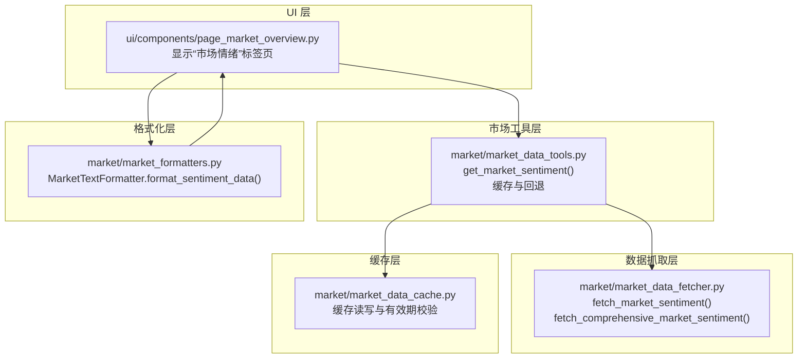
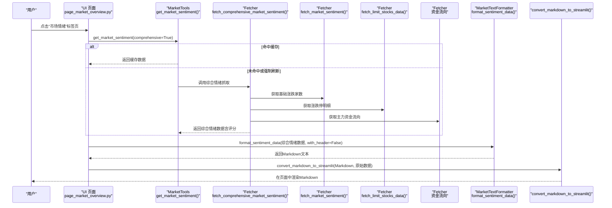
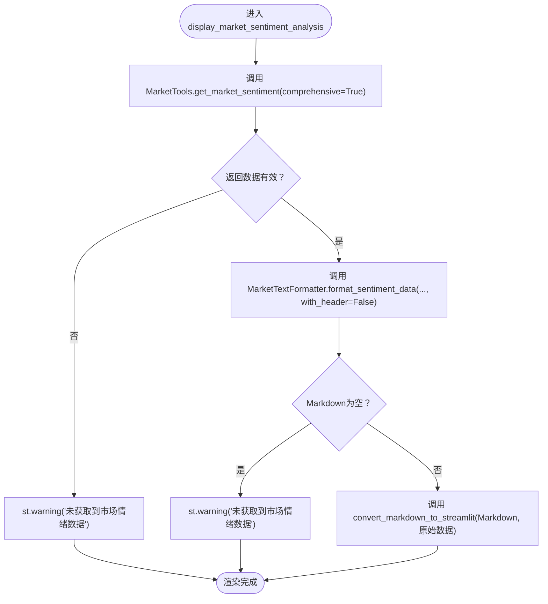
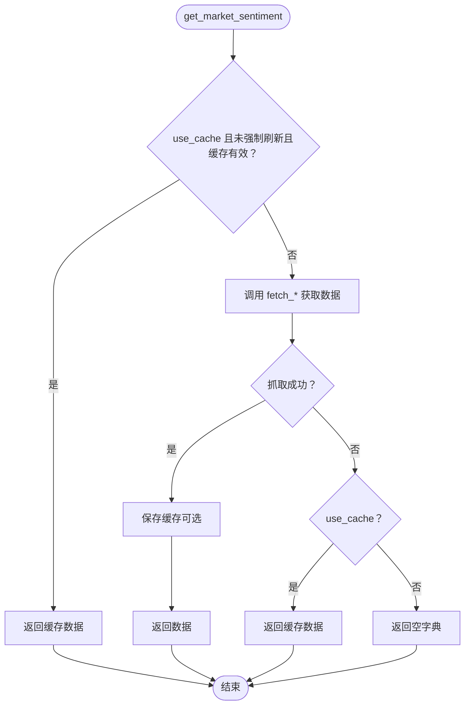
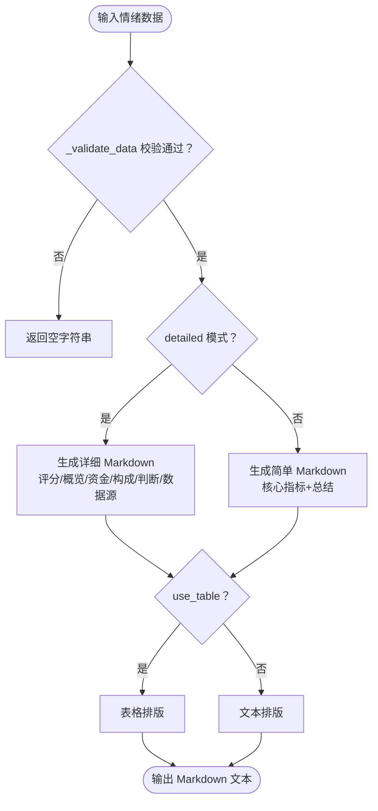
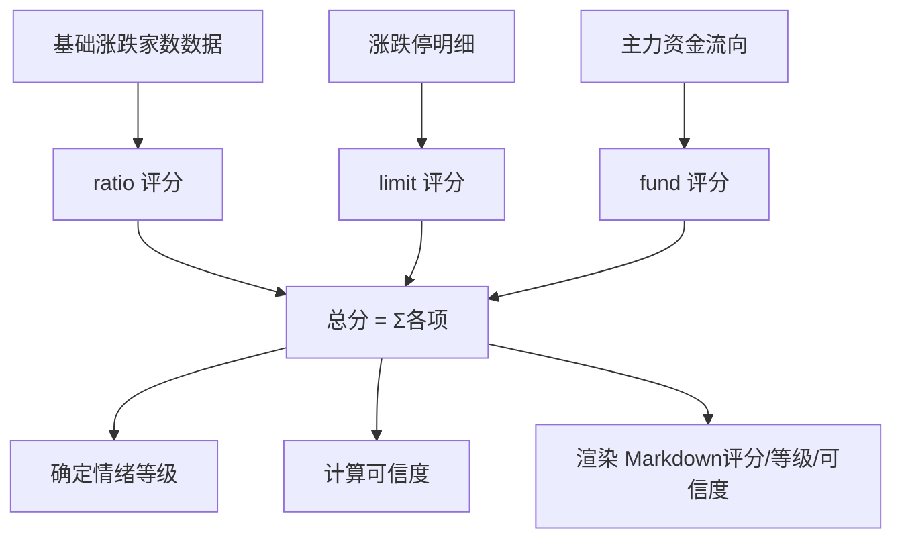
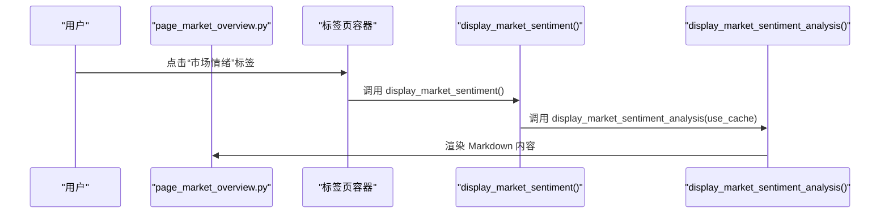
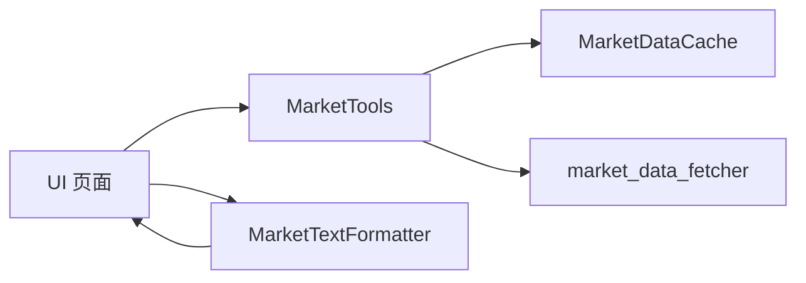

# 市场情绪分析

<cite>
**本文引用的文件**
- [ui/components/page_market_overview.py](file://ui/components/page_market_overview.py)
- [market/market_data_tools.py](file://market/market_data_tools.py)
- [market/market_data_fetcher.py](file://market/market_data_fetcher.py)
- [market/market_formatters.py](file://market/market_formatters.py)
- [market/market_data_cache.py](file://market/market_data_cache.py)
- [tests/unit/ui/test_page_market_overview.py](file://tests/unit/ui/test_page_market_overview.py)
</cite>

## 目录
1. [简介](#简介)
2. [项目结构](#项目结构)
3. [核心组件](#核心组件)
4. [架构总览](#架构总览)
5. [详细组件分析](#详细组件分析)
6. [依赖关系分析](#依赖关系分析)
7. [性能考量](#性能考量)
8. [故障排查指南](#故障排查指南)
9. [结论](#结论)
10. [附录](#附录)

## 简介
本文件面向“市场情绪分析”功能，聚焦两个关键函数的协作机制：
- display_market_sentiment_analysis：在大盘分析界面中触发并展示市场情绪分析结果。
- convert_markdown_to_streamlit：将由 MarketTextFormatter 生成的 Markdown 文本渲染为 Streamlit 页面内容。

同时，文档化了情绪评分的生成与展示逻辑、错误处理流程，以及该功能在大盘分析界面“市场情绪”标签页中的集成方式。

## 项目结构
围绕市场情绪分析的关键文件组织如下：
- UI 层：负责页面布局、标签页、交互与渲染
- 市场工具层：封装数据获取、缓存与错误回退
- 数据抓取层：对接第三方数据源，聚合基础与综合情绪指标
- 格式化层：统一将情绪数据转为 Markdown 文本
- 缓存层：管理各类市场数据的缓存生命周期

**图表来源**
- [ui/components/page_market_overview.py](file://ui/components/page_market_overview.py#L152-L178)
- [market/market_data_tools.py](file://market/market_data_tools.py#L39-L66)
- [market/market_data_fetcher.py](file://market/market_data_fetcher.py#L24-L135)
- [market/market_formatters.py](file://market/market_formatters.py#L106-L368)
- [market/market_data_cache.py](file://market/market_data_cache.py#L132-L141)

**章节来源**
- [ui/components/page_market_overview.py](file://ui/components/page_market_overview.py#L152-L178)
- [market/market_data_tools.py](file://market/market_data_tools.py#L39-L66)
- [market/market_data_fetcher.py](file://market/market_data_fetcher.py#L24-L135)
- [market/market_formatters.py](file://market/market_formatters.py#L106-L368)
- [market/market_data_cache.py](file://market/market_data_cache.py#L132-L141)

## 核心组件
- display_market_sentiment_analysis：从 MarketTools 获取综合市场情绪数据，调用 MarketTextFormatter 生成 Markdown，再交给 convert_markdown_to_streamlit 渲染。
- convert_markdown_to_streamlit：接收 Markdown 字符串与原始情绪数据，若为空则提示“未获取到市场情绪数据”，否则直接渲染。
- MarketTextFormatter.format_sentiment_data：将情绪数据结构化为 Markdown，支持详细/简单两种模式、表格/文本两种排版、带/不带头部两种风格。
- MarketTools.get_market_sentiment：统一入口，支持缓存命中、强制刷新、综合情绪分析开关；异常时回退到缓存或空字典。
- market_data_fetcher：提供基础与综合情绪数据抓取，包含多数据源回退策略与评分计算。

**章节来源**
- [ui/components/page_market_overview.py](file://ui/components/page_market_overview.py#L152-L178)
- [market/market_formatters.py](file://market/market_formatters.py#L106-L368)
- [market/market_data_tools.py](file://market/market_data_tools.py#L39-L66)
- [market/market_data_fetcher.py](file://market/market_data_fetcher.py#L24-L135)

## 架构总览
下图展示了从 UI 触发到最终渲染的端到端流程，以及情绪评分的生成路径。

**图表来源**
- [ui/components/page_market_overview.py](file://ui/components/page_market_overview.py#L152-L178)
- [market/market_data_tools.py](file://market/market_data_tools.py#L39-L66)
- [market/market_data_fetcher.py](file://market/market_data_fetcher.py#L463-L566)
- [market/market_formatters.py](file://market/market_formatters.py#L106-L368)

## 详细组件分析

### 组件A：display_market_sentiment_analysis 与 convert_markdown_to_streamlit 的协作
- 调用链路
  - UI 层调用 MarketTools.get_market_sentiment(comprehensive=True) 获取综合情绪数据。
  - 若返回数据有效，调用 MarketTextFormatter.format_sentiment_data(...) 生成 Markdown 文本。
  - 最终调用 convert_markdown_to_streamlit(...) 将 Markdown 渲染到页面。
- 错误处理
  - 若 get_market_sentiment 返回空或包含 error 字段，UI 层直接提示“未获取到市场情绪数据”。
  - format_sentiment_data 内部通过 _validate_data 对输入进行校验，若无效则返回空字符串，convert_markdown_to_streamlit 再次进行空值提示。
- 展示细节
  - format_sentiment_data 支持 detailed/use_table/with_header 参数，UI 层传入 with_header=False 以避免重复标题。
  - convert_markdown_to_streamlit 仅做空值校验与直接渲染，不改变 Markdown 内容。

**图表来源**
- [ui/components/page_market_overview.py](file://ui/components/page_market_overview.py#L152-L178)
- [market/market_formatters.py](file://market/market_formatters.py#L106-L120)

**章节来源**
- [ui/components/page_market_overview.py](file://ui/components/page_market_overview.py#L152-L178)
- [market/market_formatters.py](file://market/market_formatters.py#L106-L120)

### 组件B：get_market_sentiment 的数据获取与回退机制
- 缓存策略
  - 支持 use_cache/force_refresh/comprehensive 三个参数。
  - 若 use_cache 且未强制刷新，且缓存有效，则直接返回缓存数据。
  - 若抓取成功且 use_cache，则保存到缓存。
- 回退策略
  - 抓取异常时，若 use_cache 则返回缓存数据，否则返回空字典。
- 综合情绪数据
  - comprehensive=True 时，调用 fetch_comprehensive_market_sentiment，内部会：
    - 获取基础涨跌家数（fetch_market_sentiment）
    - 获取涨跌停明细（fetch_limit_stocks_data）
    - 获取主力资金流向（资金流接口）
    - 计算综合情绪评分、情绪等级与可信度

**图表来源**
- [market/market_data_tools.py](file://market/market_data_tools.py#L39-L66)

**章节来源**
- [market/market_data_tools.py](file://market/market_data_tools.py#L39-L66)

### 组件C：MarketTextFormatter.format_sentiment_data 的格式化逻辑
- 输入形态
  - 支持两种形态：
    - 基础情绪数据（basic_sentiment 字段）
    - 综合情绪数据（包含 sentiment_score/sentiment_level/confidence/score_components 等）
- 输出形态
  - Markdown 文本，支持：
    - 详细模式：包含评分、涨跌家数概览、资金流向、评分构成分析、总体情绪判断、数据源信息等
    - 简单模式：仅核心指标与总结
    - 表格/文本两种排版
    - 带/不带头部两种风格
- 校验与空值处理
  - 内部通过 _validate_data 对输入进行校验，若无效返回空字符串，避免渲染空内容。

**图表来源**
- [market/market_formatters.py](file://market/market_formatters.py#L106-L368)

**章节来源**
- [market/market_formatters.py](file://market/market_formatters.py#L106-L368)

### 组件D：情绪评分的生成与展示
- 评分来源与构成
  - 基于涨跌比例（ratio）：以 0.5 为中性，映射到约 ±40 分
  - 基于涨跌停比例（limit）：以总股本为分母，放大 1000 倍，限制在 ±20 分
  - 基于主力资金流向（fund）：以主力净流入占比为依据，限制在 ±40 分
  - 总分 = 各项之和，情绪等级根据总分区间判定，可信度由数据源数量与质量决定
- 展示逻辑
  - UI 层通过 MarketTextFormatter.format_sentiment_data 生成 Markdown，convert_markdown_to_streamlit 渲染
  - UI 层还可在“综合评级”模块中复用 sentiment_score 进行额外评分

**图表来源**
- [market/market_data_fetcher.py](file://market/market_data_fetcher.py#L463-L566)
- [market/market_formatters.py](file://market/market_formatters.py#L248-L320)

**章节来源**
- [market/market_data_fetcher.py](file://market/market_data_fetcher.py#L463-L566)
- [market/market_formatters.py](file://market/market_formatters.py#L248-L320)

### 组件E：在大盘分析界面中的标签页集成
- 标签页创建
  - UI 层根据配置动态创建标签页，包含“市场情绪”标签页。
- 页面渲染
  - 点击“市场情绪”标签页时，调用 display_market_sentiment()，进而调用 display_market_sentiment_analysis(use_cache)。
- 与“综合评级”的联动
  - UI 层在“综合摘要”区域会读取 sentiment_score 并生成综合评级卡片，体现情绪面的权重。

**图表来源**
- [ui/components/page_market_overview.py](file://ui/components/page_market_overview.py#L700-L729)
- [ui/components/page_market_overview.py](file://ui/components/page_market_overview.py#L233-L241)
- [ui/components/page_market_overview.py](file://ui/components/page_market_overview.py#L162-L178)

**章节来源**
- [ui/components/page_market_overview.py](file://ui/components/page_market_overview.py#L700-L729)
- [ui/components/page_market_overview.py](file://ui/components/page_market_overview.py#L233-L241)
- [ui/components/page_market_overview.py](file://ui/components/page_market_overview.py#L162-L178)

## 依赖关系分析
- UI 依赖 MarketTools 提供统一数据入口，MarketTools 再依赖 market_data_fetcher 完成抓取，并通过 market_data_cache 管理缓存。
- MarketTextFormatter 仅依赖输入数据与格式化工具，不直接访问网络。
- 错误处理贯穿 UI、MarketTools、Fetcher 三层：UI 层负责提示，MarketTools 层负责缓存回退，Fetcher 层负责多数据源回退。

**图表来源**
- [ui/components/page_market_overview.py](file://ui/components/page_market_overview.py#L152-L178)
- [market/market_data_tools.py](file://market/market_data_tools.py#L39-L66)
- [market/market_data_fetcher.py](file://market/market_data_fetcher.py#L24-L135)
- [market/market_formatters.py](file://market/market_formatters.py#L106-L368)
- [market/market_data_cache.py](file://market/market_data_cache.py#L132-L141)

**章节来源**
- [ui/components/page_market_overview.py](file://ui/components/page_market_overview.py#L152-L178)
- [market/market_data_tools.py](file://market/market_data_tools.py#L39-L66)
- [market/market_data_fetcher.py](file://market/market_data_fetcher.py#L24-L135)
- [market/market_formatters.py](file://market/market_formatters.py#L106-L368)
- [market/market_data_cache.py](file://market/market_data_cache.py#L132-L141)

## 性能考量
- 缓存命中优先：MarketTools.get_market_sentiment 在 use_cache 且未强制刷新时直接返回缓存，显著降低网络请求与格式化成本。
- 多数据源回退：Fetcher 层在基础数据失败时自动尝试备用方案，减少整体失败概率。
- 评分计算本地化：MarketTextFormatter 不发起网络请求，仅对已有数据进行格式化，避免额外延迟。
- UI 渲染轻量化：convert_markdown_to_streamlit 仅做空值校验与渲染，复杂度低。

[本节为通用指导，无需具体文件引用]

## 故障排查指南
- 现象：页面提示“未获取到市场情绪数据”
  - 可能原因
    - MarketTools.get_market_sentiment 返回空或包含 error 字段
    - MarketTextFormatter.format_sentiment_data 输入无效，返回空字符串
    - convert_markdown_to_streamlit 接收到空 Markdown
  - 排查步骤
    - 检查 MarketTools.get_market_sentiment 的 use_cache/force_refresh 设置
    - 查看缓存状态：MarketDataCache.get_cache_status()
    - 检查 market_data_fetcher 的抓取日志与异常栈
    - 确认 UI 层是否正确传递 with_header=False
- 缓存问题
  - 使用 MarketDataCache.clear_cache(data_type='comprehensive_sentiment') 清理综合情绪缓存，或执行 MarketTools.refresh_all_cache() 刷新全部缓存
- 数据源异常
  - market_data_fetcher 内置多数据源回退策略，若仍失败，检查网络与第三方接口可用性

**章节来源**
- [market/market_data_tools.py](file://market/market_data_tools.py#L39-L66)
- [market/market_data_cache.py](file://market/market_data_cache.py#L296-L388)
- [market/market_data_fetcher.py](file://market/market_data_fetcher.py#L24-L135)
- [ui/components/page_market_overview.py](file://ui/components/page_market_overview.py#L152-L178)

## 结论
- display_market_sentiment_analysis 与 convert_markdown_to_streamlit 形成清晰的职责边界：前者负责数据与格式化，后者负责渲染。
- MarketTextFormatter.format_sentiment_data 提供灵活的输出形态，满足不同场景下的展示需求。
- get_market_sentiment 通过缓存与多数据源回退保障稳定性，配合 MarketDataCache 的生命周期管理，提升整体性能与可靠性。
- 在大盘分析界面中，“市场情绪”标签页与“综合摘要/综合评级”形成互补，既提供即时情绪洞察，又通过评分体系辅助决策。

[本节为总结性内容，无需具体文件引用]

## 附录
- 关键函数路径
  - [display_market_sentiment_analysis](file://ui/components/page_market_overview.py#L162-L178)
  - [convert_markdown_to_streamlit](file://ui/components/page_market_overview.py#L152-L159)
  - [MarketTextFormatter.format_sentiment_data](file://market/market_formatters.py#L106-L368)
  - [MarketTools.get_market_sentiment](file://market/market_data_tools.py#L39-L66)
  - [fetch_comprehensive_market_sentiment](file://market/market_data_fetcher.py#L463-L566)
  - [fetch_market_sentiment](file://market/market_data_fetcher.py#L24-L135)
- 单元测试参考
  - [tests/unit/ui/test_page_market_overview.py](file://tests/unit/ui/test_page_market_overview.py#L225-L285)