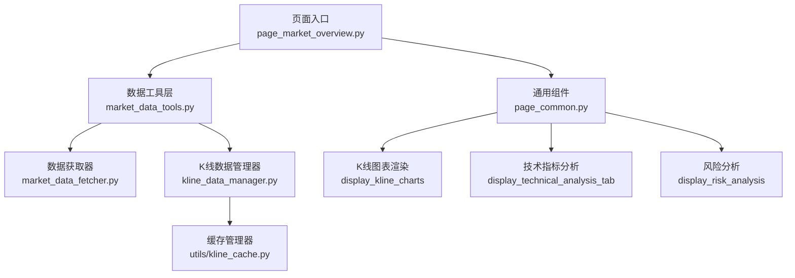
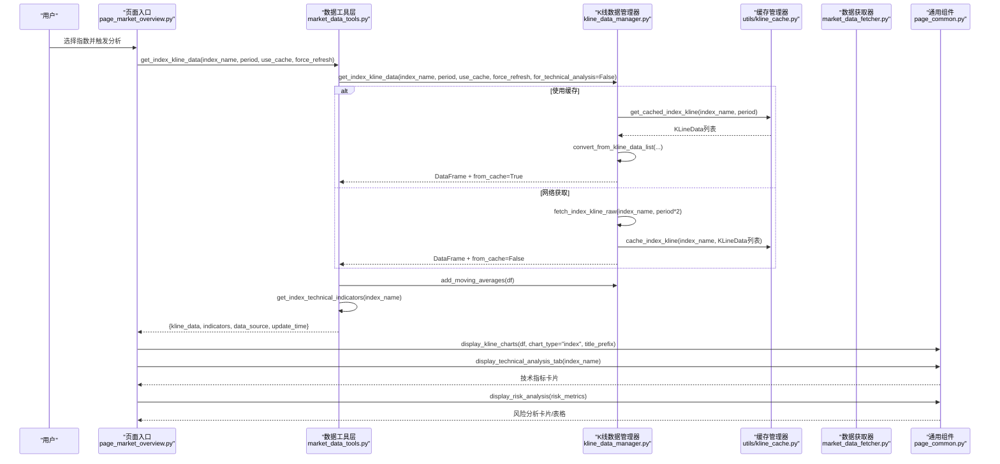
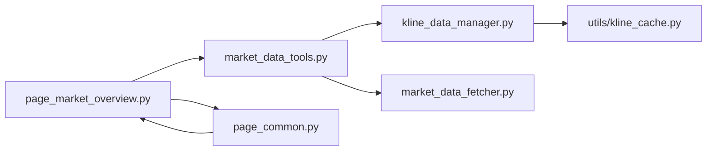
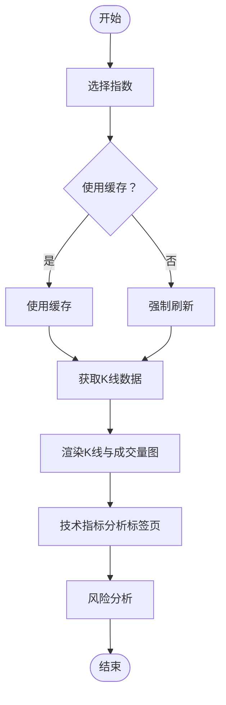

# 市场技术分析

<cite>
**本文引用的文件**
- [ui/components/page_market_overview.py](file://ui/components/page_market_overview.py)
- [ui/components/page_common.py](file://ui/components/page_common.py)
- [market/market_data_tools.py](file://market/market_data_tools.py)
- [market/market_data_fetcher.py](file://market/market_data_fetcher.py)
- [market/kline_data_manager.py](file://market/kline_data_manager.py)
- [utils/kline_cache.py](file://utils/kline_cache.py)
- [ui/config.py](file://ui/config.py)
</cite>

## 目录
1. [简介](#简介)
2. [项目结构](#项目结构)
3. [核心组件](#核心组件)
4. [架构总览](#架构总览)
5. [详细组件分析](#详细组件分析)
6. [依赖关系分析](#依赖关系分析)
7. [性能考量](#性能考量)
8. [故障排查指南](#故障排查指南)
9. [结论](#结论)
10. [附录](#附录)

## 简介
本文件围绕“市场技术分析”功能展开，重点说明如何通过页面入口函数展示指定指数的K线走势，并调用通用图表渲染函数绘制K线与成交量，同时集成技术指标分析标签页与风险分析模块。文档还阐述了K线数据来源、缓存与更新策略、错误处理机制，以及与大盘分析主界面的完整调用流程。

## 项目结构
- 页面入口位于大盘分析页面，负责组织标签页与数据流。
- 技术分析与风险分析由通用组件提供，支持股票与指数两种场景。
- 指数K线数据通过统一的数据工具层获取，底层依赖K线数据管理器与缓存系统。

图表来源
- [ui/components/page_market_overview.py](file://ui/components/page_market_overview.py#L537-L597)
- [market/market_data_tools.py](file://market/market_data_tools.py#L307-L350)
- [market/market_data_fetcher.py](file://market/market_data_fetcher.py#L568-L607)
- [market/kline_data_manager.py](file://market/kline_data_manager.py#L152-L200)
- [utils/kline_cache.py](file://utils/kline_cache.py#L400-L418)
- [ui/components/page_common.py](file://ui/components/page_common.py#L192-L291)

章节来源
- [ui/components/page_market_overview.py](file://ui/components/page_market_overview.py#L537-L597)
- [ui/components/page_common.py](file://ui/components/page_common.py#L166-L291)
- [market/market_data_tools.py](file://market/market_data_tools.py#L307-L350)
- [market/market_data_fetcher.py](file://market/market_data_fetcher.py#L568-L607)
- [market/kline_data_manager.py](file://market/kline_data_manager.py#L152-L200)
- [utils/kline_cache.py](file://utils/kline_cache.py#L400-L418)

## 核心组件
- 页面入口函数：负责接收指数名、缓存与刷新策略，调用数据工具层获取K线与技术指标，并渲染K线图与技术分析标签页。
- 通用组件：
  - 技术指标分析标签页：按股票/指数两类场景分别获取K线与技术指标，统一展示。
  - 风险分析：接收风险指标字典，支持Markdown格式化与表格展示。
  - K线图表渲染：统一绘制K线蜡烛图与均线、成交量图。
- 数据工具层：封装指数K线数据获取、技术指标获取、缓存与刷新逻辑。
- 数据获取器：面向指数的技术指标计算与风险指标附加。
- K线数据管理器：统一从第三方接口抓取、转换、缓存与返回K线数据。
- 缓存管理器：基于CSV的指数K线缓存，支持智能过期与增量更新。

章节来源
- [ui/components/page_market_overview.py](file://ui/components/page_market_overview.py#L537-L597)
- [ui/components/page_common.py](file://ui/components/page_common.py#L166-L291)
- [market/market_data_tools.py](file://market/market_data_tools.py#L307-L350)
- [market/market_data_fetcher.py](file://market/market_data_fetcher.py#L568-L607)
- [market/kline_data_manager.py](file://market/kline_data_manager.py#L152-L200)
- [utils/kline_cache.py](file://utils/kline_cache.py#L400-L418)

## 架构总览
下图展示了从页面入口到图表渲染的完整调用链路，以及技术指标与风险分析的集成位置。

图表来源
- [ui/components/page_market_overview.py](file://ui/components/page_market_overview.py#L537-L597)
- [market/market_data_tools.py](file://market/market_data_tools.py#L307-L350)
- [market/kline_data_manager.py](file://market/kline_data_manager.py#L152-L200)
- [utils/kline_cache.py](file://utils/kline_cache.py#L400-L418)
- [ui/components/page_common.py](file://ui/components/page_common.py#L192-L291)

## 详细组件分析

### 页面入口函数：display_market_technical_analysis
- 输入：指数名称（如“上证指数”），默认周期160。
- 控制流：
  - 读取会话状态中的缓存开关与强制刷新标志。
  - 调用数据工具层获取指数K线数据（包含K线记录、技术指标、数据来源与更新时间）。
  - 若返回错误，显示错误提示；否则将K线记录转为DataFrame并调用通用组件渲染K线与成交量图。
  - 在同一标签页内继续调用技术指标分析标签页与风险分析模块。
- 输出：页面显示K线图、技术指标卡片、风险分析卡片。

章节来源
- [ui/components/page_market_overview.py](file://ui/components/page_market_overview.py#L537-L597)

### 通用组件：display_kline_charts
- 功能：统一绘制K线蜡烛图与均线、成交量图。
- 数据要求：DataFrame需包含日期、开盘、最高、最低、收盘、成交量等列；若存在均线列则叠加显示。
- 图表类型：当chart_type为“index”时，标题与Y轴标签针对指数点位进行适配。
- 错误处理：空数据时提示“无K线数据可显示”。

章节来源
- [ui/components/page_common.py](file://ui/components/page_common.py#L192-L291)

### 通用组件：display_technical_analysis_tab
- 功能：按股票或指数两类场景获取并展示技术指标。
- 股票场景：通过股票工具层获取K线数据并计算技术指标。
- 指数场景：通过市场工具层获取指数技术指标。
- 参数校验：禁止同时传入股票标识与指数名称；至少提供其一。
- 错误处理：捕获异常并以错误消息与可展开的错误详情提示。

章节来源
- [ui/components/page_common.py](file://ui/components/page_common.py#L107-L165)

### 通用组件：display_risk_analysis
- 功能：接收风险指标字典，优先尝试格式化输出，其次展示表格，最后回退到JSON。
- 错误处理：当输入包含错误键时，直接提示错误。

章节来源
- [ui/components/page_common.py](file://ui/components/page_common.py#L166-L191)

### 数据工具层：MarketTools.get_index_kline_data
- 功能：统一获取指数K线数据，返回包含K线记录、技术指标、数据来源与更新时间的字典。
- 流程：
  - 调用K线数据管理器获取DataFrame与是否来自缓存的布尔值。
  - 对DataFrame添加均线列。
  - 获取技术指标（包含风险指标）。
  - 统一返回字典，便于页面渲染。
- 错误处理：异常时返回包含错误信息的字典。

章节来源
- [market/market_data_tools.py](file://market/market_data_tools.py#L307-L350)

### 数据获取器：fetch_index_technical_indicators
- 功能：基于K线数据计算技术指标，并在满足条件时附加风险指标。
- 数据来源：通过K线数据管理器以技术分析模式获取K线（设置索引为日期）。
- 风险指标：当数据长度满足阈值时，调用风险指标模块计算并写入指标字典。

章节来源
- [market/market_data_fetcher.py](file://market/market_data_fetcher.py#L568-L607)

### K线数据管理器：KLineDataManager.get_index_kline_data
- 功能：统一入口，支持缓存命中与网络抓取，返回DataFrame与是否来自缓存的布尔值。
- 缓存策略：当use_cache为真且非强制刷新时，优先从缓存读取；缓存不足时从网络抓取并写入缓存。
- 数据准备：确保包含datetime列；技术分析模式下设置日期为索引。
- 错误处理：指数名称不在映射中或抓取失败时抛出异常或返回错误信息。

章节来源
- [market/kline_data_manager.py](file://market/kline_data_manager.py#L152-L200)

### 缓存管理器：KLineCacheManager
- 功能：基于CSV存储指数K线数据，支持智能过期与增量更新。
- 指数K线便捷方法：cache_index_kline、get_cached_index_kline、update_index_kline。
- 过期策略：根据K线类型与拉取时间判断是否新鲜，历史数据与当日数据采用不同判定规则。

章节来源
- [utils/kline_cache.py](file://utils/kline_cache.py#L400-L418)

### 指数映射与关注指数
- 指数符号映射：用于第三方接口查询。
- 关注指数：页面默认支持的指数集合。

章节来源
- [ui/config.py](file://ui/config.py#L45-L82)

## 依赖关系分析
- 页面入口依赖数据工具层；数据工具层依赖K线数据管理器与数据获取器；K线数据管理器依赖缓存管理器与配置映射。
- 通用组件独立于具体数据来源，仅依赖输入数据结构与会话状态。

图表来源
- [ui/components/page_market_overview.py](file://ui/components/page_market_overview.py#L537-L597)
- [market/market_data_tools.py](file://market/market_data_tools.py#L307-L350)
- [market/kline_data_manager.py](file://market/kline_data_manager.py#L152-L200)
- [utils/kline_cache.py](file://utils/kline_cache.py#L400-L418)
- [ui/components/page_common.py](file://ui/components/page_common.py#L192-L291)

## 性能考量
- 缓存优先：默认使用缓存，减少网络请求与解析成本；仅在强制刷新时走网络路径。
- 数据裁剪：仅取最近period条记录，降低前端渲染压力。
- 智能过期：缓存管理器对历史与当日数据采用差异化过期策略，兼顾时效与性能。
- 均线计算：仅在必要时添加均线列，避免重复计算。

[本节为通用指导，无需列出章节来源]

## 故障排查指南
- 页面提示“获取K线数据失败”：
  - 检查指数名称是否在映射范围内。
  - 查看返回的错误信息与会话状态中的缓存开关。
  - 尝试取消缓存开关以强制刷新。
- “未获取到技术指标数据”或“未获取到风险分析数据”：
  - 确认技术指标计算模块可用且数据长度满足阈值。
  - 查看异常详情与错误展开面板。
- “无K线数据可显示”：
  - 确认DataFrame包含必需列；检查缓存是否为空或过期。
- 数据来源与更新时间：
  - 页面会在成功获取数据后显示数据来源与更新时间，便于核对时效性。

章节来源
- [ui/components/page_market_overview.py](file://ui/components/page_market_overview.py#L537-L597)
- [ui/components/page_common.py](file://ui/components/page_common.py#L192-L291)
- [market/market_data_tools.py](file://market/market_data_tools.py#L307-L350)
- [market/market_data_fetcher.py](file://market/market_data_fetcher.py#L568-L607)

## 结论
市场技术分析功能通过页面入口统一调度数据工具层与通用组件，实现了指数K线的高效获取与可视化，以及技术指标与风险分析的无缝集成。缓存与智能过期策略显著提升了响应速度与稳定性，错误处理机制保证了用户体验。该设计既满足快速浏览需求，也为扩展其他指数与指标提供了清晰的架构边界。

[本节为总结性内容，无需列出章节来源]

## 附录

### 调用流程示例（页面到图表）
- 用户在大盘分析主界面选择指数并点击“开始分析”。
- 页面入口函数根据会话状态决定是否使用缓存与强制刷新。
- 数据工具层调用K线数据管理器获取K线数据，并添加均线与技术指标。
- 页面将K线记录转为DataFrame并调用通用组件渲染K线与成交量图。
- 页面继续调用技术指标分析标签页与风险分析模块，完成技术分析与风险展示。

[本图为概念流程示意，无需列出图表来源]