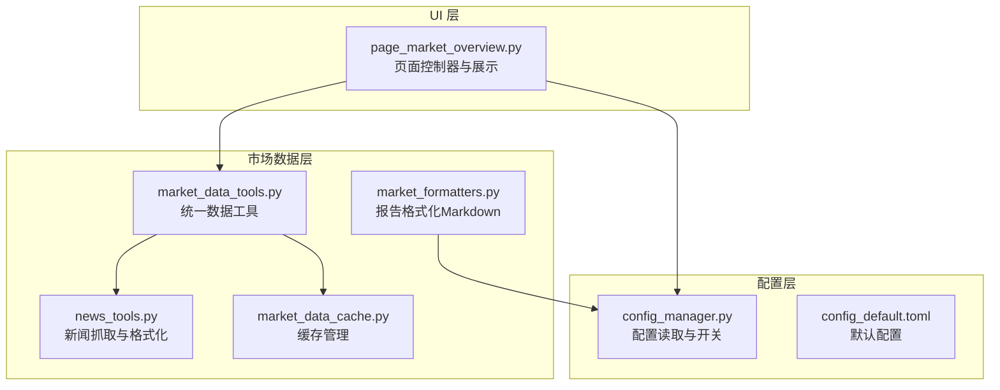
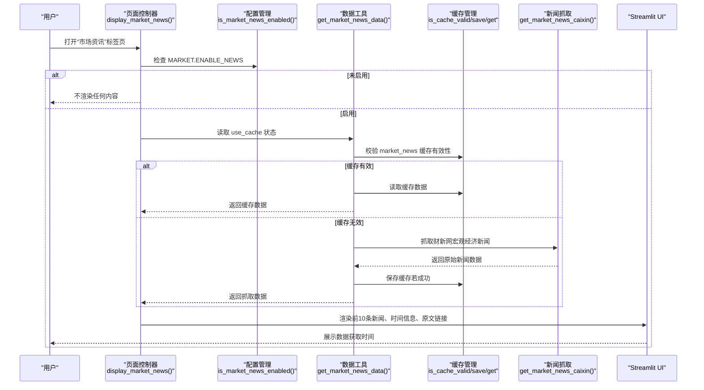
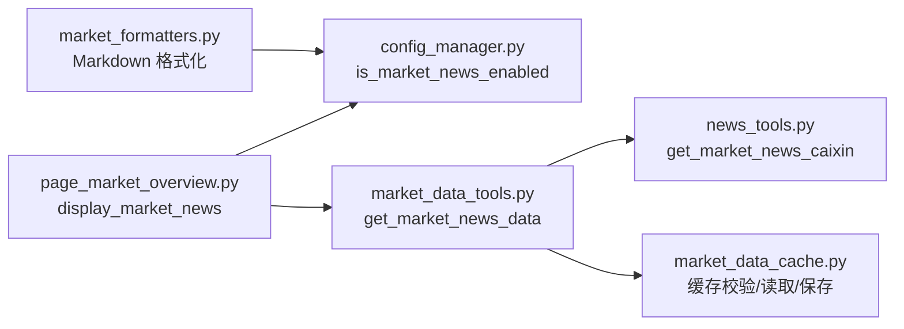

# 市场资讯

<cite>
**本文引用的文件**
- [ui/components/page_market_overview.py](file://ui/components/page_market_overview.py)
- [config_manager.py](file://config_manager.py)
- [config_default.toml](file://config_default.toml)
- [market/market_data_tools.py](file://market/market_data_tools.py)
- [utils/news_tools.py](file://utils/news_tools.py)
- [market/market_data_cache.py](file://market/market_data_cache.py)
- [market/market_formatters.py](file://market/market_formatters.py)
</cite>

## 目录
1. [简介](#简介)
2. [项目结构](#项目结构)
3. [核心组件](#核心组件)
4. [架构总览](#架构总览)
5. [组件详解](#组件详解)
6. [依赖关系分析](#依赖关系分析)
7. [性能与缓存特性](#性能与缓存特性)
8. [故障排查指南](#故障排查指南)
9. [结论](#结论)

## 简介
本文件围绕“市场资讯”功能，系统化说明 display_market_news 函数的实现与运行机制。重点涵盖：
- 功能开关检查：通过配置项控制是否启用市场新闻
- 数据获取流程：从数据工具层调用新闻抓取与缓存策略
- 展示逻辑：分页显示（前10条）、时间信息格式化、原文链接呈现
- 数据新鲜度与错误处理：数据获取时间戳、异常捕获与降级策略
- 标签页条件渲染：依据开关动态增减“市场资讯”标签页

## 项目结构
市场资讯功能位于 UI 页面组件中，由页面控制器负责调用配置与数据工具层，最终在 Streamlit 界面中渲染。

图表来源
- [ui/components/page_market_overview.py](file://ui/components/page_market_overview.py#L243-L300)
- [config_manager.py](file://config_manager.py#L128-L135)
- [config_default.toml](file://config_default.toml#L51-L54)
- [market/market_data_tools.py](file://market/market_data_tools.py#L250-L272)
- [utils/news_tools.py](file://utils/news_tools.py#L189-L257)
- [market/market_data_cache.py](file://market/market_data_cache.py#L134-L142)
- [market/market_formatters.py](file://market/market_formatters.py#L515-L541)

章节来源
- [ui/components/page_market_overview.py](file://ui/components/page_market_overview.py#L243-L300)
- [config_manager.py](file://config_manager.py#L128-L135)
- [config_default.toml](file://config_default.toml#L51-L54)
- [market/market_data_tools.py](file://market/market_data_tools.py#L250-L272)
- [utils/news_tools.py](file://utils/news_tools.py#L189-L257)
- [market/market_data_cache.py](file://market/market_data_cache.py#L134-L142)
- [market/market_formatters.py](file://market/market_formatters.py#L515-L541)

## 核心组件
- 页面控制器：负责渲染“市场资讯”标签页、读取配置开关、调用数据工具、展示新闻列表与时间信息
- 配置管理：提供 is_market_news_enabled 开关判断，默认启用
- 数据工具：封装市场新闻数据获取、缓存校验与降级策略
- 新闻抓取：从数据源抓取宏观经济新闻，统一字段并排序
- 缓存管理：为市场新闻设置 TTL，支持命中与失效判断
- 报告格式化：在 Markdown 报告中按需输出新闻摘要与前10条

章节来源
- [ui/components/page_market_overview.py](file://ui/components/page_market_overview.py#L243-L300)
- [config_manager.py](file://config_manager.py#L128-L135)
- [market/market_data_tools.py](file://market/market_data_tools.py#L250-L272)
- [utils/news_tools.py](file://utils/news_tools.py#L189-L257)
- [market/market_data_cache.py](file://market/market_data_cache.py#L134-L142)
- [market/market_formatters.py](file://market/market_formatters.py#L515-L541)

## 架构总览
下面的时序图展示了从页面触发到最终展示的完整流程。

图表来源
- [ui/components/page_market_overview.py](file://ui/components/page_market_overview.py#L243-L300)
- [config_manager.py](file://config_manager.py#L128-L135)
- [market/market_data_tools.py](file://market/market_data_tools.py#L250-L272)
- [utils/news_tools.py](file://utils/news_tools.py#L189-L257)
- [market/market_data_cache.py](file://market/market_data_cache.py#L134-L142)

## 组件详解

### display_market_news 函数实现要点
- 功能开关检查：通过配置管理器的 is_market_news_enabled 判断是否启用；未启用则直接返回，不渲染任何内容
- 数据获取：从 get_market_tools 获取 MarketTools 实例，调用 get_market_news_data(use_cache=st.session_state.get('market_use_cache', True))
- 错误处理：若返回数据包含 error 字段且 disabled 为真，表示功能被禁用，直接返回；否则显示警告信息
- 展示逻辑：
  - 输出新闻总数（来自 news_summary.total_market_news_count 或列表长度）
  - 仅展示前10条新闻，每条新闻以 expander 形式展开，标题包含“新闻标题 - 发布时间（相对时间）”
  - 若存在“新闻内容”，则在展开块内显示；若存在“新闻链接”，则以 caption 形式提供“查看原文”链接
  - 若总条数大于10，显示“显示前10条，共X条新闻”的提示
- 数据新鲜度：从 news_summary.data_freshness 读取并显示“市场新闻数据获取时间”

章节来源
- [ui/components/page_market_overview.py](file://ui/components/page_market_overview.py#L243-L300)

### 数据获取与缓存策略
- 缓存键：market_news
- 缓存有效期：30 分钟（expire_minutes=30）
- 命中流程：若 use_cache 且未强制刷新且缓存有效，直接读取缓存
- 失效流程：调用 get_market_news_caixin 抓取数据，成功后写入缓存
- 异常处理：抓取失败时返回缓存数据（若允许），或返回错误信息

章节来源
- [market/market_data_tools.py](file://market/market_data_tools.py#L250-L272)
- [market/market_data_cache.py](file://market/market_data_cache.py#L134-L142)

### 新闻抓取与字段格式化
- 数据源：财新网宏观经济新闻
- 字段统一：新闻标题、新闻内容、发布时间、相对时间、新闻链接、新闻类型
- 排序规则：按发布时间降序（最新在前）
- 限制条数：返回前 limit 条（默认10）
- 新闻摘要：包含 total_market_news_count、data_source、data_freshness、news_type

章节来源
- [utils/news_tools.py](file://utils/news_tools.py#L189-L257)

### 标签页条件渲染机制
- 在页面入口处，先读取 is_market_news_enabled 开关
- 若启用：创建包含“市场资讯”的标签页；若未启用：省略该标签页
- “市场资讯”标签页内部再次检查开关，确保双重保险

章节来源
- [ui/components/page_market_overview.py](file://ui/components/page_market_overview.py#L700-L729)

### Markdown 报告中的新闻展示
- 当生成综合报告时，若新闻功能启用，会将前10条新闻与摘要写入 Markdown
- 该逻辑与 UI 展示保持一致：限制前10条、显示摘要与数据源

章节来源
- [market/market_formatters.py](file://market/market_formatters.py#L515-L541)

## 依赖关系分析

图表来源
- [ui/components/page_market_overview.py](file://ui/components/page_market_overview.py#L243-L300)
- [config_manager.py](file://config_manager.py#L128-L135)
- [market/market_data_tools.py](file://market/market_data_tools.py#L250-L272)
- [utils/news_tools.py](file://utils/news_tools.py#L189-L257)
- [market/market_data_cache.py](file://market/market_data_cache.py#L134-L142)
- [market/market_formatters.py](file://market/market_formatters.py#L515-L541)

## 性能与缓存特性
- 缓存 TTL：市场新闻缓存有效期为 30 分钟，减少重复抓取与网络请求
- 命中率优化：默认使用缓存，可通过 UI 的“使用缓存数据”开关控制；强制刷新时清空缓存
- 数据新鲜度：每次成功抓取后更新 data_freshness，便于用户感知时效性
- 展示性能：前端仅渲染前10条新闻，避免长列表带来的渲染压力

章节来源
- [market/market_data_cache.py](file://market/market_data_cache.py#L134-L142)
- [ui/components/page_market_overview.py](file://ui/components/page_market_overview.py#L243-L300)

## 故障排查指南
- 功能未显示
  - 检查配置项 MARKET.ENABLE_NEWS 是否为 true；默认即启用
  - 确认页面入口处的开关判断逻辑是否生效
- 获取失败
  - 查看 UI 警告信息，确认返回数据是否包含 error 字段
  - 若返回 disabled=True，表示功能被禁用；检查配置或上游逻辑
- 数据为空
  - 确认缓存是否有效；若缓存失效，等待抓取成功
  - 检查网络与数据源可用性
- 时间显示异常
  - 确认新闻数据中“发布时间”字段格式是否符合预期；若解析失败，将保持原有顺序
- 原文链接不可用
  - 检查“新闻链接”字段是否存在；若缺失，UI 将不展示链接

章节来源
- [config_default.toml](file://config_default.toml#L51-L54)
- [config_manager.py](file://config_manager.py#L128-L135)
- [ui/components/page_market_overview.py](file://ui/components/page_market_overview.py#L243-L300)
- [utils/news_tools.py](file://utils/news_tools.py#L189-L257)

## 结论
display_market_news 函数通过“配置开关 + 缓存策略 + 数据抓取 + UI 展示”的闭环，实现了稳定、可控且高效的市场资讯展示。其关键特性包括：
- 双重开关保障：页面入口与函数内部均进行开关检查
- 分页与格式化：统一字段、排序与前10条限制，提升阅读体验
- 新鲜度与错误处理：明确的数据获取时间与异常降级策略
- 条件渲染：依据开关动态增删标签页，避免无效渲染