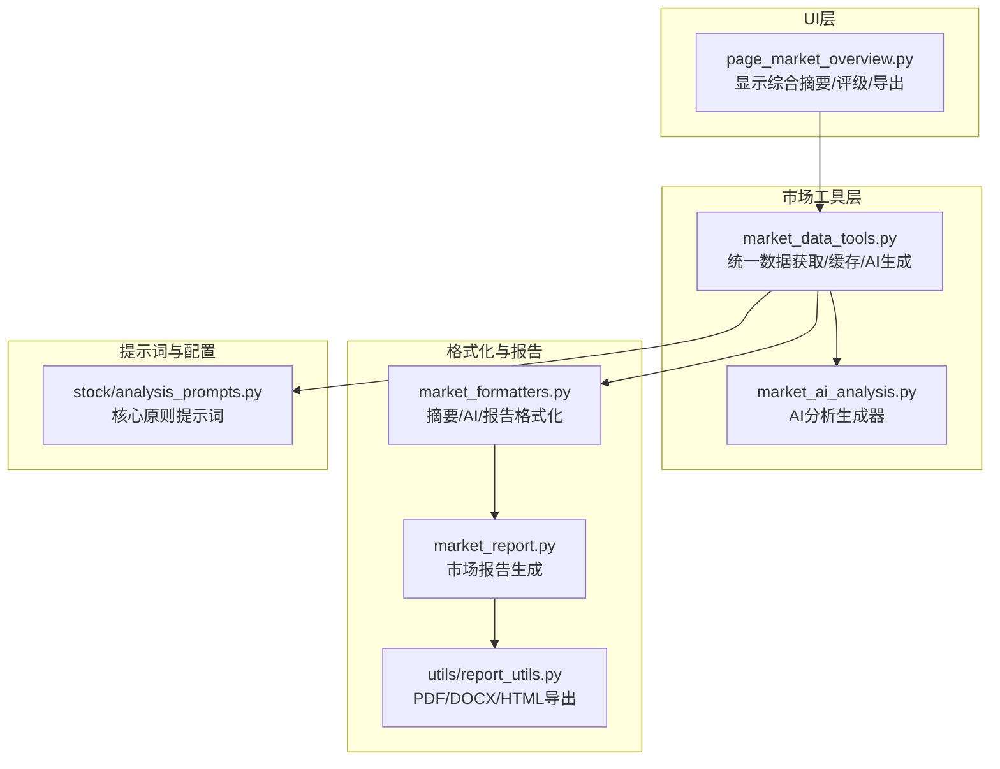
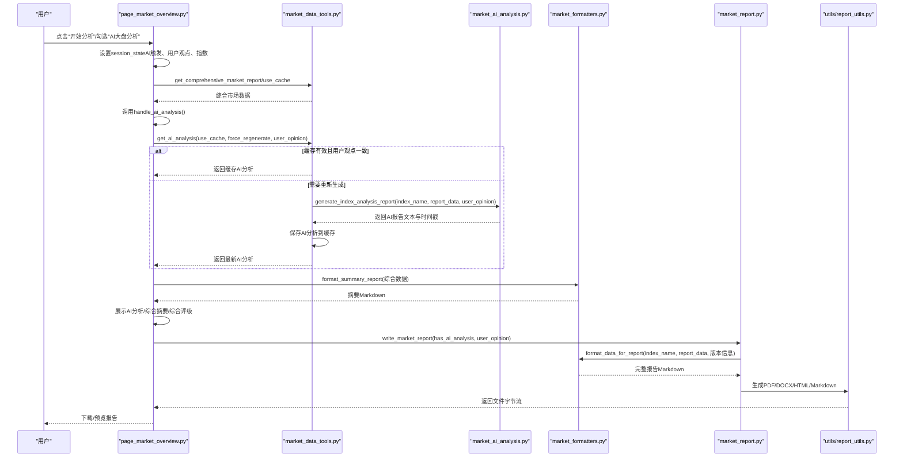
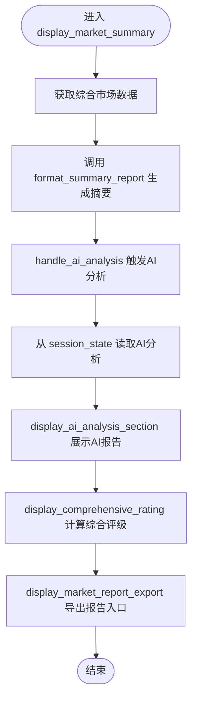
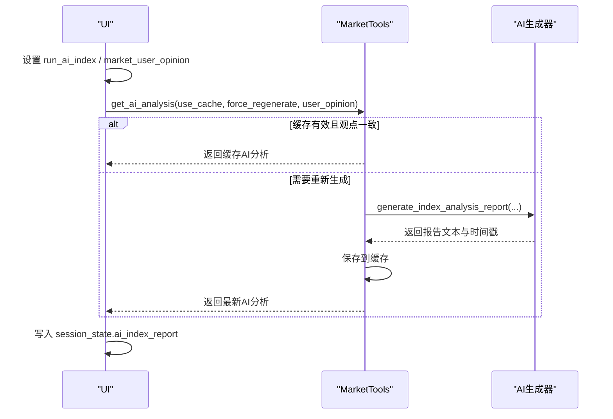
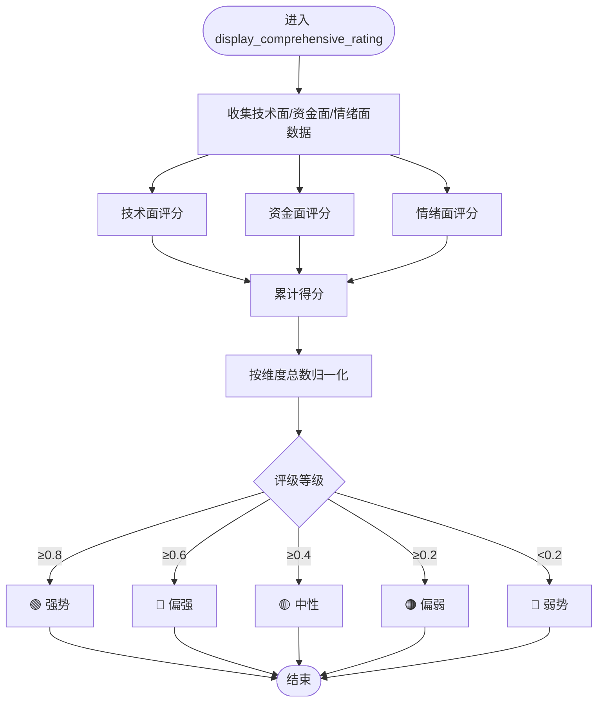
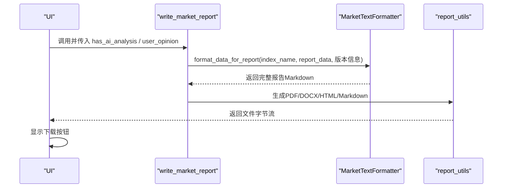
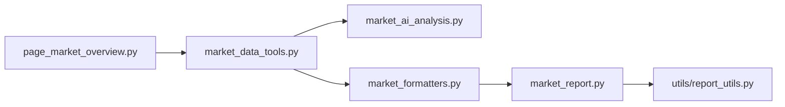

# 综合摘要与AI分析

<cite>
**本文引用的文件**
- [ui/components/page_market_overview.py](file://ui/components/page_market_overview.py)
- [market/market_data_tools.py](file://market/market_data_tools.py)
- [market/market_ai_analysis.py](file://market/market_ai_analysis.py)
- [market/market_formatters.py](file://market/market_formatters.py)
- [market/market_report.py](file://market/market_report.py)
- [utils/report_utils.py](file://utils/report_utils.py)
- [stock/analysis_prompts.py](file://stock/analysis_prompts.py)
</cite>

## 目录
1. [简介](#简介)
2. [项目结构](#项目结构)
3. [核心组件](#核心组件)
4. [架构总览](#架构总览)
5. [详细组件分析](#详细组件分析)
6. [依赖关系分析](#依赖关系分析)
7. [性能考量](#性能考量)
8. [故障排查指南](#故障排查指南)
9. [结论](#结论)

## 简介
本文件围绕“综合摘要与AI分析”主题，系统梳理并文档化以下功能：
- 综合摘要卡片：通过统一的摘要格式化函数生成市场维度摘要
- AI分析触发与执行：在UI层触发、在工具层生成并缓存、在页面层展示
- 用户观点输入处理：支持用户对大盘观点的补充，影响AI分析生成与缓存一致性
- 会话状态管理：在Streamlit中通过session_state维护AI分析状态与用户输入
- AI报告缓存与展示：缓存策略、用户观点一致性校验、UI展示与导出
- 综合评级计算：技术面、资金面、情绪面的评分规则与权重
- 报告导出集成：统一导出组件与格式支持

## 项目结构
本功能涉及UI页面、市场数据工具、AI分析生成、格式化与报告导出等模块，形成“UI触发 → 工具聚合 → AI生成 → 格式化 → 展示/导出”的闭环。

**图表来源**
- [ui/components/page_market_overview.py](file://ui/components/page_market_overview.py#L599-L758)
- [market/market_data_tools.py](file://market/market_data_tools.py#L379-L495)
- [market/market_ai_analysis.py](file://market/market_ai_analysis.py#L14-L123)
- [market/market_formatters.py](file://market/market_formatters.py#L574-L618)
- [market/market_report.py](file://market/market_report.py#L13-L87)
- [utils/report_utils.py](file://utils/report_utils.py#L80-L330)
- [stock/analysis_prompts.py](file://stock/analysis_prompts.py#L1-L54)

**章节来源**
- [ui/components/page_market_overview.py](file://ui/components/page_market_overview.py#L599-L758)
- [market/market_data_tools.py](file://market/market_data_tools.py#L379-L495)
- [market/market_ai_analysis.py](file://market/market_ai_analysis.py#L14-L123)
- [market/market_formatters.py](file://market/market_formatters.py#L574-L618)
- [market/market_report.py](file://market/market_report.py#L13-L87)
- [utils/report_utils.py](file://utils/report_utils.py#L80-L330)
- [stock/analysis_prompts.py](file://stock/analysis_prompts.py#L1-L54)

## 核心组件
- 综合摘要生成：通过统一的摘要格式化函数将技术面、资金面、估值面、流动性等指标整合为简洁摘要
- AI分析触发与执行：UI层触发生成，工具层负责缓存与一致性校验，AI层负责生成报告
- 用户观点输入：支持用户对大盘观点的补充，影响AI分析生成与缓存命中
- 会话状态管理：在UI层通过session_state维护AI分析状态、用户输入与导出状态
- 综合评级：基于技术面、资金面、情绪面的评分与权重，输出综合评级
- 报告导出：统一导出组件支持PDF/DOCX/Mardown/HTML，按平台能力动态调整格式

**章节来源**
- [ui/components/page_market_overview.py](file://ui/components/page_market_overview.py#L599-L758)
- [market/market_data_tools.py](file://market/market_data_tools.py#L379-L495)
- [market/market_ai_analysis.py](file://market/market_ai_analysis.py#L14-L123)
- [market/market_formatters.py](file://market/market_formatters.py#L574-L618)
- [utils/report_utils.py](file://utils/report_utils.py#L80-L330)

## 架构总览
下面的序列图展示了从UI触发到AI分析生成、缓存与展示的完整流程。

**图表来源**
- [ui/components/page_market_overview.py](file://ui/components/page_market_overview.py#L364-L414)
- [ui/components/page_market_overview.py](file://ui/components/page_market_overview.py#L599-L625)
- [market/market_data_tools.py](file://market/market_data_tools.py#L379-L495)
- [market/market_ai_analysis.py](file://market/market_ai_analysis.py#L14-L123)
- [market/market_formatters.py](file://market/market_formatters.py#L574-L618)
- [market/market_report.py](file://market/market_report.py#L13-L87)
- [utils/report_utils.py](file://utils/report_utils.py#L80-L330)

## 详细组件分析

### display_market_summary：综合摘要卡片
- 职责：获取综合市场数据，调用统一摘要格式化函数生成摘要Markdown，触发AI分析与展示，计算并展示综合评级，提供报告导出入口
- 关键调用链：
  - 获取综合数据：通过市场工具获取技术面、资金面、估值面、情绪面等指标
  - 生成摘要：调用格式化器的摘要函数生成简洁摘要
  - 触发AI分析：调用AI分析处理函数，将结果写入session_state
  - 展示AI分析：从session_state读取并展示AI报告
  - 综合计评：基于技术面、资金面、情绪面评分，输出评级与构成
  - 报告导出：调用导出组件，传入是否包含AI分析与用户观点

**图表来源**
- [ui/components/page_market_overview.py](file://ui/components/page_market_overview.py#L599-L625)
- [market/market_formatters.py](file://market/market_formatters.py#L574-L618)

**章节来源**
- [ui/components/page_market_overview.py](file://ui/components/page_market_overview.py#L599-L625)
- [market/market_formatters.py](file://market/market_formatters.py#L574-L618)

### handle_ai_analysis：AI分析触发机制
- 触发条件：当UI层设置AI触发标志时，从session_state读取用户观点，调用市场工具生成AI分析
- 缓存与一致性：若缓存有效且用户观点一致，则直接返回缓存；否则重新生成并写入缓存
- 结果存储：将AI分析结果写入session_state，便于后续展示

**图表来源**
- [ui/components/page_market_overview.py](file://ui/components/page_market_overview.py#L364-L414)
- [market/market_data_tools.py](file://market/market_data_tools.py#L379-L495)
- [market/market_ai_analysis.py](file://market/market_ai_analysis.py#L14-L123)

**章节来源**
- [ui/components/page_market_overview.py](file://ui/components/page_market_overview.py#L364-L414)
- [market/market_data_tools.py](file://market/market_data_tools.py#L379-L495)
- [market/market_ai_analysis.py](file://market/market_ai_analysis.py#L14-L123)

### display_ai_analysis_section：AI报告展示
- 从session_state读取指定指数的AI分析结果
- 展示报告正文与生成时间，支持是否包含用户观点的标注
- 作为UI展示组件，不改变数据流，仅负责渲染

**章节来源**
- [ui/components/page_market_overview.py](file://ui/components/page_market_overview.py#L392-L414)

### display_comprehensive_rating：综合评级计算
- 技术面：多头排列、MACD金叉向上计分
- 资金面：融资融券余额阈值分级计分
- 情绪面：市场情绪评分区间分级计分
- 权重与评分：各维度独立计分，最终按维度总数归一化得到评级等级

**图表来源**
- [ui/components/page_market_overview.py](file://ui/components/page_market_overview.py#L416-L507)

**章节来源**
- [ui/components/page_market_overview.py](file://ui/components/page_market_overview.py#L416-L507)

### format_summary_report：摘要生成与作用
- 输入：综合市场报告数据（技术面、资金面、估值面、流动性等）
- 输出：简洁的摘要Markdown，包含技术趋势、RSI、融资余额、PE、M2增长率等关键指标
- 作用：为UI综合摘要卡片提供统一的摘要文本，减少重复格式化逻辑

**章节来源**
- [market/market_formatters.py](file://market/market_formatters.py#L574-L618)

### 报告导出集成：write_market_report 与导出组件
- write_market_report：根据是否包含AI分析与用户观点，组装综合报告数据，调用格式化器生成Markdown，再按格式转换为PDF/DOCX/HTML/Markdown
- 导出组件：统一的导出界面，支持格式选择、一键生成、下载按钮与历史记录
- 平台能力检测：根据PDF支持能力动态调整可用格式

**图表来源**
- [market/market_report.py](file://market/market_report.py#L13-L87)
- [market/market_formatters.py](file://market/market_formatters.py#L915-L937)
- [utils/report_utils.py](file://utils/report_utils.py#L80-L330)
- [ui/components/page_market_overview.py](file://ui/components/page_market_overview.py#L509-L535)

**章节来源**
- [market/market_report.py](file://market/market_report.py#L13-L87)
- [market/market_formatters.py](file://market/market_formatters.py#L915-L937)
- [utils/report_utils.py](file://utils/report_utils.py#L80-L330)
- [ui/components/page_market_overview.py](file://ui/components/page_market_overview.py#L509-L535)

## 依赖关系分析
- UI层依赖市场工具层获取数据与触发AI分析
- 市场工具层依赖AI分析生成器与格式化器
- 市场报告生成依赖格式化器与导出工具
- 导出工具依赖外部引擎（pandoc/weasyprint），并在不可用时回退到可用格式

**图表来源**
- [ui/components/page_market_overview.py](file://ui/components/page_market_overview.py#L599-L758)
- [market/market_data_tools.py](file://market/market_data_tools.py#L379-L495)
- [market/market_ai_analysis.py](file://market/market_ai_analysis.py#L14-L123)
- [market/market_formatters.py](file://market/market_formatters.py#L574-L618)
- [market/market_report.py](file://market/market_report.py#L13-L87)
- [utils/report_utils.py](file://utils/report_utils.py#L80-L330)

**章节来源**
- [ui/components/page_market_overview.py](file://ui/components/page_market_overview.py#L599-L758)
- [market/market_data_tools.py](file://market/market_data_tools.py#L379-L495)
- [market/market_ai_analysis.py](file://market/market_ai_analysis.py#L14-L123)
- [market/market_formatters.py](file://market/market_formatters.py#L574-L618)
- [market/market_report.py](file://market/market_report.py#L13-L87)
- [utils/report_utils.py](file://utils/report_utils.py#L80-L330)

## 性能考量
- 缓存策略：市场工具层对多类指标与AI分析均采用缓存，支持强制刷新与一致性校验，显著降低重复生成开销
- 会话状态：UI层通过session_state缓存AI分析结果，避免重复请求与重复生成
- 导出能力检测：导出组件根据平台能力动态选择格式，避免不必要的转换失败与重试
- 数据裁剪：格式化器对长文本进行截断，提升展示效率与可读性

[本节为通用指导，无需特定文件引用]

## 故障排查指南
- PDF/DOCX导出失败：检查pandoc与weasyprint是否可用，或改用Markdown/HTML导出
- AI分析失败：确认网络与模型服务可用，查看错误信息并重试；必要时清除缓存后强制刷新
- 缓存不生效：检查用户观点是否变化导致强制重新生成；或手动刷新缓存
- 导出历史为空：确认已成功生成并保存到session_state，或检查浏览器下载权限

**章节来源**
- [utils/report_utils.py](file://utils/report_utils.py#L80-L330)
- [market/market_data_tools.py](file://market/market_data_tools.py#L379-L495)
- [ui/components/page_market_overview.py](file://ui/components/page_market_overview.py#L509-L535)

## 结论
本功能通过统一的市场数据工具层与格式化器，实现了从综合摘要、AI分析、用户观点整合、会话状态管理到报告导出的完整闭环。综合评级以技术面、资金面、情绪面为核心维度，评分规则清晰、权重直观。导出组件具备良好的跨平台兼容性与用户体验。建议在实际部署中：
- 合理设置缓存有效期与强制刷新策略
- 在UI层提供更丰富的用户观点输入与可视化反馈
- 对导出组件增加批量导出与历史记录管理