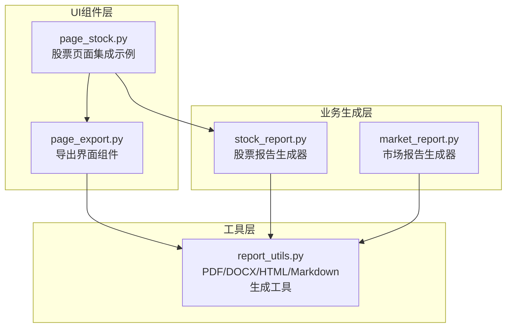
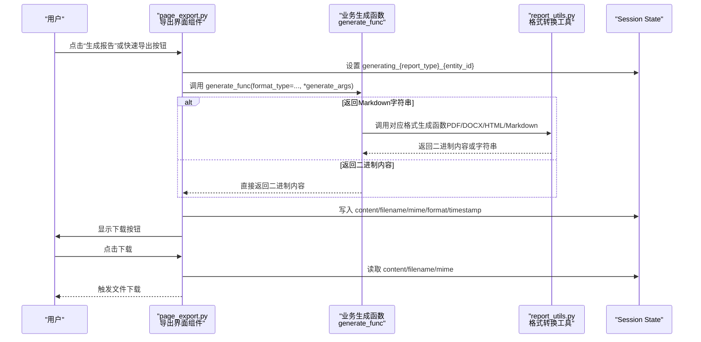
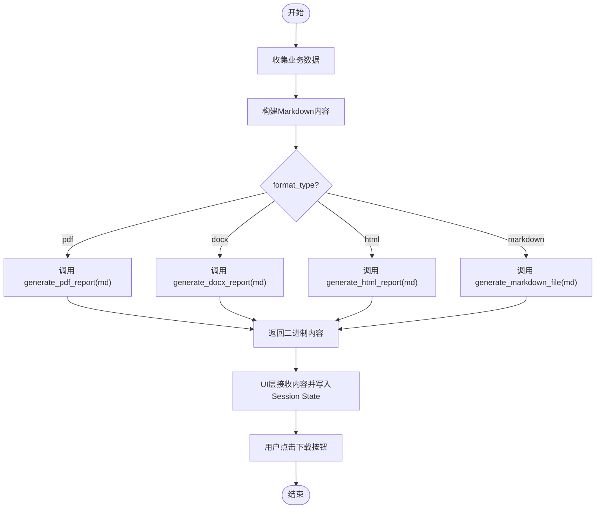
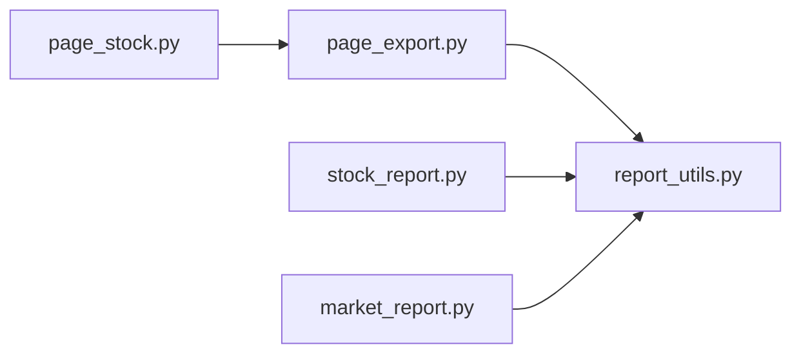

# 报告导出界面

<cite>
**本文引用的文件**
- [page_export.py](file://ui/components/page_export.py)
- [report_utils.py](file://utils/report_utils.py)
- [stock_report.py](file://stock/stock_report.py)
- [market_report.py](file://market/market_report.py)
- [page_stock.py](file://ui/components/page_stock.py)
- [API文档](file://ui/components/API_DOCUMENTATION.md)
</cite>

## 目录
1. [简介](#简介)
2. [项目结构](#项目结构)
3. [核心组件](#核心组件)
4. [架构总览](#架构总览)
5. [详细组件分析](#详细组件分析)
6. [依赖关系分析](#依赖关系分析)
7. [性能考量](#性能考量)
8. [故障排查指南](#故障排查指南)
9. [结论](#结论)
10. [附录](#附录)

## 简介
本文件是“报告导出界面”的API参考文档，聚焦于导出功能组件中的三个核心函数：display_report_export_section、display_quick_export_buttons、display_batch_export_options。文档详细说明各函数的参数、行为、Session State使用模式，并解释支持的导出格式（PDF、DOCX、Markdown、HTML）及其MIME类型。同时提供如何集成自定义报告生成函数的完整示例，展示从数据获取到报告生成的端到端流程。

## 项目结构
导出功能主要位于UI组件层，结合通用报告工具进行格式转换与输出。关键文件如下：
- ui/components/page_export.py：导出界面组件与交互逻辑
- utils/report_utils.py：PDF/DOCX/Markdown/HTML生成工具与环境检测
- stock/stock_report.py：股票报告生成器（返回Markdown或二进制内容）
- market/market_report.py：市场报告生成器（返回Markdown或二进制内容）
- ui/components/page_stock.py：在股票页面中集成导出功能的示例
- ui/components/API_DOCUMENTATION.md：导出格式与Session State使用说明

图表来源
- [page_export.py](file://ui/components/page_export.py#L1-L457)
- [report_utils.py](file://utils/report_utils.py#L1-L330)
- [stock_report.py](file://stock/stock_report.py#L1-L311)
- [market_report.py](file://market/market_report.py#L1-L114)
- [page_stock.py](file://ui/components/page_stock.py#L1-L200)

章节来源
- [page_export.py](file://ui/components/page_export.py#L1-L457)
- [report_utils.py](file://utils/report_utils.py#L1-L330)
- [stock_report.py](file://stock/stock_report.py#L1-L311)
- [market_report.py](file://market/market_report.py#L1-L114)
- [page_stock.py](file://ui/components/page_stock.py#L1-L200)

## 核心组件
本节对三个核心导出函数进行参数与行为说明，并指出其与Session State的交互模式。

- display_report_export_section(entity_id, report_type="report", title="📋 导出报告", info_text="💡 可以导出完整的分析报告", generate_func=None, generate_args=None, filename_prefix="报告")
  - 功能：展示完整的导出区域，包含格式选择、生成按钮、下载按钮与生成状态提示。
  - 关键参数：
    - entity_id：实体标识（如股票代码或指数名称），用于区分不同报告实例。
    - report_type：报告类型标识，用于区分不同页面或业务域的报告集合。
    - generate_func：自定义报告生成函数，需接收format_type关键字参数并返回对应格式的内容（字符串或二进制）。
    - generate_args：传递给generate_func的参数元组；若为空，则仅传入format_type。
    - filename_prefix：生成文件的前缀，最终文件名为“前缀_实体ID_时间戳.扩展名”。
  - 行为要点：
    - 自动根据环境检测PDF支持，动态调整可用格式列表。
    - 生成按钮触发后，调用handle_report_generation执行生成与存储。
    - 下载按钮在生成完成后显示，读取Session State中的内容、文件名、MIME类型并触发下载。
  - Session State使用模式：
    - 生成期间设置“generating_{report_type}_{entity_id}”键以标记生成中状态。
    - 生成成功后写入以下键：
      - "{report_type}_content_{entity_id}"：报告内容（字符串或二进制）
      - "{report_type}_filename_{entity_id}"：文件名
      - "{report_type}_mime_{entity_id}"：MIME类型
      - "{report_type}_format_{entity_id}"：格式类型
      - "{report_type}_timestamp_{entity_id}"：生成时间戳
    - 生成失败或异常时清除生成状态并显示错误信息。

- display_quick_export_buttons(entity_id, report_type="report", generate_func=None, generate_args=None, filename_prefix="报告")
  - 功能：在同一行显示多种格式的快速导出按钮，一键生成对应格式。
  - 关键参数：同上。
  - 行为要点：
    - 不包含格式选择器，直接按当前可用格式逐一生成。
    - 每个按钮点击后调用handle_report_generation并触发页面刷新（st.rerun）。

- display_batch_export_options(entities, report_type="report", generate_func=None, generate_args_func=None, filename_prefix="报告")
  - 功能：批量导出多个实体的报告。
  - 关键参数：
    - entities：实体列表（如股票代码列表）。
    - generate_args_func：为每个实体生成参数的函数，输入为实体ID，返回generate_func所需的参数元组。
  - 行为要点：
    - 提供多选框选择要导出的实体，默认选择前几个。
    - 选择格式后点击“批量生成报告”，逐个实体调用handle_report_generation并显示进度与统计结果。
    - 批量完成后显示每个实体的下载按钮。

章节来源
- [page_export.py](file://ui/components/page_export.py#L242-L457)

## 架构总览
下图展示了从UI到业务生成再到工具层的调用链路，以及Session State在其中的作用。

图表来源
- [page_export.py](file://ui/components/page_export.py#L110-L239)
- [report_utils.py](file://utils/report_utils.py#L80-L330)
- [stock_report.py](file://stock/stock_report.py#L16-L122)
- [market_report.py](file://market/market_report.py#L13-L87)

## 详细组件分析

### 函数：display_report_export_section
- 参数详解
  - entity_id：实体标识，用于Session State键拼接与文件命名。
  - report_type：报告类型，用于区分不同业务域的报告集合。
  - title/info_text：界面标题与提示信息。
  - generate_func：必须提供，签名需接受format_type关键字参数，返回字符串（Markdown）或二进制（PDF/DOCX/HTML）。
  - generate_args：可选，传递给generate_func的参数元组；若为空，仅传入format_type。
  - filename_prefix：文件名前缀，最终文件名为“前缀_实体ID_时间戳.扩展名”。

- Session State键规范
  - generating_{report_type}_{entity_id}：生成中状态
  - {report_type}_content_{entity_id}：生成内容
  - {report_type}_filename_{entity_id}：文件名
  - {report_type}_mime_{entity_id}：MIME类型
  - {report_type}_format_{entity_id}：格式类型
  - {report_type}_timestamp_{entity_id}：生成时间戳

- 错误处理
  - 若未提供generate_func，直接报错并返回失败。
  - 生成过程中异常会捕获并显示错误信息，同时清除生成状态。

- 与格式选择器的协作
  - 通过display_format_selector获取用户选择的格式类型，再交由handle_report_generation处理。

章节来源
- [page_export.py](file://ui/components/page_export.py#L242-L281)

### 函数：display_quick_export_buttons
- 参数详解
  - 同display_report_export_section，但不包含格式选择器。
  - 每个格式按钮点击后直接调用handle_report_generation并触发st.rerun。

- 使用场景
  - 用户希望快速导出多种格式，无需手动切换格式。

章节来源
- [page_export.py](file://ui/components/page_export.py#L283-L317)

### 函数：display_batch_export_options
- 参数详解
  - entities：实体列表，如股票代码列表。
  - generate_args_func：为每个实体生成参数的函数，输入为实体ID，返回generate_func所需的参数元组。
  - 其他参数与单体导出一致。

- 行为与可视化
  - 多选框默认选择前几个实体。
  - 显示进度条与状态文本，统计成功数量。
  - 成功后逐个显示下载按钮。

章节来源
- [page_export.py](file://ui/components/page_export.py#L319-L391)

### 支持的导出格式与MIME类型
- PDF：扩展名.pdf，MIME类型application/pdf
- DOCX：扩展名.docx，MIME类型application/vnd.openxmlformats-officedocument.wordprocessingml.document
- Markdown：扩展名.md，MIME类型text/markdown
- HTML：扩展名.html，MIME类型text/html

- 环境检测与可用性
  - PDF支持取决于PDF_SUPPORT_AVAILABLE，由report_utils.py中的环境检测决定。
  - 当PDF不可用时，界面会自动切换为DOCX、Markdown、HTML三格式。

章节来源
- [page_export.py](file://ui/components/page_export.py#L18-L54)
- [report_utils.py](file://utils/report_utils.py#L1-L46)
- [API文档](file://ui/components/API_DOCUMENTATION.md#L511-L519)

### Session State使用模式
- 生成中状态
  - 键：generating_{report_type}_{entity_id}
  - 值：当前格式类型；用于UI提示与防重复提交
- 生成完成后的存储
  - content：生成内容（字符串或二进制）
  - filename：文件名
  - mime：MIME类型
  - format：格式类型
  - timestamp：生成时间戳
- 历史记录
  - 键：export_history_{report_type}_{entity_id}
  - 结构：包含format、filename、timestamp、size等字段，最多保留最近10条

章节来源
- [page_export.py](file://ui/components/page_export.py#L110-L189)
- [page_export.py](file://ui/components/page_export.py#L200-L239)
- [page_export.py](file://ui/components/page_export.py#L393-L457)
- [API文档](file://ui/components/API_DOCUMENTATION.md#L520-L529)

### 如何集成自定义报告生成函数（示例流程）
以下示例展示从数据获取到报告生成的完整流程，适用于任意业务生成函数（如股票或市场报告）。

- 步骤1：准备数据
  - 在业务层（如stock/stock_report.py或market/market_report.py）组织所需数据，构建报告数据结构。
- 步骤2：生成Markdown
  - 将报告数据转换为Markdown字符串（例如stock_report.py中的generate_markdown_report）。
- 步骤3：格式转换
  - 根据format_type调用report_utils.py中的对应生成函数：
    - PDF：generate_pdf_report(md_content)
    - DOCX：generate_docx_report(md_content)
    - HTML：generate_html_report(md_content)
    - Markdown：generate_markdown_file(md_content)
- 步骤4：返回内容
  - 生成函数返回字符串或二进制内容，供UI层下载。
- 步骤5：在UI中集成
  - 在页面中调用display_report_export_section，传入generate_func与generate_args。
  - generate_func内部可封装业务生成逻辑，接收format_type并返回对应格式内容。

图表来源
- [stock_report.py](file://stock/stock_report.py#L16-L122)
- [market_report.py](file://market/market_report.py#L13-L87)
- [report_utils.py](file://utils/report_utils.py#L80-L330)
- [page_export.py](file://ui/components/page_export.py#L110-L239)

章节来源
- [stock_report.py](file://stock/stock_report.py#L16-L122)
- [market_report.py](file://market/market_report.py#L13-L87)
- [report_utils.py](file://utils/report_utils.py#L80-L330)
- [page_export.py](file://ui/components/page_export.py#L110-L239)

## 依赖关系分析
- 组件耦合
  - page_export.py依赖report_utils.py提供的格式生成函数与PDF支持检测。
  - 页面组件（如page_stock.py）依赖page_export.py提供的导出界面组件。
  - 业务生成函数（stock_report.py、market_report.py）依赖report_utils.py进行格式转换。
- 外部依赖
  - PDF生成依赖pandoc与weasyprint/pandoc默认引擎。
  - DOCX/HTML生成同样依赖pandoc。
- 潜在循环依赖
  - 未发现循环依赖：UI组件依赖工具层，业务层也依赖工具层，均为单向依赖。

图表来源
- [page_export.py](file://ui/components/page_export.py#L1-L457)
- [report_utils.py](file://utils/report_utils.py#L1-L330)
- [page_stock.py](file://ui/components/page_stock.py#L1-L200)
- [stock_report.py](file://stock/stock_report.py#L1-L311)
- [market_report.py](file://market/market_report.py#L1-L114)

章节来源
- [page_export.py](file://ui/components/page_export.py#L1-L457)
- [report_utils.py](file://utils/report_utils.py#L1-L330)
- [page_stock.py](file://ui/components/page_stock.py#L1-L200)
- [stock_report.py](file://stock/stock_report.py#L1-L311)
- [market_report.py](file://market/market_report.py#L1-L114)

## 性能考量
- 生成耗时
  - PDF/DOCX/HTML生成通常较慢，建议在业务层尽量减少不必要的数据拉取与格式化。
- 并发与状态
  - 通过generating_{report_type}_{entity_id}键避免重复生成；批量导出时应考虑进度与错误聚合。
- 内存占用
  - 生成二进制内容时注意内存峰值，建议在业务层分块处理或缓存中间结果。
- 环境依赖
  - PDF生成依赖外部工具（pandoc、weasyprint），建议在部署环境中提前安装并验证可用性。

## 故障排查指南
- PDF不可用
  - 现象：界面仅显示DOCX、Markdown、HTML三格式。
  - 排查：确认pandoc与weasyprint均已正确安装并可通过命令行访问。
  - 参考：report_utils.py中的环境检测逻辑。
- 生成失败
  - 现象：出现错误提示且Session State未写入内容。
  - 排查：检查generate_func的实现与参数传递；确认业务数据完整性。
- 下载按钮不显示
  - 现象：生成成功但未显示下载按钮。
  - 排查：确认Session State中content/filename/mime等键是否存在；检查report_type与entity_id是否匹配。
- 批量导出异常
  - 现象：部分实体导出失败。
  - 排查：逐个实体检查generate_args_func与generate_func；关注异常日志并统计成功数量。

章节来源
- [report_utils.py](file://utils/report_utils.py#L1-L46)
- [page_export.py](file://ui/components/page_export.py#L110-L189)
- [page_export.py](file://ui/components/page_export.py#L319-L391)

## 结论
本API参考文档系统性地梳理了报告导出界面的核心组件与Session State使用模式，明确了支持的导出格式与MIME类型，并提供了从数据获取到报告生成的完整集成示例。通过合理的参数设计与状态管理，用户可以在不同页面中快速集成自定义报告生成函数，并获得一致的导出体验。

## 附录
- 支持的导出格式与MIME类型
  - PDF：.pdf，application/pdf
  - DOCX：.docx，application/vnd.openxmlformats-officedocument.wordprocessingml.document
  - Markdown：.md，text/markdown
  - HTML：.html，text/html
- Session State键规范
  - 生成中：generating_{report_type}_{entity_id}
  - 生成完成：{report_type}_content_{entity_id}、{report_type}_filename_{entity_id}、{report_type}_mime_{entity_id}、{report_type}_format_{entity_id}、{report_type}_timestamp_{entity_id}
  - 历史记录：export_history_{report_type}_{entity_id}

章节来源
- [API文档](file://ui/components/API_DOCUMENTATION.md#L511-L535)
- [page_export.py](file://ui/components/page_export.py#L110-L189)
- [page_export.py](file://ui/components/page_export.py#L393-L457)