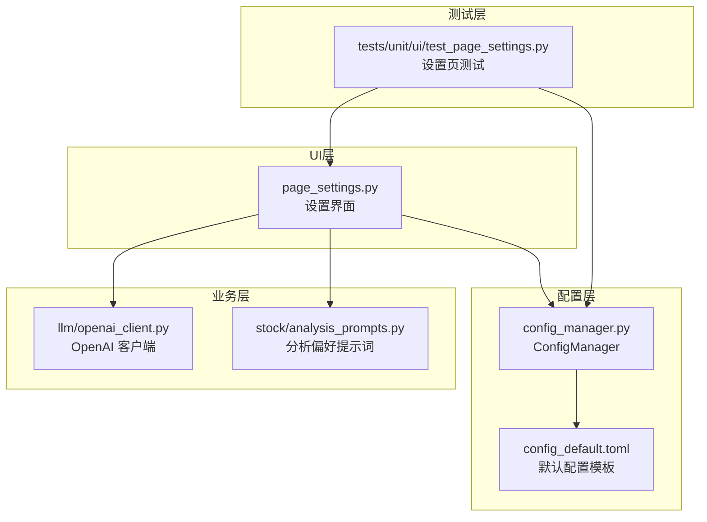
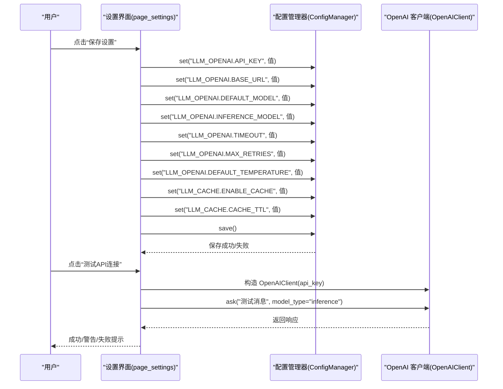
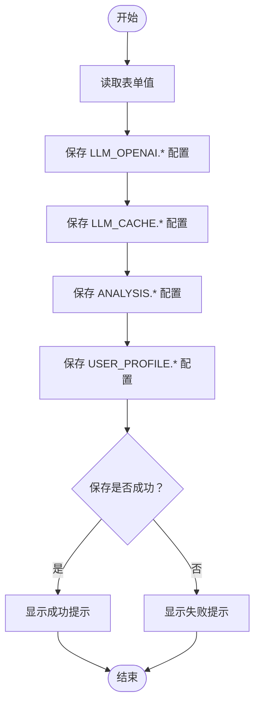
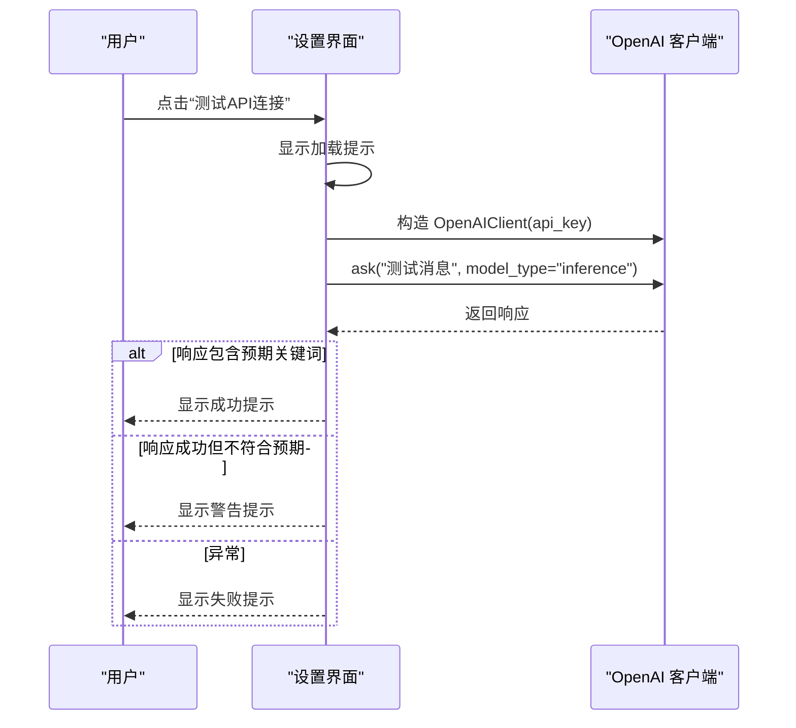
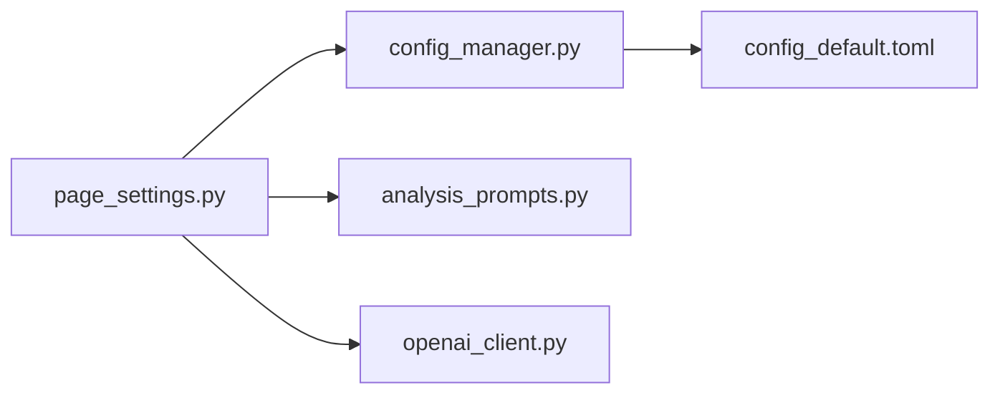

# 系统设置界面

<cite>
**本文引用的文件**
- [ui/components/page_settings.py](file://ui/components/page_settings.py)
- [config_manager.py](file://config_manager.py)
- [config_default.toml](file://config_default.toml)
- [stock/analysis_prompts.py](file://stock/analysis_prompts.py)
- [llm/openai_client.py](file://llm/openai_client.py)
- [tests/unit/ui/test_page_settings.py](file://tests/unit/ui/test_page_settings.py)
</cite>

## 目录
1. [简介](#简介)
2. [项目结构](#项目结构)
3. [核心组件](#核心组件)
4. [架构总览](#架构总览)
5. [详细组件分析](#详细组件分析)
6. [依赖关系分析](#依赖关系分析)
7. [性能考虑](#性能考虑)
8. [故障排查指南](#故障排查指南)
9. [结论](#结论)
10. [附录](#附录)

## 简介
本文件为“系统设置界面”的API参考文档，围绕页面组件 page_settings.py 的配置管理能力进行系统化梳理，重点覆盖以下方面：
- 配置项结构与字段说明：LLM_OPENAI、LLM_CACHE、ANALYSIS、USER_PROFILE 等配置节
- 表单布局与交互：各配置区域的控件组织、默认值来源与校验策略
- 保存流程：save_config 函数的工作机制与错误处理
- API连接测试：测试流程、错误处理与用户体验反馈
- 编程式修改配置：如何以编程方式更新配置并持久化

## 项目结构
系统设置界面位于 UI 层，通过 Streamlit 提供交互式配置页面，并由配置管理器统一读写 TOML 配置文件。关键文件与职责如下：
- ui/components/page_settings.py：设置页面主入口，包含表单、保存逻辑与连接测试
- config_manager.py：集中式配置管理器，负责读取/写入 TOML 配置、默认值回退与分节访问
- config_default.toml：默认配置模板，定义可用配置项与默认值
- stock/analysis_prompts.py：分析偏好提示词与描述映射，用于设置界面的风险偏好展示
- llm/openai_client.py：OpenAI 客户端，承载实际 API 调用与错误处理，设置页通过其进行连接测试
- tests/unit/ui/test_page_settings.py：设置页的单元测试，覆盖保存、渲染与连接测试等行为

图表来源
- [ui/components/page_settings.py](file://ui/components/page_settings.py#L1-L216)
- [config_manager.py](file://config_manager.py#L1-L144)
- [config_default.toml](file://config_default.toml#L1-L64)
- [stock/analysis_prompts.py](file://stock/analysis_prompts.py#L1-L54)
- [llm/openai_client.py](file://llm/openai_client.py#L1-L297)
- [tests/unit/ui/test_page_settings.py](file://tests/unit/ui/test_page_settings.py#L1-L373)

章节来源
- [ui/components/page_settings.py](file://ui/components/page_settings.py#L1-L216)
- [config_manager.py](file://config_manager.py#L1-L144)
- [config_default.toml](file://config_default.toml#L1-L64)
- [stock/analysis_prompts.py](file://stock/analysis_prompts.py#L1-L54)
- [llm/openai_client.py](file://llm/openai_client.py#L1-L297)
- [tests/unit/ui/test_page_settings.py](file://tests/unit/ui/test_page_settings.py#L1-L373)

## 核心组件
本节聚焦设置界面的核心函数与配置项，帮助开发者快速定位与扩展。

- save_config(section, key, value)
  - 功能：将指定配置项写入配置管理器并持久化保存
  - 参数：
    - section：配置节名，如 "LLM_OPENAI"、"LLM_CACHE"、"ANALYSIS"、"USER_PROFILE"
    - key：键名，如 "API_KEY"、"DEFAULT_MODEL"、"RISK_PREFERENCE"
    - value：值，将被转换为字符串后写入
  - 返回：布尔值，表示保存是否成功
  - 实现要点：通过配置管理器的 set 与 save 方法完成写入与落盘
  - 错误处理：捕获异常并返回 False（在测试中体现）

- main()
  - 功能：渲染设置界面，包含 OpenAI API 设置、缓存设置、分析偏好设置、用户画像设置以及连接测试
  - 表单控件与默认值来源：均来自配置管理器的 get(key, default)
  - 保存流程：点击“保存设置”或“保存分析偏好”、“保存用户画像”后，逐项调用 save_config 写入
  - 连接测试：点击“测试API连接”，构造 OpenAI 客户端并发起一次简短测试请求，根据响应结果给出成功/警告/失败提示

章节来源
- [ui/components/page_settings.py](file://ui/components/page_settings.py#L16-L216)
- [config_manager.py](file://config_manager.py#L64-L115)

## 架构总览
设置界面的调用链路如下：
- 页面渲染：main() 读取配置并绘制表单
- 保存动作：save_config() 将值写入内存配置并保存到磁盘
- 连接测试：构造 OpenAI 客户端，调用 ask() 发起一次简短请求，依据返回内容判定测试结果

图表来源
- [ui/components/page_settings.py](file://ui/components/page_settings.py#L103-L137)
- [config_manager.py](file://config_manager.py#L85-L115)
- [llm/openai_client.py](file://llm/openai_client.py#L72-L176)

## 详细组件分析

### 配置项结构与参数说明
以下配置项来源于默认模板与页面读取逻辑，字段名与用途如下：

- LLM_OPENAI（OpenAI API 配置）
  - API_KEY：字符串，API 密钥
  - BASE_URL：字符串，API 基础地址（可选）
  - DEFAULT_MODEL：字符串，用于详细分析的模型
  - INFERENCE_MODEL：字符串，用于快速推理的模型
  - TIMEOUT：整数，请求超时秒数
  - MAX_RETRIES：整数，最大重试次数
  - DEFAULT_TEMPERATURE：浮点数，生成随机性参数

- LLM_CACHE（缓存配置）
  - ENABLE_CACHE：布尔值，是否启用缓存
  - CACHE_TTL：整数，缓存有效期（秒）

- ANALYSIS（分析偏好设置）
  - RISK_PREFERENCE：枚举字符串，风险偏好选项
    - 可选值："neutral"（中性）、"conservative"（保守）、"aggressive"（激进）、"custom"（自定义）
  - CUSTOM_PRINCIPLES：字符串，当 RISK_PREFERENCE 为 "custom" 时使用的核心原则

- USER_PROFILE（用户画像）
  - RAW：字符串，用户画像描述
  - MISTAKES：字符串数组，用户常犯错误（多选）

章节来源
- [config_default.toml](file://config_default.toml#L1-L64)
- [ui/components/page_settings.py](file://ui/components/page_settings.py#L26-L201)
- [stock/analysis_prompts.py](file://stock/analysis_prompts.py#L24-L37)

### 表单布局与交互
- OpenAI API 设置
  - 控件：密码输入框（API Key）、文本输入框（Base URL）、两列文本输入框（分析模型、推理模型）、数字输入框（超时、最大重试）、滑块（温度）
  - 默认值：来自配置管理器的 get(key, default)，若未设置则采用默认模板中的默认值
  - 高级设置与缓存设置：折叠展开容器，便于用户按需配置

- 分析偏好设置
  - 控件：下拉选择框（RISK_PREFERENCE），当选择 "custom" 时显示多行文本框（CUSTOM_PRINCIPLES）
  - 风险偏好描述：通过分析提示词模块提供的映射进行展示

- 用户画像设置
  - 控件：多行文本框（RAW）、多选框（MISTAKES）
  - 默认值：从配置中读取

- 连接测试
  - 控件：按钮（测试API连接）
  - 行为：构造 OpenAI 客户端并发送简短测试消息，根据响应内容判断测试结果

章节来源
- [ui/components/page_settings.py](file://ui/components/page_settings.py#L26-L201)
- [stock/analysis_prompts.py](file://stock/analysis_prompts.py#L24-L37)

### 保存流程与错误处理
- save_config 工作流
  - set(key, value)：将值写入内存配置树
  - save()：将配置树序列化为 TOML 并写入文件
  - 异常处理：页面侧在保存时使用 try/except 捕获异常并提示错误；测试文件中验证了保存异常时返回 False 的行为

- 表单保存
  - OpenAI API 设置保存：逐项调用 save_config
  - 分析偏好保存：先保存 RISK_PREFERENCE，若为 "custom" 则再保存 CUSTOM_PRINCIPLES
  - 用户画像保存：保存 RAW 与 MISTAKES

图表来源
- [ui/components/page_settings.py](file://ui/components/page_settings.py#L103-L174)

章节来源
- [ui/components/page_settings.py](file://ui/components/page_settings.py#L16-L174)
- [config_manager.py](file://config_manager.py#L85-L115)
- [tests/unit/ui/test_page_settings.py](file://tests/unit/ui/test_page_settings.py#L23-L114)

### API连接测试实现与错误处理
- 触发条件：点击“测试API连接”按钮
- 执行步骤：
  - 构造 OpenAI 客户端（传入 API Key）
  - 调用 ask() 发送简短测试消息，model_type 为 "inference"
  - 根据响应内容判断测试结果：
    - 包含预期关键词：成功
    - 成功但响应不符合预期：警告
    - 异常：失败
- 错误处理：
  - 页面侧捕获异常并显示错误信息
  - OpenAI 客户端内部对异常进行记录并抛出，便于上层感知

图表来源
- [ui/components/page_settings.py](file://ui/components/page_settings.py#L122-L137)
- [llm/openai_client.py](file://llm/openai_client.py#L72-L176)

章节来源
- [ui/components/page_settings.py](file://ui/components/page_settings.py#L122-L137)
- [llm/openai_client.py](file://llm/openai_client.py#L72-L176)

### 编程式修改配置示例
以下示例展示如何以编程方式修改配置并持久化保存（不直接粘贴代码，仅提供路径与调用位置）：
- 修改 OpenAI API 配置
  - 调用路径：[save_config](file://ui/components/page_settings.py#L16-L21)
  - 示例调用位置：[保存 OpenAI API 设置](file://ui/components/page_settings.py#L103-L116)
- 修改缓存配置
  - 示例调用位置：[保存缓存设置](file://ui/components/page_settings.py#L114-L116)
- 修改分析偏好
  - 示例调用位置：[保存分析偏好](file://ui/components/page_settings.py#L167-L174)
- 修改用户画像
  - 示例调用位置：[保存用户画像](file://ui/components/page_settings.py#L195-L201)

章节来源
- [ui/components/page_settings.py](file://ui/components/page_settings.py#L16-L216)

## 依赖关系分析
- 页面依赖配置管理器：通过 get(key, default) 读取配置，通过 save_config 写入配置
- 配置管理器依赖 TOML 文件：默认模板提供默认值，运行时读取/写入 config.toml
- 分析偏好依赖提示词模块：用于展示不同风险偏好的描述与提示词
- 连接测试依赖 OpenAI 客户端：通过 ask() 发起一次简短请求验证连通性

图表来源
- [ui/components/page_settings.py](file://ui/components/page_settings.py#L1-L216)
- [config_manager.py](file://config_manager.py#L1-L144)
- [config_default.toml](file://config_default.toml#L1-L64)
- [stock/analysis_prompts.py](file://stock/analysis_prompts.py#L1-L54)
- [llm/openai_client.py](file://llm/openai_client.py#L1-L297)

章节来源
- [ui/components/page_settings.py](file://ui/components/page_settings.py#L1-L216)
- [config_manager.py](file://config_manager.py#L1-L144)
- [config_default.toml](file://config_default.toml#L1-L64)
- [stock/analysis_prompts.py](file://stock/analysis_prompts.py#L1-L54)
- [llm/openai_client.py](file://llm/openai_client.py#L1-L297)

## 性能考虑
- 配置读写开销：配置文件读写为本地 IO，频率较低，通常不影响整体性能
- 连接测试：测试请求为一次性短请求，耗时极短，适合在设置页触发
- 缓存配置：启用缓存可减少重复请求，提升响应速度；TTL 过短会导致频繁刷新，过长可能造成数据陈旧

## 故障排查指南
- 保存失败
  - 现象：点击保存后显示错误提示
  - 排查：确认配置文件权限、磁盘空间；检查 save_config 是否抛出异常
  - 参考：[保存异常处理](file://tests/unit/ui/test_page_settings.py#L77-L91)
- API 密钥无效
  - 现象：连接测试失败或报错
  - 排查：确认 API_KEY 是否正确；检查 BASE_URL 是否指向正确的服务端点
  - 参考：[OpenAI 客户端初始化与错误处理](file://llm/openai_client.py#L29-L47)
- 配置文件损坏
  - 现象：读取配置时报错或默认值回退
  - 排查：检查 config.toml 格式；必要时恢复默认模板
  - 参考：[默认配置模板](file://config_default.toml#L1-L64)
- 连接测试无响应
  - 现象：测试按钮点击后长时间无反馈
  - 排查：检查网络连通性、代理设置；调整 TIMEOUT 与 MAX_RETRIES

章节来源
- [tests/unit/ui/test_page_settings.py](file://tests/unit/ui/test_page_settings.py#L336-L373)
- [llm/openai_client.py](file://llm/openai_client.py#L29-L47)
- [config_default.toml](file://config_default.toml#L1-L64)

## 结论
系统设置界面提供了完整的配置管理能力，涵盖 OpenAI API、缓存、分析偏好与用户画像四大配置域。通过 save_config 与 ConfigManager 的配合，实现了配置的读取、修改与持久化；连接测试功能则为用户提供即时反馈，便于快速验证配置有效性。建议在生产环境中结合日志与监控，持续优化配置项的默认值与容错策略。

## 附录
- 配置项一览（节名与键名）
  - LLM_OPENAI：API_KEY、BASE_URL、DEFAULT_MODEL、INFERENCE_MODEL、TIMEOUT、MAX_RETRIES、DEFAULT_TEMPERATURE
  - LLM_CACHE：ENABLE_CACHE、CACHE_TTL
  - ANALYSIS：RISK_PREFERENCE、CUSTOM_PRINCIPLES
  - USER_PROFILE：RAW、MISTAKES

章节来源
- [config_default.toml](file://config_default.toml#L1-L64)
- [ui/components/page_settings.py](file://ui/components/page_settings.py#L26-L201)