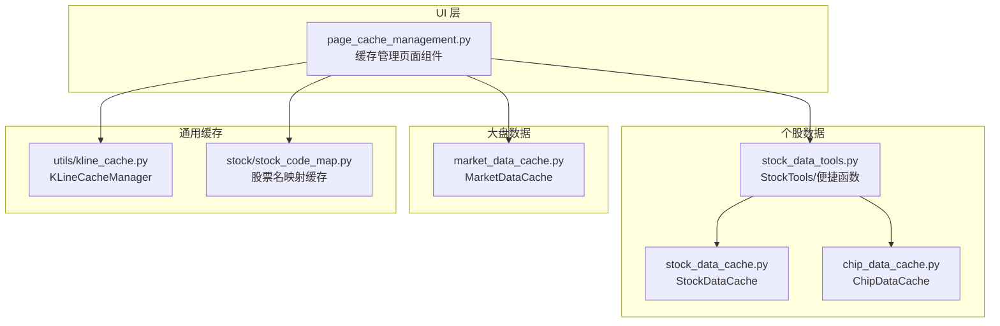
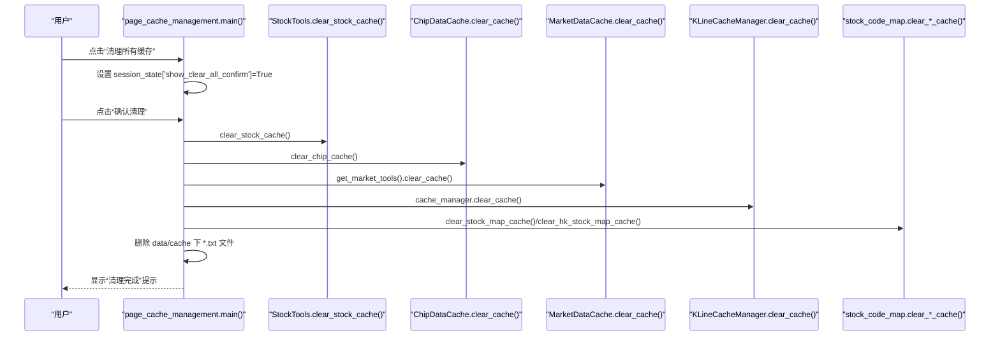
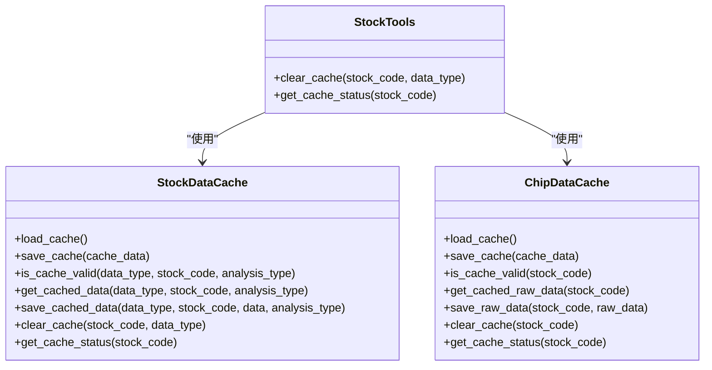
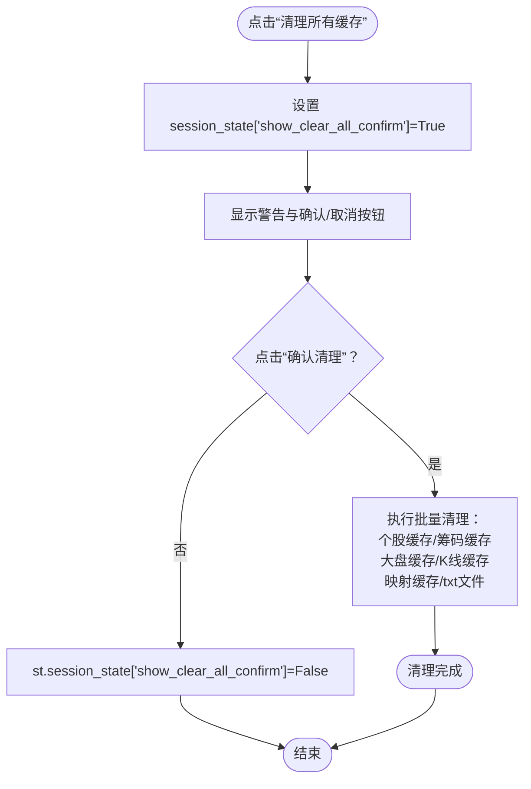
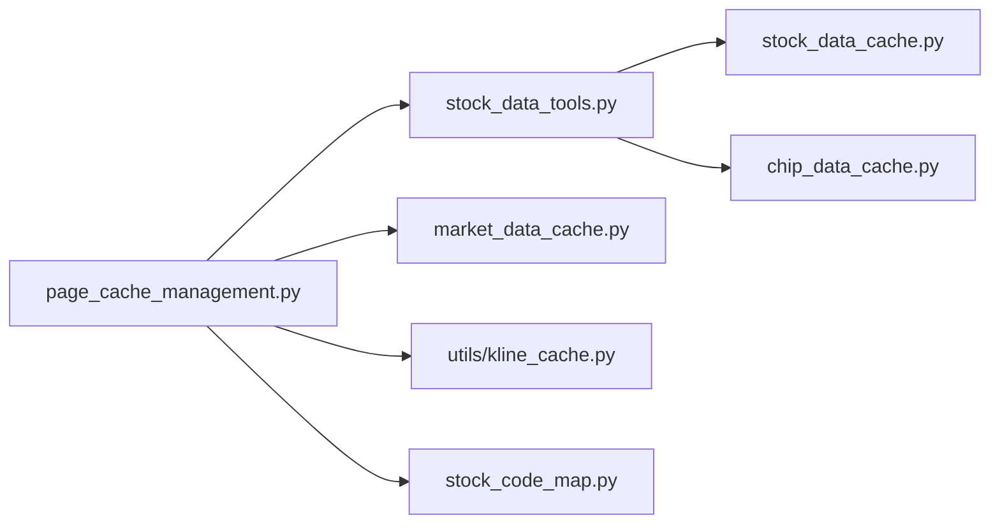

# 缓存管理界面

<cite>
**本文引用的文件**
- [ui/components/page_cache_management.py](file://ui/components/page_cache_management.py)
- [stock/stock_data_cache.py](file://stock/stock_data_cache.py)
- [stock/stock_data_tools.py](file://stock/stock_data_tools.py)
- [stock/chip_data_cache.py](file://stock/chip_data_cache.py)
- [market/market_data_cache.py](file://market/market_data_cache.py)
- [utils/kline_cache.py](file://utils/kline_cache.py)
- [stock/stock_code_map.py](file://stock/stock_code_map.py)
- [ui/config.py](file://ui/config.py)
</cite>

## 目录
1. [简介](#简介)
2. [项目结构](#项目结构)
3. [核心组件](#核心组件)
4. [架构总览](#架构总览)
5. [详细组件分析](#详细组件分析)
6. [依赖关系分析](#依赖关系分析)
7. [性能考量](#性能考量)
8. [故障排查指南](#故障排查指南)
9. [结论](#结论)

## 简介
本文件为“缓存管理界面”的API参考文档，围绕页面组件 main 函数实现的缓存管理界面，系统性说明可清理的缓存类型、确认机制与安全对话框设计、以及缓存清理操作的执行流程。重点覆盖：
- 个股数据缓存（基本信息、技术指标、新闻数据、AI分析、筹码分析）
- 大盘数据缓存（市场情绪、估值指标、资金流向、融资融券）
- 通用缓存（K线数据、股票名映射）

并解释 confirm_clear_all Session State 变量在安全确认对话框中的作用，以及批量清理时对 txt 文本缓存文件的处理。

## 项目结构
缓存管理界面位于 UI 组件层，通过调用各业务模块的缓存管理器与工具函数实现清理操作；同时涉及 K 线独立缓存与股票名映射缓存的清理。

图表来源
- [ui/components/page_cache_management.py](file://ui/components/page_cache_management.py#L1-L133)
- [stock/stock_data_cache.py](file://stock/stock_data_cache.py#L1-L319)
- [stock/stock_data_tools.py](file://stock/stock_data_tools.py#L670-L709)
- [stock/chip_data_cache.py](file://stock/chip_data_cache.py#L1-L215)
- [market/market_data_cache.py](file://market/market_data_cache.py#L1-L440)
- [utils/kline_cache.py](file://utils/kline_cache.py#L331-L477)
- [stock/stock_code_map.py](file://stock/stock_code_map.py#L256-L287)

章节来源
- [ui/components/page_cache_management.py](file://ui/components/page_cache_management.py#L1-L133)

## 核心组件
- 页面入口函数 main：负责渲染“缓存管理”界面、组织按钮布局、触发清理动作，并通过 Session State 实现确认对话框。
- 个股缓存管理：
  - StockDataCache：统一管理股票数据缓存（基本信息、技术指标、新闻、AI分析、筹码分析等），提供清理与状态查询。
  - StockTools：封装便捷函数，如 clear_stock_cache、clear_chip_cache，供页面调用。
  - ChipDataCache：独立管理筹码原始数据缓存，提供清理与状态查询。
- 大盘缓存管理：
  - MarketDataCache：统一管理市场数据缓存（情绪、估值、资金流、融资融券、AI分析等），提供清理与状态查询。
- 通用缓存：
  - KLineCacheManager：独立的 K 线 CSV 缓存，提供清理与过期清理。
  - 股票名映射缓存：A 股与港股通映射缓存文件与内存变量，提供清理函数。

章节来源
- [ui/components/page_cache_management.py](file://ui/components/page_cache_management.py#L13-L133)
- [stock/stock_data_cache.py](file://stock/stock_data_cache.py#L1-L319)
- [stock/stock_data_tools.py](file://stock/stock_data_tools.py#L670-L709)
- [stock/chip_data_cache.py](file://stock/chip_data_cache.py#L1-L215)
- [market/market_data_cache.py](file://market/market_data_cache.py#L1-L440)
- [utils/kline_cache.py](file://utils/kline_cache.py#L331-L477)
- [stock/stock_code_map.py](file://stock/stock_code_map.py#L256-L287)

## 架构总览
缓存管理界面通过 Streamlit 组件与各缓存管理器交互，形成“UI 控制层 → 工具/管理器层 → 数据持久化”的清晰分层。

图表来源
- [ui/components/page_cache_management.py](file://ui/components/page_cache_management.py#L55-L105)
- [stock/stock_data_tools.py](file://stock/stock_data_tools.py#L682-L708)
- [stock/chip_data_cache.py](file://stock/chip_data_cache.py#L116-L137)
- [market/market_data_cache.py](file://market/market_data_cache.py#L247-L295)
- [utils/kline_cache.py](file://utils/kline_cache.py#L331-L359)
- [stock/stock_code_map.py](file://stock/stock_code_map.py#L273-L287)

## 详细组件分析

### 页面入口 main：缓存管理界面
- 主要职责
  - 渲染标题与说明
  - 提供“清理股票数据缓存”“清理大盘数据缓存”两个单项清理按钮
  - 提供“清理所有缓存”按钮，配合 Session State 实现二次确认对话框
  - 在确认后执行批量清理：个股缓存、筹码缓存、大盘缓存、K线缓存、股票名映射缓存、data/cache 目录下 txt 文件
- 确认机制
  - 使用 session_state['show_clear_all_confirm'] 控制确认对话框的显示
  - 确认按钮 key 为 "confirm_clear_all_cache"，取消按钮 key 为 "cancel_clear_all_cache"
  - 确认后重置该状态为 False，避免重复触发
- 清理范围
  - 个股：通过 StockTools.clear_stock_cache 与 ChipDataCache.clear_cache
  - 大盘：通过 MarketDataTools.get_market_tools().clear_cache
  - K线：通过 KLineCacheManager.clear_cache
  - 名称映射：通过 stock_code_map.clear_stock_map_cache 与 clear_hk_stock_map_cache
  - 通用 txt 文件：遍历 data/cache 目录下的 *.txt 并删除

章节来源
- [ui/components/page_cache_management.py](file://ui/components/page_cache_management.py#L13-L133)

### 个股数据缓存类型与清理
- 可清理的个股缓存类型
  - 基本信息：股票价格、涨跌幅等基础数据
  - 技术指标：移动平均线、MACD、RSI 等技术分析指标
  - 新闻资讯：相关新闻和公告信息
  - 筹码分析：筹码分布和成本分析数据
  - AI分析：各类 AI 分析报告（技术、基本面、新闻、筹码、公司、综合）
- 清理方式
  - 单项清理：点击“清理股票数据缓存”，调用 StockTools.clear_stock_cache
  - 批量清理：在“清理所有缓存”中，额外调用 ChipDataCache.clear_cache
- 过期策略
  - StockDataCache 针对不同数据类型配置了差异化的过期时间（分钟级），并在清理时支持按股票代码、数据类型或全量清理

图表来源
- [stock/stock_data_cache.py](file://stock/stock_data_cache.py#L1-L319)
- [stock/chip_data_cache.py](file://stock/chip_data_cache.py#L1-L215)
- [stock/stock_data_tools.py](file://stock/stock_data_tools.py#L650-L709)

章节来源
- [ui/components/page_cache_management.py](file://ui/components/page_cache_management.py#L20-L50)
- [stock/stock_data_cache.py](file://stock/stock_data_cache.py#L179-L233)
- [stock/chip_data_cache.py](file://stock/chip_data_cache.py#L116-L137)
- [stock/stock_data_tools.py](file://stock/stock_data_tools.py#L682-L708)

### 大盘数据缓存类型与清理
- 可清理的大盘缓存类型
  - 市场情绪：情绪指标和市场热度
  - 估值指标：市场整体估值水平
  - 资金流向：资金进出和流向分析
  - 融资融券：详细的融资融券数据
  - AI分析：市场 AI 分析报告
- 清理方式
  - 单项清理：点击“清理大盘数据缓存”，调用 MarketDataTools.get_market_tools().clear_cache
  - 批量清理：在“清理所有缓存”中同样调用
- 过期策略
  - MarketDataCache 针对不同数据类型配置了差异化的过期时间（分钟级），并对指数相关数据提供按指数粒度的清理能力

章节来源
- [ui/components/page_cache_management.py](file://ui/components/page_cache_management.py#L35-L50)
- [market/market_data_cache.py](file://market/market_data_cache.py#L247-L295)
- [ui/config.py](file://ui/config.py#L44-L56)

### 通用缓存：K线数据与股票名映射
- K线数据缓存
  - 独立的 CSV 缓存，支持按周期类型（日线、分钟线等）清理，支持按股票或全量清理
  - 页面清理时调用 KLineCacheManager.clear_cache
- 股票名映射缓存
  - A 股与港股通映射缓存文件与内存变量，提供 clear_stock_map_cache 与 clear_hk_stock_map_cache
  - 页面清理时调用这两个函数
- 通用 txt 文件清理
  - 页面在批量清理时，会删除 data/cache 目录下所有 .txt 文件

章节来源
- [utils/kline_cache.py](file://utils/kline_cache.py#L331-L359)
- [stock/stock_code_map.py](file://stock/stock_code_map.py#L273-L287)
- [ui/components/page_cache_management.py](file://ui/components/page_cache_management.py#L88-L105)

### 确认机制与安全对话框
- 设计要点
  - 使用 session_state['show_clear_all_confirm'] 控制确认对话框显示
  - 确认按钮 key 为 "confirm_clear_all_cache"，取消按钮 key 为 "cancel_clear_all_cache"
  - 确认后执行清理并重置状态为 False
- 安全性
  - 通过二次确认避免误操作
  - 清理范围明确，包含个股、大盘、K线、映射与 txt 文件

图表来源
- [ui/components/page_cache_management.py](file://ui/components/page_cache_management.py#L55-L105)

## 依赖关系分析
- 页面组件依赖
  - 调用 StockTools.clear_stock_cache 与 ChipDataCache.clear_cache
  - 调用 MarketDataTools.get_market_tools().clear_cache
  - 调用 KLineCacheManager.clear_cache
  - 调用 stock_code_map.clear_stock_map_cache 与 clear_hk_stock_map_cache
  - 访问 data/cache 目录并删除 txt 文件
- 缓存管理器依赖
  - StockDataCache 与 ChipDataCache 依赖 JSON 文件持久化
  - MarketDataCache 依赖 JSON 文件持久化
  - KLineCacheManager 依赖 CSV 文件持久化
  - 股票名映射依赖 JSON 文件与内存变量

图表来源
- [ui/components/page_cache_management.py](file://ui/components/page_cache_management.py#L55-L105)
- [stock/stock_data_tools.py](file://stock/stock_data_tools.py#L682-L708)
- [stock/stock_data_cache.py](file://stock/stock_data_cache.py#L1-L319)
- [stock/chip_data_cache.py](file://stock/chip_data_cache.py#L1-L215)
- [market/market_data_cache.py](file://market/market_data_cache.py#L1-L440)
- [utils/kline_cache.py](file://utils/kline_cache.py#L331-L359)
- [stock/stock_code_map.py](file://stock/stock_code_map.py#L256-L287)

## 性能考量
- 缓存过期策略
  - 个股与大盘缓存均采用分钟级过期控制，避免长时间占用磁盘空间
  - K 线缓存采用智能策略：历史数据长期有效，近期数据按周期设定过期窗口
- 清理效率
  - 批量清理通过一次性删除文件或清空 JSON/CSV 内容实现，避免逐条扫描
  - 页面清理时仅删除 txt 文件，不影响 JSON/CSV 缓存主体
- I/O 影响
  - 清理操作集中在磁盘层面，建议在低峰时段执行，避免频繁 I/O

## 故障排查指南
- 清理失败
  - 检查对应缓存文件是否存在与权限是否足够
  - 查看页面错误提示，确认异常栈信息
- 确认对话框不消失
  - 确认是否正确设置了 session_state['show_clear_all_confirm']=False
  - 检查按钮 key 是否与代码一致
- K线缓存未受影响
  - 页面清理说明中明确 K 线有独立缓存机制，不会被此处清理影响
- txt 文件未清理
  - 确认 data/cache 目录路径与权限
  - 检查是否有只读或占用文件导致删除失败

章节来源
- [ui/components/page_cache_management.py](file://ui/components/page_cache_management.py#L88-L105)

## 结论
缓存管理界面通过清晰的按钮布局与二次确认机制，实现了对个股、大盘、K线与映射等多类缓存的可控清理。页面利用 Session State 实现安全对话框，批量清理时覆盖主要缓存介质，并对 txt 文件进行兜底清理。结合各缓存管理器的过期策略与清理能力，可在保证数据新鲜度的同时降低磁盘占用与运行开销。