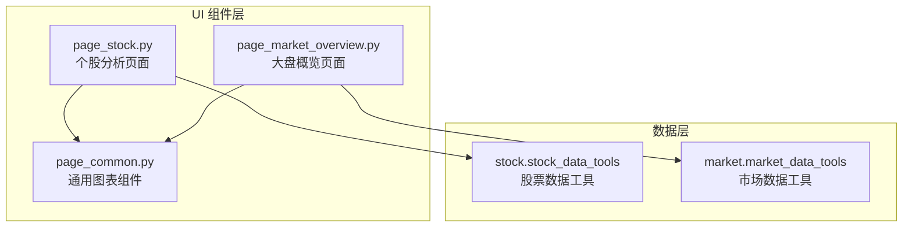
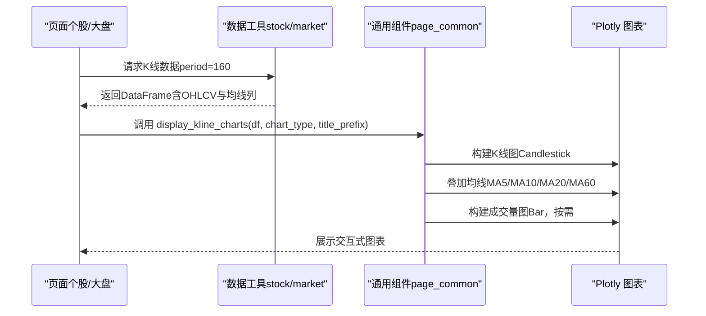
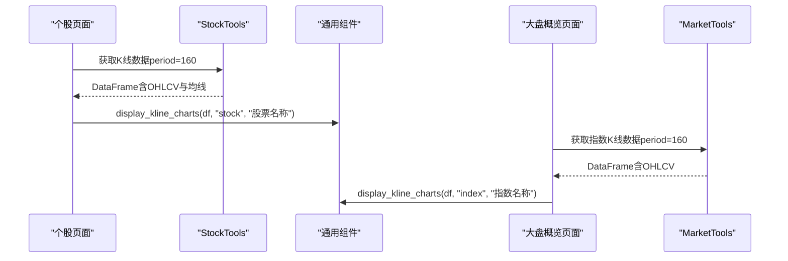
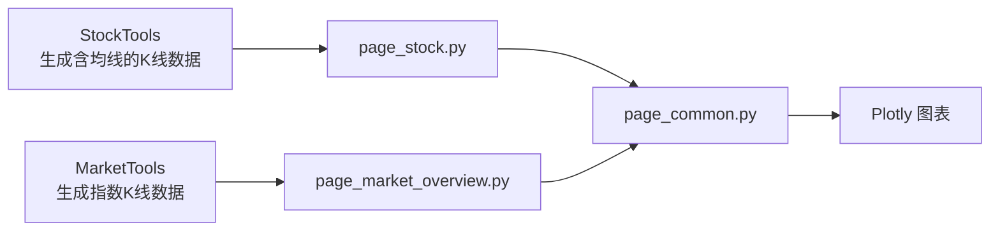

# K线图与成交量图表

<cite>
**本文引用的文件**
- [page_common.py](file://ui/components/page_common.py)
- [API 文档](file://ui/components/API_DOCUMENTATION.md)
- [个股页面](file://ui/components/page_stock.py)
- [大盘概览页面](file://ui/components/page_market_overview.py)
- [单元测试（通用UI组件）](file://tests/unit/ui/test_page_common.py)
- [数据生成器（测试夹具）](file://tests/fixtures/data_generator.py)
- [pytest 配置（测试夹具）](file://tests/conftest.py)
</cite>

## 目录
1. [简介](#简介)
2. [项目结构](#项目结构)
3. [核心组件](#核心组件)
4. [架构总览](#架构总览)
5. [详细组件分析](#详细组件分析)
6. [依赖关系分析](#依赖关系分析)
7. [性能考量](#性能考量)
8. [故障排查指南](#故障排查指南)
9. [结论](#结论)
10. [附录](#附录)

## 简介
本文件围绕通用图表组件 display_kline_charts 进行深入文档化，目标是帮助开发者与使用者准确理解其输入数据结构、Plotly 构建 Candlestick 图表的技术细节、均线叠加逻辑、响应式布局与交互特性、错误处理机制、成交量图渲染策略，以及在个股分析与大盘概览等页面中的复用模式与调用示例。

## 项目结构
- 通用图表组件位于 UI 组件层，提供跨页面复用的 K 线与成交量渲染能力。
- 个股页面与大盘概览页面分别通过统一组件进行数据可视化，形成“数据获取 → 组件渲染”的标准流程。

**图表来源**
- [page_common.py](file://ui/components/page_common.py#L192-L290)
- [个股页面](file://ui/components/page_stock.py#L505-L546)
- [大盘概览页面](file://ui/components/page_market_overview.py#L547-L581)

**章节来源**
- [page_common.py](file://ui/components/page_common.py#L192-L290)
- [个股页面](file://ui/components/page_stock.py#L505-L546)
- [大盘概览页面](file://ui/components/page_market_overview.py#L547-L581)

## 核心组件
- 函数名称：display_kline_charts
- 所属模块：ui/components/page_common.py
- 功能概述：统一渲染股票或指数的 K 线图与成交量图，支持自定义标题前缀与图表类型；内置均线叠加（MA5/MA10/MA20/MA60）与动态显示控制；采用 Plotly 构建交互式图表；提供响应式布局与交互限制（禁用范围滑块、固定 Y 轴缩放）；对空数据与缺失列进行错误处理；成交量图按需渲染。

**章节来源**
- [API 文档](file://ui/components/API_DOCUMENTATION.md#L107-L145)
- [page_common.py](file://ui/components/page_common.py#L192-L290)

## 架构总览
- 数据来源：个股页面通过股票数据工具获取 K 线数据；大盘概览页面通过市场数据工具获取指数 K 线数据。
- 渲染入口：两个页面均调用通用组件 display_kline_charts(df, chart_type, title_prefix)。
- 图表构成：K 线图（Candlestick）+ 均线（Scatter）+ 成交量图（Bar），独立布局，固定高度与容器宽度自适应。

**图表来源**
- [个股页面](file://ui/components/page_stock.py#L505-L546)
- [大盘概览页面](file://ui/components/page_market_overview.py#L547-L581)
- [page_common.py](file://ui/components/page_common.py#L192-L290)

## 详细组件分析

### 输入参数与数据结构要求
- df：必须包含以下列：
  - datetime：时间戳（将被转换为日期时间类型）
  - open：开盘价
  - high：最高价
  - low：最低价
  - close：收盘价
  - volume：成交量（可选，若为空或全为 NaN，则不渲染成交量图）
- chart_type：可选值
  - "stock"：股票 K 线图（默认）
  - "index"：指数 K 线图
- title_prefix：标题前缀（股票名称或指数名称）

上述要求与示例已在 API 文档与测试中明确体现。

**章节来源**
- [API 文档](file://ui/components/API_DOCUMENTATION.md#L117-L145)
- [单元测试（通用UI组件）](file://tests/unit/ui/test_page_common.py#L244-L267)

### Plotly 构建与颜色配置
- K 线图（Candlestick）：
  - X 轴：datetime
  - Y 轴：open/high/low/close
  - 上涨与下跌颜色分别配置，填充色与线条色区分，便于视觉识别
- 均线叠加（Scatter）：
  - MA5/MA10/MA20/MA60 四条均线，按需渲染（当列存在且非全空时）
  - 不同均线使用不同颜色，便于区分
- 成交量图（Bar）：
  - X 轴：datetime
  - Y 轴：volume
  - 颜色统一（蓝色系），按需渲染（当列存在且非全空时）

**章节来源**
- [page_common.py](file://ui/components/page_common.py#L218-L290)

### 响应式布局与交互特性
- 布局尺寸：
  - K 线图高度固定为 500
  - 成交量图高度固定为 250
  - 容器宽度自适应（use_container_width=True）
- 交互限制：
  - 禁用范围滑块（xaxis.rangeslider.visible=False）
  - 固定 Y 轴缩放（yaxis.fixedrange=True）
- 图表标题与坐标轴标签：
  - 根据 chart_type 与 title_prefix 动态生成标题
  - Y 轴标签随 chart_type 切换（股票为“价格”，指数为“指数点位”）

**章节来源**
- [page_common.py](file://ui/components/page_common.py#L210-L264)
- [page_common.py](file://ui/components/page_common.py#L266-L290)

### 错误处理机制
- 空数据处理：
  - df 为空或 None：输出警告提示“无K线数据可显示”
- 缺失列处理：
  - 若 DataFrame 缺少必要列（datetime/open/high/low/close），测试中会触发 KeyError 异常
- 成交量缺失：
  - 若 volume 列不存在或全为 NaN：提示“暂无成交量数据”

**章节来源**
- [page_common.py](file://ui/components/page_common.py#L201-L203)
- [单元测试（通用UI组件）](file://tests/unit/ui/test_page_common.py#L244-L267)

### 成交量图的可选渲染策略
- 条件渲染：
  - 当 df 中存在 volume 列且非全空时，渲染成交量图
  - 否则提示“暂无成交量数据”
- 与 K 线图的布局关系：
  - K 线图与成交量图分别创建独立 Figure，各自设置标题、坐标轴与交互属性

**章节来源**
- [page_common.py](file://ui/components/page_common.py#L266-L290)

### 在个股分析与大盘概览中的复用模式
- 个股页面：
  - 通过股票数据工具获取 K 线数据（包含 MA5/MA10/MA20），随后调用 display_kline_charts(df, chart_type="stock", title_prefix=stock_name)
- 大盘概览页面：
  - 通过市场数据工具获取指数 K 线数据，随后调用 display_kline_charts(df, chart_type="index", title_prefix=index_name)

**图表来源**
- [个股页面](file://ui/components/page_stock.py#L505-L546)
- [大盘概览页面](file://ui/components/page_market_overview.py#L547-L581)
- [page_common.py](file://ui/components/page_common.py#L192-L290)

**章节来源**
- [个股页面](file://ui/components/page_stock.py#L505-L546)
- [大盘概览页面](file://ui/components/page_market_overview.py#L547-L581)

### 实际调用代码示例（路径引用）
- 个股页面调用示例（路径引用）：
  - [个股页面调用路径](file://ui/components/page_stock.py#L533-L536)
- 大盘概览页面调用示例（路径引用）：
  - [大盘页面调用路径](file://ui/components/page_market_overview.py#L559-L561)
- API 文档中的使用示例（路径引用）：
  - [API 示例路径](file://ui/components/API_DOCUMENTATION.md#L130-L145)

**章节来源**
- [个股页面](file://ui/components/page_stock.py#L533-L536)
- [大盘概览页面](file://ui/components/page_market_overview.py#L559-L561)
- [API 文档](file://ui/components/API_DOCUMENTATION.md#L130-L145)

## 依赖关系分析
- 组件依赖：
  - pandas：数据结构与日期转换
  - plotly.graph_objects：构建 Candlestick、Scatter、Bar 图
  - streamlit：渲染图表与提示信息
- 页面依赖：
  - 个股页面依赖股票数据工具（StockTools）生成包含均线的 DataFrame
  - 大盘概览页面依赖市场数据工具（MarketTools）生成指数 K 线 DataFrame
- 组件耦合：
  - display_kline_charts 与页面解耦，仅依赖传入的 DataFrame 结构
  - 均线列（MA5/MA10/MA20/MA60）由上游数据工具生成，组件按需渲染

**图表来源**
- [个股页面](file://ui/components/page_stock.py#L505-L546)
- [大盘概览页面](file://ui/components/page_market_overview.py#L547-L581)
- [page_common.py](file://ui/components/page_common.py#L192-L290)

**章节来源**
- [个股页面](file://ui/components/page_stock.py#L505-L546)
- [大盘概览页面](file://ui/components/page_market_overview.py#L547-L581)
- [page_common.py](file://ui/components/page_common.py#L192-L290)

## 性能考量
- 数据规模：
  - 组件默认渲染周期为 160 日（来自页面调用），可根据需求调整
- 渲染效率：
  - 使用 Plotly 的 Figure.add_trace 逐图层叠加，避免重复创建图表实例
  - 成交量图按需渲染，减少不必要的绘图开销
- 交互限制：
  - 禁用范围滑块与固定 Y 轴缩放，降低交互带来的重绘成本

[本节为通用性能建议，无需特定文件引用]

## 故障排查指南
- 空数据或 None：
  - 现象：显示“无K线数据可显示”
  - 处理：检查上游数据工具是否正确返回 DataFrame
- 缺少必要列：
  - 现象：调用时抛出 KeyError
  - 处理：确保 DataFrame 包含 datetime/open/high/low/close
- 成交量缺失：
  - 现象：提示“暂无成交量数据”
  - 处理：确认 volume 列是否存在且非全空
- 图表标题与坐标轴：
  - 现象：标题或坐标轴标签不符合预期
  - 处理：检查 chart_type 与 title_prefix 参数

**章节来源**
- [page_common.py](file://ui/components/page_common.py#L201-L203)
- [单元测试（通用UI组件）](file://tests/unit/ui/test_page_common.py#L244-L267)

## 结论
display_kline_charts 通过统一的数据结构与 Plotly 图表构建，实现了股票与指数 K 线图与成交量图的一致化渲染。其响应式布局、交互限制、均线叠加与可选成交量渲染，满足了多页面复用场景下的可视化需求。配合上游数据工具生成的 OHLCV 与均线数据，组件在个股分析与大盘概览中实现了稳定、一致且易于维护的可视化方案。

[本节为总结性内容，无需特定文件引用]

## 附录

### 数据结构与字段说明（来自测试与文档）
- 必需字段：datetime、open、high、low、close、volume（可选）
- 示例数据生成（测试夹具）：
  - [示例数据生成器](file://tests/fixtures/data_generator.py#L13-L45)
  - [pytest 夹具（sample_kline_data）](file://tests/conftest.py#L37-L57)

**章节来源**
- [API 文档](file://ui/components/API_DOCUMENTATION.md#L117-L145)
- [数据生成器（测试夹具）](file://tests/fixtures/data_generator.py#L13-L45)
- [pytest 配置（测试夹具）](file://tests/conftest.py#L37-L57)