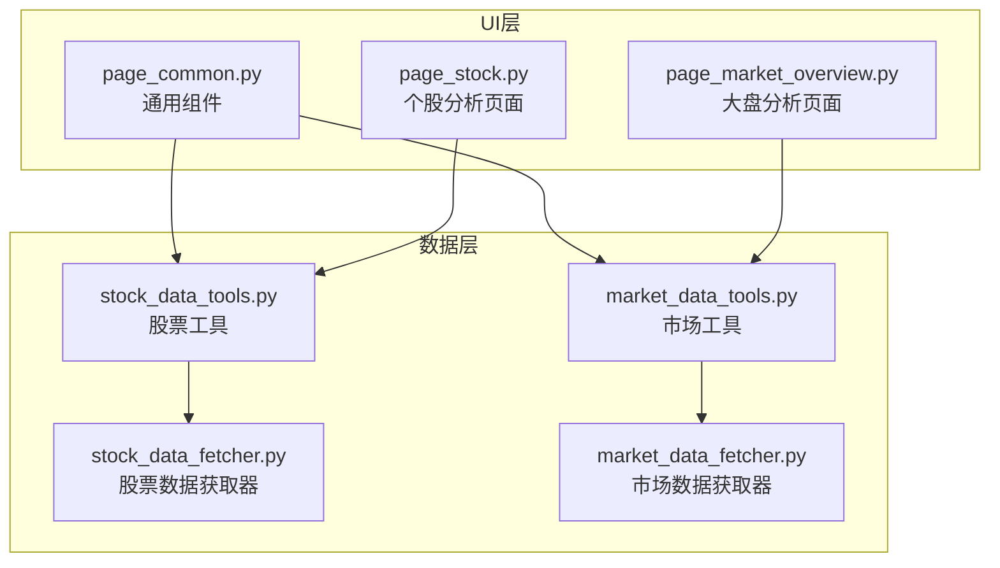
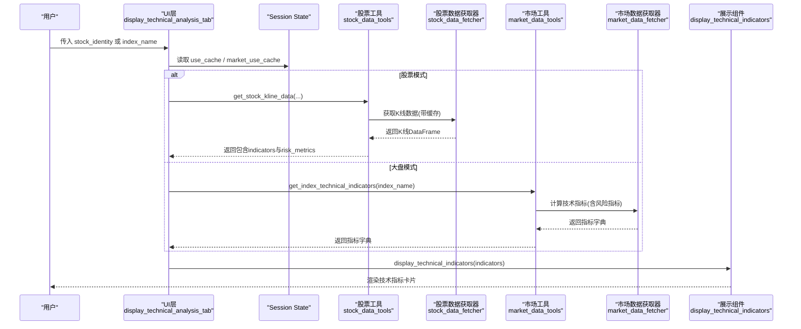
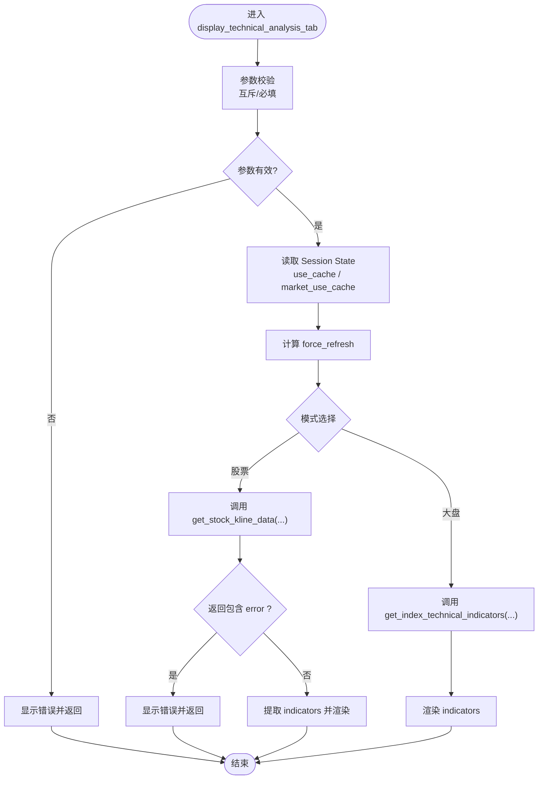
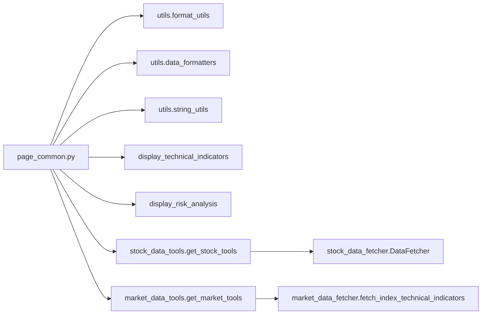

# 技术分析Tab组件

<cite>
**本文引用的文件**
- [page_common.py](file://ui/components/page_common.py)
- [page_stock.py](file://ui/components/page_stock.py)
- [page_market_overview.py](file://ui/components/page_market_overview.py)
- [stock_data_tools.py](file://stock/stock_data_tools.py)
- [market_data_tools.py](file://market/market_data_tools.py)
- [stock_data_fetcher.py](file://stock/stock_data_fetcher.py)
- [market_data_fetcher.py](file://market/stock_data_fetcher.py)
- [API文档](file://ui/components/API_DOCUMENTATION.md)
- [单元测试](file://tests/unit/ui/test_page_common.py)
</cite>

## 目录
1. [简介](#简介)
2. [项目结构](#项目结构)
3. [核心组件](#核心组件)
4. [架构总览](#架构总览)
5. [详细组件分析](#详细组件分析)
6. [依赖关系分析](#依赖关系分析)
7. [性能考量](#性能考量)
8. [故障排查指南](#故障排查指南)
9. [结论](#结论)
10. [附录](#附录)

## 简介
本文件围绕技术分析Tab组件 display_technical_analysis_tab 展开，系统阐述其在股票与大盘指数两种模式下的工作原理、数据流、缓存与强制刷新机制、错误处理策略，以及与后端数据服务和前端展示的协作方式。文档同时覆盖 Session State 的使用模式、跨模块调用的安全性考虑，以及在不同分析页面中的集成方式，帮助开发者与使用者高效理解与使用该组件。

## 项目结构
- UI层组件位于 ui/components，其中 page_common.py 提供通用展示组件，page_stock.py 与 page_market_overview.py 分别承载个股与大盘分析页面的组织逻辑。
- 数据层工具位于 stock 与 market 目录，分别封装股票与市场数据的统一获取与缓存管理。
- 测试与API文档位于 tests 与 ui/components/API_DOCUMENTATION.md，用于验证行为与提供接口说明。

图表来源
- [page_common.py](file://ui/components/page_common.py#L107-L164)
- [page_stock.py](file://ui/components/page_stock.py#L493-L546)
- [page_market_overview.py](file://ui/components/page_market_overview.py#L537-L597)
- [stock_data_tools.py](file://stock/stock_data_tools.py#L132-L189)
- [market_data_tools.py](file://market/market_data_tools.py#L283-L351)
- [stock_data_fetcher.py](file://stock/stock_data_fetcher.py#L135-L200)
- [market_data_fetcher.py](file://market/stock_data_fetcher.py#L569-L607)

章节来源
- [page_common.py](file://ui/components/page_common.py#L107-L164)
- [page_stock.py](file://ui/components/page_stock.py#L493-L546)
- [page_market_overview.py](file://ui/components/page_market_overview.py#L537-L597)

## 核心组件
- display_technical_analysis_tab(stock_identity=None, index_name=None)
  - 作用：在个股与大盘指数两种模式下，统一渲染技术分析Tab的内容。
  - 关键点：
    - 参数互斥校验：不允许同时传入 stock_identity 与 index_name；至少提供其一。
    - 缓存控制：从 st.session_state 读取 use_cache 或 market_use_cache，反推 force_refresh。
    - 数据来源：
      - 股票模式：通过 stock_data_tools.get_stock_tools().get_stock_kline_data(...) 获取K线与技术指标。
      - 大盘模式：通过 market_data_tools.get_market_tools().get_index_technical_indicators(...) 获取指数技术指标。
    - 展示：调用 display_technical_indicators(...) 渲染技术指标卡片。
    - 错误处理：捕获异常并以错误消息与“错误详情”展开面板呈现。

章节来源
- [page_common.py](file://ui/components/page_common.py#L107-L164)
- [API文档](file://ui/components/API_DOCUMENTATION.md#L61-L89)

## 架构总览
下面的时序图展示了 display_technical_analysis_tab 在两种模式下的典型调用链路与数据流转。

图表来源
- [page_common.py](file://ui/components/page_common.py#L107-L164)
- [stock_data_tools.py](file://stock/stock_data_tools.py#L132-L189)
- [market_data_tools.py](file://market/market_data_tools.py#L283-L351)
- [stock_data_fetcher.py](file://stock/stock_data_fetcher.py#L135-L200)
- [market_data_fetcher.py](file://market/stock_data_fetcher.py#L569-L607)

## 详细组件分析

### 组件：display_technical_analysis_tab
- 参数与约束
  - 互斥校验：若同时提供 stock_identity 与 index_name，直接报错并返回。
  - 必填校验：若两者皆未提供，报错并返回。
- 缓存与强制刷新
  - use_cache = st.session_state.get('use_cache', True) or st.session_state.get('market_use_cache', True)
  - force_refresh = not use_cache
  - 该策略允许在个股页面与大盘页面分别控制缓存策略，最终统一转换为 force_refresh 传递给底层数据获取器。
- 数据获取与展示
  - 股票模式：调用 stock_data_tools.get_stock_kline_data(...)，返回字典包含 kline_data、indicators、risk_metrics 等；若返回 error 键，直接展示错误。
  - 大盘模式：调用 market_data_tools.get_index_technical_indicators(...)，返回指标字典。
  - 展示：调用 display_technical_indicators(...) 渲染技术指标卡片。
- 错误处理
  - 捕获异常并以错误消息提示，同时提供“错误详情”展开面板输出异常文本，便于调试。

图表来源
- [page_common.py](file://ui/components/page_common.py#L107-L164)

章节来源
- [page_common.py](file://ui/components/page_common.py#L107-L164)
- [API文档](file://ui/components/API_DOCUMENTATION.md#L61-L89)

### 组件：display_technical_indicators
- 作用：将技术指标以卡片形式展示，包含 MA 趋势、MACD 趋势、移动平均线、RSI/KDJ/MACD/BOLL/CCI/WR 等指标。
- 输入：tech_data 字典，键名与值类型由上游数据提供。
- 输出：在Streamlit中渲染多个 metric 与 expander，按需显示 N/A。
- 边界处理：当 tech_data 为空时，提示“未获取到技术指标数据”。

章节来源
- [page_common.py](file://ui/components/page_common.py#L16-L106)
- [API文档](file://ui/components/API_DOCUMENTATION.md#L29-L59)

### 与个股页面的集成
- 个股页面在“技术分析”标签页中会先获取K线数据并渲染K线图，随后调用 display_technical_analysis_tab(stock_identity=...) 进行技术指标渲染。
- 个股页面同样使用 st.session_state 控制缓存策略与AI分析开关，并在需要时调用 display_risk_analysis(...) 展示风险指标。

章节来源
- [page_stock.py](file://ui/components/page_stock.py#L493-L546)

### 与大盘页面的集成
- 大盘页面在“技术指标”标签页中调用 display_market_technical_analysis(index_name=...)，内部会先获取指数K线数据并渲染K线图，再调用 display_technical_analysis_tab(index_name=...) 进行技术指标渲染。
- 大盘页面还提供风险分析展示 display_risk_analysis(...)。

章节来源
- [page_market_overview.py](file://ui/components/page_market_overview.py#L537-L597)

## 依赖关系分析
- 内部依赖
  - page_common.py
    - 依赖 utils.format_utils、utils.data_formatters、utils.string_utils 进行格式化与展示。
    - 依赖自身组件 display_technical_indicators 与 display_risk_analysis。
- 外部依赖
  - 股票模式
    - stock_data_tools.get_stock_tools().get_stock_kline_data(...)
    - stock_data_fetcher.DataFetcher.get_kline_data(...)（内部实现）
  - 大盘模式
    - market_data_tools.get_market_tools().get_index_technical_indicators(index_name)
    - market_data_fetcher.fetch_index_technical_indicators(...)（内部实现）

图表来源
- [page_common.py](file://ui/components/page_common.py#L1-L20)
- [stock_data_tools.py](file://stock/stock_data_tools.py#L132-L189)
- [stock_data_fetcher.py](file://stock/stock_data_fetcher.py#L135-L200)
- [market_data_tools.py](file://market/market_data_tools.py#L283-L351)
- [market_data_fetcher.py](file://market/stock_data_fetcher.py#L569-L607)

章节来源
- [page_common.py](file://ui/components/page_common.py#L1-L20)
- [stock_data_tools.py](file://stock/stock_data_tools.py#L132-L189)
- [market_data_tools.py](file://market/market_data_tools.py#L283-L351)

## 性能考量
- 缓存策略
  - 通过 st.session_state 控制 use_cache/market_use_cache，统一转换为 force_refresh 传递到底层数据获取器，减少重复请求。
  - 股票与市场工具均内置缓存管理，避免频繁拉取相同数据。
- 数据预处理
  - 股票模式在获取K线后计算移动平均线与技术指标，避免重复计算。
  - 大盘模式通过统一的K线管理器与指标计算函数，保证数据一致性与性能。
- 展示优化
  - 使用 Streamlit 的 metric 与 expander 组件，按需展开，降低首屏渲染压力。

章节来源
- [page_common.py](file://ui/components/page_common.py#L124-L164)
- [stock_data_tools.py](file://stock/stock_data_tools.py#L132-L189)
- [market_data_tools.py](file://market/market_data_tools.py#L283-L351)

## 故障排查指南
- 参数冲突
  - 现象：同时提供 stock_identity 与 index_name。
  - 处理：组件直接报错并返回，无需继续执行。
- 未提供参数
  - 现象：两者皆未提供。
  - 处理：组件直接报错并返回。
- 数据获取失败
  - 股票模式：若 get_stock_kline_data 返回 error 键，组件展示错误并返回。
  - 大盘模式：若 get_index_technical_indicators 返回空或异常，组件展示警告并返回。
- 异常捕获
  - 组件在 try-except 中包裹整个流程，出现异常时以错误消息提示，并提供“错误详情”展开面板输出异常文本，便于定位问题。
- 测试验证
  - 单元测试覆盖了：
    - 个股与大盘模式的调用路径。
    - 禁用缓存时 force_refresh 的传递。
    - 空数据与部分数据的展示行为。

章节来源
- [page_common.py](file://ui/components/page_common.py#L116-L164)
- [单元测试](file://tests/unit/ui/test_page_common.py#L90-L160)

## 结论
display_technical_analysis_tab 作为技术分析功能的核心UI入口，通过统一的参数校验、缓存控制与错误处理机制，实现了在股票与大盘指数两种模式下的稳定渲染。其与数据层工具的解耦设计，使得上游数据获取与下游展示逻辑分离，既提升了可维护性，也便于在不同分析页面中灵活集成与复用。

## 附录

### 调用示例与集成方式
- 个股技术分析
  - 在个股页面的“技术分析”标签页中，先获取K线数据并渲染K线图，再调用 display_technical_analysis_tab(stock_identity=...) 进行技术指标渲染。
- 大盘技术分析
  - 在大盘页面的“技术指标”标签页中，先获取指数K线数据并渲染K线图，再调用 display_technical_analysis_tab(index_name=...) 进行技术指标渲染。
- 与展示组件协作
  - 技术指标渲染由 display_technical_indicators(...) 完成；风险分析渲染由 display_risk_analysis(...) 完成。

章节来源
- [page_stock.py](file://ui/components/page_stock.py#L493-L546)
- [page_market_overview.py](file://ui/components/page_market_overview.py#L537-L597)
- [API文档](file://ui/components/API_DOCUMENTATION.md#L61-L89)