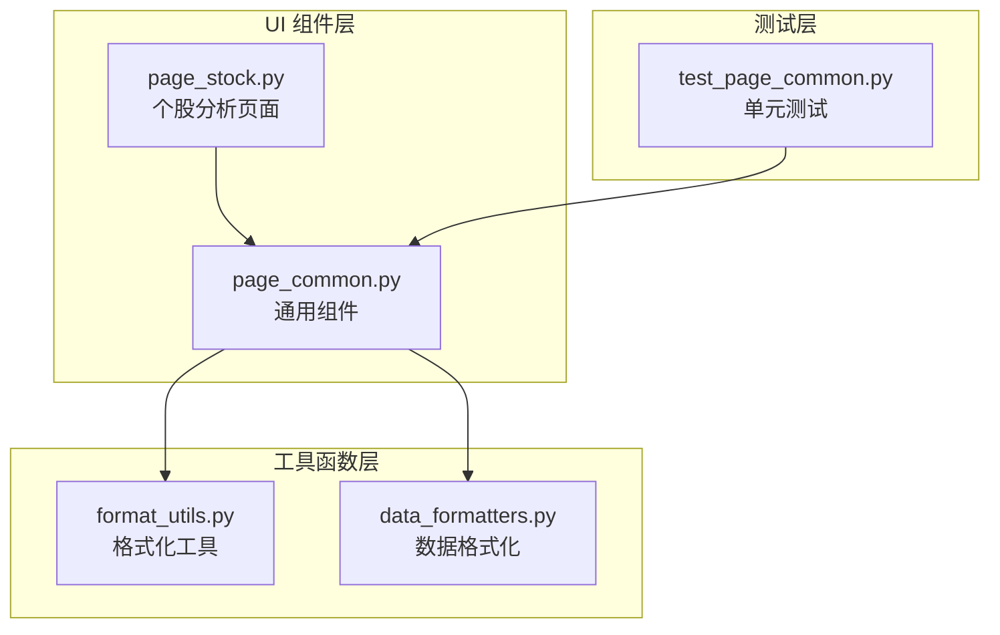
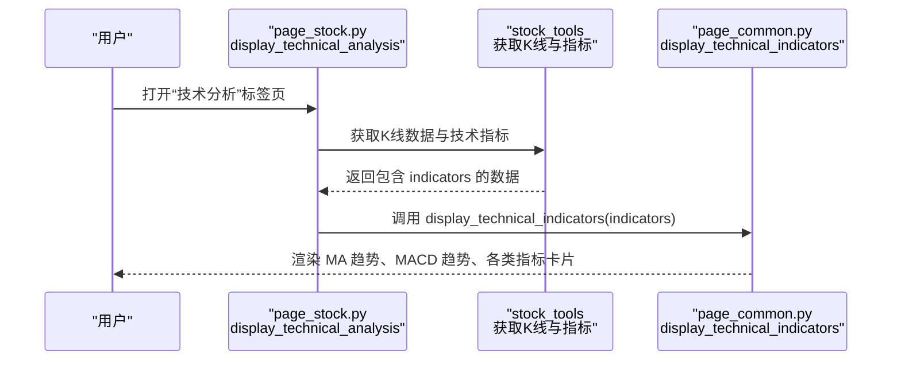
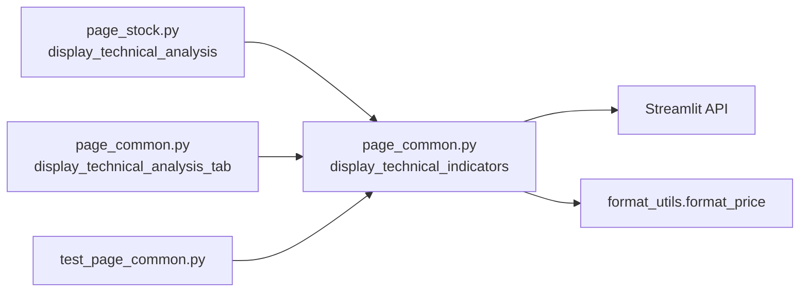
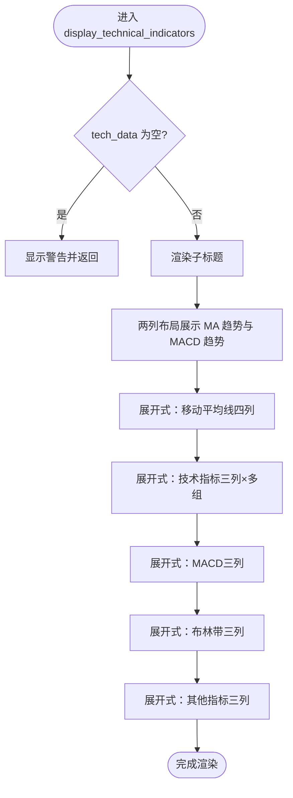

# 技术指标分析卡片

<cite>
**本文引用的文件**
- [page_common.py](file://ui/components/page_common.py)
- [API 文档](file://ui/components/API_DOCUMENTATION.md)
- [page_stock.py](file://ui/components/page_stock.py)
- [format_utils.py](file://utils/format_utils.py)
- [data_formatters.py](file://utils/data_formatters.py)
- [test_page_common.py](file://tests/unit/ui/test_page_common.py)
</cite>

## 目录
1. [简介](#简介)
2. [项目结构](#项目结构)
3. [核心组件](#核心组件)
4. [架构总览](#架构总览)
5. [详细组件分析](#详细组件分析)
6. [依赖关系分析](#依赖关系分析)
7. [性能考量](#性能考量)
8. [故障排查指南](#故障排查指南)
9. [结论](#结论)
10. [附录](#附录)

## 简介
本文件面向“技术指标分析卡片”组件，即函数 display_technical_indicators 的详细开发文档。该函数用于在 Web 界面中以卡片形式渲染技术分析指标，涵盖 MA 趋势、MACD 趋势、多组技术指标（MA5/10/20/60、RSI、KDJ、MACD、布林带、威廉指标、CCI 等），并以 Streamlit 的 metric 与 expander 实现可视化布局。文档将明确输入参数 tech_data 的数据结构要求，解释列布局（col1-col4、tech_col1-tech_col3 等）的设计逻辑，提供实际调用示例，说明与 format_price 等工具函数的集成方式，以及在个股分析和技术分析 Tab 中的复用场景，并总结常见问题与样式自定义方法。

## 项目结构
该组件位于 UI 组件层，属于可复用的通用组件，既可独立调用，也可由个股分析页面的“技术分析”标签页间接调用。

图表来源
- [page_common.py](file://ui/components/page_common.py#L1-L106)
- [page_stock.py](file://ui/components/page_stock.py#L493-L546)
- [format_utils.py](file://utils/format_utils.py#L81-L121)
- [data_formatters.py](file://utils/data_formatters.py#L44-L96)
- [test_page_common.py](file://tests/unit/ui/test_page_common.py#L28-L90)

章节来源
- [page_common.py](file://ui/components/page_common.py#L1-L106)
- [page_stock.py](file://ui/components/page_stock.py#L493-L546)

## 核心组件
- display_technical_indicators(tech_data: dict) -> None
  - 功能：以卡片形式展示各项技术指标数值，包含 MA 趋势、MACD 趋势、移动平均线、RSI/KDJ/MACD/布林带/威廉/CCI 等。
  - 输入：tech_data 字典，键名需与函数内部读取的键一致。
  - 输出：无（直接在 Streamlit 页面渲染）。
  - 关键特性：
    - 使用 st.metric 展示指标值；
    - 使用 st.expander 分组展示不同指标类别；
    - 使用 st.columns 实现多列布局；
    - 对缺失数据进行容错处理（N/A）；
    - 通过内联样式微调 metric 数值字体大小。

章节来源
- [page_common.py](file://ui/components/page_common.py#L16-L106)
- [API 文档](file://ui/components/API_DOCUMENTATION.md#L29-L60)

## 架构总览
该组件在个股分析页面中被“技术分析”标签页调用，后者负责获取 K 线与指标数据，再调用 display_technical_indicators 进行渲染。

图表来源
- [page_stock.py](file://ui/components/page_stock.py#L493-L546)
- [page_common.py](file://ui/components/page_common.py#L16-L106)

## 详细组件分析

### 函数签名与参数说明
- 函数：display_technical_indicators(tech_data)
- 参数：
  - tech_data: dict，技术指标数据字典。键名需与函数内部读取的键一致，例如：
    - 趋势类：ma_trend、macd_trend
    - 移动平均线：ma_5、ma_10、ma_20、ma_60
    - RSI：rsi_14
    - KDJ：kdj_k、kdj_d、kdj_j
    - MACD：macd、macd_signal、macd_histogram
    - 布林带：boll_upper、boll_middle、boll_lower
    - 其他：wr_14、cci_14
- 返回：None（直接渲染）

章节来源
- [API 文档](file://ui/components/API_DOCUMENTATION.md#L29-L60)
- [page_common.py](file://ui/components/page_common.py#L16-L106)

### 数据结构要求与字段映射
- 基础趋势
  - ma_trend：MA 趋势（如“多头排列”等）
  - macd_trend：MACD 趋势（如“金叉向上”等）
- 移动平均线
  - ma_5、ma_10、ma_20、ma_60：数值，使用 format_price 格式化
- 技术指标
  - rsi_14：RSI(14)，使用 format_price 格式化
  - kdj_k、kdj_d、kdj_j：KDJ 指标，使用 format_price 格式化
  - macd、macd_signal、macd_histogram：MACD 指标，保留 4 位小数
  - boll_upper、boll_middle、boll_lower：布林带三轨，使用 format_price 格式化
  - wr_14、cci_14：威廉指标、CCI 指标，使用 format_price 格式化

章节来源
- [page_common.py](file://ui/components/page_common.py#L34-L106)

### 可视化布局与列设计逻辑
- 基础信息区：两列布局（col1、col2），分别展示 MA 趋势与 MACD 趋势。
- 移动平均线区：展开式（expander），四列布局（ma_col1–ma_col4），展示 MA5/10/20/60。
- 技术指标区：展开式（expander），分为若干三列组：
  - 技术指标组（tech_col1–tech_col3）：RSI(14)、KDJ-K、KDJ-D
  - MACD 组（macd_col1–macd_col3）：MACD、MACD信号、MACD柱状
  - 布林带组（boll_col1–boll_col3）：上轨、中轨、下轨
  - 其他指标组（other_col1–other_col3）：威廉指标、CCI 指标、KDJ-J
- 容错策略：若某键不存在或值为 None，则显示 N/A；数值类型使用 format_price 或固定小数位格式化。

章节来源
- [page_common.py](file://ui/components/page_common.py#L34-L106)

### 与工具函数的集成
- format_price：用于价格类指标（MA、布林带上下轨等）的统一格式化。
- 内联样式：通过 st.markdown 注入 CSS，调整 metric 组件的数值字体大小，提升可读性。
- 与 data_formatters 的关系：data_formatters.format_technical_indicators 提供报告格式化版本，键名与本组件略有差异（如 ma5/ma10 等），但核心指标一致，便于理解数据结构。

章节来源
- [page_common.py](file://ui/components/page_common.py#L16-L33)
- [format_utils.py](file://utils/format_utils.py#L81-L121)
- [data_formatters.py](file://utils/data_formatters.py#L44-L96)

### 在个股分析与技术分析 Tab 中的复用
- 个股分析页面的“技术分析”标签页会先获取 K 线与技术指标数据，再调用 display_technical_analysis_tab，后者内部会调用 display_technical_indicators 进行渲染。
- 大盘分析页面同样提供“技术指标分析”标签页，通过 display_technical_analysis_tab 对指数进行技术分析，内部也会调用 display_technical_indicators。

章节来源
- [page_stock.py](file://ui/components/page_stock.py#L493-L546)
- [page_common.py](file://ui/components/page_common.py#L107-L164)

### 调用示例与最佳实践
- 独立调用示例（路径参考）：
  - [调用示例路径](file://ui/components/API_DOCUMENTATION.md#L46-L59)
- 在个股分析中调用：
  - [调用路径](file://ui/components/page_stock.py#L533-L540)
- 在大盘分析中调用：
  - [调用路径](file://ui/components/page_common.py#L155-L158)

章节来源
- [API 文档](file://ui/components/API_DOCUMENTATION.md#L29-L60)
- [page_stock.py](file://ui/components/page_stock.py#L533-L540)
- [page_common.py](file://ui/components/page_common.py#L155-L158)

### 错误处理与容错机制
- 空数据处理：当 tech_data 为空或为 None 时，函数会输出警告并提前返回，避免异常。
- 部分数据处理：若某些键缺失，对应指标显示为 N/A，不影响其他指标渲染。
- 单元测试覆盖：
  - 有效数据渲染：至少 11 个指标(metric)与至少 3 组列布局(columns)调用；
  - 部分数据渲染：至少 3 个指标(metric)；
  - 空数据：不抛异常；
  - None 数据：抛出异常（用于测试边界行为）。

章节来源
- [page_common.py](file://ui/components/page_common.py#L30-L33)
- [test_page_common.py](file://tests/unit/ui/test_page_common.py#L28-L90)

### 样式自定义与可读性优化
- 内联样式：通过注入 CSS，增大 metric 数值字体大小，提升视觉效果。
- 建议：如需进一步定制，可在应用层统一引入额外 CSS，或在组件内增加可配置参数（如字体大小、颜色主题等）。

章节来源
- [page_common.py](file://ui/components/page_common.py#L19-L26)

## 依赖关系分析
- 直接依赖
  - Streamlit：st.metric、st.columns、st.expander、st.subheader、st.markdown、st.warning
  - 工具函数：format_price（数值格式化）、format_risk_metrics（风险指标格式化，用于其他组件）
- 间接依赖
  - 个股分析页面：通过 display_technical_analysis 调用 display_technical_indicators
  - 大盘分析页面：通过 display_technical_analysis_tab 调用 display_technical_indicators
- 测试依赖
  - 单元测试对 metric/columns 调用次数进行断言，验证渲染行为

图表来源
- [page_common.py](file://ui/components/page_common.py#L16-L106)
- [page_stock.py](file://ui/components/page_stock.py#L493-L546)
- [test_page_common.py](file://tests/unit/ui/test_page_common.py#L28-L90)
- [format_utils.py](file://utils/format_utils.py#L81-L121)

## 性能考量
- 渲染复杂度：指标数量固定，渲染为 O(1)；列布局按固定数量拆分，开销极低。
- 数据访问：依赖字典键访问，时间复杂度 O(1)；对 None 值进行短路处理，避免多余计算。
- 格式化成本：format_price 为纯数值格式化，开销很小。
- 建议：在上游数据层尽量提供完整指标字典，减少前端空值判断与 N/A 显示。

[本节为通用指导，无需列出具体文件来源]

## 故障排查指南
- 现象：页面无任何技术指标显示
  - 可能原因：tech_data 为空或为 None
  - 处理：检查上游数据获取逻辑，确保传入非空字典
- 现象：部分指标显示为 N/A
  - 可能原因：缺少对应键或值为 None
  - 处理：补齐指标数据或在上游补全计算
- 现象：数值格式不符合预期
  - 可能原因：数值类型非数字或字符串
  - 处理：确保数值为数字类型，或在上游转换；format_price 对 None 返回默认值
- 现象：样式字体过小
  - 处理：组件内已注入 CSS 调整 metric 数值字体大小；如需进一步调整，可在应用层统一覆盖

章节来源
- [page_common.py](file://ui/components/page_common.py#L19-L26)
- [format_utils.py](file://utils/format_utils.py#L81-L121)

## 结论
display_technical_indicators 是一个结构清晰、可复用性强的技术指标渲染组件。它通过 Streamlit 的 metric 与 expander 实现直观的卡片式布局，借助 format_price 统一数值格式，并对空数据进行稳健处理。在个股与大盘分析中均可复用，满足日常技术分析展示需求。建议在上游完善指标数据结构与计算，保证渲染一致性与可读性。

[本节为总结性内容，无需列出具体文件来源]

## 附录

### 数据结构对照表（键名与用途）
- 趋势类
  - ma_trend：MA 趋势
  - macd_trend：MACD 趋势
- 移动平均线
  - ma_5、ma_10、ma_20、ma_60：MA5/10/20/60
- 技术指标
  - rsi_14：RSI(14)
  - kdj_k、kdj_d、kdj_j：KDJ 指标
  - macd、macd_signal、macd_histogram：MACD 指标
  - boll_upper、boll_middle、boll_lower：布林带三轨
  - wr_14、cci_14：威廉指标、CCI 指标

章节来源
- [page_common.py](file://ui/components/page_common.py#L34-L106)

### 调用流程图（函数内部）

图表来源
- [page_common.py](file://ui/components/page_common.py#L34-L106)