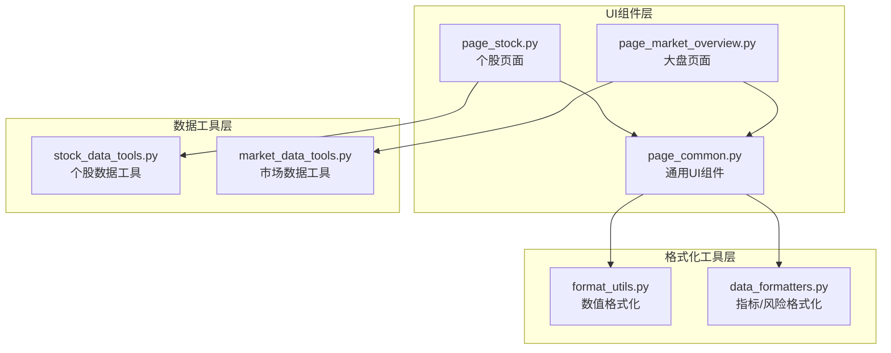
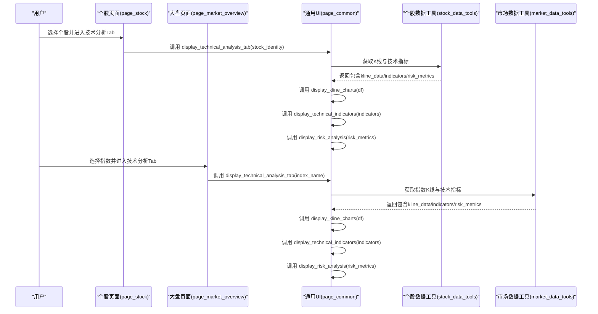
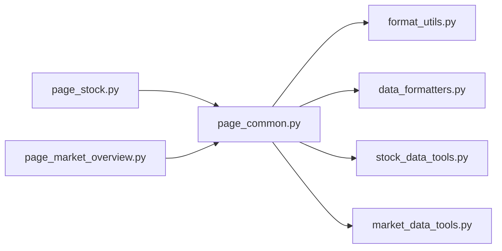

# 通用UI组件

<cite>
**本文引用的文件**
- [ui/components/page_common.py](file://ui/components/page_common.py)
- [ui/components/page_stock.py](file://ui/components/page_stock.py)
- [ui/components/page_market_overview.py](file://ui/components/page_market_overview.py)
- [tests/unit/ui/test_page_common.py](file://tests/unit/ui/test_page_common.py)
- [utils/format_utils.py](file://utils/format_utils.py)
- [utils/data_formatters.py](file://utils/data_formatters.py)
- [stock/stock_data_tools.py](file://stock/stock_data_tools.py)
- [market/market_data_tools.py](file://market/market_data_tools.py)
</cite>

## 目录
1. [简介](#简介)
2. [项目结构](#项目结构)
3. [核心组件](#核心组件)
4. [架构总览](#架构总览)
5. [组件详解](#组件详解)
6. [依赖关系分析](#依赖关系分析)
7. [性能考量](#性能考量)
8. [故障排查指南](#故障排查指南)
9. [结论](#结论)

## 简介
本文件面向“通用UI组件”参考文档，聚焦于页面级通用组件在个股分析与大盘分析中的复用方式与行为规范。重点覆盖以下四个函数：
- display_technical_indicators：展示技术指标分析卡片
- display_technical_analysis_tab：展示技术分析Tab（个股/大盘）
- display_risk_analysis：展示风险分析
- display_kline_charts：统一K线与成交量图表

文档将从接口参数、返回值、使用场景、调用示例、响应式布局、错误处理与Session State使用模式等方面进行系统化说明，并解释这些组件如何在个股页面与大盘页面中被复用，以及它们在保持UI一致性方面的作用。

## 项目结构
通用UI组件位于 ui/components/page_common.py，个股页面与大盘页面分别在 ui/components/page_stock.py 与 ui/components/page_market_overview.py 中调用这些组件。格式化工具位于 utils/format_utils.py 与 utils/data_formatters.py；数据获取工具分别由 stock/stock_data_tools.py 与 market/market_data_tools.py 提供。

图表来源
- [ui/components/page_common.py](file://ui/components/page_common.py#L1-L291)
- [ui/components/page_stock.py](file://ui/components/page_stock.py#L1-L884)
- [ui/components/page_market_overview.py](file://ui/components/page_market_overview.py#L1-L758)
- [stock/stock_data_tools.py](file://stock/stock_data_tools.py#L1-L709)
- [market/market_data_tools.py](file://market/market_data_tools.py#L1-L519)
- [utils/format_utils.py](file://utils/format_utils.py#L1-L194)
- [utils/data_formatters.py](file://utils/data_formatters.py#L1-L578)

章节来源
- [ui/components/page_common.py](file://ui/components/page_common.py#L1-L291)
- [ui/components/page_stock.py](file://ui/components/page_stock.py#L1-L884)
- [ui/components/page_market_overview.py](file://ui/components/page_market_overview.py#L1-L758)

## 核心组件
本节概述四个通用UI组件的职责与典型调用位置：
- display_technical_indicators：在个股与大盘技术分析Tab中展示各类技术指标卡片与展开区，统一指标呈现风格。
- display_technical_analysis_tab：根据传入的个股标识或指数名称，统一获取K线与技术指标数据并调用上述组件进行展示。
- display_risk_analysis：根据风险指标字典，优先使用格式化器生成Markdown文本，其次展示表格摘要，最后兜底显示原始JSON。
- display_kline_charts：接收标准化的K线DataFrame，绘制K线与均线、成交量双图，支持股票与指数两种类型。

章节来源
- [ui/components/page_common.py](file://ui/components/page_common.py#L16-L291)

## 架构总览
通用组件在个股与大盘页面中的调用关系如下：

图表来源
- [ui/components/page_stock.py](file://ui/components/page_stock.py#L493-L546)
- [ui/components/page_market_overview.py](file://ui/components/page_market_overview.py#L537-L597)
- [ui/components/page_common.py](file://ui/components/page_common.py#L107-L190)
- [stock/stock_data_tools.py](file://stock/stock_data_tools.py#L132-L190)
- [market/market_data_tools.py](file://market/market_data_tools.py#L307-L351)

## 组件详解

### display_technical_indicators
- 职责：以卡片与展开区的形式展示技术指标，包含MA趋势、MACD趋势、移动平均线、RSI/KDJ/MACD/BOLL/WR/CCI等指标，并统一数值格式化。
- 参数
  - tech_data: dict，技术指标字典，键名需与组件内部读取一致（如 MA5/MA10/RSI/…）。
- 返回值：无（直接在Streamlit容器内渲染UI）
- 使用场景
  - 在个股技术分析Tab中展示个股技术指标卡片
  - 在大盘技术分析Tab中展示指数技术指标卡片
- 调用示例（路径）
  - [个股技术分析Tab中调用](file://ui/components/page_stock.py#L533-L546)
  - [大盘技术分析Tab中调用](file://ui/components/page_market_overview.py#L575-L579)
- 响应式布局
  - 使用两列布局展示基础趋势，使用多列与expander组织指标分组，便于在不同屏幕尺寸下折叠/展开。
- 错误处理
  - 当传入空/None时，组件会提示“未获取到技术指标数据”，避免异常。
- Session State使用模式
  - 该函数不直接读写Session State，但其调用方（如 display_technical_analysis_tab）会从 st.session_state 读取 use_cache 等开关。
- 复杂度与性能
  - 指标渲染为纯前端展示逻辑，复杂度与指标数量线性相关；通过expander控制初始渲染范围，减少首屏压力。

章节来源
- [ui/components/page_common.py](file://ui/components/page_common.py#L16-L105)
- [ui/components/page_stock.py](file://ui/components/page_stock.py#L533-L546)
- [ui/components/page_market_overview.py](file://ui/components/page_market_overview.py#L575-L579)

### display_technical_analysis_tab
- 职责：根据传入的个股标识或指数名称，统一获取K线与技术指标数据，并调用 display_kline_charts、display_technical_indicators、display_risk_analysis 进行展示。
- 参数
  - stock_identity: dict，个股标识（包含 code/name/market_name），与个股数据工具交互
  - index_name: str，指数名称（如“上证指数”），与市场数据工具交互
  - 注意：二者只能二选一，否则报错
- 返回值：无（直接在Streamlit容器内渲染UI）
- 使用场景
  - 个股页面技术分析Tab
  - 大盘页面技术分析Tab
- 调用示例（路径）
  - [个股技术分析Tab入口](file://ui/components/page_stock.py#L493-L546)
  - [大盘技术分析Tab入口](file://ui/components/page_market_overview.py#L537-L597)
- 响应式布局
  - 通过Tab与expander组织内容层级，保证在窄屏设备上仍可逐步展开查看。
- 错误处理
  - 对参数校验、数据获取失败、异常捕获进行统一处理，并在UI中提示错误与详情。
- Session State使用模式
  - 从 st.session_state 读取 use_cache/market_use_cache 控制是否使用缓存与强制刷新。
- 复杂度与性能
  - 数据获取与图表渲染为主，组件本身为调度器角色，复杂度取决于外部数据获取与Plotly渲染。

章节来源
- [ui/components/page_common.py](file://ui/components/page_common.py#L107-L190)
- [ui/components/page_stock.py](file://ui/components/page_stock.py#L493-L546)
- [ui/components/page_market_overview.py](file://ui/components/page_market_overview.py#L537-L597)

### display_risk_analysis
- 职责：根据风险指标字典，优先使用格式化器生成Markdown文本并展示；若存在 summary_table 则以表格形式展示；否则兜底显示原始JSON。
- 参数
  - risk_metrics: dict，风险指标字典，可包含 summary_table 与 error 字段
- 返回值：无（直接在Streamlit容器内渲染UI）
- 使用场景
  - 个股与大盘页面的风险分析展示
- 调用示例（路径）
  - [个股风险分析调用](file://ui/components/page_stock.py#L543-L545)
  - [大盘风险分析调用](file://ui/components/page_market_overview.py#L586-L591)
- 响应式布局
  - 使用expander折叠/展开，便于在移动端查看。
- 错误处理
  - 当 risk_metrics 含 error 字段时，直接提示错误；否则按格式化器输出或表格/JSON兜底。
- Session State使用模式
  - 该函数不直接读写Session State。
- 复杂度与性能
  - 文本格式化与表格渲染，复杂度与指标项数量线性相关。

章节来源
- [ui/components/page_common.py](file://ui/components/page_common.py#L166-L190)
- [ui/components/page_stock.py](file://ui/components/page_stock.py#L543-L545)
- [ui/components/page_market_overview.py](file://ui/components/page_market_overview.py#L586-L591)
- [utils/data_formatters.py](file://utils/data_formatters.py#L99-L195)

### display_kline_charts
- 职责：接收标准化的K线DataFrame，绘制K线与均线、成交量双图；支持股票与指数两种类型。
- 参数
  - df: DataFrame，必须包含 datetime/open/high/low/close/volume 列
  - chart_type: str，"stock" 或 "index"
  - title_prefix: str，标题前缀（如股票名称或指数名称）
- 返回值：无（直接在Streamlit容器内渲染UI）
- 使用场景
  - 个股与大盘页面的K线与成交量展示
- 调用示例（路径）
  - [个股K线调用](file://ui/components/page_stock.py#L533-L536)
  - [大盘K线调用](file://ui/components/page_market_overview.py#L559-L567)
- 响应式布局
  - 使用 use_container_width=True，图表随容器宽度自适应；上下两张图高度固定，保证视觉平衡。
- 错误处理
  - 当 df 为空或缺少必要列时，提示“无K线数据可显示”或“暂无成交量数据”。
- Session State使用模式
  - 该函数不直接读写Session State。
- 复杂度与性能
  - Plotly渲染复杂度与数据点数量近似线性；通过固定高度与容器宽度提升渲染效率。

章节来源
- [ui/components/page_common.py](file://ui/components/page_common.py#L192-L291)
- [ui/components/page_stock.py](file://ui/components/page_stock.py#L533-L536)
- [ui/components/page_market_overview.py](file://ui/components/page_market_overview.py#L559-L567)

## 依赖关系分析
- 组件耦合
  - page_common 与 format_utils、data_formatters：用于指标/风险的格式化与展示
  - page_common 与 stock_data_tools、market_data_tools：用于获取K线与技术指标数据
  - page_stock 与 page_market_overview：分别在个股与大盘页面中调用 page_common 的组件
- 外部依赖
  - Streamlit：用于UI渲染与Session State
  - Plotly：用于K线与成交量图表
  - pandas：用于DataFrame处理
- 潜在循环依赖
  - 无直接循环；page_common 仅向下依赖工具层，不反向依赖页面层

图表来源
- [ui/components/page_common.py](file://ui/components/page_common.py#L1-L291)
- [ui/components/page_stock.py](file://ui/components/page_stock.py#L1-L884)
- [ui/components/page_market_overview.py](file://ui/components/page_market_overview.py#L1-L758)
- [utils/format_utils.py](file://utils/format_utils.py#L1-L194)
- [utils/data_formatters.py](file://utils/data_formatters.py#L1-L578)
- [stock/stock_data_tools.py](file://stock/stock_data_tools.py#L1-L709)
- [market/market_data_tools.py](file://market/market_data_tools.py#L1-L519)

章节来源
- [ui/components/page_common.py](file://ui/components/page_common.py#L1-L291)
- [ui/components/page_stock.py](file://ui/components/page_stock.py#L1-L884)
- [ui/components/page_market_overview.py](file://ui/components/page_market_overview.py#L1-L758)

## 性能考量
- 缓存策略
  - 个股与大盘页面均通过 st.session_state 读取 use_cache/market_use_cache 控制是否使用缓存；当禁用缓存时，组件会将 force_refresh 设为True，从而触发强制刷新。
- 数据获取
  - 个股与大盘页面在调用 display_technical_analysis_tab 时，会根据参数选择不同的数据工具（stock_data_tools 或 market_data_tools），并返回包含 kline_data、indicators、risk_metrics 的结构化数据。
- 图表渲染
  - K线与成交量双图采用固定高度与容器自适应，减少不必要的重排；仅在必要时渲染expander内的内容，降低首屏渲染压力。
- 格式化
  - 指标与风险的格式化由 format_utils 与 data_formatters 提供，避免在UI层重复实现格式化逻辑，提高一致性与性能。

章节来源
- [ui/components/page_common.py](file://ui/components/page_common.py#L124-L164)
- [ui/components/page_stock.py](file://ui/components/page_stock.py#L493-L546)
- [ui/components/page_market_overview.py](file://ui/components/page_market_overview.py#L537-L597)
- [utils/format_utils.py](file://utils/format_utils.py#L1-L194)
- [utils/data_formatters.py](file://utils/data_formatters.py#L1-L578)

## 故障排查指南
- 技术指标展示为空
  - 检查传入的 tech_data 是否为空或键名不匹配；组件会在空数据时提示“未获取到技术指标数据”
  - 参考：[display_technical_indicators](file://ui/components/page_common.py#L30-L33)
- 技术分析Tab报错
  - 确认传入的 stock_identity 与 index_name 是否满足“二选一”的约束；检查 st.session_state 中 use_cache/market_use_cache 的取值
  - 参考：[display_technical_analysis_tab](file://ui/components/page_common.py#L116-L122)
- 风险分析未显示
  - 若 risk_metrics 含 error 字段，组件会直接提示错误；否则检查是否存在 summary_table 或是否能被格式化器处理
  - 参考：[display_risk_analysis](file://ui/components/page_common.py#L166-L190)
- K线图无法显示
  - 检查 df 是否为空或缺少必要列（datetime/open/high/low/close/volume）；组件会在空数据时提示“无K线数据可显示”
  - 参考：[display_kline_charts](file://ui/components/page_common.py#L201-L203)

章节来源
- [ui/components/page_common.py](file://ui/components/page_common.py#L30-L33)
- [ui/components/page_common.py](file://ui/components/page_common.py#L116-L122)
- [ui/components/page_common.py](file://ui/components/page_common.py#L166-L190)
- [ui/components/page_common.py](file://ui/components/page_common.py#L201-L203)

## 结论
通用UI组件通过统一的接口与清晰的职责划分，在个股与大盘页面中实现了高度一致的展示体验。它们以简洁的参数约定、稳健的错误处理与灵活的Session State使用模式，确保了在不同业务场景下的可复用性与可维护性。配合格式化工具与数据工具层，组件在性能与一致性之间取得了良好平衡，是构建可扩展金融分析界面的重要基石。