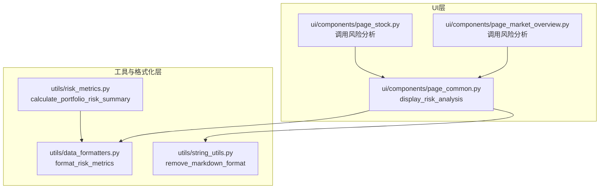
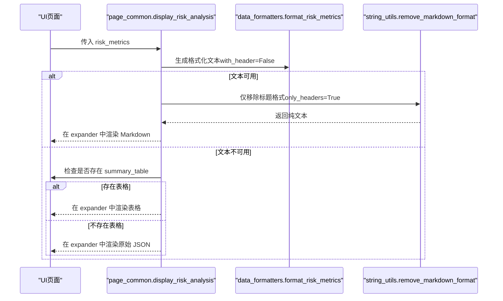
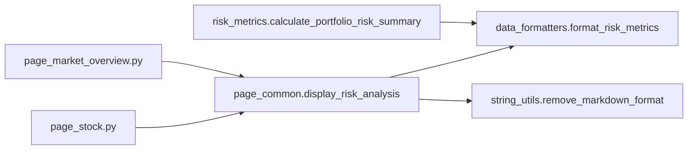

# 风险分析展示组件

<cite>
**本文引用的文件**
- [ui/components/page_common.py](file://ui/components/page_common.py)
- [utils/data_formatters.py](file://utils/data_formatters.py)
- [utils/string_utils.py](file://utils/string_utils.py)
- [utils/risk_metrics.py](file://utils/risk_metrics.py)
- [ui/components/page_stock.py](file://ui/components/page_stock.py)
- [ui/components/page_market_overview.py](file://ui/components/page_market_overview.py)
</cite>

## 目录
1. [简介](#简介)
2. [项目结构](#项目结构)
3. [核心组件](#核心组件)
4. [架构总览](#架构总览)
5. [详细组件分析](#详细组件分析)
6. [依赖关系分析](#依赖关系分析)
7. [性能考量](#性能考量)
8. [故障排查指南](#故障排查指南)
9. [结论](#结论)
10. [附录](#附录)

## 简介
本文件面向“风险分析展示组件”（display_risk_analysis）的全面文档化目标，重点说明以下内容：
- 输入参数 risk_metrics 的结构定义与字段含义
- 三层展示逻辑的优先级与判定机制
- 与 remove_markdown_format 工具函数的协作方式（仅移除标题格式以适配 Streamlit 渲染）
- 不同数据状态下的渲染效果示意
- expander 折叠面板的用户体验设计意图
- 组件在系统中的调用上下文（个股分析、市场报告等）
- 集成最佳实践与常见错误处理方案

## 项目结构
该组件位于 UI 层的公共组件模块中，负责将风险指标数据以多种格式呈现给用户。其上游数据来源包括个股与市场分析流程中的风险指标计算与格式化模块。

图表来源
- [ui/components/page_common.py](file://ui/components/page_common.py#L166-L190)
- [ui/components/page_stock.py](file://ui/components/page_stock.py#L542-L545)
- [ui/components/page_market_overview.py](file://ui/components/page_market_overview.py#L574-L591)
- [utils/data_formatters.py](file://utils/data_formatters.py#L99-L195)
- [utils/string_utils.py](file://utils/string_utils.py#L21-L92)
- [utils/risk_metrics.py](file://utils/risk_metrics.py#L128-L196)

章节来源
- [ui/components/page_common.py](file://ui/components/page_common.py#L166-L190)
- [ui/components/page_stock.py](file://ui/components/page_stock.py#L542-L545)
- [ui/components/page_market_overview.py](file://ui/components/page_market_overview.py#L574-L591)
- [utils/data_formatters.py](file://utils/data_formatters.py#L99-L195)
- [utils/string_utils.py](file://utils/string_utils.py#L21-L92)
- [utils/risk_metrics.py](file://utils/risk_metrics.py#L128-L196)

## 核心组件
- 组件名称：display_risk_analysis
- 所属文件：ui/components/page_common.py
- 职责：根据 risk_metrics 的可用性，按优先级依次渲染：
  1) 格式化的风险指标文本（由 format_risk_metrics 生成）
  2) summary_table 表格数据
  3) 原始 JSON 数据回退展示
- 协作函数：
  - format_risk_metrics：将风险指标字典格式化为中文 Markdown 文本
  - remove_markdown_format：仅移除标题格式，保留正文样式以适配 Streamlit 渲染

章节来源
- [ui/components/page_common.py](file://ui/components/page_common.py#L166-L190)
- [utils/data_formatters.py](file://utils/data_formatters.py#L99-L195)
- [utils/string_utils.py](file://utils/string_utils.py#L21-L92)

## 架构总览
组件在个股与市场分析页面中被调用，分别从个股 K 线数据与市场技术指标中提取风险指标，再交由 display_risk_analysis 进行展示。

图表来源
- [ui/components/page_common.py](file://ui/components/page_common.py#L166-L190)
- [utils/data_formatters.py](file://utils/data_formatters.py#L99-L195)
- [utils/string_utils.py](file://utils/string_utils.py#L21-L92)

## 详细组件分析

### 输入参数与数据结构定义
- 参数名称：risk_metrics
- 类型：字典（dict）
- 结构要点（字段来自风险指标计算模块）：
  - period_analysis：数据周期分析
    - data_length：数据长度（天）
    - price_change_pct：期间涨跌幅（百分比）
    - trend_direction：趋势方向（up/down/sideways）
  - volatility_analysis：波动率分析
    - annual_volatility：年化波动率
    - recent_volatility：近期波动率
    - volatility_trend：波动趋势（increasing/decreasing/stable）
  - risk_metrics：核心风险指标
    - max_drawdown：最大回撤
    - sharpe_ratio：夏普比率
    - var_5pct：VaR(5%)
    - cvar_5pct：CVaR(5%)
  - return_statistics：收益统计
    - daily_return_mean：日均收益率
    - daily_return_std：日收益标准差
    - positive_days_ratio：上涨日占比
    - max_single_day_gain：单日最大涨幅
    - max_single_day_loss：单日最大跌幅
  - risk_assessment：风险评估
    - risk_level：风险等级（low/medium/high）
    - stability：稳定性（stable/unstable/volatile）
    - trend_strength：趋势强度（weak/moderate/strong）
  - summary_table：风险指标汇总表（DataFrame 转换为字典列表）

章节来源
- [utils/risk_metrics.py](file://utils/risk_metrics.py#L128-L196)
- [utils/data_formatters.py](file://utils/data_formatters.py#L99-L195)

### 三层展示逻辑与优先级
- 优先级顺序：
  1) 格式化的风险指标文本（format_risk_metrics 生成）
  2) summary_table 表格数据
  3) 原始 JSON 数据（回退）
- 判定机制：
  - 若 risk_metrics 为 None 或包含 error 字段，则直接报错并返回
  - 否则先尝试生成格式化文本；若文本非空，则在 expander 中渲染
  - 若无格式化文本但存在 summary_table，则在 expander 中渲染表格
  - 若以上皆无且无 error，则在 expander 中渲染原始 JSON

章节来源
- [ui/components/page_common.py](file://ui/components/page_common.py#L166-L190)

### 与 remove_markdown_format 的协作
- 作用：仅移除标题格式，保留正文的粗体、列表、换行等结构，使 Streamlit 的 st.markdown 能正确渲染
- 调用时机：当格式化文本可用时，在渲染前调用 remove_markdown_format(formatted_risk_text, only_headers=True)
- 设计意图：既保持中文 Markdown 的可读性，又避免标题层级导致的样式冲突

章节来源
- [utils/string_utils.py](file://utils/string_utils.py#L21-L92)
- [ui/components/page_common.py](file://ui/components/page_common.py#L177-L179)

### 用户体验与 expander 设计
- 三个折叠面板分别承载不同层级的信息：
  - “详细风险分析”：默认展开，展示格式化文本
  - “风险分析表格”：默认折叠，展示 summary_table
  - “风险分析摘要”：默认展开，展示原始 JSON（回退）
- 设计意图：
  - 降低首次加载的信息密度，提升可读性
  - 便于用户按需展开查看更详细或原始数据
  - 保持交互一致性，避免一次性堆叠过多内容

章节来源
- [ui/components/page_common.py](file://ui/components/page_common.py#L177-L190)

### 调用上下文与集成位置
- 个股分析页面：在技术分析 Tab 中调用，从个股 K 线数据中提取 risk_metrics 并渲染
- 市场报告页面：在技术分析 Tab 中调用，从市场技术指标中提取 risk_metrics 并渲染

章节来源
- [ui/components/page_stock.py](file://ui/components/page_stock.py#L542-L545)
- [ui/components/page_market_overview.py](file://ui/components/page_market_overview.py#L574-L591)

### 渲染效果示意（文字描述）
- 格式化文本可用时：
  - 展示“详细风险分析”面板，内容为中文 Markdown 风格的结构化文本
  - 使用 remove_markdown_format 仅移除标题层级，保留正文格式
- 存在 summary_table 时：
  - 展示“风险分析表格”面板，以表格形式呈现核心指标
- 以上均不可用时：
  - 展示“风险分析摘要”面板，以 JSON 形式回退显示

章节来源
- [ui/components/page_common.py](file://ui/components/page_common.py#L166-L190)

### 与风险指标计算的关系
- 风险指标字典由 calculate_portfolio_risk_summary 生成，包含上述字段与 summary_table
- format_risk_metrics 将该字典转换为中文 Markdown 文本，供 display_risk_analysis 渲染

章节来源
- [utils/risk_metrics.py](file://utils/risk_metrics.py#L128-L196)
- [utils/data_formatters.py](file://utils/data_formatters.py#L99-L195)

## 依赖关系分析

图表来源
- [ui/components/page_common.py](file://ui/components/page_common.py#L166-L190)
- [utils/data_formatters.py](file://utils/data_formatters.py#L99-L195)
- [utils/string_utils.py](file://utils/string_utils.py#L21-L92)
- [utils/risk_metrics.py](file://utils/risk_metrics.py#L128-L196)
- [ui/components/page_stock.py](file://ui/components/page_stock.py#L542-L545)
- [ui/components/page_market_overview.py](file://ui/components/page_market_overview.py#L574-L591)

章节来源
- [ui/components/page_common.py](file://ui/components/page_common.py#L166-L190)
- [utils/data_formatters.py](file://utils/data_formatters.py#L99-L195)
- [utils/string_utils.py](file://utils/string_utils.py#L21-L92)
- [utils/risk_metrics.py](file://utils/risk_metrics.py#L128-L196)
- [ui/components/page_stock.py](file://ui/components/page_stock.py#L542-L545)
- [ui/components/page_market_overview.py](file://ui/components/page_market_overview.py#L574-L591)

## 性能考量
- 文本生成与渲染：
  - format_risk_metrics 对 risk_metrics 的字段进行逐项拼接，复杂度与字段数量线性相关
  - remove_markdown_format 为正则替换，复杂度与文本长度线性相关
- 表格渲染：
  - summary_table 为 DataFrame 转换后的字典列表，渲染性能取决于数据规模
- 建议：
  - 控制 risk_metrics 字段数量与精度，避免冗余字段
  - 对 summary_table 限制展示条目数量，必要时进行分页或筛选
  - 在 UI 层对 expander 的默认展开状态进行合理控制，减少一次性渲染压力

[本节为通用指导，无需特定文件引用]

## 故障排查指南
- 常见错误场景与处理：
  - risk_metrics 为 None 或包含 error 字段：组件会直接显示错误信息并返回，无需继续渲染
  - 格式化文本为空但存在 summary_table：优先渲染表格
  - 无格式化文本且无 summary_table：回退到 JSON 渲染
- 排查步骤：
  - 确认上游数据来源（个股 K 线或市场技术指标）是否成功返回 risk_metrics
  - 检查 risk_metrics 是否包含所需字段（如 period_analysis、risk_metrics、summary_table 等）
  - 若仅标题格式异常，确认 remove_markdown_format 的调用是否正确（only_headers=True）
- 常见问题定位：
  - 格式化文本渲染异常：检查 format_risk_metrics 的字段是否存在与命名是否一致
  - 表格渲染异常：检查 summary_table 的结构是否为字典列表
  - JSON 回退异常：确认 risk_metrics 非空且不含 error

章节来源
- [ui/components/page_common.py](file://ui/components/page_common.py#L166-L190)
- [utils/data_formatters.py](file://utils/data_formatters.py#L99-L195)
- [utils/string_utils.py](file://utils/string_utils.py#L21-L92)

## 结论
display_risk_analysis 通过三层优先级展示策略，兼顾可读性与灵活性，既能以中文 Markdown 提供结构化解读，也能以表格与 JSON 形式满足不同用户的阅读习惯。配合 remove_markdown_format 的标题格式移除，确保在 Streamlit 环境中的稳定渲染。在个股与市场分析场景中，该组件作为风险信息的统一出口，提升了分析报告的一致性与用户体验。

[本节为总结性内容，无需特定文件引用]

## 附录

### 最佳实践清单
- 上游数据校验：
  - 确保 risk_metrics 字段完整，特别是 risk_metrics 与 summary_table
- UI 交互优化：
  - 默认展开“详细风险分析”，折叠“风险分析表格”与“风险分析摘要”
  - 对 summary_table 限制展示条目，避免表格过大影响性能
- 文本渲染：
  - 保持 format_risk_metrics 的字段命名与 risk_metrics 一致
  - 使用 remove_markdown_format 的 only_headers=True，避免标题层级破坏布局
- 错误处理：
  - 对 None 与 error 字段进行前置判断，避免异常传播
  - 在 UI 层提供“错误详情”折叠面板，便于调试

[本节为通用指导，无需特定文件引用]