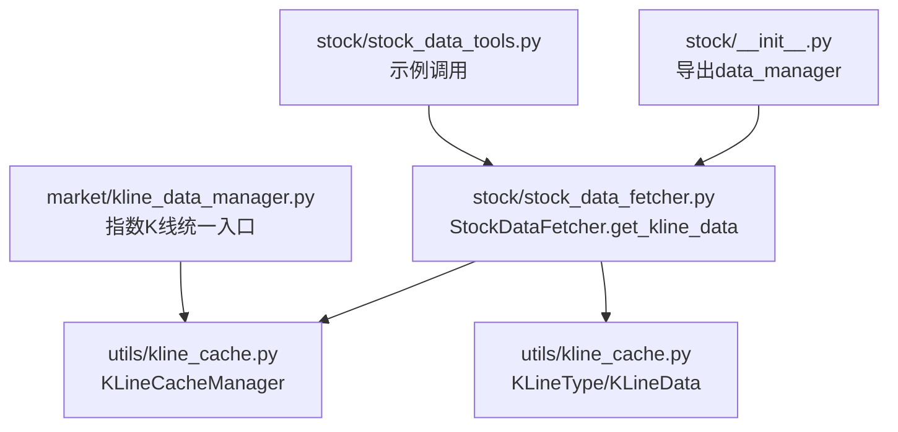
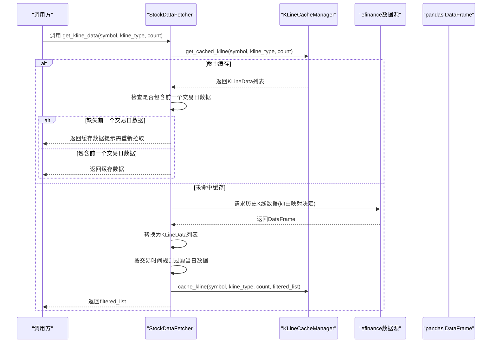
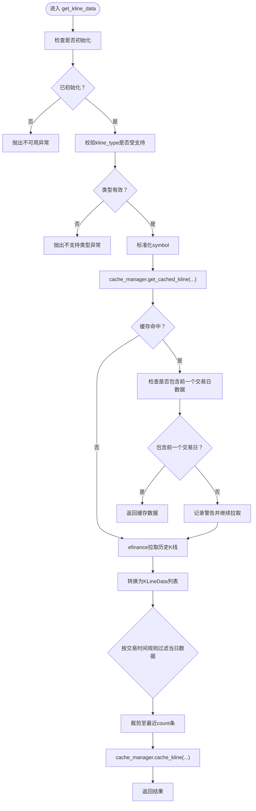
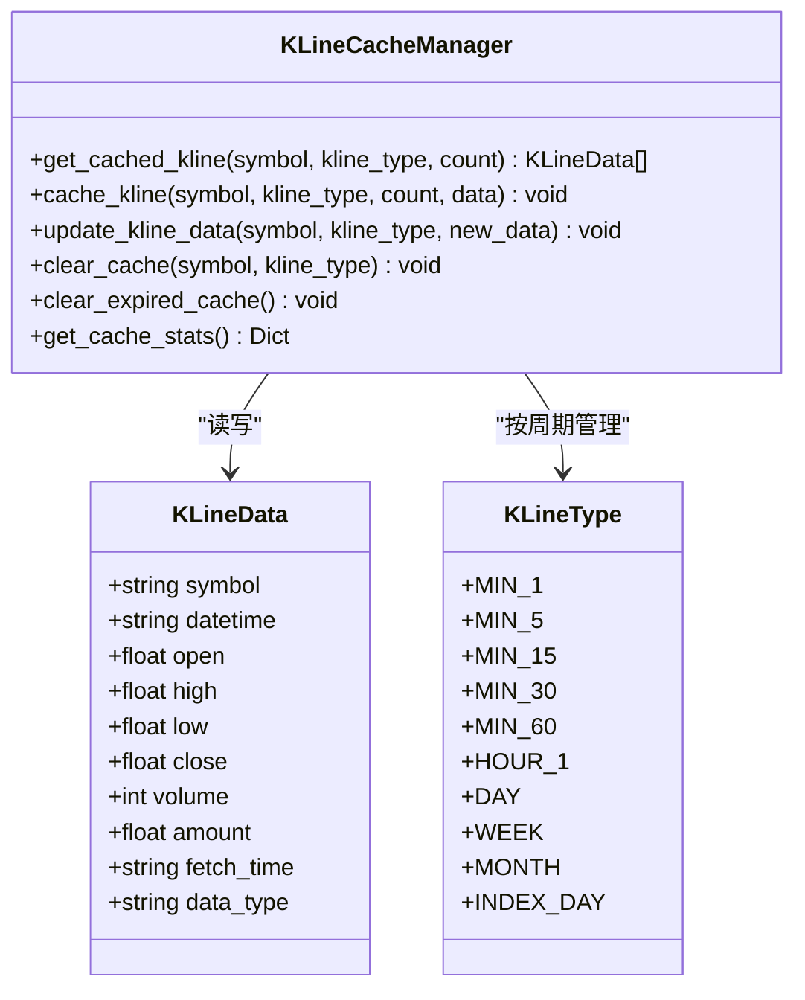
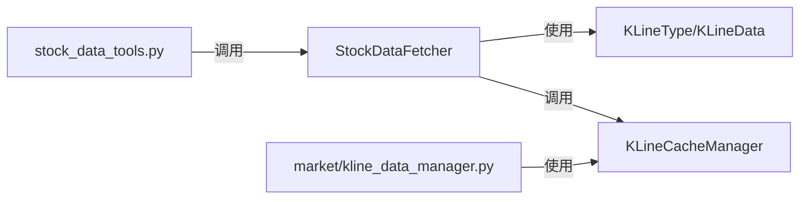

# K线数据API

<cite>
**本文引用的文件**
- [stock/stock_data_fetcher.py](file://stock/stock_data_fetcher.py)
- [utils/kline_cache.py](file://utils/kline_cache.py)
- [stock/__init__.py](file://stock/__init__.py)
- [stock/stock_data_tools.py](file://stock/stock_data_tools.py)
- [market/kline_data_manager.py](file://market/kline_data_manager.py)
</cite>

## 目录
1. [简介](#简介)
2. [项目结构](#项目结构)
3. [核心组件](#核心组件)
4. [架构总览](#架构总览)
5. [详细组件分析](#详细组件分析)
6. [依赖关系分析](#依赖关系分析)
7. [性能考量](#性能考量)
8. [故障排查指南](#故障排查指南)
9. [结论](#结论)
10. [附录](#附录)

## 简介
本文件为K线数据API的权威参考，聚焦于StockDataFetcher类的get_kline_data方法，系统阐述以下要点：
- 参数语义：symbol、kline_type、count的含义与用法
- K线类型映射关系：从KLineType枚举到efinance内部klt参数的映射
- 缓存机制：cache_manager在utils/kline_cache.py中的作用、缓存获取/存储/过期策略
- 智能数据包含规则：日K线在16:30收盘后才包含当日数据；分钟级K线始终排除当日数据
- 返回结构：KLineData列表的字段与用途
- 实际调用示例：如何获取不同周期的K线数据

## 项目结构
围绕K线数据API的关键文件组织如下：
- stock/stock_data_fetcher.py：提供get_kline_data方法，封装efinance数据源访问与缓存交互
- utils/kline_cache.py：定义KLineType/KLineData数据结构与KLineCacheManager缓存管理器
- stock/__init__.py：导出KLineData、KLineType、StockDataFetcher及全局data_manager
- stock/stock_data_tools.py：演示如何通过data_manager获取K线并进一步加工
- market/kline_data_manager.py：指数K线的统一入口，展示KLineData列表到DataFrame的转换流程

图表来源
- [stock/stock_data_fetcher.py](file://stock/stock_data_fetcher.py#L135-L224)
- [utils/kline_cache.py](file://utils/kline_cache.py#L11-L45)
- [stock/__init__.py](file://stock/__init__.py#L28-L56)
- [stock/stock_data_tools.py](file://stock/stock_data_tools.py#L132-L189)
- [market/kline_data_manager.py](file://market/kline_data_manager.py#L147-L178)

章节来源
- [stock/stock_data_fetcher.py](file://stock/stock_data_fetcher.py#L135-L224)
- [utils/kline_cache.py](file://utils/kline_cache.py#L11-L45)
- [stock/__init__.py](file://stock/__init__.py#L28-L56)

## 核心组件
- StockDataFetcher：封装K线数据获取逻辑，负责与efinance交互、数据清洗、缓存命中与回退策略、按交易时间智能剔除当日数据等
- KLineCacheManager：基于CSV的缓存管理器，提供缓存读取、写入、增量更新、过期清理、统计查询等功能
- KLineType/KLineData：K线类型与数据结构定义，确保跨模块一致的数据契约

章节来源
- [stock/stock_data_fetcher.py](file://stock/stock_data_fetcher.py#L45-L62)
- [utils/kline_cache.py](file://utils/kline_cache.py#L11-L45)
- [utils/kline_cache.py](file://utils/kline_cache.py#L46-L116)

## 架构总览
下图展示了get_kline_data的调用链路与缓存交互：

图表来源
- [stock/stock_data_fetcher.py](file://stock/stock_data_fetcher.py#L135-L224)
- [utils/kline_cache.py](file://utils/kline_cache.py#L138-L206)

## 详细组件分析

### StockDataFetcher.get_kline_data 方法详解
- 功能：获取指定股票、周期、数量的K线数据，优先使用缓存，必要时从efinance拉取并写入缓存
- 参数
  - symbol：股票代码，自动大写与去空白
  - kline_type：K线周期，必须为KLineType枚举之一
  - count：返回最近条数上限
- 关键行为
  - 缓存命中：若缓存存在且包含前一个交易日数据，则直接返回
  - 数据拉取：若未命中或缺少前一个交易日数据，则从efinance拉取
  - 交易时间规则：
    - 日K线：仅在16:30之后才包含当日数据；否则剔除当日数据
    - 分钟级K线：始终剔除当日数据
  - 结果裁剪：最终结果保留最近count条
  - 缓存写入：将过滤后的KLineData列表写入缓存
  - 回退策略：拉取失败时若已有缓存则返回缓存数据

图表来源
- [stock/stock_data_fetcher.py](file://stock/stock_data_fetcher.py#L135-L224)

章节来源
- [stock/stock_data_fetcher.py](file://stock/stock_data_fetcher.py#L135-L224)

### K线类型映射关系（KLineType → efinance klt）
- 映射表
  - KLineType.MIN_1 → 1
  - KLineType.MIN_5 → 5
  - KLineType.MIN_15 → 15
  - KLineType.MIN_30 → 30
  - KLineType.MIN_60 → 60
  - KLineType.DAY → 101
  - KLineType.WEEK → 102
  - KLineType.MONTH → 103
- 说明：该映射用于efinance的历史K线请求参数klt

章节来源
- [stock/stock_data_fetcher.py](file://stock/stock_data_fetcher.py#L53-L62)

### 缓存机制工作原理（KLineCacheManager）
- 缓存介质：以CSV文件按周期分片存储，文件名为kline_{kline_type.value}.csv
- 缓存目录：默认位于项目根目录下的data/cache
- 主要方法
  - get_cached_kline：按symbol+周期+count读取并返回KLineData列表，同时过滤过期数据
  - cache_kline：替换指定symbol在该周期内的全部历史数据
  - update_kline_data：按datetime增量合并新旧数据
  - clear_cache/clear_expired_cache：清理指定symbol或周期的缓存，或清理过期数据
  - get_cache_stats：统计缓存文件数量、大小、记录数、符号分布等
- 过期策略（按周期）
  - 日线/指数日线：历史数据永久有效；当日数据在4小时内有效
  - 1分钟：1分钟内有效
  - 5分钟：5分钟内有效
  - 15分钟：15分钟内有效
  - 30分钟：30分钟内有效
  - 60分钟/1小时：1小时内有效
  - 周线/月线：1天内有效
- 新鲜度判断
  - 历史数据：T-2之前的日线数据永久有效；非日线数据1小时前即视为历史
  - 当日/当前数据：依据上述“过期策略”判定是否仍新鲜

图表来源
- [utils/kline_cache.py](file://utils/kline_cache.py#L11-L45)
- [utils/kline_cache.py](file://utils/kline_cache.py#L46-L116)
- [utils/kline_cache.py](file://utils/kline_cache.py#L138-L206)
- [utils/kline_cache.py](file://utils/kline_cache.py#L234-L263)
- [utils/kline_cache.py](file://utils/kline_cache.py#L331-L398)
- [utils/kline_cache.py](file://utils/kline_cache.py#L419-L473)

章节来源
- [utils/kline_cache.py](file://utils/kline_cache.py#L11-L45)
- [utils/kline_cache.py](file://utils/kline_cache.py#L46-L116)
- [utils/kline_cache.py](file://utils/kline_cache.py#L138-L206)
- [utils/kline_cache.py](file://utils/kline_cache.py#L234-L263)
- [utils/kline_cache.py](file://utils/kline_cache.py#L331-L398)
- [utils/kline_cache.py](file://utils/kline_cache.py#L419-L473)

### 交易时间智能决策与当日数据剔除
- 日K线规则
  - 若当前时间≥16:30，则包含当日数据
  - 若当前时间<16:30，则剔除当日数据，避免盘中价格波动导致的不稳定
- 分钟级K线规则
  - 始终剔除当日数据，因为分钟线数据变化频繁，盘中数据不具备最终性
- 前一个交易日检查
  - 即使缓存命中，也会检查是否包含前一个交易日数据；若缺失则提示需要重新拉取

章节来源
- [stock/stock_data_fetcher.py](file://stock/stock_data_fetcher.py#L135-L224)

### 返回结构：KLineData 列表
- 字段说明
  - symbol：股票代码
  - datetime：时间戳字符串（日线通常为日期，分钟线为“YYYY-MM-DD HH:MM:SS”）
  - open/high/low/close：开盘/最高/最低/收盘价
  - volume：成交量
  - amount：成交额（可选）
  - fetch_time：拉取时间（自动填充）
  - data_type：数据类型（默认“stock”，指数日线可标记为“index”）
- 数据合理性校验：构造时会校验高低价与开盘/收盘价的关系

章节来源
- [utils/kline_cache.py](file://utils/kline_cache.py#L24-L45)

### 实际调用示例与最佳实践
- 使用全局实例data_manager（推荐）
  - 获取日K线最近30条：调用 get_kline_data(symbol, KLineType.DAY, 30)
  - 获取分钟K线最近120条：调用 get_kline_data(symbol, KLineType.MIN_5, 120)
  - 获取周K线最近52条：调用 get_kline_data(symbol, KLineType.WEEK, 52)
- 自定义实例
  - 创建实例并初始化后调用 get_kline_data
- 与DataFrame转换
  - 可将返回的KLineData列表转换为DataFrame，便于后续分析（参见指数K线统一入口的转换逻辑）

章节来源
- [stock/__init__.py](file://stock/__init__.py#L28-L56)
- [stock/stock_data_tools.py](file://stock/stock_data_tools.py#L132-L189)
- [market/kline_data_manager.py](file://market/kline_data_manager.py#L113-L151)

## 依赖关系分析
- 模块耦合
  - StockDataFetcher依赖KLineType/KLineData与cache_manager
  - cache_manager独立于业务层，提供通用的CSV缓存能力
  - 示例调用通过data_manager间接使用StockDataFetcher
- 外部依赖
  - efinance：用于历史K线数据拉取
  - pandas：用于DataFrame转换与缓存读写

图表来源
- [stock/stock_data_fetcher.py](file://stock/stock_data_fetcher.py#L9-L12)
- [utils/kline_cache.py](file://utils/kline_cache.py#L46-L116)
- [stock/stock_data_tools.py](file://stock/stock_data_tools.py#L24-L26)
- [market/kline_data_manager.py](file://market/kline_data_manager.py#L147-L178)

章节来源
- [stock/stock_data_fetcher.py](file://stock/stock_data_fetcher.py#L9-L12)
- [utils/kline_cache.py](file://utils/kline_cache.py#L46-L116)
- [stock/stock_data_tools.py](file://stock/stock_data_tools.py#L24-L26)
- [market/kline_data_manager.py](file://market/kline_data_manager.py#L147-L178)

## 性能考量
- 缓存命中优先：优先从CSV缓存读取，减少网络请求与解析成本
- 按周期差异化过期：日线/指数日线采用较长有效期，分钟线采用较短有效期，平衡时效与稳定性
- 历史数据永久有效：降低对历史数据的重复拉取压力
- 数据裁剪：仅保留最近count条，控制内存占用
- 异常回退：拉取失败时返回缓存数据，保证服务可用性

## 故障排查指南
- 未初始化
  - 现象：调用get_kline_data抛出“数据源不可用”
  - 处理：先调用initialize()或确认环境已正确安装efinance
- 不支持的K线类型
  - 现象：抛出“不支持的K线类型”异常
  - 处理：使用KLineType枚举中的合法值
- 缓存缺失或过期
  - 现象：缓存未命中或返回空列表
  - 处理：允许自动拉取并写入缓存；或手动清理缓存后重试
- 拉取失败
  - 现象：网络异常或efinance不可用
  - 处理：查看日志并等待重试；若存在缓存则会回退返回

章节来源
- [stock/stock_data_fetcher.py](file://stock/stock_data_fetcher.py#L140-L145)
- [stock/stock_data_fetcher.py](file://stock/stock_data_fetcher.py#L217-L223)
- [utils/kline_cache.py](file://utils/kline_cache.py#L331-L398)

## 结论
- get_kline_data通过“缓存优先+交易时间智能剔除”的策略，在保证数据准确性的同时兼顾性能与稳定性
- KLineType与efinance klt的映射清晰明确，便于扩展更多周期
- KLineCacheManager提供完善的缓存生命周期管理，适合长期运行的量化/分析场景
- 建议在生产环境中结合缓存统计与过期清理策略，持续优化缓存命中率与数据新鲜度

## 附录

### API定义与参数说明
- 方法：StockDataFetcher.get_kline_data(symbol, kline_type=KLineType.DAY, count=30)
- 返回：List[KLineData]
- 参数
  - symbol：股票代码（字符串），自动大写与去空白
  - kline_type：K线周期（KLineType枚举）
  - count：返回最近条数上限（整数）

章节来源
- [stock/stock_data_fetcher.py](file://stock/stock_data_fetcher.py#L135-L138)
- [stock/stock_data_fetcher.py](file://stock/stock_data_fetcher.py#L53-L62)