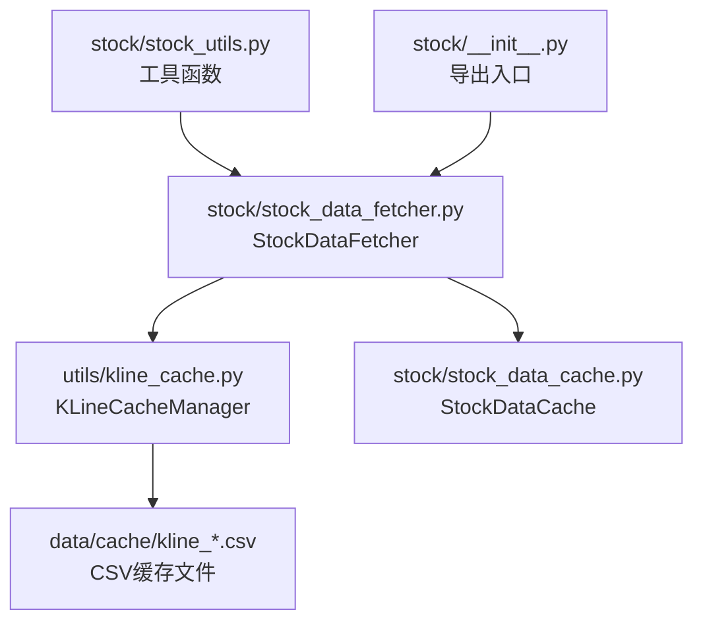
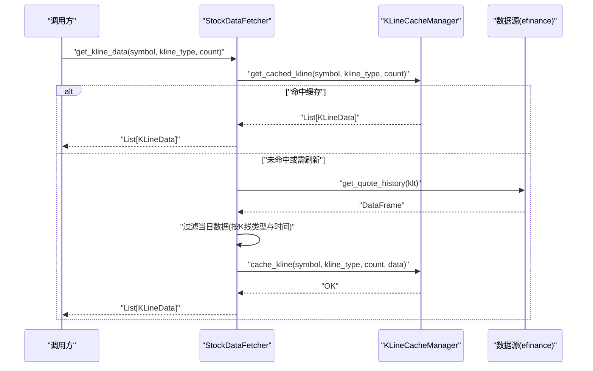
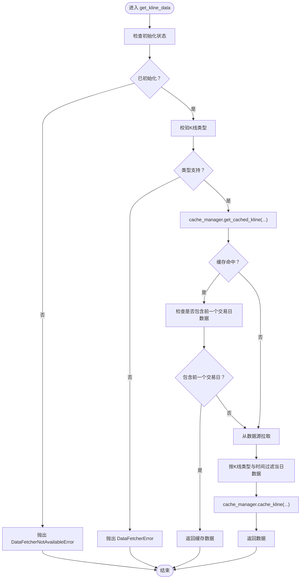
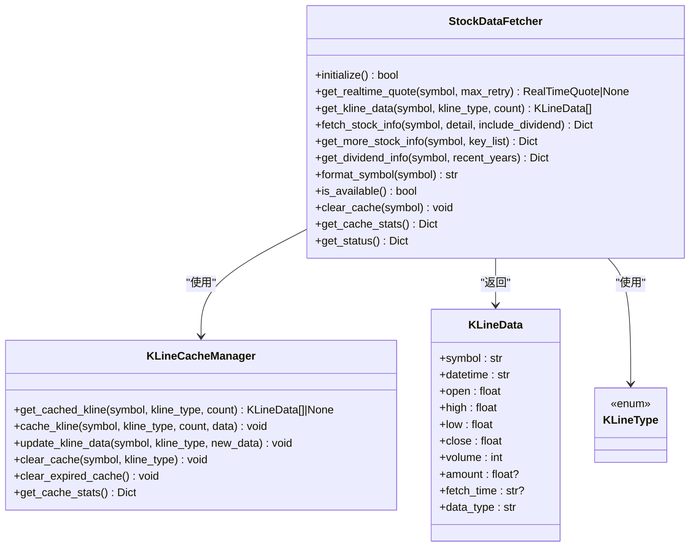

# 个股数据API

<cite>
**本文档引用的文件**
- [stock_data_fetcher.py](file://stock/stock_data_fetcher.py)
- [kline_cache.py](file://utils/kline_cache.py)
- [stock_data_cache.py](file://stock/stock_data_cache.py)
- [stock_utils.py](file://stock/stock_utils.py)
- [__init__.py](file://stock/__init__.py)
</cite>

## 目录
1. [简介](#简介)
2. [项目结构](#项目结构)
3. [核心组件](#核心组件)
4. [架构总览](#架构总览)
5. [详细组件分析](#详细组件分析)
6. [依赖关系分析](#依赖关系分析)
7. [性能与缓存特性](#性能与缓存特性)
8. [故障排查指南](#故障排查指南)
9. [结论](#结论)
10. [附录：API使用示例与最佳实践](#附录api使用示例与最佳实践)

## 简介
本文件为“个股数据获取API”的权威参考，聚焦于 stock/stock_data_fetcher.py 中 StockDataFetcher 类的公共接口，涵盖以下方法：
- get_realtime_quote：获取A股实时行情
- get_kline_data：获取历史K线数据，并内置缓存与智能过期策略
- fetch_stock_info：获取股票基本信息（可选附加财务指标与分红信息）
- get_more_stock_info：按预设关键指标集获取更多财务指标
- get_dividend_info：获取个股股息分红信息与统计

同时，文档化了 KLineData 与 RealTimeQuote 数据结构字段定义，解释了 K 线缓存机制（cache_manager 的使用与过期策略），并说明 get_kline_data 如何依据 K 线类型与交易时间智能决定是否包含当日数据。最后提供实际调用示例与最佳实践建议。

## 项目结构
围绕个股数据获取的核心文件与职责如下：
- stock/stock_data_fetcher.py：个股数据获取器实现，提供上述五个核心方法及数据结构
- utils/kline_cache.py：K线缓存管理器，负责CSV持久化、智能过期与增量更新
- stock/stock_data_cache.py：股票数据通用缓存管理器（非K线），用于其他类型数据的缓存
- stock/stock_utils.py：工具层，封装常用数据获取与指标计算逻辑，演示如何调用 StockDataFetcher
- stock/__init__.py：对外导出入口，包含 KLineData、RealTimeQuote、KLineType、异常类与全局 data_manager 实例

图表来源
- [stock_data_fetcher.py](file://stock/stock_data_fetcher.py#L1-L120)
- [kline_cache.py](file://utils/kline_cache.py#L1-L120)
- [stock_data_cache.py](file://stock/stock_data_cache.py#L1-L120)
- [stock_utils.py](file://stock/stock_utils.py#L150-L210)
- [__init__.py](file://stock/__init__.py#L28-L56)

章节来源
- [stock_data_fetcher.py](file://stock/stock_data_fetcher.py#L1-L120)
- [kline_cache.py](file://utils/kline_cache.py#L1-L120)
- [stock_data_cache.py](file://stock/stock_data_cache.py#L1-L120)
- [stock_utils.py](file://stock/stock_utils.py#L150-L210)
- [__init__.py](file://stock/__init__.py#L28-L56)

## 核心组件
- StockDataFetcher：个股数据获取器，封装实时行情、K线、财务与分红信息获取，内置重试与错误处理
- RealTimeQuote：实时行情数据结构
- KLineData：K线数据结构
- KLineType：K线类型枚举
- KLineCacheManager：K线缓存管理器，提供CSV持久化、智能过期与统计

章节来源
- [stock_data_fetcher.py](file://stock/stock_data_fetcher.py#L13-L28)
- [stock_data_fetcher.py](file://stock/stock_data_fetcher.py#L45-L120)
- [kline_cache.py](file://utils/kline_cache.py#L11-L45)
- [kline_cache.py](file://utils/kline_cache.py#L46-L120)

## 架构总览
下图展示了调用链路与数据流向：UI/业务层通过 StockDataFetcher 获取数据；K线数据优先从 KLineCacheManager 读取，若命中则直接返回；否则从数据源拉取并写入缓存；财务与分红信息由 fetch_stock_info 组合 get_more_stock_info 与 get_dividend_info 返回。

图表来源
- [stock_data_fetcher.py](file://stock/stock_data_fetcher.py#L135-L224)
- [kline_cache.py](file://utils/kline_cache.py#L138-L187)
- [kline_cache.py](file://utils/kline_cache.py#L188-L233)

## 详细组件分析

### StockDataFetcher 类与公共接口
- 初始化与可用性
  - initialize：尝试导入外部库并标记可用
  - is_available：返回可用状态
- 实时行情
  - get_realtime_quote(symbol, max_retry=3)：返回 RealTimeQuote 或 None
  - 内置重试与异常处理
- K线数据
  - get_kline_data(symbol, kline_type=DAY, count=30)：返回 List[KLineData]
  - 缓存命中逻辑：先从 KLineCacheManager 读取，若包含前一个交易日数据则直接返回
  - 智能过滤当日数据：日K线在16:30之后才包含当日；分钟线一律去除当日
  - 拉取失败回退：若拉取失败但有缓存，则返回缓存
- 股票信息与财务指标
  - fetch_stock_info(symbol, detail=True, include_dividend=True)：返回字典（含基本信息、财务指标、分红信息）
  - get_more_stock_info(symbol, key_list=None)：按预设关键指标集提取财务指标
  - get_dividend_info(symbol, recent_years=3)：返回最新分红与近X年统计
- 辅助与状态
  - format_symbol：标准化股票代码
  - clear_cache(symbol=None)：清理K线缓存
  - get_cache_stats()：返回缓存统计
  - get_status()：返回数据源与缓存状态

章节来源
- [stock_data_fetcher.py](file://stock/stock_data_fetcher.py#L81-L134)
- [stock_data_fetcher.py](file://stock/stock_data_fetcher.py#L135-L224)
- [stock_data_fetcher.py](file://stock/stock_data_fetcher.py#L225-L373)
- [stock_data_fetcher.py](file://stock/stock_data_fetcher.py#L374-L456)

#### 方法参数与返回值规范
- get_realtime_quote
  - 参数
    - symbol: str，股票代码
    - max_retry: int，默认3，重试次数
  - 返回
    - RealTimeQuote 或 None
  - 异常
    - DataFetcherNotAvailableError：未初始化
- get_kline_data
  - 参数
    - symbol: str，股票代码
    - kline_type: KLineType，默认DAY
    - count: int，默认30，返回最近条数
  - 返回
    - List[KLineData]
  - 异常
    - DataFetcherNotAvailableError：未初始化
    - DataFetcherError：不支持的K线类型
- fetch_stock_info
  - 参数
    - symbol: str
    - detail: bool，默认True，是否附加更多财务指标
    - include_dividend: bool，默认True，是否附加分红信息
  - 返回
    - Dict[str, Any]（包含基础信息、财务指标、分红信息）
- get_more_stock_info
  - 参数
    - symbol: str
    - key_list: Optional[List[str]]，默认None，使用预设关键指标集
  - 返回
    - Dict[str, Any]（关键财务指标）
- get_dividend_info
  - 参数
    - symbol: str
    - recent_years: int，默认3
  - 返回
    - Dict[str, Any]（最新分红与统计）

章节来源
- [stock_data_fetcher.py](file://stock/stock_data_fetcher.py#L97-L134)
- [stock_data_fetcher.py](file://stock/stock_data_fetcher.py#L135-L224)
- [stock_data_fetcher.py](file://stock/stock_data_fetcher.py#L225-L373)

#### 错误处理机制
- 初始化失败：抛出 DataFetcherNotAvailableError
- 数据源不可用：抛出 DataFetcherNotAvailableError
- 无效股票代码：抛出 InvalidSymbolError
- 数据转换失败：抛出 DataFetcherError
- 拉取失败但有缓存：返回缓存数据而非报错

章节来源
- [stock_data_fetcher.py](file://stock/stock_data_fetcher.py#L30-L43)
- [stock_data_fetcher.py](file://stock/stock_data_fetcher.py#L140-L145)
- [stock_data_fetcher.py](file://stock/stock_data_fetcher.py#L217-L223)

### 数据结构定义

#### RealTimeQuote
- 字段
  - symbol: str
  - name: str
  - current_price: float
  - change: float
  - change_percent: float
  - volume: int
  - amount: float
  - high: float
  - low: float
  - open: float
  - prev_close: float
  - timestamp: str

章节来源
- [stock_data_fetcher.py](file://stock/stock_data_fetcher.py#L13-L28)

#### KLineData
- 字段
  - symbol: str
  - datetime: str（格式：日线为“YYYY-MM-DD”，分钟线为“YYYY-MM-DD HH:MM:SS”）
  - open: float
  - high: float
  - low: float
  - close: float
  - volume: int
  - amount: Optional[float]
  - fetch_time: Optional[str]（拉取时间）
  - data_type: str，默认“stock”，也可为“index”

章节来源
- [kline_cache.py](file://utils/kline_cache.py#L24-L45)

### K线缓存机制与过期策略

#### cache_manager 的使用
- 在 StockDataFetcher.get_kline_data 中通过 cache_manager.get_cached_kline 与 cache_manager.cache_kline 进行缓存读写
- KLineCacheManager 提供：
  - get_cached_kline(symbol, kline_type, count)：按股票+周期+数量返回缓存数据，并过滤过期数据
  - cache_kline(symbol, kline_type, count, data)：替换指定股票的全部K线数据
  - update_kline_data(symbol, kline_type, new_data)：增量更新
  - clear_cache(symbol=None, kline_type=None)：清理指定股票或周期的缓存
  - clear_expired_cache()：清理过期缓存
  - get_cache_stats()：返回缓存统计

#### 智能过期策略（KLineCacheManager）
- 历史数据永久保存策略
  - 日线/指数日线：T-2之前的日线数据永久有效
  - 分钟线：1小时前的数据永久有效
- 当日/当前数据过期策略
  - 日线：4小时内有效
  - 1分钟线：1分钟内有效
  - 5分钟线：5分钟内有效
  - 15分钟线：15分钟内有效
  - 30分钟线：30分钟内有效
  - 60分钟线/1小时线：1小时内有效
  - 周线/月线：1天内有效
- 数据新鲜度判断
  - 根据 fetch_time 与 datetime 的时间差判定是否过期
  - 若无 fetch_time，则保留

图表来源
- [stock_data_fetcher.py](file://stock/stock_data_fetcher.py#L135-L224)
- [kline_cache.py](file://utils/kline_cache.py#L138-L233)
- [kline_cache.py](file://utils/kline_cache.py#L63-L112)

章节来源
- [stock_data_fetcher.py](file://stock/stock_data_fetcher.py#L135-L224)
- [kline_cache.py](file://utils/kline_cache.py#L63-L112)
- [kline_cache.py](file://utils/kline_cache.py#L138-L233)

### get_kline_data 的智能当日数据决策
- 日K线
  - 若当前时间≥16:30，则包含当日数据
  - 否则去除当日数据，避免盘中价格波动导致的不稳定
- 分钟线
  - 去除当日数据，因为分钟线实时性强，盘中数据不稳健
- 返回最近 count 条记录

章节来源
- [stock_data_fetcher.py](file://stock/stock_data_fetcher.py#L179-L209)

### 财务指标与分红信息
- fetch_stock_info
  - 调用 get_more_stock_info 获取关键财务指标
  - 可选调用 get_dividend_info 获取分红信息
  - 返回字典，字段包含中文键名（如“股票代码”、“股票名称”、“总市值”、“ROE”等）
- get_more_stock_info
  - 默认关键指标集覆盖盈利能力、偿债能力、营运能力、成长能力与每股指标
- get_dividend_info
  - 返回最新分红公告日期、类型、送转派息比例、股权登记日、除权日、派息日、说明
  - 统计近X年的分红次数与平均派息比例，并返回最近若干条详情

章节来源
- [stock_data_fetcher.py](file://stock/stock_data_fetcher.py#L225-L373)

## 依赖关系分析
- StockDataFetcher 依赖
  - utils.kline_cache.cache_manager：K线缓存
  - utils.kline_cache.KLineData/KLineType：K线数据结构与类型
  - akshare：财务与分红数据获取
  - pandas：数据处理
- KLineCacheManager 依赖
  - pandas：CSV读写与数据处理
  - dataclasses/Enum：KLineData/KLineType
  - datetime/timedelta：时间判断与过期策略
- 股票数据通用缓存（StockDataCache）
  - JSON文件持久化，支持不同数据类型的过期时间配置

图表来源
- [stock_data_fetcher.py](file://stock/stock_data_fetcher.py#L45-L120)
- [kline_cache.py](file://utils/kline_cache.py#L46-L120)
- [kline_cache.py](file://utils/kline_cache.py#L138-L233)

章节来源
- [stock_data_fetcher.py](file://stock/stock_data_fetcher.py#L45-L120)
- [kline_cache.py](file://utils/kline_cache.py#L46-L120)
- [kline_cache.py](file://utils/kline_cache.py#L138-L233)

## 性能与缓存特性
- K线缓存命中优先：get_kline_data 首先尝试从 CSV 缓存读取，减少网络请求
- 智能过期：针对不同周期采用差异化过期窗口，兼顾数据新鲜度与性能
- 拉取失败回退：当数据源异常时，优先返回可用缓存，提升系统鲁棒性
- 统计与清理：提供 get_cache_stats 与 clear_expired_cache，便于运维监控与维护

章节来源
- [stock_data_fetcher.py](file://stock/stock_data_fetcher.py#L135-L224)
- [kline_cache.py](file://utils/kline_cache.py#L63-L112)
- [kline_cache.py](file://utils/kline_cache.py#L363-L398)

## 故障排查指南
- 初始化失败
  - 现象：调用 get_realtime_quote/get_kline_data 抛出 DataFetcherNotAvailableError
  - 处理：确认 initialize() 成功；检查外部库依赖是否安装
- 数据源异常
  - 现象：拉取失败或返回空数据
  - 处理：重试 max_retry 次；若缓存存在则自动回退；检查网络与数据源可用性
- K线类型不支持
  - 现象：抛出 DataFetcherError
  - 处理：使用受支持的 KLineType 枚举值
- 缓存问题
  - 现象：缓存未更新或过期
  - 处理：使用 clear_cache/clear_expired_cache 清理；检查 CSV 文件是否存在与可写

章节来源
- [stock_data_fetcher.py](file://stock/stock_data_fetcher.py#L81-L134)
- [stock_data_fetcher.py](file://stock/stock_data_fetcher.py#L140-L145)
- [stock_data_fetcher.py](file://stock/stock_data_fetcher.py#L217-L223)
- [kline_cache.py](file://utils/kline_cache.py#L331-L398)

## 结论
StockDataFetcher 提供了稳定、可扩展的个股数据获取能力，结合 KLineCacheManager 的智能缓存策略，在保证数据新鲜度的同时显著降低网络与计算开销。通过清晰的错误处理与回退机制，系统在异常情况下仍能提供可用数据。建议在生产环境中配合缓存统计与清理策略，确保长期稳定运行。

## 附录：API使用示例与最佳实践

### 使用示例（路径引用）
- 获取实时行情
  - 参考路径：[stock_data_fetcher.py](file://stock/stock_data_fetcher.py#L97-L134)
  - 参考路径：[stock_utils.py](file://stock/stock_utils.py#L155-L188)
- 获取K线数据
  - 参考路径：[stock_data_fetcher.py](file://stock/stock_data_fetcher.py#L135-L224)
  - 参考路径：[kline_cache.py](file://utils/kline_cache.py#L138-L233)
- 获取股票基本信息与财务指标
  - 参考路径：[stock_data_fetcher.py](file://stock/stock_data_fetcher.py#L225-L373)
- 获取更多财务指标
  - 参考路径：[stock_data_fetcher.py](file://stock/stock_data_fetcher.py#L255-L297)
- 获取分红信息
  - 参考路径：[stock_data_fetcher.py](file://stock/stock_data_fetcher.py#L298-L373)

### 最佳实践
- 优先使用全局实例 data_manager，避免重复初始化
  - 参考路径：[__init__.py](file://stock/__init__.py#L28-L56)
- K线类型选择
  - 日K线建议在16:30之后获取，以包含当日收盘数据
  - 分钟线建议去除当日数据，避免盘中波动影响
- 缓存管理
  - 定期调用 clear_expired_cache 清理过期数据
  - 使用 get_cache_stats 监控缓存规模与命中率
- 错误处理
  - 对外暴露层捕获 DataFetcherError/InvalidSymbolError 并降级处理
  - 拉取失败时优先返回缓存数据，保证用户体验