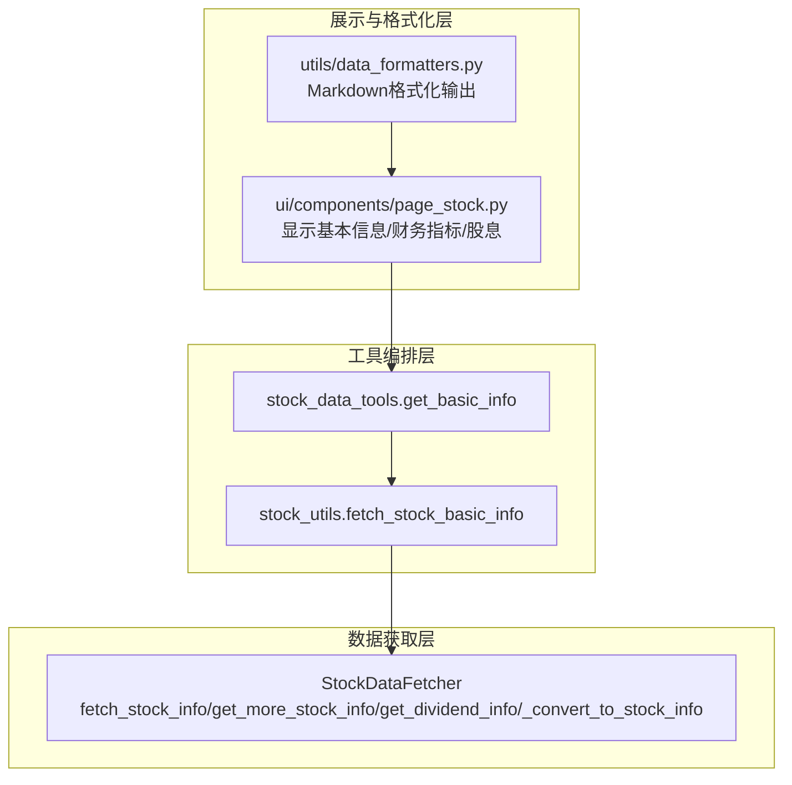
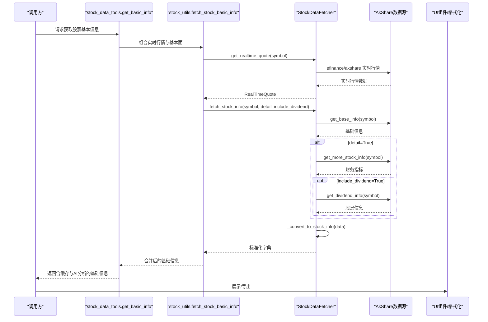
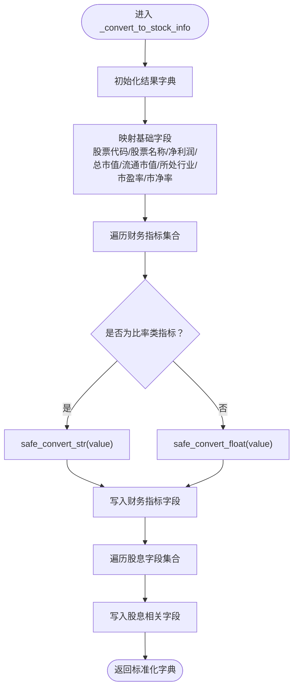

# 基本面信息API

<cite>
**本文引用的文件**
- [stock/stock_data_fetcher.py](file://stock/stock_data_fetcher.py)
- [stock/stock_utils.py](file://stock/stock_utils.py)
- [stock/stock_data_tools.py](file://stock/stock_data_tools.py)
- [ui/components/page_stock.py](file://ui/components/page_stock.py)
- [utils/data_formatters.py](file://utils/data_formatters.py)
</cite>

## 目录
1. [简介](#简介)
2. [项目结构](#项目结构)
3. [核心组件](#核心组件)
4. [架构总览](#架构总览)
5. [详细组件分析](#详细组件分析)
6. [依赖关系分析](#依赖关系分析)
7. [性能与可靠性](#性能与可靠性)
8. [故障排查指南](#故障排查指南)
9. [结论](#结论)
10. [附录：调用示例与字段说明](#附录调用示例与字段说明)

## 简介
本文件为“基本面信息API”的权威参考，聚焦于 stock_data_fetcher.py 中 StockDataFetcher 类的 fetch_stock_info 方法。文档将系统阐述：
- 方法签名与参数语义（symbol、detail、include_dividend）
- 数据整合流程（基础信息、财务指标、股息信息）
- 返回数据结构的关键字段与含义
- 数据清洗与类型转换逻辑（_convert_to_stock_info）
- 实际调用示例与最佳实践

## 项目结构
围绕基本面信息API的相关模块组织如下：
- 数据获取层：StockDataFetcher（efinance封装，AkShare数据源）
- 工具编排层：stock_utils、stock_data_tools（统一入口与缓存策略）
- 展示与格式化层：ui/components/page_stock.py、utils/data_formatters.py（前端展示与Markdown输出）

图表来源
- [stock/stock_data_fetcher.py](file://stock/stock_data_fetcher.py#L225-L545)
- [stock/stock_utils.py](file://stock/stock_utils.py#L152-L186)
- [stock/stock_data_tools.py](file://stock/stock_data_tools.py#L41-L112)
- [ui/components/page_stock.py](file://ui/components/page_stock.py#L350-L427)
- [utils/data_formatters.py](file://utils/data_formatters.py#L300-L350)

章节来源
- [stock/stock_data_fetcher.py](file://stock/stock_data_fetcher.py#L225-L545)
- [stock/stock_utils.py](file://stock/stock_utils.py#L152-L186)
- [stock/stock_data_tools.py](file://stock/stock_data_tools.py#L41-L112)
- [ui/components/page_stock.py](file://ui/components/page_stock.py#L350-L427)
- [utils/data_formatters.py](file://utils/data_formatters.py#L300-L350)

## 核心组件
- StockDataFetcher：封装 efinance/AkShare 接口，提供 fetch_stock_info、get_more_stock_info、get_dividend_info、_convert_to_stock_info 等方法。
- stock_utils.fetch_stock_basic_info：统一入口，组合实时行情与基本面信息。
- stock_data_tools.get_basic_info：带缓存的统一获取入口，并可选触发AI分析。
- UI与格式化：页面组件负责展示，data_formatters负责Markdown格式化输出。

章节来源
- [stock/stock_data_fetcher.py](file://stock/stock_data_fetcher.py#L225-L545)
- [stock/stock_utils.py](file://stock/stock_utils.py#L152-L186)
- [stock/stock_data_tools.py](file://stock/stock_data_tools.py#L41-L112)
- [ui/components/page_stock.py](file://ui/components/page_stock.py#L350-L427)
- [utils/data_formatters.py](file://utils/data_formatters.py#L300-L350)

## 架构总览
下面以序列图展示一次“获取完整股票基本面信息”的端到端流程。

图表来源
- [stock/stock_data_tools.py](file://stock/stock_data_tools.py#L41-L112)
- [stock/stock_utils.py](file://stock/stock_utils.py#L152-L186)
- [stock/stock_data_fetcher.py](file://stock/stock_data_fetcher.py#L97-L133)
- [stock/stock_data_fetcher.py](file://stock/stock_data_fetcher.py#L225-L248)
- [stock/stock_data_fetcher.py](file://stock/stock_data_fetcher.py#L255-L296)
- [stock/stock_data_fetcher.py](file://stock/stock_data_fetcher.py#L298-L372)
- [stock/stock_data_fetcher.py](file://stock/stock_data_fetcher.py#L457-L538)

## 详细组件分析

### StockDataFetcher.fetch_stock_info 方法
- 功能：聚合基础信息、可选财务指标与可选股息信息，输出标准化字典。
- 参数
  - symbol：股票代码（字符串），用于查询基础信息与后续扩展信息。
  - detail：布尔，默认 True，控制是否拉取更多财务指标。
  - include_dividend：布尔，默认 True，控制是否拉取股息信息。
- 流程要点
  - 若未初始化，抛出 DataFetcherNotAvailableError。
  - 调用 efinance 获取基础信息（get_base_info），若存在则继续。
  - 若 detail=True：调用 get_more_stock_info 获取财务指标并合并。
  - 若 include_dividend=True：调用 get_dividend_info 获取股息信息并合并。
  - 最终通过 _convert_to_stock_info 进行字段映射与类型转换，返回标准化字典。
- 返回值：字典，键为中文字段名，值为字符串或数值（None表示缺失或不可解析）。

章节来源
- [stock/stock_data_fetcher.py](file://stock/stock_data_fetcher.py#L225-L248)

### 数据整合：基础信息、财务指标、股息信息
- 基础信息来源：get_base_info（来自 efinance/AkShare）。
- 财务指标来源：get_more_stock_info（使用 AkShare 的财务摘要接口，筛选关键指标集合）。
- 股息信息来源：get_dividend_info（使用 AkShare 的分红接口，提取最新与近年统计）。

章节来源
- [stock/stock_data_fetcher.py](file://stock/stock_data_fetcher.py#L255-L296)
- [stock/stock_data_fetcher.py](file://stock/stock_data_fetcher.py#L298-L372)

### _convert_to_stock_info 数据清洗与类型转换
- 字段映射：将原始字段映射为中文键，如“股票代码”、“股票名称”、“净利润”、“总市值”、“流通市值”、“所处行业”、“市盈率(动)”、“市净率”等。
- 类型转换规则
  - 数值型：safe_convert_float
    - 处理输入为“-”、None、空字符串、'--'、NaN（浮点比较自反）等情况，统一返回 None。
    - 对包含百分号的字符串，先去百分号再转浮点。
  - 字符串型：safe_convert_str
    - 处理“-”、None、'0.0'、'--'、NaN等情况，统一返回 None。
  - 财务指标分类
    - 比率类（含“率”“比率”“ROE”“ROA”等）：优先保持字符串，便于展示百分比。
    - 绝对数值类：转换为浮点数。
- 股息字段：直接写入“最新分红公告日期”“最新分红类型”“最新派息比例”“最新送股比例”“最新转增比例”“最新股权登记日”“最新除权日”“最新派息日”“最新分红说明”“近年平均派息比例”“近年分红次数”“近年分红详情”。

图表来源
- [stock/stock_data_fetcher.py](file://stock/stock_data_fetcher.py#L457-L538)

章节来源
- [stock/stock_data_fetcher.py](file://stock/stock_data_fetcher.py#L457-L538)

### 返回数据结构与关键字段
- 基础信息
  - 股票代码、股票名称、净利润、总市值、流通市值、所处行业、市盈率(动)、市净率、板块编号
- 财务指标（示例，具体以实际返回为准）
  - 盈利能力：净资产收益率(ROE)、总资产报酬率(ROA)、销售净利率、毛利率、营业利润率
  - 偿债能力：资产负债率、流动比率、速动比率、现金比率、权益乘数
  - 营运能力：总资产周转率、应收账款周转率、存货周转率、流动资产周转率
  - 成长能力：营业总收入增长率、归属母公司净利润增长率
  - 每股指标：基本每股收益、每股净资产、每股经营现金流、每股营业收入
- 股息信息
  - 最新分红公告日期、最新分红类型、最新送股比例、最新转增比例、最新派息比例、最新股权登记日、最新除权日、最新派息日、最新分红说明
  - 近年平均派息比例、近年分红次数、近年分红详情（列表，每条含年份、分红类型、送股比例、转增比例、派息比例）

章节来源
- [stock/stock_data_fetcher.py](file://stock/stock_data_fetcher.py#L488-L533)
- [stock/stock_data_fetcher.py](file://stock/stock_data_fetcher.py#L255-L296)
- [stock/stock_data_fetcher.py](file://stock/stock_data_fetcher.py#L298-L372)

### 调用链路与集成点
- 统一入口
  - stock_utils.fetch_stock_basic_info：组合实时行情与基本面信息。
  - stock_data_tools.get_basic_info：带缓存与可选AI分析。
- UI展示
  - page_stock.py：展示基本信息、财务指标、股息详情。
  - data_formatters.py：将基础信息格式化为Markdown文本。

章节来源
- [stock/stock_utils.py](file://stock/stock_utils.py#L152-L186)
- [stock/stock_data_tools.py](file://stock/stock_data_tools.py#L41-L112)
- [ui/components/page_stock.py](file://ui/components/page_stock.py#L350-L427)
- [utils/data_formatters.py](file://utils/data_formatters.py#L300-L350)

## 依赖关系分析
- 外部依赖
  - efinance：提供基础信息与实时行情。
  - AkShare：提供财务摘要与分红数据。
- 内部依赖
  - stock_utils 依赖 data_manager（StockDataFetcher全局实例）。
  - stock_data_tools 依赖缓存管理器与AI分析模块（可选）。
  - UI层依赖 data_formatters 进行格式化输出。

图表来源
- [stock/stock_utils.py](file://stock/stock_utils.py#L152-L186)
- [stock/stock_data_tools.py](file://stock/stock_data_tools.py#L41-L112)
- [ui/components/page_stock.py](file://ui/components/page_stock.py#L350-L427)
- [utils/data_formatters.py](file://utils/data_formatters.py#L300-L350)
- [stock/stock_data_fetcher.py](file://stock/stock_data_fetcher.py#L225-L545)

章节来源
- [stock/stock_utils.py](file://stock/stock_utils.py#L152-L186)
- [stock/stock_data_tools.py](file://stock/stock_data_tools.py#L41-L112)
- [ui/components/page_stock.py](file://ui/components/page_stock.py#L350-L427)
- [utils/data_formatters.py](file://utils/data_formatters.py#L300-L350)
- [stock/stock_data_fetcher.py](file://stock/stock_data_fetcher.py#L225-L545)

## 性能与可靠性
- 缓存策略
  - K线数据缓存：StockDataFetcher.get_kline_data 支持缓存与过期判断，避免重复拉取。
  - 基本信息缓存：stock_data_tools.get_basic_info 支持缓存与强制刷新。
- 重试与降级
  - 实时行情获取具备重试机制，失败时可回退缓存。
- 数据质量
  - _convert_to_stock_info 对缺失值、占位符、NaN进行统一处理，保证下游稳定。

章节来源
- [stock/stock_data_fetcher.py](file://stock/stock_data_fetcher.py#L135-L224)
- [stock/stock_data_tools.py](file://stock/stock_data_tools.py#L41-L112)

## 故障排查指南
- 初始化失败
  - 症状：抛出 DataFetcherNotAvailableError 或打印“efinance 未初始化”。
  - 处理：确保已安装 efinance 依赖并调用 initialize() 成功。
- 数据为空
  - 症状：返回 None 或空字典。
  - 处理：确认 symbol 是否有效，检查网络与 AkShare/efinance 可用性。
- 类型转换异常
  - 症状：字段值为 None。
  - 处理：确认原始数据格式与单位（百分比、空值占位符等）。
- 股息数据缺失
  - 症状：返回“暂无分红记录”或部分字段为 None。
  - 处理：确认股票市场类型与分红历史是否存在。

章节来源
- [stock/stock_data_fetcher.py](file://stock/stock_data_fetcher.py#L81-L95)
- [stock/stock_data_fetcher.py](file://stock/stock_data_fetcher.py#L225-L254)
- [stock/stock_data_fetcher.py](file://stock/stock_data_fetcher.py#L457-L538)
- [stock/stock_data_fetcher.py](file://stock/stock_data_fetcher.py#L298-L372)

## 结论
StockDataFetcher 的 fetch_stock_info 将基础信息、财务指标与股息信息有机整合，通过 _convert_to_stock_info 完成字段映射与类型转换，形成统一的中文字段字典，便于上层 UI 与分析模块消费。配合缓存与重试机制，可在保证稳定性的同时提升响应效率。

## 附录：调用示例与字段说明

### 调用示例（路径指引）
- 获取完整基本面信息（含财务与股息）
  - 路径：[stock/stock_utils.py](file://stock/stock_utils.py#L152-L186)
  - 关键步骤：调用 fetch_stock_basic_info，内部会调用 StockDataFetcher.fetch_stock_info(detail=True, include_dividend=True)。
- 仅获取基础信息
  - 路径：[stock/stock_data_fetcher.py](file://stock/stock_data_fetcher.py#L225-L248)
  - 关键步骤：传入 detail=False，不拉取额外财务指标。
- 仅获取基础信息与财务指标
  - 路径：[stock/stock_data_fetcher.py](file://stock/stock_data_fetcher.py#L225-L248)
  - 关键步骤：传入 include_dividend=False，不拉取股息信息。

### 字段说明（节选）
- 基础信息
  - 股票代码、股票名称、净利润、总市值、流通市值、所处行业、市盈率(动)、市净率、板块编号
- 财务指标（示例）
  - 盈利能力：净资产收益率(ROE)、总资产报酬率(ROA)、销售净利率、毛利率、营业利润率
  - 偿债能力：资产负债率、流动比率、速动比率、现金比率、权益乘数
  - 营运能力：总资产周转率、应收账款周转率、存货周转率、流动资产周转率
  - 成长能力：营业总收入增长率、归属母公司净利润增长率
  - 每股指标：基本每股收益、每股净资产、每股经营现金流、每股营业收入
- 股息信息
  - 最新分红公告日期、最新分红类型、最新送股比例、最新转增比例、最新派息比例、最新股权登记日、最新除权日、最新派息日、最新分红说明
  - 近年平均派息比例、近年分红次数、近年分红详情（列表）

章节来源
- [stock/stock_data_fetcher.py](file://stock/stock_data_fetcher.py#L225-L248)
- [stock/stock_data_fetcher.py](file://stock/stock_data_fetcher.py#L255-L296)
- [stock/stock_data_fetcher.py](file://stock/stock_data_fetcher.py#L298-L372)
- [stock/stock_data_fetcher.py](file://stock/stock_data_fetcher.py#L488-L533)
- [stock/stock_utils.py](file://stock/stock_utils.py#L152-L186)
- [ui/components/page_stock.py](file://ui/components/page_stock.py#L350-L427)
- [utils/data_formatters.py](file://utils/data_formatters.py#L300-L350)