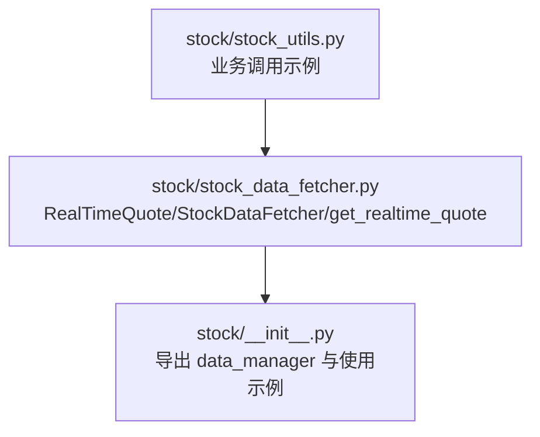
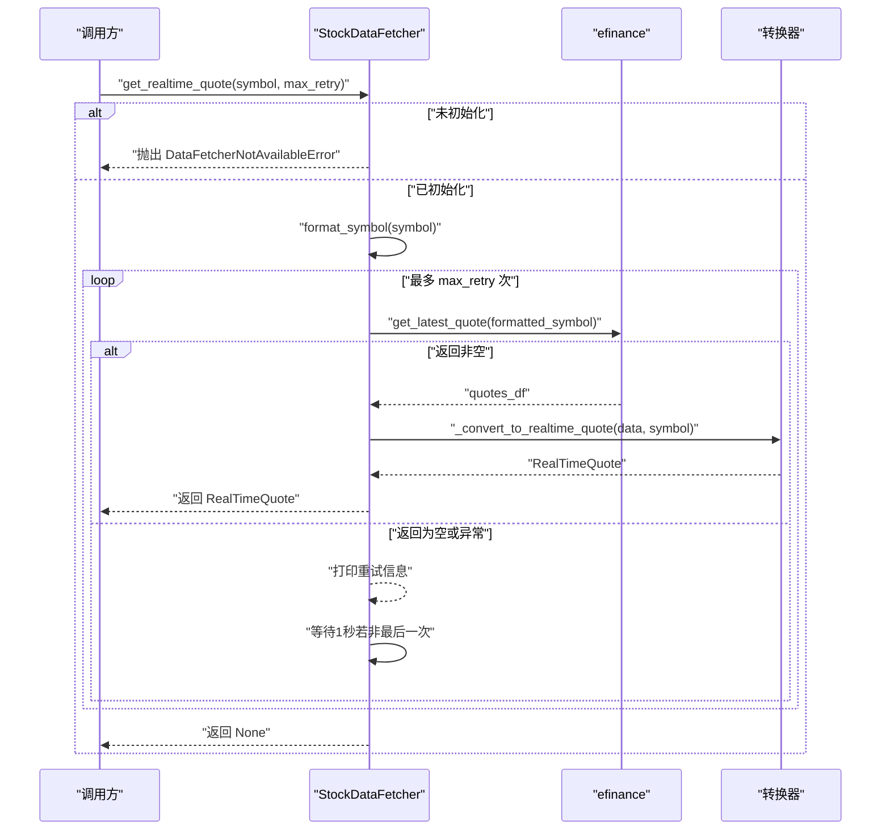
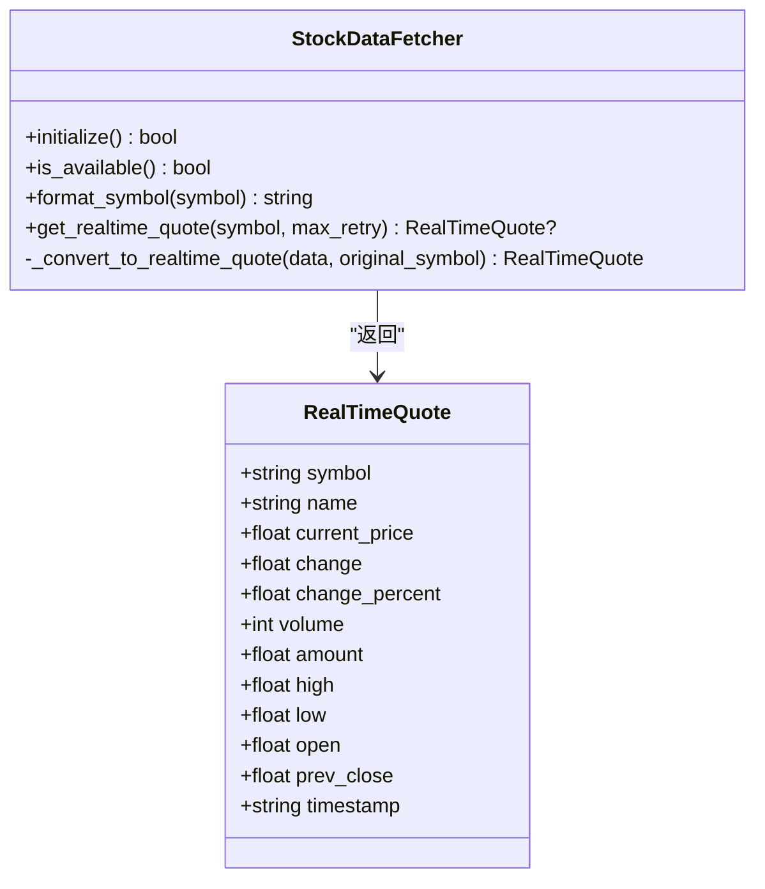
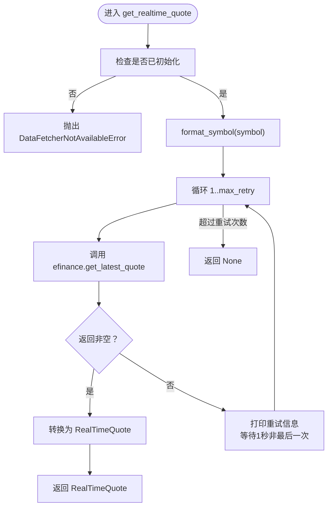

# 实时行情API

<cite>
**本文引用的文件**
- [stock/stock_data_fetcher.py](file://stock/stock_data_fetcher.py)
- [stock/__init__.py](file://stock/__init__.py)
- [stock/stock_utils.py](file://stock/stock_utils.py)
</cite>

## 目录
1. [简介](#简介)
2. [项目结构](#项目结构)
3. [核心组件](#核心组件)
4. [架构概览](#架构概览)
5. [详细组件分析](#详细组件分析)
6. [依赖关系分析](#依赖关系分析)
7. [性能与可靠性](#性能与可靠性)
8. [故障排查指南](#故障排查指南)
9. [结论](#结论)
10. [附录](#附录)

## 简介
本文件为“实时行情API”的权威参考文档，聚焦于 stock_data_fetcher.py 中的 StockDataFetcher 类及其 get_realtime_quote 方法。内容涵盖：
- 参数与返回值规范：symbol 格式要求、max_retry 重试机制、返回类型 RealTimeQuote 的字段定义
- 内部实现细节：数据源为东方财富网（efinance），初始化检查机制，异常处理与重试逻辑
- 实际调用示例：如何获取单个股票的实时行情并处理 None 返回值
- 数据来源与兼容性：对不同数据源返回格式的适配策略

## 项目结构
与实时行情API直接相关的文件与职责如下：
- stock/stock_data_fetcher.py：核心实现，包含 RealTimeQuote 数据结构、StockDataFetcher 类、get_realtime_quote 方法、初始化与异常类型等
- stock/__init__.py：对外导出 RealTimeQuote、StockDataFetcher、data_manager 等，提供使用示例
- stock/stock_utils.py：业务层调用示例，展示如何通过 data_manager 获取实时行情并安全处理 None

图表来源
- [stock/stock_data_fetcher.py](file://stock/stock_data_fetcher.py#L1-L133)
- [stock/__init__.py](file://stock/__init__.py#L1-L56)
- [stock/stock_utils.py](file://stock/stock_utils.py#L155-L188)

章节来源
- [stock/stock_data_fetcher.py](file://stock/stock_data_fetcher.py#L1-L133)
- [stock/__init__.py](file://stock/__init__.py#L1-L56)
- [stock/stock_utils.py](file://stock/stock_utils.py#L155-L188)

## 核心组件
- RealTimeQuote：标准化的实时行情数据结构，用于封装从数据源获取的字段
- StockDataFetcher：封装了与 efinance 数据源交互的逻辑，提供 get_realtime_quote、initialize、format_symbol 等方法
- data_manager：全局实例，便于直接导入使用

章节来源
- [stock/stock_data_fetcher.py](file://stock/stock_data_fetcher.py#L13-L28)
- [stock/stock_data_fetcher.py](file://stock/stock_data_fetcher.py#L45-L133)
- [stock/__init__.py](file://stock/__init__.py#L28-L56)

## 架构概览
实时行情获取的整体流程如下：
- 调用方通过 data_manager 或自建 StockDataFetcher 实例发起请求
- 若未初始化则抛出 DataFetcherNotAvailableError
- 将 symbol 传入 format_symbol 进行格式化（当前实现为直传）
- 调用 efinance.get_latest_quote 获取行情数据
- 若返回非空，则转换为 RealTimeQuote 并返回；否则按 max_retry 重试
- 重试期间若发生异常会等待1秒后继续，直到达到最大重试次数或成功

图表来源
- [stock/stock_data_fetcher.py](file://stock/stock_data_fetcher.py#L97-L133)
- [stock/stock_data_fetcher.py](file://stock/stock_data_fetcher.py#L374-L393)

## 详细组件分析

### RealTimeQuote 数据结构
RealTimeQuote 是标准化的实时行情数据载体，字段定义如下：
- symbol：原始股票代码（字符串）
- name：股票名称（字符串）
- current_price：最新价（浮点数）
- change：涨跌额（浮点数）
- change_percent：涨跌幅（百分比，浮点数）
- volume：成交量（整数）
- amount：成交额（浮点数）
- high：最高价（浮点数）
- low：最低价（浮点数）
- open：今开（浮点数）
- prev_close：昨收（浮点数）
- timestamp：数据时间戳（字符串）

字段来源与转换逻辑：
- 字段映射来自 efinance 返回数据，优先使用中文键名，其次使用英文键名
- 转换过程中进行类型安全处理：字符串转浮点/整数，缺失键回退为默认值
- timestamp 由调用时生成，格式为“年-月-日 时:分:秒”

章节来源
- [stock/stock_data_fetcher.py](file://stock/stock_data_fetcher.py#L13-L28)
- [stock/stock_data_fetcher.py](file://stock/stock_data_fetcher.py#L374-L393)

### StockDataFetcher 类与 get_realtime_quote 方法
- 初始化与可用性
  - initialize：尝试导入 efinance 并设置内部状态；失败时输出提示并标记不可用
  - is_available：返回初始化状态
  - format_symbol：当前实现为直传，便于扩展未来格式化逻辑
- get_realtime_quote
  - 参数
    - symbol：股票代码（字符串）。当前实现不做强制格式校验，但建议遵循6位数字格式（A股常见规则）
    - max_retry：最大重试次数（整数，默认3）
  - 行为
    - 若未初始化则抛出 DataFetcherNotAvailableError
    - 循环最多 max_retry 次，每次调用 efinance.get_latest_quote
    - 若返回非空且非空DataFrame/Series，则转换为 RealTimeQuote 并返回
    - 若返回为空或异常：打印重试信息；除最后一次外均等待1秒后继续
    - 达到最大重试次数仍未成功则返回 None
  - 异常
    - DataFetcherNotAvailableError：未初始化时触发
    - DataFetcherError：数据转换失败时触发（如键缺失或类型错误）

章节来源
- [stock/stock_data_fetcher.py](file://stock/stock_data_fetcher.py#L81-L95)
- [stock/stock_data_fetcher.py](file://stock/stock_data_fetcher.py#L97-L133)
- [stock/stock_data_fetcher.py](file://stock/stock_data_fetcher.py#L374-L393)

### 数据源与初始化检查机制
- 数据源：实时行情数据来源于 efinance（东方财富网）提供的接口
- 初始化检查：首次使用前需调用 initialize 或确保全局 data_manager 已完成初始化
- 可用性检测：可通过 is_available 判断当前状态

章节来源
- [stock/stock_data_fetcher.py](file://stock/stock_data_fetcher.py#L45-L95)
- [stock/stock_data_fetcher.py](file://stock/stock_data_fetcher.py#L501-L546)
- [stock/__init__.py](file://stock/__init__.py#L1-L56)

### 实际调用示例与最佳实践
- 使用全局实例 data_manager
  - 从 xystock.data 导入 data_manager
  - 调用 data_manager.get_realtime_quote("600519") 获取单个股票实时行情
  - 对返回值进行 None 检查后再读取字段
- 自建实例
  - 从 xystock.data 导入 StockDataFetcher
  - 创建实例并调用 initialize，再调用 get_realtime_quote
- 安全处理 None
  - 当返回为 None 时，表示多次重试后仍未能获取有效数据，应进行降级处理或提示用户稍后重试

章节来源
- [stock/__init__.py](file://stock/__init__.py#L9-L26)
- [stock/stock_utils.py](file://stock/stock_utils.py#L155-L188)

## 依赖关系分析
- 内部依赖
  - RealTimeQuote：作为返回值承载数据
  - _convert_to_realtime_quote：负责将 efinance 返回的字典转换为 RealTimeQuote
  - format_symbol：用于符号格式化（当前直传）
- 外部依赖
  - efinance：实时行情数据源
  - pandas：用于处理 DataFrame/Series
  - utils.kline_cache：提供缓存管理（与实时行情同包，但实时行情主要依赖转换器）

图表来源
- [stock/stock_data_fetcher.py](file://stock/stock_data_fetcher.py#L13-L28)
- [stock/stock_data_fetcher.py](file://stock/stock_data_fetcher.py#L97-L133)
- [stock/stock_data_fetcher.py](file://stock/stock_data_fetcher.py#L374-L393)

## 性能与可靠性
- 重试策略
  - 默认最多重试3次，每次失败等待1秒
  - 适用于网络抖动或数据源瞬时不可用场景
- 缓存与实时性
  - 实时行情主要依赖转换器与重试，不涉及缓存
  - 若需更高实时性，可结合上层业务缓存策略（例如在调用方缓存最近一次结果）
- 错误恢复
  - 未初始化时立即抛出明确异常
  - 数据转换失败时抛出 DataFetcherError，便于上层捕获并记录

章节来源
- [stock/stock_data_fetcher.py](file://stock/stock_data_fetcher.py#L97-L133)
- [stock/stock_data_fetcher.py](file://stock/stock_data_fetcher.py#L374-L393)

## 故障排查指南
- 未初始化
  - 现象：调用 get_realtime_quote 抛出 DataFetcherNotAvailableError
  - 处理：先调用 initialize 或确保全局 data_manager 已初始化
- 数据为空
  - 现象：多次重试后返回 None
  - 处理：检查 symbol 是否正确、网络是否稳定、数据源是否可用；可增加 max_retry 或稍后重试
- 数据转换失败
  - 现象：抛出 DataFetcherError（通常由键缺失或类型错误引起）
  - 处理：确认数据源返回格式是否符合预期；必要时更新字段映射
- 网络异常
  - 现象：重试过程中打印异常信息并等待1秒
  - 处理：检查网络连通性；在上层业务中增加超时与熔断策略

章节来源
- [stock/stock_data_fetcher.py](file://stock/stock_data_fetcher.py#L81-L95)
- [stock/stock_data_fetcher.py](file://stock/stock_data_fetcher.py#L97-L133)
- [stock/stock_data_fetcher.py](file://stock/stock_data_fetcher.py#L374-L393)

## 结论
- get_realtime_quote 提供了简洁可靠的实时行情获取能力，具备完善的初始化检查与重试机制
- RealTimeQuote 明确了字段语义与类型约束，便于上层业务稳定消费
- 建议在调用前确保初始化完成，并对返回值进行 None 检查；在高并发场景下可结合上层缓存策略提升性能

## 附录

### API 定义与使用要点
- 方法签名
  - get_realtime_quote(symbol: str, max_retry: int = 3) -> Optional[RealTimeQuote]
- 参数说明
  - symbol：股票代码（建议6位数字格式）
  - max_retry：最大重试次数（整数，默认3）
- 返回值
  - 成功：RealTimeQuote 实例
  - 失败：None（多次重试后仍无法获取有效数据）
- 异常
  - DataFetcherNotAvailableError：未初始化
  - DataFetcherError：数据转换失败

章节来源
- [stock/stock_data_fetcher.py](file://stock/stock_data_fetcher.py#L97-L133)
- [stock/stock_data_fetcher.py](file://stock/stock_data_fetcher.py#L374-L393)

### 字段对照表（RealTimeQuote）
- symbol：原始股票代码
- name：股票名称
- current_price：最新价
- change：涨跌额
- change_percent：涨跌幅（百分比）
- volume：成交量
- amount：成交额
- high：最高价
- low：最低价
- open：今开
- prev_close：昨收
- timestamp：数据时间戳（格式：年-月-日 时:分:秒）

章节来源
- [stock/stock_data_fetcher.py](file://stock/stock_data_fetcher.py#L13-L28)
- [stock/stock_data_fetcher.py](file://stock/stock_data_fetcher.py#L374-L393)

### 调用流程图（算法实现）

图表来源
- [stock/stock_data_fetcher.py](file://stock/stock_data_fetcher.py#L97-L133)