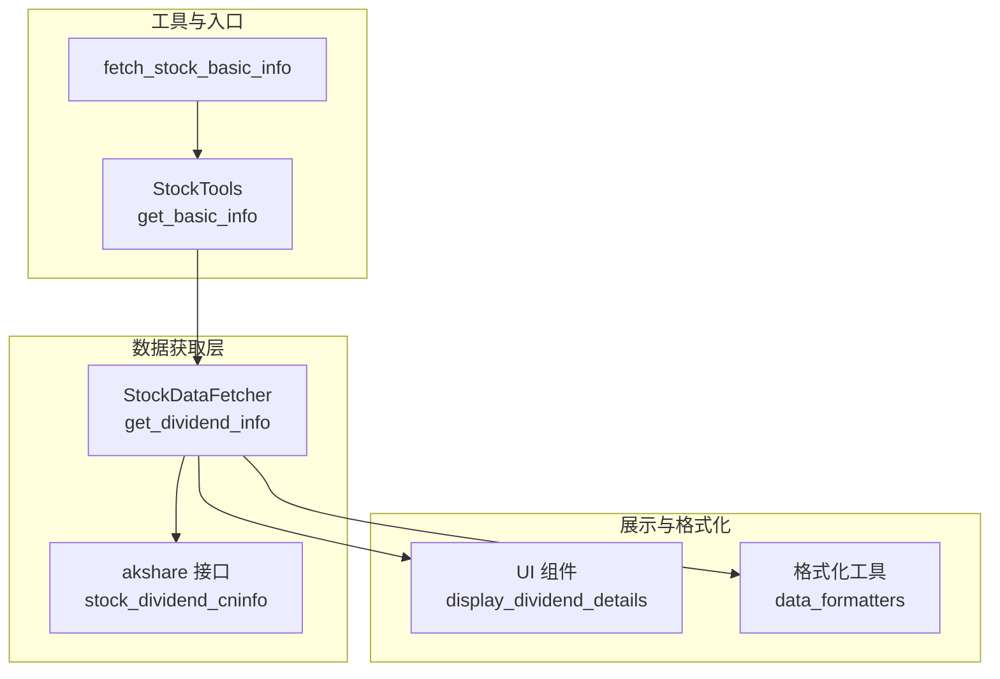
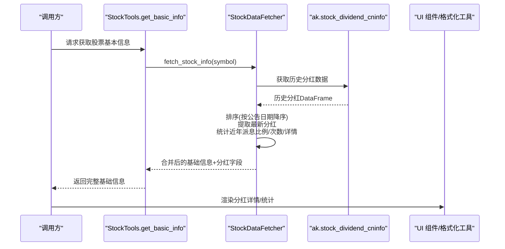
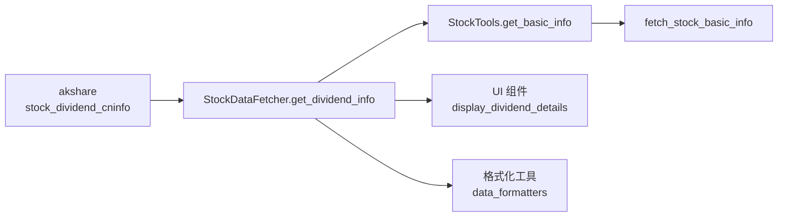

# 股息信息API

<cite>
**本文引用的文件**
- [stock_data_fetcher.py](file://stock/stock_data_fetcher.py)
- [stock_data_tools.py](file://stock/stock_data_tools.py)
- [stock_utils.py](file://stock/stock_utils.py)
- [page_stock.py](file://ui/components/page_stock.py)
- [data_formatters.py](file://utils/data_formatters.py)
</cite>

## 目录
1. [简介](#简介)
2. [项目结构](#项目结构)
3. [核心组件](#核心组件)
4. [架构概览](#架构概览)
5. [详细组件分析](#详细组件分析)
6. [依赖关系分析](#依赖关系分析)
7. [性能与可靠性](#性能与可靠性)
8. [故障排查指南](#故障排查指南)
9. [结论](#结论)
10. [附录：调用示例与字段说明](#附录调用示例与字段说明)

## 简介
本文件为“股息信息API”的权威参考文档，聚焦于 `stock/stock_data_fetcher.py` 中 `StockDataFetcher` 类的 `get_dividend_info` 方法。文档将详细说明：
- 参数语义：symbol（股票代码）、recent_years（统计年数窗口）
- 数据来源：通过 `ak.stock_dividend_cninfo` 接口获取历史分红数据
- 数据处理与统计：排序、清洗、统计平均派息比例、统计次数与详情
- 返回数据结构：最新分红信息与近年统计信息字段
- 实际调用路径与示例，帮助开发者快速集成与使用

## 项目结构
围绕“股息信息API”，涉及以下模块与文件：
- 数据获取层：`stock/stock_data_fetcher.py`（核心类与方法）
- 工具与入口：`stock/stock_data_tools.py`、`stock/stock_utils.py`
- 展示与格式化：`ui/components/page_stock.py`、`utils/data_formatters.py`

图表来源
- [stock_data_fetcher.py](file://stock/stock_data_fetcher.py#L298-L372)
- [stock_data_tools.py](file://stock/stock_data_tools.py#L41-L113)
- [stock_utils.py](file://stock/stock_utils.py#L152-L186)
- [page_stock.py](file://ui/components/page_stock.py#L271-L375)
- [data_formatters.py](file://utils/data_formatters.py#L301-L350)

章节来源
- [stock_data_fetcher.py](file://stock/stock_data_fetcher.py#L298-L372)
- [stock_data_tools.py](file://stock/stock_data_tools.py#L41-L113)
- [stock_utils.py](file://stock/stock_utils.py#L152-L186)
- [page_stock.py](file://ui/components/page_stock.py#L271-L375)
- [data_formatters.py](file://utils/data_formatters.py#L301-L350)

## 核心组件
- StockDataFetcher：封装了基于 akshare 的 A 股数据获取能力，其中 `get_dividend_info` 负责获取并处理个股历史分红数据。
- StockTools：统一入口，负责组合实时行情与基础信息，并触发分红信息获取。
- 页面组件与格式化工具：负责渲染与格式化输出。

章节来源
- [stock_data_fetcher.py](file://stock/stock_data_fetcher.py#L298-L372)
- [stock_data_tools.py](file://stock/stock_data_tools.py#L41-L113)
- [stock_utils.py](file://stock/stock_utils.py#L152-L186)

## 架构概览
下图展示了从调用到展示的完整流程，重点标注了 `get_dividend_info` 的数据来源与处理步骤。

图表来源
- [stock_data_fetcher.py](file://stock/stock_data_fetcher.py#L224-L246)
- [stock_data_fetcher.py](file://stock/stock_data_fetcher.py#L298-L372)
- [stock_data_tools.py](file://stock/stock_data_tools.py#L41-L113)
- [page_stock.py](file://ui/components/page_stock.py#L271-L375)
- [data_formatters.py](file://utils/data_formatters.py#L301-L350)

## 详细组件分析

### StockDataFetcher.get_dividend_info 方法
- 功能概述
  - 通过 akshare 的 `stock_dividend_cninfo` 接口获取个股历史分红数据
  - 对数据按“实施方案公告日期”降序排序，取最新一条作为“最新分红”
  - 在 recent_years 年内统计平均派息比例、分红次数与详情
  - 返回标准化字段集合，便于上层展示与二次加工

- 参数说明
  - symbol：股票代码（字符串），用于定位目标公司
  - recent_years：整型，统计窗口年数，默认 3 年，用于筛选“近年”分红记录

- 数据来源与处理
  - 数据来源：`ak.stock_dividend_cninfo(symbol)`
  - 排序逻辑：按“实施方案公告日期”降序，确保最新公告优先
  - 数据清洗：
    - 忽略空数据集
    - 从公告日期提取年份，过滤超出 recent_years 的记录
    - 对数值型字段使用 pandas 非空判断，缺失值转换为 None 或 0
  - 统计逻辑：
    - 平均派息比例：仅对大于 0 的派息比例求均值并保留两位小数
    - 分红次数：统计 recent_years 内的记录条数
    - 详情：返回最近 5 条记录（年份、类型、送股比例、转增比例、派息比例）

- 返回数据结构（关键字段）
  - 最新分红信息
    - 最新分红公告日期
    - 最新分红类型
    - 最新送股比例
    - 最新转增比例
    - 最新派息比例
    - 最新股权登记日
    - 最新除权日
    - 最新派息日
    - 最新分红说明
  - 近年统计信息
    - 近年平均派息比例
    - 近年分红次数
    - 近年分红详情（最多 5 条，含年份、类型、三比例如派息、送股、转增）

- 错误处理
  - 无数据：返回“暂无分红记录”提示
  - 异常：捕获异常并写入“分红信息获取失败”字段，便于上层识别

- 关键实现位置
  - 数据获取与排序：[stock_data_fetcher.py](file://stock/stock_data_fetcher.py#L303-L310)
  - 最新分红字段提取：[stock_data_fetcher.py](file://stock/stock_data_fetcher.py#L312-L325)
  - 近年统计与详情：[stock_data_fetcher.py](file://stock/stock_data_fetcher.py#L327-L361)

章节来源
- [stock_data_fetcher.py](file://stock/stock_data_fetcher.py#L298-L372)

### 调用链路与集成点
- 入口调用
  - 通过 `stock_utils.fetch_stock_basic_info` 获取基础信息时，内部会调用 `StockDataFetcher.fetch_stock_info`，并在后者中触发 `get_dividend_info`
  - 参考：[stock_utils.py](file://stock/stock_utils.py#L152-L186)、[stock_data_fetcher.py](file://stock/stock_data_fetcher.py#L224-L246)

- UI 展示
  - 页面组件 `display_dividend_details` 会根据返回字段渲染最新分红与近年详情
  - 参考：[page_stock.py](file://ui/components/page_stock.py#L271-L375)

- 文本格式化
  - `data_formatters` 会按需格式化派息比例、送股比例、转增比例等字段，便于报告输出
  - 参考：[data_formatters.py](file://utils/data_formatters.py#L301-L350)

章节来源
- [stock_utils.py](file://stock/stock_utils.py#L152-L186)
- [stock_data_fetcher.py](file://stock/stock_data_fetcher.py#L224-L246)
- [page_stock.py](file://ui/components/page_stock.py#L271-L375)
- [data_formatters.py](file://utils/data_formatters.py#L301-L350)

## 依赖关系分析
- 外部依赖
  - akshare：提供 `stock_dividend_cninfo` 接口，返回历史分红 DataFrame
- 内部依赖
  - `StockDataFetcher` 依赖 `pandas` 进行排序与数值处理
  - `StockTools` 与 `fetch_stock_basic_info` 作为统一入口，串联实时行情与基础信息，触发分红信息获取
  - UI 组件与格式化工具消费返回字段，完成最终展示

图表来源
- [stock_data_fetcher.py](file://stock/stock_data_fetcher.py#L298-L372)
- [stock_data_tools.py](file://stock/stock_data_tools.py#L41-L113)
- [stock_utils.py](file://stock/stock_utils.py#L152-L186)
- [page_stock.py](file://ui/components/page_stock.py#L271-L375)
- [data_formatters.py](file://utils/data_formatters.py#L301-L350)

章节来源
- [stock_data_fetcher.py](file://stock/stock_data_fetcher.py#L298-L372)
- [stock_data_tools.py](file://stock/stock_data_tools.py#L41-L113)
- [stock_utils.py](file://stock/stock_utils.py#L152-L186)
- [page_stock.py](file://ui/components/page_stock.py#L271-L375)
- [data_formatters.py](file://utils/data_formatters.py#L301-L350)

## 性能与可靠性
- 性能特征
  - 数据量：历史分红记录通常较小，排序与统计复杂度低
  - I/O：主要受限于 akshare 接口响应速度，建议结合缓存策略（如基础信息缓存）减少重复请求
- 可靠性
  - 空数据与异常：方法内置空数据与异常捕获，返回明确提示字段
  - 数值清洗：对缺失值与非数值进行安全处理，避免后续计算异常
  - 年限筛选：通过公告日期提取年份，避免跨年度噪声干扰

[本节为通用指导，无需列出具体文件来源]

## 故障排查指南
- 症状：返回“暂无分红记录”
  - 可能原因：目标股票历史上无分红或接口未返回数据
  - 建议：确认股票代码、检查接口可用性
- 症状：返回“分红信息获取失败”
  - 可能原因：网络异常、接口异常、解析异常
  - 建议：重试请求、检查依赖安装、查看日志
- 症状：平均派息比例为空
  - 可能原因：recent_years 窗口内无有效派息比例记录
  - 建议：适当扩大 recent_years 或检查数据质量

章节来源
- [stock_data_fetcher.py](file://stock/stock_data_fetcher.py#L364-L371)

## 结论
`StockDataFetcher.get_dividend_info` 提供了从 akshare 获取历史分红数据、清洗与统计的完整能力，返回标准化字段，便于上层 UI 与报告系统直接消费。通过 recent_years 参数可灵活控制统计范围，满足不同分析需求。

[本节为总结性内容，无需列出具体文件来源]

## 附录：调用示例与字段说明

### 调用路径与示例
- 通过统一入口获取包含分红信息的基础数据
  - 入口函数：`stock_utils.fetch_stock_basic_info`
  - 内部会调用 `StockDataFetcher.fetch_stock_info`，并在后者中触发 `get_dividend_info`
  - 参考：
    - [stock_utils.py](file://stock/stock_utils.py#L152-L186)
    - [stock_data_fetcher.py](file://stock/stock_data_fetcher.py#L224-L246)

- UI 展示与格式化
  - 页面组件：`display_dividend_details` 会渲染最新分红与近年详情
  - 文本格式化：`data_formatters` 会对派息比例、送股比例、转增比例进行格式化
  - 参考：
    - [page_stock.py](file://ui/components/page_stock.py#L271-L375)
    - [data_formatters.py](file://utils/data_formatters.py#L301-L350)

### 字段说明（返回字典的关键键）
- 最新分红信息
  - 最新分红公告日期
  - 最新分红类型
  - 最新送股比例
  - 最新转增比例
  - 最新派息比例
  - 最新股权登记日
  - 最新除权日
  - 最新派息日
  - 最新分红说明
- 近年统计信息
  - 近年平均派息比例
  - 近年分红次数
  - 近年分红详情（列表，每条包含年份、分红类型、送股比例、转增比例、派息比例）

章节来源
- [stock_data_fetcher.py](file://stock/stock_data_fetcher.py#L312-L361)
- [page_stock.py](file://ui/components/page_stock.py#L271-L375)
- [data_formatters.py](file://utils/data_formatters.py#L301-L350)