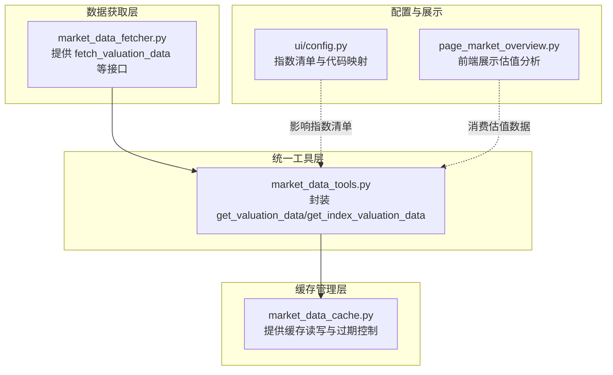
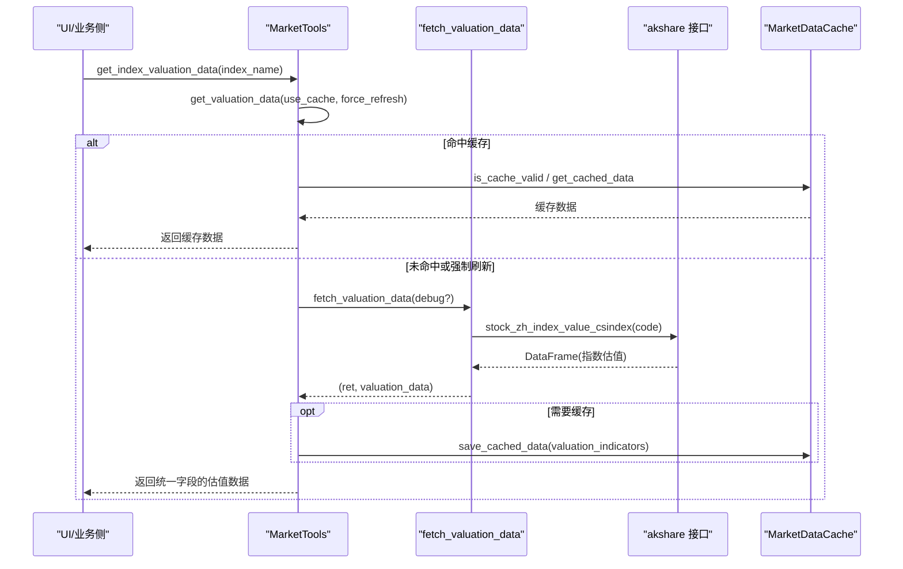
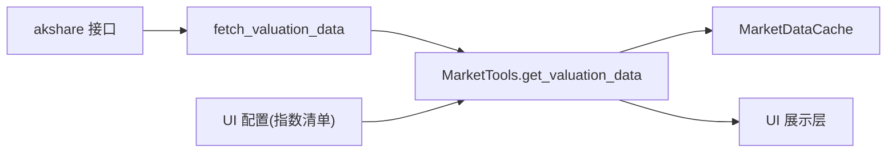

# 估值数据API

<cite>
**本文引用的文件**
- [market_data_fetcher.py](file://market/market_data_fetcher.py)
- [market_data_tools.py](file://market/market_data_tools.py)
- [market_data_cache.py](file://market/market_data_cache.py)
- [config.py](file://ui/config.py)
- [page_market_overview.py](file://ui/components/page_market_overview.py)
</cite>

## 目录
1. [简介](#简介)
2. [项目结构](#项目结构)
3. [核心组件](#核心组件)
4. [架构总览](#架构总览)
5. [详细组件分析](#详细组件分析)
6. [依赖关系分析](#依赖关系分析)
7. [性能考量](#性能考量)
8. [故障排查指南](#故障排查指南)
9. [结论](#结论)

## 简介
本文件面向“估值数据API”的使用者与维护者，系统性说明如何通过统一入口获取多指数（沪深300、中证500、中证1000、中证2000、上证50、科创50、沪深300成长、中证信息技术）的估值指标，重点覆盖以下方面：
- 函数 fetch_valuation_data 的实现与返回数据结构
- 字段命名规则（如 hs300_pe、zz500_dividend_yield 等）与含义
- 数据来源与 akshare 接口调用路径
- 部分指数获取失败的容错机制
- debug 模式下如何查看原始数据
- 数据缓存策略及对性能的影响

## 项目结构
围绕估值数据API的关键文件组织如下：
- 数据获取层：market/market_data_fetcher.py
- 统一工具层：market/market_data_tools.py
- 缓存管理层：market/market_data_cache.py
- UI配置与指数清单：ui/config.py
- UI展示层：ui/components/page_market_overview.py

图表来源
- [market_data_fetcher.py](file://market/market_data_fetcher.py#L181-L245)
- [market_data_tools.py](file://market/market_data_tools.py#L67-L194)
- [market_data_cache.py](file://market/market_data_cache.py#L120-L246)
- [config.py](file://ui/config.py#L45-L82)
- [page_market_overview.py](file://ui/components/page_market_overview.py#L22-L104)

章节来源
- [market_data_fetcher.py](file://market/market_data_fetcher.py#L181-L245)
- [market_data_tools.py](file://market/market_data_tools.py#L67-L194)
- [market_data_cache.py](file://market/market_data_cache.py#L120-L246)
- [config.py](file://ui/config.py#L45-L82)
- [page_market_overview.py](file://ui/components/page_market_overview.py#L22-L104)

## 核心组件
- fetch_valuation_data：从 akshare 的 stock_zh_index_value_csindex 接口批量抓取多个指数的估值指标，返回布尔结果与字典数据；支持 debug 模式输出原始数据片段。
- MarketTools.get_valuation_data：统一入口，负责缓存命中判断、异常回退与数据持久化。
- MarketTools.get_index_valuation_data：按指数名称提取并标准化估值数据，提供“直接估值”与“参考估值”的映射逻辑。
- MarketDataCache：提供差异化过期策略（分钟级）、序列化清洗、索引相关缓存键管理。
- UI配置：FOCUS_INDICES 定义关注指数集合，INDEX_CODE_MAPPING/INDEX_SYMBOL_MAPPING 提供代码映射，影响工具层的指数选择与展示。

章节来源
- [market_data_fetcher.py](file://market/market_data_fetcher.py#L181-L245)
- [market_data_tools.py](file://market/market_data_tools.py#L67-L194)
- [market_data_cache.py](file://market/market_data_cache.py#L120-L246)
- [config.py](file://ui/config.py#L45-L82)

## 架构总览
估值数据API的调用链路如下：
- UI/业务侧调用 MarketTools.get_index_valuation_data
- MarketTools.get_valuation_data 决策是否走缓存或触发 fetch_valuation_data
- fetch_valuation_data 逐个指数调用 akshare 接口，组装统一字段并返回
- MarketTools.get_index_valuation_data 将统一字段映射为通用 index_pe/index_dividend_yield 等

图表来源
- [market_data_tools.py](file://market/market_data_tools.py#L67-L194)
- [market_data_fetcher.py](file://market/market_data_fetcher.py#L181-L245)
- [market_data_cache.py](file://market/market_data_cache.py#L120-L246)

## 详细组件分析

### 函数：fetch_valuation_data
- 功能：批量抓取多个指数的估值指标（PE、股息率、日期），并生成统一字段。
- 输入参数：
  - debug：开启后打印每个指数的原始数据尾部片段，便于调试。
- 指数清单与代码映射：
  - 指数名称到代码的映射在函数内部定义，覆盖沪深300、中证500、中证1000、中证2000、上证50、科创50、沪深300成长、中证信息技术。
- 数据来源：
  - 通过 ak.stock_zh_index_value_csindex(index_code) 获取指数估值历史数据。
- 字段生成规则：
  - 统一字段：将指数名称转换为小写并替换“沪深”为“hs”、“中证”为“zz”，得到类似“zz500_pe”、“zz1000_dividend_yield”等键名。
  - 兼容字段：当指数为“沪深300”时，同时写入“hs300_pe”、“hs300_dividend_yield”、“hs300_date”等旧版键名。
  - 时间戳：追加“update_time”。
- 异常与容错：
  - 单个指数抓取失败不会中断整体流程，会记录失败并继续下一个指数。
  - 若没有任何指数成功抓取，返回的布尔标志为 False。
- 返回值：
  - (ret, valuation_data)，其中 ret 表示本次抓取是否至少有一个指数成功，valuation_data 是统一字段的字典。

章节来源
- [market_data_fetcher.py](file://market/market_data_fetcher.py#L181-L245)

### 字段命名规则与含义
- 统一命名：
  - {prefix}_pe：市盈率（PE）
  - {prefix}_dividend_yield：股息率
  - {prefix}_date：数据日期
  - prefix 规则：将“沪深”替换为“hs”，“中证”替换为“zz”，例如“沪深300”→“hs300”，“中证500”→“zz500”。
- 兼容命名：
  - “沪深300”同时生成“hs300_pe”、“hs300_dividend_yield”、“hs300_date”，以兼容既有代码。
- 通用字段：
  - get_index_valuation_data 会将统一字段转换为“index_pe”、“index_dividend_yield”、“index_date”，便于跨指数统一展示。

章节来源
- [market_data_fetcher.py](file://market/market_data_fetcher.py#L202-L230)
- [market_data_tools.py](file://market/market_data_tools.py#L160-L188)

### 数据来源与 akshare 接口
- 接口调用：ak.stock_zh_index_value_csindex(index_code)
- 数据内容：返回指数估值历史数据，函数取最新一条记录的“市盈率1”、“股息率1”、“日期”等列。
- debug 模式：在抓取成功时打印原始数据尾部片段，便于核对字段与数值。

章节来源
- [market_data_fetcher.py](file://market/market_data_fetcher.py#L202-L230)

### 容错机制与失败处理
- 单指数失败不阻断：每个指数独立 try-except，失败仅记录并继续下一个指数。
- 整体失败判定：若没有任何指数成功抓取，返回的布尔标志为 False。
- 缓存回退：MarketTools.get_valuation_data 在异常或缓存可用时回退到缓存数据，保证 UI 可用性。
- 参考估值：当目标指数无直接估值数据时，get_index_valuation_data 会回退到“沪深300”作为参考，并标注“is_direct_valuation=false”。

章节来源
- [market_data_fetcher.py](file://market/market_data_fetcher.py#L233-L241)
- [market_data_tools.py](file://market/market_data_tools.py#L67-L83)
- [market_data_tools.py](file://market/market_data_tools.py#L172-L188)

### debug 模式查看原始数据
- 在调用 get_valuation_data 时传入 debug=True（或通过底层 fetch_valuation_data 的 debug 参数），即可在控制台看到每个指数的原始数据尾部片段，便于确认字段与数值是否符合预期。

章节来源
- [market_data_fetcher.py](file://market/market_data_fetcher.py#L205-L208)

### 数据缓存策略与性能影响
- 缓存类型与过期时间（分钟）：
  - valuation_indicators：1440 分钟（1 天）
  - market_sentiment/comprehensive_sentiment：15 分钟
  - money_flow_indicators：43200 分钟（30 天）
  - margin_detail：60 分钟
  - current_indices：5 分钟
  - technical_indicators/ai_analysis：60/180 分钟（指数相关）
- 缓存键规则：
  - 非指数相关：直接以数据类型为键
  - 指数相关：键为“数据类型_指数名称”
- 性能影响：
  - 首次抓取后，后续请求直接命中缓存，显著降低网络请求与解析成本
  - 对高频访问的估值指标（如估值、资金流）可明显减少外部依赖压力
  - 缓存清理与状态打印便于运维监控

章节来源
- [market_data_cache.py](file://market/market_data_cache.py#L132-L142)
- [market_data_cache.py](file://market/market_data_cache.py#L180-L246)
- [market_data_tools.py](file://market/market_data_tools.py#L67-L83)

## 依赖关系分析
- 组件耦合：
  - MarketTools 依赖 MarketDataCache 与 fetch_valuation_data
  - fetch_valuation_data 依赖 akshare 的 stock_zh_index_value_csindex
  - UI 层通过 MarketTools 消费估值数据
- 外部依赖：
  - akshare：提供指数估值历史数据
  - JSON 序列化：NumpyJSONEncoder 处理 numpy/pandas/datetime 等类型

图表来源
- [market_data_fetcher.py](file://market/market_data_fetcher.py#L181-L245)
- [market_data_tools.py](file://market/market_data_tools.py#L67-L194)
- [market_data_cache.py](file://market/market_data_cache.py#L120-L246)
- [config.py](file://ui/config.py#L45-L82)
- [page_market_overview.py](file://ui/components/page_market_overview.py#L22-L104)

## 性能考量
- 缓存命中优先：get_valuation_data 会在 use_cache=True 且未强制刷新时优先返回缓存，避免重复抓取。
- 批量抓取与失败隔离：fetch_valuation_data 逐指数抓取，单点失败不影响其他指数，提高整体成功率。
- 数据清洗与序列化：NumpyJSONEncoder 自动处理 NaN/无穷大与 numpy/pandas 类型，减少序列化错误与重试成本。
- UI 层复用：UI 通过 MarketTools 统一获取，避免重复请求与逻辑分散。

[本节为通用性能讨论，无需列出具体文件来源]

## 故障排查指南
- 症状：未获取到估值数据
  - 检查缓存是否有效：使用 MarketTools.print_cache_status 查看“估值指标”缓存状态
  - 强制刷新：调用 get_valuation_data(use_cache=True, force_refresh=True)
  - debug 模式：在 fetch_valuation_data 中开启 debug，查看各指数原始数据尾部片段
- 症状：部分指数缺失
  - 由于单指数失败不阻断，若出现某些指数缺失，属于正常容错行为
  - 可通过参考估值回退逻辑（get_index_valuation_data）确认是否使用了“沪深300”作为参考
- 症状：akshare 接口异常
  - 确认网络连通性与 akshare 版本
  - 查看控制台输出的异常信息，定位具体指数与错误栈

章节来源
- [market_data_tools.py](file://market/market_data_tools.py#L408-L420)
- [market_data_fetcher.py](file://market/market_data_fetcher.py#L233-L241)
- [page_market_overview.py](file://ui/components/page_market_overview.py#L22-L104)

## 结论
- fetch_valuation_data 提供了稳定、可扩展的多指数估值数据抓取能力，统一字段命名与兼容旧版键名，满足 UI 与下游模块的多样化需求。
- 容错与缓存机制保障了在部分数据源不稳定时仍能提供可用数据，并显著降低网络与解析成本。
- debug 模式与缓存状态打印为问题定位与运维提供了便利工具。