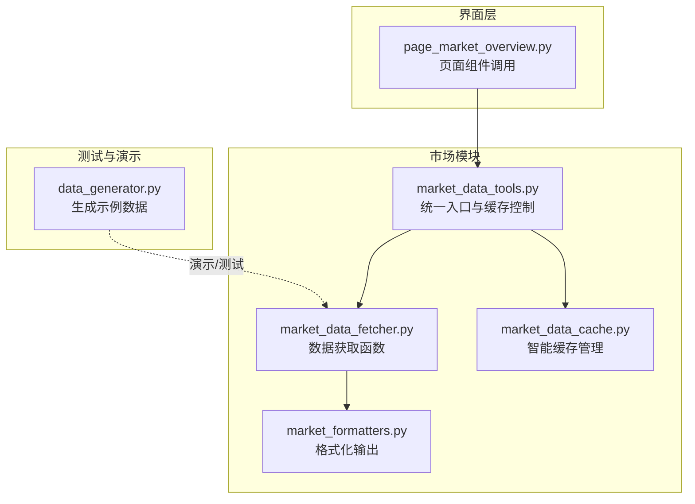
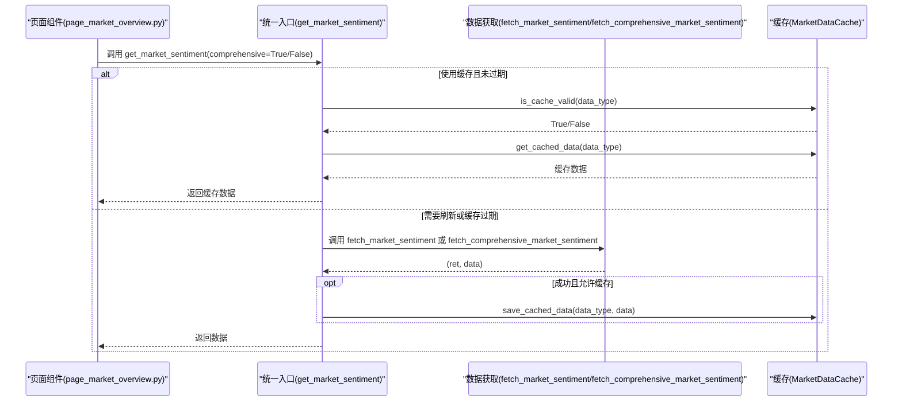
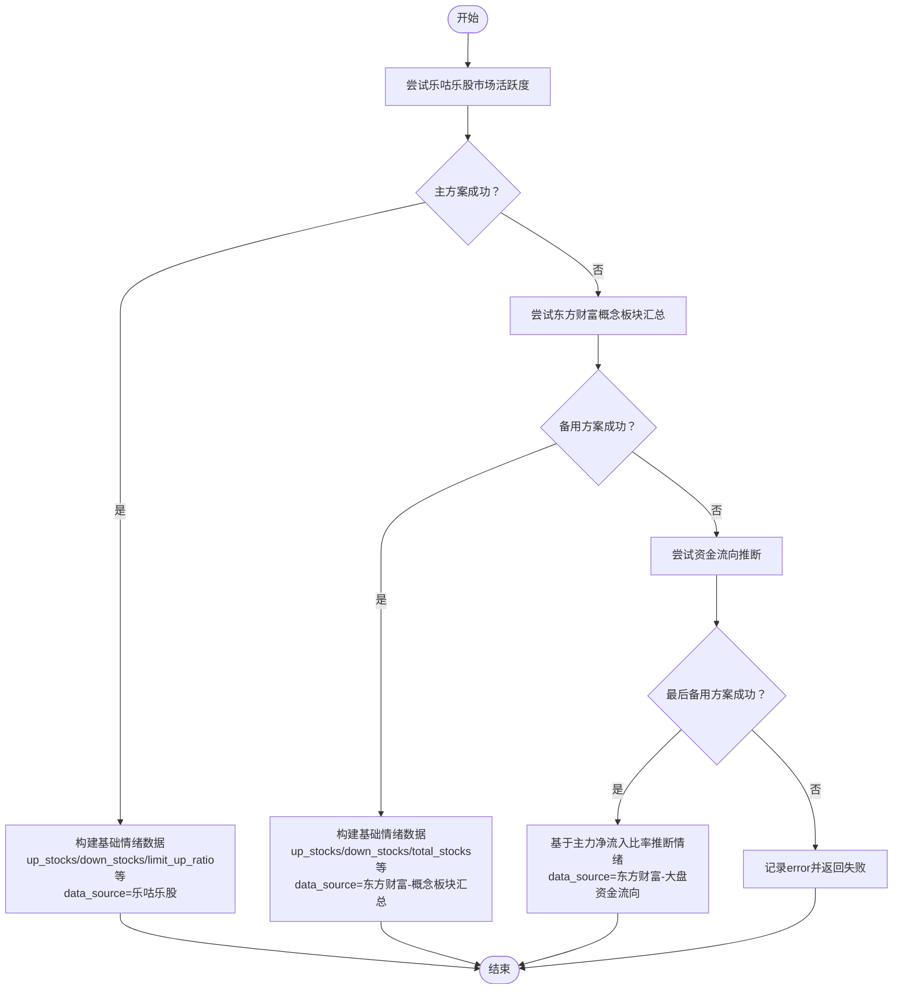
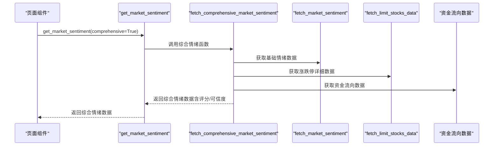
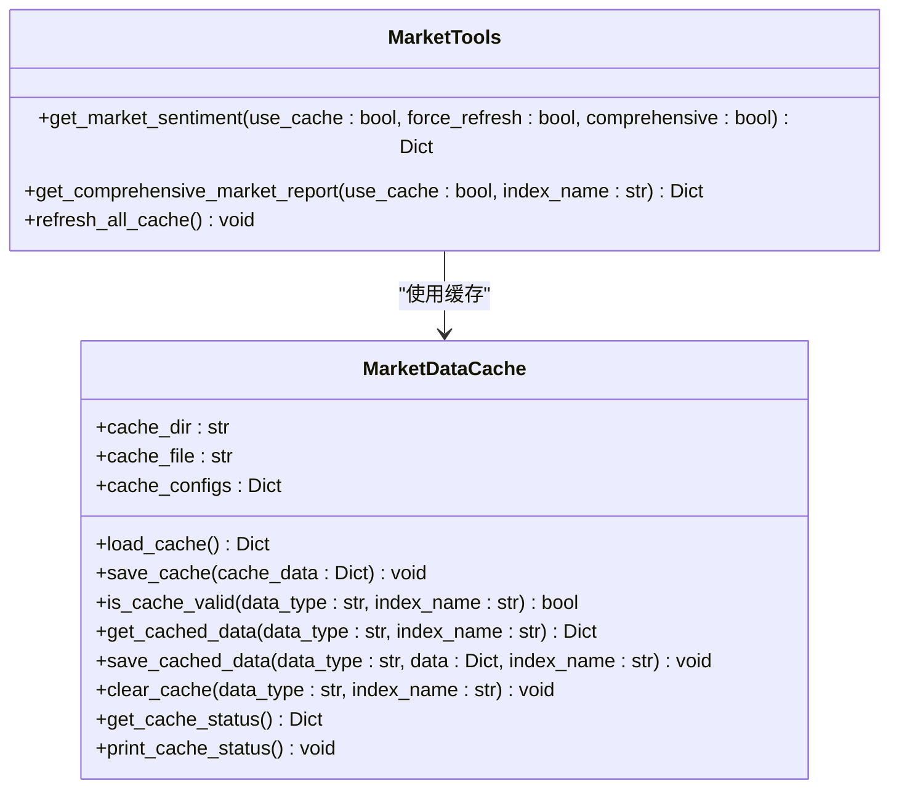
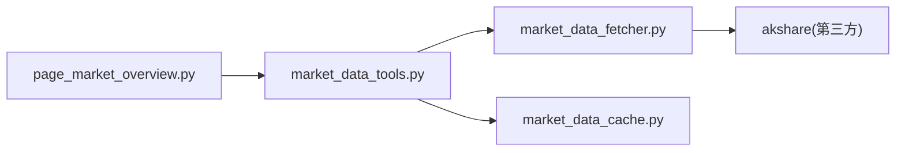

# 市场情绪数据API

<cite>
**本文引用的文件**
- [market_data_fetcher.py](file://market/market_data_fetcher.py)
- [market_data_tools.py](file://market/market_data_tools.py)
- [market_data_cache.py](file://market/market_data_cache.py)
- [market_formatters.py](file://market/market_formatters.py)
- [page_market_overview.py](file://ui/components/page_market_overview.py)
- [data_generator.py](file://tests/fixtures/data_generator.py)
</cite>

## 目录
1. [简介](#简介)
2. [项目结构](#项目结构)
3. [核心组件](#核心组件)
4. [架构总览](#架构总览)
5. [详细组件分析](#详细组件分析)
6. [依赖分析](#依赖分析)
7. [性能考量](#性能考量)
8. [故障排查指南](#故障排查指南)
9. [结论](#结论)
10. [附录](#附录)

## 简介
本文件面向开发者与使用者，系统化说明市场情绪数据API的设计与实现，重点覆盖以下内容：
- fetch_market_sentiment 函数的三重备用机制：主方案使用乐咕乐股的市场活跃度数据；备用方案使用东方财富概念板块汇总数据；最后备用方案基于资金流向推断市场情绪。
- 返回值结构中的关键指标 up_stocks、down_stocks、limit_up_ratio 等及其计算逻辑。
- data_source 字段如何标识数据来源。
- 与 fetch_comprehensive_market_sentiment 的集成关系。
- 智能缓存机制如何减少对第三方API的重复请求，提升性能与稳定性。

## 项目结构
围绕市场情绪数据的相关模块组织如下：
- market/market_data_fetcher.py：提供 fetch_market_sentiment、fetch_comprehensive_market_sentiment 等数据获取函数。
- market/market_data_tools.py：封装统一入口 get_market_sentiment，负责缓存策略与错误回退。
- market/market_data_cache.py：提供智能缓存管理，支持多种数据类型的差异化过期策略。
- market/market_formatters.py：提供市场情绪数据的Markdown格式化输出，展示 data_source 与更新时间等元信息。
- ui/components/page_market_overview.py：前端页面组件，调用 get_market_sentiment 并渲染市场情绪分析。
- tests/fixtures/data_generator.py：测试与演示用的市场情绪数据生成器（非生产数据）。

**图表来源**
- [market_data_fetcher.py](file://market/market_data_fetcher.py#L1-L136)
- [market_data_tools.py](file://market/market_data_tools.py#L1-L120)
- [market_data_cache.py](file://market/market_data_cache.py#L120-L240)
- [market_formatters.py](file://market/market_formatters.py#L102-L334)
- [page_market_overview.py](file://ui/components/page_market_overview.py#L162-L178)
- [data_generator.py](file://tests/fixtures/data_generator.py#L118-L172)

**章节来源**
- [market_data_fetcher.py](file://market/market_data_fetcher.py#L1-L136)
- [market_data_tools.py](file://market/market_data_tools.py#L1-L120)
- [market_data_cache.py](file://market/market_data_cache.py#L120-L240)
- [market_formatters.py](file://market/market_formatters.py#L102-L334)
- [page_market_overview.py](file://ui/components/page_market_overview.py#L162-L178)
- [data_generator.py](file://tests/fixtures/data_generator.py#L118-L172)

## 核心组件
- fetch_market_sentiment：三重备用机制的数据获取函数，返回布尔标志与字典数据，包含 up_stocks、down_stocks、limit_up_ratio 等核心指标及 data_source。
- get_market_sentiment：统一入口，封装缓存策略与异常回退，支持 comprehensive 参数切换基础/综合情绪。
- MarketDataCache：智能缓存管理器，按数据类型配置过期时间，自动序列化/反序列化，支持清理与状态查询。
- MarketTextFormatter：将情绪数据格式化为Markdown，展示 data_source 与更新时间等元信息。
- 页面组件：调用 get_market_sentiment 并渲染市场情绪分析。

**章节来源**
- [market_data_fetcher.py](file://market/market_data_fetcher.py#L24-L136)
- [market_data_tools.py](file://market/market_data_tools.py#L39-L66)
- [market_data_cache.py](file://market/market_data_cache.py#L120-L240)
- [market_formatters.py](file://market/market_formatters.py#L102-L334)
- [page_market_overview.py](file://ui/components/page_market_overview.py#L162-L178)

## 架构总览
下图展示了从页面到数据获取再到缓存的整体流程，以及 fetch_market_sentiment 与 fetch_comprehensive_market_sentiment 的协作关系。

**图表来源**
- [page_market_overview.py](file://ui/components/page_market_overview.py#L162-L178)
- [market_data_tools.py](file://market/market_data_tools.py#L39-L66)
- [market_data_fetcher.py](file://market/market_data_fetcher.py#L24-L136)
- [market_data_cache.py](file://market/market_data_cache.py#L192-L239)

## 详细组件分析

### fetch_market_sentiment 三重备用机制
- 主方案（乐咕乐股市场活跃度）：优先尝试获取“上涨/下跌/平盘/涨停/跌停/真实涨停/真实跌停/停牌”等数据，计算 up_stocks、down_stocks、flat_stocks、limit_up_stocks、limit_down_stocks、real_limit_up_stocks、real_limit_down_stocks、suspended_stocks、total_stocks、up_ratio、down_ratio、limit_up_ratio，并标注 data_source 为“乐咕乐股-市场活跃度”。若成功，返回 ret=True；否则进入备用方案。
- 备用方案（东方财富概念板块汇总）：当主方案失败时，尝试从“概念板块名称”接口汇总“上涨家数/下跌家数”，估算 total_stocks≈上涨家数+下跌家数，计算 up_ratio、down_ratio，并标注 data_source 为“东方财富-概念板块汇总”。若成功，返回 ret=True；否则进入最后备用方案。
- 最后备用方案（资金流向推断）：当备用方案失败时，尝试从“大盘资金流向”接口读取“主力净流入-净额/净占比”，据此推断市场情绪（bullish/bearish/neutral），并标注 data_source 为“东方财富-大盘资金流向”。若仍失败，写入 error 字段并返回 ret=False。

**图表来源**
- [market_data_fetcher.py](file://market/market_data_fetcher.py#L24-L136)

**章节来源**
- [market_data_fetcher.py](file://market/market_data_fetcher.py#L24-L136)

### 返回值结构与关键指标
- 基础情绪数据（主方案）包含：
  - up_stocks：上涨股票家数
  - down_stocks：下跌股票家数
  - flat_stocks：平盘股票家数
  - limit_up_stocks：涨停股票家数
  - limit_down_stocks：跌停股票家数
  - real_limit_up_stocks：真实涨停股票家数
  - real_limit_down_stocks：真实跌停股票家数
  - suspended_stocks：停牌股票家数
  - total_stocks：总交易股票家数
  - up_ratio：上涨占比 = up_stocks / total_stocks
  - down_ratio：下跌占比 = down_stocks / total_stocks
  - limit_up_ratio：涨停占比 = limit_up_stocks / total_stocks
  - data_source：数据来源标识
  - update_time：更新时间
- 备用方案（概念板块汇总）包含：
  - up_stocks、down_stocks、total_stocks、up_ratio、down_ratio、data_source、update_time
  - 注：平盘信息缺失（flat_stocks=0）
- 最后备用方案（资金流向推断）包含：
  - main_net_inflow：主力净流入金额
  - main_net_ratio：主力净流入占比
  - market_mood：基于资金流向推断的情绪（bullish/bearish/neutral）
  - data_source：数据来源标识
  - update_time：更新时间

计算逻辑要点：
- total_stocks 在主方案由上涨/下跌/平盘求和；在备用方案由上涨家数+下跌家数估算。
- up_ratio、down_ratio、limit_up_ratio 均以 total_stocks 为分母，total_stocks=0 时比值为0。
- limit_up_ratio 仅在主方案存在 limit_up_stocks 时计算。

**章节来源**
- [market_data_fetcher.py](file://market/market_data_fetcher.py#L39-L89)
- [market_data_fetcher.py](file://market/market_data_fetcher.py#L101-L127)

### data_source 字段与更新时间
- data_source 字段用于标识数据来源，主方案为“乐咕乐股-市场活跃度”，备用方案为“东方财富-概念板块汇总”，最后备用方案为“东方财富-大盘资金流向”。
- update_time 字段记录数据获取时间，便于前端展示与审计。

**章节来源**
- [market_data_fetcher.py](file://market/market_data_fetcher.py#L62-L63)
- [market_data_fetcher.py](file://market/market_data_fetcher.py#L92-L93)
- [market_data_fetcher.py](file://market/market_data_fetcher.py#L123-L124)
- [market_data_fetcher.py](file://market/market_data_fetcher.py#L134-L135)

### 与 fetch_comprehensive_market_sentiment 的集成关系
- fetch_comprehensive_market_sentiment 会先调用 fetch_market_sentiment 获取基础情绪数据，再补充涨跌停详细数据与资金流向数据，并基于多源指标计算综合情绪评分与可信度。
- 页面组件通过 get_market_sentiment(comprehensive=True) 获取综合情绪分析，内部委托 fetch_comprehensive_market_sentiment 完成评分与整合。

**图表来源**
- [market_data_tools.py](file://market/market_data_tools.py#L39-L66)
- [market_data_fetcher.py](file://market/market_data_fetcher.py#L463-L566)
- [market_data_fetcher.py](file://market/market_data_fetcher.py#L138-L178)

**章节来源**
- [market_data_tools.py](file://market/market_data_tools.py#L39-L66)
- [market_data_fetcher.py](file://market/market_data_fetcher.py#L463-L566)
- [market_data_fetcher.py](file://market/market_data_fetcher.py#L138-L178)

### 智能缓存机制与性能优化
- MarketDataCache 为不同数据类型配置差异化过期时间，例如市场情绪指标（基础/综合）过期时间为15分钟，资金流向为43200分钟（30天），估值为1440分钟（1天）等。
- get_market_sentiment 在调用 fetch_* 前先检查缓存有效性，若有效则直接返回缓存数据，避免重复请求第三方API。
- 缓存文件采用 JSON 序列化，内置 NumpyJSONEncoder 清理 NaN/无穷大等特殊值，保证稳定持久化。
- 支持按数据类型与指数名称清理缓存，提供缓存状态打印与刷新功能，便于调试与运维。

**图表来源**
- [market_data_cache.py](file://market/market_data_cache.py#L120-L240)
- [market_data_tools.py](file://market/market_data_tools.py#L39-L66)

**章节来源**
- [market_data_cache.py](file://market/market_data_cache.py#L120-L240)
- [market_data_cache.py](file://market/market_data_cache.py#L296-L388)
- [market_data_tools.py](file://market/market_data_tools.py#L39-L66)
- [market_data_tools.py](file://market/market_data_tools.py#L408-L420)

### 页面集成与展示
- 页面组件 display_market_sentiment_analysis 调用 get_market_sentiment(comprehensive=True)，并将返回的综合情绪数据交给 MarketTextFormatter.format_sentiment_data 输出为 Markdown。
- MarketTextFormatter 会在详细模式下展示情绪评分、等级、可信度、涨跌概览、涨停/跌停信号等，并在详细版本中展示 data_source 与 update_time。

**章节来源**
- [page_market_overview.py](file://ui/components/page_market_overview.py#L162-L178)
- [market_formatters.py](file://market/market_formatters.py#L102-L334)

## 依赖分析
- 模块耦合关系：
  - page_market_overview.py 依赖 market_data_tools.get_market_sentiment。
  - market_data_tools 依赖 market_data_fetcher（基础/综合情绪）、market_data_cache（缓存）。
  - market_data_fetcher 依赖 akshare（第三方数据源）与内部工具模块。
- 关键外部依赖：
  - akshare：用于获取乐咕乐股市场活跃度、概念板块汇总、资金流向、指数实时数据等。
- 可能的循环依赖：
  - 通过函数级导入避免模块级循环依赖，例如在需要时才导入 market_data_tools 或 market_ai_analysis。

**图表来源**
- [page_market_overview.py](file://ui/components/page_market_overview.py#L162-L178)
- [market_data_tools.py](file://market/market_data_tools.py#L1-L38)
- [market_data_fetcher.py](file://market/market_data_fetcher.py#L1-L23)

**章节来源**
- [page_market_overview.py](file://ui/components/page_market_overview.py#L162-L178)
- [market_data_tools.py](file://market/market_data_tools.py#L1-L38)
- [market_data_fetcher.py](file://market/market_data_fetcher.py#L1-L23)

## 性能考量
- 三重备用机制显著降低对外部API失败的影响，提高可用性与鲁棒性。
- 智能缓存将高频访问的基础/综合情绪数据缓存15分钟，大幅减少网络请求与第三方API限流风险。
- 资金流向与估值等数据配置较长过期时间，适合周期性刷新，避免频繁抓取。
- 前端页面支持“使用缓存数据/强制刷新”切换，兼顾性能与准确性。

[本节为通用指导，无需具体文件引用]

## 故障排查指南
- 主方案失败：
  - 现象：日志显示“获取市场活跃度数据失败”，随后尝试备用方案。
  - 排查：检查 akshare 是否可用、网络连通性、第三方接口状态。
- 备用方案失败：
  - 现象：备用方案也失败，日志显示“备用方案也失败”，随后尝试最后备用方案。
  - 排查：确认概念板块接口可用性；若仍失败，进入最后备用方案。
- 最后备用方案失败：
  - 现象：所有数据源都失败，返回 error 字段。
  - 排查：检查 akshare 资金流向接口；必要时手动刷新缓存或禁用缓存强制获取最新数据。
- 缓存问题：
  - 现象：显示旧数据或长时间未更新。
  - 排查：使用 MarketTools.refresh_all_cache() 刷新缓存；或调用 MarketTools.clear_cache() 清理指定数据类型缓存；检查缓存文件是否存在与权限。
- 页面显示异常：
  - 现象：未获取到市场情绪数据或警告提示。
  - 排查：确认页面调用 get_market_sentiment(comprehensive=True)；检查 MarketTextFormatter 的输入数据结构是否符合预期。

**章节来源**
- [market_data_fetcher.py](file://market/market_data_fetcher.py#L69-L135)
- [market_data_tools.py](file://market/market_data_tools.py#L408-L420)
- [market_data_cache.py](file://market/market_data_cache.py#L247-L295)

## 结论
本API通过三重备用机制与智能缓存策略，在保证数据准确性的同时，显著提升了系统的可用性与性能。返回值结构清晰，关键指标与 data_source 字段明确，便于前端展示与后续扩展。与 fetch_comprehensive_market_sentiment 的集成进一步丰富了情绪分析维度，形成从基础到综合的完整数据链路。

[本节为总结性内容，无需具体文件引用]

## 附录

### 返回值字段说明（基础情绪）
- up_stocks：上涨股票家数
- down_stocks：下跌股票家数
- flat_stocks：平盘股票家数
- limit_up_stocks：涨停股票家数
- limit_down_stocks：跌停股票家数
- real_limit_up_stocks：真实涨停股票家数
- real_limit_down_stocks：真实跌停股票家数
- suspended_stocks：停牌股票家数
- total_stocks：总交易股票家数
- up_ratio：上涨占比
- down_ratio：下跌占比
- limit_up_ratio：涨停占比
- data_source：数据来源标识
- update_time：更新时间

**章节来源**
- [market_data_fetcher.py](file://market/market_data_fetcher.py#L39-L89)
- [market_data_fetcher.py](file://market/market_data_fetcher.py#L101-L127)

### 返回值字段说明（最后备用方案）
- main_net_inflow：主力净流入金额
- main_net_ratio：主力净流入占比
- market_mood：基于资金流向推断的情绪（bullish/bearish/neutral）
- data_source：数据来源标识
- update_time：更新时间

**章节来源**
- [market_data_fetcher.py](file://market/market_data_fetcher.py#L101-L127)

### 示例：生成示例市场情绪数据（测试用途）
- 生成器提供 market_sentiment 字段与 money_flow 字段，便于测试与演示。
- 注意：此为测试数据，不应用于生产环境。

**章节来源**
- [data_generator.py](file://tests/fixtures/data_generator.py#L118-L172)