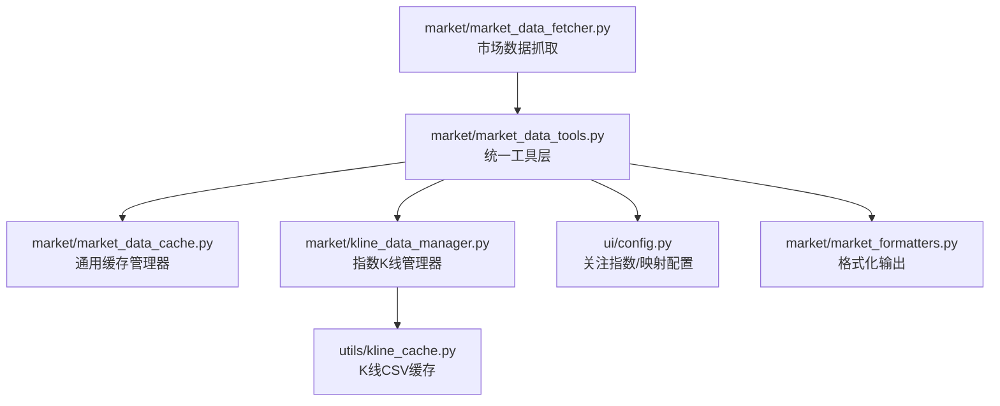
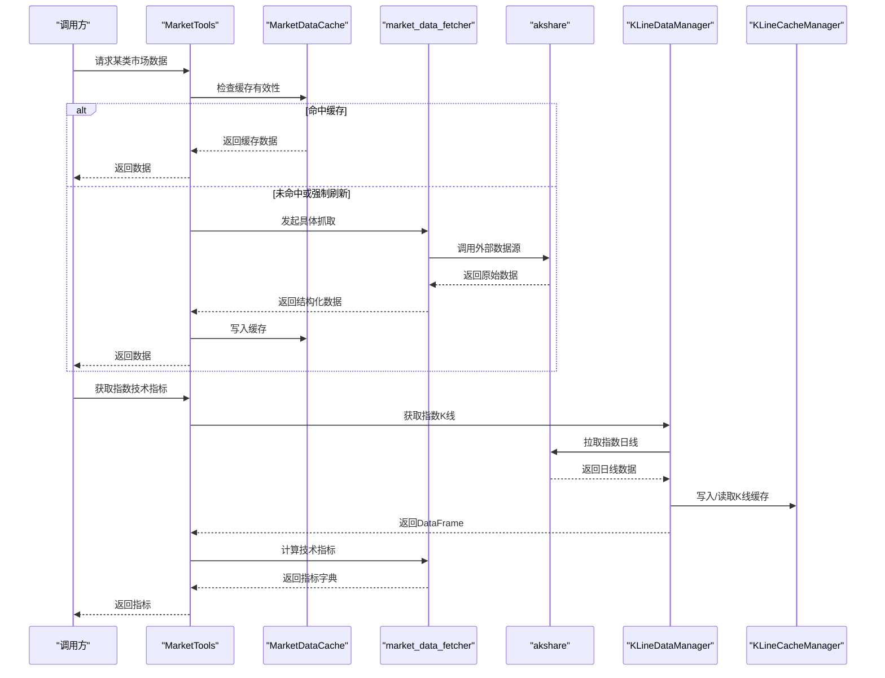
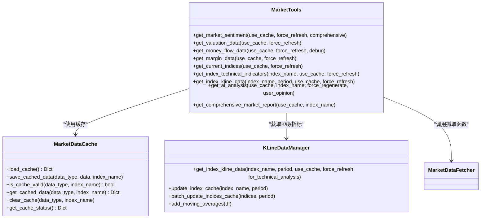

# 市场数据API

<cite>
**本文引用的文件**
- [market_data_fetcher.py](file://market/market_data_fetcher.py)
- [market_data_tools.py](file://market/market_data_tools.py)
- [market_data_cache.py](file://market/market_data_cache.py)
- [kline_data_manager.py](file://market/kline_data_manager.py)
- [config.py](file://ui/config.py)
- [kline_cache.py](file://utils/kline_cache.py)
- [market_formatters.py](file://market/market_formatters.py)
</cite>

## 目录
1. [简介](#简介)
2. [项目结构](#项目结构)
3. [核心组件](#核心组件)
4. [架构总览](#架构总览)
5. [详细组件分析](#详细组件分析)
6. [依赖关系分析](#依赖关系分析)
7. [性能考量](#性能考量)
8. [故障排查指南](#故障排查指南)
9. [结论](#结论)
10. [附录](#附录)

## 简介
本文件为“市场数据API”的权威参考文档，聚焦于市场数据获取与缓存体系，覆盖以下公共函数：
- 市场情绪：fetch_market_sentiment、fetch_comprehensive_market_sentiment
- 估值指标：fetch_valuation_data
- 资金流向：fetch_money_flow_data
- 指数实时：fetch_current_indices
- 融资融券：fetch_margin_data_unified
- 指数技术指标：fetch_index_technical_indicators
- 辅助：fetch_limit_stocks_data、update_index_cache_data、batch_update_indices_cache

文档同时解释与akshare等外部数据源的交互方式、智能缓存机制、错误处理策略，并提供调用示例与最佳实践。

## 项目结构
围绕市场数据获取与缓存的关键模块如下：
- market/market_data_fetcher.py：市场数据抓取与聚合
- market/market_data_tools.py：统一工具层，封装缓存策略与数据组装
- market/market_data_cache.py：通用市场数据缓存管理器
- market/kline_data_manager.py：指数K线数据统一管理与缓存
- utils/kline_cache.py：K线数据CSV缓存（指数日线专用）
- ui/config.py：关注指数与映射配置
- market/market_formatters.py：报告与格式化工具（用于输出）

图表来源
- [market_data_fetcher.py](file://market/market_data_fetcher.py#L1-L607)
- [market_data_tools.py](file://market/market_data_tools.py#L1-L519)
- [market_data_cache.py](file://market/market_data_cache.py#L1-L440)
- [kline_data_manager.py](file://market/kline_data_manager.py#L1-L330)
- [kline_cache.py](file://utils/kline_cache.py#L1-L477)
- [config.py](file://ui/config.py#L1-L82)
- [market_formatters.py](file://market/market_formatters.py#L1-L939)

章节来源
- [market_data_fetcher.py](file://market/market_data_fetcher.py#L1-L607)
- [market_data_tools.py](file://market/market_data_tools.py#L1-L519)
- [market_data_cache.py](file://market/market_data_cache.py#L1-L440)
- [kline_data_manager.py](file://market/kline_data_manager.py#L1-L330)
- [kline_cache.py](file://utils/kline_cache.py#L1-L477)
- [config.py](file://ui/config.py#L1-L82)
- [market_formatters.py](file://market/market_formatters.py#L1-L939)

## 核心组件
- 市场数据抓取器：封装akshare等外部数据源调用，提供稳定接口与降级策略
- 统一工具层：封装缓存读写、数据组装、错误回退与格式化输出
- 缓存管理器：通用缓存策略（过期时间、索引区分、序列化）
- K线管理器：指数K线数据获取、转换、缓存与均线计算
- 配置中心：关注指数与akshare符号映射

章节来源
- [market_data_fetcher.py](file://market/market_data_fetcher.py#L1-L607)
- [market_data_tools.py](file://market/market_data_tools.py#L1-L519)
- [market_data_cache.py](file://market/market_data_cache.py#L1-L440)
- [kline_data_manager.py](file://market/kline_data_manager.py#L1-L330)
- [config.py](file://ui/config.py#L1-L82)

## 架构总览
下图展示市场数据API的调用链路与缓存交互：

图表来源
- [market_data_tools.py](file://market/market_data_tools.py#L1-L519)
- [market_data_fetcher.py](file://market/market_data_fetcher.py#L1-L607)
- [kline_data_manager.py](file://market/kline_data_manager.py#L1-L330)
- [kline_cache.py](file://utils/kline_cache.py#L1-L477)

## 详细组件分析

### 函数：fetch_market_sentiment（市场情绪）
- 功能：获取市场情绪数据，包含上涨/下跌/平盘家数、涨停/跌停家数、真实涨跌停、总体比例等
- 参数：无
- 返回：(布尔, 字典)
  - 布尔：是否成功
  - 字典：包含 up_stocks、down_stocks、flat_stocks、limit_up_stocks、limit_down_stocks、real_limit_up_stocks、real_limit_down_stocks、suspended_stocks、total_stocks、up_ratio、down_ratio、limit_up_ratio、data_source、update_time
- 错误处理：三段式降级策略（乐咕乐股→概念板块→资金流向），任一成功即返回，否则记录错误
- 外部依赖：akshare（乐咕乐股、概念板块、资金流向）
- 调用示例路径：[调用示例路径](file://market/market_data_tools.py#L39-L66)

章节来源
- [market_data_fetcher.py](file://market/market_data_fetcher.py#L24-L135)
- [market_data_tools.py](file://market/market_data_tools.py#L39-L66)

### 函数：fetch_comprehensive_market_sentiment（综合市场情绪）
- 功能：整合基础情绪、涨跌停分析、资金流向，计算综合评分与情绪等级
- 参数：无
- 返回：(布尔, 字典)
  - 布尔：是否成功
  - 字典：包含 basic_sentiment、limit_analysis、fund_flow、sentiment_score、sentiment_level、confidence、update_time
- 评分规则：基于涨跌比例、涨跌停差值、主力净流入占比加权合成，可信度由数据源数量决定
- 外部依赖：akshare（资金流向）、内部调用 fetch_market_sentiment、fetch_limit_stocks_data
- 调用示例路径：[调用示例路径](file://market/market_data_tools.py#L39-L66)

章节来源
- [market_data_fetcher.py](file://market/market_data_fetcher.py#L463-L566)
- [market_data_tools.py](file://market/market_data_tools.py#L39-L66)

### 函数：fetch_valuation_data（估值指标）
- 功能：获取多指数估值指标（PE、股息率等），支持调试输出
- 参数：debug=False
- 返回：(布尔, 字典)
  - 布尔：是否至少获取到一个指数的PE
  - 字典：包含各指数的 pe、dividend_yield、date，以及统一命名的 index_key_pe/index_key_dividend_yield/update_time
- 外部依赖：akshare（中证指数系列）
- 调用示例路径：[调用示例路径](file://market/market_data_tools.py#L67-L84)

章节来源
- [market_data_fetcher.py](file://market/market_data_fetcher.py#L181-L245)
- [market_data_tools.py](file://market/market_data_tools.py#L67-L84)

### 函数：fetch_money_flow_data（资金流向）
- 功能：获取M2货币供应量、同比增长等宏观资金指标
- 参数：debug=False
- 返回：(布尔, 字典)
  - 布尔：是否成功
  - 字典：包含 m2_amount、m2_growth、m1_amount、m1_growth、m2_date、update_time
- 外部依赖：akshare（宏观数据）
- 调用示例路径：[调用示例路径](file://market/market_data_tools.py#L196-L213)

章节来源
- [market_data_fetcher.py](file://market/market_data_fetcher.py#L248-L283)
- [market_data_tools.py](file://market/market_data_tools.py#L196-L213)

### 函数：fetch_current_indices（当前指数实时）
- 功能：获取沪深重要指数的实时行情（最新价、涨跌幅、成交量、成交额等）
- 参数：无
- 返回：(布尔, 字典)
  - 布尔：是否成功
  - 字典：包含 indices_dict（按名称索引的指数明细）、total_count、data_source、update_time
- 外部依赖：akshare（指数实时）
- 调用示例路径：[调用示例路径](file://market/market_data_tools.py#L232-L249)

章节来源
- [market_data_fetcher.py](file://market/market_data_fetcher.py#L286-L355)
- [market_data_tools.py](file://market/market_data_tools.py#L232-L249)
- [config.py](file://ui/config.py#L45-L55)

### 函数：fetch_margin_data_unified（统一融资融券）
- 功能：统一获取上交所/深交所融资融券余额、融资买入、融券卖出，并可选计算周变化
- 参数：include_historical=False
- 返回：(布尔, 字典)
  - 布尔：是否至少获取到任一交易所的有效数据
  - 字典：包含 margin_balance、margin_buy_balance、margin_sell_balance、margin_sh_*、margin_sz_*、margin_date、update_time；当 include_historical=True 时追加 weekly_change、change_ratio、shanghai、shenzhen
- 外部依赖：akshare（上交所/深交所融资融券）
- 调用示例路径：[调用示例路径](file://market/market_data_tools.py#L214-L231)

章节来源
- [market_data_fetcher.py](file://market/market_data_fetcher.py#L358-L449)
- [market_data_tools.py](file://market/market_data_tools.py#L214-L231)

### 函数：fetch_index_technical_indicators（指数技术指标）
- 功能：获取指数技术指标（如均线、MACD、RSI等），并可选计算风险指标
- 参数：index_name='上证指数'，period=100
- 返回：(布尔, 字典)
  - 布尔：是否成功
  - 字典：技术指标字典；若启用风险计算，包含 risk_metrics
- 外部依赖：K线管理器（akshare日线→K线缓存→指标计算）
- 调用示例路径：[调用示例路径](file://market/market_data_tools.py#L283-L306)

章节来源
- [market_data_fetcher.py](file://market/market_data_fetcher.py#L568-L607)
- [kline_data_manager.py](file://market/kline_data_manager.py#L152-L200)
- [kline_cache.py](file://utils/kline_cache.py#L399-L418)

### 辅助函数
- fetch_limit_stocks_data：获取涨跌停股票数量与原因分布
- update_index_cache_data/batch_update_indices_cache：指数K线缓存更新入口
- 外部依赖：akshare（涨跌停池、指数日线）

章节来源
- [market_data_fetcher.py](file://market/market_data_fetcher.py#L138-L179)
- [market_data_fetcher.py](file://market/market_data_fetcher.py#L451-L461)
- [kline_data_manager.py](file://market/kline_data_manager.py#L202-L266)

## 依赖关系分析

图表来源
- [market_data_cache.py](file://market/market_data_cache.py#L120-L440)
- [market_data_tools.py](file://market/market_data_tools.py#L1-L519)
- [kline_data_manager.py](file://market/kline_data_manager.py#L152-L200)

章节来源
- [market_data_cache.py](file://market/market_data_cache.py#L120-L440)
- [market_data_tools.py](file://market/market_data_tools.py#L1-L519)
- [kline_data_manager.py](file://market/kline_data_manager.py#L152-L200)

## 性能考量
- 缓存策略
  - 通用缓存：按数据类型配置过期时间，支持指数区分键，自动清理与状态查询
  - K线缓存：CSV持久化，区分历史与近期数据新鲜度，指数日线专用
- 降级与容错
  - 市场情绪三段式抓取，任一成功即返回
  - 融资融券分别抓取，任一成功即返回
  - 技术指标计算失败时返回空字典并记录警告
- I/O与网络
  - 批量更新指数缓存，减少重复抓取
  - K线数据按需拉取，避免重复请求

章节来源
- [market_data_cache.py](file://market/market_data_cache.py#L132-L142)
- [market_data_cache.py](file://market/market_data_cache.py#L192-L208)
- [kline_cache.py](file://utils/kline_cache.py#L63-L112)
- [kline_data_manager.py](file://market/kline_data_manager.py#L232-L266)

## 故障排查指南
- 常见问题
  - akshare接口不稳定：检查网络与akshare版本，观察降级分支是否生效
  - 缓存失效：使用缓存状态查询与清理工具
  - 指数名称不匹配：确认 INDEX_SYMBOL_MAPPING 与 FOCUS_INDICES 配置
- 排查步骤
  - 查看缓存状态：调用缓存状态打印或查询接口
  - 强制刷新：传入 force_refresh=True 跳过缓存
  - 分步抓取：先单独调用具体抓取函数定位失败点
  - K线问题：检查 KLineCacheManager 的统计与缺失区间分析

章节来源
- [market_data_tools.py](file://market/market_data_tools.py#L400-L420)
- [market_data_cache.py](file://market/market_data_cache.py#L296-L390)
- [kline_cache.py](file://utils/kline_cache.py#L280-L330)
- [config.py](file://ui/config.py#L45-L82)

## 结论
本API通过统一抓取器、工具层与缓存体系，实现了对A股市场多维度数据的稳定获取与高效复用。结合akshare外部数据源与本地智能缓存，既保证了数据新鲜度，又降低了对外部服务的压力。建议在生产环境中配合缓存状态监控与定期批量更新策略，以获得最佳体验。

## 附录

### 调用示例（路径指引）
- 获取市场情绪（基础/综合）
  - [示例路径](file://market/market_data_tools.py#L39-L66)
- 获取估值指标
  - [示例路径](file://market/market_data_tools.py#L67-L84)
- 获取资金流向
  - [示例路径](file://market/market_data_tools.py#L196-L213)
- 获取当前指数实时
  - [示例路径](file://market/market_data_tools.py#L232-L249)
- 获取融资融券
  - [示例路径](file://market/market_data_tools.py#L214-L231)
- 获取指数技术指标
  - [示例路径](file://market/market_data_tools.py#L283-L306)

### 返回值结构要点
- 市场情绪：包含 up/down/flat 家数、limit_up/limit_down、比例、数据源、更新时间
- 综合情绪：包含基础情绪、涨跌停分析、资金流向、综合评分、情绪等级、可信度
- 估值指标：按指数命名的 pe/dividend_yield/date，统一命名与兼容字段
- 资金流向：M2/M1规模与同比，日期
- 指数实时：indices_dict（名称→明细）、总数、数据源、更新时间
- 融资融券：总余额/买入/卖出，可选周变化与分所明细
- 指数技术指标：指标字典，可选风险指标

章节来源
- [market_data_fetcher.py](file://market/market_data_fetcher.py#L24-L135)
- [market_data_fetcher.py](file://market/market_data_fetcher.py#L463-L566)
- [market_data_fetcher.py](file://market/market_data_fetcher.py#L181-L245)
- [market_data_fetcher.py](file://market/market_data_fetcher.py#L248-L283)
- [market_data_fetcher.py](file://market/market_data_fetcher.py#L286-L355)
- [market_data_fetcher.py](file://market/market_data_fetcher.py#L358-L449)
- [market_data_fetcher.py](file://market/market_data_fetcher.py#L568-L607)