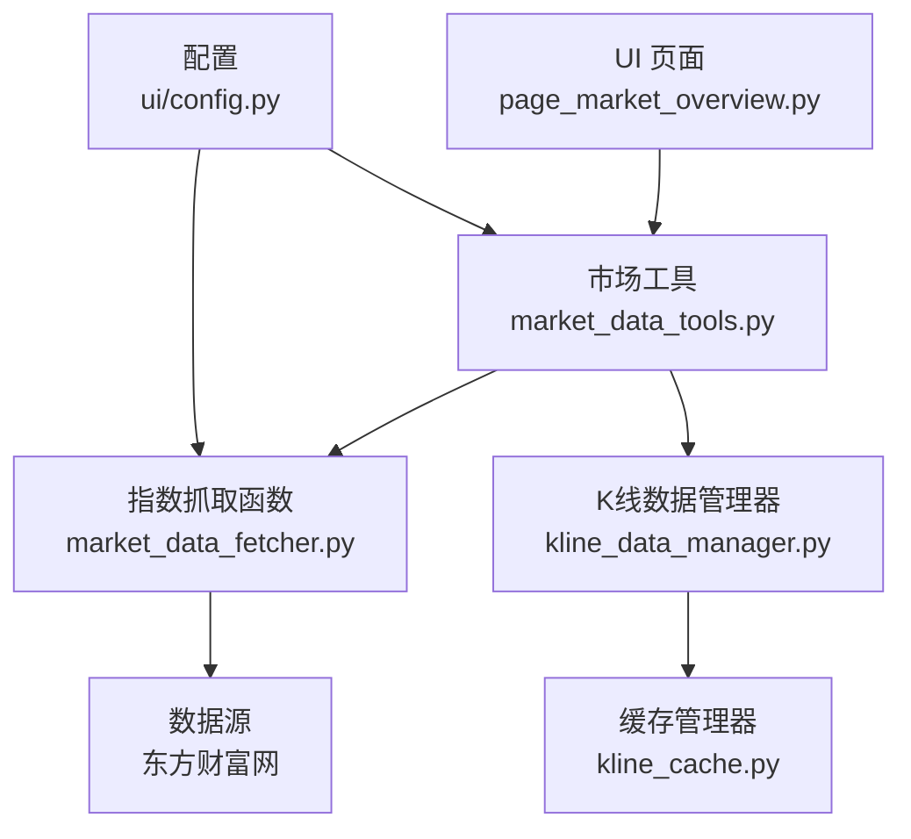
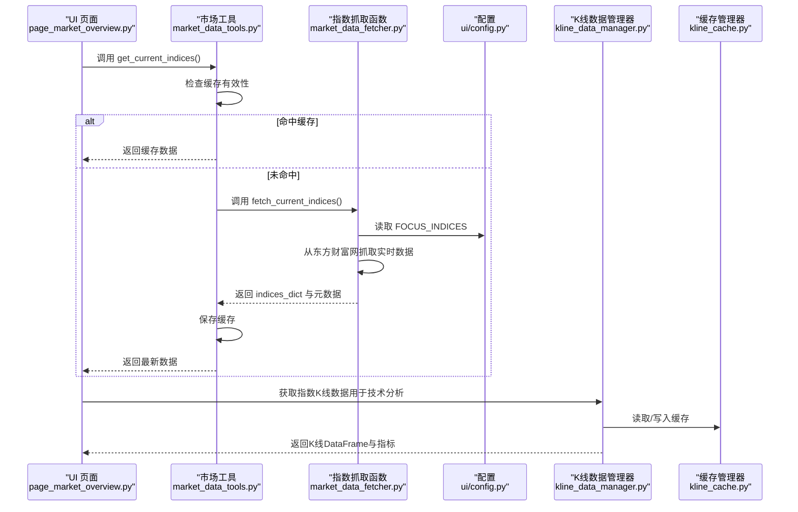
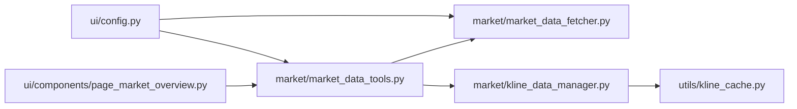

# 指数实时数据API

<cite>
**本文引用的文件**
- [market_data_fetcher.py](file://market/market_data_fetcher.py)
- [kline_data_manager.py](file://market/kline_data_manager.py)
- [ui/config.py](file://ui/config.py)
- [market_data_tools.py](file://market/market_data_tools.py)
- [page_market_overview.py](file://ui/components/page_market_overview.py)
- [market_report.py](file://market/market_report.py)
- [kline_cache.py](file://utils/kline_cache.py)
</cite>

## 目录
1. [简介](#简介)
2. [项目结构](#项目结构)
3. [核心组件](#核心组件)
4. [架构总览](#架构总览)
5. [详细组件分析](#详细组件分析)
6. [依赖关系分析](#依赖关系分析)
7. [性能考量](#性能考量)
8. [故障排查指南](#故障排查指南)
9. [结论](#结论)
10. [附录](#附录)

## 简介
本文件面向“指数实时数据API”的使用者，聚焦于函数 fetch_current_indices 的实现与应用，说明其如何从东方财富网抓取沪深重要指数的实时行情，如何通过 FOCUS_INDICES 配置进行关注指数过滤，以及如何解析返回的 indices_dict 数据结构中的字段含义。同时，文档提供网络异常与数据为空的处理建议，并展示该数据如何用于技术分析与市场监控，以及与 K 线数据管理器的交互方式。

## 项目结构
围绕指数实时数据的关键模块如下：
- 数据抓取层：market/market_data_fetcher.py 提供 fetch_current_indices 与其它市场数据抓取函数
- 统一工具层：market/market_data_tools.py 提供 get_current_indices 等统一入口，封装缓存与调用流程
- UI 展示层：ui/components/page_market_overview.py 使用 get_current_indices 的结果进行可视化展示
- 配置层：ui/config.py 定义 FOCUS_INDICES 与 INDEX_SYMBOL_MAPPING
- K 线数据管理：market/kline_data_manager.py 与 utils/kline_cache.py 提供指数 K 线数据的获取、缓存与转换
- 报告与分析：market/market_report.py 与 market/market_formatters.py 将指数数据整合进综合报告

图表来源
- [page_market_overview.py](file://ui/components/page_market_overview.py#L301-L360)
- [market_data_tools.py](file://market/market_data_tools.py#L232-L249)
- [market_data_fetcher.py](file://market/market_data_fetcher.py#L286-L356)
- [kline_data_manager.py](file://market/kline_data_manager.py#L152-L201)
- [kline_cache.py](file://utils/kline_cache.py#L399-L418)
- [ui/config.py](file://ui/config.py#L45-L82)

章节来源
- [market_data_fetcher.py](file://market/market_data_fetcher.py#L286-L356)
- [market_data_tools.py](file://market/market_data_tools.py#L232-L249)
- [page_market_overview.py](file://ui/components/page_market_overview.py#L301-L360)
- [ui/config.py](file://ui/config.py#L45-L82)
- [kline_data_manager.py](file://market/kline_data_manager.py#L152-L201)
- [kline_cache.py](file://utils/kline_cache.py#L399-L418)

## 核心组件
- fetch_current_indices：从东方财富网抓取沪深重要指数实时行情，按 FOCUS_INDICES 过滤，返回 indices_dict 结构及元数据
- MarketTools.get_current_indices：统一入口，负责缓存命中、调用 fetch_current_indices、错误回退
- UI 展示：page_market_overview.py 使用 indices_dict 渲染关键指标
- 配置：FOCUS_INDICES 控制关注指数集合；INDEX_SYMBOL_MAPPING 用于后续 K 线查询
- K 线管理：kline_data_manager 与 kline_cache 提供指数日线数据的获取、缓存与转换，支撑技术分析与风险评估

章节来源
- [market_data_fetcher.py](file://market/market_data_fetcher.py#L286-L356)
- [market_data_tools.py](file://market/market_data_tools.py#L232-L249)
- [page_market_overview.py](file://ui/components/page_market_overview.py#L301-L360)
- [ui/config.py](file://ui/config.py#L45-L82)
- [kline_data_manager.py](file://market/kline_data_manager.py#L152-L201)
- [kline_cache.py](file://utils/kline_cache.py#L399-L418)

## 架构总览
下图展示了从 UI 到数据抓取、缓存与 K 线管理的整体调用链路。

图表来源
- [page_market_overview.py](file://ui/components/page_market_overview.py#L301-L360)
- [market_data_tools.py](file://market/market_data_tools.py#L232-L249)
- [market_data_fetcher.py](file://market/market_data_fetcher.py#L286-L356)
- [ui/config.py](file://ui/config.py#L45-L82)
- [kline_data_manager.py](file://market/kline_data_manager.py#L152-L201)
- [kline_cache.py](file://utils/kline_cache.py#L399-L418)

## 详细组件分析

### fetch_current_indices 函数详解
- 数据来源：通过 akshare 从东方财富网获取沪深重要指数实时行情
- 过滤机制：依据 FOCUS_INDICES 配置仅保留关注的指数
- 数据结构：返回 indices_dict，键为指数名称，值为包含多个字段的对象
- 返回元数据：total_count、data_source、update_time

字段说明（来自 indices_dict 中的每个指数对象）：
- code：指数代码
- name：指数名称
- current_price：最新价
- change_percent：涨跌幅（百分比）
- change_amount：涨跌额
- volume：成交量
- turnover：成交额
- amplitude：振幅
- high：最高
- low：最低
- open：今开
- prev_close：昨收
- volume_ratio：量比

处理流程要点：
- 若返回数据为空，返回包含 error 字段的字典，并标记 ret=False
- 若发生异常，返回包含 error 字段的字典，并标记 ret=False
- 成功时打印关注指数的最新价与涨跌幅，便于调试与监控

章节来源
- [market_data_fetcher.py](file://market/market_data_fetcher.py#L286-L356)
- [ui/config.py](file://ui/config.py#L45-L55)

### MarketTools.get_current_indices 统一入口
- 缓存策略：若 use_cache 且未强制刷新，且缓存有效，则直接返回缓存数据
- 调用 fetch_current_indices：当缓存未命中或强制刷新时，调用抓取函数
- 错误回退：若抓取失败，返回缓存数据（若有），否则返回空字典

章节来源
- [market_data_tools.py](file://market/market_data_tools.py#L232-L249)

### UI 展示与使用
- page_market_overview.py 通过 get_current_indices 获取 indices_dict
- 使用 FOCUS_INDICES 顺序渲染主要指数的实时价格与涨跌幅
- 支持“使用缓存”与“强制刷新”切换，便于对比缓存与实时数据

章节来源
- [page_market_overview.py](file://ui/components/page_market_overview.py#L301-L360)

### 与 K 线数据管理器的交互
- 获取 K 线：MarketTools.get_index_kline_data 调用 KLineDataManager.get_index_kline_data
- 缓存策略：优先从 CSV 缓存读取，未命中则从 akshare 获取并写入缓存
- 指标计算：KLineDataManager.add_moving_averages 计算 MA5/MA10/MA20/MA60
- 与技术分析：MarketTools.get_index_technical_indicators 调用 fetch_index_technical_indicators，结合风险指标

章节来源
- [market_data_tools.py](file://market/market_data_tools.py#L307-L348)
- [kline_data_manager.py](file://market/kline_data_manager.py#L152-L201)
- [kline_cache.py](file://utils/kline_cache.py#L399-L418)

### 报告与综合分析中的应用
- market_report.py 将 current_indices 与技术指标、资金流、情绪等数据整合生成报告
- market_formatters 将 indices_dict 格式化为报告文本，支持 AI 分析与导出

章节来源
- [market_report.py](file://market/market_report.py#L13-L87)
- [market/market_formatters.py](file://market/market_formatters.py#L820-L850)

## 依赖关系分析
- 配置依赖：FOCUS_INDICES 与 INDEX_SYMBOL_MAPPING 决定抓取与后续 K 线查询的指数集合
- 数据依赖：fetch_current_indices 依赖 akshare 与 ui/config
- UI 依赖：page_market_overview.py 依赖 market_data_tools 与 ui/config
- K 线依赖：kline_data_manager 依赖 akshare 与 utils/kline_cache

图表来源
- [ui/config.py](file://ui/config.py#L45-L82)
- [market_data_fetcher.py](file://market/market_data_fetcher.py#L286-L356)
- [market_data_tools.py](file://market/market_data_tools.py#L232-L249)
- [kline_data_manager.py](file://market/kline_data_manager.py#L152-L201)
- [kline_cache.py](file://utils/kline_cache.py#L399-L418)
- [page_market_overview.py](file://ui/components/page_market_overview.py#L301-L360)

## 性能考量
- 缓存优先：MarketTools 对指数实时数据与技术指标均采用缓存策略，减少网络请求频率
- K 线缓存：CSV 缓存支持智能过期策略，兼顾数据新鲜度与存储效率
- 批量更新：kline_data_manager 提供批量更新指数缓存接口，便于定时任务维护
- UI 体验：UI 提供“使用缓存/强制刷新”开关，平衡响应速度与数据时效

章节来源
- [market_data_tools.py](file://market/market_data_tools.py#L232-L249)
- [kline_data_manager.py](file://market/kline_data_manager.py#L232-L266)
- [kline_cache.py](file://utils/kline_cache.py#L399-L418)
- [page_market_overview.py](file://ui/components/page_market_overview.py#L630-L700)

## 故障排查指南
常见问题与处理建议：
- 网络异常
  - 现象：抓取函数返回 error 字段，ret=False
  - 处理：检查网络连通性；在 UI 中切换“使用缓存”，以获取缓存数据；必要时执行“刷新数据”清空缓存后重试
- 数据为空
  - 现象：indices_dict 不存在或 total_count 为 0
  - 处理：确认 FOCUS_INDICES 配置正确；检查 akshare 数据源可用性；稍后再试
- 指数名称不匹配
  - 现象：indices_dict 中缺少目标指数
  - 处理：核对 ui/config.py 中的 FOCUS_INDICES 与 INDEX_SYMBOL_MAPPING；确保指数名称与 akshare 返回一致
- K 线数据缺失
  - 现象：K 线图表无数据或提示未获取到数据
  - 处理：检查缓存文件是否存在；执行批量更新指数缓存；确认 akshare 可用

章节来源
- [market_data_fetcher.py](file://market/market_data_fetcher.py#L333-L356)
- [page_market_overview.py](file://ui/components/page_market_overview.py#L312-L360)
- [kline_data_manager.py](file://market/kline_data_manager.py#L232-L266)
- [kline_cache.py](file://utils/kline_cache.py#L399-L418)

## 结论
fetch_current_indices 通过 akshare 从东方财富网抓取沪深重要指数实时行情，并以 FOCUS_INDICES 进行精准过滤，返回标准化的 indices_dict 结构。配合 MarketTools 的缓存策略与 UI 的可视化展示，能够高效地支撑技术分析与市场监控。与 K 线数据管理器的协同进一步完善了从实时行情到技术指标与风险评估的全链路能力。

## 附录

### 数据结构与字段速查
- indices_dict：键为指数名称，值为包含以下字段的对象
  - code、name、current_price、change_percent、change_amount、volume、turnover、amplitude、high、low、open、prev_close、volume_ratio
- 返回元数据
  - total_count：指数数量
  - data_source：数据来源标识
  - update_time：更新时间
  - error：错误信息（当抓取失败时）

章节来源
- [market_data_fetcher.py](file://market/market_data_fetcher.py#L299-L327)

### 与 K 线数据管理器的交互要点
- 获取 K 线：get_index_kline_data 返回包含 kline_data、indicators、data_source、update_time 的字典
- 计算均线：add_moving_averages 自动添加 MA5/MA10/MA20/MA60
- 风险指标：get_index_technical_indicators 返回技术指标与风险指标（如存在）

章节来源
- [market_data_tools.py](file://market/market_data_tools.py#L307-L348)
- [kline_data_manager.py](file://market/kline_data_manager.py#L267-L296)