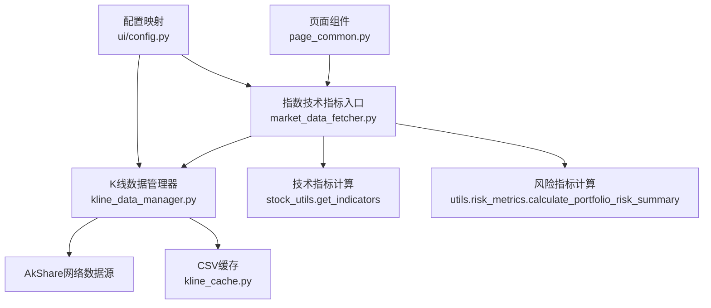
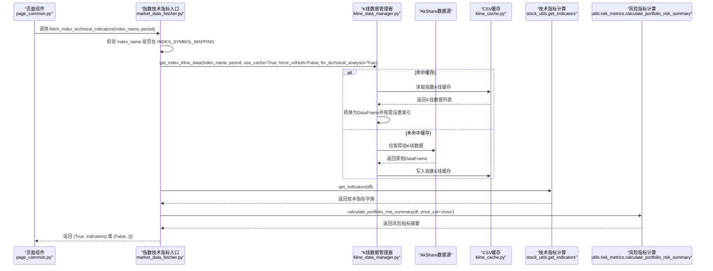
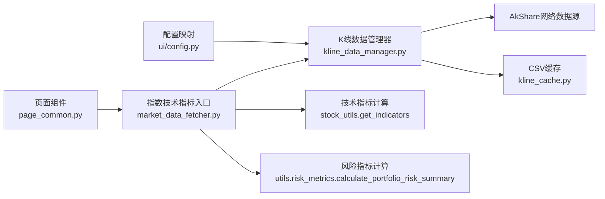

# 指数技术指标API

<cite>
**本文引用的文件**
- [market_data_fetcher.py](file://market/market_data_fetcher.py)
- [kline_data_manager.py](file://market/kline_data_manager.py)
- [stock_utils.py](file://stock/stock_utils.py)
- [risk_metrics.py](file://utils/risk_metrics.py)
- [config.py](file://ui/config.py)
- [kline_cache.py](file://utils/kline_cache.py)
- [page_common.py](file://ui/components/page_common.py)
</cite>

## 目录
1. [简介](#简介)
2. [项目结构](#项目结构)
3. [核心组件](#核心组件)
4. [架构总览](#架构总览)
5. [详细组件分析](#详细组件分析)
6. [依赖关系分析](#依赖关系分析)
7. [性能与缓存特性](#性能与缓存特性)
8. [异常与错误处理](#异常与错误处理)
9. [结论](#结论)

## 简介
本文件面向“指数技术指标API”的使用者，系统化说明如何通过统一入口函数获取指定指数（例如上证指数）的技术分析指标。文档重点覆盖：
- 如何通过K线数据管理器获取K线数据并计算MACD、RSI、KDJ、布林带、威廉指标、CCI等常用技术指标
- 参数period对计算周期的影响
- for_technical_analysis标志对数据格式与索引的影响
- 返回的indicators结构中包含的风险指标（来自utils.risk_metrics），以及其含义
- 对不支持指数名称的异常处理示例

## 项目结构
围绕指数技术指标API的关键文件组织如下：
- market/market_data_fetcher.py：对外暴露的指数技术指标获取入口，负责参数校验、调用K线数据管理器、计算技术指标与风险指标，并返回统一结构
- market/kline_data_manager.py：统一的K线数据管理器，负责从网络或缓存获取指数K线数据，按需转换为DataFrame并支持for_technical_analysis模式
- stock/stock_utils.py：提供get_indicators函数，使用stockstats对K线数据进行技术指标计算
- utils/risk_metrics.py：提供calculate_portfolio_risk_summary函数，计算风险指标摘要并封装为适合大模型分析的结构
- ui/config.py：定义支持的指数名称集合与映射，作为API参数校验依据
- utils/kline_cache.py：指数K线数据的缓存实现，支撑高效的数据获取与更新
- ui/components/page_common.py：前端组件中对指数技术分析的调用示例，展示典型参数与返回值的消费方式

图表来源
- [market_data_fetcher.py](file://market/market_data_fetcher.py#L568-L607)
- [kline_data_manager.py](file://market/kline_data_manager.py#L152-L200)
- [stock_utils.py](file://stock/stock_utils.py#L105-L151)
- [risk_metrics.py](file://utils/risk_metrics.py#L128-L196)
- [config.py](file://ui/config.py#L44-L82)
- [kline_cache.py](file://utils/kline_cache.py#L399-L418)

章节来源
- [market_data_fetcher.py](file://market/market_data_fetcher.py#L568-L607)
- [kline_data_manager.py](file://market/kline_data_manager.py#L152-L200)
- [stock_utils.py](file://stock/stock_utils.py#L105-L151)
- [risk_metrics.py](file://utils/risk_metrics.py#L128-L196)
- [config.py](file://ui/config.py#L44-L82)
- [kline_cache.py](file://utils/kline_cache.py#L399-L418)

## 核心组件
- fetch_index_technical_indicators(index_name: str, period: int = 100) -> tuple
  - 功能：获取指定指数的技术指标，内部会校验指数名称、调用K线数据管理器、计算技术指标与风险指标，并返回布尔状态与指标字典
  - 关键行为：
    - 校验index_name是否在INDEX_SYMBOL_MAPPING中
    - 通过get_kline_manager().get_index_kline_data(index_name, period, use_cache=True, force_refresh=False, for_technical_analysis=True)获取K线数据
    - 调用get_indicators(df)计算技术指标
    - 在数据长度≥5时，调用calculate_portfolio_risk_summary(df, price_col='close')计算风险指标并注入到indicators中
- KLineDataManager.get_index_kline_data(...)
  - 功能：统一获取指数K线数据，支持缓存命中、网络拉取、数据格式化（for_technical_analysis=True时设置date为索引）
- get_indicators(df)
  - 功能：基于stockstats包装DataFrame，计算MA/EMA、MACD、KDJ、RSI、布林带、威廉指标、CCI等指标，并附加趋势判断
- calculate_portfolio_risk_summary(df, price_col='close')
  - 功能：计算年化波动率、最大回撤、夏普比率、VaR/CVaR、区间涨跌幅、近期波动率、收益统计、风险评估等

章节来源
- [market_data_fetcher.py](file://market/market_data_fetcher.py#L568-L607)
- [kline_data_manager.py](file://market/kline_data_manager.py#L152-L200)
- [stock_utils.py](file://stock/stock_utils.py#L105-L151)
- [risk_metrics.py](file://utils/risk_metrics.py#L128-L196)

## 架构总览
下面的时序图展示了从页面调用到最终返回指标的整体流程。

图表来源
- [market_data_fetcher.py](file://market/market_data_fetcher.py#L568-L607)
- [kline_data_manager.py](file://market/kline_data_manager.py#L152-L200)
- [stock_utils.py](file://stock/stock_utils.py#L105-L151)
- [risk_metrics.py](file://utils/risk_metrics.py#L128-L196)
- [kline_cache.py](file://utils/kline_cache.py#L399-L418)

## 详细组件分析

### fetch_index_technical_indicators 函数
- 输入参数
  - index_name: 指数名称，必须在INDEX_SYMBOL_MAPPING中，否则抛出异常
  - period: 获取K线数据的条数，直接影响技术指标的样本长度
- 处理流程
  - 参数校验：若index_name不在INDEX_SYMBOL_MAPPING，直接抛出异常
  - 获取K线数据：通过get_kline_manager().get_index_kline_data(...)，设置for_technical_analysis=True，使DataFrame以date为索引，便于后续指标计算
  - 计算技术指标：调用get_indicators(df)，返回包含MA/EMA、MACD、KDJ、RSI、布林带、威廉指标、CCI及趋势判断的字典
  - 计算风险指标：当df长度≥5时，调用calculate_portfolio_risk_summary(df, price_col='close')，并将结果注入到indicators中
- 输出
  - 成功：(True, indicators)
  - 失败：(False, {})

章节来源
- [market_data_fetcher.py](file://market/market_data_fetcher.py#L568-L607)

### K线数据管理器 KLineDataManager
- get_index_kline_data(index_name, period, use_cache, force_refresh, for_technical_analysis)
  - 缓存优先：若use_cache且非force_refresh，尝试从CSV缓存读取指数K线；当缓存数据条数满足min(period,30)以上则直接返回
  - 网络拉取：若未命中缓存，则从AkShare拉取原始K线数据，写入缓存并截取尾部period条
  - 格式化：当for_technical_analysis=True时，设置date为索引，便于技术指标计算
- add_moving_averages(df)
  - 为DataFrame添加MA5/MA10/MA20/MA60列，用于辅助分析

章节来源
- [kline_data_manager.py](file://market/kline_data_manager.py#L152-L200)
- [kline_data_manager.py](file://market/kline_data_manager.py#L267-L296)

### 技术指标计算 get_indicators(df)
- 计算范围：基于stockstats包装的DataFrame，指标计算依赖于足够的数据长度
- 指标清单（取自返回字典的关键键）：
  - MA/EMA：ma_5、ma_10、ma_20、ma_60、ema_12、ema_26
  - MACD：macd、macd_signal、macd_histogram
  - KDJ：kdj_k、kdj_d、kdj_j
  - RSI：rsi_14
  - 布林带：boll_upper、boll_middle、boll_lower
  - 威廉指标：wr_14
  - CCI：cci_14
  - 趋势判断：ma_trend、macd_trend

章节来源
- [stock_utils.py](file://stock/stock_utils.py#L105-L151)

### 风险指标计算 calculate_portfolio_risk_summary(df, price_col='close')
- 计算维度（返回字典中的关键键）：
  - period_analysis：包含data_length、price_change_pct、trend_direction
  - volatility_analysis：包含annual_volatility、recent_volatility、volatility_trend
  - risk_metrics：包含max_drawdown、sharpe_ratio、var_5pct、cvar_5pct
  - return_statistics：包含daily_return_mean、daily_return_std、positive_days_ratio、max_single_day_gain、max_single_day_loss
  - risk_assessment：包含risk_level、stability、trend_strength
  - summary_table：风险指标汇总表（用于展示）

章节来源
- [risk_metrics.py](file://utils/risk_metrics.py#L128-L196)

### 参数与行为说明
- period参数
  - 影响：决定K线数据的样本长度，从而影响技术指标的有效性与稳定性。例如MA/EMA/RSI/CCI/KDJ等均依赖一定长度的历史数据
  - 建议：根据分析需求选择合适周期，如短期关注可选较短周期，长期趋势分析可选较长周期
- for_technical_analysis标志
  - 影响：当为True时，K线数据管理器会将date列设置为DataFrame索引，便于技术指标计算与时间序列处理
  - 适用场景：技术分析计算阶段开启，其他展示阶段可关闭

章节来源
- [kline_data_manager.py](file://market/kline_data_manager.py#L147-L149)
- [kline_data_manager.py](file://market/kline_data_manager.py#L197-L199)

### 指数名称支持与异常处理
- 支持范围：由ui/config.py中的INDEX_SYMBOL_MAPPING提供，仅允许其中列出的指数名称
- 异常示例：当传入不支持的指数名称时，fetch_index_technical_indicators会抛出异常并返回(False, {})，调用方应捕获并提示用户

章节来源
- [config.py](file://ui/config.py#L70-L82)
- [market_data_fetcher.py](file://market/market_data_fetcher.py#L573-L575)

## 依赖关系分析
- 外部依赖
  - AkShare：用于从网络获取指数K线原始数据
  - stockstats：用于技术指标计算
- 内部依赖
  - market_data_fetcher依赖kline_data_manager、stock_utils、risk_metrics
  - kline_data_manager依赖config中的INDEX_SYMBOL_MAPPING与kline_cache
  - 页面组件page_common.py调用market_data_fetcher以展示技术指标

图表来源
- [config.py](file://ui/config.py#L70-L82)
- [kline_data_manager.py](file://market/kline_data_manager.py#L152-L200)
- [kline_cache.py](file://utils/kline_cache.py#L399-L418)
- [market_data_fetcher.py](file://market/market_data_fetcher.py#L568-L607)
- [stock_utils.py](file://stock/stock_utils.py#L105-L151)
- [risk_metrics.py](file://utils/risk_metrics.py#L128-L196)
- [page_common.py](file://ui/components/page_common.py#L147-L153)

## 性能与缓存特性
- 缓存策略
  - 指数K线数据采用CSV缓存，支持智能过期与增量更新
  - get_index_kline_data在use_cache且非force_refresh时优先读取缓存，命中后直接返回
- 性能影响
  - 缓存命中可显著降低网络请求与解析开销
  - for_technical_analysis=True时设置索引，有利于后续指标计算的效率
- 建议
  - 合理设置period，避免过小导致指标不稳定
  - 在高频调用场景下启用use_cache，减少网络压力

章节来源
- [kline_cache.py](file://utils/kline_cache.py#L399-L418)
- [kline_data_manager.py](file://market/kline_data_manager.py#L170-L179)
- [kline_data_manager.py](file://market/kline_data_manager.py#L197-L199)

## 异常与错误处理
- 不支持的指数名称
  - 现象：抛出异常并返回(False, {})
  - 处理建议：调用方捕获异常并向用户提示可用指数列表
- 风险指标计算失败
  - 现象：在风险指标模块导入失败或计算异常时，打印警告并跳过风险指标注入
  - 处理建议：检查utils.risk_metrics模块是否存在与依赖安装情况

章节来源
- [market_data_fetcher.py](file://market/market_data_fetcher.py#L573-L575)
- [market_data_fetcher.py](file://market/market_data_fetcher.py#L598-L601)

## 结论
- fetch_index_technical_indicators提供了统一、稳定的指数技术指标获取能力
- 通过K线数据管理器与缓存机制，兼顾了性能与可靠性
- 技术指标覆盖广泛，风险指标提供量化视角，便于综合研判
- 使用时请确保index_name在支持范围内，并根据分析目标合理设置period