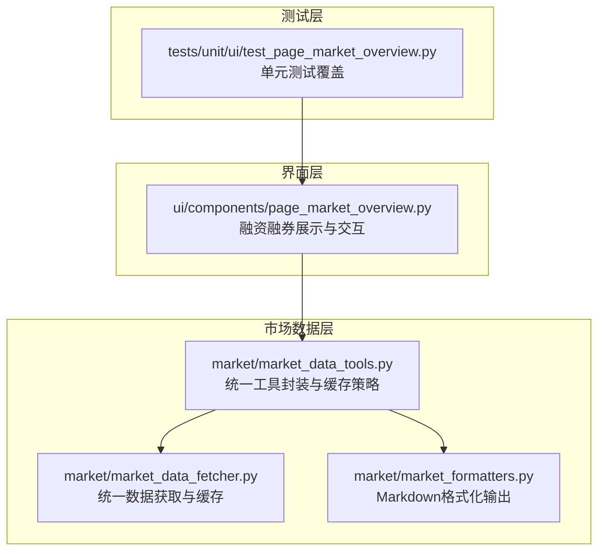
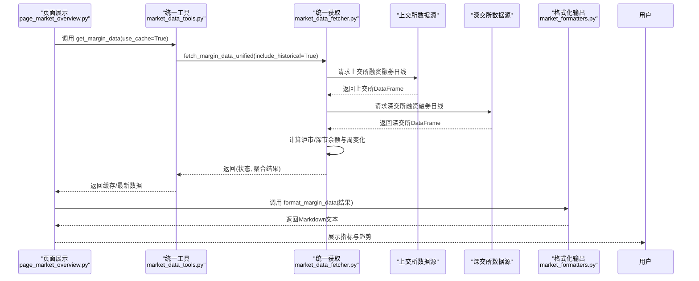
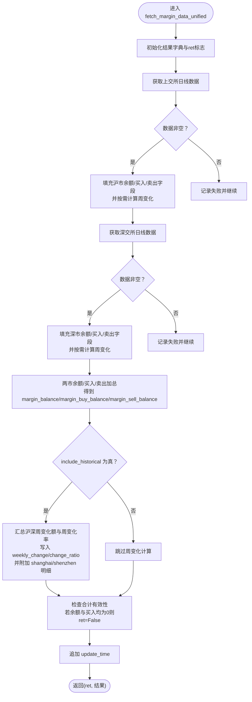
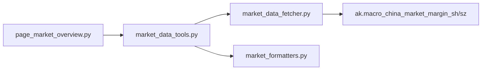

# 融资融券数据API

<cite>
**本文引用的文件**
- [market_data_fetcher.py](file://market/market_data_fetcher.py)
- [market_data_tools.py](file://market/market_data_tools.py)
- [market_formatters.py](file://market/market_formatters.py)
- [page_market_overview.py](file://ui/components/page_market_overview.py)
- [test_page_market_overview.py](file://tests/unit/ui/test_page_market_overview.py)
</cite>

## 目录
1. [简介](#简介)
2. [项目结构](#项目结构)
3. [核心组件](#核心组件)
4. [架构总览](#架构总览)
5. [详细组件分析](#详细组件分析)
6. [依赖关系分析](#依赖关系分析)
7. [性能与可用性](#性能与可用性)
8. [故障排查指南](#故障排查指南)
9. [结论](#结论)
10. [附录](#附录)

## 简介
本文件面向“融资融券数据API”的统一入口函数 fetch_margin_data_unified，系统性说明其如何统一获取上交所与深交所的融资融券数据，解释返回值中 margin_balance、margin_buy_balance、weekly_change 等核心指标的计算逻辑；阐述 include_historical 参数如何触发一周变化趋势分析；分别说明沪市与深市数据的处理流程；并提供数据接口异常的容错机制与使用建议，帮助读者利用该数据判断市场杠杆水平与投资者情绪。

## 项目结构
围绕融资融券数据的实现位于 market 子模块，UI 展示位于 ui/components，测试覆盖了前端展示与历史图表的调用。

图表来源
- [market_data_fetcher.py](file://market/market_data_fetcher.py#L358-L449)
- [market_data_tools.py](file://market/market_data_tools.py#L1-L120)
- [market_formatters.py](file://market/market_formatters.py#L452-L512)
- [page_market_overview.py](file://ui/components/page_market_overview.py#L180-L219)
- [test_page_market_overview.py](file://tests/unit/ui/test_page_market_overview.py#L182-L223)

章节来源
- [market_data_fetcher.py](file://market/market_data_fetcher.py#L358-L449)
- [market_data_tools.py](file://market/market_data_tools.py#L1-L120)
- [page_market_overview.py](file://ui/components/page_market_overview.py#L180-L219)
- [test_page_market_overview.py](file://tests/unit/ui/test_page_market_overview.py#L182-L223)

## 核心组件
- fetch_margin_data_unified(include_historical: bool = False) -> tuple
  - 统一获取上交所与深交所融资融券数据，按需计算周变化趋势，返回布尔状态与聚合结果字典。
- MarketTools.get_margin_data(use_cache: bool = True, force_refresh: bool = False) -> Dict
  - 通过统一工具类封装，调用 fetch_margin_data_unified(include_historical=True)，并支持缓存与刷新。
- MarketTextFormatter.format_margin_data(margin_data: Dict, detailed: bool = False) -> str
  - 将融资融券数据格式化为Markdown，用于UI展示与报告生成。
- 页面展示 display_margin_trading_analysis(use_cache=True)
  - 在Streamlit界面中展示融资融券余额、融资余额、融券余额与周变化率等指标。

章节来源
- [market_data_fetcher.py](file://market/market_data_fetcher.py#L358-L449)
- [market_data_tools.py](file://market/market_data_tools.py#L214-L231)
- [market_formatters.py](file://market/market_formatters.py#L452-L512)
- [page_market_overview.py](file://ui/components/page_market_overview.py#L180-L219)

## 架构总览
下图展示了从UI到数据获取再到格式化的端到端流程。

图表来源
- [page_market_overview.py](file://ui/components/page_market_overview.py#L180-L219)
- [market_data_tools.py](file://market/market_data_tools.py#L214-L231)
- [market_data_fetcher.py](file://market/market_data_fetcher.py#L358-L449)
- [market_formatters.py](file://market/market_formatters.py#L452-L512)

## 详细组件分析

### 统一获取函数：fetch_margin_data_unified
- 输入参数
  - include_historical: bool，默认False；当为True时，会计算一周变化趋势（周变化额与周变化率），并分别记录沪市与深市的周变化。
- 数据来源与处理
  - 上交所：调用 ak.macro_china_market_margin_sh() 获取日线数据，取最新一条记录填充 margin_sh_* 字段，并在满足至少7条数据时计算周变化。
  - 深交所：调用 ak.macro_china_market_margin_sz() 获取日线数据，取最新一条记录填充 margin_sz_* 字段，并在满足至少7条数据时计算周变化。
- 结果聚合
  - 对两市余额与买卖余额进行加总，得到 margin_balance、margin_buy_balance、margin_sell_balance。
  - 若 include_historical 为真，进一步计算全市场周变化额与周变化率，并在结果中附加 shanghai 与 shenzhen 的周变化明细。
- 异常与有效性
  - 任一交易所获取失败会记录错误并继续尝试其他交易所；若两市合计余额与买入额均为0，则判定为无有效数据（ret=False）。
  - 最终追加 update_time 字段，便于UI显示数据更新时间。

图表来源
- [market_data_fetcher.py](file://market/market_data_fetcher.py#L358-L449)

章节来源
- [market_data_fetcher.py](file://market/market_data_fetcher.py#L358-L449)

### 返回值字段与计算逻辑
- margin_balance
  - 定义：上交所融资融券余额 + 深交所融资融券余额
  - 计算：两市 margin_sh_balance 与 margin_sz_balance 相加
- margin_buy_balance
  - 定义：上交所融资余额 + 深交所融资余额
  - 计算：两市 margin_sh_buy 与 margin_sz_buy 相加
- margin_sell_balance
  - 定义：上交所融券余额 + 深交所融券余额
  - 计算：两市 margin_sh_sell 与 margin_sz_sell 相加
- weekly_change
  - 定义：全市场融资余额的周变化额
  - 计算：include_historical 为真时，汇总 shanghai.weekly_change 与 shenzhen.weekly_change
- change_ratio
  - 定义：全市场融资余额的周变化率（百分比）
  - 计算：weekly_change / (margin_buy_balance - weekly_change) × 100，当分母为0时为0
- margin_date
  - 定义：数据统计日期（通常取上交所最新记录的日期）
- update_time
  - 定义：数据获取完成时间戳

章节来源
- [market_data_fetcher.py](file://market/market_data_fetcher.py#L358-L449)

### include_historical 参数与周变化趋势分析
- 触发条件
  - 当 include_historical=True 且两市日线数据长度均≥7时，才会计算周变化。
- 沪深分别计算
  - 沪市：取最近一周（第-1天）与一周前（第-7天）的“融资余额”差值，得到 weekly_change_sh；并据此计算 change_ratio_sh。
  - 深市：同理，得到 weekly_change_sz 与 change_ratio_sz。
- 全市场汇总
  - weekly_change = weekly_change_sh + weekly_change_sz
  - change_ratio = weekly_change / (margin_buy_balance - weekly_change) × 100（分母为0时为0）
  - 结果中同时保留 shanghai 与 shenzhen 的明细，便于进一步分析。

章节来源
- [market_data_fetcher.py](file://market/market_data_fetcher.py#L388-L442)

### 沪深两市数据分别处理
- 上交所
  - 通过 ak.macro_china_market_margin_sh() 获取日线数据，取最新记录填充 margin_sh_* 字段；若 include_historical 且数据足够，计算周变化。
- 深交所
  - 通过 ak.macro_china_market_margin_sz() 获取日线数据，取最新记录填充 margin_sz_* 字段；若 include_historical 且数据足够，计算周变化。
- 聚合
  - 将两市字段相加得到全市场字段；若 include_historical，再汇总周变化与周变化率。

章节来源
- [market_data_fetcher.py](file://market/market_data_fetcher.py#L377-L442)

### 容错机制与异常处理
- 交易所接口异常
  - 对上交所与深交所分别捕获异常，记录错误并继续处理另一交易所；最终 ret=False 仅在两市合计余额与买入额均为0时。
- 缓存与回退
  - MarketTools.get_margin_data 在获取失败时会回退到缓存数据（若启用缓存），保证UI稳定显示。
- UI层提示
  - 页面展示 display_margin_trading_analysis 在无数据或异常时显示警告信息，并提示更新时间。

章节来源
- [market_data_fetcher.py](file://market/market_data_fetcher.py#L397-L423)
- [market_data_tools.py](file://market/market_data_tools.py#L214-L231)
- [page_market_overview.py](file://ui/components/page_market_overview.py#L180-L219)

### UI 展示与 Markdown 格式化
- 页面展示
  - display_margin_trading_analysis 展示融资融券余额、融资余额、融券余额与周变化率，并标注统计时间与数据获取时间。
- Markdown 格式化
  - MarketTextFormatter.format_margin_data 支持简单/详细两种模式，详细模式包含周变化率与趋势解读，简单模式聚焦核心指标。

章节来源
- [page_market_overview.py](file://ui/components/page_market_overview.py#L180-L219)
- [market_formatters.py](file://market/market_formatters.py#L452-L512)

## 依赖关系分析
- 组件耦合
  - UI 层依赖 MarketTools；MarketTools 依赖 fetch_margin_data_unified；fetch_margin_data_unified 依赖 akshare 的宏观数据接口。
- 外部依赖
  - ak.macro_china_market_margin_sh()、ak.macro_china_market_margin_sz() 提供两市日线数据。
- 内部依赖
  - MarketTools.get_margin_data 调用 fetch_margin_data_unified(include_historical=True)，并负责缓存与回退。
  - UI 层通过 MarketTextFormatter.format_margin_data 输出Markdown，供 Streamlit 渲染。

图表来源
- [page_market_overview.py](file://ui/components/page_market_overview.py#L180-L219)
- [market_data_tools.py](file://market/market_data_tools.py#L214-L231)
- [market_data_fetcher.py](file://market/market_data_fetcher.py#L358-L449)
- [market_formatters.py](file://market/market_formatters.py#L452-L512)

章节来源
- [market_data_tools.py](file://market/market_data_tools.py#L1-L120)
- [market_data_fetcher.py](file://market/market_data_fetcher.py#L358-L449)

## 性能与可用性
- 缓存策略
  - MarketTools.get_margin_data 默认启用缓存，减少对外部接口的频繁请求；可通过 force_refresh 强制刷新。
- 数据有效性校验
  - 当两市合计余额与融资买入额均为0时，视为无有效数据，避免错误展示。
- UI稳定性
  - 异常时回退缓存，确保界面可用；页面提供“刷新数据”按钮，一键清理缓存并强制获取最新数据。

章节来源
- [market_data_tools.py](file://market/market_data_tools.py#L214-L231)
- [page_market_overview.py](file://ui/components/page_market_overview.py#L662-L690)

## 故障排查指南
- 现象：页面显示“未获取到融资融券数据”
  - 可能原因：外部接口不可用或返回空数据；缓存失效且刷新失败。
  - 排查步骤：
    - 点击“刷新数据”，清空缓存并强制获取最新数据。
    - 检查网络与 akshare 数据源可用性。
    - 查看页面底部“数据获取时间/统计时间”确认数据是否更新。
- 现象：周变化率显示为 N/A
  - 可能原因：include_historical 为假或两市日线数据不足7条。
  - 排查步骤：
    - 确认调用时 include_historical=True（MarketTools.get_margin_data 已默认开启）。
    - 确认两市日线数据长度≥7。
- 现象：change_ratio 为0或异常
  - 可能原因：margin_buy_balance - weekly_change 为0或负数。
  - 排查步骤：
    - 检查 margin_buy_balance 与 weekly_change 的来源与计算逻辑。
    - 确认两市数据均有效且 include_historical 为真。

章节来源
- [market_data_tools.py](file://market/market_data_tools.py#L214-L231)
- [page_market_overview.py](file://ui/components/page_market_overview.py#L662-L690)
- [market_data_fetcher.py](file://market/market_data_fetcher.py#L388-L442)

## 结论
- fetch_margin_data_unified 提供了统一、稳健的两市融资融券数据获取能力，并在 include_historical 为真时计算周变化趋势，便于观察市场杠杆水平与情绪变化。
- 通过 MarketTools 的缓存与回退机制，以及 UI 的容错展示，系统在接口不稳定时仍能保持可用。
- 建议在业务侧结合 margin_buy_balance 与 change_ratio 判断市场杠杆与情绪：融资余额上升且周变化率为正，通常反映市场情绪偏乐观；反之则偏悲观。

## 附录

### API定义与调用要点
- 函数签名
  - fetch_margin_data_unified(include_historical: bool = False) -> tuple
- 返回值
  - ret: bool，True表示获取成功，False表示无有效数据或异常
  - result: Dict，包含 margin_* 字段、weekly_change、change_ratio、margin_date、update_time 等
- 调用建议
  - 一般场景使用 MarketTools.get_margin_data(use_cache=True, force_refresh=False) 即可获得带周变化的聚合数据。
  - 如需自定义行为，可直接调用 fetch_margin_data_unified(include_historical=True)。

章节来源
- [market_data_fetcher.py](file://market/market_data_fetcher.py#L358-L449)
- [market_data_tools.py](file://market/market_data_tools.py#L214-L231)