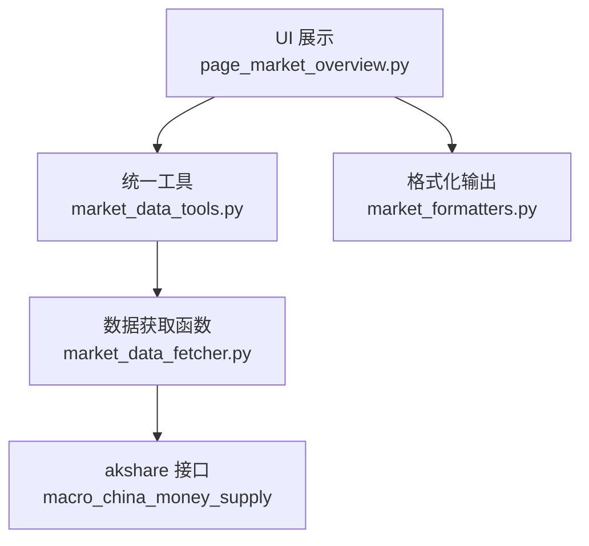
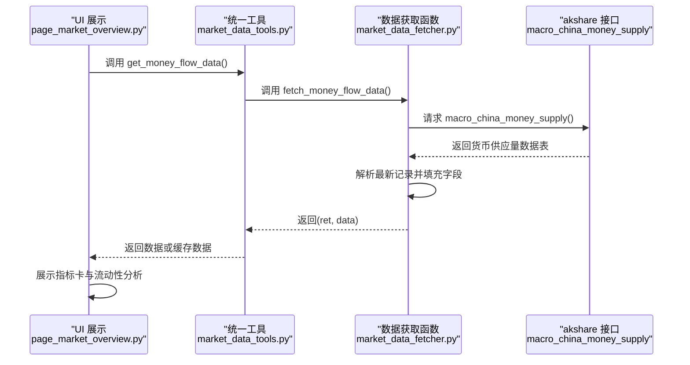
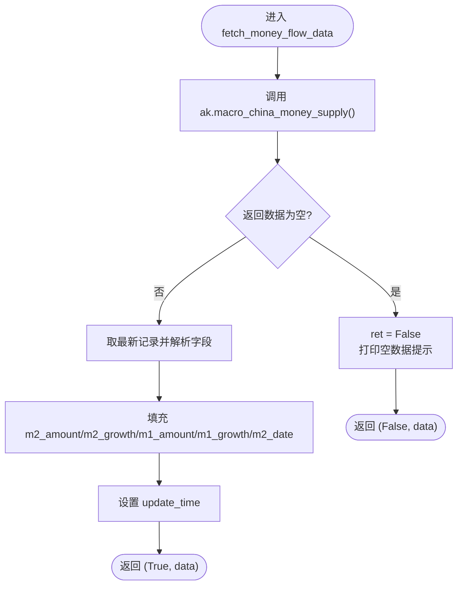
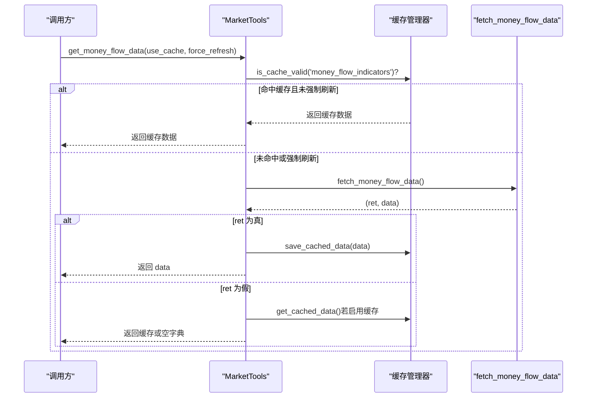
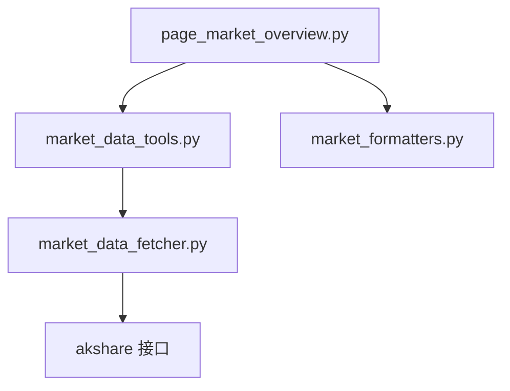

# 资金流向API

<cite>
**本文引用的文件**
- [market_data_fetcher.py](file://market/market_data_fetcher.py)
- [market_data_tools.py](file://market/market_data_tools.py)
- [page_market_overview.py](file://ui/components/page_market_overview.py)
- [market_formatters.py](file://market/market_formatters.py)
</cite>

## 目录
1. [简介](#简介)
2. [项目结构](#项目结构)
3. [核心组件](#核心组件)
4. [架构总览](#架构总览)
5. [详细组件分析](#详细组件分析)
6. [依赖关系分析](#依赖关系分析)
7. [性能考量](#性能考量)
8. [故障排查指南](#故障排查指南)
9. [结论](#结论)
10. [附录](#附录)

## 简介
本文件面向“资金流向数据API”，聚焦于函数 fetch_money_flow_data 如何获取中国人民银行发布的M2货币供应量等宏观经济指标，并解释返回值中 m2_amount、m2_growth、m1_amount 等字段的含义与单位（亿元）。文档还说明该函数通过 akshare 的 macro_china_money_supply 接口获取数据的流程，提供处理数据为空或获取失败的异常处理指南，并展示如何结合市场情绪分析进行综合判断，以及该数据在 fetch_comprehensive_market_sentiment 中的辅助作用。

## 项目结构
围绕资金流向API的关键文件与职责如下：
- market/market_data_fetcher.py：实现 fetch_money_flow_data、fetch_comprehensive_market_sentiment 等数据获取函数，负责调用 akshare 接口并组织返回数据。
- market/market_data_tools.py：封装统一的数据获取入口 get_money_flow_data，支持缓存与错误回退。
- ui/components/page_market_overview.py：前端展示层，消费资金流向数据并进行可视化与解读。
- market/market_formatters.py：提供资金流向数据的Markdown格式化输出，便于报告生成。



图表来源
- [page_market_overview.py](file://ui/components/page_market_overview.py#L106-L150)
- [market_data_tools.py](file://market/market_data_tools.py#L196-L213)
- [market_data_fetcher.py](file://market/market_data_fetcher.py#L248-L283)
- [market_formatters.py](file://market/market_formatters.py#L410-L451)

章节来源
- [market_data_fetcher.py](file://market/market_data_fetcher.py#L248-L283)
- [market_data_tools.py](file://market/market_data_tools.py#L196-L213)
- [page_market_overview.py](file://ui/components/page_market_overview.py#L106-L150)
- [market_formatters.py](file://market/market_formatters.py#L410-L451)

## 核心组件
- fetch_money_flow_data：从 akshare 获取 M2/M1 货币供应量数据，组装为统一的字典并返回布尔状态与数据体。
- get_money_flow_data：MarketTools 类的封装方法，支持缓存命中、错误回退与统一异常处理。
- UI 展示：page_market_overview.py 中的 display_money_flow_analysis 将资金流向指标以指标卡形式展示，并提供流动性分析。
- 报告格式化：market_formatters.py 的 format_money_flow_data 将资金流向数据格式化为 Markdown，支持简单/详细两种模式。

章节来源
- [market_data_fetcher.py](file://market/market_data_fetcher.py#L248-L283)
- [market_data_tools.py](file://market/market_data_tools.py#L196-L213)
- [page_market_overview.py](file://ui/components/page_market_overview.py#L106-L150)
- [market_formatters.py](file://market/market_formatters.py#L410-L451)

## 架构总览
资金流向API的调用链路如下：
- UI 层调用 MarketTools.get_money_flow_data 获取资金流向数据。
- MarketTools.get_money_flow_data 内部委托 fetch_money_flow_data 执行实际抓取。
- fetch_money_flow_data 通过 akshare.macro_china_money_supply 获取数据，解析最新记录并填充 m2_amount、m2_growth、m1_amount、m1_growth、m2_date 等字段。
- UI 层接收数据后进行展示；报告生成时由 market_formatters.py 进行格式化。



图表来源
- [page_market_overview.py](file://ui/components/page_market_overview.py#L106-L150)
- [market_data_tools.py](file://market/market_data_tools.py#L196-L213)
- [market_data_fetcher.py](file://market/market_data_fetcher.py#L248-L283)

## 详细组件分析

### 函数：fetch_money_flow_data
- 功能：通过 akshare.macro_china_money_supply 获取中国人民银行发布的货币供应量数据，提取最新月份的 M2 和 M1 指标，组装为统一字典并返回布尔状态与数据体。
- 返回值字段说明（单位：亿元）：
  - m2_amount：货币和准货币(M2)数量（亿元）
  - m2_growth：货币和准货币(M2)同比增长（百分比）
  - m1_amount：货币(M1)数量（亿元）
  - m1_growth：货币(M1)同比增长（百分比）
  - m2_date：数据月份（字符串，格式通常为 YYYY-MM）
  - update_time：数据更新时间（字符串）
- 数据为空或获取失败的处理：
  - 若返回的 DataFrame 为空，函数会将状态 ret 设为 False。
  - 捕获异常时同样将 ret 设为 False，并打印错误信息。
- 调用 akshare 接口的流程：
  - 调用 ak.macro_china_money_supply() 获取数据表。
  - 取最新记录（iloc[0]），从该记录中读取上述字段并写入 money_flow_data。
  - 设置 update_time 并返回 (ret, money_flow_data)。



图表来源
- [market_data_fetcher.py](file://market/market_data_fetcher.py#L248-L283)

章节来源
- [market_data_fetcher.py](file://market/market_data_fetcher.py#L248-L283)

### 组件：MarketTools.get_money_flow_data
- 功能：统一入口，支持缓存命中、错误回退与统一异常处理。
- 缓存策略：若缓存有效且未强制刷新，则直接返回缓存数据；否则调用 fetch_money_flow_data 获取并保存缓存。
- 错误回退：当获取失败时，若启用缓存则返回缓存数据，否则返回空字典。



图表来源
- [market_data_tools.py](file://market/market_data_tools.py#L196-L213)

章节来源
- [market_data_tools.py](file://market/market_data_tools.py#L196-L213)

### 组件：UI 展示与综合判断
- UI 展示：page_market_overview.py 的 display_money_flow_analysis 将 m2_amount、m2_growth、m1_amount、m1_growth 以指标卡形式展示，并提供流动性分析（比较 m2_growth 与 m1_growth 的大小关系）。
- 综合判断：资金流向数据在 fetch_comprehensive_market_sentiment 中作为“资金面”维度之一参与综合情绪评分。综合评分包含三部分：
  - 基于涨跌比例的评分（ratio_score）
  - 基于涨停跌停比例的评分（limit_score）
  - 基于资金流向的评分（fund_score，例如主力净流入比例）
- 资金流向在综合情绪中的作用：
  - 通过 akshare 的 stock_market_fund_flow 获取主力净流入与净占比，作为资金面评分依据。
  - 在综合评分计算中，资金流向评分最大范围为 ±40 分，最终总分为三部分之和，并据此确定情绪等级与可信度。

```mermaid
flowchart TD
Start(["综合情绪评分"]) --> Ratio["基于涨跌比例评分"]
Start --> Limit["基于涨跌停比例评分"]
Start --> Fund["基于资金流向评分"]
Ratio --> Sum["合计评分"]
Limit --> Sum
Fund --> Sum
Sum --> Level{"总分阈值判定"}
Level --> |> 20| Bull["牛市"]
Level --> |< -20| Bear["熊市"]
Level --> |[-20,20]| Neutral["中性"]
Sum --> Confidence["计算可信度数据源数量"]
```

图表来源
- [market_data_fetcher.py](file://market/market_data_fetcher.py#L463-L565)

章节来源
- [page_market_overview.py](file://ui/components/page_market_overview.py#L106-L150)
- [market_data_fetcher.py](file://market/market_data_fetcher.py#L463-L565)

### 组件：报告格式化
- market_formatters.py 的 format_money_flow_data 支持将资金流向数据格式化为 Markdown：
  - 简单模式：仅展示 M2 余额与 M2 同比增长。
  - 详细模式：额外包含社会融资规模、新增人民币贷款、北向资金净流入等指标。
- 输出单位：
  - M2 余额与同比：按万亿元显示（简单模式下以“万亿”为单位，详细模式下以“万亿元”为单位）。
  - 其他指标：按“万亿元”或“亿元”显示。

章节来源
- [market_formatters.py](file://market/market_formatters.py#L410-L451)

## 依赖关系分析
- 外部依赖：akshare（macro_china_money_supply、stock_market_fund_flow 等接口）。
- 内部依赖：
  - page_market_overview.py 依赖 MarketTools.get_money_flow_data。
  - MarketTools.get_money_flow_data 依赖 fetch_money_flow_data。
  - fetch_money_flow_data 依赖 akshare 接口。
  - market_formatters.py 依赖资金流向数据字典结构。



图表来源
- [page_market_overview.py](file://ui/components/page_market_overview.py#L106-L150)
- [market_data_tools.py](file://market/market_data_tools.py#L196-L213)
- [market_data_fetcher.py](file://market/market_data_fetcher.py#L248-L283)
- [market_formatters.py](file://market/market_formatters.py#L410-L451)

章节来源
- [page_market_overview.py](file://ui/components/page_market_overview.py#L106-L150)
- [market_data_tools.py](file://market/market_data_tools.py#L196-L213)
- [market_data_fetcher.py](file://market/market_data_fetcher.py#L248-L283)
- [market_formatters.py](file://market/market_formatters.py#L410-L451)

## 性能考量
- 缓存机制：MarketTools.get_money_flow_data 支持缓存命中与强制刷新，减少重复请求，提高响应速度。
- 数据体积：货币供应量数据为月度指标，数据量较小，接口调用成本低。
- UI 渲染：前端展示采用指标卡与展开面板，避免一次性渲染大量文本，提升交互体验。

[本节为通用指导，无需特定文件引用]

## 故障排查指南
- akshare 接口不可用或返回空数据：
  - 检查网络连通性与 akshare 版本。
  - 在 fetch_money_flow_data 中，若返回的 DataFrame 为空，函数会将 ret 设为 False 并打印空数据提示。
- 异常捕获：
  - 捕获异常时，函数会将 ret 设为 False 并打印错误信息，随后返回 (False, data)。
- 缓存回退：
  - MarketTools.get_money_flow_data 在获取失败时，若启用缓存则返回缓存数据，否则返回空字典。
- UI 层提示：
  - page_market_overview.py 在未获取到资金流向数据时会显示警告提示，并在有 update_time 或 date 字段时显示数据获取时间。

章节来源
- [market_data_fetcher.py](file://market/market_data_fetcher.py#L248-L283)
- [market_data_tools.py](file://market/market_data_tools.py#L196-L213)
- [page_market_overview.py](file://ui/components/page_market_overview.py#L106-L150)

## 结论
- fetch_money_flow_data 通过 akshare 的 macro_china_money_supply 接口稳定获取 M2/M1 货币供应量数据，并以统一字典返回关键字段（单位：亿元）。
- UI 层对资金流向数据进行直观展示与流动性分析，帮助用户快速理解市场流动性状况。
- 资金流向数据在综合市场情绪分析中作为“资金面”维度参与评分，与涨跌比例、涨停跌停比例共同构成综合情绪等级与可信度评估。
- 通过 MarketTools 的缓存机制与错误回退策略，确保在接口不稳定或数据为空时仍能提供可用数据或历史缓存。

[本节为总结性内容，无需特定文件引用]

## 附录

### 字段定义与单位
- m2_amount：货币和准货币(M2)数量（亿元）
- m2_growth：货币和准货币(M2)同比增长（百分比）
- m1_amount：货币(M1)数量（亿元）
- m1_growth：货币(M1)同比增长（百分比）
- m2_date：数据月份（字符串，格式通常为 YYYY-MM）
- update_time：数据更新时间（字符串）

章节来源
- [market_data_fetcher.py](file://market/market_data_fetcher.py#L248-L283)