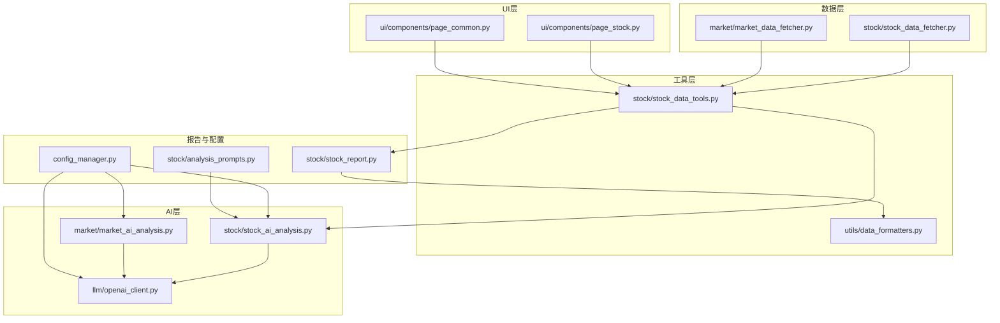
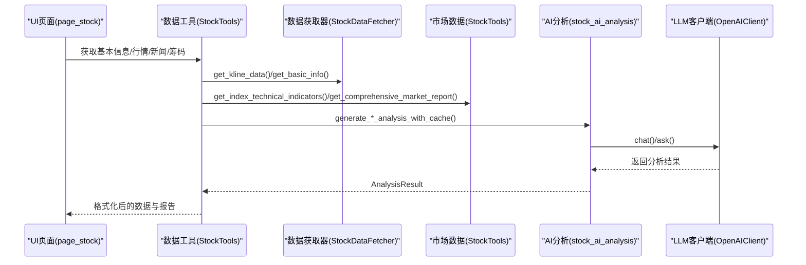
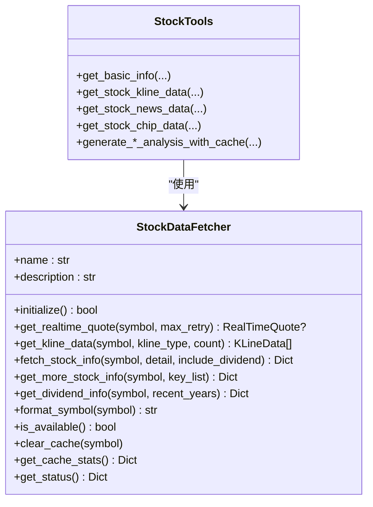
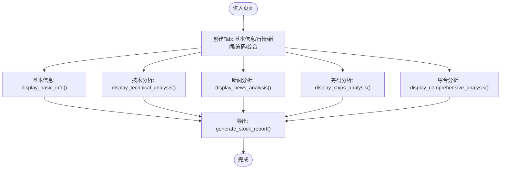
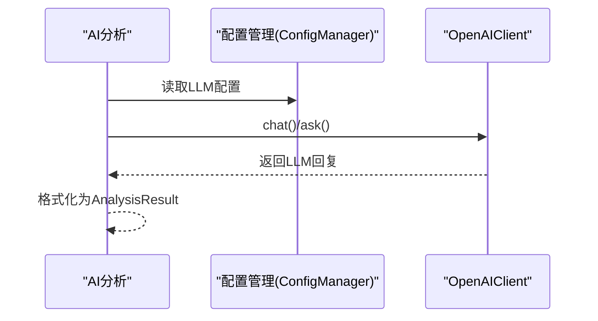
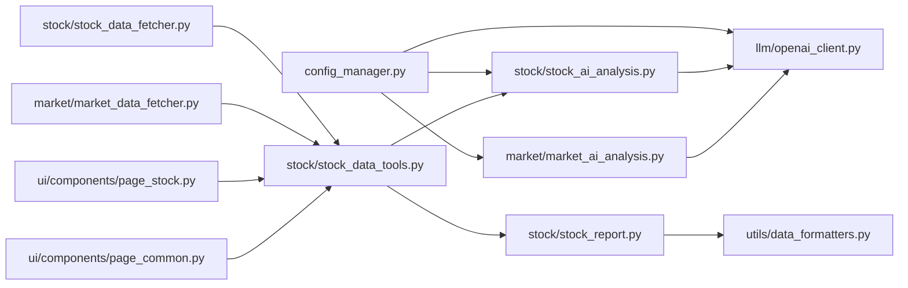

# 开发与扩展

<cite>
**本文引用的文件**
- [stock/stock_data_fetcher.py](file://stock/stock_data_fetcher.py)
- [stock/analysis_prompts.py](file://stock/analysis_prompts.py)
- [ui/components/page_stock.py](file://ui/components/page_stock.py)
- [ui/components/page_common.py](file://ui/components/page_common.py)
- [stock/stock_data_tools.py](file://stock/stock_data_tools.py)
- [stock/stock_ai_analysis.py](file://stock/stock_ai_analysis.py)
- [stock/stock_report.py](file://stock/stock_report.py)
- [market/market_data_fetcher.py](file://market/market_data_fetcher.py)
- [market/market_ai_analysis.py](file://market/market_ai_analysis.py)
- [llm/openai_client.py](file://llm/openai_client.py)
- [config_manager.py](file://config_manager.py)
- [utils/data_formatters.py](file://utils/data_formatters.py)
</cite>

## 目录
1. [简介](#简介)
2. [项目结构](#项目结构)
3. [核心组件](#核心组件)
4. [架构总览](#架构总览)
5. [详细组件分析](#详细组件分析)
6. [依赖关系分析](#依赖关系分析)
7. [性能考量](#性能考量)
8. [故障排查指南](#故障排查指南)
9. [结论](#结论)
10. [附录](#附录)

## 简介
本指南面向开发者，提供系统性的扩展与贡献方法，涵盖：
- 如何新增数据源（以 stock_data_fetcher.py 为模板）
- 如何定制AI分析提示词（analysis_prompts.py）
- 如何扩展功能模块（UI页面与市场分析指标）
- 如何接入新的LLM服务（兼容OpenAI API）
- 代码贡献流程与最佳实践

## 项目结构
项目采用按领域分层的组织方式：
- stock：股票数据获取、AI分析、报告生成、UI页面
- market：市场数据获取、AI分析、报告生成
- ui：Streamlit前端页面与通用组件
- llm：LLM客户端与用量日志
- utils：格式化、绘图、风险指标等工具
- tests：单元测试与页面测试

图表来源
- [stock/stock_data_fetcher.py](file://stock/stock_data_fetcher.py#L1-L546)
- [market/market_data_fetcher.py](file://market/market_data_fetcher.py#L1-L607)
- [stock/stock_data_tools.py](file://stock/stock_data_tools.py#L1-L709)
- [stock/stock_ai_analysis.py](file://stock/stock_ai_analysis.py#L1-L879)
- [market/market_ai_analysis.py](file://market/market_ai_analysis.py#L1-L123)
- [llm/openai_client.py](file://llm/openai_client.py#L1-L297)
- [ui/components/page_stock.py](file://ui/components/page_stock.py#L1-L884)
- [ui/components/page_common.py](file://ui/components/page_common.py#L1-L291)
- [stock/stock_report.py](file://stock/stock_report.py#L1-L311)
- [config_manager.py](file://config_manager.py#L1-L144)
- [stock/analysis_prompts.py](file://stock/analysis_prompts.py#L1-L54)
- [utils/data_formatters.py](file://utils/data_formatters.py#L1-L200)

章节来源
- [stock/stock_data_fetcher.py](file://stock/stock_data_fetcher.py#L1-L546)
- [stock/stock_data_tools.py](file://stock/stock_data_tools.py#L1-L709)
- [stock/stock_ai_analysis.py](file://stock/stock_ai_analysis.py#L1-L879)
- [stock/stock_report.py](file://stock/stock_report.py#L1-L311)
- [ui/components/page_stock.py](file://ui/components/page_stock.py#L1-L884)
- [ui/components/page_common.py](file://ui/components/page_common.py#L1-L291)
- [market/market_data_fetcher.py](file://market/market_data_fetcher.py#L1-L607)
- [market/market_ai_analysis.py](file://market/market_ai_analysis.py#L1-L123)
- [llm/openai_client.py](file://llm/openai_client.py#L1-L297)
- [config_manager.py](file://config_manager.py#L1-L144)
- [stock/analysis_prompts.py](file://stock/analysis_prompts.py#L1-L54)
- [utils/data_formatters.py](file://utils/data_formatters.py#L1-L200)

## 核心组件
- 数据获取器（StockDataFetcher）：统一A股数据接口，负责实时行情、K线、财务与分红等数据的采集与缓存。
- 数据工具（StockTools）：封装统一的数据获取入口，协调缓存、技术指标、新闻、筹码等数据的组合与AI分析。
- AI分析（stock_ai_analysis.py）：基于OpenAI客户端生成技术、基本面、新闻、筹码、公司与综合分析报告。
- UI页面（page_stock.py、page_common.py）：Streamlit页面，展示数据、图表、技术指标、风险分析与导出报告。
- 市场数据（market_data_fetcher.py、market_ai_analysis.py）：市场情绪、指数、资金流、估值等数据与AI分析。
- LLM客户端（openai_client.py）：OpenAI API封装，支持模型选择、温度、超时、重试、用量日志。
- 配置管理（config_manager.py）：集中管理LLM、缓存、市场开关等配置。
- 格式化工具（data_formatters.py）：统一输出格式，保证报告一致性。

章节来源
- [stock/stock_data_fetcher.py](file://stock/stock_data_fetcher.py#L1-L546)
- [stock/stock_data_tools.py](file://stock/stock_data_tools.py#L1-L709)
- [stock/stock_ai_analysis.py](file://stock/stock_ai_analysis.py#L1-L879)
- [ui/components/page_stock.py](file://ui/components/page_stock.py#L1-L884)
- [ui/components/page_common.py](file://ui/components/page_common.py#L1-L291)
- [market/market_data_fetcher.py](file://market/market_data_fetcher.py#L1-L607)
- [market/market_ai_analysis.py](file://market/market_ai_analysis.py#L1-L123)
- [llm/openai_client.py](file://llm/openai_client.py#L1-L297)
- [config_manager.py](file://config_manager.py#L1-L144)
- [utils/data_formatters.py](file://utils/data_formatters.py#L1-L200)

## 架构总览
下图展示了从UI到数据、AI与LLM的调用链路。

图表来源
- [ui/components/page_stock.py](file://ui/components/page_stock.py#L1-L884)
- [stock/stock_data_tools.py](file://stock/stock_data_tools.py#L1-L709)
- [stock/stock_data_fetcher.py](file://stock/stock_data_fetcher.py#L1-L546)
- [stock/stock_ai_analysis.py](file://stock/stock_ai_analysis.py#L1-L879)
- [llm/openai_client.py](file://llm/openai_client.py#L1-L297)

## 详细组件分析

### 新增数据源（以 stock_data_fetcher.py 为模板）
- 目标：实现一个新的数据源类，遵循统一接口，支持实时行情、K线、基本信息、财务与分红等。
- 步骤
  1) 定义类与初始化
     - 定义类名与描述，初始化内部状态与映射关系（如K线类型映射）。
     - 参考路径：[StockDataFetcher.__init__](file://stock/stock_data_fetcher.py#L45-L63)
  2) 实现初始化方法
     - 检查外部依赖可用性，设置可用标志。
     - 参考路径：[StockDataFetcher.initialize](file://stock/stock_data_fetcher.py#L81-L96)
  3) 实现数据获取方法
     - 实时行情：get_realtime_quote(symbol, max_retry)
       - 参考路径：[StockDataFetcher.get_realtime_quote](file://stock/stock_data_fetcher.py#L97-L134)
     - K线数据：get_kline_data(symbol, kline_type, count)
       - 参考路径：[StockDataFetcher.get_kline_data](file://stock/stock_data_fetcher.py#L135-L224)
     - 基本信息：fetch_stock_info(symbol, detail, include_dividend)
       - 参考路径：[StockDataFetcher.fetch_stock_info](file://stock/stock_data_fetcher.py#L225-L254)
     - 更多财务指标：get_more_stock_info(symbol, key_list)
       - 参考路径：[StockDataFetcher.get_more_stock_info](file://stock/stock_data_fetcher.py#L255-L297)
     - 股息分红：get_dividend_info(symbol, recent_years)
       - 参考路径：[StockDataFetcher.get_dividend_info](file://stock/stock_data_fetcher.py#L298-L373)
  4) 数据转换与格式化
     - 实时行情转换：_convert_to_realtime_quote(data, original_symbol)
       - 参考路径：[StockDataFetcher._convert_to_realtime_quote](file://stock/stock_data_fetcher.py#L374-L393)
     - K线转换：_convert_to_kline_data(data, symbol)
       - 参考路径：[StockDataFetcher._convert_to_kline_data](file://stock/stock_data_fetcher.py#L394-L409)
     - 基本信息转换：_convert_to_stock_info(data, original_symbol)
       - 参考路径：[StockDataFetcher._convert_to_stock_info](file://stock/stock_data_fetcher.py#L539-L539)
  5) 辅助方法
     - 符号格式化：format_symbol(symbol)
       - 参考路径：[StockDataFetcher.format_symbol](file://stock/stock_data_fetcher.py#L411-L414)
     - 可用性检查：is_available()
       - 参考路径：[StockDataFetcher.is_available](file://stock/stock_data_fetcher.py#L415-L418)
     - 缓存清理与统计：clear_cache(symbol), get_cache_stats(), get_status()
       - 参考路径：[StockDataFetcher.clear_cache](file://stock/stock_data_fetcher.py#L419-L431)
  6) 在数据工具中注册
     - 在StockTools中调用 data_manager.get_kline_data(...) 与 data_manager.fetch_stock_info(...)
     - 参考路径：[StockTools.get_stock_kline_data](file://stock/stock_data_tools.py#L132-L190), [StockTools.get_basic_info](file://stock/stock_data_tools.py#L48-L113)
  7) 错误处理
     - 定义 DataFetcherError、DataFetcherNotAvailableError、InvalidSymbolError 等异常类型
       - 参考路径：[异常定义](file://stock/stock_data_fetcher.py#L30-L44)

图表来源
- [stock/stock_data_fetcher.py](file://stock/stock_data_fetcher.py#L45-L546)
- [stock/stock_data_tools.py](file://stock/stock_data_tools.py#L1-L709)

章节来源
- [stock/stock_data_fetcher.py](file://stock/stock_data_fetcher.py#L1-L546)
- [stock/stock_data_tools.py](file://stock/stock_data_tools.py#L1-L709)

### 自定义AI分析提示词（analysis_prompts.py）
- 风险偏好模板
  - 中性、保守、激进三种风格的核心原则，以及“自定义”模式
  - 参考路径：[风险偏好映射与描述](file://stock/analysis_prompts.py#L24-L38), [获取核心原则](file://stock/analysis_prompts.py#L39-L54)
- 在综合分析中使用
  - 综合分析会读取配置中的风险偏好与自定义原则，注入到系统消息中
  - 参考路径：[综合分析系统消息拼装](file://stock/stock_ai_analysis.py#L776-L800)
- 扩展建议
  - 新增风险偏好键值，更新映射与描述
  - 在配置中设置 ANALYSIS.RISK_PREFERENCE 与 ANALYSIS.CUSTOM_PRINCIPLES
  - 参考路径：[配置读取](file://stock/stock_ai_analysis.py#L738-L740), [配置管理](file://config_manager.py#L1-L144)

章节来源
- [stock/analysis_prompts.py](file://stock/analysis_prompts.py#L1-L54)
- [stock/stock_ai_analysis.py](file://stock/stock_ai_analysis.py#L717-L800)
- [config_manager.py](file://config_manager.py#L1-L144)

### 扩展功能模块

#### 在UI中添加新页面（参考 page_stock.py 的结构）
- 页面职责
  - 展示Tab：基本信息、行情走势、新闻资讯、筹码分析、综合分析
  - 导出功能：调用 generate_stock_report 生成完整报告
  - 参考路径：[页面结构与导出](file://ui/components/page_stock.py#L1-L120), [导出包装](file://ui/components/page_stock.py#L74-L98)
- 数据加载与展示
  - 基本信息：display_basic_info -> get_basic_info
  - 行情与技术分析：display_technical_analysis -> get_stock_kline_data
  - 新闻：display_news_analysis -> get_stock_news_data
  - 筹码：display_chips_analysis -> get_stock_chip_data
  - 综合分析：display_comprehensive_analysis -> get_comprehensive_ai_analysis
  - 参考路径：[基本信息](file://ui/components/page_stock.py#L351-L420), [技术分析](file://ui/components/page_stock.py#L493-L552), [新闻分析](file://ui/components/page_stock.py#L554-L619), [筹码分析](file://ui/components/page_stock.py#L620-L764), [综合分析](file://ui/components/page_stock.py#L765-L884)
- 通用组件复用
  - 技术指标与风险分析：display_technical_analysis_tab、display_risk_analysis
  - K线与成交量：display_kline_charts
  - 参考路径：[通用组件](file://ui/components/page_common.py#L1-L291)

图表来源
- [ui/components/page_stock.py](file://ui/components/page_stock.py#L1-L884)
- [stock/stock_report.py](file://stock/stock_report.py#L1-L311)

章节来源
- [ui/components/page_stock.py](file://ui/components/page_stock.py#L1-L884)
- [ui/components/page_common.py](file://ui/components/page_common.py#L1-L291)
- [stock/stock_report.py](file://stock/stock_report.py#L1-L311)

#### 在市场分析中集成新的指标
- 市场数据获取
  - 市场情绪、涨跌停、估值、资金流、指数实时、融资融券等
  - 参考路径：[市场数据获取](file://market/market_data_fetcher.py#L1-L607)
- 技术指标与风险指标
  - 通过 get_index_technical_indicators 获取技术指标，结合风险指标
  - 参考路径：[技术指标](file://market/market_data_fetcher.py#L568-L607)
- AI市场分析
  - 生成指数AI分析报告，支持是否包含新闻
  - 参考路径：[AI市场分析](file://market/market_ai_analysis.py#L1-L123)

章节来源
- [market/market_data_fetcher.py](file://market/market_data_fetcher.py#L1-L607)
- [market/market_ai_analysis.py](file://market/market_ai_analysis.py#L1-L123)

### 支持新的LLM服务（兼容OpenAI API）
- 客户端封装
  - OpenAIClient 支持模型选择、温度、超时、重试、JSON模式、用量日志
  - 参考路径：[ask/chat/get_usage_stats/export_usage_report](file://llm/openai_client.py#L72-L256)
- 配置管理
  - LLM_OPENAI.API_KEY、BASE_URL、DEFAULT_MODEL、INFERENCE_MODEL、DEFAULT_TEMPERATURE
  - 参考路径：[默认配置](file://config_manager.py#L38-L63), [读取配置](file://config_manager.py#L64-L84)
- 使用方式
  - 在AI分析模块中通过 OpenAIClient() 调用 chat()/ask()
  - 参考路径：[AI分析调用](file://stock/stock_ai_analysis.py#L303-L346), [市场AI分析](file://market/market_ai_analysis.py#L14-L33)

图表来源
- [stock/stock_ai_analysis.py](file://stock/stock_ai_analysis.py#L303-L346)
- [market/market_ai_analysis.py](file://market/market_ai_analysis.py#L14-L33)
- [llm/openai_client.py](file://llm/openai_client.py#L72-L256)
- [config_manager.py](file://config_manager.py#L1-L144)

章节来源
- [llm/openai_client.py](file://llm/openai_client.py#L1-L297)
- [config_manager.py](file://config_manager.py#L1-L144)
- [stock/stock_ai_analysis.py](file://stock/stock_ai_analysis.py#L1-L879)
- [market/market_ai_analysis.py](file://market/market_ai_analysis.py#L1-L123)

### 代码贡献流程与最佳实践
- 分支与提交
  - 基于主分支创建特性分支，提交前运行测试
  - 参考路径：[测试入口](file://tests/run_tests.py)
- 代码规范
  - 统一异常类型与错误处理（DataFetcherError家族）
  - 明确的接口契约与返回值结构（AnalysisResult、Dict）
  - 参考路径：[异常定义](file://stock/stock_data_fetcher.py#L30-L44), [AnalysisResult](file://stock/stock_ai_analysis.py#L22-L33)
- 缓存与性能
  - 使用统一缓存策略，避免重复请求
  - 参考路径：[StockTools缓存](file://stock/stock_data_tools.py#L48-L113), [缓存状态](file://stock/stock_data_tools.py#L650-L661)
- UI一致性
  - 使用 page_common 的通用组件（技术指标、风险分析、K线图表）
  - 参考路径：[page_common](file://ui/components/page_common.py#L1-L291)
- 配置化
  - 通过 config.toml 与 ConfigManager 管理LLM、缓存、市场开关
  - 参考路径：[配置管理](file://config_manager.py#L1-L144)

章节来源
- [stock/stock_data_fetcher.py](file://stock/stock_data_fetcher.py#L30-L44)
- [stock/stock_ai_analysis.py](file://stock/stock_ai_analysis.py#L22-L33)
- [stock/stock_data_tools.py](file://stock/stock_data_tools.py#L48-L113)
- [ui/components/page_common.py](file://ui/components/page_common.py#L1-L291)
- [config_manager.py](file://config_manager.py#L1-L144)
- [tests/run_tests.py](file://tests/run_tests.py)

## 依赖关系分析

图表来源
- [config_manager.py](file://config_manager.py#L1-L144)
- [llm/openai_client.py](file://llm/openai_client.py#L1-L297)
- [stock/stock_data_fetcher.py](file://stock/stock_data_fetcher.py#L1-L546)
- [market/market_data_fetcher.py](file://market/market_data_fetcher.py#L1-L607)
- [stock/stock_data_tools.py](file://stock/stock_data_tools.py#L1-L709)
- [stock/stock_ai_analysis.py](file://stock/stock_ai_analysis.py#L1-L879)
- [market/market_ai_analysis.py](file://market/market_ai_analysis.py#L1-L123)
- [ui/components/page_stock.py](file://ui/components/page_stock.py#L1-L884)
- [ui/components/page_common.py](file://ui/components/page_common.py#L1-L291)
- [stock/stock_report.py](file://stock/stock_report.py#L1-L311)
- [utils/data_formatters.py](file://utils/data_formatters.py#L1-L200)

章节来源
- [config_manager.py](file://config_manager.py#L1-L144)
- [llm/openai_client.py](file://llm/openai_client.py#L1-L297)
- [stock/stock_data_fetcher.py](file://stock/stock_data_fetcher.py#L1-L546)
- [market/market_data_fetcher.py](file://market/market_data_fetcher.py#L1-L607)
- [stock/stock_data_tools.py](file://stock/stock_data_tools.py#L1-L709)
- [stock/stock_ai_analysis.py](file://stock/stock_ai_analysis.py#L1-L879)
- [market/market_ai_analysis.py](file://market/market_ai_analysis.py#L1-L123)
- [ui/components/page_stock.py](file://ui/components/page_stock.py#L1-L884)
- [ui/components/page_common.py](file://ui/components/page_common.py#L1-L291)
- [stock/stock_report.py](file://stock/stock_report.py#L1-L311)
- [utils/data_formatters.py](file://utils/data_formatters.py#L1-L200)

## 性能考量
- 缓存策略
  - 基础信息、技术指标、新闻、筹码等均使用缓存，减少重复请求
  - 参考路径：[缓存入口](file://stock/stock_data_tools.py#L48-L113)
- 数据拉取与过滤
  - K线数据按周期裁剪，避免冗余
  - 参考路径：[K线裁剪](file://stock/stock_data_fetcher.py#L199-L209)
- UI渲染
  - 使用Plotly绘制K线与成交量，避免重复计算
  - 参考路径：[K线图表](file://ui/components/page_common.py#L192-L291)
- LLM调用
  - 统一温度与模型选择，必要时开启JSON模式
  - 参考路径：[LLM调用](file://llm/openai_client.py#L72-L256)

[本节为通用指导，无需列出具体文件来源]

## 故障排查指南
- 数据源不可用
  - 检查 initialize() 返回值与异常类型
  - 参考路径：[异常类型](file://stock/stock_data_fetcher.py#L30-L44), [初始化](file://stock/stock_data_fetcher.py#L81-L96)
- 请求失败与重试
  - get_realtime_quote/get_kline_data 内置重试逻辑
  - 参考路径：[重试机制](file://stock/stock_data_fetcher.py#L97-L134)
- LLM调用失败
  - 查看日志与用量记录，确认API Key、Base URL、模型名称
  - 参考路径：[用量日志](file://llm/openai_client.py#L150-L165), [配置](file://config_manager.py#L38-L63)
- UI加载异常
  - 检查 session_state 中的AI报告状态与错误信息
  - 参考路径：[AI状态检查](file://ui/components/page_stock.py#L23-L45)

章节来源
- [stock/stock_data_fetcher.py](file://stock/stock_data_fetcher.py#L30-L44)
- [stock/stock_data_fetcher.py](file://stock/stock_data_fetcher.py#L81-L134)
- [llm/openai_client.py](file://llm/openai_client.py#L150-L165)
- [config_manager.py](file://config_manager.py#L38-L63)
- [ui/components/page_stock.py](file://ui/components/page_stock.py#L23-L45)

## 结论
通过遵循统一的数据接口、配置化与缓存策略，开发者可以快速扩展新的数据源、定制AI分析风格、丰富UI页面与市场指标，并以兼容OpenAI API的方式接入新的LLM服务。建议在贡献代码时保持接口一致性、错误处理完备与配置可调，确保与现有架构无缝衔接。

[本节为总结，无需列出具体文件来源]

## 附录
- 快速参考
  - 新增数据源：实现 StockDataFetcher 的核心方法，注册到 StockTools
  - 定制提示词：在 analysis_prompts.py 中新增键值并在配置中启用
  - 新增UI页面：参考 page_stock.py 的结构，使用 page_common 的通用组件
  - 新增LLM：在 config.toml 中配置 LLM_OPENAI.*，OpenAIClient 自动读取

[本节为概览，无需列出具体文件来源]