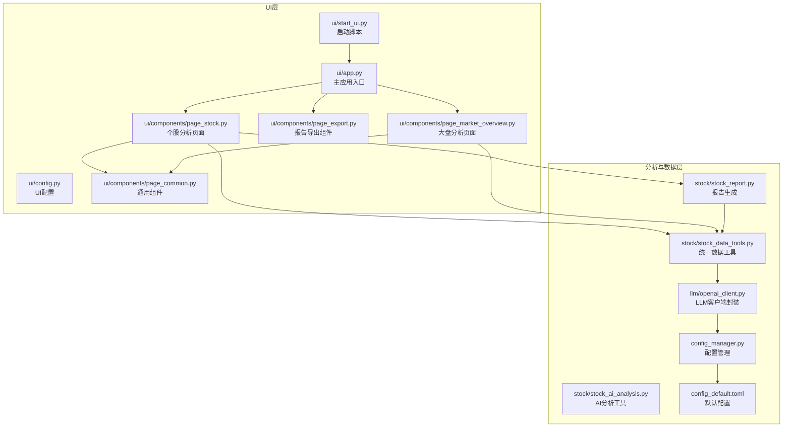
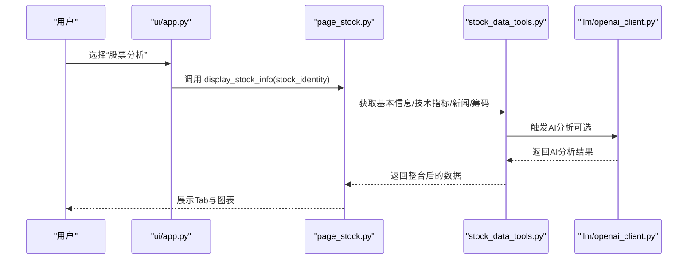
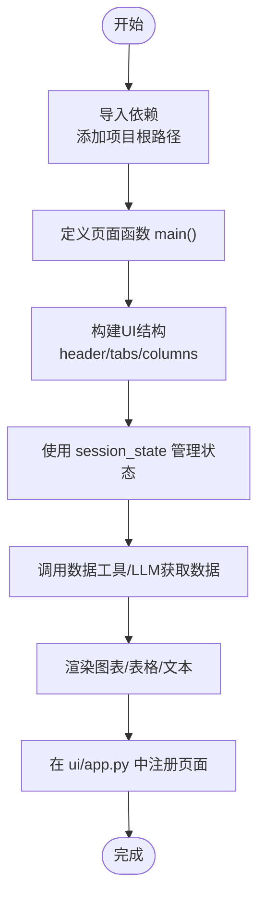
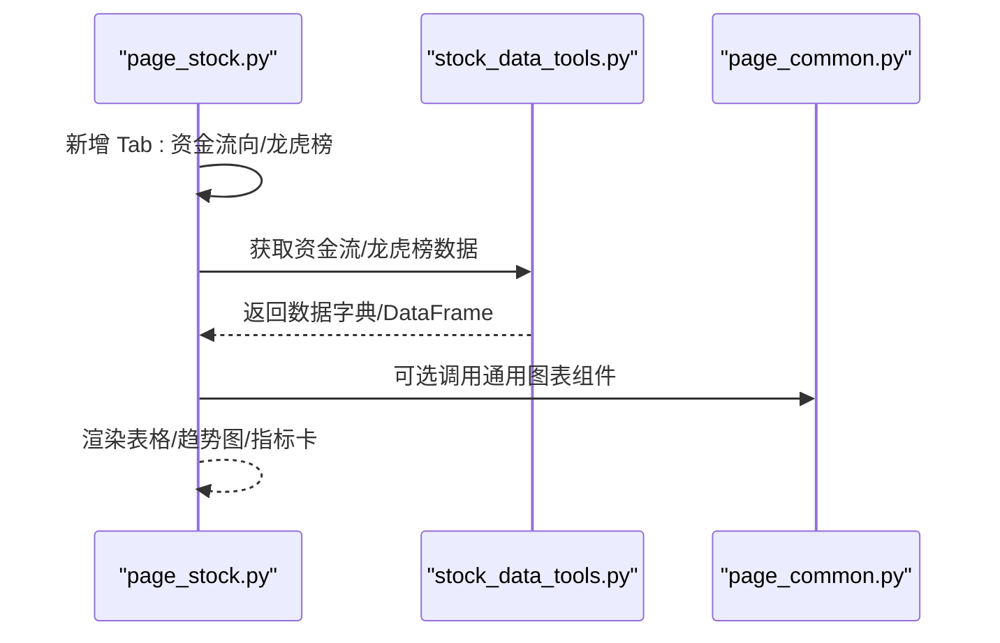
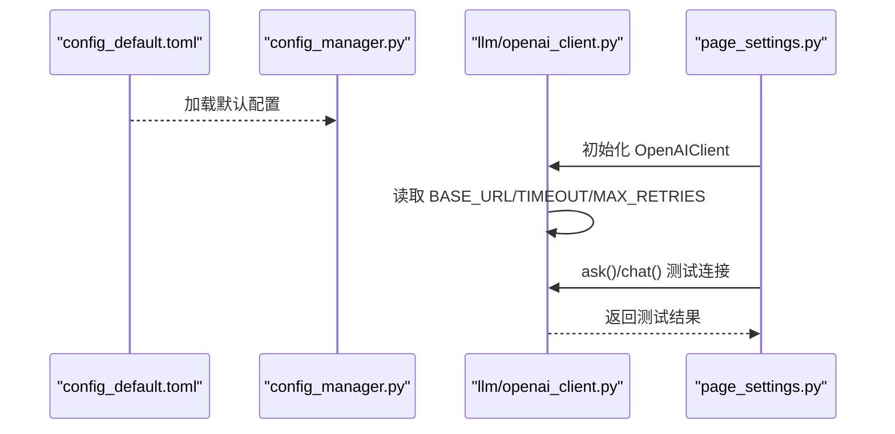
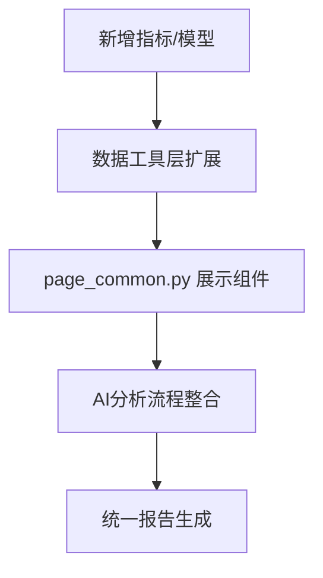
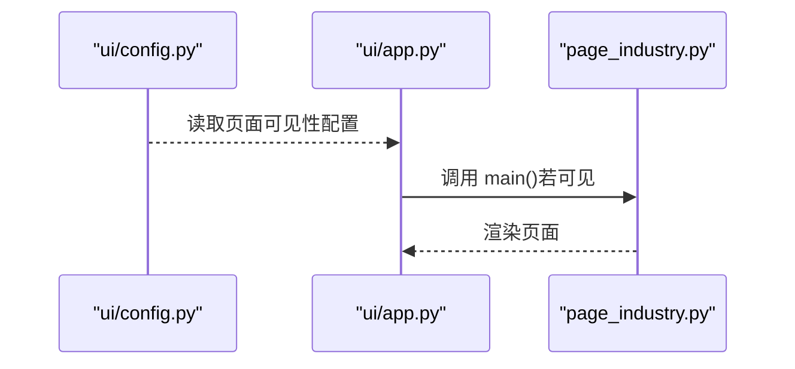
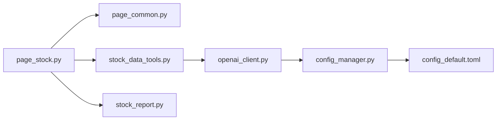

# 扩展功能模块

<cite>
**本文引用的文件**
- [ui/app.py](file://ui/app.py)
- [ui/config.py](file://ui/config.py)
- [ui/start_ui.py](file://ui/start_ui.py)
- [ui/components/page_stock.py](file://ui/components/page_stock.py)
- [ui/components/page_common.py](file://ui/components/page_common.py)
- [ui/components/page_export.py](file://ui/components/page_export.py)
- [ui/components/page_market_overview.py](file://ui/components/page_market_overview.py)
- [llm/openai_client.py](file://llm/openai_client.py)
- [config_manager.py](file://config_manager.py)
- [config_default.toml](file://config_default.toml)
- [stock/stock_data_tools.py](file://stock/stock_data_tools.py)
- [stock/stock_report.py](file://stock/stock_report.py)
- [stock/stock_ai_analysis.py](file://stock/stock_ai_analysis.py)
</cite>

## 目录
1. [引言](#引言)
2. [项目结构](#项目结构)
3. [核心组件](#核心组件)
4. [架构总览](#架构总览)
5. [详细组件分析](#详细组件分析)
6. [依赖关系分析](#依赖关系分析)
7. [性能考虑](#性能考虑)
8. [故障排查指南](#故障排查指南)
9. [结论](#结论)
10. [附录](#附录)

## 引言
本指南面向希望在现有系统基础上扩展功能模块的开发者，围绕“在Streamlit中创建新页面”的完整流程展开，重点参考 page_stock.py 的实现模式，给出可落地的步骤与最佳实践。同时，针对以下目标提供具体指导：
- 在个股分析中新增“资金流向”“龙虎榜”等分析Tab
- 支持新的LLM服务（如通义千问、Claude），只需确保其API格式与OpenAI兼容，并在 openai_client.py 中添加适配
- 在现有分析流程中集成新的技术指标或机器学习模型
- 创建一个全新的“行业分析”页面并通过配置文件控制其可见性

## 项目结构
系统采用模块化分层设计：
- UI层：ui/app.py 作为主入口，ui/components 下按页面拆分组件；ui/config.py 提供UI配置；ui/start_ui.py 提供启动脚本
- 数据与分析层：stock/ 与 market/ 分别承载个股与大盘分析能力；llm/ 提供LLM封装与使用记录
- 配置层：config_manager.py 与 config_default.toml 统一管理配置
- 工具与导出：utils/ 提供格式化与绘图；ui/components/page_export.py 提供通用导出组件

图表来源
- [ui/app.py](file://ui/app.py#L1-L229)
- [ui/components/page_stock.py](file://ui/components/page_stock.py#L1-L200)
- [ui/components/page_common.py](file://ui/components/page_common.py#L1-L120)
- [ui/components/page_export.py](file://ui/components/page_export.py#L1-L120)
- [ui/components/page_market_overview.py](file://ui/components/page_market_overview.py#L1-L120)
- [stock/stock_data_tools.py](file://stock/stock_data_tools.py#L1-L120)
- [stock/stock_report.py](file://stock/stock_report.py#L1-L120)
- [stock/stock_ai_analysis.py](file://stock/stock_ai_analysis.py#L1-L120)
- [llm/openai_client.py](file://llm/openai_client.py#L1-L120)
- [config_manager.py](file://config_manager.py#L1-L120)
- [config_default.toml](file://config_default.toml#L1-L64)

章节来源
- [ui/app.py](file://ui/app.py#L1-L229)
- [ui/config.py](file://ui/config.py#L1-L82)
- [ui/start_ui.py](file://ui/start_ui.py#L1-L60)

## 核心组件
- 主应用入口与路由：ui/app.py 通过侧边栏 radio 控制页面跳转，调用各页面组件的 main/display_* 函数
- 页面组件：page_stock.py 展示个股分析的Tab结构；page_common.py 提供通用技术指标、K线图、风险分析组件；page_export.py 提供统一导出能力
- 数据与AI：stock/stock_data_tools.py 统一封装数据获取与缓存；stock/stock_ai_analysis.py 提供AI分析配置与数据采集；llm/openai_client.py 封装LLM调用与使用记录
- 配置：config_manager.py 与 config_default.toml 提供LLM、缓存、市场等配置项

章节来源
- [ui/app.py](file://ui/app.py#L32-L120)
- [ui/components/page_stock.py](file://ui/components/page_stock.py#L47-L120)
- [ui/components/page_common.py](file://ui/components/page_common.py#L1-L120)
- [ui/components/page_export.py](file://ui/components/page_export.py#L1-L120)
- [stock/stock_data_tools.py](file://stock/stock_data_tools.py#L1-L120)
- [stock/stock_ai_analysis.py](file://stock/stock_ai_analysis.py#L1-L120)
- [llm/openai_client.py](file://llm/openai_client.py#L1-L120)
- [config_manager.py](file://config_manager.py#L1-L120)
- [config_default.toml](file://config_default.toml#L1-L64)

## 架构总览
系统遵循“UI组件 + 数据工具 + LLM封装 + 配置管理”的分层架构。UI层通过组件化组织页面，数据层通过统一工具类抽象数据获取与缓存，LLM层提供统一的模型调用与使用统计，配置层贯穿全局。

图表来源
- [ui/app.py](file://ui/app.py#L72-L120)
- [ui/components/page_stock.py](file://ui/components/page_stock.py#L47-L120)
- [stock/stock_data_tools.py](file://stock/stock_data_tools.py#L1-L120)
- [llm/openai_client.py](file://llm/openai_client.py#L1-L120)

## 详细组件分析

### 在Streamlit中创建新页面的完整流程（参考 page_stock.py）
- 导入依赖
  - 在新页面文件顶部添加项目根路径，确保能导入 utils、stock、market 等模块
  - 导入 streamlit 与必要的组件（如 page_common）
- 定义页面函数
  - 以 main() 作为页面入口，内部实现交互逻辑与数据展示
  - 使用 st.header/st.tabs/st.columns 等组件组织页面结构
  - 通过 session_state 管理用户输入与状态
- 注册到主应用
  - 在 ui/app.py 中导入新页面模块的 main 函数
  - 在侧边栏 radio 的菜单项中加入新页面名称
  - 在主路由分支中调用新页面的 main 函数
- 配置可见性（可选）
  - 通过 ui/config.py 的 MARKET_TYPES/STOCK_CODE_EXAMPLES 等配置，或在新页面中读取 config_manager 的配置，实现按需显示

图表来源
- [ui/components/page_stock.py](file://ui/components/page_stock.py#L1-L120)
- [ui/app.py](file://ui/app.py#L1-L120)

章节来源
- [ui/components/page_stock.py](file://ui/components/page_stock.py#L1-L120)
- [ui/app.py](file://ui/app.py#L1-L120)

### 在个股分析中新增“资金流向”“龙虎榜”分析Tab
思路与实现要点：
- “资金流向”Tab
  - 在 page_stock.py 的 display_stock_info 中新增一个 Tab，例如命名为“资金流向”
  - 通过 stock/stock_data_tools.py 的 get_stock_tools 获取资金流数据（若已有接口，直接调用；若无，可在该工具类中扩展）
  - 使用 page_common.py 的通用组件或 Plotly 图表展示趋势与指标
- “龙虎榜”Tab
  - 同样在 display_stock_info 中新增 Tab，命名为“龙虎榜”
  - 若系统已有获取龙虎榜数据的接口，直接调用；否则在 stock/stock_data_tools.py 中扩展
  - 使用表格/卡片组件展示上榜日期、营业部、买入/卖出金额等信息

图表来源
- [ui/components/page_stock.py](file://ui/components/page_stock.py#L47-L120)
- [ui/components/page_common.py](file://ui/components/page_common.py#L1-L120)
- [stock/stock_data_tools.py](file://stock/stock_data_tools.py#L1-L120)

章节来源
- [ui/components/page_stock.py](file://ui/components/page_stock.py#L47-L120)
- [ui/components/page_common.py](file://ui/components/page_common.py#L1-L120)
- [stock/stock_data_tools.py](file://stock/stock_data_tools.py#L1-L120)

### 支持新的LLM服务（如通义千问、Claude）
前提条件：新服务的API格式与OpenAI兼容
- 修改配置
  - 在 config_default.toml 中设置 BASE_URL 指向新服务的网关
  - 在 config_manager.py 的默认配置中可调整 DEFAULT_MODEL/INFERENCE_MODEL 等
- 适配客户端
  - llm/openai_client.py 已内置对 BASE_URL 的支持，无需额外修改
  - 若新服务需要特定鉴权头或参数，可在 openai_client.py 的 ask/chat 中扩展请求参数
- 使用验证
  - 在 UI 设置页面（page_settings.py）中可测试连接，验证新服务可用性

图表来源
- [config_default.toml](file://config_default.toml#L1-L64)
- [config_manager.py](file://config_manager.py#L1-L120)
- [llm/openai_client.py](file://llm/openai_client.py#L1-L120)
- [ui/components/page_settings.py](file://ui/components/page_settings.py#L77-L139)

章节来源
- [config_default.toml](file://config_default.toml#L1-L64)
- [config_manager.py](file://config_manager.py#L1-L120)
- [llm/openai_client.py](file://llm/openai_client.py#L1-L120)
- [ui/components/page_settings.py](file://ui/components/page_settings.py#L77-L139)

### 在现有分析流程中集成新的技术指标或机器学习模型
- 新技术指标
  - 在 stock/stock_data_tools.py 中扩展 get_stock_technical_indicators 或在数据获取层增加新指标计算
  - 在 page_common.py 的 display_technical_indicators 中新增展示逻辑
- 机器学习模型
  - 将模型封装为数据工具层的函数，返回标准化指标字典
  - 在 AI分析流程（stock/stock_ai_analysis.py）中通过 DataCollector 收集模型输出，并纳入统一的报告生成
  - 在 UI 层通过 page_common.py 的组件展示模型结果

图表来源
- [stock/stock_data_tools.py](file://stock/stock_data_tools.py#L1-L120)
- [ui/components/page_common.py](file://ui/components/page_common.py#L1-L120)
- [stock/stock_ai_analysis.py](file://stock/stock_ai_analysis.py#L1-L120)
- [stock/stock_report.py](file://stock/stock_report.py#L1-L120)

章节来源
- [stock/stock_data_tools.py](file://stock/stock_data_tools.py#L1-L120)
- [ui/components/page_common.py](file://ui/components/page_common.py#L1-L120)
- [stock/stock_ai_analysis.py](file://stock/stock_ai_analysis.py#L1-L120)
- [stock/stock_report.py](file://stock/stock_report.py#L1-L120)

### 创建一个全新的“行业分析”页面并通过配置文件控制其可见性
- 创建页面文件
  - 在 ui/components/ 下新建 page_industry.py，定义 main() 页面函数
  - 在文件顶部添加项目根路径，导入必要组件与工具
- 实现页面逻辑
  - 使用 st.header/st.tabs/st.columns 组织页面
  - 通过 session_state 管理用户输入与状态
  - 调用 market/stock 数据工具获取行业相关数据（如行业指数、资金流向等）
- 注册页面
  - 在 ui/app.py 中导入 page_industry.main
  - 在侧边栏 radio 的菜单项中加入“行业分析”
  - 在主路由分支中调用 page_industry.main
- 控制可见性
  - 在 ui/config.py 中新增配置项（如 INDUSTRY_PAGE_VISIBLE），在页面入口处根据配置决定是否显示
  - 或在 UI 设置页面中提供开关，写入 config_manager 并在页面中读取

图表来源
- [ui/config.py](file://ui/config.py#L1-L82)
- [ui/app.py](file://ui/app.py#L1-L120)
- [ui/components/page_industry.py](file://ui/components/page_industry.py#L1-L120)

章节来源
- [ui/config.py](file://ui/config.py#L1-L82)
- [ui/app.py](file://ui/app.py#L1-L120)

## 依赖关系分析
- 组件耦合
  - page_stock.py 依赖 page_common.py（通用图表与指标）、stock/stock_data_tools.py（数据获取）、stock/stock_report.py（报告导出）
  - llm/openai_client.py 依赖 config_manager.py 与 config_default.toml
- 外部依赖
  - Streamlit、Plotly、pandas 等第三方库
- 配置依赖
  - LLM_OPENAI、LLM_LOGGING、LLM_CACHE、MARKET 等配置项贯穿 LLm 与分析流程

图表来源
- [ui/components/page_stock.py](file://ui/components/page_stock.py#L1-L120)
- [ui/components/page_common.py](file://ui/components/page_common.py#L1-L120)
- [stock/stock_data_tools.py](file://stock/stock_data_tools.py#L1-L120)
- [stock/stock_report.py](file://stock/stock_report.py#L1-L120)
- [llm/openai_client.py](file://llm/openai_client.py#L1-L120)
- [config_manager.py](file://config_manager.py#L1-L120)
- [config_default.toml](file://config_default.toml#L1-L64)

章节来源
- [ui/components/page_stock.py](file://ui/components/page_stock.py#L1-L120)
- [ui/components/page_common.py](file://ui/components/page_common.py#L1-L120)
- [stock/stock_data_tools.py](file://stock/stock_data_tools.py#L1-L120)
- [stock/stock_report.py](file://stock/stock_report.py#L1-L120)
- [llm/openai_client.py](file://llm/openai_client.py#L1-L120)
- [config_manager.py](file://config_manager.py#L1-L120)
- [config_default.toml](file://config_default.toml#L1-L64)

## 性能考虑
- 缓存策略
  - 使用 stock/stock_data_tools.py 的缓存管理减少重复请求
  - 对高频指标与AI分析结果设置合理的过期时间
- UI渲染
  - 使用 st.spinner 与 st.container 控制渲染节奏
  - 对大数据表格使用分页或限制显示行数
- LLM调用
  - 合理设置 TIMEOUT 与 MAX_RETRIES
  - 在 UI 设置中提供测试连接，避免无效调用

[本节为通用指导，不直接分析具体文件]

## 故障排查指南
- LLM连接失败
  - 检查 config_default.toml 中的 LLM_OPENAI.API_KEY 与 BASE_URL
  - 在 UI 设置页面测试连接，确认响应内容
- 数据获取异常
  - 查看 page_stock.py 的异常捕获与错误详情面板
  - 检查 stock/stock_data_tools.py 的缓存状态与过期策略
- 页面不显示或报错
  - 确认 ui/app.py 中已正确导入并注册新页面
  - 检查 ui/config.py 中的可见性配置

章节来源
- [ui/components/page_stock.py](file://ui/components/page_stock.py#L1-L120)
- [ui/components/page_settings.py](file://ui/components/page_settings.py#L77-L139)
- [config_default.toml](file://config_default.toml#L1-L64)
- [stock/stock_data_tools.py](file://stock/stock_data_tools.py#L1-L120)

## 结论
通过遵循现有代码风格与架构模式（UI组件化、数据工具统一、LLM封装与配置管理），可以在不破坏系统稳定性的前提下快速扩展新页面与新功能。新增分析Tab、LLM服务与技术指标/模型集成均可在现有框架内高效完成。

[本节为总结性内容，不直接分析具体文件]

## 附录
- 代码示例路径（不直接展示代码内容）
  - 新页面入口函数定义：[ui/components/page_stock.py](file://ui/components/page_stock.py#L1-L120)
  - 页面路由注册：[ui/app.py](file://ui/app.py#L1-L120)
  - 通用技术指标展示：[ui/components/page_common.py](file://ui/components/page_common.py#L1-L120)
  - LLM客户端封装与配置：[llm/openai_client.py](file://llm/openai_client.py#L1-L120)、[config_manager.py](file://config_manager.py#L1-L120)、[config_default.toml](file://config_default.toml#L1-L64)
  - 报告导出组件：[ui/components/page_export.py](file://ui/components/page_export.py#L1-L120)
  - 股票数据工具与AI分析：[stock/stock_data_tools.py](file://stock/stock_data_tools.py#L1-L120)、[stock/stock_ai_analysis.py](file://stock/stock_ai_analysis.py#L1-L120)、[stock/stock_report.py](file://stock/stock_report.py#L1-L120)