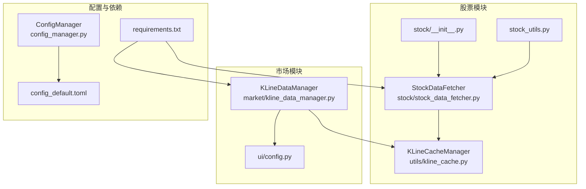
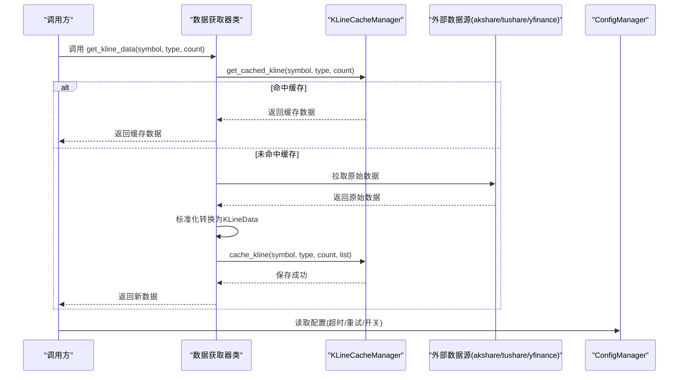
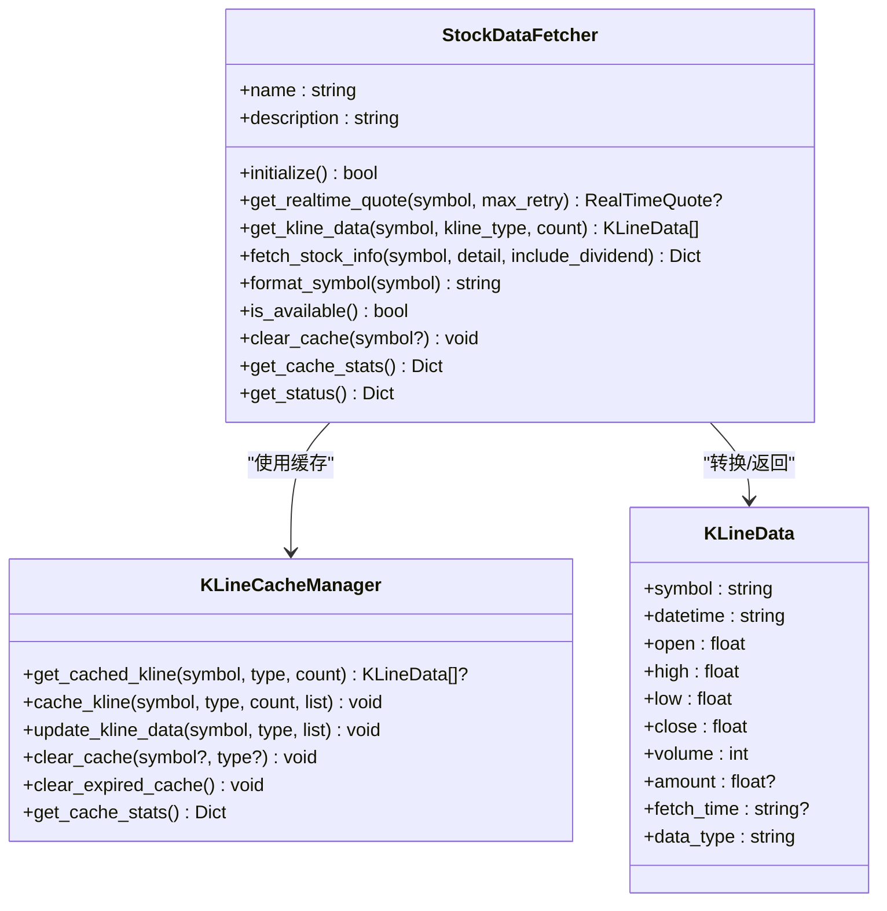
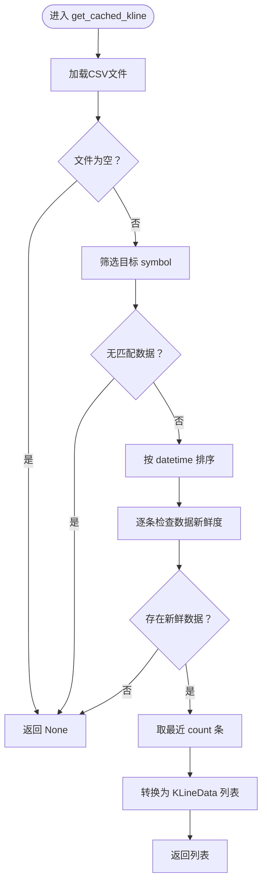
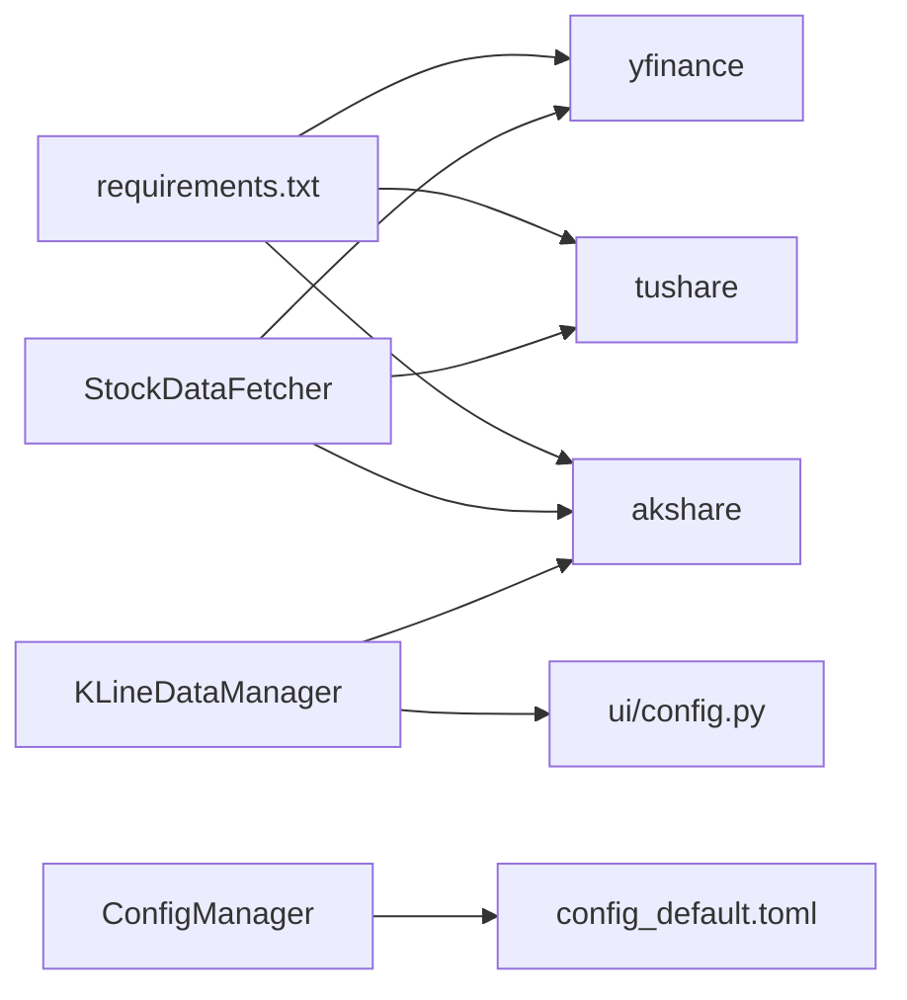

# 添加数据源

<cite>
**本文引用的文件**
- [stock/stock_data_fetcher.py](file://stock/stock_data_fetcher.py)
- [utils/kline_cache.py](file://utils/kline_cache.py)
- [market/kline_data_manager.py](file://market/kline_data_manager.py)
- [ui/config.py](file://ui/config.py)
- [config_manager.py](file://config_manager.py)
- [config_default.toml](file://config_default.toml)
- [requirements.txt](file://requirements.txt)
- [stock/__init__.py](file://stock/__init__.py)
- [stock/stock_utils.py](file://stock/stock_utils.py)
</cite>

## 目录
1. [简介](#简介)
2. [项目结构](#项目结构)
3. [核心组件](#核心组件)
4. [架构总览](#架构总览)
5. [详细组件分析](#详细组件分析)
6. [依赖关系分析](#依赖关系分析)
7. [性能考量](#性能考量)
8. [故障排查指南](#故障排查指南)
9. [结论](#结论)
10. [附录](#附录)

## 简介
本指南面向希望为系统新增“数据源”的开发者，以 stock_data_fetcher.py 中的 StockDataFetcher 类为模板，系统讲解如何实现新的数据获取器类、对接 akshare/tushare/yfinance 等外部数据源、集成缓存机制、注册到数据管理器并通过配置文件启用。文档同时提供从零开始创建基于 tushare 的数据获取器的步骤与示例路径，帮助你快速完成新数据源的接入与上线。

## 项目结构
围绕“数据源”这一主题，系统的关键模块如下：
- 股票数据获取器：stock/stock_data_fetcher.py
- K线缓存管理：utils/kline_cache.py
- 指数K线数据管理：market/kline_data_manager.py
- UI配置（指数映射等）：ui/config.py
- 配置管理器与默认配置：config_manager.py、config_default.toml
- 依赖声明：requirements.txt
- 股票模块导出入口：stock/__init__.py
- 股票工具（调用数据获取器）：stock/stock_utils.py

图表来源
- [stock/stock_data_fetcher.py](file://stock/stock_data_fetcher.py#L1-L120)
- [utils/kline_cache.py](file://utils/kline_cache.py#L1-L120)
- [market/kline_data_manager.py](file://market/kline_data_manager.py#L1-L120)
- [ui/config.py](file://ui/config.py#L45-L82)
- [config_manager.py](file://config_manager.py#L1-L80)
- [config_default.toml](file://config_default.toml#L1-L64)
- [requirements.txt](file://requirements.txt#L1-L40)
- [stock/__init__.py](file://stock/__init__.py#L1-L56)
- [stock/stock_utils.py](file://stock/stock_utils.py#L155-L188)

章节来源
- [stock/stock_data_fetcher.py](file://stock/stock_data_fetcher.py#L1-L120)
- [utils/kline_cache.py](file://utils/kline_cache.py#L1-L120)
- [market/kline_data_manager.py](file://market/kline_data_manager.py#L1-L120)
- [ui/config.py](file://ui/config.py#L45-L82)
- [config_manager.py](file://config_manager.py#L1-L80)
- [config_default.toml](file://config_default.toml#L1-L64)
- [requirements.txt](file://requirements.txt#L1-L40)
- [stock/__init__.py](file://stock/__init__.py#L1-L56)
- [stock/stock_utils.py](file://stock/stock_utils.py#L155-L188)

## 核心组件
- StockDataFetcher：A股数据获取器，提供实时行情、K线、股票信息等接口，并内置缓存与异常处理。
- KLineCacheManager：K线数据缓存管理器，支持按 K 线类型持久化 CSV，带智能新鲜度判断与过期清理。
- KLineDataManager：指数K线数据统一入口，负责从 akshare 获取原始数据、转换为 KLineData 列表并缓存。
- ConfigManager/配置文件：集中管理配置，支持默认配置与用户覆盖。
- UI配置：指数名称与代码映射，供市场模块使用。
- 依赖声明：requirements.txt 明确声明了 akshare、tushare、yfinance 等外部库。

章节来源
- [stock/stock_data_fetcher.py](file://stock/stock_data_fetcher.py#L45-L120)
- [utils/kline_cache.py](file://utils/kline_cache.py#L46-L120)
- [market/kline_data_manager.py](file://market/kline_data_manager.py#L23-L120)
- [config_manager.py](file://config_manager.py#L1-L80)
- [config_default.toml](file://config_default.toml#L1-L64)
- [requirements.txt](file://requirements.txt#L15-L21)

## 架构总览
新增数据源的总体流程如下：
- 设计数据获取器类，实现统一接口（如 get_realtime_quote、get_kline_data、fetch_stock_info 等），并处理异常。
- 在类内部或外部集成 akshare/tushare/yfinance，完成数据拉取与标准化转换。
- 使用 KLineCacheManager 进行 K 线数据缓存，确保重复访问命中缓存。
- 在模块导出入口（如 stock/__init__.py）注册新数据获取器实例，或通过配置启用。
- 通过 ConfigManager 与 config.toml 控制运行时行为（如启用/禁用、超时、重试等）。

图表来源
- [stock/stock_data_fetcher.py](file://stock/stock_data_fetcher.py#L135-L224)
- [utils/kline_cache.py](file://utils/kline_cache.py#L138-L233)
- [config_manager.py](file://config_manager.py#L64-L115)

章节来源
- [stock/stock_data_fetcher.py](file://stock/stock_data_fetcher.py#L135-L224)
- [utils/kline_cache.py](file://utils/kline_cache.py#L138-L233)
- [config_manager.py](file://config_manager.py#L64-L115)

## 详细组件分析

### StockDataFetcher 类详解（模板）
StockDataFetcher 是实现新数据获取器的模板类，其关键点包括：
- 接口方法
  - initialize：初始化外部依赖（如 efinance），返回可用状态
  - get_realtime_quote：获取实时行情，支持重试与异常处理
  - get_kline_data：获取K线数据，支持缓存命中与回退策略
  - fetch_stock_info：获取股票基本信息，可扩展财务指标与分红信息
  - format_symbol：标准化股票代码
  - is_available/clear_cache/get_cache_stats/get_status：状态与缓存辅助方法
- 异常体系
  - DataFetcherError：通用数据获取异常
  - DataFetcherNotAvailableError：数据源不可用
  - InvalidSymbolError：无效股票代码
- 缓存集成
  - 使用 utils.kline_cache.cache_manager 进行 K 线数据缓存与读取
  - K 线类型映射 KLineType -> 数据源编码
- 数据转换
  - _convert_to_realtime_quote：将外部数据转换为统一 RealTimeQuote 结构
  - _convert_to_kline_data：将外部数据转换为 KLineData 列表
  - _convert_to_stock_info：将外部数据转换为统一股票信息字典

图表来源
- [stock/stock_data_fetcher.py](file://stock/stock_data_fetcher.py#L45-L120)
- [utils/kline_cache.py](file://utils/kline_cache.py#L46-L120)

章节来源
- [stock/stock_data_fetcher.py](file://stock/stock_data_fetcher.py#L45-L120)
- [utils/kline_cache.py](file://utils/kline_cache.py#L46-L120)

### KLineCacheManager 缓存机制
- K 线类型枚举：支持分钟线、小时线、日线、周线、月线及指数日线
- 数据结构：KLineData，包含 symbol、datetime、OHLCV、amount、fetch_time、data_type
- 缓存策略：
  - 按 K 线类型分文件存储（CSV）
  - 智能新鲜度判断：不同周期有不同的过期策略
  - 增量更新：update_kline_data 合并新旧数据
  - 过期清理：clear_expired_cache 清理过期记录
  - 统计与诊断：get_cache_stats 输出缓存文件、记录数、符号数等

图表来源
- [utils/kline_cache.py](file://utils/kline_cache.py#L138-L187)

章节来源
- [utils/kline_cache.py](file://utils/kline_cache.py#L138-L187)

### 指数K线数据管理（KLineDataManager）
- 从 akshare 获取指数日线原始数据，转换为 KLineData 列表并缓存
- 提供 get_index_kline_data 统一入口，支持 use_cache/force_refresh
- 支持批量更新缓存与添加均线等衍生指标

章节来源
- [market/kline_data_manager.py](file://market/kline_data_manager.py#L1-L200)
- [ui/config.py](file://ui/config.py#L58-L82)

### 配置与注册
- 配置管理：ConfigManager 支持默认配置与用户覆盖，提供 get/set/save/load
- 默认配置：config_default.toml 定义了 LLM 相关配置，可作为新增数据源配置的参考
- 模块导出：stock/__init__.py 暴露 KLineData、RealTimeQuote、KLineType、异常类与 data_manager 全局实例
- 调用链路：stock_utils.py 通过 data_manager 调用 get_realtime_quote/fetch_stock_info

章节来源
- [config_manager.py](file://config_manager.py#L1-L144)
- [config_default.toml](file://config_default.toml#L1-L64)
- [stock/__init__.py](file://stock/__init__.py#L1-L56)
- [stock/stock_utils.py](file://stock/stock_utils.py#L155-L188)

## 依赖关系分析
- 外部库依赖：requirements.txt 明确列出 akshare、tushare、yfinance 等库，为新增数据源提供基础能力
- 内部依赖：StockDataFetcher 依赖 utils.kline_cache，KLineDataManager 依赖 akshare 与 ui.config 的指数映射
- 配置依赖：ConfigManager 与 config.toml 为运行时行为提供开关与参数

图表来源
- [requirements.txt](file://requirements.txt#L15-L21)
- [stock/stock_data_fetcher.py](file://stock/stock_data_fetcher.py#L1-L20)
- [market/kline_data_manager.py](file://market/kline_data_manager.py#L1-L20)
- [ui/config.py](file://ui/config.py#L58-L82)
- [config_manager.py](file://config_manager.py#L1-L80)
- [config_default.toml](file://config_default.toml#L1-L64)

章节来源
- [requirements.txt](file://requirements.txt#L15-L21)
- [stock/stock_data_fetcher.py](file://stock/stock_data_fetcher.py#L1-L20)
- [market/kline_data_manager.py](file://market/kline_data_manager.py#L1-L20)
- [ui/config.py](file://ui/config.py#L58-L82)
- [config_manager.py](file://config_manager.py#L1-L80)
- [config_default.toml](file://config_default.toml#L1-L64)

## 性能考量
- 缓存命中优先：K 线数据优先从缓存读取，减少外部请求
- 智能过期策略：不同周期采用不同过期阈值，兼顾时效与性能
- 增量更新：update_kline_data 合并新旧数据，避免全量写入
- 重试与降级：get_realtime_quote 支持重试与回退缓存，提高稳定性
- 数据类型转换：尽量在转换阶段做类型校验与异常捕获，避免后续处理开销

[本节为通用建议，无需引用具体文件]

## 故障排查指南
- 初始化失败
  - 检查外部库是否安装（akshare/tushare/yfinance）
  - 查看异常类型：DataFetcherNotAvailableError
- 数据为空或格式异常
  - 检查 _convert_* 方法的字段映射与类型转换
  - 使用 get_cache_stats 查看缓存状态
- 缓存问题
  - 使用 clear_cache/clear_expired_cache 清理缓存
  - 检查 CSV 文件是否存在与权限
- 配置问题
  - 通过 ConfigManager.get("SECTION.KEY") 检查配置项
  - 确认 config.toml 是否存在并可读

章节来源
- [stock/stock_data_fetcher.py](file://stock/stock_data_fetcher.py#L30-L44)
- [utils/kline_cache.py](file://utils/kline_cache.py#L331-L410)
- [config_manager.py](file://config_manager.py#L64-L115)

## 结论
新增数据源的核心在于：遵循统一接口设计、实现标准化数据转换、充分利用现有缓存机制、通过配置管理器进行启用与控制。StockDataFetcher 提供了完整的模板，结合 KLineCacheManager 的缓存策略与 KLineDataManager 的指数数据管理经验，可以快速、稳定地接入 akshare/tushare/yfinance 等外部数据源。

[本节为总结，无需引用具体文件]

## 附录

### 从零开始创建基于 tushare 的数据获取器（步骤清单）
- 步骤1：创建新类
  - 参考 StockDataFetcher 的类结构与命名约定
  - 示例路径：[stock/stock_data_fetcher.py](file://stock/stock_data_fetcher.py#L45-L120)
- 步骤2：实现 initialize
  - 初始化 tushare 客户端（如需认证）
  - 返回可用状态
  - 示例路径：[stock/stock_data_fetcher.py](file://stock/stock_data_fetcher.py#L81-L96)
- 步骤3：实现 get_realtime_quote
  - 使用 tushare 接口获取实时行情
  - 支持 max_retry 重试
  - 使用 _convert_to_realtime_quote 标准化
  - 示例路径：[stock/stock_data_fetcher.py](file://stock/stock_data_fetcher.py#L97-L134)
- 步骤4：实现 get_kline_data
  - 使用 tushare 接口获取K线
  - 调用 _convert_to_kline_data 标准化
  - 使用 cache_manager 缓存与回退
  - 示例路径：[stock/stock_data_fetcher.py](file://stock/stock_data_fetcher.py#L135-L224)
- 步骤5：实现 fetch_stock_info
  - 获取基本信息、财务指标、分红信息
  - 使用 _convert_to_stock_info 标准化
  - 示例路径：[stock/stock_data_fetcher.py](file://stock/stock_data_fetcher.py#L225-L373)
- 步骤6：异常处理
  - 定义 DataFetcherError/DataFetcherNotAvailableError/InvalidSymbolError
  - 在各方法中捕获并抛出对应异常
  - 示例路径：[stock/stock_data_fetcher.py](file://stock/stock_data_fetcher.py#L30-L44)
- 步骤7：注册与导出
  - 在模块导出入口注册新实例（参考 stock/__init__.py）
  - 示例路径：[stock/__init__.py](file://stock/__init__.py#L1-L56)
- 步骤8：配置启用
  - 通过 ConfigManager 读取配置（如 API Key、超时、重试）
  - 示例路径：[config_manager.py](file://config_manager.py#L64-L115)，[config_default.toml](file://config_default.toml#L1-L64)
- 步骤9：缓存集成
  - 使用 utils.kline_cache.cache_manager 进行缓存
  - 示例路径：[utils/kline_cache.py](file://utils/kline_cache.py#L138-L233)
- 步骤10：验证与测试
  - 通过 stock_utils.py 的调用链验证
  - 示例路径：[stock/stock_utils.py](file://stock/stock_utils.py#L155-L188)

章节来源
- [stock/stock_data_fetcher.py](file://stock/stock_data_fetcher.py#L30-L120)
- [stock/__init__.py](file://stock/__init__.py#L1-L56)
- [config_manager.py](file://config_manager.py#L64-L115)
- [config_default.toml](file://config_default.toml#L1-L64)
- [utils/kline_cache.py](file://utils/kline_cache.py#L138-L233)
- [stock/stock_utils.py](file://stock/stock_utils.py#L155-L188)

### API 方法对照与实现要点
- 必须实现的方法
  - initialize：初始化外部依赖
  - get_realtime_quote：返回 RealTimeQuote 或 None
  - get_kline_data：返回 KLineData 列表
  - fetch_stock_info：返回标准化字典
  - format_symbol：标准化股票代码
  - is_available/clear_cache/get_cache_stats/get_status：状态与缓存辅助
- 异常处理
  - 使用 DataFetcherError/DataFetcherNotAvailableError/InvalidSymbolError
  - 在重试与回退缓存之间平衡
- 缓存集成
  - 使用 cache_manager.get_cached_kline/cache_kline/update_kline_data
  - 注意 KLineType 映射与数据新鲜度判断

章节来源
- [stock/stock_data_fetcher.py](file://stock/stock_data_fetcher.py#L45-L120)
- [utils/kline_cache.py](file://utils/kline_cache.py#L138-L233)

### 外部数据源集成要点
- akshare：适合国内A股与指数数据，已在 KLineDataManager 中演示
  - 示例路径：[market/kline_data_manager.py](file://market/kline_data_manager.py#L30-L64)
- tushare：专业金融数据，需配置 API Key
  - 依赖声明：[requirements.txt](file://requirements.txt#L15-L21)
  - 配置读取：[config_manager.py](file://config_manager.py#L64-L115)
- yfinance：国际市场数据，适合美股等
  - 依赖声明：[requirements.txt](file://requirements.txt#L15-L21)

章节来源
- [market/kline_data_manager.py](file://market/kline_data_manager.py#L30-L64)
- [requirements.txt](file://requirements.txt#L15-L21)
- [config_manager.py](file://config_manager.py#L64-L115)