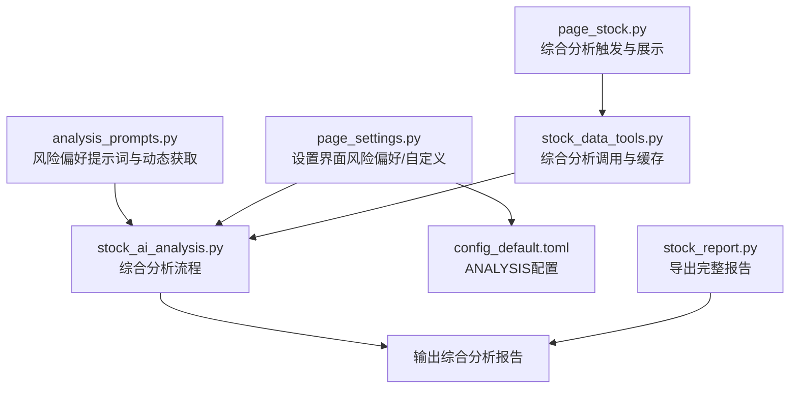
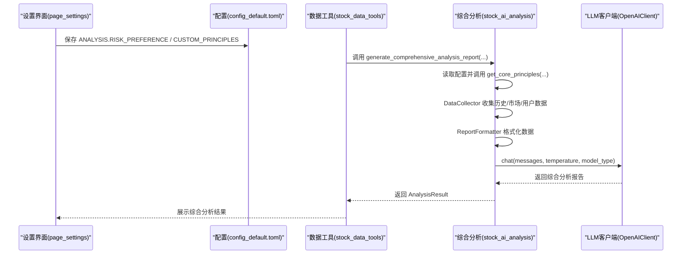
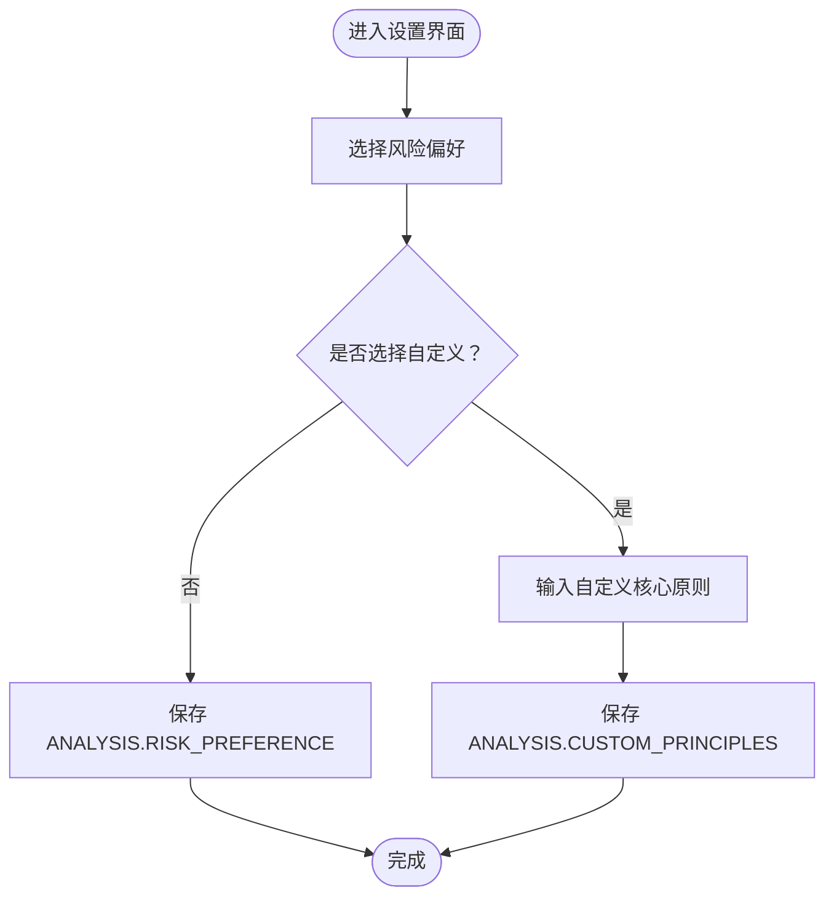
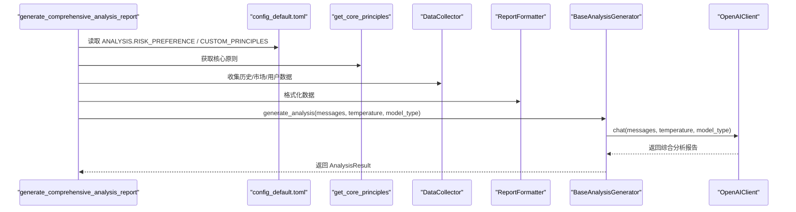
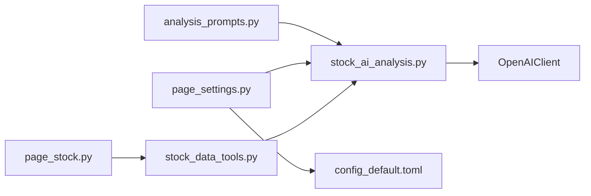

# 自定义分析提示词

<cite>
**本文引用的文件**
- [analysis_prompts.py](file://stock/analysis_prompts.py)
- [stock_ai_analysis.py](file://stock/stock_ai_analysis.py)
- [page_settings.py](file://ui/components/page_settings.py)
- [page_stock.py](file://ui/components/page_stock.py)
- [stock_data_tools.py](file://stock/stock_data_tools.py)
- [config_default.toml](file://config_default.toml)
- [stock_report.py](file://stock/stock_report.py)
</cite>

## 目录
1. [简介](#简介)
2. [项目结构](#项目结构)
3. [核心组件](#核心组件)
4. [架构总览](#架构总览)
5. [详细组件分析](#详细组件分析)
6. [依赖关系分析](#依赖关系分析)
7. [性能考量](#性能考量)
8. [故障排查指南](#故障排查指南)
9. [结论](#结论)
10. [附录](#附录)

## 简介
本文件围绕如何通过修改 stock/analysis_prompts.py 文件来自定义AI分析的输出风格与内容深度展开，系统讲解三种预设风险偏好提示词模板的设计原理与适用场景，并提供扩展新风险偏好的步骤、在UI中添加选择项的方法、动态提示词生成的实现思路，以及如何在 stock_ai_analysis.py 的综合分析流程中正确传递自定义提示词。文末还给出针对ESG、技术指标与宏观经济分析权重调整的实践建议与代码路径指引。

## 项目结构
与“自定义分析提示词”直接相关的模块与文件如下：
- stock/analysis_prompts.py：定义风险偏好提示词模板与动态获取逻辑
- stock/stock_ai_analysis.py：综合分析流程，整合历史分析、市场环境、用户画像与核心原则
- ui/components/page_settings.py：设置界面，提供风险偏好选择与自定义核心原则输入
- ui/components/page_stock.py：综合分析触发与展示，调用数据工具生成综合分析
- stock/stock_data_tools.py：封装综合分析调用与缓存逻辑
- config_default.toml：默认配置，包含 ANALYSIS.RISK_PREFERENCE 与 CUSTOM_PRINCIPLES
- stock/stock_report.py：导出完整报告，包含综合分析结果

**图表来源**
- [analysis_prompts.py](file://stock/analysis_prompts.py#L1-L54)
- [stock_ai_analysis.py](file://stock/stock_ai_analysis.py#L717-L800)
- [page_settings.py](file://ui/components/page_settings.py#L139-L175)
- [page_stock.py](file://ui/components/page_stock.py#L810-L831)
- [stock_data_tools.py](file://stock/stock_data_tools.py#L517-L614)
- [config_default.toml](file://config_default.toml#L55-L64)
- [stock_report.py](file://stock/stock_report.py#L1-L120)

**章节来源**
- [analysis_prompts.py](file://stock/analysis_prompts.py#L1-L54)
- [stock_ai_analysis.py](file://stock/stock_ai_analysis.py#L717-L800)
- [page_settings.py](file://ui/components/page_settings.py#L139-L175)
- [page_stock.py](file://ui/components/page_stock.py#L810-L831)
- [stock_data_tools.py](file://stock/stock_data_tools.py#L517-L614)
- [config_default.toml](file://config_default.toml#L55-L64)
- [stock_report.py](file://stock/stock_report.py#L1-L120)

## 核心组件
- 风险偏好提示词模板
  - PROMPT_NEUTRAL：中性风格，强调“诚实第一、客观判断、操作明确”，适合平衡型投资者。
  - PROMPT_CONSERVATIVE：保守风格，强调“本金安全优先、严格风控、谨慎操作”，适合稳健型投资者。
  - PROMPT_AGGRESSIVE：激进风格，强调“积极把握成长机会、适度承担风险、灵活操作”，适合成长型投资者。
- 动态提示词获取
  - RISK_PREFERENCE_PROMPTS：将风险偏好键映射到对应提示词。
  - RISK_PREFERENCE_DESCRIPTIONS：用于UI展示的描述。
  - get_core_principles(risk_preference, custom_principles)：根据配置返回核心原则，支持自定义模式。

- 综合分析流程
  - generate_comprehensive_analysis_report：组装系统消息，注入核心原则与历史/市场/用户数据，调用LLM生成综合分析报告。
  - BaseAnalysisGenerator.generate_analysis：封装LLM调用、温度与模型类型、缓存写入。

- UI与配置
  - page_settings：提供风险偏好选择与自定义核心原则输入，保存至配置。
  - page_stock：触发综合分析并展示结果。
  - stock_data_tools：封装综合分析调用、缓存与元数据存储。
  - config_default.toml：默认配置项 ANALYSIS.RISK_PREFERENCE 与 ANALYSIS.CUSTOM_PRINCIPLES。

**章节来源**
- [analysis_prompts.py](file://stock/analysis_prompts.py#L1-L54)
- [stock_ai_analysis.py](file://stock/stock_ai_analysis.py#L717-L800)
- [page_settings.py](file://ui/components/page_settings.py#L139-L175)
- [page_stock.py](file://ui/components/page_stock.py#L810-L831)
- [stock_data_tools.py](file://stock/stock_data_tools.py#L517-L614)
- [config_default.toml](file://config_default.toml#L55-L64)

## 架构总览
综合分析的提示词集成链路如下：
- 页面设置选择风险偏好或自定义核心原则，写入配置。
- 综合分析入口读取配置，调用 get_core_principles 获取核心原则。
- DataCollector 收集历史分析、市场环境、用户画像等数据。
- ReportFormatter 格式化各部分数据。
- BaseAnalysisGenerator 调用LLM客户端，生成综合分析报告。

**图表来源**
- [page_settings.py](file://ui/components/page_settings.py#L139-L175)
- [config_default.toml](file://config_default.toml#L55-L64)
- [stock_data_tools.py](file://stock/stock_data_tools.py#L517-L614)
- [stock_ai_analysis.py](file://stock/stock_ai_analysis.py#L717-L800)

## 详细组件分析

### 风险偏好提示词模板设计与适用场景
- 设计原则
  - 中性风格（neutral）：强调诚实、客观与明确操作建议，适合追求稳健回报与风险平衡的用户。
  - 保守风格（conservative）：强调本金安全、严格风控与谨慎操作，适合风险厌恶型用户。
  - 激进风格（aggressive）：强调成长机会、适度风险与灵活操作，适合风险偏好型用户。
- 适用场景
  - 中性：常规投资建议、跨周期分析。
  - 保守：防御性配置、避险阶段。
  - 激进：成长型行业轮动、主题投资、阶段性热点捕捉。

**章节来源**
- [analysis_prompts.py](file://stock/analysis_prompts.py#L6-L23)

### 动态提示词生成与UI集成
- 动态生成
  - get_core_principles：当 risk_preference 为 custom 且 custom_principles 非空时，返回自定义核心原则；否则返回 RISK_PREFERENCE_PROMPTS 中的对应模板。
- UI选择与保存
  - page_settings 提供 selectbox 选择风险偏好，format_func 使用 RISK_PREFERENCE_DESCRIPTIONS 展示描述。
  - 当选择 custom 时显示文本域输入自定义核心原则，并保存到 ANALYSIS.CUSTOM_PRINCIPLES。
  - 保存后，下次综合分析会读取最新配置。

**图表来源**
- [page_settings.py](file://ui/components/page_settings.py#L139-L175)
- [analysis_prompts.py](file://stock/analysis_prompts.py#L39-L54)
- [config_default.toml](file://config_default.toml#L55-L64)

**章节来源**
- [analysis_prompts.py](file://stock/analysis_prompts.py#L39-L54)
- [page_settings.py](file://ui/components/page_settings.py#L139-L175)
- [config_default.toml](file://config_default.toml#L55-L64)

### 在综合分析流程中注入核心原则
- 读取配置与获取核心原则
  - generate_comprehensive_analysis_report 读取 ANALYSIS.RISK_PREFERENCE 与 ANALYSIS.CUSTOM_PRINCIPLES，调用 get_core_principles 获取核心原则。
- 系统消息构造
  - 将核心原则拼接进系统消息，作为综合分析的风格约束。
- 数据收集与格式化
  - DataCollector 收集历史分析、市场环境、用户画像与用户观点/持仓。
  - ReportFormatter 格式化各部分数据，控制截断长度。
- LLM调用与缓存
  - BaseAnalysisGenerator.chat 调用LLM客户端，按配置设置 temperature 与 model_type，并将消息内容写入缓存文件。

**图表来源**
- [stock_ai_analysis.py](file://stock/stock_ai_analysis.py#L717-L800)
- [analysis_prompts.py](file://stock/analysis_prompts.py#L39-L54)
- [config_default.toml](file://config_default.toml#L46-L50)

**章节来源**
- [stock_ai_analysis.py](file://stock/stock_ai_analysis.py#L717-L800)
- [analysis_prompts.py](file://stock/analysis_prompts.py#L39-L54)
- [config_default.toml](file://config_default.toml#L46-L50)

### 添加新的风险偏好类型
- 步骤
  1) 在 analysis_prompts.py 中新增提示词模板与映射
     - 定义新模板变量（如 PROMPT_NEW_STYLE）
     - 在 RISK_PREFERENCE_PROMPTS 中注册新键值映射
     - 在 RISK_PREFERENCE_DESCRIPTIONS 中添加描述
  2) 在 UI 中添加选择项
     - page_settings 的 selectbox 会自动读取 RISK_PREFERENCE_DESCRIPTIONS 的 keys，无需额外改动。
  3) 在配置中使用
     - 通过 ANALYSIS.RISK_PREFERENCE 指定新偏好键。
- 注意事项
  - get_core_principles 已支持 custom 模式，若新偏好为固定模板，可直接在 RISK_PREFERENCE_PROMPTS 中注册；若需要动态生成，可在 UI 中提供输入框并保存到 ANALYSIS.CUSTOM_PRINCIPLES，由 get_core_principles 返回。

**章节来源**
- [analysis_prompts.py](file://stock/analysis_prompts.py#L24-L38)
- [page_settings.py](file://ui/components/page_settings.py#L142-L150)
- [config_default.toml](file://config_default.toml#L55-L64)

### 实现动态提示词生成功能（自定义原则）
- 方案一：纯自定义
  - 在 UI 中选择 custom，输入自定义核心原则，保存到 ANALYSIS.CUSTOM_PRINCIPLES。
  - generate_comprehensive_analysis_report 读取配置并调用 get_core_principles，返回自定义核心原则。
- 方案二：模板+参数化
  - 若希望在现有模板基础上微调，可在 UI 中提供参数输入框（如权重、关键词），由后端拼装成完整提示词字符串，再保存到 ANALYSIS.CUSTOM_PRINCIPLES。
- 代码路径参考
  - get_core_principles：[analysis_prompts.py](file://stock/analysis_prompts.py#L39-L54)
  - 设置界面保存逻辑：[page_settings.py](file://ui/components/page_settings.py#L167-L174)
  - 综合分析读取配置：[stock_ai_analysis.py](file://stock/stock_ai_analysis.py#L737-L740)

**章节来源**
- [analysis_prompts.py](file://stock/analysis_prompts.py#L39-L54)
- [page_settings.py](file://ui/components/page_settings.py#L157-L174)
- [stock_ai_analysis.py](file://stock/stock_ai_analysis.py#L737-L740)

### 修改提示词以增强特定维度权重
- ESG 因素
  - 在 get_core_principles 返回的核心原则中加入“ESG评估要点”、“可持续发展披露要求”、“环境与治理风险识别”等表述，引导LLM在综合分析中更关注ESG相关数据与趋势。
  - 示例路径：[analysis_prompts.py](file://stock/analysis_prompts.py#L39-L54)
- 技术指标
  - 在系统消息中明确要求识别关键技术位、趋势强度、成交量配合与信号确认，提升技术面权重。
  - 示例路径：[stock_ai_analysis.py](file://stock/stock_ai_analysis.py#L352-L402)
- 宏观经济
  - 在系统消息中加入“宏观周期判断”、“政策影响评估”、“行业景气度与资金流向”的分析要点，提升宏观视角权重。
  - 示例路径：[stock_ai_analysis.py](file://stock/stock_ai_analysis.py#L780-L800)

**章节来源**
- [analysis_prompts.py](file://stock/analysis_prompts.py#L39-L54)
- [stock_ai_analysis.py](file://stock/stock_ai_analysis.py#L352-L402)
- [stock_ai_analysis.py](file://stock/stock_ai_analysis.py#L780-L800)

### 与LLM客户端的集成验证
- BaseAnalysisGenerator.chat
  - 传入 messages、temperature、model_type，将消息内容写入缓存文件，便于调试与复现。
  - 统一处理异常并返回 AnalysisResult，包含 success、report、timestamp、error_message 等字段。
- 配置项
  - AI_ANALYSIS.COMPREHENSIVE 下的 TEMPERATURE、MODEL_TYPE、CACHE_FILENAME 控制综合分析的生成行为。
- 代码路径参考
  - BaseAnalysisGenerator.generate_analysis：[stock_ai_analysis.py](file://stock/stock_ai_analysis.py#L303-L346)
  - AI_ANALYSIS 配置：[config_default.toml](file://config_default.toml#L46-L50)

**章节来源**
- [stock_ai_analysis.py](file://stock/stock_ai_analysis.py#L303-L346)
- [config_default.toml](file://config_default.toml#L46-L50)

## 依赖关系分析
- 组件耦合
  - analysis_prompts 与 stock_ai_analysis：前者提供核心原则，后者在系统消息中注入。
  - page_settings 与 config_default：前者负责读取/保存配置，后者提供默认值。
  - page_stock 与 stock_data_tools：前者触发综合分析，后者封装调用与缓存。
- 外部依赖
  - LLM 客户端（OpenAIClient）：由 BaseAnalysisGenerator 调用。
  - 配置管理器（config_manager）：读取/保存配置。

**图表来源**
- [analysis_prompts.py](file://stock/analysis_prompts.py#L1-L54)
- [stock_ai_analysis.py](file://stock/stock_ai_analysis.py#L717-L800)
- [page_settings.py](file://ui/components/page_settings.py#L139-L175)
- [page_stock.py](file://ui/components/page_stock.py#L810-L831)
- [stock_data_tools.py](file://stock/stock_data_tools.py#L517-L614)
- [config_default.toml](file://config_default.toml#L46-L64)

**章节来源**
- [analysis_prompts.py](file://stock/analysis_prompts.py#L1-L54)
- [stock_ai_analysis.py](file://stock/stock_ai_analysis.py#L717-L800)
- [page_settings.py](file://ui/components/page_settings.py#L139-L175)
- [page_stock.py](file://ui/components/page_stock.py#L810-L831)
- [stock_data_tools.py](file://stock/stock_data_tools.py#L517-L614)
- [config_default.toml](file://config_default.toml#L46-L64)

## 性能考量
- 温度与模型类型
  - 综合分析使用较低温度（默认0.4），提高输出稳定性与一致性，适合综合性判断。
  - 技术分析、新闻分析、筹码分析等子分析使用中等温度，兼顾创造性与事实性。
- 缓存策略
  - BaseAnalysisGenerator 会在存在两条消息时写入缓存文件，便于调试与复现。
  - stock_data_tools 对综合分析结果进行缓存，结合用户观点与时间窗口控制缓存有效性。
- 数据截断
  - ReportFormatter 在格式化历史与市场数据时支持截断，避免LLM输入过长导致性能下降或上下文溢出。

**章节来源**
- [config_default.toml](file://config_default.toml#L24-L50)
- [stock_ai_analysis.py](file://stock/stock_ai_analysis.py#L293-L301)
- [stock_ai_analysis.py](file://stock/stock_ai_analysis.py#L223-L248)
- [stock_ai_analysis.py](file://stock/stock_ai_analysis.py#L250-L266)
- [stock_data_tools.py](file://stock/stock_data_tools.py#L517-L614)

## 故障排查指南
- API连接测试失败
  - 在设置界面点击“测试API连接”，使用 OpenAIClient.ask 进行连通性验证。
  - 检查 LLM_OPENAI.API_KEY、BASE_URL、DEFAULT_MODEL、INFERENCE_MODEL 等配置项。
- 综合分析报错
  - 查看返回的 AnalysisResult.error_message 或错误日志，确认 LLM 客户端可用性与网络状态。
  - 检查 ANALYSIS.RISK_PREFERENCE 与 ANALYSIS.CUSTOM_PRINCIPLES 是否正确保存。
- 缓存问题
  - 若用户观点变化，综合分析会重新生成；检查缓存元数据中的 user_opinion 字段是否一致。
  - 使用 stock_data_tools 的缓存清理接口清除特定股票或类型缓存。

**章节来源**
- [page_settings.py](file://ui/components/page_settings.py#L121-L137)
- [stock_ai_analysis.py](file://stock/stock_ai_analysis.py#L333-L345)
- [stock_data_tools.py](file://stock/stock_data_tools.py#L517-L614)

## 结论
通过在 analysis_prompts.py 中定义与维护风险偏好提示词模板，并在 UI 中提供直观的选择与自定义入口，结合 stock_ai_analysis.py 的综合分析流程与配置管理，可以灵活地定制AI分析的风格与内容深度。对于ESG、技术指标与宏观经济等维度，可通过修改核心原则与系统消息中的分析要点，实现有针对性的权重调整。同时，完善的缓存与错误处理机制确保了系统的稳定性与可维护性。

## 附录
- 快速定位代码路径
  - 风险偏好提示词与动态获取：[analysis_prompts.py](file://stock/analysis_prompts.py#L1-L54)
  - 综合分析流程与系统消息注入：[stock_ai_analysis.py](file://stock/stock_ai_analysis.py#L717-L800)
  - 设置界面与配置保存：[page_settings.py](file://ui/components/page_settings.py#L139-L175)
  - 综合分析触发与展示：[page_stock.py](file://ui/components/page_stock.py#L810-L831)
  - 综合分析调用与缓存：[stock_data_tools.py](file://stock/stock_data_tools.py#L517-L614)
  - 默认配置项：[config_default.toml](file://config_default.toml#L46-L64)
  - 导出完整报告（含综合分析）：[stock_report.py](file://stock/stock_report.py#L1-L120)