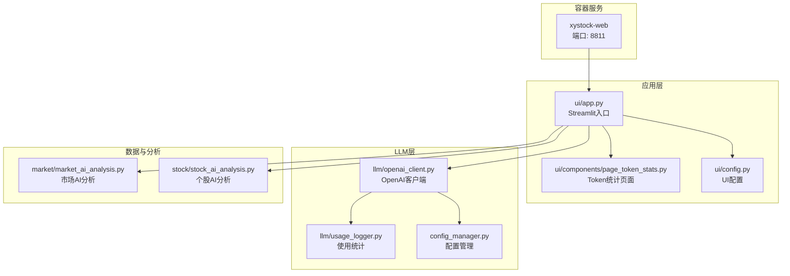
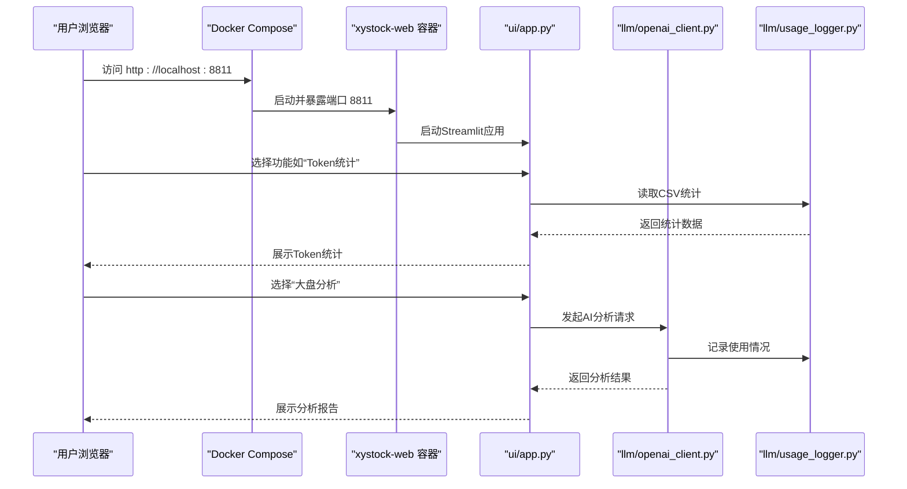
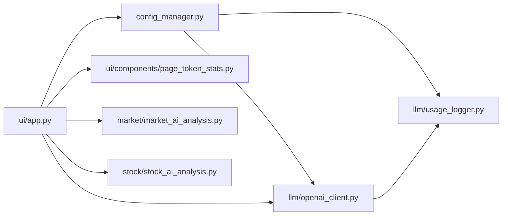

# 快速开始

<cite>
**本文引用的文件**
- [README.md](file://README.md)
- [docker-compose.yml](file://docker-compose.yml)
- [docker-compose.dev.yml](file://docker-compose.dev.yml)
- [config_default.toml](file://config_default.toml)
- [config_manager.py](file://config_manager.py)
- [llm/openai_client.py](file://llm/openai_client.py)
- [llm/usage_logger.py](file://llm/usage_logger.py)
- [ui/app.py](file://ui/app.py)
- [ui/components/page_token_stats.py](file://ui/components/page_token_stats.py)
- [ui/config.py](file://ui/config.py)
- [ui/start_ui.sh](file://ui/start_ui.sh)
- [requirements.txt](file://requirements.txt)
</cite>

## 目录
1. [简介](#简介)
2. [项目结构](#项目结构)
3. [核心组件](#核心组件)
4. [架构总览](#架构总览)
5. [详细组件分析](#详细组件分析)
6. [依赖关系分析](#依赖关系分析)
7. [性能注意事项](#性能注意事项)
8. [故障排查指南](#故障排查指南)
9. [结论](#结论)
10. [附录](#附录)

## 简介
本指南面向首次使用者，带你从零开始完成部署与首次运行，涵盖两种部署方式：
- 生产模式：使用预构建镜像，一键启动
- 开发模式：基于源码的容器开发环境，便于调试与二次开发

同时，你将学会：
- 配置LLM API密钥与基础URL
- 理解关键配置项（如API_KEY、BASE_URL、DEFAULT_MODEL）
- 通过Token统计页面验证LLM连接
- 按推荐顺序完成首个分析任务（先看Token统计，再进行大盘分析，最后进行个股分析）

## 项目结构
该仓库采用模块化组织，核心模块包括：
- UI层：Streamlit前端应用，负责交互与展示
- LLM层：OpenAI兼容客户端与使用统计
- 市场与个股分析：数据采集、格式化与AI分析
- 配置与缓存：配置管理、缓存与日志
- Docker与脚本：容器编排与启动脚本

图表来源
- [docker-compose.yml](file://docker-compose.yml#L1-L38)
- [ui/app.py](file://ui/app.py#L1-L229)
- [ui/components/page_token_stats.py](file://ui/components/page_token_stats.py#L1-L189)
- [ui/config.py](file://ui/config.py#L1-L82)
- [llm/openai_client.py](file://llm/openai_client.py#L1-L297)
- [llm/usage_logger.py](file://llm/usage_logger.py#L1-L204)
- [config_manager.py](file://config_manager.py#L1-L144)
- [market/market_ai_analysis.py](file://market/market_ai_analysis.py#L1-L123)
- [stock/stock_ai_analysis.py](file://stock/stock_ai_analysis.py#L1-L200)

章节来源
- [README.md](file://README.md#L46-L101)
- [docker-compose.yml](file://docker-compose.yml#L1-L38)
- [ui/app.py](file://ui/app.py#L1-L229)

## 核心组件
- 配置管理：集中管理LLM、日志、缓存、市场与用户画像等配置，支持默认值与环境变量回退
- OpenAI客户端：封装API调用、重试、超时、JSON模式、使用统计记录
- 使用统计：CSV记录每次调用的输入输出、Token用量、响应时间、成本估算
- UI应用：Streamlit页面导航，包含大盘分析、个股分析、缓存管理、Token统计、设置
- Token统计页面：展示总请求数、总Token数、平均响应时间、成功率、模型使用分布与详细日志

章节来源
- [config_manager.py](file://config_manager.py#L1-L144)
- [llm/openai_client.py](file://llm/openai_client.py#L1-L297)
- [llm/usage_logger.py](file://llm/usage_logger.py#L1-L204)
- [ui/app.py](file://ui/app.py#L1-L229)
- [ui/components/page_token_stats.py](file://ui/components/page_token_stats.py#L1-L189)

## 架构总览
生产模式与开发模式均通过Docker Compose启动，容器内运行Streamlit应用，UI通过8811端口对外提供服务。LLM调用由OpenAI客户端发起，使用统计写入CSV文件，UI页面读取CSV进行展示。

图表来源
- [docker-compose.yml](file://docker-compose.yml#L1-L38)
- [ui/app.py](file://ui/app.py#L1-L229)
- [llm/openai_client.py](file://llm/openai_client.py#L1-L297)
- [llm/usage_logger.py](file://llm/usage_logger.py#L1-L204)

## 详细组件分析

### 部署方式与命令说明
- 生产模式（推荐）
  - 拉取镜像（可选，compose up会自动拉取）
  - 启动服务（后台运行）
  - 访问 http://localhost:8811
- 开发模式
  - 启动开发容器
  - 进入容器后手动启动Streamlit应用
  - 访问 http://localhost:8811

命令与作用说明
- docker compose up -d：启动并以后台方式运行容器，将容器内的8811端口映射到宿主机8811端口
- docker compose -f docker-compose.dev.yml up -d：启动开发模式容器，容器内保持交互式bash，便于进入容器调试
- docker exec -it xystock-web bash：进入已运行的容器，执行后续命令
- python -m streamlit run ui/app.py --server.address=0.0.0.0 --server.port=8811：在容器内启动Streamlit应用，监听0.0.0.0:8811

章节来源
- [README.md](file://README.md#L55-L91)
- [docker-compose.yml](file://docker-compose.yml#L1-L38)
- [docker-compose.dev.yml](file://docker-compose.dev.yml#L1-L37)
- [ui/start_ui.sh](file://ui/start_ui.sh#L1-L16)

### 首次使用配置步骤
- 设置LLM API密钥与基础URL
  - 在配置文件中设置API_KEY与BASE_URL
  - 若使用兼容OpenAI接口的服务（如DeepSeek），BASE_URL通常为服务提供商提供的Base URL
- 修改关键配置项
  - DEFAULT_MODEL：默认分析模型
  - INFERENCE_MODEL：推理模型
  - DEFAULT_TEMPERATURE：默认温度
  - LLM_LOGGING.USAGE_LOG_FILE：使用统计CSV文件路径
  - LLM_LOGGING.ENABLE_LOGGING：是否启用使用统计
  - LLM_CACHE.ENABLE_CACHE：是否启用缓存
  - MARKET.ENABLE_NEWS：是否启用市场新闻功能
  - USER_PROFILE.RAW：用户画像描述
  - USER_PROFILE.MISTAKES：用户常犯错误列表
- 配置文件位置与加载顺序
  - 优先加载用户自定义配置文件（config.toml），若不存在则使用默认配置（config_default.toml）
  - 配置项可通过环境变量回退（例如OPENAI_API_KEY）

章节来源
- [config_default.toml](file://config_default.toml#L1-L64)
- [config_manager.py](file://config_manager.py#L1-L144)
- [llm/openai_client.py](file://llm/openai_client.py#L1-L297)

### 配置验证与Token统计
- 打开“Token统计”页面，查看总请求数、总Token数、平均响应时间、成功率
- 若统计正常增长，说明LLM连接成功
- 详细记录中可查看每次调用的模型、输入输出、成本估算与错误信息

章节来源
- [ui/components/page_token_stats.py](file://ui/components/page_token_stats.py#L1-L189)
- [llm/usage_logger.py](file://llm/usage_logger.py#L1-L204)

### 推荐使用顺序与首个分析任务
- 推荐顺序
  1) Token统计：确认LLM可用与成本控制
  2) 大盘分析：获取市场整体趋势与情绪
  3) 个股分析：基于大盘背景进行个股深度分析
- 首个分析任务示例
  - 大盘分析：选择“上证指数”，查看AI综合分析报告
  - 个股分析：输入“贵州茅台”或其代码，勾选“AI智能分析”，查看技术面、新闻、筹码、基本面等多维度报告

章节来源
- [README.md](file://README.md#L93-L101)
- [ui/app.py](file://ui/app.py#L1-L229)
- [ui/config.py](file://ui/config.py#L1-L82)
- [market/market_ai_analysis.py](file://market/market_ai_analysis.py#L1-L123)
- [stock/stock_ai_analysis.py](file://stock/stock_ai_analysis.py#L1-L200)

## 依赖关系分析
- UI应用依赖配置管理器读取LLM与市场配置
- OpenAI客户端依赖配置管理器与使用统计器
- Token统计页面依赖使用统计器读取CSV
- 市场与个股分析模块依赖OpenAI客户端与格式化器

图表来源
- [config_manager.py](file://config_manager.py#L1-L144)
- [llm/openai_client.py](file://llm/openai_client.py#L1-L297)
- [llm/usage_logger.py](file://llm/usage_logger.py#L1-L204)
- [ui/app.py](file://ui/app.py#L1-L229)
- [ui/components/page_token_stats.py](file://ui/components/page_token_stats.py#L1-L189)
- [market/market_ai_analysis.py](file://market/market_ai_analysis.py#L1-L123)
- [stock/stock_ai_analysis.py](file://stock/stock_ai_analysis.py#L1-L200)

## 性能注意事项
- 合理设置DEFAULT_TEMPERATURE与模型类型，平衡准确性与响应速度
- 启用缓存（LLM_CACHE.ENABLE_CACHE）可显著减少重复请求与LLM调用
- 控制请求超时（TIMEOUT）与最大重试次数（MAX_RETRIES），避免长时间阻塞
- 使用Token统计监控成本，及时调整模型与温度参数

章节来源
- [config_default.toml](file://config_default.toml#L1-L64)
- [config_manager.py](file://config_manager.py#L1-L144)
- [llm/openai_client.py](file://llm/openai_client.py#L1-L297)

## 故障排查指南
- Docker服务未启动
  - 检查Docker守护进程状态，确保Docker已安装并运行
  - 查看容器健康检查与日志，确认端口映射正确
- 端口冲突
  - 若8811被占用，可在docker-compose.yml中修改端口映射
- API密钥无效
  - 确认API_KEY已正确设置，BASE_URL指向正确的服务提供商
  - 在Token统计页面查看错误记录，定位具体失败原因
- 配置文件加载失败
  - 确认config.toml存在且格式正确，或使用默认配置文件
  - 检查环境变量OPENAI_API_KEY是否设置

章节来源
- [docker-compose.yml](file://docker-compose.yml#L1-L38)
- [llm/openai_client.py](file://llm/openai_client.py#L1-L297)
- [llm/usage_logger.py](file://llm/usage_logger.py#L1-L204)
- [config_manager.py](file://config_manager.py#L1-L144)

## 结论
通过本指南，你可以快速完成从零到首次运行的全流程：选择部署方式、配置LLM参数、验证连接、按推荐顺序完成首个分析任务。建议优先使用生产模式快速体验，开发模式适合需要调试与扩展的场景。

## 附录
- 常用命令清单
  - 生产模式：docker pull 镜像（可选）；docker compose up -d
  - 开发模式：docker compose -f docker-compose.dev.yml up -d；docker exec -it xystock-web bash；python -m streamlit run ui/app.py --server.address=0.0.0.0 --server.port=8811
- 依赖库参考
  - Streamlit、FastAPI、OpenAI、LangChain、AkShare、Tushare、Backtrader等

章节来源
- [README.md](file://README.md#L55-L91)
- [requirements.txt](file://requirements.txt#L1-L182)