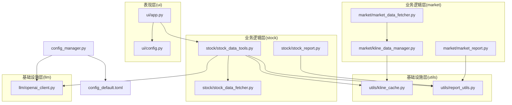
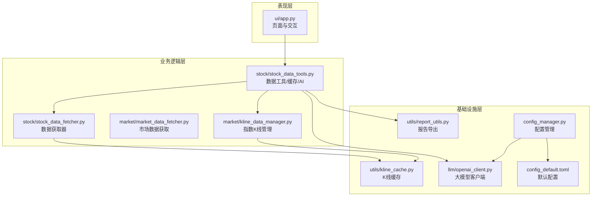
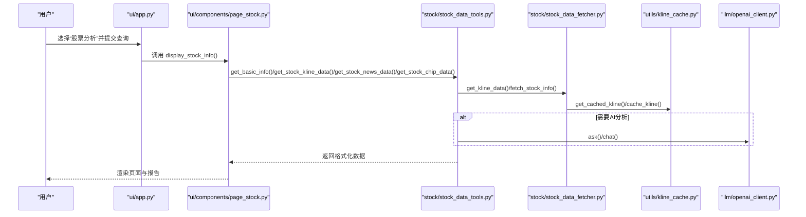
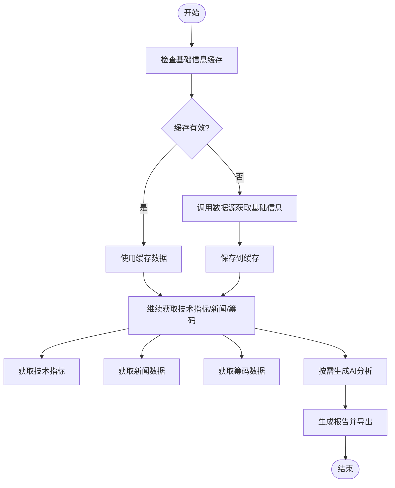
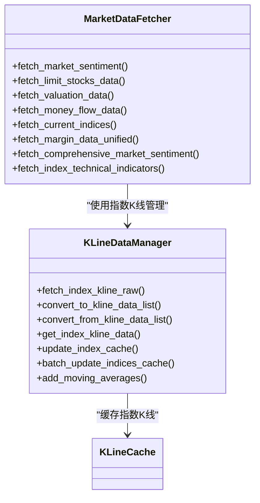
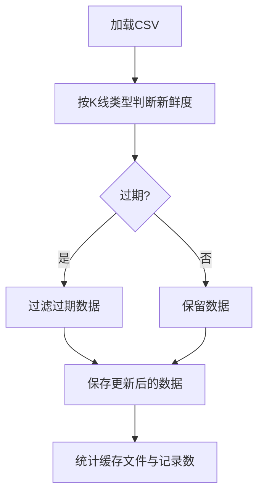
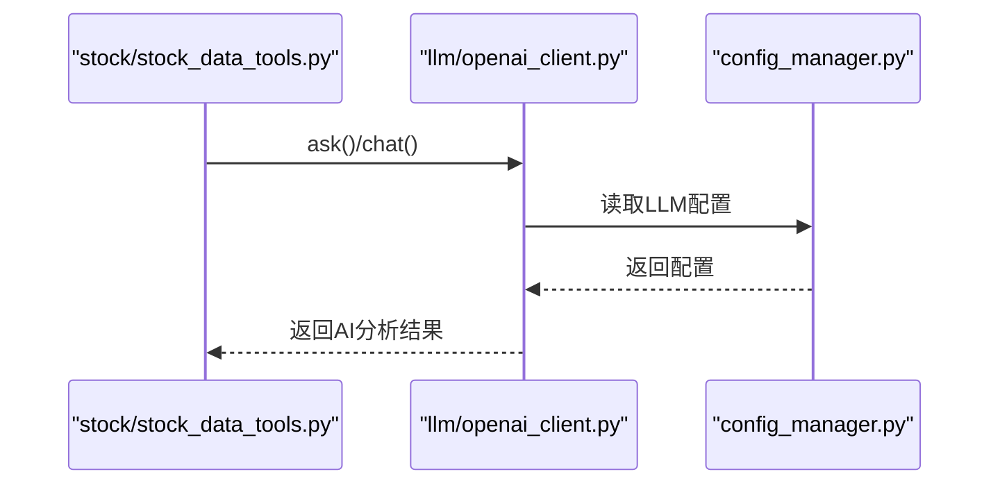
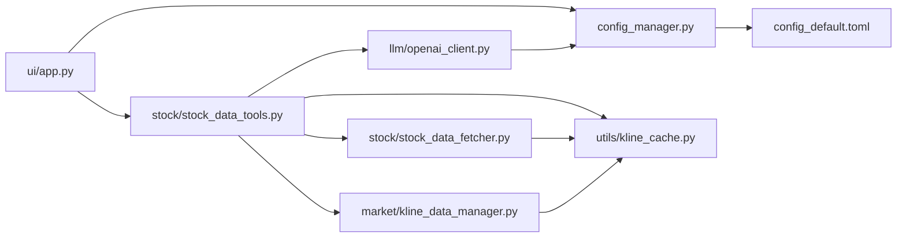

# 技术架构

<cite>
**本文引用的文件**
- [main.py](file://main.py)
- [ui/app.py](file://ui/app.py)
- [ui/config.py](file://ui/config.py)
- [config_manager.py](file://config_manager.py)
- [config_default.toml](file://config_default.toml)
- [utils/kline_cache.py](file://utils/kline_cache.py)
- [utils/report_utils.py](file://utils/report_utils.py)
- [stock/stock_data_fetcher.py](file://stock/stock_data_fetcher.py)
- [stock/stock_data_tools.py](file://stock/stock_data_tools.py)
- [stock/stock_report.py](file://stock/stock_report.py)
- [market/market_data_fetcher.py](file://market/market_data_fetcher.py)
- [market/kline_data_manager.py](file://market/kline_data_manager.py)
- [market/market_report.py](file://market/market_report.py)
- [llm/openai_client.py](file://llm/openai_client.py)
</cite>

## 目录
1. [简介](#简介)
2. [项目结构](#项目结构)
3. [核心组件](#核心组件)
4. [架构总览](#架构总览)
5. [详细组件分析](#详细组件分析)
6. [依赖关系分析](#依赖关系分析)
7. [性能考量](#性能考量)
8. [故障排查指南](#故障排查指南)
9. [结论](#结论)
10. [附录](#附录)

## 简介
本架构文档面向 xystock 项目，系统性梳理其分层软件架构与数据流。系统分为三层：
- 表现层（ui 模块，基于 Streamlit）
- 业务逻辑层（market 与 stock 模块）
- 基础设施层（utils 与 llm 模块）

数据流从 ui/app.py 主控制器接收用户请求，经由配置管理器加载配置，触发数据获取（fetcher）、缓存检查、AI 分析，并最终将格式化后的结果返回前端。模块间依赖清晰，ui 模块通过工具层调用后端模块，缓存与配置贯穿各层以提升性能与可维护性。

## 项目结构
项目采用按功能域分层的组织方式：
- ui：前端入口与页面组件，负责用户交互与展示
- stock：股票数据获取、缓存、分析与报告
- market：市场数据获取、缓存、分析与报告
- utils：通用工具（缓存、格式化、报告导出、风险指标等）
- llm：大模型客户端与用量记录
- 根目录：配置管理、默认配置、入口脚本

图表来源
- [ui/app.py](file://ui/app.py#L1-L229)
- [ui/config.py](file://ui/config.py#L1-L82)
- [stock/stock_data_tools.py](file://stock/stock_data_tools.py#L1-L709)
- [stock/stock_data_fetcher.py](file://stock/stock_data_fetcher.py#L1-L546)
- [stock/stock_report.py](file://stock/stock_report.py#L1-L311)
- [market/market_data_fetcher.py](file://market/market_data_fetcher.py#L1-L607)
- [market/kline_data_manager.py](file://market/kline_data_manager.py#L1-L330)
- [market/market_report.py](file://market/market_report.py#L1-L114)
- [utils/kline_cache.py](file://utils/kline_cache.py#L1-L477)
- [utils/report_utils.py](file://utils/report_utils.py#L1-L330)
- [llm/openai_client.py](file://llm/openai_client.py#L1-L297)
- [config_manager.py](file://config_manager.py#L1-L144)
- [config_default.toml](file://config_default.toml#L1-L64)

章节来源
- [ui/app.py](file://ui/app.py#L1-L229)
- [stock/stock_data_tools.py](file://stock/stock_data_tools.py#L1-L709)
- [market/kline_data_manager.py](file://market/kline_data_manager.py#L1-L330)
- [utils/kline_cache.py](file://utils/kline_cache.py#L1-L477)
- [llm/openai_client.py](file://llm/openai_client.py#L1-L297)
- [config_manager.py](file://config_manager.py#L1-L144)

## 核心组件
- ui/app.py：Streamlit 主入口，负责路由、表单与页面渲染，协调各页面组件
- stock/stock_data_tools.py：统一的股票数据工具，封装缓存、AI 分析与数据组装
- stock/stock_data_fetcher.py：股票数据获取器，对接 efinance，集成 K 线缓存
- market/market_data_fetcher.py：市场数据获取器，整合指数、估值、资金流、情绪等
- market/kline_data_manager.py：指数 K 线统一管理器，负责获取、转换、缓存与增量更新
- utils/kline_cache.py：K 线 CSV 缓存，支持智能新鲜度判断与增量更新
- utils/report_utils.py：报告导出工具，支持 PDF/DOCX/HTML/Mardown
- llm/openai_client.py：大模型客户端，统一配置、超时、重试、用量记录
- config_manager.py：配置管理器，支持 TOML 加载、默认回退、动态读写

章节来源
- [ui/app.py](file://ui/app.py#L1-L229)
- [stock/stock_data_tools.py](file://stock/stock_data_tools.py#L1-L709)
- [stock/stock_data_fetcher.py](file://stock/stock_data_fetcher.py#L1-L546)
- [market/market_data_fetcher.py](file://market/market_data_fetcher.py#L1-L607)
- [market/kline_data_manager.py](file://market/kline_data_manager.py#L1-L330)
- [utils/kline_cache.py](file://utils/kline_cache.py#L1-L477)
- [utils/report_utils.py](file://utils/report_utils.py#L1-L330)
- [llm/openai_client.py](file://llm/openai_client.py#L1-L297)
- [config_manager.py](file://config_manager.py#L1-L144)

## 架构总览
系统采用“表现层-业务层-基础设施层”的分层架构，ui 层通过工具层调用后端模块，配置与缓存贯穿各层，AI 分析通过 llm 模块统一接入。

图表来源
- [ui/app.py](file://ui/app.py#L1-L229)
- [stock/stock_data_tools.py](file://stock/stock_data_tools.py#L1-L709)
- [stock/stock_data_fetcher.py](file://stock/stock_data_fetcher.py#L1-L546)
- [market/market_data_fetcher.py](file://market/market_data_fetcher.py#L1-L607)
- [market/kline_data_manager.py](file://market/kline_data_manager.py#L1-L330)
- [utils/kline_cache.py](file://utils/kline_cache.py#L1-L477)
- [utils/report_utils.py](file://utils/report_utils.py#L1-L330)
- [llm/openai_client.py](file://llm/openai_client.py#L1-L297)
- [config_manager.py](file://config_manager.py#L1-L144)
- [config_default.toml](file://config_default.toml#L1-L64)

## 详细组件分析

### 表现层（ui）
- 主入口：ui/app.py 作为 Streamlit 应用入口，设置页面布局、侧边栏菜单与全局请求超时，根据用户选择进入不同页面
- 页面组件：通过 ui/components 下的页面模块（如 page_stock.py）实现具体功能页，调用工具层获取数据并渲染
- 配置：ui/config.py 提供市场类型、示例代码、关注指数与映射等 UI 相关配置

图表来源
- [ui/app.py](file://ui/app.py#L1-L229)
- [ui/components/page_stock.py](file://ui/components/page_stock.py#L1-L884)
- [stock/stock_data_tools.py](file://stock/stock_data_tools.py#L1-L709)
- [stock/stock_data_fetcher.py](file://stock/stock_data_fetcher.py#L1-L546)
- [utils/kline_cache.py](file://utils/kline_cache.py#L1-L477)
- [llm/openai_client.py](file://llm/openai_client.py#L1-L297)

章节来源
- [ui/app.py](file://ui/app.py#L1-L229)
- [ui/components/page_stock.py](file://ui/components/page_stock.py#L1-L884)
- [ui/config.py](file://ui/config.py#L1-L82)

### 业务逻辑层（stock）
- 数据工具：stock/stock_data_tools.py 统一封装缓存、技术指标、新闻、筹码与 AI 分析，支持按需生成报告
- 数据获取器：stock/stock_data_fetcher.py 基于 efinance 获取实时行情与 K 线，结合 utils/kline_cache.py 实现智能缓存
- 报告生成：stock/stock_report.py 将收集的数据与 AI 报告整合为 Markdown，并通过 utils/report_utils.py 导出为 PDF/DOCX/HTML/Mardown

图表来源
- [stock/stock_data_tools.py](file://stock/stock_data_tools.py#L1-L709)
- [stock/stock_data_fetcher.py](file://stock/stock_data_fetcher.py#L1-L546)
- [utils/kline_cache.py](file://utils/kline_cache.py#L1-L477)
- [utils/report_utils.py](file://utils/report_utils.py#L1-L330)
- [stock/stock_report.py](file://stock/stock_report.py#L1-L311)

章节来源
- [stock/stock_data_tools.py](file://stock/stock_data_tools.py#L1-L709)
- [stock/stock_data_fetcher.py](file://stock/stock_data_fetcher.py#L1-L546)
- [stock/stock_report.py](file://stock/stock_report.py#L1-L311)

### 业务逻辑层（market）
- 市场数据获取：market/market_data_fetcher.py 提供市场情绪、涨跌停、估值、资金流、融资融券等多维数据
- 指数 K 线管理：market/kline_data_manager.py 统一指数 K 线的获取、转换、缓存与批量更新
- 报告生成：market/market_report.py 将市场综合数据与 AI 分析整合为报告

图表来源
- [market/market_data_fetcher.py](file://market/market_data_fetcher.py#L1-L607)
- [market/kline_data_manager.py](file://market/kline_data_manager.py#L1-L330)
- [utils/kline_cache.py](file://utils/kline_cache.py#L1-L477)

章节来源
- [market/market_data_fetcher.py](file://market/market_data_fetcher.py#L1-L607)
- [market/kline_data_manager.py](file://market/kline_data_manager.py#L1-L330)

### 基础设施层（utils）
- K 线缓存：utils/kline_cache.py 提供 CSV 文件存储，按周期类型与新鲜度策略智能判断与更新，支持指数与股票两类数据
- 报告导出：utils/report_utils.py 提供 PDF/DOCX/HTML/Mardown 导出能力，内置 Pandoc/WeasyPrint 检测与降级策略

图表来源
- [utils/kline_cache.py](file://utils/kline_cache.py#L1-L477)
- [utils/report_utils.py](file://utils/report_utils.py#L1-L330)

章节来源
- [utils/kline_cache.py](file://utils/kline_cache.py#L1-L477)
- [utils/report_utils.py](file://utils/report_utils.py#L1-L330)

### 基础设施层（llm）
- OpenAI 客户端：llm/openai_client.py 统一配置加载、超时与重试、JSON 模式、用量记录与统计导出
- 配置来源：config_manager.py 与 config_default.toml 提供 LLM 相关参数（API Key、Base URL、超时、重试、模型、温度等）

图表来源
- [llm/openai_client.py](file://llm/openai_client.py#L1-L297)
- [config_manager.py](file://config_manager.py#L1-L144)
- [config_default.toml](file://config_default.toml#L1-L64)

章节来源
- [llm/openai_client.py](file://llm/openai_client.py#L1-L297)
- [config_manager.py](file://config_manager.py#L1-L144)
- [config_default.toml](file://config_default.toml#L1-L64)

## 依赖关系分析
- ui/app.py 依赖 ui/config.py 与各页面组件，间接依赖工具层与后端模块
- stock/stock_data_tools.py 依赖 stock/stock_data_fetcher.py、utils/kline_cache.py、llm/openai_client.py、utils/report_utils.py
- market/market_data_fetcher.py 依赖 market/kline_data_manager.py 与 utils/kline_cache.py
- utils/kline_cache.py 为 stock 与 market 的共同依赖
- llm/openai_client.py 依赖 config_manager.py 与 config_default.toml
- config_manager.py 依赖 toml 解析与环境变量，提供全局配置实例

图表来源
- [ui/app.py](file://ui/app.py#L1-L229)
- [stock/stock_data_tools.py](file://stock/stock_data_tools.py#L1-L709)
- [stock/stock_data_fetcher.py](file://stock/stock_data_fetcher.py#L1-L546)
- [market/kline_data_manager.py](file://market/kline_data_manager.py#L1-L330)
- [utils/kline_cache.py](file://utils/kline_cache.py#L1-L477)
- [llm/openai_client.py](file://llm/openai_client.py#L1-L297)
- [config_manager.py](file://config_manager.py#L1-L144)
- [config_default.toml](file://config_default.toml#L1-L64)

章节来源
- [ui/app.py](file://ui/app.py#L1-L229)
- [stock/stock_data_tools.py](file://stock/stock_data_tools.py#L1-L709)
- [market/kline_data_manager.py](file://market/kline_data_manager.py#L1-L330)
- [utils/kline_cache.py](file://utils/kline_cache.py#L1-L477)
- [llm/openai_client.py](file://llm/openai_client.py#L1-L297)
- [config_manager.py](file://config_manager.py#L1-L144)

## 性能考量
- 缓存策略
  - K 线缓存：utils/kline_cache.py 对日线与分钟线采用不同的新鲜度阈值，历史数据永久保存，当日/当前数据按周期设定过期窗口，减少重复拉取与外部 API 调用
  - 指数缓存：market/kline_data_manager.py 在获取指数 K 线时优先命中缓存，必要时智能合并增量更新
  - 基础信息与新闻/筹码等数据缓存：stock/stock_data_tools.py 通过统一缓存管理器控制过期时间与动态 TTL
- 配置驱动
  - config_manager.py 与 config_default.toml 提供统一配置入口，支持超时、重试、模型与温度等参数，便于在不同环境调整性能与成本
- 导出性能
  - utils/report_utils.py 通过 Pandoc/WeasyPrint 生成报告，具备降级策略，避免因环境差异导致失败

章节来源
- [utils/kline_cache.py](file://utils/kline_cache.py#L1-L477)
- [market/kline_data_manager.py](file://market/kline_data_manager.py#L1-L330)
- [stock/stock_data_tools.py](file://stock/stock_data_tools.py#L1-L709)
- [config_manager.py](file://config_manager.py#L1-L144)
- [config_default.toml](file://config_default.toml#L1-L64)
- [utils/report_utils.py](file://utils/report_utils.py#L1-L330)

## 故障排查指南
- 配置问题
  - 检查 config_default.toml 中 LLM 配置项是否正确，确认 OPENAI_API_KEY 等环境变量是否设置
  - 使用 config_manager.reload() 重新加载配置
- 缓存问题
  - 使用 utils/kline_cache.py 的清理与统计接口，检查缓存文件是否存在、记录数是否异常
  - 通过 stock/stock_data_tools.py 的缓存状态打印与清理方法定位问题
- 导出失败
  - utils/report_utils.py 对 Pandoc/WeasyPrint 进行可用性检测，若失败，检查依赖安装与系统权限
- 数据获取失败
  - stock/stock_data_fetcher.py 对 efinance 初始化与数据源可用性进行检查，出现异常时查看重试与回退逻辑

章节来源
- [config_manager.py](file://config_manager.py#L1-L144)
- [utils/kline_cache.py](file://utils/kline_cache.py#L1-L477)
- [stock/stock_data_tools.py](file://stock/stock_data_tools.py#L1-L709)
- [utils/report_utils.py](file://utils/report_utils.py#L1-L330)
- [stock/stock_data_fetcher.py](file://stock/stock_data_fetcher.py#L1-L546)

## 结论
xystock 采用清晰的分层架构与模块化设计，ui 层专注交互，业务层聚焦数据获取与分析，基础设施层提供缓存与 AI 能力。通过统一的配置与缓存策略，系统在保证功能完整性的同时兼顾性能与成本控制。建议持续完善缓存清理与监控、扩展更多市场与股票数据源，并加强错误日志与可观测性。

## 附录
- 入口与演示
  - main.py 作为主入口文件，用于串联数据获取与大模型分析流程
- UI 配置
  - ui/config.py 提供市场类型、示例代码、关注指数与映射等 UI 相关配置

章节来源
- [main.py](file://main.py#L1-L6)
- [ui/config.py](file://ui/config.py#L1-L82)