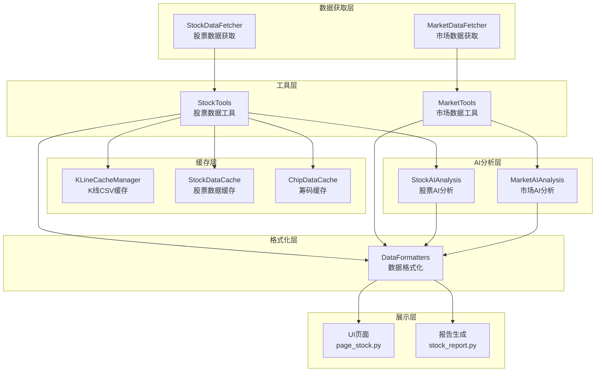
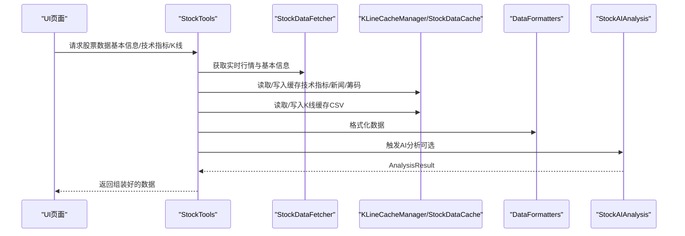
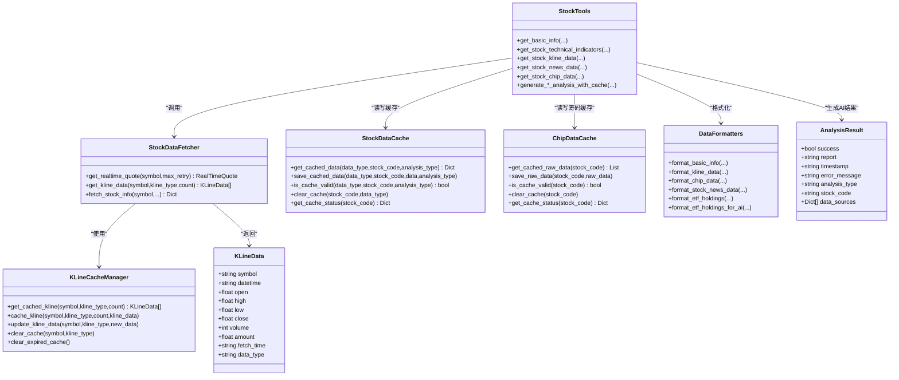

# 数据模型

<cite>
**本文引用的文件**
- [utils/kline_cache.py](file://utils/kline_cache.py)
- [stock/stock_data_fetcher.py](file://stock/stock_data_fetcher.py)
- [stock/stock_data_tools.py](file://stock/stock_data_tools.py)
- [stock/stock_data_cache.py](file://stock/stock_data_cache.py)
- [stock/chip_data_cache.py](file://stock/chip_data_cache.py)
- [utils/data_formatters.py](file://utils/data_formatters.py)
- [stock/stock_ai_analysis.py](file://stock/stock_ai_analysis.py)
- [market/market_data_fetcher.py](file://market/market_data_fetcher.py)
- [market/market_ai_analysis.py](file://market/market_ai_analysis.py)
- [ui/components/page_stock.py](file://ui/components/page_stock.py)
- [stock/stock_report.py](file://stock/stock_report.py)
</cite>

## 目录
1. [简介](#简介)
2. [项目结构](#项目结构)
3. [核心数据实体与字段定义](#核心数据实体与字段定义)
4. [架构总览](#架构总览)
5. [详细组件分析](#详细组件分析)
6. [依赖关系分析](#依赖关系分析)
7. [性能与缓存特性](#性能与缓存特性)
8. [故障排查指南](#故障排查指南)
9. [结论](#结论)
10. [附录：数据流与契约](#附录数据流与契约)

## 简介
本文件面向xystock项目，系统梳理核心数据模型与数据流转，覆盖以下关键实体：
- 股票数据（StockData）
- K线数据（KLineData）
- 基本面数据（FundamentalData）
- 筹码数据（ChipData）
- AI分析结果（AnalysisResult）

并说明从外部数据源（如akshare、tushare、efinance）到内部表示的转换过程，AI分析结果的结构设计，以及缓存机制（包括kline_data_cache.py、chip_data_cache.py）的存储格式与生命周期管理。同时结合data_formatters.py说明数据标准化与格式化流程，并提供模块间数据传递的契约与兼容性保障。

## 项目结构
围绕数据模型与数据流，项目采用“数据获取层-工具层-格式化层-缓存层-AI分析层-UI展示层”的分层组织：
- 数据获取层：stock_data_fetcher.py、market/market_data_fetcher.py
- 工具层：stock/stock_data_tools.py、market/market_data_tools.py
- 格式化层：utils/data_formatters.py
- 缓存层：utils/kline_cache.py、stock/stock_data_cache.py、stock/chip_data_cache.py
- AI分析层：stock/stock_ai_analysis.py、market/market_ai_analysis.py
- 展示层：ui/components/page_stock.py、stock/stock_report.py

图表来源
- [stock/stock_data_fetcher.py](file://stock/stock_data_fetcher.py#L1-L120)
- [market/market_data_fetcher.py](file://market/market_data_fetcher.py#L1-L120)
- [stock/stock_data_tools.py](file://stock/stock_data_tools.py#L1-L120)
- [utils/data_formatters.py](file://utils/data_formatters.py#L1-L120)
- [utils/kline_cache.py](file://utils/kline_cache.py#L1-L120)
- [stock/stock_data_cache.py](file://stock/stock_data_cache.py#L1-L120)
- [stock/chip_data_cache.py](file://stock/chip_data_cache.py#L1-L120)
- [stock/stock_ai_analysis.py](file://stock/stock_ai_analysis.py#L1-L120)
- [market/market_ai_analysis.py](file://market/market_ai_analysis.py#L1-L120)
- [ui/components/page_stock.py](file://ui/components/page_stock.py#L380-L460)
- [stock/stock_report.py](file://stock/stock_report.py#L85-L120)

章节来源
- [stock/stock_data_fetcher.py](file://stock/stock_data_fetcher.py#L1-L120)
- [stock/stock_data_tools.py](file://stock/stock_data_tools.py#L1-L120)
- [utils/kline_cache.py](file://utils/kline_cache.py#L1-L120)
- [stock/stock_data_cache.py](file://stock/stock_data_cache.py#L1-L120)
- [stock/chip_data_cache.py](file://stock/chip_data_cache.py#L1-L120)
- [utils/data_formatters.py](file://utils/data_formatters.py#L1-L120)
- [stock/stock_ai_analysis.py](file://stock/stock_ai_analysis.py#L1-L120)
- [market/market_data_fetcher.py](file://market/market_data_fetcher.py#L1-L120)
- [market/market_ai_analysis.py](file://market/market_ai_analysis.py#L1-L120)
- [ui/components/page_stock.py](file://ui/components/page_stock.py#L380-L460)
- [stock/stock_report.py](file://stock/stock_report.py#L85-L120)

## 核心数据实体与字段定义
本节按“StockData（股票数据）”、“KLineData（K线数据）”、“FundamentalData（基本面数据）”、“ChipData（筹码数据）”、“AnalysisResult（AI分析结果）”五个维度，说明字段定义、数据类型与业务含义。

- StockData（股票数据）
  - 字段与类型
    - 身份标识：stock_code（字符串）、stock_name（字符串）、market_name（字符串）
    - 实时行情：current_price（数值）、change（数值）、change_percent（数值）、volume（整数）、amount（数值）、high（数值）、low（数值）、open（数值）、prev_close（数值）、timestamp（字符串）
    - 更新时间：update_time（字符串）
    - 错误标识：error（可选，字符串）
  - 业务含义
    - 聚合实时行情与基本信息，用于UI展示与进一步分析。
  - 来源与转换
    - 由StockDataFetcher获取实时行情与基本信息，再经StockTools统一组装。
  - 章节来源
    - [stock/stock_data_fetcher.py](file://stock/stock_data_fetcher.py#L13-L28)
    - [stock/stock_data_fetcher.py](file://stock/stock_data_fetcher.py#L150-L220)
    - [stock/stock_utils.py](file://stock/stock_utils.py#L155-L188)
    - [stock/stock_data_tools.py](file://stock/stock_data_tools.py#L41-L112)

- KLineData（K线数据）
  - 字段与类型
    - symbol（字符串）、datetime（字符串，格式含日期或日期时间）、open（数值）、high（数值）、low（数值）、close（数值）、volume（整数）、amount（可选数值）、fetch_time（可选字符串，默认当前时间）、data_type（字符串，"stock"或"index"）
  - 业务含义
    - 表示单根K线的OHLCV与时间戳，支持股票与指数两类数据类型。
  - 校验与约束
    - 高低值需分别不大于max(open,close)、不小于min(open,close)，否则抛出异常。
  - 章节来源
    - [utils/kline_cache.py](file://utils/kline_cache.py#L24-L45)
    - [utils/kline_cache.py](file://utils/kline_cache.py#L138-L183)
    - [utils/kline_cache.py](file://utils/kline_cache.py#L188-L233)
    - [utils/kline_cache.py](file://utils/kline_cache.py#L399-L418)

- FundamentalData（基本面数据）
  - 字段与类型
    - 股票代码/名称：stock_code（字符串）、stock_name（字符串）
    - 财务指标：净利润（字符串/数值）、总市值（数值）、流通市值（数值）、所处行业（字符串）、市盈率（字符串/数值）、市净率（字符串/数值）、板块编号（字符串）
    - 盈利能力：净资产收益率(ROE)、总资产报酬率(ROA)、毛利率、销售净利率、营业利润率（字符串/数值）
    - 偿债能力：资产负债率（字符串/数值）、流动比率、速动比率、现金比率、权益乘数（数值）
    - 营运能力：总资产周转率、应收账款周转率、存货周转率、流动资产周转率（数值）
    - 成长能力：营业总收入增长率、归属母公司净利润增长率（数值）
    - 每股指标：基本每股收益、每股净资产、每股经营现金流、每股营业收入（数值）
    - 股息分红：最新分红公告日期（字符串）、最新分红类型（字符串）、最新送股比例（数值）、最新转增比例（数值）、最新派息比例（数值）、最新股权登记日（字符串）、最新除权日（字符串）、最新派息日（字符串）、最新分红说明（字符串）、近年平均派息比例（数值）、近年分红次数（数值）、近年分红详情（列表）
    - 更新时间：update_time（字符串）
    - 错误标识：error（可选，字符串）
  - 业务含义
    - 聚合财务与估值指标，支持AI基本面分析与ETF持仓分析。
  - 章节来源
    - [stock/stock_data_fetcher.py](file://stock/stock_data_fetcher.py#L225-L373)
    - [stock/stock_data_fetcher.py](file://stock/stock_data_fetcher.py#L457-L538)
    - [utils/data_formatters.py](file://utils/data_formatters.py#L204-L361)
    - [stock/stock_data_tools.py](file://stock/stock_data_tools.py#L41-L112)

- ChipData（筹码数据）
  - 字段与类型
    - 最新日期：latest_date（字符串）
    - 获利比例：profit_ratio（数值，0~1）
    - 平均成本：avg_cost（数值）
    - 90%筹码区间：cost_90_low（数值）、cost_90_high（数值）
    - 90%集中度：concentration_90（数值，0~1）
    - 70%筹码区间：cost_70_low（数值）、cost_70_high（数值）
    - 70%集中度：concentration_70（数值，0~1）
    - 分析指标：analysis（字典），包含获利状态、集中度状态、风险水平等
    - 技术参考位：support_level（数值）、resistance_level（数值）、cost_center（数值）
    - 更新时间：update_time（字符串）
    - 错误标识：error（可选，字符串）
  - 业务含义
    - 描述筹码分布与主力成本区间，用于AI筹码分析。
  - 章节来源
    - [utils/data_formatters.py](file://utils/data_formatters.py#L411-L466)
    - [stock/stock_data_cache.py](file://stock/stock_data_cache.py#L19-L35)
    - [stock/chip_data_cache.py](file://stock/chip_data_cache.py#L11-L22)

- AnalysisResult（AI分析结果）
  - 字段与类型
    - success（布尔）：是否成功生成
    - report（字符串）：分析报告正文
    - timestamp（字符串）：生成时间
    - error_message（可选字符串）：错误信息
    - analysis_type（字符串）：分析类型（如technical、fundamental、news、chip、company、comprehensive）
    - stock_code（字符串）：关联股票代码
    - data_sources（可选列表）：数据来源清单
  - 业务含义
    - 统一承载AI分析结果，便于缓存、展示与报告生成。
  - 章节来源
    - [stock/stock_ai_analysis.py](file://stock/stock_ai_analysis.py#L22-L33)
    - [stock/stock_ai_analysis.py](file://stock/stock_ai_analysis.py#L303-L346)
    - [stock/stock_data_tools.py](file://stock/stock_data_tools.py#L301-L312)

## 架构总览
数据从外部数据源到内部表示的转换链路如下：
- 外部数据源（akshare、tushare、efinance）通过StockDataFetcher与MarketDataFetcher抓取
- StockTools/MartketTools统一组装与缓存
- KLineCacheManager负责K线数据的CSV持久化与新鲜度判定
- StockDataCache/ChipDataCache分别管理股票数据与筹码数据的JSON缓存
- DataFormatters负责数据标准化与格式化
- StockAIAnalysis/MarketAIAnalysis生成AnalysisResult
- UI与报告模块消费数据并展示

图表来源
- [stock/stock_data_tools.py](file://stock/stock_data_tools.py#L114-L190)
- [stock/stock_data_fetcher.py](file://stock/stock_data_fetcher.py#L97-L160)
- [utils/kline_cache.py](file://utils/kline_cache.py#L138-L183)
- [stock/stock_data_cache.py](file://stock/stock_data_cache.py#L106-L178)
- [utils/data_formatters.py](file://utils/data_formatters.py#L363-L410)
- [stock/stock_ai_analysis.py](file://stock/stock_ai_analysis.py#L310-L346)

## 详细组件分析

### K线数据模型与缓存
- KLineData字段与校验
  - 字段：symbol、datetime、open、high、low、close、volume、amount、fetch_time、data_type
  - 校验：高低值与开盘收盘价关系，构造时自动补全fetch_time
- K线缓存策略
  - 历史数据永久保存，近期数据按K线类型设定过期阈值
  - 支持增量更新与缺失范围分析
- 章节来源
  - [utils/kline_cache.py](file://utils/kline_cache.py#L24-L45)
  - [utils/kline_cache.py](file://utils/kline_cache.py#L63-L112)
  - [utils/kline_cache.py](file://utils/kline_cache.py#L138-L183)
  - [utils/kline_cache.py](file://utils/kline_cache.py#L234-L279)
  - [utils/kline_cache.py](file://utils/kline_cache.py#L280-L330)
  - [utils/kline_cache.py](file://utils/kline_cache.py#L331-L362)
  - [utils/kline_cache.py](file://utils/kline_cache.py#L363-L398)
  - [utils/kline_cache.py](file://utils/kline_cache.py#L407-L418)

### 股票数据获取与转换
- RealTimeQuote与StockDataFetcher
  - RealTimeQuote：实时行情字段集合
  - StockDataFetcher：封装efinance/tushare/akshare等数据源，提供实时行情、K线、基本信息、财务指标、分红信息等获取与转换
- 章节来源
  - [stock/stock_data_fetcher.py](file://stock/stock_data_fetcher.py#L13-L28)
  - [stock/stock_data_fetcher.py](file://stock/stock_data_fetcher.py#L97-L160)
  - [stock/stock_data_fetcher.py](file://stock/stock_data_fetcher.py#L135-L224)
  - [stock/stock_data_fetcher.py](file://stock/stock_data_fetcher.py#L225-L373)
  - [stock/stock_data_fetcher.py](file://stock/stock_data_fetcher.py#L374-L410)

### 基本面数据模型与格式化
- FundamentalData字段覆盖财务、偿债、营运、成长、估值、每股指标与股息分红
- DataFormatters.format_basic_info将中文字段名与数值格式化为Markdown
- 章节来源
  - [stock/stock_data_fetcher.py](file://stock/stock_data_fetcher.py#L457-L538)
  - [utils/data_formatters.py](file://utils/data_formatters.py#L204-L361)

### 筹码数据模型与缓存
- ChipData字段：获利比例、平均成本、筹码区间与集中度、分析指标、技术参考位
- ChipDataCache：独立JSON缓存，24小时过期，支持加载/保存/清理/状态查询
- 章节来源
  - [utils/data_formatters.py](file://utils/data_formatters.py#L411-L466)
  - [stock/chip_data_cache.py](file://stock/chip_data_cache.py#L11-L22)
  - [stock/chip_data_cache.py](file://stock/chip_data_cache.py#L49-L115)
  - [stock/chip_data_cache.py](file://stock/chip_data_cache.py#L116-L171)
  - [stock/chip_data_cache.py](file://stock/chip_data_cache.py#L172-L205)

### AI分析结果模型
- AnalysisResult：统一承载AI分析结果，包含success、report、timestamp、analysis_type、stock_code、data_sources等
- StockAIAnalysis：生成技术、基本面、新闻、筹码、公司、综合分析报告，返回AnalysisResult
- 章节来源
  - [stock/stock_ai_analysis.py](file://stock/stock_ai_analysis.py#L22-L33)
  - [stock/stock_ai_analysis.py](file://stock/stock_ai_analysis.py#L310-L346)
  - [stock/stock_ai_analysis.py](file://stock/stock_ai_analysis.py#L352-L402)
  - [stock/stock_ai_analysis.py](file://stock/stock_ai_analysis.py#L404-L496)
  - [stock/stock_ai_analysis.py](file://stock/stock_ai_analysis.py#L498-L551)
  - [stock/stock_ai_analysis.py](file://stock/stock_ai_analysis.py#L552-L603)
  - [stock/stock_ai_analysis.py](file://stock/stock_ai_analysis.py#L605-L715)
  - [stock/stock_ai_analysis.py](file://stock/stock_ai_analysis.py#L717-L800)

### 数据标准化与格式化流程
- format_numeric_value：数值格式化（处理百分号、字符串数值、小数位）
- format_technical_indicators：技术指标Markdown格式化
- format_risk_metrics：风险指标Markdown格式化
- format_kline_data、format_chip_data、format_stock_news_data、format_etf_holdings、format_etf_holdings_for_ai：针对不同数据源的文本化
- 章节来源
  - [utils/data_formatters.py](file://utils/data_formatters.py#L14-L42)
  - [utils/data_formatters.py](file://utils/data_formatters.py#L44-L97)
  - [utils/data_formatters.py](file://utils/data_formatters.py#L99-L196)
  - [utils/data_formatters.py](file://utils/data_formatters.py#L363-L410)

### 市场数据与AI分析
- MarketDataFetcher：市场情绪、涨跌停、估值、资金流向、指数技术指标等
- MarketAIAnalysis：基于市场综合报告生成AI分析
- 章节来源
  - [market/market_data_fetcher.py](file://market/market_data_fetcher.py#L1-L120)
  - [market/market_data_fetcher.py](file://market/market_data_fetcher.py#L181-L246)
  - [market/market_data_fetcher.py](file://market/market_data_fetcher.py#L248-L356)
  - [market/market_data_fetcher.py](file://market/market_data_fetcher.py#L358-L450)
  - [market/market_data_fetcher.py](file://market/market_data_fetcher.py#L451-L462)
  - [market/market_data_fetcher.py](file://market/market_data_fetcher.py#L463-L566)
  - [market/market_data_fetcher.py](file://market/market_data_fetcher.py#L568-L607)
  - [market/market_ai_analysis.py](file://market/market_ai_analysis.py#L1-L123)

## 依赖关系分析
- 组件耦合
  - StockDataFetcher依赖KLineCacheManager与KLineData枚举
  - StockTools依赖StockDataFetcher、StockDataCache、ChipDataCache、DataFormatters、AI分析模块
  - DataFormatters依赖format_utils与StockDataFormatter
  - MarketDataFetcher依赖akshare与KLineCacheManager（指数K线）
- 外部依赖
  - akshare、tushare、efinance等第三方库
- 章节来源
  - [stock/stock_data_fetcher.py](file://stock/stock_data_fetcher.py#L1-L20)
  - [stock/stock_data_tools.py](file://stock/stock_data_tools.py#L1-L40)
  - [utils/data_formatters.py](file://utils/data_formatters.py#L1-L13)
  - [market/market_data_fetcher.py](file://market/market_data_fetcher.py#L1-L20)

图表来源
- [utils/kline_cache.py](file://utils/kline_cache.py#L24-L45)
- [utils/kline_cache.py](file://utils/kline_cache.py#L138-L183)
- [stock/stock_data_fetcher.py](file://stock/stock_data_fetcher.py#L97-L160)
- [stock/stock_data_tools.py](file://stock/stock_data_tools.py#L114-L190)
- [stock/stock_data_cache.py](file://stock/stock_data_cache.py#L106-L178)
- [stock/chip_data_cache.py](file://stock/chip_data_cache.py#L87-L115)
- [utils/data_formatters.py](file://utils/data_formatters.py#L363-L410)
- [stock/stock_ai_analysis.py](file://stock/stock_ai_analysis.py#L22-L33)

## 性能与缓存特性
- K线缓存（CSV）
  - 历史数据永久保存，近期数据按K线类型设定过期阈值，减少重复请求
  - 支持增量更新与缺失范围分析，提升数据完整性
- 股票数据缓存（JSON）
  - 针对不同数据类型设置差异化过期时间（如基本信息5分钟、技术指标30分钟、新闻60分钟、筹码1440分钟、AI分析按类型配置）
  - 支持按股票代码与数据类型清理，便于维护
- 筹码缓存（JSON）
  - 24小时过期，独立存储原始筹码数据，便于后续分析
- 章节来源
  - [utils/kline_cache.py](file://utils/kline_cache.py#L63-L112)
  - [stock/stock_data_cache.py](file://stock/stock_data_cache.py#L19-L35)
  - [stock/stock_data_cache.py](file://stock/stock_data_cache.py#L106-L178)
  - [stock/chip_data_cache.py](file://stock/chip_data_cache.py#L20-L22)

## 故障排查指南
- 数据获取异常
  - DataFetcherError、DataFetcherNotAvailableError、InvalidSymbolError等异常类型
  - 建议：检查数据源可用性、网络连接、符号格式
- K线数据不合理
  - KLineData校验失败会抛出异常，检查OHLC与datetime字段
- 缓存读写失败
  - JSON序列化失败（含numpy/pandas类型），使用_make_json_safe转换
  - CSV读写失败，检查文件权限与磁盘空间
- 章节来源
  - [stock/stock_data_fetcher.py](file://stock/stock_data_fetcher.py#L30-L44)
  - [utils/kline_cache.py](file://utils/kline_cache.py#L38-L44)
  - [stock/stock_data_cache.py](file://stock/stock_data_cache.py#L61-L86)
  - [stock/chip_data_cache.py](file://stock/chip_data_cache.py#L23-L48)

## 结论
xystock通过清晰的数据模型与分层架构，实现了从外部数据源到内部统一表示的高效转换，并以多种缓存策略平衡性能与一致性。AI分析结果以AnalysisResult统一承载，配合DataFormatters实现跨模块的标准化输出。建议在扩展新数据类型时遵循既有字段命名与缓存契约，确保兼容性与可维护性。

## 附录：数据流与契约
- 数据契约
  - 字段命名：优先使用中文字段名（如“总市值”、“ROE”、“资产负债率”等），便于格式化与展示
  - 可空性：amount、amount等字段允许为空；数值字段统一做安全转换
  - 时间戳：统一使用字符串格式，便于缓存与展示
- 数据传递
  - StockTools对外提供统一接口，内部通过缓存与格式化模块协作
  - AI分析结果通过AnalysisResult传递，包含analysis_type与data_sources，便于UI与报告模块消费
- 章节来源
  - [utils/data_formatters.py](file://utils/data_formatters.py#L204-L361)
  - [stock/stock_data_tools.py](file://stock/stock_data_tools.py#L114-L190)
  - [stock/stock_ai_analysis.py](file://stock/stock_ai_analysis.py#L310-L346)
  - [ui/components/page_stock.py](file://ui/components/page_stock.py#L399-L427)
  - [stock/stock_report.py](file://stock/stock_report.py#L151-L200)