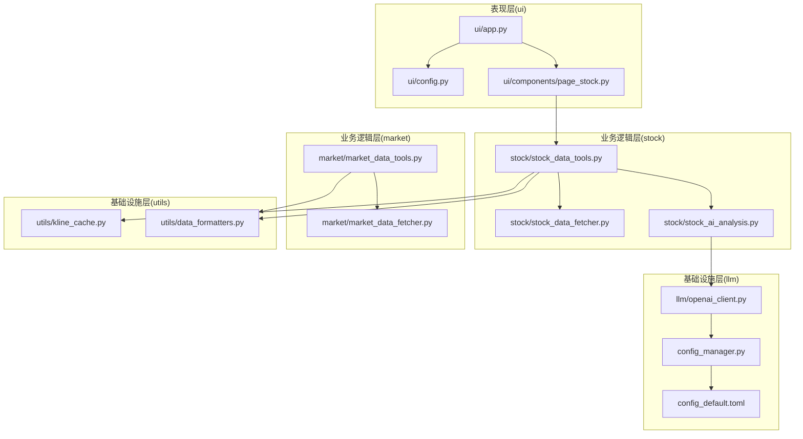
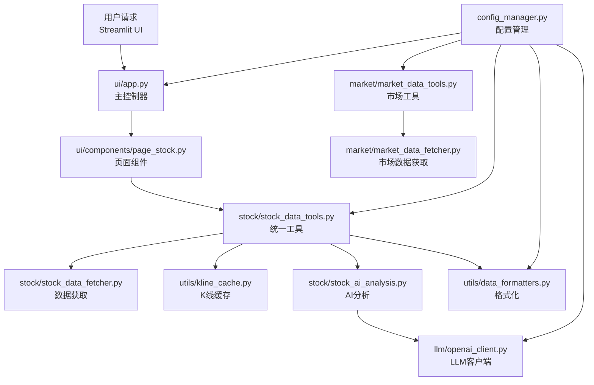
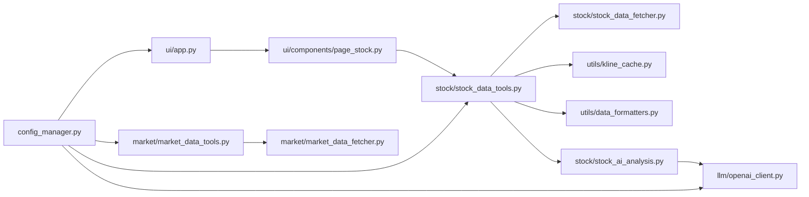
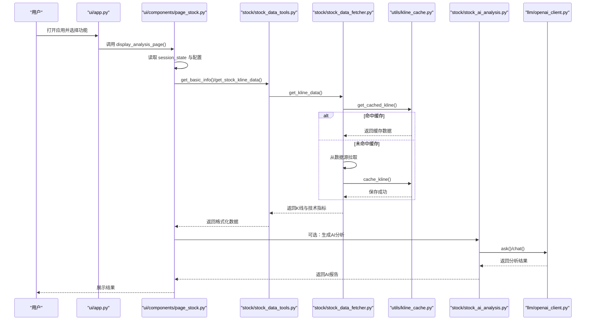

# 架构设计

<cite>
**本文引用的文件**
- [main.py](file://main.py)
- [ui/app.py](file://ui/app.py)
- [ui/config.py](file://ui/config.py)
- [config_manager.py](file://config_manager.py)
- [config_default.toml](file://config_default.toml)
- [utils/kline_cache.py](file://utils/kline_cache.py)
- [stock/stock_data_fetcher.py](file://stock/stock_data_fetcher.py)
- [stock/stock_data_tools.py](file://stock/stock_data_tools.py)
- [market/market_data_fetcher.py](file://market/market_data_fetcher.py)
- [market/market_data_tools.py](file://market/market_data_tools.py)
- [llm/openai_client.py](file://llm/openai_client.py)
- [stock/stock_ai_analysis.py](file://stock/stock_ai_analysis.py)
- [ui/components/page_stock.py](file://ui/components/page_stock.py)
- [utils/data_formatters.py](file://utils/data_formatters.py)
- [version.py](file://version.py)
</cite>

## 目录
1. [引言](#引言)
2. [项目结构](#项目结构)
3. [核心组件](#核心组件)
4. [架构总览](#架构总览)
5. [详细组件分析](#详细组件分析)
6. [依赖关系分析](#依赖关系分析)
7. [性能考量](#性能考量)
8. [故障排查指南](#故障排查指南)
9. [结论](#结论)
10. [附录](#附录)

## 引言
本架构文档面向开发者与维护者，系统性梳理 xystock 的分层软件架构，明确表现层（ui 模块，基于 Streamlit）、业务逻辑层（market 和 stock 模块）、基础设施层（utils 和 llm 模块）的职责边界与协作关系。文档重点阐述数据流：从用户请求进入 ui/app.py 主控制器，经由配置管理器加载 TOML 配置，触发数据获取（fetcher）、缓存检查、AI 分析，最终将结果格式化并返回前端。同时，详细说明系统采用的缓存模式（kline_cache.py）如何优化性能与降低成本，并解释配置管理机制（config_manager.py）如何加载与管理配置文件。

## 项目结构
xystock 采用清晰的三层分层组织：
- 表现层（ui）：负责用户交互与界面渲染，使用 Streamlit 构建页面与组件。
- 业务逻辑层（market、stock）：封装数据获取、缓存、格式化与 AI 分析的业务流程。
- 基础设施层（utils、llm）：提供通用工具、缓存、格式化、LLM 客户端与日志等基础设施能力。

图表来源
- [ui/app.py](file://ui/app.py#L1-L229)
- [ui/components/page_stock.py](file://ui/components/page_stock.py#L1-L884)
- [ui/config.py](file://ui/config.py#L1-L82)
- [stock/stock_data_fetcher.py](file://stock/stock_data_fetcher.py#L1-L546)
- [stock/stock_data_tools.py](file://stock/stock_data_tools.py#L1-L709)
- [stock/stock_ai_analysis.py](file://stock/stock_ai_analysis.py#L1-L879)
- [market/market_data_fetcher.py](file://market/market_data_fetcher.py#L1-L607)
- [market/market_data_tools.py](file://market/market_data_tools.py#L1-L519)
- [utils/kline_cache.py](file://utils/kline_cache.py#L1-L477)
- [utils/data_formatters.py](file://utils/data_formatters.py#L1-L578)
- [llm/openai_client.py](file://llm/openai_client.py#L1-L297)
- [config_manager.py](file://config_manager.py#L1-L144)
- [config_default.toml](file://config_default.toml#L1-L64)

章节来源
- [ui/app.py](file://ui/app.py#L1-L229)
- [stock/stock_data_tools.py](file://stock/stock_data_tools.py#L1-L709)
- [market/market_data_tools.py](file://market/market_data_tools.py#L1-L519)

## 核心组件
- 表现层（ui）
  - 主控制器：ui/app.py 负责路由与页面调度，构建 Streamlit 页面与侧边栏菜单。
  - 页面组件：ui/components/page_stock.py 负责具体 Tab 的数据展示与交互。
  - UI 配置：ui/config.py 提供版本、市场类型、指数映射等 UI 层配置。
- 业务逻辑层（stock）
  - 数据获取：stock/stock_data_fetcher.py 提供 K 线、实时行情、财务与分红等数据获取。
  - 统一工具：stock/stock_data_tools.py 提供统一的数据获取、缓存、AI 分析与格式化入口。
  - AI 分析：stock/stock_ai_analysis.py 提供技术、新闻、筹码、基本面、公司与综合分析。
- 业务逻辑层（market）
  - 市场数据：market/market_data_fetcher.py 提供指数、资金流、融资融券、市场情绪等数据。
  - 市场工具：market/market_data_tools.py 提供统一缓存与格式化、AI 分析入口。
- 基础设施层（utils）
  - 缓存：utils/kline_cache.py 提供 K 线 CSV 缓存与智能过期策略。
  - 格式化：utils/data_formatters.py 提供技术指标、风险指标、K 线、新闻、筹码等格式化。
- 基础设施层（llm）
  - LLM 客户端：llm/openai_client.py 提供 OpenAI 客户端封装、Token 使用记录与错误处理。
  - 配置管理：config_manager.py 加载与管理 TOML 配置，支持默认配置与热加载。

章节来源
- [ui/app.py](file://ui/app.py#L1-L229)
- [ui/components/page_stock.py](file://ui/components/page_stock.py#L1-L884)
- [ui/config.py](file://ui/config.py#L1-L82)
- [stock/stock_data_fetcher.py](file://stock/stock_data_fetcher.py#L1-L546)
- [stock/stock_data_tools.py](file://stock/stock_data_tools.py#L1-L709)
- [stock/stock_ai_analysis.py](file://stock/stock_ai_analysis.py#L1-L879)
- [market/market_data_fetcher.py](file://market/market_data_fetcher.py#L1-L607)
- [market/market_data_tools.py](file://market/market_data_tools.py#L1-L519)
- [utils/kline_cache.py](file://utils/kline_cache.py#L1-L477)
- [utils/data_formatters.py](file://utils/data_formatters.py#L1-L578)
- [llm/openai_client.py](file://llm/openai_client.py#L1-L297)
- [config_manager.py](file://config_manager.py#L1-L144)
- [config_default.toml](file://config_default.toml#L1-L64)

## 架构总览
系统采用“表现层-业务层-基础设施层”的分层架构，ui 模块作为入口，通过统一工具层（stock_data_tools、market_data_tools）协调数据获取、缓存与 AI 分析，基础设施层提供缓存与 LLM 能力。配置管理器集中管理 TOML 配置，贯穿各层。

图表来源
- [ui/app.py](file://ui/app.py#L1-L229)
- [ui/components/page_stock.py](file://ui/components/page_stock.py#L1-L884)
- [stock/stock_data_tools.py](file://stock/stock_data_tools.py#L1-L709)
- [stock/stock_data_fetcher.py](file://stock/stock_data_fetcher.py#L1-L546)
- [utils/kline_cache.py](file://utils/kline_cache.py#L1-L477)
- [stock/stock_ai_analysis.py](file://stock/stock_ai_analysis.py#L1-L879)
- [llm/openai_client.py](file://llm/openai_client.py#L1-L297)
- [utils/data_formatters.py](file://utils/data_formatters.py#L1-L578)
- [market/market_data_tools.py](file://market/market_data_tools.py#L1-L519)
- [market/market_data_fetcher.py](file://market/market_data_fetcher.py#L1-L607)
- [config_manager.py](file://config_manager.py#L1-L144)

## 详细组件分析

### 表现层（ui）
- 主控制器 ui/app.py
  - 负责设置请求超时、页面布局、侧边栏菜单与路由分发。
  - 调用 ui/components/page_stock.py 的 display_stock_info 与 display_analysis_page，实现查询与结果展示。
- 页面组件 ui/components/page_stock.py
  - 按标签页组织：基本信息、行情走势、新闻资讯、筹码分析、综合分析。
  - 通过 get_stock_tools() 获取统一工具，按需触发缓存与 AI 分析。
  - 使用 utils/data_formatters 提供的格式化器输出结构化文本。
- UI 配置 ui/config.py
  - 提供版本信息、市场类型、指数映射、UI 主题等配置，供 ui/app.py 与页面组件使用。

章节来源
- [ui/app.py](file://ui/app.py#L1-L229)
- [ui/components/page_stock.py](file://ui/components/page_stock.py#L1-L884)
- [ui/config.py](file://ui/config.py#L1-L82)
- [utils/data_formatters.py](file://utils/data_formatters.py#L1-L578)

### 业务逻辑层（stock）
- 数据获取 stock/stock_data_fetcher.py
  - 提供 K 线、实时行情、财务与分红等数据获取。
  - 通过 utils/kline_cache.py 的 cache_manager 实现 K 线缓存与智能过期判断。
  - 支持日 K 线收盘后保存、分钟线去除当日数据等策略。
- 统一工具 stock/stock_data_tools.py
  - 提供 get_basic_info、get_stock_kline_data、get_stock_news_data、get_stock_chip_data 等统一入口。
  - 内部集成缓存管理器，支持基础信息、技术指标、新闻、筹码等数据的缓存与过期控制。
  - 集成 AI 分析：generate_fundamental_analysis_with_cache、generate_tech_analysis_with_cache、generate_news_analysis_with_cache、generate_chip_analysis_with_cache、generate_company_analysis_with_cache、get_comprehensive_ai_analysis。
- AI 分析 stock/stock_ai_analysis.py
  - 提供 AnalysisConfig、DataCollector、ReportFormatter、BaseAnalysisGenerator 等组件。
  - 通过 llm/openai_client.py 调用 LLM，按分析类型（技术、新闻、筹码、基本面、公司、综合）生成报告。
  - 支持将请求内容写入 data/cache 下的缓存文件，便于复用与审计。

章节来源
- [stock/stock_data_fetcher.py](file://stock/stock_data_fetcher.py#L1-L546)
- [stock/stock_data_tools.py](file://stock/stock_data_tools.py#L1-L709)
- [stock/stock_ai_analysis.py](file://stock/stock_ai_analysis.py#L1-L879)
- [utils/kline_cache.py](file://utils/kline_cache.py#L1-L477)
- [llm/openai_client.py](file://llm/openai_client.py#L1-L297)

### 业务逻辑层（market）
- 市场数据获取 market/market_data_fetcher.py
  - 提供市场情绪、涨跌停、估值、资金流、指数实时、融资融券、综合情绪等数据获取。
  - 支持多数据源备选方案，避免 IP 封禁与失败。
- 市场工具 market/market_data_tools.py
  - 统一封装缓存与格式化，提供 get_comprehensive_market_report、get_ai_analysis、get_index_kline_data 等方法。
  - 通过 config_manager.py 控制市场新闻开关，避免不必要的网络请求。

章节来源
- [market/market_data_fetcher.py](file://market/market_data_fetcher.py#L1-L607)
- [market/market_data_tools.py](file://market/market_data_tools.py#L1-L519)
- [config_manager.py](file://config_manager.py#L1-L144)

### 基础设施层（utils）
- K 线缓存 utils/kline_cache.py
  - 基于 CSV 的 K 线缓存管理器，支持历史数据永久保存、近期数据智能过期。
  - 提供 get_cached_kline、cache_kline、update_kline_data、analyze_missing_ranges、clear_cache、clear_expired_cache、get_cache_stats 等方法。
  - 智能过期策略：日线与指数日线在 T-2 之后永久有效；分钟线在 1 小时之后永久有效；当日/当前数据按分钟/小时阈值判断。
- 数据格式化 utils/data_formatters.py
  - 提供 format_technical_indicators、format_risk_metrics、format_basic_info、format_kline_data、format_stock_news_data、format_chip_data、format_etf_holdings、format_etf_holdings_for_ai 等格式化函数。
  - 统一输出 Markdown 文本，便于 AI 分析与前端展示。

章节来源
- [utils/kline_cache.py](file://utils/kline_cache.py#L1-L477)
- [utils/data_formatters.py](file://utils/data_formatters.py#L1-L578)

### 基础设施层（llm）
- LLM 客户端 llm/openai_client.py
  - 基于 config_manager.py 的配置加载 API Key、Base URL、超时、重试、默认模型等。
  - 提供 ask/chat 方法，支持 JSON 模式、使用记录与错误处理。
  - 通过 UsageLogger 记录 Token 使用与响应时间，支持导出报告。
- 配置管理 config_manager.py
  - 加载 config_default.toml 作为默认配置，支持运行时修改与保存。
  - 提供 get/set/save/reload 等方法，支持点号路径访问与分组获取（LLM_OPENAI、LLM_LOGGING、LLM_CACHE、MARKET、ANALYSIS、USER_PROFILE）。

章节来源
- [llm/openai_client.py](file://llm/openai_client.py#L1-L297)
- [config_manager.py](file://config_manager.py#L1-L144)
- [config_default.toml](file://config_default.toml#L1-L64)

## 依赖关系分析
- ui 模块对后端模块的调用
  - ui/app.py 依赖 ui/config.py、ui/components/page_stock.py。
  - ui/components/page_stock.py 依赖 utils/format_utils、utils/data_formatters、stock.stock_data_tools、stock.stock_report。
- 业务层内部依赖
  - stock/stock_data_tools.py 依赖 stock/stock_data_fetcher.py、utils/kline_cache.py、utils/format_utils、stock/stock_ai_analysis.py。
  - market/market_data_tools.py 依赖 market/market_data_fetcher.py、market/market_data_cache、market/market_formatters、utils/news_tools、config_manager.py。
- 基础设施层
  - utils/kline_cache.py 与 utils/data_formatters.py 被业务层广泛使用。
  - llm/openai_client.py 依赖 config_manager.py 与 .usage_logger。
- 配置管理
  - config_manager.py 与 config_default.toml 为全局配置来源，被 llm/openai_client.py、market/market_data_tools.py、ui/app.py 等模块共享。

图表来源
- [ui/app.py](file://ui/app.py#L1-L229)
- [ui/components/page_stock.py](file://ui/components/page_stock.py#L1-L884)
- [stock/stock_data_tools.py](file://stock/stock_data_tools.py#L1-L709)
- [stock/stock_data_fetcher.py](file://stock/stock_data_fetcher.py#L1-L546)
- [utils/kline_cache.py](file://utils/kline_cache.py#L1-L477)
- [utils/data_formatters.py](file://utils/data_formatters.py#L1-L578)
- [stock/stock_ai_analysis.py](file://stock/stock_ai_analysis.py#L1-L879)
- [market/market_data_tools.py](file://market/market_data_tools.py#L1-L519)
- [market/market_data_fetcher.py](file://market/market_data_fetcher.py#L1-L607)
- [config_manager.py](file://config_manager.py#L1-L144)

## 性能考量
- 缓存策略
  - K 线缓存（utils/kline_cache.py）：历史数据永久保存，近期数据按分钟/小时阈值智能过期，显著降低网络请求与存储成本。
  - 统一缓存（stock/stock_data_tools.py、market/market_data_tools.py）：对基础信息、技术指标、新闻、筹码、AI 分析等数据进行缓存，支持动态过期时间与用户观点一致性校验。
- 数据新鲜度判断
  - K 线缓存对日线与指数日线在 T-2 之后永久有效；分钟线在 1 小时之后永久有效；当日/当前数据按阈值判断，避免重复拉取。
- LLM 使用控制
  - config_manager.py 提供 TIMEOUT、MAX_RETRIES、默认模型与温度等配置，llm/openai_client.py 提供重试与使用记录，避免超时与失败带来的性能损耗。
- 前端交互优化
  - ui/app.py 与 ui/components/page_stock.py 使用 st.spinner 与 st.session_state 管理状态，减少不必要的重复请求与渲染。

章节来源
- [utils/kline_cache.py](file://utils/kline_cache.py#L1-L477)
- [stock/stock_data_tools.py](file://stock/stock_data_tools.py#L1-L709)
- [market/market_data_tools.py](file://market/market_data_tools.py#L1-L519)
- [llm/openai_client.py](file://llm/openai_client.py#L1-L297)
- [config_manager.py](file://config_manager.py#L1-L144)
- [ui/app.py](file://ui/app.py#L1-L229)
- [ui/components/page_stock.py](file://ui/components/page_stock.py#L1-L884)

## 故障排查指南
- 配置加载失败
  - 检查 config_manager.py 是否能正确加载 config_default.toml，若文件不存在则回退默认配置。
  - 确认 LLM_OPENAI.API_KEY、BASE_URL、TIMEOUT、MAX_RETRIES 等关键配置项。
- 数据获取异常
  - stock/stock_data_fetcher.py 在未初始化或数据源不可用时抛出异常，检查 efinance 初始化与网络连通性。
  - market/market_data_fetcher.py 提供多数据源备选方案，若某源失败会自动切换，观察日志输出定位失败源。
- 缓存问题
  - utils/kline_cache.py 提供 clear_cache、clear_expired_cache、get_cache_stats 等方法，可用于清理与诊断。
  - stock/stock_data_tools.py 与 market/market_data_tools.py 提供 clear_cache、print_cache_status，用于统一缓存管理。
- LLM 调用失败
  - llm/openai_client.py 记录使用情况与错误，检查 API Key、Base URL 与网络超时设置。
  - 若启用 JSON 模式，确保系统消息包含 JSON 指令。
- 前端显示异常
  - ui/components/page_stock.py 使用 st.error 与 st.expander 展示错误详情，结合日志定位问题。

章节来源
- [config_manager.py](file://config_manager.py#L1-L144)
- [stock/stock_data_fetcher.py](file://stock/stock_data_fetcher.py#L1-L546)
- [market/market_data_fetcher.py](file://market/market_data_fetcher.py#L1-L607)
- [utils/kline_cache.py](file://utils/kline_cache.py#L1-L477)
- [stock/stock_data_tools.py](file://stock/stock_data_tools.py#L1-L709)
- [market/market_data_tools.py](file://market/market_data_tools.py#L1-L519)
- [llm/openai_client.py](file://llm/openai_client.py#L1-L297)
- [ui/components/page_stock.py](file://ui/components/page_stock.py#L1-L884)

## 结论
xystock 通过清晰的三层架构实现了“表现层-业务层-基础设施层”的解耦与协作。ui 模块负责用户交互，业务层统一数据获取、缓存与 AI 分析，基础设施层提供缓存与 LLM 能力。配置管理器集中管理 TOML 配置，贯穿各层，确保系统可配置、可扩展、可维护。缓存模式与智能过期策略有效降低了网络请求与存储成本，提升了用户体验与系统性能。

## 附录
- 版本信息
  - version.py 提供版本号、应用名称与完整版本信息，供 ui/config.py 使用。
- 数据流时序图（用户查询股票）

图表来源
- [ui/app.py](file://ui/app.py#L1-L229)
- [ui/components/page_stock.py](file://ui/components/page_stock.py#L1-L884)
- [stock/stock_data_tools.py](file://stock/stock_data_tools.py#L1-L709)
- [stock/stock_data_fetcher.py](file://stock/stock_data_fetcher.py#L1-L546)
- [utils/kline_cache.py](file://utils/kline_cache.py#L1-L477)
- [stock/stock_ai_analysis.py](file://stock/stock_ai_analysis.py#L1-L879)
- [llm/openai_client.py](file://llm/openai_client.py#L1-L297)